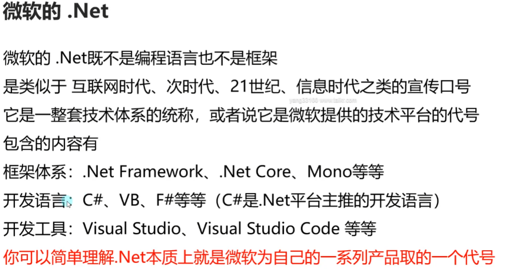

# .Net


## 跨平台
* Mono

* IL2CPP
    ```c#
    #region 知识点一 —— 安装Unity IL2CPP打包工具
    //在Unityhub中下载 IL2CPP打包相关工具
    #endregion

    #region 知识点二 —— IL2CPP打包存在的问题——类型裁剪
    //IL2CPP在打包时会自动对Unity工程的DLL进行裁剪，将代码中没有引用到的类型裁剪掉，
    //以达到减小发布后包的尺寸的目的。
    //然而在实际使用过程中，很多类型有可能会被意外剪裁掉，
    //造成运行时抛出找不到某个类型的异常。
    //特别是通过反射等方式在编译时无法得知的函数调用，在运行时都很有可能遇到问题

    //解决方案：
    //1.IL2CPP处理模式时，将PlayerSetting->Other Setting->Managed Stripping Level(代码剥离)设置为Low
    // Disable:Mono模式下才能设置为不删除任何代码
    // Low:默认低级别，保守的删除代码，删除大多数无法访问的代码，同时也最大程度减少剥离实际使用的代码的可能性
    // Medium:中等级别，不如低级别剥离谨慎，也不会达到高级别的极端
    // Hight:高级别，尽可能多的删除无法访问的代码，有限优化尺寸减小。如果选择该模式一般需要配合link.xml使用

    //2.通过Unity提供的link.xml方式来告诉Unity引擎，哪些类型是不能够被剪裁掉的
    //  在Unity工程的Assets目录中（或其任何子目录中）建立一个叫link.xml的XML文件
    #endregion

    #region 知识点三 —— IL2CPP打包存在的问题——泛型问题
    //我们上节课提到了IL2CPP和Mono最大的区别是 不能在运行时动态生成代码和类型
    //就是说 泛型相关的内容，如果你在打包生成前没有把之后想要使用的泛型类型显示使用一次
    //那么之后如果使用没有被编译的类型，就会出现找不到类型的报错

    //举例：List<A>和List<B>中A和B是我们自定义的类，
    //我能必须在代码中显示的调用过，IL2CPP才能保留List<A>和List<B>两个类型。
    //如果在热更新时我们调用List<C>，但是它之前并没有在代码中显示调用过，
    //那么这时就会出现报错等问题。主要就是因为JIT和AOT两个编译模式的不同造成的
    List<A> list = new List<A>();
    List<B> list2 = new List<B>();

    //解决方案：
    //泛型类：声明一个类，然后在这个类中声明一些public的泛型类变量
    //泛型方法：随便写一个静态方法，在将这个泛型方法在其中调用一下。这个静态方法无需被调用
    //这样做的目的其实就是在预言编译之前让IL2CPP知道我们需要使用这个内容
    #endregion

    #region 总结
    //对于我们目前开发的新项目
    //都建议大家使用IL2CPP脚本后处理模式来进行打包
    //主要原因是因为它的效率相对Mono较高，同时由于它自带裁剪功能，包的大小也会小一些
    //但是如果在测试时出现 类型无法识别等问题
    //需要用到我们这节课学习的知识点来解决这些问题
    #endregion
    ```
    * 示例
    ```c#
    namespace MyGame
    {
        public class Test
        {

        }

        public class A
        { }

    }

    public class A
    {

    }

    public class B
    {

    }

    public class C
    {

    }

    public class IL2CPP_Info
    {
        public List<A> list;
        public List<B> list2;
        public List<C> list3;

        public Dictionary<int, string> dic = new Dictionary<int, string>();

        public void Test<T>(T info)
        {

        }

        public static void Test()
        {
            IL2CPP_Info info = new IL2CPP_Info();
            info.Test<int>(1);
            info.Test<float>(1);
            info.Test<bool>(true);
        }

    }
    ```
    * link.xml
    ```xml
    <?xml version="1.0" encoding="UTF-8"?>

    <!--保存整个程序集-->
    <assembly fullname="UnityEngine" preserve="all"/>
    <!--没有“preserve”属性，也没有指定类型意味着保留所有-->
    <assembly fullname="UnityEngine"/>

    <!--完全限定程序集名称-->
    <assembly fullname="Assembly-CSharp, Version=0.0.0.0, Culture=neutral, PublicKeyToken=null">
    <type fullname="Assembly-CSharp.Foo" preserve="all"/>
    </assembly>

    <!--在程序集中保留类型和成员-->
    <assembly fullname="Assembly-CSharp">
    <!--保留整个类型-->
    <type fullname="MyGame.A" preserve="all"/>
    <!--没有“保留”属性，也没有指定成员 意味着保留所有成员-->
    <type fullname="MyGame.B"/>
    <!--保留类型上的所有字段-->
    <type fullname="MyGame.C" preserve="fields"/>
    <!--保留类型上的所有方法-->
    <type fullname="MyGame.D" preserve="methods"/>
    <!--只保留类型-->
    <type fullname="MyGame.E" preserve="nothing"/>
    <!--仅保留类型的特定成员-->
    <type fullname="MyGame.F">
        <!--类型和名称保留-->
        <field signature="System.Int32 field1" />
        <!--按名称而不是签名保留字段-->
        <field name="field2" />
        <!--方法-->
        <method signature="System.Void Method1()" />
        <!--保留带有参数的方法-->
        <method signature="System.Void Method2(System.Int32,System.String)" />
        <!--按名称保留方法-->
        <method name="Method3" />

        <!--属性-->
        <!--保留属性-->
        <property signature="System.Int32 Property1" />
        <property signature="System.Int32 Property2" accessors="all" />
        <!--保留属性、其支持字段（如果存在）和getter方法-->
        <property signature="System.Int32 Property3" accessors="get" />
        <!--保留属性、其支持字段（如果存在）和setter方法-->
        <property signature="System.Int32 Property4" accessors="set" />
        <!--按名称保留属性-->
        <property name="Property5" />

        <!--事件-->
        <!--保存事件及其支持字段（如果存在），添加和删除方法-->
        <event signature="System.EventHandler Event1" />
        <!--根据名字保留事件-->
        <event name="Event2" />
    </type>

    <!--泛型相关保留-->
    <type fullname="MyGame.G`1">
        <!--保留带有泛型的字段-->
        <field signature="System.Collections.Generic.List`1&lt;System.Int32&gt; field1" />
        <field signature="System.Collections.Generic.List`1&lt;T&gt; field2" />

        <!--保留带有泛型的方法-->
        <method signature="System.Void Method1(System.Collections.Generic.List`1&lt;System.Int32&gt;)" />
        <!--保留带有泛型的事件-->
        <event signature="System.EventHandler`1&lt;System.EventArgs&gt; Event1" />
    </type>


    <!--如果使用类型，则保留该类型的所有字段。如果类型不是用过的话会被移除-->
    <type fullname="MyGame.I" preserve="fields" required="0"/>

    <!--如果使用某个类型，则保留该类型的所有方法。如果未使用该类型，则会将其删除-->
    <type fullname="MyGame.J" preserve="methods" required="0"/>

    <!--保留命名空间中的所有类型-->
    <type fullname="MyGame.SomeNamespace*" />

    <!--保留名称中带有公共前缀的所有类型-->
    <type fullname="Prefix*" />

    </assembly>


    </linker>
    ```
# C#版本与Unity关系
```c#
#region 知识点一 各Unity版本支持的C#版本
//Unity 2021.2 —— C# 9
//Unity 2020.3 —— C# 8
//Unity 2019.4 —— C# 7.3
//Unity 2017   —— C# 6
//Unity 5.5    —— C# 4

//更多信息可以在Untiy官网说明查看
//https://docs.unity3d.com/2020.3/Documentation/Manual/CSharpCompiler.html
#endregion

#region 知识点二 为什么不同Unity版本支持的C#版本不同？
//之所以不同Unity版本支持的C#版本不同
//主要是不同Unity版本 使用的 C#编译器和脚本运行时版本不同

//比如：Unity2020.3 使用的脚本运行时版本等效于.Net 4.6，编译器为Roslyn（罗斯林编译器）
//所以随着Unity的更新，它一般会采用较新的 编译器和运行时版本
//新版本的脚本运行时将为Unity带来了大量的新版C#功能和.NET的功能
//也就意味着它可以支持更高版本的C#
#endregion

#region 知识点三 不同版本的C#对于我们来说有什么意义？
//我们可以根据不同Unity支持的对应C#版本
//来判断我们是否可以使用C#各版本中的一些新功能用来编程
//虽然即使我们没有掌握这些功能也能正常进行开发
//但是往往新功能可以让我们写出更简单明了的代码
//可以节约代码量
#endregion

#region 知识点四 Unity的.Net API兼容级别
//在PlayerSetting->Other Setting->Api Compatibility Level中
//我们可以设置.Net API的兼容级别
//主要有两种选择
//.Net 4.x（特殊需求时）:
//具备较为完整的.Net API，甚至包含了一些无法跨平台的API
//如果你的应用主要针对Windows平台，并且会使用到.Net Standard 2.0中没有的功能时
//会选择使用它

//.Net Standard 2.0（建议使用）:
//是一个.Net标准API集合，相对.Net 4.x包含更少的内容，可以减小最终可执行文件大小
//它具有更好的跨平台支持

//.Net Standard 2.0 配置文件大小是.Net 4.x配置文件的一半
//所以我们尽量使用.Net Standard 2.0
#endregion

#region 总结
//由于新版本Unity会同时更新
//Scripting Runtime(脚本运行时)和 C#编译器的版本
//所以随着Unity版本的提升
//我们能够使用到的C#的新功能和新特性也会增加
//我们要大概了解自己正在使用的Unity版本能够支持的C#版本
//这样在开发时我们就能使用一些对应版本的新功能和特性了
//Unity 2021.2 —— C# 9
//Unity 2020.3 —— C# 8
//Unity 2019.4 —— C# 7.3
//Unity 2017   —— C# 6
//Unity 5.5    —— C# 4

//并且，对于.Net API兼容级别的认识是
//正常情况下 我们都会使用.Net Standard
#endregion
```

# c#各版本新功能和语法
## C# 1~4
```c#
public class Test1
{
    public void TestTest()
    {

    }
}

public class Test2
{
    public void TestTest()
    {

    }
}

public class Lesson3 : MonoBehaviour
{
    // Start is called before the first frame update
    void Start()
    {
        #region 知识点一 最低支持的C#版本
        //只要是Unity 5.5及以上的版本
        //就支持C# 4版本
        #endregion

        #region 知识点二 C# 1~4的功能和语法有哪些？
        //注意：在这里我不会提及所有的内容
        //     主要会提及Unity开发中会用到的一些功能和特性
        //     对于一些不适合在Unity中使用的内容我会省略

        //C# 1 —— 委托、事件（C#进阶套课）
        //C# 2 —— 泛型、匿名方法、迭代器、可空类型（C#进阶套课）
        //C# 3 ——
        //隐式类型、对象集合初始化、Lambda表达式、匿名类型（C#进阶套课）
        //自动实现属性、拓展方法、分部类（C#核心套课）
        //Linq相关的表达式树（以后专门讲）
        //C# 4 ——
        //泛型的协变和逆变（C#进阶套课）
        //命名和可选参数
        //动态类型
        #endregion

        #region 知识点三 补充未讲解全面的内容 命名和可选参数
        //有了命名参数，我们将不用匹配参数在所调用方法中的顺序
        //每个参数可以按照参数名字进行指定
        Test(1, 1.2f, true);
        Test(f: 3.3f, i: 5, b: false);
        Test(b: false, f: 3.4f, i: 3);

        //命名参数可以配合可选参数使用,让我们做到跳过其中的默认参数直接赋值后面的默认参数
        Test2(1, true, "234");
        Test2(1, s: "234");

        //好处：可以让我们更方便的调用函数，少写一些重载函数
        #endregion

        #region 知识点四 补充未讲解的内容 动态类型
        //关键词：dynamic
        //作用：通过dynamic类型标识变量的使用和对其成员的引用绕过编译时类型检查
        //     改为在运行时解析这些操作。
        //     在大多数情况下，dynamic类型和object类型行为类似
        //     任何非Null表达式都可以转换为dynamic类型。
        //     dynamic类型和object类型不同之处在于，
        //     编译器不会对包含类型 dynamic 的表达式的操作进行解析或类型检查
        //     编译器将有关该操作信息打包在一起，之后这些信息会用于在运行时评估操作。
        //     在此过程中，dynamic 类型的变量会编译为 object 类型的变量。
        //     因此，dynamic 类型只在编译时存在，在运行时则不存在。

        //注意：1.使用dynamic功能 需要将Unity的.Net API兼容级别切换为.Net 4.x
        //     2.IL2CPP 不支持 C# dynamic 关键字。它需要 JIT 编译，而 IL2CPP 无法实现
        //     3.动态类型是无法自动补全方法的，我们在书写时一定要保证方法的拼写正确性
        //        所以该功能我们只做了解，不建议大家使用

        //举例说明：
        dynamic dyn = 1;
        object obj = 2;

        dyn += 2;

        print(obj.GetType());
        print(dyn.GetType());
        print(dyn);

        object t = new Test1();
        dynamic tmp = t;
        tmp.TestTest();

        //好处：动态类型可以节约代码量，当不确定对象类型，但是确定对象成员时，可以使用动态类型
        //     通过反射处理某些功能时，也可以考虑使用动态类型来替换它
        #endregion

        #region 总结
        //C# 1~4版本中的功能和语法
        //大多数我们已经在C#四部曲中学习完毕
        //命名和可选参数可以帮助我们少写一些重载函数
        //动态类型可以让我们在某些情况下节约代码量
        //但是由于要使用.Net 4.x，并且IL2CPP不支持，所以不建议使用它，但是如果有特殊需求不得不用，那我们只有退而求其次
        #endregion
    }

    public void Test(int i, float f, bool b)
    {

    }

    public void Test2(int i , bool b = true, string s = "123")
    {

    }

}

```

## C#5
* 线程池
    ```c#
    #region 知识点一 C#5的新增功能和语法有哪些
    //1.调用方信息特性（C#进阶套课——特性）
    //2.异步方法async和await

    //在学习异步方法async和await之前
    //我们必须补充一些知识点
    //1.线程和线程池
    //2.Task类
    //我们这节课先来回顾和学习线程和线程池
    #endregion

    #region 知识点二 回顾知识点——线程
    //1.Unity支持多线程
    //2.Unity中开启的多线程不能使用主线程中的对象
    //3.Unity中开启多线程后一定记住关闭
    //t = new Thread(()=> {
    //    while (true)
    //    {
    //        print("123");
    //        Thread.Sleep(1000);
    //    }
    //});
    //t.Start();
    //print("主线程执行");
    #endregion

    #region 知识点三 补充知识点——线程池
    //命名空间：System.Threading
    //类名：ThreadPool（线程池）

    //在多线程的应用程序开发中，频繁的创建删除线程会带来性能消耗，产生内存垃圾
    //为了避免这种开销C#推出了 线程池ThreadPool类

    //ThreadPool中有若干数量的线程，如果有任务需要处理时，会从线程池中获取一个空闲的线程来执行任务
    //任务执行完毕后线程不会销毁，而是被线程池回收以供后续任务使用
    //当线程池中所有的线程都在忙碌时，又有新任务要处理时，线程池才会新建一个线程来处理该任务，
    //如果线程数量达到设置的最大值，任务会排队，等待其他任务释放线程后再执行
    //线程池能减少线程的创建，节省开销，可以减少GC垃圾回收的触发

    //线程池相当于就是一个专门装线程的缓存池（Unity小框架套课中有对缓存池的详细讲解）
    //优点：节省开销，减少线程的创建，进而有效减少GC触发
    //缺点：不能控制线程池中线程的执行顺序，也不能获取线程池内线程取消/异常/完成的通知

    //ThreadPool是一个静态类
    //里面提供了很多静态成员
    //其中相对重要的方法有

    //1.获取可用的工作线程数和I/O线程数
    int num1;
    int num2;
    ThreadPool.GetAvailableThreads(out num1, out num2);
    print(num1);
    print(num2);


    //3.设置线程池中可以同时处于活动状态的 工作线程的最大数目和I/O线程的最大数目
    //  大于次数的请求将保持排队状态，知直到线程池线程变为可用
    //  更改成功返回true，失败返回false
    if(ThreadPool.SetMaxThreads(20, 20))
    {
        print("更改成功");
    }

    //2.获取线程池中工作线程的最大数目和I/O线程的最大数目
    ThreadPool.GetMaxThreads(out num1, out num2);
    print(num1);
    print(num2);

    //5.设置 工作线程的最小数目和I/O线程的最小数目
    if(ThreadPool.SetMinThreads(5, 5))
    {
        print("设置成功");
    }
    //4.获取线程池中工作线程的最小数目和I/O线程的最小数目
    ThreadPool.GetMinThreads(out num1, out num2);
    print(num1);
    print(num2);

    //6.将方法排入队列以便执行，当线程池中线程变得可用时执行

    //ThreadPool.QueueUserWorkItem((obj) =>
    //{
    //    print(obj);
    //    print("开启了一个线程");
    //}, "123452435345");

    for (int i = 0; i < 10; i++)
    {
        ThreadPool.QueueUserWorkItem((obj) =>
        {
            print("第" + obj + "个任务");
        }, i);
    }

    print("主线程执行");
    #endregion

    #region 总结
    //线程池 是一个C#写好的 装线程的缓存池

    //优点：可以在我们频繁的需要创建删除线程时提高性能，节约内存
    //缺点：不能控制线程池中线程的执行顺序，也不能获取线程池内线程取消/异常/完成的通知
    #endregion
    ```
* task
    ```c#
    #region 知识点一 认识Task
    //命名空间：System.Threading.Tasks
    //类名：Task
    //Task顾名思义就是任务的意思
    //Task是在线程池基础上进行的改进，它拥有线程池的优点，同时解决了使用线程池不易控制的弊端
    //它是基于线程池的优点对线程的封装，可以让我们更方便高效的进行多线程开发

    //简单理解：
    //Task的本质是对线程Thread的封装，它的创建遵循线程池的优点，并且可以更方便的让我们控制线程
    //一个Task对象就是一个线程
    #endregion

    #region 知识点二 创建无返回值Task的三种方式
    //1.通过new一个Task对象传入委托函数并启动
    //Task t1 = new Task(() =>
    //{
    //    int i = 0;
    //    while (isRuning)
    //    {
    //        print("方式一:" + i);
    //        ++i;
    //        Thread.Sleep(1000);
    //    }
    //});
    //t1.Start();

    //2.通过Task中的Run静态方法传入委托函数
    //Task t2 = Task.Run(() =>
    //{
    //    int i = 0;
    //    while (isRuning)
    //    {
    //        print("方式二:" + i);
    //        ++i;
    //        Thread.Sleep(1000);
    //    }
    //});

    //3.通过Task.Factory中的StartNew静态方法传入委托函数
    //Task t3 = Task.Factory.StartNew(() =>
    //{
    //    int i = 0;
    //    while (isRuning)
    //    {
    //        print("方式三:" + i);
    //        ++i;
    //        Thread.Sleep(1000);
    //    }
    //});

    #endregion

    #region 知识点三 创建有返回值的Task
    //1.通过new一个Task对象闯入委托函数并启动
    //t1 = new Task<int>(() =>
    //{
    //    int i = 0;
    //    while (isRuning)
    //    {
    //        print("方式一:" + i);
    //        ++i;
    //        Thread.Sleep(1000);
    //    }
    //    return 1;
    //});
    //t1.Start();

    ////2.通过Task中的Run静态方法传入委托函数
    //t2 = Task.Run<string>(() =>
    //{
    //    int i = 0;
    //    while (isRuning)
    //    {
    //        print("方式二:" + i);
    //        ++i;
    //        Thread.Sleep(1000);
    //    }
    //    return "1231";
    //});

    ////3.通过Task.Factory中的StartNew静态方法传入委托函数
    //t3 = Task.Factory.StartNew<float>(() =>
    //{
    //    int i = 0;
    //    while (isRuning)
    //    {
    //        print("方式三:" + i);
    //        ++i;
    //        Thread.Sleep(1000);
    //    }
    //    return 4.5f;
    //});


    ////获取返回值
    ////注意：
    ////Resut获取结果时会阻塞线程
    ////即如果task没有执行完成
    ////会等待task执行完成获取到Result
    ////然后再执行后边的代码,也就是说 执行到这句代码时 由于我们的Task中是死循环 
    ////所以主线程就会被卡死
    ////print(t1.Result);
    ////print(t2.Result);
    ////print(t3.Result);

    //print("主线程执行");
    #endregion

    #region 知识点四 同步执行Task
    //刚才我们举的例子都是通过多线程异步执行的
    //如果你希望Task能够同步执行
    //只需要调用Task对象中的RunSynchronously方法
    //注意：需要使用 new Task对象的方式，因为Run和StartNew在创建时就会启动

    //Task t = new Task(()=> {
    //    Thread.Sleep(1000);
    //    print("哈哈哈");
    //});
    ////t.Start();
    //t.RunSynchronously();
    //print("主线程执行");
    //不Start 而是 RunSynchronously
    #endregion

    #region 知识点五 Task中线程阻塞的方式（任务阻塞）
    //1.Wait方法：等待任务执行完毕，再执行后面的内容
    Task t1 = Task.Run(() =>
    {
        for (int i = 0; i < 5; i++)
        {
            print("t1:" + i);
        }
    });

    Task t2 = Task.Run(() =>
    {
        for (int i = 0; i < 20; i++)
        {
            print("t2:" + i);
        }
    });
    //t2.Wait();

    //2.WaitAny静态方法：传入任务中任意一个任务结束就继续执行
    //Task.WaitAny(t1, t2);

    //3.WaitAll静态方法：任务列表中所有任务执行结束就继续执行
    //Task.WaitAll(t1, t2);

    //print("主线程执行");
    #endregion

    #region 知识点六 Task完成后继续其它Task（任务延续）
    //1.WhenAll静态方法 + ContinueWith方法：传入任务完毕后再执行某任务
    //Task.WhenAll(t1, t2).ContinueWith((t) =>
    //{
    //    print("一个新的任务开始了");
    //    int i = 0;
    //    while (isRuning)
    //    {
    //        print(i);
    //        ++i;
    //        Thread.Sleep(1000);
    //    }
    //});

    //Task.Factory.ContinueWhenAll(new Task[] { t1, t2 }, (t) =>
    //{
    //    print("一个新的任务开始了");
    //    int i = 0;
    //    while (isRuning)
    //    {
    //        print(i);
    //        ++i;
    //        Thread.Sleep(1000);
    //    }
    //});

    //2.WhenAny静态方法 + ContinueWith方法：传入任务只要有一个执行完毕后再执行某任务
    //Task.WhenAny(t1, t2).ContinueWith((t) =>
    //{
    //    print("一个新的任务开始了");
    //    int i = 0;
    //    while (isRuning)
    //    {
    //        print(i);
    //        ++i;
    //        Thread.Sleep(1000);
    //    }
    //});

    //Task.Factory.ContinueWhenAny(new Task[] { t1, t2 }, (t) =>
    //{
    //    print("一个新的任务开始了");
    //    int i = 0;
    //    while (isRuning)
    //    {
    //        print(i);
    //        ++i;
    //        Thread.Sleep(1000);
    //    }
    //});
    #endregion

    #region 知识点七 取消Task执行
    //方法一：通过加入bool标识 控制线程内死循环的结束

    //方法二：通过CancellationTokenSource取消标识源类 来控制
    //CancellationTokenSource对象可以达到延迟取消、取消回调等功能

    c = new CancellationTokenSource();
    //延迟取消
    c.CancelAfter(5000);
    //取消回调
    c.Token.Register(() =>
    {
        print("任务取消了");
    });
    Task.Run(() =>
    {
        int i = 0;
        while (!c.IsCancellationRequested)
        {
            print("计时：" + i);
            ++i;
            Thread.Sleep(1000);
        }
    });

    //延迟取消

    #endregion

    #region 总结
    //1.Task类是基于Thread的封装
    //2.Task类可以有返回值，Thread没有返回值
    //3.Task类可以执行后续操作，Thread没有这个功能
    //4.Task可以更加方便的取消任务，Thread相对更加单一
    //5.Task具备ThreadPool线程池的优点，更节约性能
    #endregion
    ```
    * 异步方法async await
    ```c#
    #region 知识点一 什么是同步和异步
    //同步和异步主要用于修饰方法
    //同步方法：
    //当一个方法被调用时，调用者需要等待该方法执行完毕后返回才能继续执行
    //异步方法：
    //当一个方法被调用时立即返回，并获取一个线程执行该方法内部的逻辑，调用者不用等待该方法执行完毕

    //简单理解异步编程
    //我们会把一些不需要立即得到结果且耗时的逻辑设置为异步执行，这样可以提高程序的运行效率
    //避免由于复杂逻辑带来的的线程阻塞
    #endregion

    #region 知识点二 什么时候需要异步编程
    //需要处理的逻辑会严重影响主线程执行的流畅性时
    //我们需要使用异步编程
    //比如：
    //1.复杂逻辑计算时
    //2.网络下载、网络通讯
    //3.资源加载时
    //等等
    #endregion

    #region 知识点三 异步方法async和await
    //async和await一般需要配合Task进行使用
    //async用于修饰函数、lambda表达式、匿名函数
    //await用于在函数中和async配对使用,主要作用是等待某个逻辑结束
    //此时逻辑会返回函数外部继续执行，直到等待的内容执行结束后，再继续执行异步函数内部逻辑
    //在一个async异步函数中可以有多个await等待关键字
    //TestAsync();

    //print("主线程逻辑执行");

    //使用async修饰异步方法
    //1.在异步方法中使用await关键字（不使用编译器会给出警告但不报错），否则异步方法会以同步方式执行
    //2.异步方法名称建议以Async结尾
    //3.异步方法的返回值只能是void、Task、Task<>
    //4.异步方法中不能声明使用ref或out关键字修饰的变量

    //使用await等待异步内容执行完毕（一般和Task配合使用）
    //遇到await关键字时
    //1.异步方法将被挂起
    //2.将控制权返回给调用者
    //3.当await修饰内容异步执行结束后，继续通过调用者线程执行后面内容

    //举例说明
    //1.复杂逻辑计算（利用Task新开线程进行计算 计算完毕后再使用 比如复杂的寻路算法）
    //CalcPathAsync(this.gameObject, Vector3.zero);

    //2.计时器
    Timer();
    print("主线程逻辑执行");

    //3.资源加载(Addressables的资源异步加载是可以使用async和await的)

    //注意：Unity中大部分异步方法是不支持异步关键字async和await的，我们只有使用协同程序进行使用
    //虽然官方 不支持 但是 存在第三方的工具（插件）可以让Unity内部的一些异步加载的方法 支持 异步关键字
    //https://github.com/svermeulen/Unity3dAsyncAwaitUtil

    //虽然Unity中的各种异步加载对异步方法支持不太好
    //但是当我们用到.Net 库中提供的一些API时，可以考虑使用异步方法
    //1.Web访问：HttpClient
    //2.文件使用：StreamReader、StreamWriter、JsonSerializer、XmlReader、XmlWriter等等
    //3.图像处理：BitmapEncoder、BitmapDecoder
    //一般.Net 提供的API中 方法名后面带有 Async的方法 都支持异步方法
    #endregion

    #region 总结 
    //异步编程async和await是一个比较重要的功能
    //我们可以利用它配合Task进行异步编程

    //虽然Unity自带的一些异步加载原本是不支持 异步方法关键字的
    //但是可以利用别人写好的第三方工具 让他们支持 大家可以根据自己的需求 选择性使用

    #endregion
    ```
    ```c#
    CancellationTokenSource source;

    public async void TestAsync()
    {
        //1
        print("进入异步方法");
        //2
        await Task.Run(() =>
        {
            Thread.Sleep(5000);
        });
        //3
        print("异步方法后面的逻辑");
    }

    public async void CalcPathAsync(GameObject obj, Vector3 endPos)
    {
        print("开始处理寻路逻辑");
        int value = 10;
        await Task.Run(() =>
        {
            //处理复杂逻辑计算 我这是通过 休眠来模拟 计算的复杂性
            Thread.Sleep(1000);
            value = 50;
            //是多线程 意味着我们不能在 多线程里 去访问 Unity主线程场景中的对象
            //这样写会报错
            //print(obj.transform.position);
        });

        print("寻路计算完毕 处理逻辑" + value);
        obj.transform.position = Vector3.zero;
    }

    public async void Timer()
    {
        UnityWebRequest q = UnityWebRequest.Get("");
        source = new CancellationTokenSource();
        int i = 0;
        while (!source.IsCancellationRequested)
        {
            print(i);
            await Task.Delay(1000);
            ++i;
        }
    }

    // Update is called once per frame
    void Update()
    {
        if (Input.GetKeyDown(KeyCode.Space))
            source.Cancel();
    }
    ```