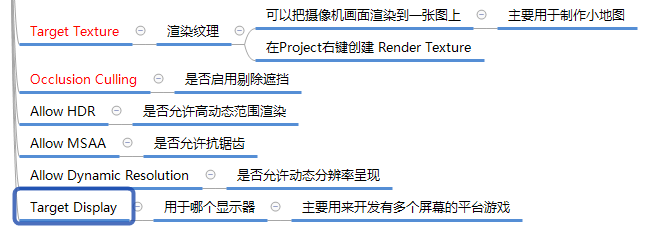
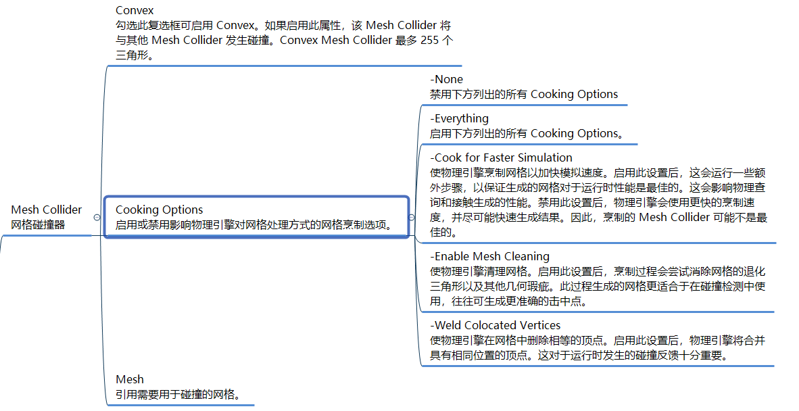
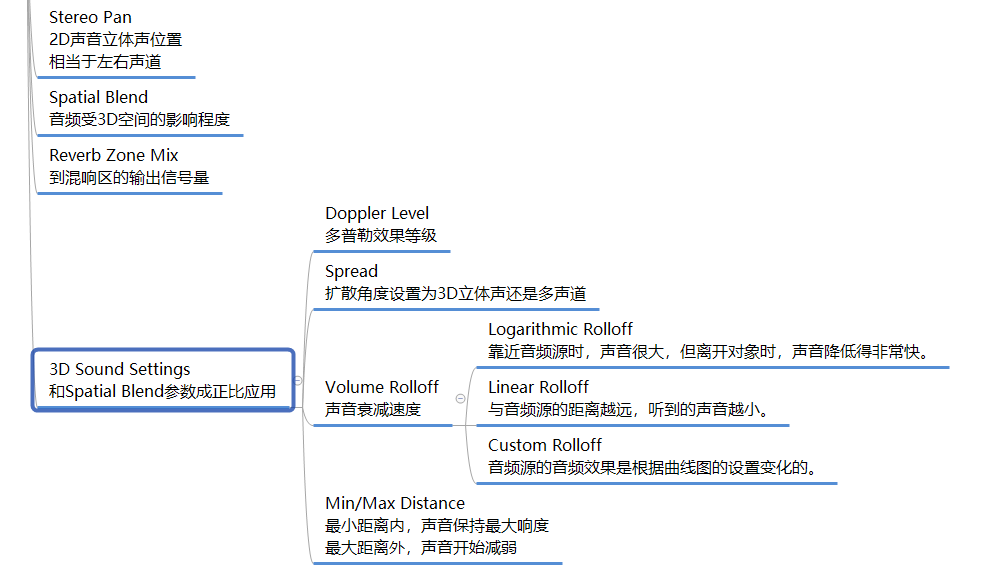

# 过程文件夹


# scene
## 坐标轴


## 操作


# 资源类型


# 工具栏


# 父子关系


# 反射机制
```
Unity引擎本质是一个软件
使用它时是处于运行中的
我们是在一个运行中的软件里制作游戏的
Unity开发的本质就：
在Unity引擎的基础上，利用反射和引擎提供的各种功能进行的拓展开发
```

# 游戏场景
```
游戏场景文件后缀为.unity
它的本质就是一个配置文件
Unity有一套自己识别处理它的机制
但是本质就是把场景对象相关信息读取出来通过反射来创建各个对象关联各个脚本对象
```

# 脚本
## 创建规则


## MonoBehavior基类


## 不继承MonoBehavior的类


## 习题


# Unity打印信息的方法


# 生命周期函数

## 帧的概念
```
Unity底层已经帮助我们做好了死循环
我们需要学习Unity的生命周期函数
利用它做好的规则来执行我们的游戏逻辑就行了
```


## 生命周期函数
```c#
//概念
所有继承MonoBehavior的脚本最终都会挂载到Gameobject游戏对象上

生命周期函数就是该脚本对象依附的Gameobject对象从出生到消亡整个生命周期中
会通过反射自动调用的一些特殊函数

Unity帮助我们记录了一个Gameobject对象依附了哪些脚本
会自动的得到这些对象，通过反射去执行一些固定名字的函数


//注意
生命周期函数的访问修饰符一般为private和protected
因为不需要在外部自己调用生命周期函数，都是unity自己帮助我们调用的

一般LateUpdate是用来处理摄像机位置更新相关内容的
Update和LateUpdate之间Unity进了一些处理处理我们动画相关的更新，如果把摄像机位置更新放在Update可能会出现错误


支持继承多态
```


## 习题


# inspector窗口可编辑变量
```c#
//inspector显示的可编辑变量就是脚本的成员变量

//private和protected无法显示编辑
//通过特性让private 和 protected 显示和编辑
可以通过 强制序列化字段特性 [SerializeField]
所谓序列化就是把一个对象保存到一个文件或数据库字段中

//通过特性让public 不能显示和编辑
[HideInInspector]

//大部分类型能显示编辑

//通过特性让自定义类型被访问
[System.Serializable]
```
### 一些辅助特性
```c#
//1.分组说明特性Header
//为成员分组
//Header特性
//[Header("分组说明")]
[Header("基础属性")]
public int age;
public bool sex;
[Header("战斗属性")]
public int atk;
public int def;

//2.悬停注释Tooltip
//为变量添加说明
//[Tooltip("说明内容")]
[Tooltip("闪避")]
public int miss;

//3.间隔特性 Space()
//让两个字段间出现间隔
//[Space()]
[Space()]
public int crit;

//4.修饰数值的滑条范围Range
//[Range(最小值, 最大值)]
[Range(0,10)]
public float luck;

//5.多行显示字符串 默认不写参数显示3行
//写参数就是对应行
//[Multiline(4)]
[Multiline(5)]
public string tips;

//6.滚动条显示字符串 
//默认不写参数就是超过3行显示滚动条
//[TextArea(3, 4)]
//最少显示3行，最多4行，超过4行就显示滚动条
[TextArea(3,4)]
public string myLife;

//7.为变量添加快捷方法 ContextMenuItem
//参数1 显示按钮名
//参数2 方法名 不能有参数
//[ContextMenuItem("显示按钮名", "方法名")]
[ContextMenuItem("重置钱", "Test")]
public int money;
private void Test()
{
    money = 99;
}

//8.为方法添加特性能够在Inspector中执行
//[ContextMenu("测试函数")]
[ContextMenu("哈哈哈哈")]
private void TestFun()
{
    print("测试方法");
}
```
```
注意：
//1.Inspector窗口中的变量关联的就是对象的成员变量，运行时改变他们就是在改变成员变量
//2.拖曳到GameObject对象后 再改变脚本中变量默认值 界面上不会改变
//3.运行中修改的信息不会保存
```

# Monobehavior
```c#
 #region 知识点一 重要成员
//1.获取依附的GameObject
print(this.gameObject.name);

//2.获取依附的GameObject的位置信息
//得到对象位置信息
print(this.transform.position);//位置
print(this.transform.eulerAngles);//角度
print(this.transform.lossyScale);//缩放大小
//这种写法和上面是一样的效果 都是得到依附的对象的位置信息
//this.gameObject.transform

//3.获取脚本是否激活
this.enabled = false;

//获取别的脚本对象 依附的gameobject和 transform位置信息
print(otherLesson3.gameObject.name);
print(otherLesson3.transform.position);
#endregion

#region 知识点二 重要方法
//得到依附对象上挂载的其它脚本

//1.得到自己挂载的单个脚本
//根据脚本名获取
//获取脚本的方法 如果获取失败 就是没有对应的脚本 会默认返回空
Lesson3_Test t = this.GetComponent("Lesson3_Test") as Lesson3_Test;
print(t);
//根据Type获取
t = this.GetComponent(typeof(Lesson3_Test)) as Lesson3_Test;
print(t);
//根据泛型获取 建议使用泛型获取 因为不用二次转换
t = this.GetComponent<Lesson3_Test>();
if( t != null )
{
    print(t);
}

//只要你能得到场景中别的对象或者对象依附的脚本
//那你就可以获取到它的所有信息

//2.得到自己挂载的多个脚本
Lesson3[] array = this.GetComponents<Lesson3>();
print(array.Length);
List<Lesson3> list = new List<Lesson3>();
this.GetComponents<Lesson3>(list);
print(list.Count);

//3.得到子对象挂载的脚本(它默认也会找自己身上是否挂载该脚本)
//函数是有一个参数的 默认不传 是false 意思就是 如果子对象失活 是不会去找这个对象上是否有某个脚本的
//如果传true 即使 失活 也会找
//得子对象 挂载脚本 单个
t = this.GetComponentInChildren<Lesson3_Test>(true);
print(t);

//得子对象 挂载脚本 多个
Lesson3_Test[] lts = this.GetComponentsInChildren<Lesson3_Test>(true);
print(lts.Length);

List<Lesson3_Test> list2 = new List<Lesson3_Test>();
this.GetComponentsInChildren<Lesson3_Test>(true, list2);
print(list2.Count);

//4.得到父对象挂载的脚本(它默认也会找自己身上是否挂载该脚本)
t = this.GetComponentInParent<Lesson3_Test>();
print(t);
lts = this.GetComponentsInParent<Lesson3_Test>();
print(lts.Length);
//它也有list的 省略不写了 和上面是一样的套路

//5.尝试获取脚本
Lesson3_Test l3t;
//提供了一个更加安全的 获取单个脚本的方法 如果得到了 会返回true
//然后在来进行逻辑处理即可
if(this.TryGetComponent<Lesson3_Test>(out l3t))
{
    //逻辑处理
}

#endregion
```

# GameObject
```c#
#region 知识点一 GameObject中的成员变量
//名字
print(this.gameObject.name);
this.gameObject.name = "Lesson4唐老狮改名";
print(this.gameObject.name);
//是否激活
print(this.gameObject.activeSelf);
//是否是静态
print(this.gameObject.isStatic);
//层级
print(this.gameObject.layer);
//标签
print(this.gameObject.tag);
//transform
//this.transform 上一节课讲解的 通过Mono去得到的依附对象的GameObject的位置信息
//他们得到的信息是一样 都是依附的GameObject的位置信息
print(this.gameObject.transform.position);
#endregion

#region 知识点二 GameObject中的静态方法
//创建自带几何体
//只要得到了一个GameObject对象 我就可以得到它身上挂在的任何脚本信息
//通过obj.GetComponent来得取
GameObject obj = GameObject.CreatePrimitive(PrimitiveType.Cube);
obj.name = "唐老狮创建的立方体";

//查找对象相关的知识
//两种找单个对象的共同点:
//1.无法找到失活的对象的 
//  只能找到 激活的对象

//2.如果场景中 存在多个满足条件的对象
//  我们无法准确确定找到的是谁，随机找到对象

//1查找单个对象
//通过对象名查找
//这个查找效率比较低下  因为他会在场景中的所有对象去查找
//没有找到 就会返回null
GameObject obj2 = GameObject.Find("唐老狮");
if( obj2 != null )
{
    print(obj2.name);
}
else
{
    print("没有找到对应对象");
}
//通过tag来查找对象
//GameObject obj3 = GameObject.FindWithTag("Player");
//该方法和上面这个方法 效果一样 只是名字不一样而已
GameObject obj3 = GameObject.FindGameObjectWithTag("Player");
if (obj3 != null)
{
    print("根据tag找的对象" + obj3.name);
}
else
{
    print("根据tag没有找到对应对象");
}

//得到某一个单个对象 目前有2种方式了
//1.是public从外部面板拖 进行关联
//2.通过API去找

//2查找多个对象
//找多个对象的API 只能是通过tag去找多个 通过名字 是没有找多个的方法的

//通过tag找到多个对象
//它也是 只能找到 激活对象 无法找到失活对象
GameObject[] objs = GameObject.FindGameObjectsWithTag("Player");
print("找到tag为Player对象的个数" + objs.Length);

//还有几个查找对象相关是用的比较少的方法 是GameObject父类 Object提供的方法
//引出额外知识点 Unity中的Object和C#中的万物之父的区别
//Unity里面的Object 不是指的万物之父object
//Unity里的Object 命名空间在UnityEngine中的 Object类 也是集成万物之父的一个自定义类
//C#中的Object 命名空间是在System中的 

//它可以找到场景中挂载的某一个脚本对象
//效率更低 上面的GameObject.Find 和通过FindWithTag找 只是遍历对象
//这个方法 不仅要遍历对象 还要遍历对象上挂载的脚本 
Lesson4 o = GameObject.FindObjectOfType<Lesson4>();
print(o.gameObject.name);

//实例化对象（克隆对象）的方法
//实例化(克隆)对象 它的作用 是根据一个GameObject对象 创建出一个和它一模一样的对象
GameObject obj5 = GameObject.Instantiate(myObj);
Instantiate(object，position，Rotation)
//以后学了更多知识点 就可以在这操作obj5
//如果你继承了 MonoBehavior 其实可以不用写GameObject一样可以使用
//因为 这个方法时Unity里面的 Object基类提供给我们的 所以可以直接用
//Instantiate(myObj);

//删除对象的方法
GameObject.Destroy(myObj2);
//第二个参数 代表延迟几秒钟删除
GameObject.Destroy(obj5, 5);
//Destroy不仅可以删除对象 还可以删除脚本
//GameObject.Destroy(this);

//删除对象有两种作用
//1.是删除指定的一个游戏对象
//2.是删除一个指定的脚本对象
//注意：这个Destroy方法 不会马上移除对象 只是给这个对象加了一个移除标识 
//     一般情况下 它会在下一帧时把这个对象移除并从内存中移除

//如果没有特殊需求 就是一定要马上移除一个对象的话 
//建议使用上面的 Destroy方法 因为 是异步的 降低卡顿的几率
//下面这个方法 就是立即把对象 从内存中移除了 
//GameObject.DestroyImmediate(myObj);

//如果是继承MonoBehavior的类 不用写GameObject
//Destroy(myObj2);
//DestroyImmediate(myObj);

//过场景不移除 
//默认情况 在切换场景时 场景中对象都会被自动删除掉
//如果你希望某个对象 过场景不被移除 
//下面这句代码 就是不想谁过场景被移除 就传谁 
//一般都是传 依附的GameObject对象
//比如下面这句代码的意思 就是自己依附的GameObject对象 过场景不被删除
GameObject.DontDestroyOnLoad(this.gameObject);
//如果继承MOnoBehavior也可以直接写
//DontDestroyOnLoad(this.gameObject);
#endregion

#region 知识点三 GameObject中的成员方法
//创建空物体
//new一个GameObject就是在创建一个空物体
GameObject obj6 = new GameObject();
GameObject obj7 = new GameObject("唐老狮创建的空物体");
GameObject obj8 = new GameObject("顺便加脚本的空物体", typeof(Lesson2),typeof(Lesson1));

//为对象添加脚本
//继承MOnoBehavior的脚本 是不能够去new 
//如果想要动态的添加继承MonoBehavior的脚本 在某一个对象上
//直接使用GameObject提供的方法即可
Lesson1 les1 = obj6.AddComponent(typeof(Lesson1)) as Lesson1;
//用泛型更方便
Lesson2 les2 = obj6.AddComponent<Lesson2>();
//通过返回值 可以得到加入的脚本信息
//来进行一些处理

//得到脚本的成员方 和继承Mono的类得到脚本的方法 一模一样  

//标签比较
//下面两种比较的方法 是一样的
if(this.gameObject.CompareTag("Player"))
{
    print("对象的标签 是 Player");
}
if(this.gameObject.tag == "Player")
{
    print("对象的标签 是 Player");
}

//设置激活失活
//false 失活
//true 激活
obj6.SetActive(false);
obj7.SetActive(false);
obj8.SetActive(false);

//次要的成员方法 了解即可 不建议使用
//效率比较低
//通过广播或者发送消息的形式 让自己或者别人 执行某些行为方法

//通知自己 执行什么行为
//命令自己 去执行这个TestFun这个函数 会在自己身上挂在的所有脚本去找这个名字的函数
//它会去找到 自己身上所有的脚本 有这个名字的函数去执行
this.gameObject.SendMessage("TestFun");
this.gameObject.SendMessage("TestFun2", 199);

//广播行为 让自己和自己的子对象执行
this.gameObject.BroadcastMessage("函数名");

//向父对象和自己发送消息 并执行
this.gameObject.SendMessageUpwards("函数名");
#endregion
```

# Time
```c#
//时间缩放比例
1.时间停止
Time.timeScale = 0;

2.恢复正常
Time.timeScale = 1;

3.二倍速 以此类推
Time.timeScale = 2；

//帧间隔时间：最近的一帧花费时长 (s),主要用来计算位移
路程=时间*速度
根据需求选择参与计算的间隔时间
如果希望游戏暂停时就不动的那就使用deltaTime
如果希望不受暂停影响unscaledDeltaTime

1.受scale影响
Time.deltaTime

2.不受scale影响的
Time.unscaledDeltaTime

//游戏计时(从游戏开始到现在的时间)
1.受scale影响
Time.time

2.不受scale影响的
Time.unscaledTime

//物理帧间隔时间，一般写在FixedUpdate
void FixedUpdate
{
    1.受scale影响
    Time.fixedDeltaTime

    2.不受scale影响的
    Time.fixedUnscaledDeltaTime
}

//帧数，从游戏开始经过的帧数
Time.frameCount
```
# Transform
游戏对象(Gameobject)位移、旋转、缩放、父子关系、坐标转换等相关操作都由它处理

它是unity提供的极其重要的类

## 位置和位移
### Vector3
```c#
结构体Vector3主要是用来表示三维坐标系中的一个点或者一个向量
//申明
Vector3 v = new Vector3(); //v.x, v.y, x.z
Vector3 v = new Vector3(10,10);//10 10 0
Vector3 v = new Vector3(10,10,5);//10 10 5

// 重载+ - * /

//常用向量
Vector3.zero     // 0 0 0
Vector3.right    // 1 0 0
Vcetor3.left     //-1 0 0
Vcetor3.forward  //0 0 1
Vcetor3.backword //0 0 -1
Vcetor3.up       //0 1 0
Vcetor3.down     //0 -1 0

//常用方法
Vector3.Distance(v1,v2); //距离
```
### 位置
```c#
//相对世界坐标系原点
transform.position

//相对父对象原点坐标
transform.localPosition

//注意：位置的赋值不能单独改变x,y,z只能整体改变

//对象当前朝向
transform.forward //backward left right down up

//位移
1. 自己计算
transform.Position += transform.forward * 1 * Time.deltaTime; //前一帧向前以1的速度位移
2. Api (常用)
参数1:表示 位移多少
参数2:表示 相对坐标系 默认相对自己坐标系(Space.Self)  相对世界是Space.World
transform.Translate(参数1, 参数2)
```

## 角度和旋转
```c#
//不能单独改xyz

//相对世界角度
transform.eulerAngles

//相对父对象角度
transform.localEulerAngles

//api计算
1.自转
transform.Rotate(vector3 , Space)

2.绕某一轴转多少度
transform.Rotate(Vector3.up , angle , Space)

3.绕着某一点的某一轴转动多少度
transform.RotateAround(Vector3.zero , Vector3.up , angle)
```
## 缩放和看向
```c#
//相对世界缩放，只能得不能改
transform.lossyScale

//本地父对象缩放
transform.localLossyScale

//让面朝向看向一个点/对象
transform.LookAt( vector3点/transform对象 )
```
## 父子关系
```c#
//获取父对象
transform.parent

//设置父对象
参数1: 对象
参数2: true是默认 false保留世界坐标信息直接赋值为本地
transform.SetParent(null,bool); //transform.parent = null;

//断绝与所有子对象关系
transform.DetachChildren()

//获取子对象，可以找到失活对象
transform.Find("name")
//想要获取子对象的子对象 可以 ("子对象名/子对象的子对象名") 这样写

//遍历子对象
transform.childCount //子对象数量
transform.GetChild(index)//通过索引号获取子对象
for(int i = 0; i < transform.childCount; i ++ )
{
    //逻辑
}

transform.IsChildOf(transformObj) // 判断是否是某个对象的儿子
transform.GetSiblingIndex() //得到自己在父对象的下标
transform.SetAsFirstSibling() //设置为第一个下标
transform.SetAsLastSibling() //设置为最后一个下标
transform.SetSiblingIndex(index) //设置下标位置，越界会改为最后一个下标位置
```
## 坐标转换
```c#
//世界坐标转本地坐标
1.点转换
1.1.受缩放影响
transform.InverseTransformPoint(vector3)

2.方向转换
2.1.受缩放影响
transform.InverseTransformVector(vector3)
2.2.不受缩放影响
transform.InverseTransformDirection(vector3)

//本地坐标转世界坐标
1.点转换
1.1.受缩放影响
transform.TransformPoint(vector3)

2.方向转换
2.1.受缩放影响
transform.TransformVector(vector3)
2.2.不受缩放影响
transform.TransformDirection(vector3)

```

# Input
## 鼠标键盘输入
```c#
//鼠标在屏幕位置,坐标原点在左下角，返回Vector3
Input.mousePosition

//返回bool类型
//index:0左键 1右键 2中键
//鼠标按下时进入1次
Input.GetMouseButtonDown(index)

//鼠标弹起时进入1次
Input.GetMouseButtonUp(index)

//鼠标长按 不放会一直触发
Input.GetMouseButton(index)

//中键滚动
Input.mouseScrollDelta //返回vector3值 y=-1 往下滚 y=1 往上滚

//键盘按下
Input.GetKeyDown(KeyCode.W)

//传入字符串,不能是大写(报错)
Input.GetKeyDown("q")

//键盘抬起
Input.GetKeyUp(KeyCode.W)

//键盘长按
Input.GetKey(KeyCode.W)


//键盘AD按下时 返回 -1到1之间的变换
//相当于 得到得这个值 就是我们的 左右方向 我们可以通过它来控制 对象左右移动 或者左右旋转
float h = Input.GetAxis("Horizontal");
//print(h);

//键盘SW按下时 返回 -1到1之间的变换
//得到得这个值 就是我们的 上下方向 我们可以通过它来控制 对象上下移动 或者上下旋转
print(Input.GetAxis("Vertical"));

//鼠标横向移动时 -1 到 1 左 右
print(Input.GetAxis("Mouse X"));

//鼠标竖向移动时  -1 到 1 下 上
print(Input.GetAxis("Mouse Y"));

//GetAxis方法会出现小数
//GetAxisRaw方法的返回值 只会是 -1 0 1 不会有中间值

//检测任意键 长按
Input.anyKey //return bool

//检测任意键 长按
Input.anyKeyDwon //return bool

//获取这一帧的键盘输入 长按
Input.inputString // return string
```

## 手柄、触摸屏、陀螺仪输入
```c#
//获取连接手柄的所有按钮名字
string[] strs = Input.GetJoystickNames();

//得到手柄键
Input.GetButton() //Up Down 同略

//触摸
if(Input.touchCount > 0)
{
    Touch t1 = Input.touches[0]; 
    print(t1.position); //位置
    print(t1.deltaPosition); //相对上次位置的变化
}

//是否启用多点触控
Input.multiTouchEnabled = false;

//陀螺仪（重力感应）
//是否开启陀螺仪 必须开启 才能正常使用
Input.gyro.enabled = true;

//重力加速度向量
print(Input.gyro.gravity);

//旋转速度
print(Input.gyro.rotationRate);

//陀螺仪 当前的旋转四元数 
//比如 用这个角度信息 来控制 场景上的一个3D物体受到重力影响
//手机怎么动 它怎么动
print(Input.gyro.attitude);
```

# 屏幕相关Screen
## 静态属性
```c#
Resolution r = Screen.currentResolution;
r.width //屏幕分辨率宽
r.height //屏幕分辨率高

Screen.width //当前窗口宽
Screen.height //当前窗口高

//屏幕休眠模式
Screen.sleepTimeout = SleepTimeout.NeverSleep; //SleepTimeout.SystemSetting

不常用：
//运行时是否全屏模式
Screen.fullScreen = true;
//窗口模式
//独占全屏FullScreenMode.ExclusiveFullScreen
//全屏窗口FullScreenMode.FullScreenWindow
//最大化窗口FullScreenMode.MaximizedWindow
//窗口模式FullScreenMode.Windowed
Screen.fullScreenMode = FullScreenMode.Windowed;

//移动设备屏幕转向相关
//允许自动旋转为左横向 Home键在左
Screen.autorotateToLandscapeLeft = true;
//允许自动旋转为右横向 Home键在右
Screen.autorotateToLandscapeRight = true;
//允许自动旋转到纵向 Home键在下
Screen.autorotateToPortrait = true;
//允许自动旋转到纵向倒着看 Home键在上
Screen.autorotateToPortraitUpsideDown = true;

//指定屏幕显示方向
Screen.orientation = ScreenOrientation.Landscape;

```

## 静态方法
```c#
//设置分辨率 一般移动设备不使用
Screen.SetResolution(1920, 1080, false);
```

# Camera
## 可编辑参数



## 代码相关
### 重要静态成员
```c#
//获取摄像机
//1.获取摄像机

//主摄像机的获取
//如果想通过这种方式 快速获取摄像机那么场景上必须有一个tag为MainCamera的摄像机
print(Camera.main.name);

//获取摄像机的数量
print(Camera.allCamerasCount);

//得到所有摄像机
Camera[] allCamera = Camera.allCameras;
print(allCamera.Length);

//2.渲染相关委托
//摄像机剔除前处理的委托函数
Camera.onPreCull += (c) =>
{

};
//摄像机 渲染前处理的委托
Camera.onPreRender += (c) =>
{

};
//摄像机 渲染后 处理的委托
Camera.onPostRender += (c) =>
{

};
```
### 重要成员
```c#
//1.界面上的参数 都可以在Camera中获取到
//比如 下面这句代码 就是得到主摄像机对象 上的深度 进行设置
Camera.main.depth = 10;

//2.世界坐标转屏幕坐标
//转换过后 x和y对应的就是屏幕坐标 z对应的 是 这个3D物体 里我们的摄像机有多远
//我们会用这个来做的功能 最多的 就是头顶血条相关的功能
Vector3 v = Camera.main.WorldToScreenPoint(this.transform.position);
print(v);

//3.屏幕坐标转世界坐标
//之所以改变Z轴 是因为 如果不改 Z默认为0
//转换过去的世界坐标系的点 永远都是一个点 可以理解为 视口 相交的焦点
//如果改变了Z 那么转换过去的 世界坐标的点 就是相对于 摄像机前方多少的单位的横截面上的世界坐标点
Vector3 v = Input.mousePosition;
v.z = 5;
obj.position = Camera.main.ScreenToWorldPoint(v);

```

# 光源系统
## 光源组件


## 光面板相关


# 碰撞检测

## 刚体


## 碰撞器





## 物理材质


## 碰撞检测函数

```c#
//注意：碰撞和触发响应函数 属于 特殊的生命周期函数 也是通过反射调用
#region 知识点一 物理碰撞检测响应函数
//碰撞触发接触时会 自动执行这个函数
private void OnCollisionEnter(Collision collision)
{
    //Collision类型的 参数 包含了 碰到自己的对象的相关信息

    //关键参数
    1.碰撞到的对象碰撞器的信息
    collision.collider

    2.碰撞对象的依附对象（GameObject）
    collision.gameObject

    3.碰撞对象的依附对象的位置信息
    collision.transform

    4.触碰点数相关
    collision.contactCount
    
    接触点 具体的坐标
    ContactPoint[] pos = collision.contacts;

    //只要得到了 碰撞到的对象的 任意一个信息 就可以得到它的所有信息

    print(this.name + "被" + collision.gameObject.name + "撞到了");
}

//碰撞结束分离时  会自动执行的函数
private void OnCollisionExit(Collision collision)
{
    print(this.name + "被" + collision.gameObject.name + "结束碰撞了");
}

//两个物体相互接触摩擦时 会不停的调用该函数
private void OnCollisionStay(Collision collision)
{
    print(this.name + "一直在和" + collision.gameObject.name + "接触");
}
#endregion

#region 知识点二 触发器检测响应函数

//触发开始的函数 当第一次接触时 会自动调用
protected virtual void OnTriggerEnter(Collider other)
{
    print(this.name + "被" + other.gameObject.name + "触发了");
}

//触发结束的函数 当水乳相融的状态结束时 会调用一次
private void OnTriggerExit(Collider other)
{
    print(this.name + "被" + other.gameObject.name + "结束水乳相融的状态了");
}

//当两个对象 水乳相融的时候 会不停调用
private void OnTriggerStay(Collider other)
{
    print(this.name + "和" + other.gameObject.name + "正在水乳相融");
}

#endregion

#region 知识点三 要明确什么时候会响应函数
//1.只要挂载的对象 能和别的物体产生碰撞或者触发 那么对应的这6个函数 就能够被响应
//2.6个函数不是说 我都得写 我们一般是根据需求来进行选择书写
//3.如果是一个异形物体，刚体在父对象上，如果你想通过子对象上挂脚本检测碰撞是不行的 必须挂载到这个刚体父对象上才行
//4.要明确 物理碰撞和触发器响应的区别
#endregion

#region 知识点四 碰撞和触发器函数都可以写成虚函数 在子类去重写逻辑
//一般会把想要重写的 碰撞和触发函数 写成保护类型的 没有必要写成public 因为不会自己手动调用 都是Unity
//通过反射帮助我们自动调用的
#endregion
```
## 刚体加力
```c#
Rigidbody rigidBody;
// Start is called before the first frame update
void Start()
{
    #region 知识点一 刚体自带添加力的方法
    //给刚体加力的目标就是 
    //让其有一个速度 朝向某一个方向移动

    //1.首先应该获取刚体组件
    rigidBody = this.GetComponent<Rigidbody>();

    //2.添加力
    //相对世界坐标
    //世界坐标系 Z轴正方向加了一个里
    //加力过后 对象是否停止移动 是由阻力决定的
    //如果阻力为0 那给了一个力过后 始终 是不会停止运动
    //rigidBody.AddForce(Vector3.forward * 10);
    //如果想要在 世界坐标系方法中 让对象 相对于自己的面朝向动
    //rigidBody.AddForce(this.transform.forward * 10);

    //相对本地坐标
    //rigidBody.AddRelativeForce(Vector3.forward * 10);


    //3.添加扭矩力，让其旋转
    //相对世界坐标
    //rigidBody.AddTorque(Vector3.up * 10);
    //相对本地坐标
    //rigidBody.AddRelativeTorque(Vector3.up * 10);

    //4.直接改变速度
    //这个速度方向 是相对于 世界坐标系的 
    //如果要直接通过改变速度 来让其移动 一定要注意这一点
    //rigidBody.velocity = Vector3.forward * 5;

    //5.模拟爆炸效果
    //模拟爆炸的力 一定是 所有希望产生爆炸效果影响的对象 
    //都需要得到他们的刚体 来执行这个方法 才能都有效果
    //rigidBody.AddExplosionForce(100, Vector3.zero, 10);
    #endregion

    #region 知识点二 力的几种模式

    //第二个参数 力的模式 主要的作用 就是 计算方式不同而已 
    //由于4中计算方式的不同 最终的移动速度就会不同
    //rigidBody.AddForce(Vector3.forward * 10, ForceMode.Acceleration);

    //动量定理
    //Ft = mv
    // v = Ft/m;
    //F:力
    //t：时间
    //m:质量
    //v:速度

    //1.Acceleration 
    //给物体增加一个持续的加速度，忽略其质量
    //v = Ft/m
    //F:(0,0,10)
    //t:0.02s
    //m:默认为1
    //v = 10*0.02/ 1 = 0.2m/s
    //每物理帧移动0.2m/s*0.02 = 0.004m

    //2.Force
    //给物体添加一个持续的力，与物体的质量有关
    //v = Ft/m
    //F:(0,0,10)
    //t:0.02s
    //m:2kg
    //v = 10*0.02/ 2 = 0.1m/s
    //每物理帧移动0.1m/s*0.02 = 0.002m

    //3.Impulse
    //给物体添加一个瞬间的力，与物体的质量有关,忽略时间 默认为1
    //v = Ft/m
    //F:(0,0,10)
    //t:默认为1
    //m:2kg
    //v = 10*1/ 2 = 5m/s
    //每物理帧移动5m/s*0.02 = 0.1m

    //4.VelocityChange
    //给物体添加一个瞬时速度，忽略质量，忽略时间
    //v = Ft/m
    //F:(0,0,10)
    //t:默认为1
    //m:默认为1
    //v = 10*1/ 1 = 10m/s
    //每物理帧移动10m/s*0.02 = 0.2m
    #endregion

    #region 知识点三 力场脚本

    #endregion
}

// Update is called once per frame
void Update()
{
    //如果你希望即使有阻力 也希望对象一直动 那你就一直“推”就行了
    //rigidBody.AddForce(Vector3.forward * 10);

    #region 补充 刚体的休眠
    //获取刚体是否处于休眠状态 如果是 
    if (rigidBody.IsSleeping())
    {
        //就唤醒它
        rigidBody.WakeUp();
    }
    #endregion
}
```

# 音效系统
## 音频导入


## 音频源 Audio Source



```c#

AudioSource audioSource;

public GameObject obj;

public AudioClip clip;

void Start()
{
    audioSource = this.GetComponent<AudioSource>();

    #region 知识点三 如何动态控制音效播放
    //1.直接在要播放音效的对象上挂载脚本 控制播放

    //2.实例化挂载了音效源脚本的对象
    //这种方法 其实用的比较少
    //Instantiate(obj);
    
    //3.用一个AudioSource来控制播放不同的音效
    //AudioSource aus = this.gameObject.AddComponent<AudioSource>();
    //aus.clip = clip;
    //aus.Play();

    //潜在知识点 
    //一个GameObject可以挂载多个 音效源脚本AudioSource
    //使用时要注意 如果要挂载多个 那一定要自己管理他们 控制他们的播放 停止 不然 我们没有办法准确的获取
    //谁是谁

    #endregion
}

// Update is called once per frame
void Update()
{
    #region 知识点一 代码控制播放停止
    if( Input.GetKeyDown(KeyCode.P) )
    {
        //播放音效
        audioSource.Play();
        //延迟播放 填写的是秒数
        //audioSource.PlayDelayed(5);
    }
    if (Input.GetKeyDown(KeyCode.S))
    {
        //停止音效
        audioSource.Stop();
    }
    if( Input.GetKeyDown(KeyCode.Space) )
    {
        //暂停
        audioSource.Pause();
    }

    if( Input.GetKeyDown(KeyCode.X) )
    {
        //停止暂停 和暂停后 Play效果是一样的 都会继续播放现在的音效
        audioSource.UnPause();
    }
    #endregion

    #region 知识点二 如何检测音效播放完毕
    //如果你希望某一个音效播放完毕后 想要做什么事情
    //那就可以在Update生命周期函数中 不停的去检测 它的 该属性
    //如果是false就代表播放完毕了
    if(audioSource.isPlaying)
    {
        print("播放中");
    }
    else
    {
        print("播放结束");
    }
    #endregion
}
```

## 麦克风输入
```c#
private AudioClip clip;
// Start is called before the first frame update
void Start()
{
    #region 知识点一 获取设备麦克风信息
    string[] strs = Microphone.devices;
    for (int i = 0; i < strs.Length; i++)
    {
        print(strs[i]);
    }
    #endregion

    
}

// Update is called once per frame
void Update()
{
    #region 知识点二 开始录制
    //参数一：设备名 传空使用默认设备
    //参数二：超过录制长度后 是否重头录制
    //参数三：录制时长
    //参数四：采样率
    if( Input.GetKeyDown(KeyCode.Space) )
    {
        clip = Microphone.Start(null, false, 10, 44100);
    }
    #endregion

    #region 知识点三 结束录制
    if( Input.GetKeyUp(KeyCode.Space) )
    {
        Microphone.End(null);
        //第一次去获取 没有才添加 
        AudioSource s = this.GetComponent<AudioSource>();
        if (s == null)
            s = this.gameObject.AddComponent<AudioSource>();
        s.clip = clip;
        s.Play();

        #region 知识点四 获取音频数据用于存储或者传输
        //规则 用于存储数组数据的长度 是用 声道数 * 剪辑长度
        float[] f = new float[clip.channels * clip.samples];
        clip.GetData(f, 0);
        print(f.Length);
        #endregion
    }
    #endregion
}
```

# 实践补充知识
## 场景切换和退出游戏
```c#
#region 知识点一 场景切换
if( Input.GetKeyDown(KeyCode.Space) )
{
    //切换到场景2
    //直接 写代码 切换场景 可能会报错
    //原因是没有把该场景加载到场景列表当中
    SceneManager.LoadScene("Test2");

    //用它不会报错 只会有警告 一样可以切换场景 
    //SceneManager
    //Application.LoadLevel("Test2");
}
#endregion

#region 知识点二 退出游戏
if( Input.GetKeyDown(KeyCode.Escape) )
{
    //执行这句代码 就会退出游戏
    //但是 在编辑模式下没有作用
    //一定是发布游戏过后 才有用
    Application.Quit();
}
#endregion
```

## 鼠标隐藏锁定限制
```c#
#region 知识点一 隐藏鼠标
//Cursor.visible = true;
#endregion

#region 知识点二 锁定鼠标
//None 就是 不锁定
//Locked 锁定 鼠标会被限制在 屏幕的中心点 不仅会被锁定 还会被隐藏 可以通过ESC键 摆脱编辑模式下的锁定
//Confined 限制在窗口范围内
Cursor.lockState = CursorLockMode.Confined;

#endregion

#region 知识点三 设置鼠标图片
//参数一：光标图片
//参数二：偏移位置 相对图片左上角
//参数三：平台支持的光标模式（硬件或软件）
Cursor.SetCursor(tex, Vector2.zero, CursorMode.Auto);
#endregion
```

## 随机数和Unity自带委托相关
```c#
 #region 知识点一 随机数
//Unity中的随机数
//Unity当中 的Random类 此Random(Unity)非彼Random（C#）
//使用随机数 int重载 规则是 左包含 右不包含
//0~99之间的数
int randomNum = Random.Range(0, 100);
print(randomNum);
//float重载 规则是 左右都包含
float randomNumF = Random.Range(1.1f, 99.9f);

//C#中的随机数
//System.Random r = new System.Random();
//r.Next(0, 100);
#endregion

#region 知识点二 委托
//C#的自带委托
System.Action ac = () =>
{
    print("123");
};

System.Action<int, float> ac2 = (i, f) =>
{

};

System.Func<int> fun1 = () =>
{
    return 1;
};

System.Func<int,string> fun2 = (i) =>
{
    return "123";
};
//Unity的自带委托
UnityAction uac = () =>
{

};

UnityAction<string> uac1 = (s) =>
{
    
};
#endregion
```

## 模型资源


# SceneManager
```c#
SceneManager.LoadScene(Scenename) //切换场景
SceneManager.GetActiveScene().name //获取当前场景名
```