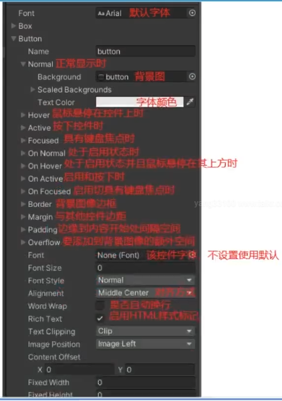
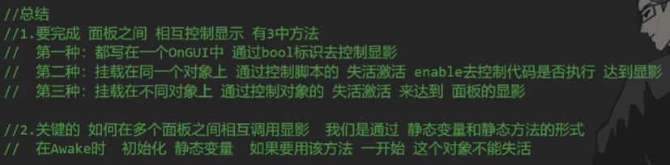

# 基本介绍
```C#
#region 知识点一 GUI是什么
//全称 即时模式游戏用户交互界面（IMGUI）
//在Unity中一般简称为GUI
//它是一个代码驱动的UI系统
#endregion

#region 知识点二 GUI的主要作用
//1.作为程序员的调试工具，创建游戏内调试工具
//2.为脚本组件创建自定义检视面板
//3.创建新的编辑器窗口和工具以拓展Unity本身（一般用作内置游戏工具）

//注意：不要用它为玩家制作UI功能
#endregion

#region 知识点三 GUI的工作原理
//在继承MonoBehaviour的脚本中的特殊函数里
//调用GUI提供的方法
//类似生命周期函数 
private void OnGUI()
{
    //在其中书写 GUI相关代码 即可显示GUI内容
}
//注意：
//1.它每帧执行 相当于是用于专门绘制GUI界面的函数
//2.一般只在其中执行GUI相关界面绘制和操作逻辑
//3.该函数 在 OnDisable之前  LateUpdate之后执行
//4.只要是继承Mono的脚本 都可以在OnGUI中绘制GUI
#endregion
```

# 基础控件
## 重要参数及文本和按钮
```c#
public Texture tex;
public Rect rect;

public Rect rect1;

public GUIContent content;

public GUIStyle style;

public Rect btnRect;
public GUIContent btnContent;
public GUIStyle btnStyle;

private void OnGUI()
{
    #region 知识点一 GUI 控件绘制的共同点
    //1.他们都是GUI公共类中提供的静态函数 直接调用即可
    //2.他们的参数都大同小异
    //  位置参数：Rect参数  x y位置 w h尺寸
    //  显示文本：string参数
    //  图片信息：Texture参数
    //  综合信息：GUIContent参数
    //  自定义样式：GUIStyle参数
    //3.每一种控件都有多种重载，都是各个参数的排列组合
    //  必备的参数内容 是 位置信息和显示信息
    #endregion

    #region 知识点二 文本控件
    //基本使用
    GUI.Label(new Rect(0, 0, 100, 20), "唐老狮欢迎你", style);
    GUI.Label(rect, tex);
    //综合使用
    GUI.Label(rect1, content);
    //可以获取当前鼠标或者键盘选中的GUI控件 对应的 tooltip信息
    Debug.Log(GUI.tooltip);
    //自定义样式
    #endregion

    #region 知识点三 按钮控件
    //基本使用
    //综合使用
    //自定义样式
    //在按钮范围内 按下鼠标再抬起鼠标 才算一次点击 才会返回true
    //if (GUI.Button(btnRect, btnContent, btnStyle))
    //{
    //    //处理我们按钮点击的逻辑
    //    Debug.Log("按钮被点击");
    //}

    //只要在长按按钮范围内 按下鼠标 就会一直返回true
    if( GUI.RepeatButton(btnRect, btnContent) )
    {
        Debug.Log("长按按钮被点击");
    }
    #endregion
}
```
**style属性说明**



```c#
Font字体可以从C/Windows/Fonts中找
```
## 选框
```c#
private bool isSel;
private bool isSel2;

public GUIStyle style;

private int nowSelIndex = 1;
private void OnGUI()
{
    #region 知识点一 多选框
    #region 普通样式
    isSel = GUI.Toggle(new Rect(0, 0, 100, 30), isSel, "效果开关");
    #endregion

    #region 自定义样式 显示问题
    //修改固定宽高 fixedWidth和fixedHeight
    //修改从GUIStyle边缘到内容起始处的空间 padding

    isSel2 = GUI.Toggle(new Rect(0, 40, 100, 30), isSel2, "音效开关", style);
    #endregion
    #endregion

    #region 知识点二 单选框
    //单选框是基于 多选框的实现
    //关键：通过一个int标识来决定是否选中 
    if(GUI.Toggle(new Rect(0, 100, 100, 30), nowSelIndex == 1, "选项一"))
    {
        nowSelIndex = 1;
    }
    if(GUI.Toggle(new Rect(0, 140, 100, 30), nowSelIndex == 2, "选项二"))
    {
        nowSelIndex = 2;
    }
    if(GUI.Toggle(new Rect(0, 180, 100, 30), nowSelIndex == 3, "选项三"))
    {
        nowSelIndex = 3;
    }
    #endregion
}
```



## 输入框 拖动条
```c#
private string inputStr = "";
private string inputPW = "";

private float nowValue = 0.5f;
private void OnGUI()
{
    #region 知识点一 输入框

    #region 普通输入
    //输入框 重要参数 一个是显示内容 string
    //一个是 最大输入字符串的长度
    inputStr = GUI.TextField(new Rect(0, 0, 100, 30), inputStr, 5);
    #endregion

    #region 密码输入
    inputPW = GUI.PasswordField(new Rect(0, 50, 100, 30), inputPW, '★');
    #endregion

    #endregion

    #region 知识点二 拖动条

    #region 水平拖动条
    // 当前的值
    // 最小值 left
    // 最大值 right
    nowValue = GUI.HorizontalSlider(new Rect(0, 100, 100, 50), nowValue, 0, 1);
    Debug.Log(nowValue);
    #endregion

    #region 竖直拖动条
    nowValue = GUI.VerticalSlider(new Rect(0, 150, 50, 100), nowValue, 0, 1);
    #endregion

    #endregion
}
```

## 图片绘制和框
```c#
public Rect texPos;

public Texture tex;

public ScaleMode mode = ScaleMode.StretchToFill;

public bool alpha = true;

public float wh = 0;

private void OnGUI()
{
    #region 知识点一 图片绘制
    // ScaleMode
    // ScaleAndCrop:也会通过宽高比来计算图片 但是 会进行裁剪
    // ScaleToFit：会自动根据宽高比进行计算 不会拉变形 会一直保持图片完全显示的状态
    // StretchToFill:始终填充满你传入的 Rect范围

    // alpha 是用来 控制 图片是否开启透明通道的

    //imageAspect ： 自定义宽高比  如果不填 默认为0 就会使用 图片原始宽高  
    GUI.DrawTexture(texPos, tex, mode, alpha, wh);
    #endregion

    #region 知识点二 框绘制
    //GUI.Box(texPos, "");
    #endregion
}
```

# 复合控件

## 工具栏和选择网格
```c#
private int toolbarIndex = 0;
private string[] toolbarInfos = new string[] { "强化", "进阶", "幻化" };

private int selGridIndex = 0;

private void OnGUI()
{
    #region 知识点一 工具栏
    toolbarIndex = GUI.Toolbar(new Rect(0, 0, 200, 30), toolbarIndex, toolbarInfos);
    //工具栏可以帮助我们根据不同的返回索引 来处理不同的逻辑
    switch (toolbarIndex)
    {
        case 0:
            break;
        case 1:
            break;
        case 2:
            break;
    }
    #endregion

    #region 知识点二 选择网格
    //相对toolbar多了一个参数 xCount 代表 水平方向最多显示的按钮数量
    selGridIndex = GUI.SelectionGrid(new Rect(0, 50, 200, 60), selGridIndex, toolbarInfos, 1);
    #endregion
    }
```

## 滚动视图和分组
```c#
public Rect groupPos;
public Rect scPos;
public Rect showPos;

private Vector2 nowPos;

private string[] strs = new string[] { "123", "234", "222", "111" };
private void OnGUI()
{
    #region 知识点一 分组
    // 用于批量控制控件位置 
    // 可以理解为 包裹着的控件加了一个父对象 
    // 可以通过控制分组来控制包裹控件的位置
    GUI.BeginGroup(groupPos);

    GUI.Button(new Rect(0, 0, 100, 50), "测试按钮");
    GUI.Label(new Rect(0, 60, 100, 20), "Label信息");

    GUI.EndGroup();

    #endregion

    
    #region 知识点二 滚动列表
    nowPos = GUI.BeginScrollView(scPos, nowPos, showPos);

    GUI.Toolbar(new Rect(0, 0, 300, 50), 0, strs);
    GUI.Toolbar(new Rect(0, 60, 300, 50), 0, strs);
    GUI.Toolbar(new Rect(0, 120, 300, 50), 0, strs);
    GUI.Toolbar(new Rect(0, 180, 300, 50), 0, strs);

    GUI.EndScrollView();
    #endregion
}
```

## 窗口
```c#
private Rect dragWinPos = new Rect(400, 400, 200, 150);
private void OnGUI()
{
    #region 知识点一 窗口
    //第一个参数 id 是窗口的唯一ID 不要和别的窗口重复
    //委托参数 是用于 绘制窗口用的函数 传入即可
    GUI.Window(1, new Rect(100, 100, 200, 150), DrawWindow, "测试窗口");
    //id对于我们来说 有一个重要作用 除了区分不同窗口 还可以在一个函数中去处理多个窗口的逻辑
    //通过id去区分他们
    GUI.Window(2, new Rect(100, 350, 200, 150), DrawWindow, "测试窗口2");
    #endregion

    #region 知识点二 模态窗口
    //模态窗口 可以让该其它控件不在有用
    //你可以理解该窗口在最上层 其它按钮都点击不到了
    //只能点击该窗口上控件

    //GUI.ModalWindow(3, new Rect(300, 100, 200, 150), DrawWindow, "模态窗口");
    #endregion

    #region 知识点三 拖动窗口
    //位置赋值只是前提
    dragWinPos = GUI.Window(4, dragWinPos, DrawWindow, "拖动窗口");
    #endregion
}

private void DrawWindow(int id)
{
    switch (id)
    {
        case 1:
            GUI.Button(new Rect(0, 30, 30, 20), "1");
            break;
        case 2:
            GUI.Button(new Rect(0, 30, 30, 20), "2");
            break;
        case 3:
            GUI.Button(new Rect(0, 30, 30, 20), "3");
            break;
        case 4:
            //该API 写在窗口函数中调用 可以让窗口被拖动
            //传入Rect参数的重载 作用 
            //是决定窗口中哪一部分位置 可以被拖动
            //默认不填 就是无参重载 默认窗口的所有位置都能被拖动
            GUI.DragWindow(new Rect(0,0,1000,20));
            break;
    }
    
}
```

# 自定义整体样式
## 自定义皮肤样式
```c#
public GUIStyle style;

public GUISkin skin;
private void OnGUI()
{
    #region 知识点一 全局颜色
    //全局的着色颜色 影响背景和文本颜色
    //GUI.color = Color.red;

    //文本着色颜色 会和 全局颜色相乘
    //GUI.contentColor = Color.yellow;
    //GUI.Button(new Rect(0, 0, 100, 30), "测试按钮");
    
    ////背景元素着色颜色 会和 全局颜色相乘
    //GUI.backgroundColor = Color.red;
    //GUI.Label(new Rect(0, 50, 100, 30), "测试按钮");
    //GUI.color = Color.white;
    //GUI.Button(new Rect(0, 100, 100, 30), "测试按钮", style);

    #endregion

    #region 知识点二 整体皮肤样式
    GUI.skin = skin;
    //虽然设置了皮肤 但是绘制时 如果使用GUIStyle参数 皮肤就没有
    GUI.Button(new Rect(0, 0, 100, 30), "测试按钮");

    GUI.skin = null;
    GUI.Button(new Rect(0, 50, 100, 30), "测试按钮2");

    //它可以帮助我们整套的设置 自定义样式 
    //相对单个控件设置Style要方便一些
    #endregion
}
```

## GUILayout自动布局
```c#
#region 知识点一 GUILayout 自动布局
//主要用于进行编辑器开发 如果用它来做游戏UI不太合适
GUI.BeginGroup(new Rect(100, 100, 200, 300));
GUILayout.BeginVertical();

GUILayout.Button("123", GUILayout.Width(200));
GUILayout.Button("245666656565");
GUILayout.Button("235", GUILayout.ExpandWidth(false));

GUILayout.EndVertical();
GUI.EndGroup();
#endregion

#region 知识点二 GUILayoutOption 布局选项
//控件的固定宽高
GUILayout.Width(300);
GUILayout.Height(200);
//允许控件的最小宽高
GUILayout.MinWidth(50);
GUILayout.MinHeight(50);
//允许控件的最大宽高
GUILayout.MaxWidth(100);
GUILayout.MaxHeight(100);
//允许或禁止水平拓展
GUILayout.ExpandWidth(true);//允许
GUILayout.ExpandHeight(false);//禁止
GUILayout.ExpandHeight(true);//允许
GUILayout.ExpandHeight(false);//禁止
#endregion
```

# 编辑器模式下执行脚本 特性
```c#
[ExecuteAlways]
```

# 九宫格概念