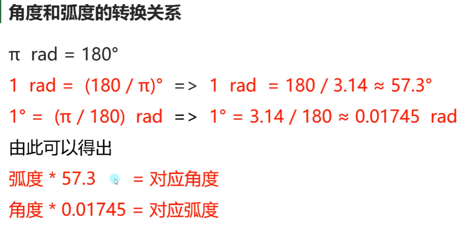
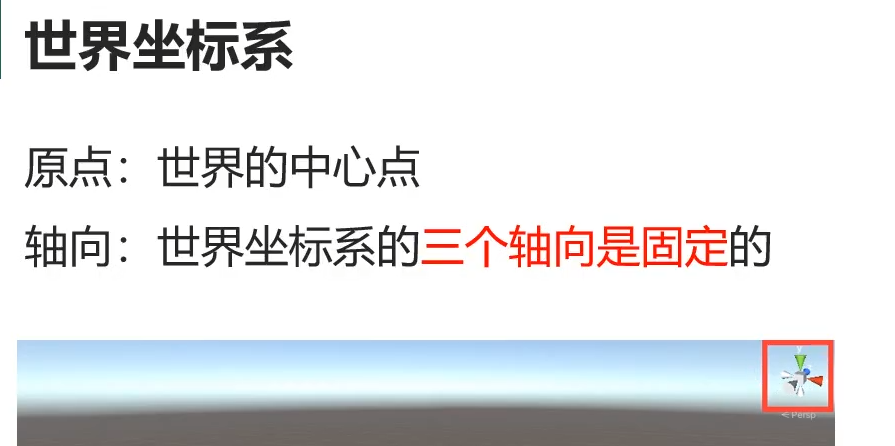
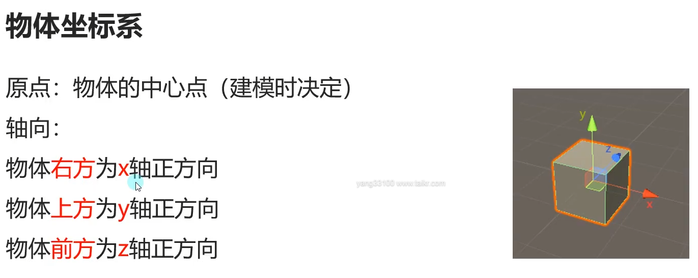
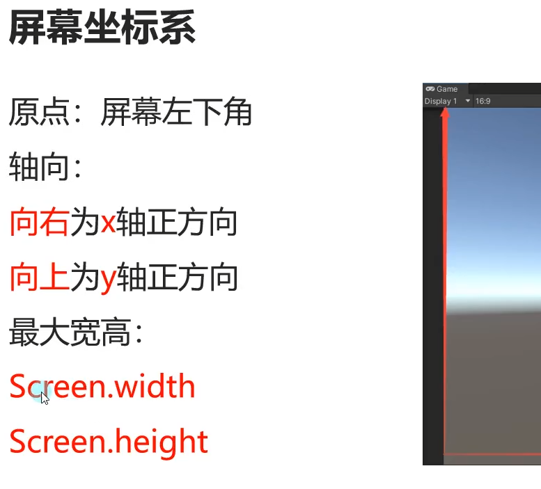
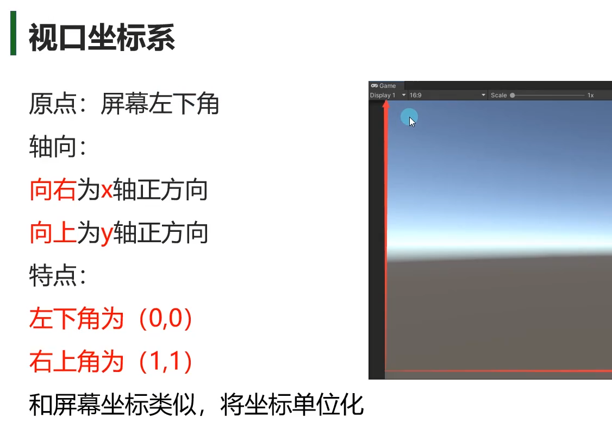
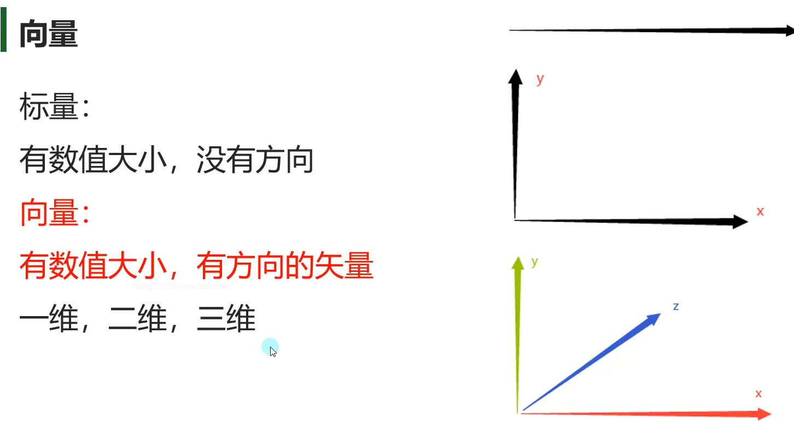
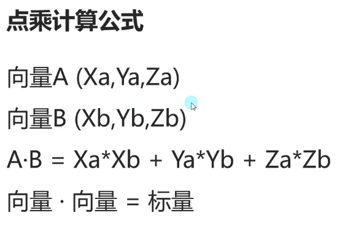
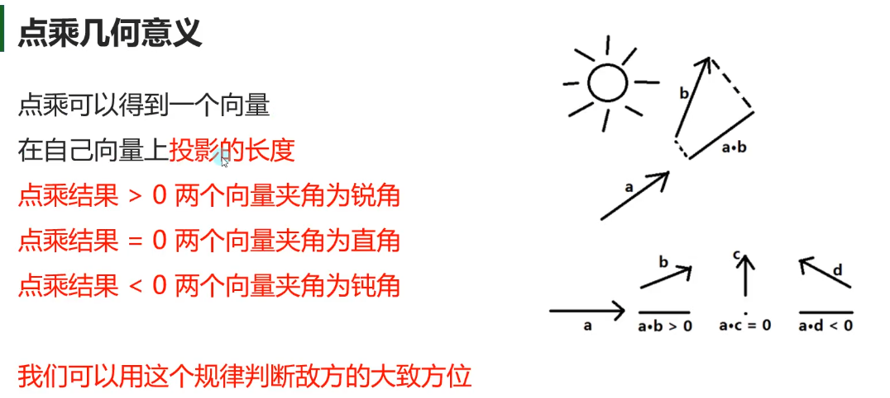
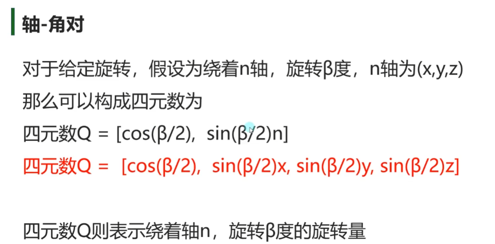
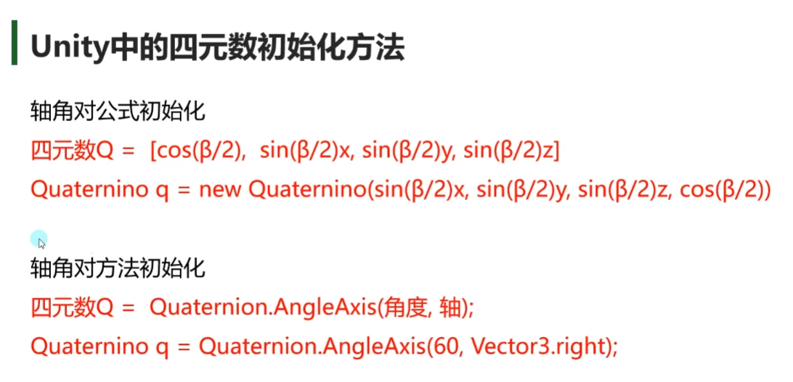

# 数学基础

## Mathf
```c#
void Start()
{
    #region 知识点一 Mathf和Math
    //Math是C#中封装好的用于数学计算的工具类 —— 位于System命名空间中

    //Mathf是Unity中封装好的用于数学计算的工具结构体 —— 位于UnityEngine命名空间中

    //他们都是提供来用于进行数学相关计算的
    #endregion

    #region 知识点二 他们的区别
    //Mathf 和 Math中的相关方法几乎一样
    //Math 是C#自带的工具类 主要就提供一些数学相关计算方法
    //Mathf 是Unity专门封装的，不仅包含Math中的方法，还多了一些适用于游戏开发的方法
    //所以我们在进行Unity游戏开发时
    //使用Mathf中的方法用于数学计算即可

    #endregion

    #region 知识点三 Mathf中的常用方法——一般计算一次
    //1.π - PI
    print(Mathf.PI);

    //2.取绝对值 - Abs
    print(Mathf.Abs(-10));
    print(Mathf.Abs(-20));
    print(Mathf.Abs(1));
    //3.向上取整 - CeilToInt
    float f = 1.3f;
    int i = (int)f;
    print(i);
    print(Mathf.CeilToInt(f));
    print(Mathf.CeilToInt(1.00001f));

    //4.向下取整 - FloorToInt
    print(Mathf.FloorToInt(9.6f));

    //5.钳制函数 - Clamp
    print(Mathf.Clamp(10, 11, 20));
    print(Mathf.Clamp(21, 11, 20));
    print(Mathf.Clamp(15, 11, 20));

    //6.获取最大值 - Max
    print(Mathf.Max(1, 2, 3, 4, 5, 6, 7, 8));
    print(Mathf.Max(1, 2));

    //7.获取最小值 - Min
    print(Mathf.Min(1, 2, 3, 4, 545, 6, 1123, 123));
    print(Mathf.Min(1.1f, 0.4f));

    //8.一个数的n次幂 - Pow
    print("一个数的n次方" + Mathf.Pow(4, 2));
    print("一个数的n次方" + Mathf.Pow(2, 3));

    //9.四舍五入 - RoundToInt
    print("四舍五入" + Mathf.RoundToInt(1.3f));
    print("四舍五入" + Mathf.RoundToInt(1.5f));

    //10.返回一个数的平方根 - Sqrt
    print("返回一个数的平方根" + Mathf.Sqrt(4));
    print("返回一个数的平方根" + Mathf.Sqrt(16));
    print("返回一个数的平方根" + Mathf.Sqrt(64));

    //11.判断一个数是否是2的n次方 - IsPowerOfTwo
    print("判断一个数是否是2的n次方" + Mathf.IsPowerOfTwo(4));
    print("判断一个数是否是2的n次方" + Mathf.IsPowerOfTwo(8));
    print("判断一个数是否是2的n次方" + Mathf.IsPowerOfTwo(3));
    print("判断一个数是否是2的n次方" + Mathf.IsPowerOfTwo(1));

    //12.判断正负数 - Sign
    print("判断正负数" + Mathf.Sign(0));
    print("判断正负数" + Mathf.Sign(10));
    print("判断正负数" + Mathf.Sign(-10));
    print("判断正负数" + Mathf.Sign(3));
    print("判断正负数" + Mathf.Sign(-2));
    #endregion
}

//开始值
float start = 0;
float result = 0;
float time = 0;
// Update is called once per frame
void Update()
{
    #region 知识点四 Mathf中的常用方法——一般不停计算
    //插值运算 - Lerp

    //Lerp函数公式
    //result = Mathf.Lerp(start, end, t);

    //t为插值系数，取值范围为 0~1
    //result = start + (end - start)*t

    //插值运算用法一
    //每帧改变start的值——变化速度先快后慢，位置无限接近，但是不会得到end位置
    start = Mathf.Lerp(start, 10, Time.deltaTime);

    //插值运算用法二
    //每帧改变t的值——变化速度匀速，位置每帧接近，当t>=1时，得到结果
    time += Time.deltaTime;
    result = Mathf.Lerp(start, 10, time);
    #endregion
}
```

## 三角函数


```c#
#region 知识点一 弧度、角度相互转化
//弧度转角度
float rad = 1;
float anger = rad * Mathf.Rad2Deg;
print(anger);

//角度转弧度
anger = 1;
rad = anger * Mathf.Deg2Rad;
print(rad);

#endregion

#region 知识点二 三角函数
//注意：Mathf中的三角函数相关函数，传入的参数需要时弧度值
print(Mathf.Sin(30 * Mathf.Deg2Rad));//0.5
print(Mathf.Cos(60 * Mathf.Deg2Rad));//0.5
#endregion

#region 知识点三 反三角函数
//注意：反三角函数得到的结果是 正弦或者余弦值对应的弧度
rad = Mathf.Asin(0.5f);
print(rad * Mathf.Rad2Deg);
rad = Mathf.Acos(0.5f);
print(rad * Mathf.Rad2Deg);
#endregion
```

## 坐标系





```c#
#region 知识点一 世界坐标系
//目前学习的和世界坐标系相关的
//this.transform.position;
//this.transform.rotation;
//this.transform.eulerAngles;
//this.transform.lossyScale;
//修改他们 会是相对世界坐标系的变化
#endregion

#region 知识点二 物体坐标系
//相对父对象的物体坐标系的位置 本地坐标 相对坐标
//this.transform.localPosition;
//this.transform.localEulerAngles;
//this.transform.localRotation;
//this.transform.localScale;
//修改他们 会是相对父对象物体坐标系的变化
#endregion

#region 知识点三 屏幕坐标系
//Input.mousePosition
//Screen.width;
//Screen.height;
#endregion

#region 知识点四 视口坐标系
//摄像机上的 视口范围
#endregion

#region 坐标转换相关
//世界转本地
//this.transform.InverseTransformDirection
//this.transform.InverseTransformPoint
//this.transform.InverseTransformVector

//本地转世界
//this.transform.TransformDirection
//this.transform.TransformPoint  
//this.transform.TransformVector

//世界转屏幕
//Camera.main.WorldToScreenPoint
//屏幕转世界
//Camera.main.ScreenToWorldPoint

//世界转视口
//Camera.main.WorldToViewportPoint
//视口转世界
//Camera.main.ViewportToWorldPoint

//视口转屏幕
//Camera.main.ViewportToScreenPoint

//屏幕转视口
//Camera.main.ScreenToViewportPoint;

#endregion
```

# 向量

## 基础


```c#
#region 知识点一 向量
//三维向量 - Vector3
//Vector3有两种几何意义
//1.位置 —— 代表一个点
print(this.transform.position);

//2.方向 —— 代表一个方向
print(this.transform.forward);
print(this.transform.up);

Vector3 v = new Vector3(1, 2, 3);
Vector2 v2 = new Vector2(1, 2);
#endregion

#region 知识点二 两点决定一向量
//A和B此时 几何意义 是两个点
Vector3 A = new Vector3(1, 2, 3);
Vector3 B = new Vector3(5, 1, 5);
//求向量
//此时 AB和 BA 他们的几何意义 是两个向量
Vector3 AB = B - A;
Vector3 BA = A - B;
#endregion

#region 知识点三 零向量和负向量
print(Vector3.zero);

print(Vector3.forward);
print(-Vector3.forward);
#endregion

#region 知识点四 向量的模长
//Vector3中提供了获取向量模长的成员属性
//magnitude
print(AB.magnitude);
Vector3 C = new Vector3(5, 6, 7);
print(C.magnitude);

print(Vector3.Distance(A, B));

#endregion

#region 知识点五 单位向量
//Vector3中提供了获取单位向量的成员属性
//normalized
print(AB.normalized);
print(AB / AB.magnitude);
#endregion
```

## 向量加减乘除
```c#
#region 知识点一 向量加法
//this.transform.position += new Vector3(1, 2, 3);
this.transform.Translate(Vector3.forward * 5);
#endregion

#region 知识点二 向量减法
//this.transform.position -= new Vector3(1, 2, 3);
this.transform.Translate(-Vector3.forward * 5);
#endregion

#region 知识点三 向量乘除标量
this.transform.localScale *= 2;
this.transform.localScale /= 2;
#endregion
```

## 向量点乘 判断前后
```c#
/* 对为什么是向量v投影到向量w的长 与w的长 乘积本质的理解
1.w的基向量为u
2.由于对称性，i，j到w的投影 的 线性变换，实际就是(ux,uy) 那么w就是这个线性变换的倍数关系
3.那么对于任意二维向量v到w上的投影 就是 v进行该线性变换的倍数关系（w），实际与v w的点乘公式一模一样
*/
```




```c#
#region 补充知识 调试画线
//画线段 
//前两个参数 分别是 起点 终点
//Debug.DrawLine(this.transform.position, this.transform.position + this.transform.forward, Color.red);
//画射线
//前两个参数 分别是 起点 方向
//Debug.DrawRay(this.transform.position, this.transform.forward, Color.white);
#endregion

#region 知识点一 通过点乘判断对象方位
//Vector3 提供了计算点乘的方法
Debug.DrawRay(this.transform.position, this.transform.forward, Color.red);
Debug.DrawRay(this.transform.position, target.position - this.transform.position, Color.red);
//得到两个向量的点乘结果
//向量 a 点乘 AB 的结果
float dotResult = Vector3.Dot(this.transform.forward, target.position - this.transform.position);
if( dotResult >= 0 )
{
    print("它在我前方");
}
else
{
    print("它在我后方");
}
#endregion

#region 知识点二 通过点乘推导公式算出夹角 单位向量点乘=cosθ 所以可以得到夹角
//步骤
//1.用单位向量算出点乘结果
dotResult = Vector3.Dot(this.transform.forward, (target.position - this.transform.position).normalized);
//2.用反三角函数得出角度
print("角度-" + Mathf.Acos(dotResult) * Mathf.Rad2Deg);

//Vector3中提供了 得到两个向量之间夹角的方法 API
print("角度2-" + Vector3.Angle(this.transform.forward, target.position - this.transform.position));
#endregion
```

## 叉乘 判断左右
```c#
public Transform A;
public Transform B;

// Start is called before the first frame update
void Start()
{
    #region 知识点一 叉乘计算
    print(Vector3.Cross(A.position, B.position));
    #endregion

    #region 知识点二 叉乘几何意义
    //假设向量 A和B 都在 XZ平面上
    //向量A 叉乘 向量 B
    //y大于0 证明 B在A右侧
    //y小于0 证明 B在A左侧
    #endregion
}

// Update is called once per frame
void Update()
{
    //Vector3 C = Vector3.Cross(A.position, B.position);
    //if( C.y > 0)
    //{
    //    print("B在A的右侧");
    //}
    //else
    //{
    //    print("B在A的左侧");
    //}

    Vector3 C = Vector3.Cross(B.position, A.position);
    if (C.y > 0)
    {
        print("A在B的右侧");
    }
    else
    {
        print("A在B的左侧");
    }
}
```

## 向量插值运算
```c#
public Transform target;
public Transform A;
public Transform B;
public Transform C;

private Vector3 startPos;
private float time;

private Vector3 nowTarget;

// Start is called before the first frame update
void Start()
{
    startPos = B.position;
}

// Update is called once per frame
void Update()
{
    #region 知识点一 线性插值
    //result = start + (end - start) * t

    //1.先快后慢 每帧改变start位置 位置无限接近 但不会得到end位置
    A.position = Vector3.Lerp(A.position, target.position, Time.deltaTime);

    //2.匀速 每帧改变时间  当t>=1时 得到结果
    //这种匀速移动 当time>=1时  我改变了 目标位置后  它会直接瞬移到我们的目标位置
    if(nowTarget != target.position)
    {
        nowTarget = target.position;
        time = 0;
        startPos = B.position;
    }
    time += Time.deltaTime;
    B.position = Vector3.Lerp(startPos, nowTarget, time);
    #endregion

    #region 知识点二 球形插值

    C.position = Vector3.Slerp(Vector3.right * 10, Vector3.left * 10 + Vector3.up*0.1f, time*0.01f);
    #endregion
}
```

# 四元数
## 欧拉角
```c#
会发生万向节死锁
描述不唯一
```

## 四元数




```c#
#region 知识点一 四元数 Quaternion
//四元数Q = [cos(β/2),  sin(β/2)x, sin(β/2)y, sin(β/2)z]
//计算原理
//Quaternion q = new Quaternion(Mathf.Sin(30 * Mathf.Deg2Rad), 0, 0, Mathf.Cos(30 * Mathf.Deg2Rad));
//提供的轴角对 初始化 四元数的方法
Quaternion q = Quaternion.AngleAxis(60, Vector3.right);

//创建一个立方体
GameObject obj = GameObject.CreatePrimitive(PrimitiveType.Cube);
obj.transform.rotation = q;

#endregion

#region 知识点二 四元数和欧拉角转换
//1.欧拉角转四元数
Quaternion q2 = Quaternion.Euler(60, 0, 0);
GameObject obj2 = GameObject.CreatePrimitive(PrimitiveType.Cube);
obj2.transform.rotation = q2;
//2.四元数转欧拉角
print(q2.eulerAngles);
#endregion

#region 知识点三 四元数弥补的欧拉角缺点
//1.同一旋转的表示不唯一  四元数旋转后 转换后的欧拉角 始终是 -180~180度

//2.万向节死锁 通过四元数旋转对象可以避免万向节死锁
#endregion
```

### 四元数相乘代表旋转四元数
```c#
Vector3 e;
void Update()
{
    this.transform.rotation *= Quaternion.AngleAxis(1, Vector3.up);
    //e = this.transform.rotation.eulerAngles;
    //e += Vector3.forward;
    //this.transform.rotation = Quaternion.Euler(e);
}
```
## 四元数常用方法

```c#
public Transform testObj;

public Transform target;
public Transform A;
public Transform B;

private Quaternion start;
private float time;

public Transform lookA;
public Transform lookB;
// Start is called before the first frame update
void Start()
{
    #region 知识点一 单位四元数
    /*
    单位四元数表示没有旋转量(角位移)
    当角度为0或者360度时
    对于给定轴都会得到单位四元数
    [1,(0,0,0)]和[-1,(0,0,0)]都是单位四元数 表示没有旋转量
    */

    print(Quaternion.identity);
    //testObj.rotation = Quaternion.identity;

    Instantiate(testObj, Vector3.zero, Quaternion.identity);
    #endregion

    #region 知识点二 插值运算
    /*
    四元数中同样提供如同Vector3的插值运算
    Lerp和Slerp
    在四元数中Lerp和Slerp只有一些细微差别由于算法不同
    Slerp的效果会好一些
    Lerp的效果相比Slerp更快 但是如果旋转范围较大效果较差
    所以建议使用Slerp进行插值运算
    */

    start = B.transform.rotation;
    #endregion

    
}

// Update is called once per frame
void Update()
{
    //无限接近 先快后慢
    A.transform.rotation = Quaternion.Slerp(A.transform.rotation, target.rotation, Time.deltaTime);

    //匀速变化 time>=1到达目标
    time += Time.deltaTime;
    B.transform.rotation = Quaternion.Slerp(start, target.rotation, time);


    #region 知识点三 LookRotation
    //Quaternion q = Quaternion.LookRotation(lookB.position - lookA.position);
    //lookA.rotation = q;
    lookA.MyLookAt(lookB);
    #endregion
}
```

## 四元数计算
```c#
#region 知识点一 四元数相乘-角度叠加
/*
两个四元数相乘得到一个新的四元数
代表两个旋转量的叠加
相当于旋转
注意:旋转相对的坐标系是物体自身坐标系
*/
Quaternion q = Quaternion.AngleAxis(20, Vector3.up);
this.transform.rotation *= q;

this.transform.rotation *= q;
#endregion

#region 知识点二 四元数乘向量-旋转向量

/*
四元数乘向量 返回 一个新向量
可以将指定向量旋转对应四元数的旋转量
相当于旋转向量
*/
Vector3 v = Vector3.forward;
print(v);
v = Quaternion.AngleAxis(45, Vector3.up) * v;
print(v);
v = Quaternion.AngleAxis(45, Vector3.up) * v;
print(v);
#endregion
```

# monibehavior重要内容
## 延迟函数
```c#
public Test t;
// Start is called before the first frame update
void Start()
{
    #region 知识点一 什么是延迟函数
    //延迟函数顾名思义
    //就是会延时执行的函数
    //我们可以自己设定延时要执行的函数和具体延时的时间
    //是MonoBehaviour基类中实现好的方法
    #endregion

    #region 知识点二 延迟函数的使用
    //1.延迟函数
    //Invoke
    //参数一：函数名 字符串
    //参数二：延迟时间 秒为单位
    Invoke("DelayDoSomething", 1);

    //注意：
    //1-1.延时函数第一个参数传入的是函数名字符串
    //1-2.延时函数没办法传入参数 只有包裹一层
    //1-3.函数名必须是该脚本上申明的函数

    //2.延迟重复执行函数
    //InvokeRepeating
    //参数一：函数名字符串
    //参数二：第一次执行的延迟时间
    //参数三：之后每次执行的间隔时间
    InvokeRepeating("DelayRe", 5, 1);

    //注意：
    //它的注意事项和延时函数一致

    //3.取消延迟函数
    //3-1取消该脚本上的所有延时函数执行
    //CancelInvoke();

    //3-2指定函数名取消
    //只要取消了指定延迟 不管之前该函数开启了多少次 延迟执行 都会统一取消
    //CancelInvoke("DelayDoSomething");

    //4.判断是否有延迟函数
    if( IsInvoking() )
    {
        print("存在延迟函数");
    }
    if( IsInvoking("DelayDoSomething") )
    {
        print("存在延迟函数DelayDoSomething");
    }
    #endregion

    #region 知识点三 延迟函数受对象失活销毁影响
    //脚本依附对象失活 或者 脚本自己失活
    //延迟函数可以继续执行 不会受到影响的

    //脚本依附对象销毁或者脚本移除
    //延迟函数无法继续执行
    #endregion

    #region 总结
    //继承MonoBehavior的脚本可以使用延时相关函数
    //函数相关
    //Invoke 延时函数
    //InvokeRepeating 延时重复函数
    //CancelInvoke 停止所有或者指定延时函数
    //IsInvoking 判断是否有延时函数待执行
    //使用相关
    //1.参数都是函数名，无法传参数
    //2.只能执行该脚本中申明的函数
    //3.对象或脚本失活无法停止延时函数执行，只有销毁组件或者对象才会停止或者代码停止
    #endregion
}

private void OnEnable()
{
    //对象激活 的生命周期函数中 开启延迟（重复执行的延迟）
}

private void OnDisable()
{
    //对象失活 的生命周期函数中 停止延迟
}

private void DelayDoSomething()
{
    print("延时执行的函数");

    TestFun(2);

    t.TestFun();
}

private void DelayRe()
{
    print("重复执行");
}

private void TestFun()
{
    print("无参重载");
}

private void TestFun(int i)
{
    print("传入参数" + i);
}
```

## 协同程序
```c#
Thread t;

//申明一个变量作为一个公共内存容器
Queue<Vector3> queue = new Queue<Vector3>();

Queue<Vector3> queue2 = new Queue<Vector3>();

// Start is called before the first frame update
void Start()
{
    #region 知识点一 Unity是否支持多线程？
    //首先要明确一点
    //Unity是支持多线程的
    //只是新开线程无法访问Unity相关对象的内容

    //注意：Unity中的多线程 要记住关闭

    t = new Thread(Test);
    //t.Start();
    #endregion

    #region 知识点二 协同程序是什么？
    //协同程序简称协程
    //它是“假”的多线程，它不是多线程

    //它的主要作用
    //将代码分时执行，不卡主线程
    //简单理解，是把可能会让主线程卡顿的耗时的逻辑分时分步执行

    //主要使用场景
    //异步加载文件
    //异步下载文件
    //场景异步加载
    //批量创建时防止卡顿
    #endregion

    #region 知识点三 协同程序和线程的区别
    //新开一个线程是独立的一个管道，和主线程并行执行
    //新开一个协程是在原线程之上开启，进行逻辑分时分步执行
    #endregion

    #region 知识点四 协程的使用
    //继承MonoBehavior的类 都可以开启 协程函数
    //第一步：申明协程函数
    //  协程函数2个关键点
    //  1-1返回值为IEnumerator类型及其子类
    //  1-2函数中通过 yield return 返回值; 进行返回

    //第二步：开启协程函数

    //协程函数 是不能够 直接这样去执行的！！！！！！！
    //这样执行没有任何效果
    MyCoroutine(1, "123");
    
    //常用开启方式
    //IEnumerator ie = MyCoroutine(1, "123");
    //StartCoroutine(ie);
    Coroutine c1 = StartCoroutine( MyCoroutine(1, "123") );
    Coroutine c2 = StartCoroutine( MyCoroutine(1, "123"));
    Coroutine c3 = StartCoroutine( MyCoroutine(1, "123"));

    //第三步：关闭协程
    //关闭所有协程
    StopAllCoroutines();

    //关闭指定协程
    StopCoroutine(c1);

    #endregion

    #region 知识点五 yield return 不同内容的含义
    //1.下一帧执行
    yield return 数字;
    yield return null;
    //在Update和LateUpdate之间执行

    //2.等待指定秒后执行
    yield return new WaitForSeconds(秒);
    //在Update和LateUpdate之间执行

    //3.等待下一个固定物理帧更新时执行
    yield return new WaitForFixedUpdate();
    //在FixedUpdate和碰撞检测相关函数之后执行

    //4.等待摄像机和GUI渲染完成后执行
    yield return new WaitForEndOfFrame();
    //在LateUpdate之后的渲染相关处理完毕后之后

    //5.一些特殊类型的对象 比如异步加载相关函数返回的对象
    //之后讲解 异步加载资源 异步加载场景 网络加载时再讲解
    //一般在Update和LateUpdate之间执行

    //6.跳出协程
    yield break;
    #endregion

    #region 知识点六 协程受对象和组件失活销毁的影响
    //  协程开启后
    //组件和物体销毁，协程不执行
    //物体失活协程不执行，脚本组件失活协程正常运行
    #endregion

    #region 总结
    //1.Unity支持多线程，只是新开线程无法访问主线程中Unity相关内容
    //  一般主要用于进行复杂逻辑运算或者网络消息接收等等
    //  注意：Unity中的多线程一定记住关闭
    //2.协同程序不是多线程，它是将线程中逻辑进行分时执行，避免卡顿
    //3.继承MonoBehavior的类都可以使用协程
    //4.开启协程方法、关闭协程方法
    //5.yield return 返回的内容对于我们的意义
    //6.协程只有当组件单独失活时不受影响，其它情况协程会停止
    #endregion
}

// Update is called once per frame
void Update()
{
    if( queue.Count > 0 )
    {
        this.transform.position = queue.Dequeue();
    }
}

//关键点一： 协同程序（协程）函数 返回值 必须是 IEnumerator或者继承它的类型 
IEnumerator MyCoroutine(int i, string str)
{
    print(i);
    //关键点二： 协程函数当中 必须使用 yield return 进行返回
    yield return null;
    print(str);
    yield return new WaitForSeconds(1f);
    print("2");
    yield return new WaitForFixedUpdate();
    print("3");
    //主要会用来 截图时 会使用
    yield return new WaitForEndOfFrame();
    
    while(true)
    {
        print("5");
        yield return new WaitForSeconds(5f);
    }
}

private void Test()
{
    while(true)
    {
        Thread.Sleep(1000);
        //相当于模拟 复杂算法 算出了一个结果 然后放入公共容器中
        System.Random r = new System.Random();
        queue.Enqueue(new Vector3(r.Next(-10,10), r.Next(-10, 10), r.Next(-10, 10)));
        print("123");
    }
}

private void OnDestroy()
{
    t.Abort();
    t = null;
}
```

## 协同程序原理
```c#
#region 知识点一 协程的本质
//协程可以分成两部分
//1.协程函数本体
//2.协程调度器

//协程本体就是一个能够中间暂停返回的函数
//协程调度器是Unity内部实现的，会在对应的时机帮助我们继续执行协程函数

//Unity只实现了协程调度部分
//协程的本体本质上就是一个 C#的迭代器方法
#endregion

#region 知识点二 协程本体是迭代器方法的体现
//1.协程函数本体
//如果我们不通过 开启协程方法执行协程 
//Unity的协程调度器是不会帮助我们管理协程函数的
IEnumerator ie = Test();

//但是我们可以自己执行迭代器函数内容
//ie.MoveNext();//会执行函数中内容遇到 yield return为止的逻辑
//print(ie.Current);//得到 yield return 返回的内容

//ie.MoveNext();
//print(ie.Current);

//ie.MoveNext();
//print(ie.Current);

//ie.MoveNext();
//TestClass tc = ie.Current as TestClass;
//print(tc.time);

//MoveNext 返回值 代表着 是否到了结尾（这个迭代器函数 是否执行完毕）
while(ie.MoveNext())
{
    print(ie.Current);
}

//2.协程调度器
//继承MonoBehavior后 开启协程
//相当于是把一个协程函数（迭代器）放入Unity的协程调度器中帮助我们管理进行执行
//具体的yield return 后面的规则 也是Unity定义的一些规则

//总结
//你可以简化理解迭代器函数
//C#看到迭代器函数和yield return 语法糖
//就会把原本是一个的 函数 变成"几部分"
//我们可以通过迭代器 从上到下遍历这 "几部分"进行执行
//就达到了将一个函数中的逻辑分时执行的目的

//而协程调度器就是 利用迭代器函数返回的内容来进行之后的处理
//比如Unity中的协程调度器
//根据yield return 返回的内容 决定了下一次在何时继续执行迭代器函数中的"下一部分"

//理论上来说 我们可以利用迭代器函数的特点 自己实现协程调度器来取代Unity自带的调度器
#endregion

#region 总结
//协程的本质 就是利用 
//C#的迭代器函数"分步执行"的特点
//加上
//协程调度逻辑
//实现的一套分时执行函数的规则
#endregion
```

### 实现协程调度器
```c#
using System.Collections;
using System.Collections.Generic;
using UnityEngine;

public class YieldReturnTime
{
    //记录 下次还要执行的 迭代器接口
    public IEnumerator ie;
    //记录 下次执行的时间点
    public float time;
}

public class CoroutineMgr : MonoBehaviour
{
    private static CoroutineMgr instance;
    public static CoroutineMgr Instance => instance;

    //申明存储 迭代器函数对象的 容器 用于 一会继续执行
    private List<YieldReturnTime> list = new List<YieldReturnTime>();

    // Start is called before the first frame update
    void Awake()
    {
        instance = this;
    }

    public void MyStartCoroutine(IEnumerator ie)
    {
        //来进行 分步走 分时间执行的逻辑

        //传入一个 迭代器函数返回的结构 那么应该一来就执行它
        //一来就先执行第一步 执行完了 如果返现 返回的true 证明 后面还有步骤
        if(ie.MoveNext())
        {
            //判断 如果yield return返回的是 数字 是一个int类型 那就证明 是需要等待n秒继续执行
            if(ie.Current is int)
            {
                //按思路 应该把 这个迭代器函数 和它下一次执行的时间点 记录下来
                //然后不停检测 时间 是否到达了 下一次执行的 时间点 然后就继续执行它
                YieldReturnTime y = new YieldReturnTime();
                //记录迭代器接口
                y.ie = ie;
                //记录时间
                y.time = Time.time + (int)ie.Current;
                //把记录的信息 记录到数据容器当中 因为可能有多个协程函数 开启 所以 用一个 list来存储
                list.Add(y);
            }
        }
    }

    // Update is called once per frame
    void Update()
    {
        //为了避免在循环的时候 从列表里面移除内容 我们可以倒着遍历
        for (int i = list.Count - 1; i >= 0; i--)
        {
            //判断 当前该迭代器函数 是否到了下一次要执行的时间
            //如果到了 就需要执行下一步了
            if( list[i].time <= Time.time  )
            {
                if(list[i].ie.MoveNext())
                {
                    //如果是true 那还需要对该迭代器函数 进行处理
                    //如果是 int类型 证明是按秒等待
                    if(list[i].ie.Current is int)
                    {
                        list[i].time = Time.time + (int)list[i].ie.Current;
                    }
                    else
                    {
                        //该list 只是存储 处理时间相关 等待逻辑的 迭代器函数的 
                        //如果是别的类型 就不应该 存在这个list中 应该根据类型把它放入别的容器中
                        list.RemoveAt(i);
                    }
                }
                else
                {
                    //后面已经没有可以等待和执行的了 证明已经执行完毕了逻辑
                    list.RemoveAt(i);
                }
            }
        }
    }
}
```


# Resources资源动态加载
## 特殊文件夹
```c#
#region 知识点一 工程路径获取
//注意 该方式 获取到的路径 一般情况下 只在 编辑模式下使用
//我们不会在实际发布游戏后 还使用该路径
//游戏发布过后 该路径就不存在了 
print(Application.dataPath);
#endregion

#region 知识点二 Resources 资源文件夹
//路径获取：
//一般不获取
//只能使用Resources相关API进行加载
//如果硬要获取 可以用工程路径拼接
print(Application.dataPath + "/Resources");

//注意：
//需要我们自己将创建
//作用：
//资源文件夹
//1-1.需要通过Resources相关API动态加载的资源需要放在其中
//1-2.该文件夹下所有文件都会被打包出去
//1-3.打包时Unity会对其压缩加密
//1-4.该文件夹打包后只读 只能通过Resources相关API加载
#endregion

#region 知识点三 StreamingAssets 流动资源文件夹
//路径获取：
print(Application.streamingAssetsPath);
//注意：
//需要我们自己将创建
//作用：
//流文件夹
//2-1.打包出去不会被压缩加密，可以任由我们摆布
//2-2.移动平台只读，PC平台可读可写
//2-3.可以放入一些需要自定义动态加载的初始资源
#endregion

#region 知识点四 persistentDataPath 持久数据文件夹
//路径获取：
print(Application.persistentDataPath);

//注意：
//不需要我们自己将创建
//作用：
//固定数据文件夹
//3-1.所有平台都可读可写
//3-2.一般用于放置动态下载或者动态创建的文件，游戏中创建或者获取的文件都放在其中
#endregion

#region 知识点五 Plugins 插件文件夹
//路径获取：
//一般不获取

//注意：
//需要我们自己将创建
//作用：
//插件文件夹
//不同平台的插件相关文件放在其中
//比如IOS和Android平台
#endregion

#region 知识点六 Editor 编辑器文件夹
//路径获取：
//一般不获取
//如果硬要获取 可以用工程路径拼接
print(Application.dataPath + "/Editor");

//注意：
//需要我们自己将创建
//作用：
//编辑器文件夹
//5-1.开发Unity编辑器时，编辑器相关脚本放在该文件夹中
//5-2.该文件夹中内容不会被打包出去
#endregion

#region 知识点七 默认资源文件夹 Standard Assets
//路径获取：
//一般不获取

//注意：
//需要我们自己将创建
//作用：
//默认资源文件夹
//一般Unity自带资源都放在这个文件夹下
//代码和资源优先被编译
#endregion
```

## Resources资源同步加载
```c#
#region 知识点一 Resources资源动态加载的作用
//1.通过代码动态加载Resources文件夹下指定路径资源
//2.避免繁琐的拖曳操作
#endregion

#region 知识点二 常用资源类型
//1.预设体对象——GameObject
//2.音效文件——AudioClip
//3.文本文件——TextAsset
//4.图片文件——Texture
//5.其它类型——需要什么用什么类型

//注意：
//预设体对象加载需要实例化
//其它资源加载一般直接用
#endregion

#region 知识点三 资源同步加载 普通方法
//在一个工程当中 Resources文件夹 可以有多个 通过API加载时 它会自己去这些同名的Resources文件夹中去找资源
//打包时 Resources文件夹 里的内容 都会打包在一起

//1.预设体对象 想要创建在场景上 记住实例化
// 第一步：要去加载预设体的资源文件(本质上 就是加载 配置数据 在内存中)
Object obj = Resources.Load("Cube");
//第二步：如果想要在场景上 创建预设体 一定是加载配置文件过后 然后实例化
Instantiate(obj);

// 第一步：要去加载预设体的资源文件(本质上 就是加载 配置数据 在内存中)
Object obj2 = Resources.Load("Sphere");
//第二步：如果想要在场景上 创建预设体 一定是加载配置文件过后 然后实例化
Instantiate(obj2);

//2.音效资源
//第一步：就是加载数据
Object obj3 = Resources.Load("Music/BKMusic");
//第二步：使用数据 我们不需要实例化 音效切片 我们只需要把数据 赋值到正确的脚本上即可
audioS.clip = obj3 as AudioClip;
audioS.Play();

//3.文本资源
//文本资源支持的格式
//.txt
//.xml
//.bytes
//.json
//.html
//.csv
//.....
TextAsset ta = Resources.Load("Txt/Test") as TextAsset;
//文本内容
print(ta.text);
//字节数据组
print(ta.bytes);

//4.图片
tex = Resources.Load("Tex/TestJPG") as Texture;

//5.其它类型 需要什么类型 就用什么类型就行


//6.问题：资源同名怎么办
//Resources.Load加载同名资源时 无法准确加载出你想要的内容

//可以使用另外的API
//6-1加载指定类型的资源
//tex = Resources.Load("Tex/TestJPG", typeof(Texture)) as Texture;

ta = Resources.Load("Tex/TestJPG", typeof(TextAsset)) as TextAsset;
//print(ta.text);

//6-2加载指定名字的所有资源
Object[] objs = Resources.LoadAll("Tex/TestJPG");
foreach (Object item in objs)
{
    if (item is Texture)
    { 

    }
    else if(item is TextAsset)
    {

    }
}

#endregion

#region 知识点四 资源同步加载 泛型方法

TextAsset ta2 = Resources.Load<TextAsset>("Tex/TestJPG");
print(ta2.text);

tex = Resources.Load<Texture>("Tex/TestJPG");

#endregion

#region 总结
//Resources动态加载资源的方法
//让拓展性更强
//相对拖曳来说 它更加一劳永逸 更加方便

//重要知识点：
//记住API
//记住一些特定的格式
//预设体加载出来一定要实例化
#endregion
```

## Resources资源异步加载

```c#
private Texture tex;
// Start is called before the first frame update
void Start()
{
    #region 知识点一 Resources异步加载是什么？
    //上节课学习的同步加载中
    //如果我们加载过大的资源可能会造成程序卡顿
    //卡顿的原因就是 从硬盘上把数据读取到内存中 是需要进行计算的
    //越大的资源耗时越长，就会造成掉帧卡顿

    //Resources异步加载 就是内部新开一个线程进行资源加载 不会造成主线程卡顿
    #endregion

    #region 知识点二 Resources异步加载方法
    //注意：
    //异步加载 不能马上得到加载的资源 至少要等一帧

    //1.通过异步加载中的完成事件监听 使用加载的资源
    //这句代码 你可以理解 Unity 在内部 就会去开一个线程进行资源下载
    ResourceRequest rq = Resources.LoadAsync<Texture>("Tex/TestJPG");
    //马上进行一个 资源下载结束 的一个事件函数监听
    rq.completed += LoadOver;
    
    print(Time.frameCount);
    
    //这个 刚刚执行了异步加载的 执行代码 资源还没有加载完毕 这样用 是不对的 
    //一定要等加载结束过后 才能使用
    //rq.asset ××××××××××××

    //2.通过协程 使用加载的资源
    StartCoroutine(Load());
    #endregion

    #region 总结
    //1.完成事件监听异步加载
    //好处：写法简单
    //坏处：只能在资源加载结束后 进行处理
    //“线性加载”

    //2.协程异步加载
    //好处：可以在协程中处理复杂逻辑，比如同时加载多个资源，比如进度条更新
    //坏处：写法稍麻烦
    //“并行加载”

    //注意：
    //理解为什么异步加载不能马上加载结束，为什么至少要等1帧
    //理解协程异步加载的原理
    #endregion
}

IEnumerator Load()
{
    //迭代器函数 当遇到yield return时  就会 停止执行之后的代码
    //然后 协程协调器 通过得到 返回的值 去判断 下一次执行后面的步骤 将会是何时
    ResourceRequest rq = Resources.LoadAsync<Texture>("Tex/TestJPG");
    print(Time.frameCount);
    //第一部分
    //Unity 自己知道 该返回值 意味着你在异步加载资源 
    //yield return rq;
    //Unity 会自己判断 该资源是否加载完毕了 加载完毕过后 才会继续执行后面的代码
    print(Time.frameCount);
    
    //判断资源是否加载结束
    while(!rq.isDone)
    {
        //打印当前的 加载进度 
        //该进度 不会特别准确 过渡也不是特别明显
        print(rq.progress);
        yield return null;
    }
    tex = rq.asset as Texture;

    //yield return null;
    ////第二部分
    //yield return new WaitForSeconds(2f);
    ////第三部分
}

private void LoadOver( AsyncOperation rq)
{
    print("加载结束");
    //asset 是资源对象 加载完毕过后 就能够得到它
    tex = (rq as ResourceRequest).asset as Texture;
    print(Time.frameCount);
}

private void OnGUI()
{
    if( tex != null)
        GUI.DrawTexture(new Rect(0, 0, 100, 100), tex);
}
```

## resources资源卸载
```c#
private Texture tex;
// Start is called before the first frame update
void Start()
{
    #region 知识点一 Resources重复加载资源会浪费内存吗？
    //其实Resources加载一次资源过后
    //该资源就一直存放在内存中作为缓存
    //第二次加载时发现缓存中存在该资源
    //会直接取出来进行使用
    //所以 多次重复加载不会浪费内存
    //但是 会浪费性能（每次加载都会去查找取出，始终伴随一些性能消耗）

    #endregion

    #region 知识点二 如何手动释放掉缓存中的资源
    //1.卸载指定资源
    //Resources.UnloadAsset 方法
    //注意：
    //该方法 不能释放 GameObject对象 因为它会用于实例化对象
    //它只能用于一些 不需要实例化的内容 比如 图片 和 音效 文本等等
    //一般情况下 我们很少单独使用它
    //GameObject obj = Resources.Load<GameObject>("Cube");
    //即使是没有实例化的 GameObject对象也不能进行卸载
    //Resources.UnloadAsset(obj);

    //2.卸载未使用的资源
    //注意：
    //一般在过场景时和GC一起使用
    Resources.UnloadUnusedAssets();
    GC.Collect();
    
    #endregion

    #region 总结
    //Resources.UnloadAsset 卸载指定资源 但是不能卸载GameObject对象
    //Resources.UnloadUnusedAssets 卸载未使用资源 一般过场景时配合GC使用
    #endregion
}

// Update is called once per frame
void Update()
{
    if(Input.GetKeyDown(KeyCode.Alpha1))
    {
        print("加载资源");
        tex = Resources.Load<Texture>("Tex/TestJPG");
    }
    if(Input.GetKeyDown(KeyCode.Alpha2))
    {
        print("卸载资源");
        Resources.UnloadAsset(tex);
        tex = null;
    }
}
```

## 场景异步切换
```c#
void Start()
{
    #region 知识点一 回顾场景同步切换

    //SceneManager.LoadScene("Lesson20Test");

    #region 场景同步切换的缺点
    //在切换场景时
    //Unity会删除当前场景上所有对象
    //并且去加载下一个场景的相关信息
    //如果当前场景 对象过多或者下一个场景对象过多
    //这个过程会非常的耗时 会让玩家感受到卡顿

    //所以异步切换就是来解决该问题的
    #endregion
    #endregion

    #region 知识点二 场景异步切换
    //场景异步加载和资源异步加载 几乎一致 有两种方式

    //1.通过事件回调函数 异步加载
    //AsyncOperation ao = SceneManager.LoadSceneAsync("Lesson20Test");
    //当场景异步加载结束后 就会自动调用该事件函数 我们如果希望在加载结束后 做一些事情 那么久可以在该函数中
    //写处理逻辑
    //ao.completed += (a) =>
    //{
    //    print("加载结束");
    //};

    //ao.completed += LoadOver;


    //2.通过协程异步加载
    //需要注意的是 加载场景会把当前场景上 没有特别处理的对象 都删除了
    //所以 协程中的部分逻辑 可能是执行不了的 
    //解决思路
    //让处理场景加载的脚本依附的对象 过场景时 不被移除

    //该脚本依附的对象 过场景时 不会被 移除
    DontDestroyOnLoad(this.gameObject);

    StartCoroutine(LoadScene("Lesson20Test"));
    #endregion

    #region 总结
    //场景异步加载 和 资源异步加载 一样
    //有两种方式
    //1.通过事件回调函数
    //2.协程异步加载

    //他们的优缺点表现和资源异步加载 也是一样的
    //1.事件回调函数
    //优点：写法简单，逻辑清晰
    //缺点：只能加载完场景做一些事情 不能再加载过程中处理逻辑
    //2.协程异步加载
    //优点：可以在加载过程中处理逻辑，比如进度条更新等
    //缺点：写法较为麻烦，要通过协程

    #endregion
}

private void LoadOver(AsyncOperation ao)
{
    print("LoadOver");
}


IEnumerator LoadScene(string name)
{
    //第一步
    //异步加载场景
    AsyncOperation ao = SceneManager.LoadSceneAsync(name);
    //Unity内部的 协程协调器 发现是异步加载类型的返回对象 那么就会等待
    //等待异步加载结束后 才会继续执行 迭代器函数中后面的步骤
    print("异步加载过程中 打印的信息");
    //协程的好处 是异步加载场景时 我可以在加载的同时 做一些别的逻辑
    //yield return ao;
    //第二步
    print("异步加载结束后 打印的信息");

    //比如 我们可以在异步加载过程中 去更新进度条
    //第一种 就是利用 场景异步加载 的进度 去更新 但是 不是特别准确 一般也不会直接用
    //while(!ao.isDone)
    //{
    //    print(ao.progress);
    //    yield return null;
    //}

    //离开循环后 就会认为场景加载结束
    //可以把进度条顶满 然后 隐藏进度条

    //第二种 就是根据你游戏的规则 自己定义 进度条变化的条件
    yield return ao;
    //场景加载结束 更新20%进度
    //接着去加载场景中 的其它信息
    //比如
    //动态加载怪物
    //这时 进度条 再更新20%
    //动态加载 场景模型
    //这时 就认为 加载结束了 进度条顶满 
    //隐藏进度条
}
```

## LineRenderer
```c#
private Material m;

void Start()
{
    #region 知识点一 LineRenderer是什么
    //LineRenderer是Unity提供的一个用于画线的组件
    //使用它我们可以在场景中绘制线段
    //一般可以用于
    //1绘制攻击范围
    //2武器红外线
    //3辅助功能
    //4其它画线功能
    #endregion

    #region 知识点二 LineRender参数相关

    #endregion

    #region 知识点三 LineRender代码相关
    //动态添加一个线段
    GameObject line = new GameObject();
    line.name = "Line";
    LineRenderer lineRenderer = line.AddComponent<LineRenderer>();

    //首尾相连
    lineRenderer.loop = true;

    //开始结束宽
    lineRenderer.startWidth = 0.02f;
    lineRenderer.endWidth = 0.02f;

    //开始结束颜色
    lineRenderer.startColor = Color.white;
    lineRenderer.endColor = Color.red;

    //设置材质
    m = Resources.Load<Material>("M");
    lineRenderer.material = m;

    //设置点
    //一定注意 设置点 要 先设置点的个数
    lineRenderer.positionCount = 4;
    //接着就设置 对应每个点的位置
    lineRenderer.SetPositions(new Vector3[] { new Vector3(0,0,0),
                                                new Vector3(0,0,5),
                                                new Vector3(5,0,5)});
    lineRenderer.SetPosition(3, new Vector3(5, 0, 0));

    //是否使用世界坐标系
    //决定了 是否随对象移动而移动
    lineRenderer.useWorldSpace = false;

    //让线段受光影响 会接受光数据 进行着色器计算
    lineRenderer.generateLightingData = true;

    #endregion
}
```

### LineRenderer参数


# 核心系统

## 物理系统

### 范围检测
```c#
#region 知识回顾 物理系统之碰撞检测
//碰撞产生的必要条件
//1.至少一个物体有刚体
//2.两个物体都必须有碰撞器

//碰撞和触发
//碰撞会产生实际的物理效果
//触发看起来不会产生碰撞但是可以通过函数监听触发

//碰撞检测主要用于实体物体之间产生物理效果时使用
#endregion

#region 知识点一 什么是范围检测
//游戏中瞬时的攻击范围判断一般会使用范围检测
//举例：
//1.玩家在前方5m处释放一个地刺魔法，在此处范围内的对象将受到地刺伤害
//2.玩家攻击，在前方1米圆形范围内对象都受到伤害
//等等
//类似这种并没有实体物体 只想要检测在指定某一范围是否让敌方受到伤害时 便可以使用范围判断
//简而言之
//在指定位置 进行 范围判断 我们可以得到处于指定范围内的 对象
//目的是对 对象进行处理
//比如 受伤 减血等等
#endregion

#region 知识点二 如何进行范围检测
//必备条件：想要被范围检测到的对象 必须具备碰撞器
//注意点：
//1.范围检测相关API 只有当执行该句代码时 进行一次范围检测 它是瞬时的
//2.范围检测相关API 并不会真正产生一个碰撞器 只是碰撞判断计算而已

//范围检测API
//1.盒状范围检测
//参数一：立方体中心点
//参数二：立方体三边大小
//参数三：立方体角度
//参数四：检测指定层级（不填检测所有层）
//参数五：是否忽略触发器 UseGlobal-使用全局设置 Collide-检测触发器 Ignore-忽略触发器 不填使用UseGlobal
//返回值：在该范围内的触发器（得到了对象触发器就可以得到对象的所有信息）
print(LayerMask.NameToLayer("UI"));
Collider[] colliders = Physics.OverlapBox( Vector3.zero, Vector3.one, Quaternion.AngleAxis(45, Vector3.up), 
                    1 << LayerMask.NameToLayer("UI") |
                    1 << LayerMask.NameToLayer("Default"), QueryTriggerInteraction.UseGlobal);

for (int i = 0; i < colliders.Length; i++)
{
    print(colliders[i].gameObject.name);
}

//重要知识点：
//关于层级
//通过名字得到层级编号 LayerMask.NameToLayer
//我们需要通过编号左移构建二进制数
//这样每一个编号的层级 都是 对应位为1的2进制数
//我们通过 位运算 可以选择想要检测层级
//好处 一个int 就可以表示所有想要检测的层级信息

//层级编号是 0~31 刚好32位
//是一个int数
//每一个编号 代表的 都是二进制的一位
//0—— 1 << 0——0000 0000 0000 0000 0000 0000 0000 0001 = 1
//1—— 1 << 1——0000 0000 0000 0000 0000 0000 0000 0010 = 2
//2—— 1 << 2——0000 0000 0000 0000 0000 0000 0000 0100 = 4
//3—— 1 << 3——0000 0000 0000 0000 0000 0000 0000 1000 = 8
//4—— 1 << 4——0000 0000 0000 0000 0000 0000 0001 0000 = 16
//5—— 1 << 5——0000 0000 0000 0000 0000 0000 0010 0000 = 32

//另一个API 
//返回值：碰撞到的碰撞器数量
//参数：传入一个数组进行存储
//Physics.OverlapBoxNonAlloc()

if(Physics.OverlapBoxNonAlloc(Vector3.zero, Vector3.one, colliders) != 0)
{

}

//2.球形范围检测
//参数一：中心点
//参数二：球半径
//参数三：检测指定层级（不填检测所有层）
//参数四：是否忽略触发器 UseGlobal-使用全局设置 Collide-检测触发器 Ignore-忽略触发器 不填使用UseGlobal
//返回值：在该范围内的触发器（得到了对象触发器就可以得到对象的所有信息）
colliders = Physics.OverlapSphere(Vector3.zero, 5, 1 << LayerMask.NameToLayer("Default"));


//另一个API 
//返回值：碰撞到的碰撞器数量
//参数：传入一个数组进行存储
//Physics.OverlapSphereNonAlloc
if( Physics.OverlapSphereNonAlloc(Vector3.zero, 5, colliders) != 0 )
{

}

//3.胶囊范围检测
//参数一：半圆一中心点
//参数二：半圆二中心点
//参数三：半圆半径
//参数四：检测指定层级（不填检测所有层）
//参数五：是否忽略触发器 UseGlobal-使用全局设置 Collide-检测触发器 Ignore-忽略触发器 不填使用UseGlobal
//返回值：在该范围内的触发器（得到了对象触发器就可以得到对象的所有信息）
colliders = Physics.OverlapCapsule(Vector3.zero, Vector3.up, 1, 1 << LayerMask.NameToLayer("UI"), QueryTriggerInteraction.UseGlobal);

//另一个API 
//返回值：碰撞到的碰撞器数量
//参数：传入一个数组进行存储
//Physics.OverlapCapsuleNonAlloc
if ( Physics.OverlapCapsuleNonAlloc(Vector3.zero, Vector3.up, 1, colliders ) != 0 )
{

}
#endregion

#region 总结
//范围检测主要用于瞬时的碰撞范围检测
//主要掌握
//Physics类中的静态方法
//球形 盒装 胶囊三种API的使用即可
#endregion
```

## 射线检测
```c#
#region 知识点一 什么是射线检测
//物理系统中 
//目前我们学习的物体相交判断
//1.碰撞检测——必备条件 1刚体2碰撞器
//2.范围检测——必备条件 碰撞器

//如果想要做这样的碰撞检测呢？
//1.鼠标选择场景上一物体
//2.FPS射击游戏（无弹道-不产生实际的子弹对象进行移动）
//等等 需要判断一条线和物体的碰撞情况

//射线检测 就是来解决这些问题的
//它可以在指定点发射一个指定方向的射线
//判断该射线与哪些碰撞器相交，得到对应对象
#endregion

#region 知识点二 射线对象
//1.3D世界中的射线
//假设有一条
//起点为坐标(1,0,0)
//方向为世界坐标Z轴正方向的射线
//注意：
//理解参数含义
//参数一：起点
//参数二：方向（一定记住 不是两点决定射线方向，第二个参数 直接就代表方向向量）

//目前只是申明了一个射线对象 对于我们来说 没有任何的用处
Ray r = new Ray(Vector3.right, Vector3.forward);

//Ray中的参数
print(r.origin);//起点
print(r.direction);//方向

//2.摄像机发射出的射线
// 得到一条从屏幕位置作为起点
// 摄像机视口方向为 方向的射线
Ray r2 = Camera.main.ScreenPointToRay(Input.mousePosition);


//注意：
//单独的射线对于我们来说没有实际的意义
//我们需要用它结合物理系统进行射线碰撞判断
#endregion

#region 知识点三 碰撞检测函数
//Physics类中提供了很多进行射线检测的静态函数
//他们有很多种重载类型 我们只需要掌握核心的几个函数 其它函数自然就明白什么意思了
//注意：
//射线检测也是瞬时的
//执行代码时进行一次射线检测

//1.最原始的射线检测
// 准备一条射线
Ray r3 = new Ray(Vector3.zero, Vector3.forward);
// 进行射线检测 如果碰撞到对象 返回true
//参数一：射线
//参数二: 检测的最大距离 超出这个距离不检测
//参数三：检测指定层级（不填检测所有层）
//参数四：是否忽略触发器 UseGlobal-使用全局设置 Collide-检测触发器 Ignore-忽略触发器 不填使用UseGlobal
//返回值：bool 当碰撞到对象时 返回 true 没有 返回false

if (Physics.Raycast(r3, 1000, 1 << LayerMask.NameToLayer("Monster"), QueryTriggerInteraction.UseGlobal))
{
    print("碰撞到了对象");
}

//还有一种重载 不用传入 射线 直接传入起点 和 方向 也可以用于判断
//就是把 第一个参数射线 变成了 射线的 两个点 一个起点 一个方向
if (Physics.Raycast(Vector3.zero, Vector3.forward, 1000, 1 << LayerMask.NameToLayer("Monster"), QueryTriggerInteraction.UseGlobal))
{
    print("碰撞到了对象2");
}

//2.获取相交的单个物体信息
//物体信息类 RaycastHit
RaycastHit hitInfo;
//参数一：射线
//参数二：RaycastHit是结构体 是值类型 Unity会通过out 关键在 在函数内部处理后 得到碰撞数据后返回到该参数中
//参数三：距离
//参数四：检测指定层级（不填检测所有层）
//参数五：是否忽略触发器 UseGlobal-使用全局设置 Collide-检测触发器 Ignore-忽略触发器 不填使用UseGlobal
if( Physics.Raycast(r3, out hitInfo, 1000, 1<<LayerMask.NameToLayer("Monster"), QueryTriggerInteraction.UseGlobal) )
{
    print("碰撞到了物体 得到了信息");

    //碰撞器信息
    print("碰撞到物体的名字" + hitInfo.collider.gameObject.name);
    //碰撞到的点
    print(hitInfo.point);
    //法线信息
    print(hitInfo.normal);

    //得到碰撞到对象的位置
    print(hitInfo.transform.position);

    //得到碰撞到对象 离自己的距离
    print(hitInfo.distance);

    //RaycastHit 该类 对于我们的意义
    //它不仅可以得到我们碰撞到的对象信息
    //还可以得到一些 碰撞的点 距离 法线等等的信息
}

//还有一种重载 不用传入 射线 直接传入起点 和 方向 也可以用于判断
if (Physics.Raycast(Vector3.zero, Vector3.forward, out hitInfo, 1000, 1 << LayerMask.NameToLayer("Monster"), QueryTriggerInteraction.UseGlobal))
{

}

//3.获取相交的多个物体
//可以得到碰撞到的多个对象
//如果没有 就是容量为0的数组
//参数一：射线
//参数二：距离
//参数三：检测指定层级（不填检测所有层）
//参数四：是否忽略触发器 UseGlobal-使用全局设置 Collide-检测触发器 Ignore-忽略触发器 不填使用UseGlobal
RaycastHit[] hits = Physics.RaycastAll(r3, 1000, 1 << LayerMask.NameToLayer("Monster"), QueryTriggerInteraction.UseGlobal);
for (int i = 0; i < hits.Length; i++)
{
    print("碰到的所有物体 名字分别是" + hits[i].collider.gameObject.name);
}

//还有一种重载 不用传入 射线 直接传入起点 和 方向 也可以用于判断
//之前的参数一射线 通过两个点传入
hits = Physics.RaycastAll(Vector3.zero, Vector3.forward, 1000, 1 << LayerMask.NameToLayer("Monster"), QueryTriggerInteraction.UseGlobal);

//还有一种函数 返回的碰撞的数量 通过out得到数据
if(Physics.RaycastNonAlloc(r3, hits, 1000, 1 << LayerMask.NameToLayer("Monster"), QueryTriggerInteraction.UseGlobal) > 0 )
{

}

#endregion

#region 知识点四 使用时注意的问题
//注意：
//距离、层级两个参数 都是int类型
//当我们传入参数时 一定要明确传入的参数代表的是距离还是层级
//举例
//这样写是错误的 因为第二个参数 代表的是距离 不是层级
if(Physics.Raycast(r3, 1000, 1 << LayerMask.NameToLayer("Monster")))
{

}

#endregion
```