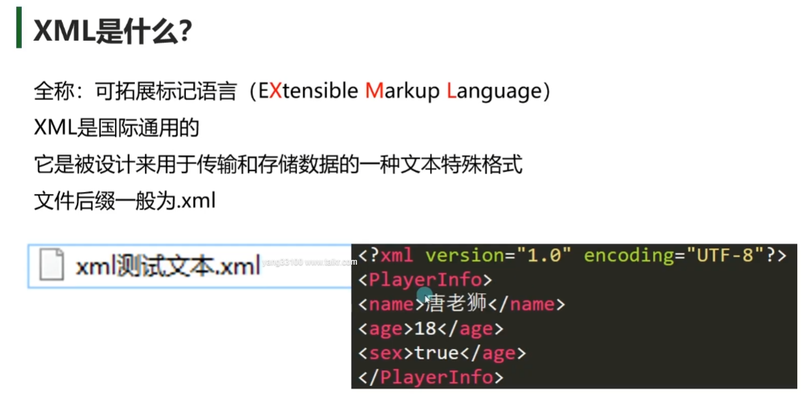
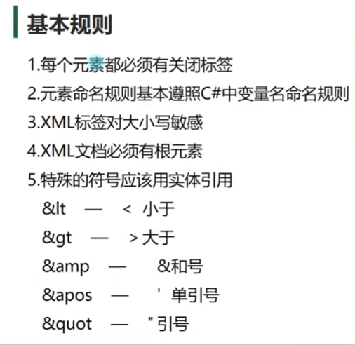
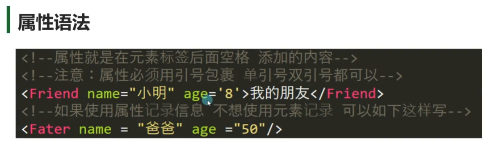
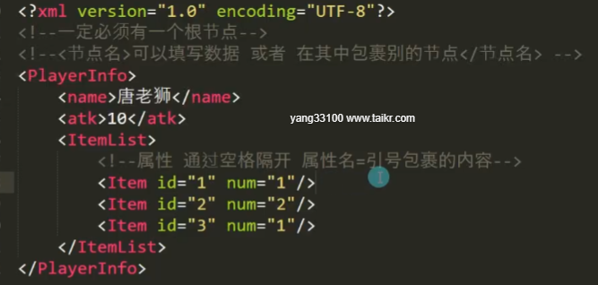
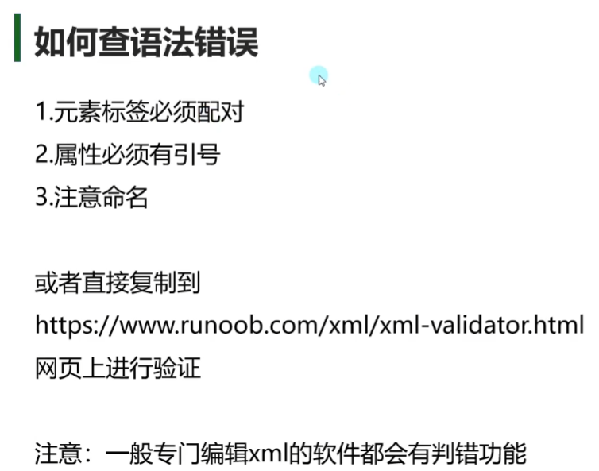
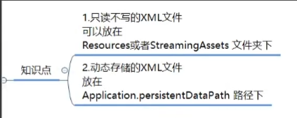
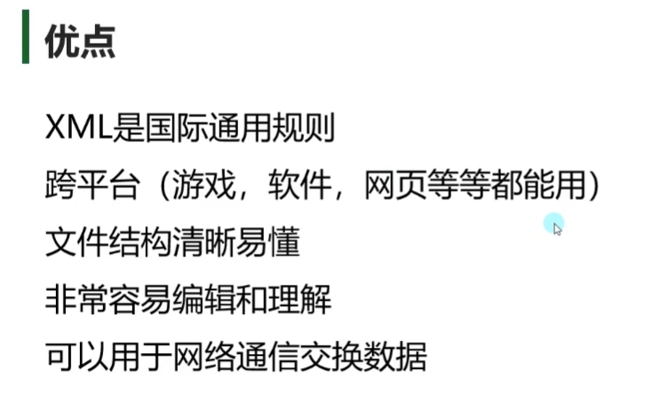
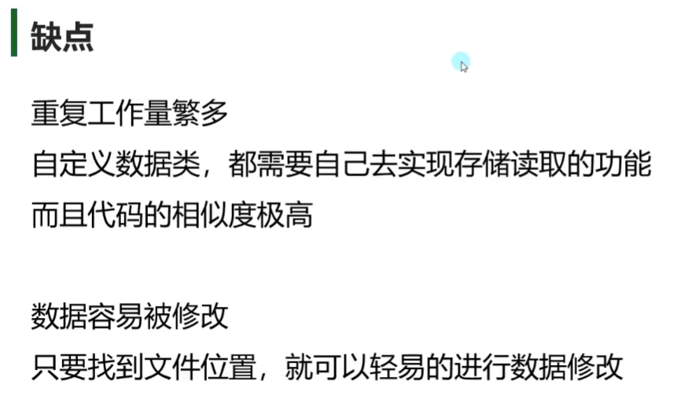
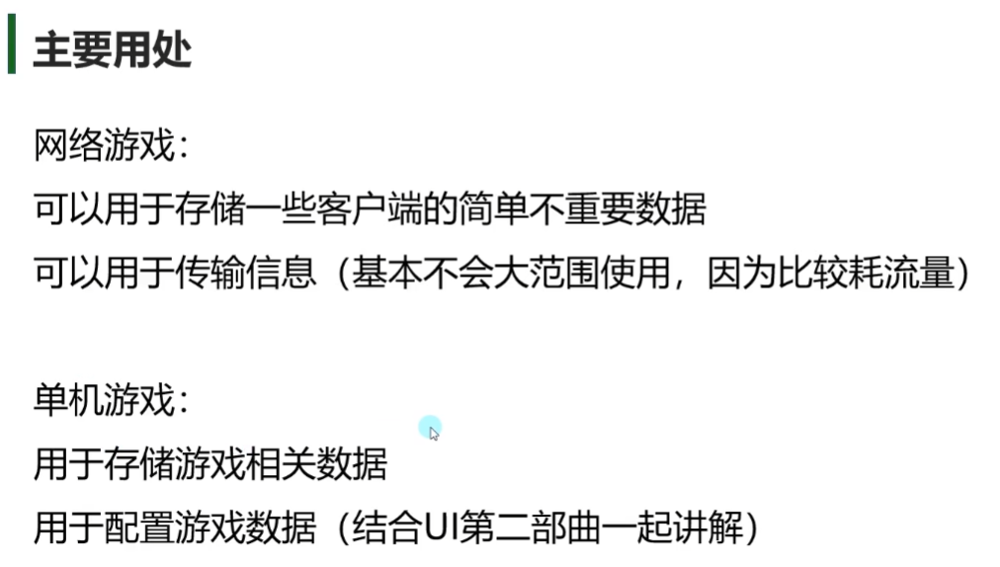

# 文件格式
## 基本语法
```xml
<?xml version="1.0" encoding="UTF-8"?>
<!--固定内容 version代表版本 encoding代表编码格式-->

<PlayerInfo>
	<name>Myname</name>
	<atk>10</atk>
	<ItemList>
		<Item>
			<id>1</id>
			<num>1</num>
		</Item>
		<Item>
			<id>2</id>
			<num>10</num>
		</Item>
		<Item>
			<id>2</id>
			<num>10</num>
		</Item>
	</ItemList>
</PlayerInfo>
```


## 属性







# C#读取存储XML

## XML文件存放位置


## C#读取xml
```csharp
//C#读取XML的方法有几种 
//1.XmlDocument    (把数据加载到内存中，方便读取)
//2.XmlTextReader  (以流形式加载，内存占用更少，但是是单向只读，使用不是特别方便，除非有特殊需求，否则不会使用)
//3.Linq           (以后专门讲Linq的时候讲)

//使用XmlDocument类读取是较方便最容易理解和操作的方法
#region 知识点一 读取xml文件信息
XmlDocument xml = new XmlDocument();
//通过XmlDocument读取xml文件 有两个API
//1.直接根据xml字符串内容 来加载xml文件
//存放在Resorces文件夹下的xml文件加载处理
TextAsset asset = Resources.Load<TextAsset>("TestXml");
xml.LoadXml(asset.text);
//通过这个方法 就能够翻译字符串为xml对象

//2.是通过xml文件的路径去进行加载
xml.Load(Application.streamingAssetsPath + "/TestXml.xml");
#endregion

#region 知识点二 读取元素和属性信息
//节点信息类
//XmlNode 单个节点信息类
//节点列表信息
//XmlNodeList 多个节点信息类

//获取xml当中的根节点
XmlNode root = xml.SelectSingleNode("Root");
//再通过根节点 去获取下面的子节点
XmlNode nodeName = root.SelectSingleNode("name");
//如果想要获取节点包裹的元素信息 直接 .InnerText
print(nodeName.InnerText);

XmlNode nodeAge = root.SelectSingleNode("age");
print(nodeAge.InnerText);

XmlNode nodeItem = root.SelectSingleNode("Item");
//第一种方式 直接 中括号获取信息
print(nodeItem.Attributes["id"].Value);
print(nodeItem.Attributes["num"].Value);
//第二种方式 
print(nodeItem.Attributes.GetNamedItem("id").Value);
print(nodeItem.Attributes.GetNamedItem("num").Value);

//这里是获取 一个节点下的同名节点的方法
XmlNodeList friendList = root.SelectNodes("Friend");

//遍历方式一：迭代器遍历
//foreach (XmlNode item in friendList)
//{
//    print(item.SelectSingleNode("name").InnerText);
//    print(item.SelectSingleNode("age").InnerText);
//}
//遍历方式二：通过for循环遍历
//通过XmlNodeList中的 成员变量 Count可以得到 节点数量
for (int i = 0; i < friendList.Count; i++)
{
    print(friendList[i].SelectSingleNode("name").InnerText);
    print(friendList[i].SelectSingleNode("age").InnerText);
}
#endregion

#region 总结
//1.读取XML文件
//XmlDocument xml = new XmlDocument();
//读取文本方式1-xml.LoadXml(传入xml文本字符串)
//读取文本方式2-xml.Load(传入路径)

//2.读取元素和属性
//获取单个节点 : XmlNode node = xml.SelectSingleNode(节点名)
//获取多个节点 : XmlNodeList nodeList = xml.SelectNodes(节点名)

//获取节点元素内容：node.InnerText
//获取节点元素属性：
//1.item.Attributes["属性名"].Value
//2.item.Attributes.GetNamedItem("属性名").Value

//通过迭代器遍历或者循环遍历XmlNodeList对象 可以获取到各单个元素节点

#endregion
```

## 存储xml
```csharp
#region 知识点一 决定存储在哪个文件夹下
//注意：存储xml文件 在Unity中一定是使用各平台都可读可写可找到的路径
// 1.Resources 可读 不可写 打包后找不到  ×
// 2.Application.streamingAssetsPath 可读 PC端可写 找得到  ×
// 3.Application.dataPath 打包后找不到  ×
// 4.Application.persistentDataPath 可读可写找得到   √

string path = Application.persistentDataPath + "/PlayerInfo2.xml";
print(Application.persistentDataPath);
#endregion

#region 知识点二 存储xml文件
//关键类 XmlDocument 用于创建节点 存储文件
//关键类 XmlDeclaration 用于添加版本信息
//关键类 XmlElement 节点类

//存储有5步
//1.创建文本对象
XmlDocument xml = new XmlDocument();

//2.添加固定版本信息
//这一句代码 相当于就是创建<?xml version="1.0" encoding="UTF-8"?>这句内容
XmlDeclaration xmlDec = xml.CreateXmlDeclaration("1.0", "UTF-8", "");
//创建完成过后 要添加进入 文本对象中
xml.AppendChild(xmlDec);

//3.添加根节点
XmlElement root = xml.CreateElement("Root");
xml.AppendChild(root);

//4.为根节点添加子节点
//加了一个 name子节点
XmlElement name = xml.CreateElement("name");
name.InnerText = "唐老狮";
root.AppendChild(name);

XmlElement atk = xml.CreateElement("atk");
atk.InnerText = "10";
root.AppendChild(atk);

XmlElement listInt = xml.CreateElement("listInt");
for (int i = 1; i <= 3; i++)
{
    XmlElement childNode = xml.CreateElement("int");
    childNode.InnerText = i.ToString();
    listInt.AppendChild(childNode);
}
root.AppendChild(listInt);

XmlElement itemList = xml.CreateElement("itemList");
for (int i = 1; i <= 3; i++)
{
    XmlElement childNode = xml.CreateElement("Item");
    //添加属性
    childNode.SetAttribute("id", i.ToString());
    childNode.SetAttribute("num", (i * 10).ToString());
    itemList.AppendChild(childNode);
}
root.AppendChild(itemList);

//5.保存
xml.Save(path);
#endregion

#region 知识点三 修改xml文件
//1.先判断是否存在文件
if( File.Exists(path) )
{
    //2.加载后 直接添加节点 移除节点即可
    XmlDocument newXml = new XmlDocument();
    newXml.Load(path);

    //修改就是在原有文件基础上 去移除 或者添加
    //移除
    XmlNode node;// = newXml.SelectSingleNode("Root").SelectSingleNode("atk");
    //这种是一种简便写法 通过/来区分父子关系
    node = newXml.SelectSingleNode("Root/atk");
    //得到自己的父节点
    XmlNode root2 = newXml.SelectSingleNode("Root");
    //移除子节点方法
    root2.RemoveChild(node);

    //添加节点
    XmlElement speed = newXml.CreateElement("moveSpeed");
    speed.InnerText = "20";
    root2.AppendChild(speed);

    //改了记得存
    newXml.Save(path);
}

#endregion

#region 总结
//1.路径选取
//在运行过程中存储 只能往可写且能找到的文件夹存储
//故 选择了Application.persistentDataPath

//2.存储xml关键类
//XmlDocument  文件  
//   创建节点 CreateElement
//   创建固定内容方法 CreateXmlDeclaration
//   添加节点 AppendChild
//   保存 Save
//XmlDeclaration 版本
//XmlElement 元素节点  
//   设置属性方法SetAttribute

//3.修改
//RemoveChild移除节点
//可以通过 /的形式 来表示 子节点的子节点 
#endregion
```







# 序列化

## XML序列化
```csharp
public class Lesson1Test
{
    //修改元素名
    [XmlElement("testPublic123123")]
    public int testPublic;
    private int testPrivate;
    protected int testProtected;
    internal int testInternal;

    public string testPUblicStr;

    public int testPro { get; set; }

    public Lesson1Test2 testClass = new Lesson1Test2();

    public int[] arrayInt;
    [XmlArray("IntList")]
    [XmlArrayItem("Int32")]
    public List<int> listInt;
    public List<Lesson1Test2> listItem;

    //不支持字典
    //public Dictionary<int, string> testDic = new Dictionary<int, string>() { { 1, "123" } };
}

public class Lesson1Test2
{
    [XmlAttribute("Test1")]
    public int test1 = 1;
    [XmlAttribute()]
    public float test2 = 1.1f;
    [XmlAttribute()]
    public bool test3 = true;
}


public class Lesson1 : MonoBehaviour
{
    // Start is called before the first frame update
    void Start()
    {
        #region 知识点一 什么是序列化和反序列化
        //序列化：把对象转化为可传输的字节序列过程称为序列化
        //反序列化：把字节序列还原为对象的过程称为反序列化

        //说人话：
        //序列化就是把想要存储的内容转换为字节序列用于存储或传递
        //反序列化就是把存储或收到的字节序列信息解析读取出来使用
        #endregion

        #region 知识点二 xml序列化
        //1.第一步准备一个数据结构类
        Lesson1Test lt = new Lesson1Test();
        //2.进行序列化
        //  关键知识点
        //  XmlSerializer 用于序列化对象为xml的关键类
        //  StreamWriter 用于存储文件  
        //  using 用于方便流对象释放和销毁

        //第一步：确定存储路径
        string path = Application.persistentDataPath + "/Lesson1Test.xml";
        print(Application.persistentDataPath);
        //第二步：结合 using知识点 和 StreamWriter这个流对象 来写入文件
        // 括号内的代码：写入一个文件流 如果有该文件 直接打开并修改 如果没有该文件 直接新建一个文件
        // using 的新用法 括号当中包裹的声明的对象 会在 大括号语句块结束后 自动释放掉 
        // 当语句块结束 会自动帮助我们调用 对象的 Dispose这个方法 让其进行销毁
        // using一般都是配合 内存占用比较大 或者 有读写操作时  进行使用的 
        using ( StreamWriter stream = new StreamWriter(path) )
        {
            //第三步：进行xml文件序列化
            XmlSerializer s = new XmlSerializer(typeof(Lesson1Test));
            //这句代码的含义 就是通过序列化对象 对我们类对象进行翻译 将其翻译成我们的xml文件 写入到对应的文件中
            //第一个参数 ： 文件流对象
            //第二个参数: 想要备翻译 的对象
            //注意 ：翻译机器的类型 一定要和传入的对象是一致的 不然会报错
            s.Serialize(stream, lt);
        }
        #endregion

        #region 知识点三 自定义节点名 或 设置属性
        //可以通过特性 设置节点或者设置属性 并且修改名字
        #endregion

        #region 总结
        //序列化流程
        //1.有一个想要保存的类对象
        //2.使用XmlSerializer 序列化该对象
        //3.通过StreamWriter 配合 using将数据存储 写入文件
        //注意：
        //1.只能序列化公共成员
        //2.不支持字典序列化
        //3.可以通过特性修改节点信息 或者设置属性信息
        //4.Stream相关要配合using使用
        #endregion
    }

}
```
## XML反序列化
```csharp
#region 知识回顾
// 序列化 就是把类对象 转换为可存储和传输的数据
// 反序列化 就是把存储或收到的数据 转换为 类对象

// xml序列化关键知识
// 1.using 和 StreamWriter
// 2.XmlSerializer 的 Serialize序列化方法
#endregion

#region 知识点一 判断文件是否存在
string path = Application.persistentDataPath + "/Lesson1Test.xml";
if( File.Exists(path) )
{
    #region 知识点二 反序列化
    //关键知识
    // 1.using 和 StreamReader
    // 2.XmlSerializer 的 Deserialize反序列化方法

    //读取文件
    using (StreamReader reader = new StreamReader(path))
    {
        //产生了一个 序列化反序列化的翻译机器
        XmlSerializer s = new XmlSerializer(typeof(Lesson1Test));
        Lesson1Test lt = s.Deserialize(reader) as Lesson1Test;
    }
    #endregion
}
#endregion

#region 总结
//1.判断文件是否存在 File.Exists
//2.文件流获取 StreamReader reader = new StreamReader(path)
//3.根据文件流 XmlSerializer通过Deserialize反序列化 出对象

//注意：List对象 如果有默认值 反序列化时 不会清空 会往后面添加
#endregion
```

## IXmlSerializable接口
```csharp
#region 知识点一 IXmlSerializable是什么
//C# 的XmlSerializer 提供了可拓展内容 
//可以让一些不能被序列化和反序列化的特殊类能被处理
//让特殊类继承 IXmlSerializable 接口 实现其中的方法即可
#endregion

#region 知识点二 自定义类实践
TestLesson3 t = new TestLesson3();
using (StreamWriter writer = new StreamWriter(Application.persistentDataPath + "/test.xml"))
{
    XmlSerializer s = new XmlSerializer(typeof(TestLesson3));
    s.Serialize(writer, t);
}

using(StreamReader reader = new StreamReader(Application.persistentDataPath + "/test.xml"))
{
    XmlSerializer s = new XmlSerializer(typeof(TestLesson3));
    t = s.Deserialize(reader) as TestLesson3;
}
#endregion
```
```csharp
public class TestLesson3 : IXmlSerializable
{
    public int test1 = 10;
    public int test2 = 99;

    public XmlSchema GetSchema()
    {
        return null;
    }

    public void ReadXml(XmlReader reader)
    {
        //读属性
        //test1 = int.Parse(reader["Test1"]);
        //test2 = int.Parse(reader["Test2"]);

        //读节点
        //方式一
        //reader.Read();//这时读到的是节点
        //reader.Read();//这时读到的才是值
        //test1 = int.Parse(reader.Value);//得到值内容
        //reader.Read();//得到节点尾部配对
        //reader.Read();//读到节点开头
        //reader.Read();//读到值
        //test2 = int.Parse(reader.Value);//获取值内容
        //方式二
        //while (reader.Read())
        //{
        //    if(reader.NodeType == XmlNodeType.Element)
        //    {
        //        switch (reader.Name)
        //        {
        //            case "Test1":
        //                reader.Read();
        //                test1 = int.Parse(reader.Value) ;
        //                break;
        //            case "Test2":
        //                reader.Read();
        //                test2 = int.Parse(reader.Value);
        //                break;
        //        }
        //    }
        //}

        //读包裹点
        XmlSerializer s = new XmlSerializer(typeof(int));
        reader.Read();
        reader.ReadStartElement("Test1");
        test1 = (int)s.Deserialize(reader);
        reader.ReadEndElement();
        reader.ReadStartElement("Test2");
        test1 = (int)s.Deserialize(reader);
        reader.ReadEndElement();
    }

    public void WriteXml(XmlWriter writer)
    {
        //写属性
        //writer.WriteAttributeString("Test1", test1.ToString());
        //writer.WriteAttributeString("Test2", test2.ToString());

        //写节点
        //writer.WriteElementString("Test1", test1.ToString());
        //writer.WriteElementString("Test2", test2.ToString());

        //写包裹节点
        XmlSerializer s = new XmlSerializer(typeof(int));
        writer.WriteStartElement("Test1");
        s.Serialize(writer, test1);
        writer.WriteEndElement();

        writer.WriteStartElement("Test2");
        s.Serialize(writer, test2);
        writer.WriteEndElement();

    }
}
```

## 让Dictionary支持序列化反序列化
```csharp
#region 知识点一 思考如何让Dictionary支持xml序列和反序列化
//1.我们没办法修改C#自带的类
//2.那我们可以重写一个类 继承Dictionary 然后让这个类继承序列化拓展接口IXmlSerializable
//3.实现里面的序列化和反序列化方法即可
#endregion

#region 知识点二 让Dictionary支持序列化和反序列化
TestLesson4 tl4 = new TestLesson4();
//tl4.dic = new SerizlizerDictionary<int, string>();
//tl4.dic.Add(1, "123");
//tl4.dic.Add(2, "234");
//tl4.dic.Add(3, "345");
string path = Application.persistentDataPath + "/TestLesson4.xml";
//using(StreamWriter writer = new StreamWriter(path))
//{
//    XmlSerializer s = new XmlSerializer(typeof(TestLesson4));
//    s.Serialize(writer, tl4);
//}

using (StreamReader reader = new StreamReader(path))
{
    XmlSerializer s = new XmlSerializer(typeof(TestLesson4));
    tl4 = s.Deserialize(reader) as TestLesson4;
}

#endregion
```

```csharp
public class SerizlizerDictionary<TKey, TValue> : Dictionary<TKey, TValue>, IXmlSerializable
{
    public XmlSchema GetSchema()
    {
        return null;
    }

    //自定义字典的 反序列化 规则
    public void ReadXml(XmlReader reader)
    {
        XmlSerializer keySer = new XmlSerializer(typeof(TKey));
        XmlSerializer valueSer = new XmlSerializer(typeof(TValue));

        //要跳过根节点
        reader.Read();
        //判断 当前不是元素节点 结束 就进行 反序列化
        while (reader.NodeType != XmlNodeType.EndElement)
        {
            //反序列化键
            TKey key = (TKey)keySer.Deserialize(reader);
            //反序列化值
            TValue value = (TValue)valueSer.Deserialize(reader);
            //存储到字典中
            this.Add(key, value);
        }
        reader.Read();
    }

    //自定义 字典的 序列化 规则
    public void WriteXml(XmlWriter writer)
    {
        XmlSerializer keySer = new XmlSerializer(typeof(TKey));
        XmlSerializer valueSer = new XmlSerializer(typeof(TValue));

        foreach (KeyValuePair<TKey, TValue> kv in this)
        {
            //键值对 的序列化
            keySer.Serialize(writer, kv.Key);
            valueSer.Serialize(writer, kv.Value);
        }
    }
}
```