# NGUI基础组件
## Root组件 UIRoot
```c#
#region 知识点一 必备知识——分辨率概念
//1.分辨率
//屏幕宽高两个方向的像素点
//比如1920 * 1080
//宽1920个像素
//高1080个像素

//2.像素
//像素
//像素即px
//是画面中最小的点(单位色块)

//3.屏幕尺寸
//屏幕对角线长度

//4.屏幕比例
//PC显示器
//1920:1080 = 16:9

//苹果手机
//iPhone7,8：1334 * 750 = 16:9
//iPhone 7,8 Plus：1920 * 1080 = 16:9
//iPhoneX：2436 * 1125 = 19.5:9
//iPhone12: 2532 * 1170 = 19.5:9

//目前市面上设备分辨率比例传统的有：
//4:3(ipad)
//16:10
//16:9(老手机 、电脑显示器)
//18:9（去掉留海屏幕）
//19.5:9（ 新款手机）
//19.9:9

//5.dpi
//像素密度
//单位面积上有多少个像素点
//一般指一英寸有多少个像素点
#endregion

#region 知识点二 Root是用来干啥的
//Root是用于分辨率自适应的根对象
//可以设置基本分辨率,相当于设置UI显示区域
//并且管理所有UI控件的分辨率自适应

//可以简单理解 它管理一个 UI画布 所有的UI都是显示在这个画布上的
//它会管理 UI画布 和 不同屏幕分辨率的 适应关系
#endregion

#region 知识点三 Root相关参数

#endregion

#region 总结
//1.Flexible 适用于可以手动拖窗口改变分辨率的设备 比如pc端

//2.Constrained 适用于移动设备
//  因为移动设备都是全屏应用 不会频繁改变分辨率 只用适配不同分辨率的设备
//  横屏勾选 高 fit  竖屏 勾选 宽 fit 一般就可以比较好的进行分辨率适应了 
//  需要注意的是 背景图 一定要考虑 极限 宽高比来出 最大宽高比  19.9:9

//3.Constrained On Mobiles 是上面两者的综合体 适用于多平台发布的游戏和应用
#endregion
```

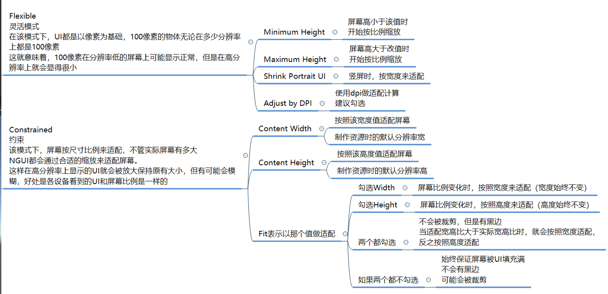

## Panel
```c#
#region 知识点一 Panel用来干啥
//1.管理一个UI面板的渲染顺序
//2.管理一个UI面板上的所有子控件
#endregion

#region 知识点二 Panel参数相关

#endregion

#region 总结
//1.没有Panel父对象 UI控件看不到
//2.Panel一般用于管理面板 控制层级
//3.Panel可以有多个 一般一个Panel管理一个面板
#endregion
```


## EventSystem组件 (UICamera)

```c#
#region 知识点一 EventSystem是用来干啥的
//主要作用是让摄像机渲染出来的物体
//能够接收到NGUI的输入事件
//大部分设置不需要我们去修改

//有了它我们通过鼠标 触碰 键盘 控制器 操作UI 响应玩家的输入
#endregion

#region 知识点二 相关参数

#endregion

#region 总结
//1.EventSystem很重要，如果没有它，我们没有办法监听玩家输入
//2.创建UI时的 2DUI 和3DUI 主要就是摄像机的模式不一样
//  EventSystem的2D和3D主要是 采用2D碰撞器 还是3D碰撞器 不能直接改变摄像机模式
#endregion
```

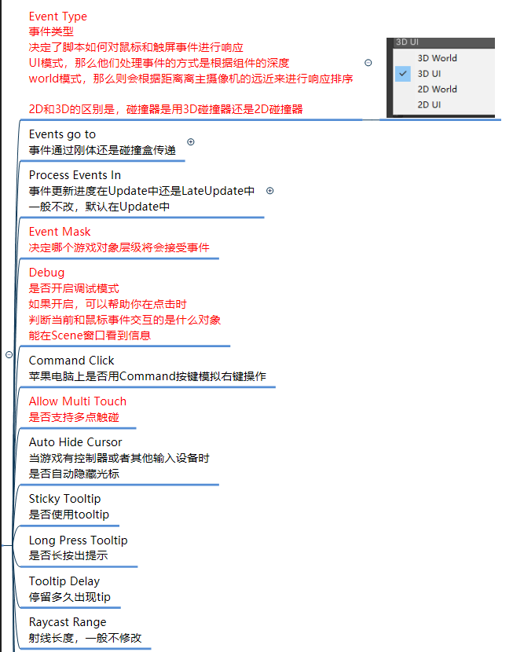

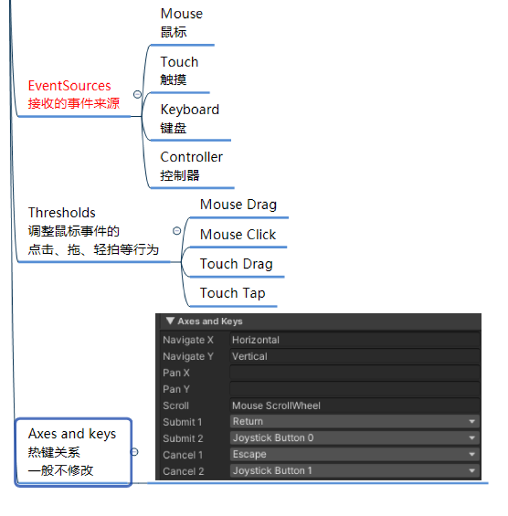

# 图集制作
```c#
#region 知识点一 图集用来干啥
//NGUI中的最小图片控件Sprite要使用图集中的图片进行显示
//图集 就是把很多单独的小图 合并为 一张大图 合并后的大图就是图集
//目的：提高渲染性能
#endregion

#region 知识点二 打开图集制作工具
//方法一：Project右键打开
//方法二：上方工具栏NGUI——Open——Atlas Maker
#endregion

#region 知识点三 新建图集
//在图集工具中创建

//图集关键文件有3
//1.图集文件
//2.图集材质
//3.图集图片
#endregion

#region 知识点四 修改删除图集元素
//在图集工具中操作
//增删改
#endregion
```

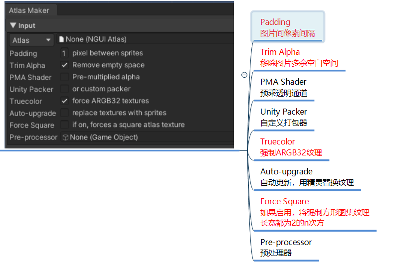

# 三大基础控件

## Sprite 精灵图片
```c#
#region 知识点一 Sprite用来做啥
//NGUI中所有中小尺寸图片显示都用Sprite显示
//使用它来显示图集中的单个图片资源
#endregion

#region 知识点二 创建Sprite

#endregion

#region 知识点三 Sprite参数

#endregion

#region 知识点四 代码设置图片
//sprite.width = 200;
//sprite.height = 300;
//1.改变为当前图集中选择的图片
sprite.spriteName = "bk";

//2.改变为其它图集中的图片
//先加载图集
NGUIAtlas atlas = Resources.Load<NGUIAtlas>("Atlas/login");
sprite.atlas = atlas;
//再设置图片
sprite.spriteName = "ui_DL_anniuxiao_01";
#endregion
```


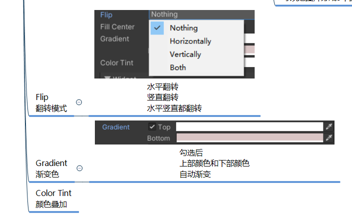

**widget**

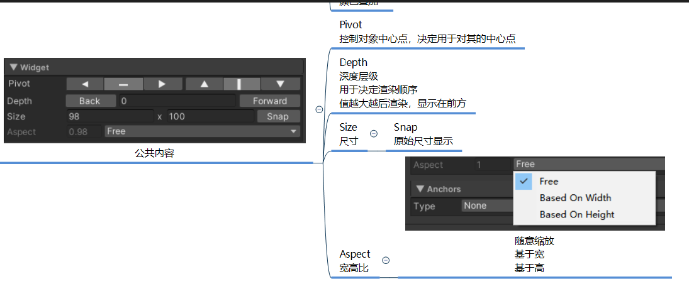

## Label
```c#
public UILabel label;

#region 知识点一 Label用来干啥
//NGUI中所有文本显示都使用Label来显示
#endregion

#region 知识点二 创建Label

#endregion

#region 知识点三 Label参数

#endregion

#region 知识点四 富文本

#endregion

#region 知识点五 代码设置Label
label.text = "123123123123";
#endregion
```

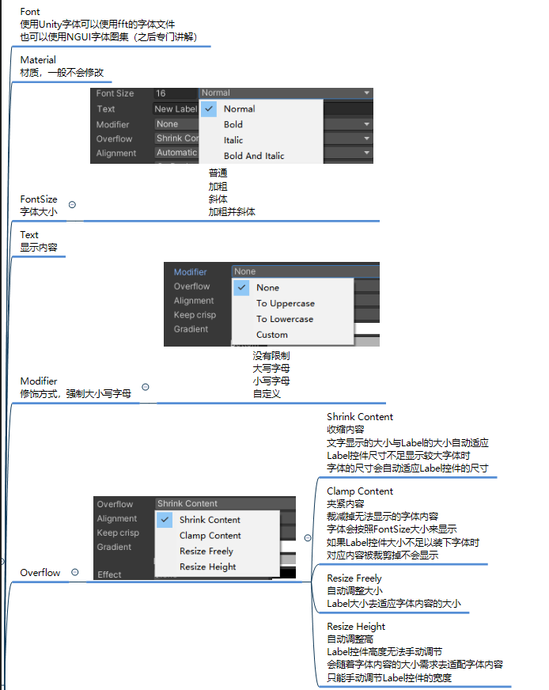

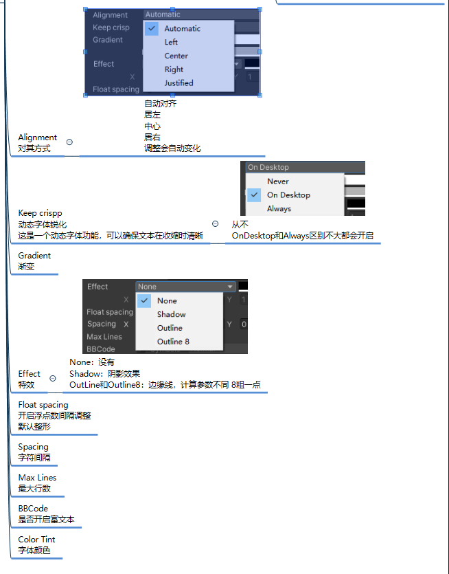

**富文本**

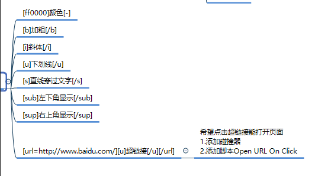

## Texture 大图控件
```c#
#region 知识点一 Texture用来干啥
//Sprite只能显示图集中图片 一般用于显示中小图片
//如果使用大尺寸图片 没有必要打图集
//直接使用Texture组件进行大图片显示
#endregion

#region 知识点二 参数相关

#endregion

#region 知识点三 代码设置
//加载图片 
Texture texture = Resources.Load<Texture>("BK");
//改变图片
if (texture != null)
    tex.mainTexture = texture;
#endregion
```

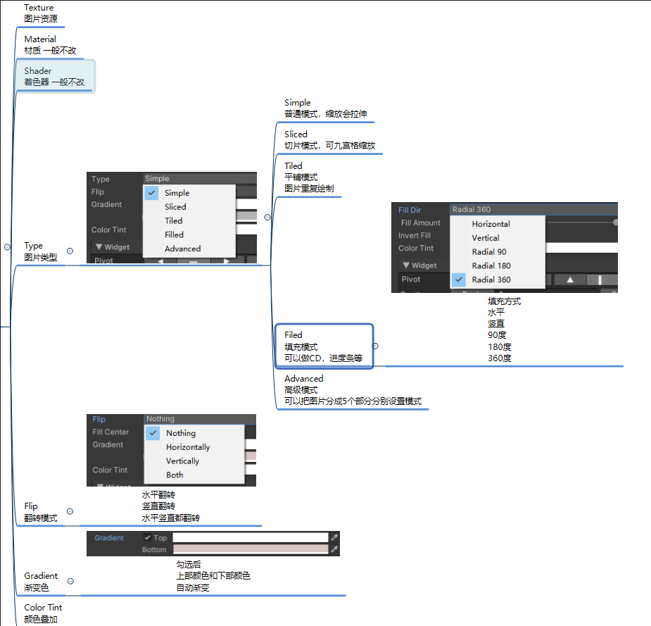

# 组合控件

## Button 按钮组件 sprite+button、碰撞器脚本
```c#
public UIButton btn;

// Start is called before the first frame update
void Start()
{
    #region 知识点一 所有组合控件的共同特点
    //1.在3个基础组件对象上添加对应组件
    //2.如果希望响应点击等事件 需要添加碰撞器
    #endregion

    #region 知识点二 Button是用来干嘛的
    //UI界面中的按钮 当点击按钮后我们可以进行一些处理
    #endregion

    #region 知识点三 制作Button
    //1.一个Sprite（需要文字再加一个Label子对象）
    //2.为Sprite添加Button脚本
    //3.添加碰撞器
    #endregion

    #region 知识点四 参数相关

    #endregion

    #region 知识点五 监听事件的两种方式
    //1.拖脚本
    //2.代码获取按钮对象监听
    btn.onClick.Add(new EventDelegate(ClickDo2));

    btn.onClick.Add(new EventDelegate(() => {
        print("那么大表达式添加的 点击事件处理");
    }));
    #endregion
}

public void ClickDoSomthing()
{
    print("按钮点击");
}

public void ClickDo2()
{
    print("按钮点击2");
}

#region 总结
//1.button的制作流程
//  3个基础组件构成 任意一个基础组件 往上面添加Button脚本 再添加碰撞器 就可以让它变成一个按钮
//2.事件的监听
// 通过 拖曳 或者 代码的形式 可以进行按钮的 点击事件 监听
#endregion
```
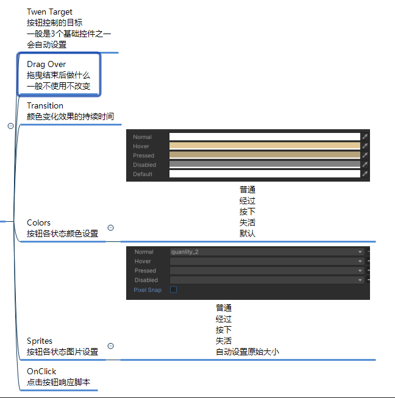

## Toggle 单选多选框组件
```c#
public UIToggle tog1;
public UIToggle tog2;
public UIToggle tog3;

void Start()
{
    #region 知识点一 Toggle用来干啥
    //单选框 多选框都可以使用它来制作
    #endregion

    #region 知识点二 制作Toggle
    //1.2个Sprite 1父1子
    //2.为父对象添加Toggle脚本
    //3.添加碰撞器
    #endregion

    #region 知识点三 参数相关

    #endregion

    #region 知识点四 监听事件的两种方式
    //1.拖代码
    //2.代码进行监听添加

    tog1.onChange.Add(new EventDelegate(Change2));
    tog2.onChange.Add(new EventDelegate(Change2));
    tog3.onChange.Add(new EventDelegate(Change2));
    #endregion
}


private void Change2()
{
    print("代码监听");
}


public void Change()
{
    print("Toggle变化执行的内容");

    if( tog1.value )
    {
        print("tog1选中");
    }
    else if (tog2.value)
    {
        print("tog2选中");
    }
    else if (tog3.value)
    {
        print("tog3选中");
    }
}
```

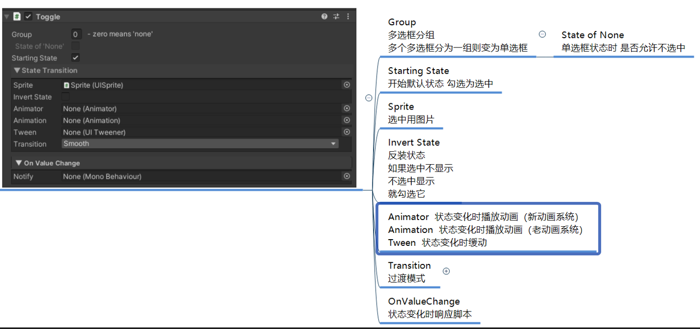

## Input
```c#
public UIInput input;

void Start()
{
    #region 知识点一 Input是啥
    //输入框
    //可以用来制作账号密码聊天输入框
    #endregion

    #region 知识点二 制作Input
    //1.1个Sprite做背景 1个Label显示文字
    //2.为Sprint添加Input脚本
    //3.添加碰撞器
    #endregion

    #region 知识点三 参数相关

    #endregion

    #region 知识点四 监听事件的两种方式
    //1.拖曳脚本
    //2.通过代码关联

    input.onSubmit.Add(new EventDelegate(() =>
    {
        print("完成输入 通关代码添加的监听函数");
    }));

    input.onChange.Add(new EventDelegate(() =>
    {
        print("输入变化 通关代码添加的监听函数");
    }));
    #endregion
}

public void OnSubmit()
{
    print("输入完成" + input.value);
}

public void OnChange()
{
    print("输入变化" + input.value);
}
```

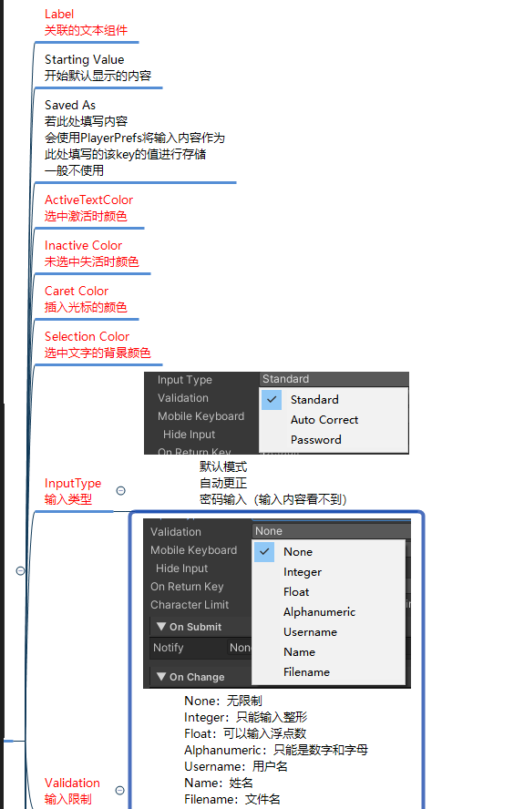

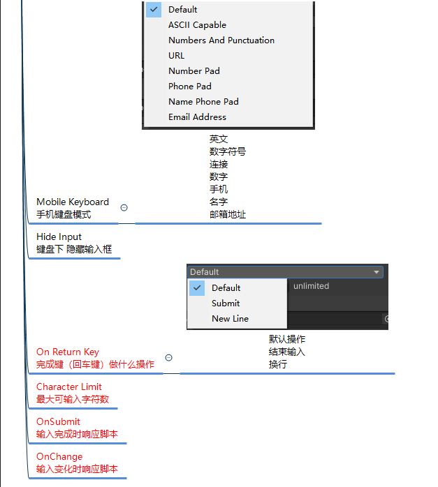

## PopupList 下拉列表
```c#
public UIPopupList list;
// Start is called before the first frame update
void Start()
{
    #region 知识点一 PopupList是啥？
    //下拉列表 
    #endregion

    #region 知识点二 制作Popuplist
    //1.一个sprite做背景 一个lable做显示内容
    //2.添加PopupList脚本
    //3.添加碰撞器
    //4.关联lable做信息更新，选择Label中的SetCurrentSelection函数
    #endregion

    #region 知识点三 参数相关

    #endregion

    #region 知识点四 监听事件的两种方式
    //1.拖曳代码
    //2.代码关联
    list.items.Add("新加 选项4");

    list.onChange.Add(new EventDelegate(() => {

        print("代码添加的监听" + list.value);
    }));
    #endregion
}

public void OnChange()
{
    print("选项变化" + list.value);
}
```

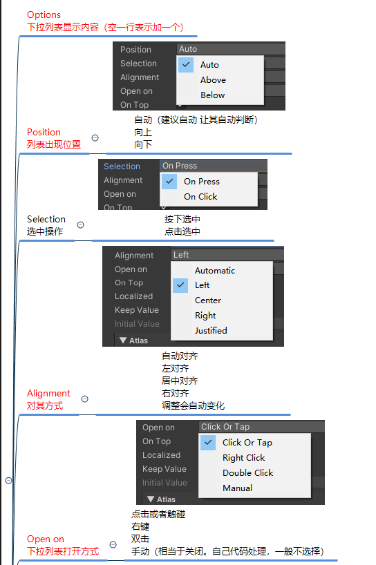

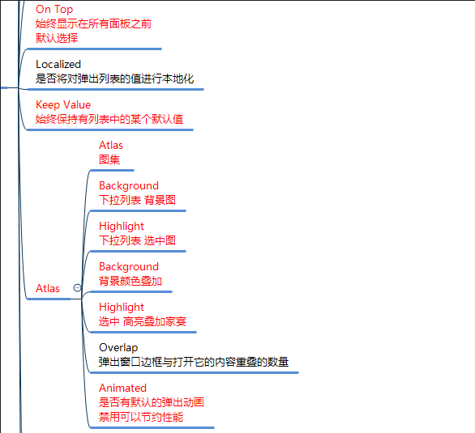

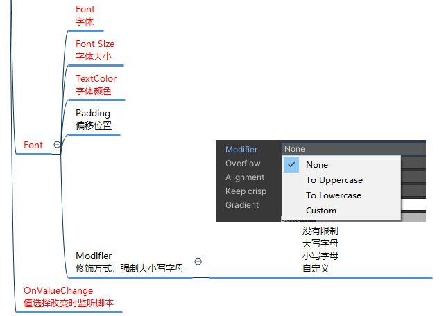

## Slider
```c#
public UISlider slider;
// Start is called before the first frame update
void Start()
{
    #region 知识点一 Slider是啥？
    //滑动条控件
    //主要用于设置音乐音效大小等
    #endregion

    #region 知识点二 制作Slider
    //1.3个sprite 1个做根对象为背景  2个子对象 1个进度 1个滑动块 
    //2.设置层级
    //3.为根背景添加Slider脚本
    //4.添加碰撞器（父对象或者滑块）
    //5.关联3个对象
    #endregion

    #region 知识点三 参数相关

    #endregion

    #region 知识点四 监听事件的两种方式
    //1.拖曳脚本关联
    //2.通过代码关联
    slider.onChange.Add(new EventDelegate(() => {

        print("通过代码监听" + slider.value);
    }));

    slider.onDragFinished += () => {
        print("拖曳结束" + slider.value);
    };
    #endregion
}

public void OnChange()
{
    print("值变化" + slider.value);
}
```

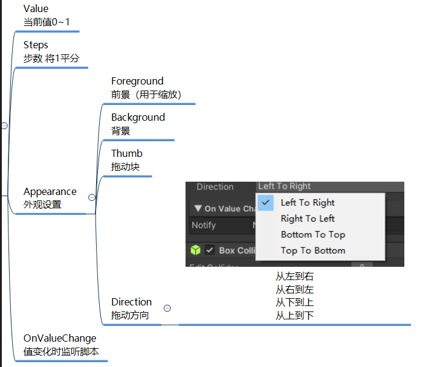

## ScrollBar滚动条 ProgressBar进度条
```c#
#region 知识点一 ScrollBar和ProgressBar用来干啥
//1.ScrollBar滚动条一般不单独使用 都是配合滚动视图使用 类似VS右侧的滚动条
//2.ProgressBar进度条 一般不咋使用   一般直接用Sprite的Filed填充模式即可

//他们的参数和之前的知识很类似
//所以这两个知识点不是重点 了解如何制作他们即可
#endregion

#region 知识点二 制作Scrollbar
//1.两个Sprite 1个背景 1个滚动条
//2.背景父对象添加脚本
//3.添加碰撞器
//4.关联对象
#endregion

#region 知识点三 制作ProgressBar
//1.两个Sprite 1个背景 1个进度条
//2.背景父对象添加脚本
//3.关联对象
#endregion
    
```

## ScrollView 滚动视图
```c#
#region 知识点一 ScrollView来干啥
//滚动视图
//我们现在用于编程的VS代码窗口就是典型的滚动视图
//游戏中主要用于 背包、商店、排行榜等等功能
#endregion

#region 知识点二 制作ScrollView
//1.直接工具栏创建即可 NGUI——Create——ScrollView
//2.若需要ScrollBar 自行添加水平和竖直
//3.添加子对象 为子对象添加Drag Scroll View和碰撞器
#endregion

#region 知识点三 参数相关

#endregion

#region 知识点四 自动对齐脚本Grid 参数相关

#endregion

//通过sv控制滚动条更新
sv.UpdateScrollbars();

```

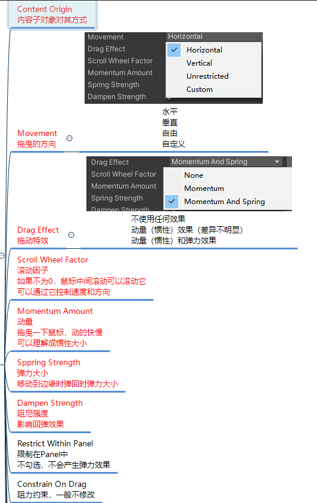

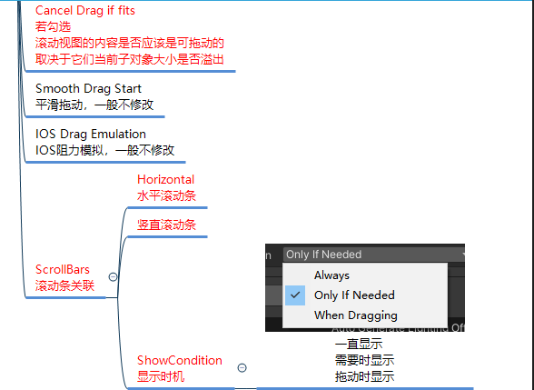


**grid**

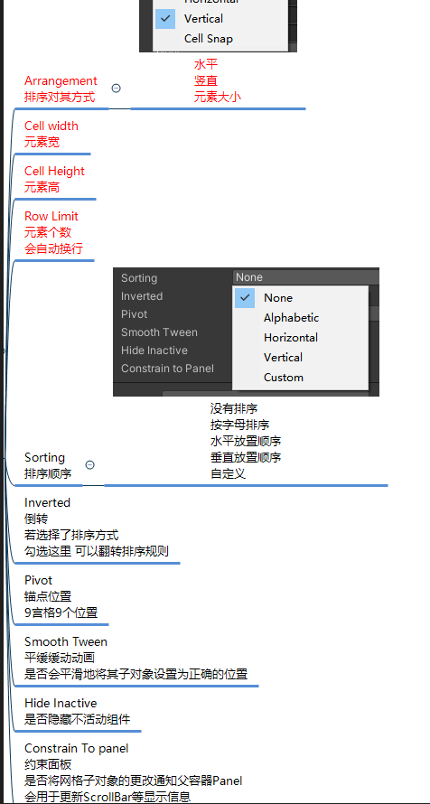

# Anchor 锚点组件
```c#
#region 知识点一 Anchor是什么
//是用于9宫格布局的锚点
//它有两个关键知识点
//1.老版本——锚点组件——用于控制对象对齐方式
//2.新版本——3大基础控件自带 锚点内容——用于控制对象相对父对象布局
#endregion

#region 知识点二 老版本——锚点组件
//主要用于设置面板相对屏幕的9宫格位置
//用于控制对象对齐方式
#endregion

#region 知识点三 新版本——基础控件自带锚点信息
//用于控制对象相对父对象布局
#endregion
```

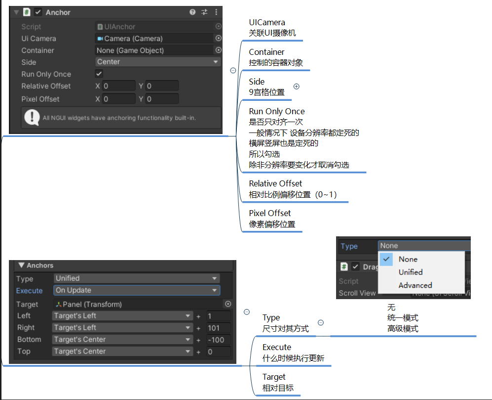

# NGUI进阶
## EventListener和EventTrigger
```c#
public UISprite A;
public UISprite B;
// Start is called before the first frame update
void Start()
{
    #region 知识点一 控件自带事件的局限性
    //目前复合控件只提供了一些常用的事件监听方式
    //比如
    //Button —— 点击
    //Toggle —— 值变化
    //等等
    //如果想要制作 按下 抬起 长按等功能 利用现在的知识是无法完成的
    #endregion

    #region 知识点二 NGUI事件 响应函数
    //添加了碰撞器的对象
    //NGUI提供了一些利用反射调用的函数
    //经过 OnHover(bool isOver)
    //按下 OnPress(bool pressed)
    //点击 OnClick()
    //双击 OnDoubleClick()
    //拖曳开始 OnDragStart()
    //拖曳中  OnDrag(Vector2 delta)
    //拖曳结束 OnDragEnd()
    //拖曳经过某对象 OnDragOver(GameObject go)
    //拖曳离开某对象 OnDragOut(GameObject go)
    //等等等等
    #endregion

    #region 知识点三 更加方便的UIEventListener和UIEventTrigger
    //他们帮助我们封装了所有 特殊响应函数
    //可以通过它进行管理添加
    //1.UIEventListener 适合代码添加
    UIEventListener listener = UIEventListener.Get(A.gameObject);
    listener.onPress += (obj, isPress) => {
        print(obj.name + "被按下或者抬起了" + isPress);
    };

    listener.onDragStart += BeginDrag;

    //2.UIEventTrigger 适合Inspector面板 关联脚本添加


    //UIEventListener和UIEventTrigger区别
    //1.Listener更适合 代码添加监听 Trigger适合拖曳对象添加监听
    //2.Listener传入的参数 更具体  Trigger就不会传入参数 我们需要在函数中去判断处理逻辑
    #endregion
}

private void BeginDrag(GameObject obj)
{
    print(obj.name + "开始拖曳");
}

public void Press()
{

}

//void OnPress(bool pressed)
//{
//    if( pressed )
//    {
//        print("按下");
//    }
//    else
//    {
//        print("抬起");
//    }
//}

//void OnHover(bool isOver)
//{
//    if( isOver )
//    {
//        print("鼠标经过");
//    }
//    else
//    {
//        print("鼠标离开");
//    }
//}

//void OnClick()
//{
//    print("点击相关");
//}

//void OnDoubleClick()
//{
//    print("双击相关");
//}

//void OnDragStart()
//{
//    print("开始拖曳");
//}

//void OnDrag(Vector2 delta)
//{
//    print("拖曳中" + delta);
//}

//void OnDragEnd()
//{
//    print("拖曳结束");
//}

//void OnDragOver(GameObject obj)
//{
//    print("拖曳经过" + obj.name);
//}

//void OnDragOut(GameObject obj)
//{
//    print("拖曳离开" + obj.name);
//}
```

## drawcall
```c#
#region 知识点一 DrawCall的概念
//字面理解DrawCall  就是 绘制呼叫的意思  表示 CPU（中央处理器）通知GPU（图形处理器-显卡）

//DrawCall 概念
//就是CPU(处理器)准备好渲染数据（顶点，纹理，法线，Shader等等）后
//告知GPU(图形处理器-显卡)开始渲染（将命令放入命令缓冲区）的命令

//简单来说：一次DrawCall就是 CPU准备好渲染数据通知 GPU渲染的这个过程

//如果游戏中DrawCall数量较高会影响CPU的效率
//最直接的感受就是游戏会卡顿

//举例说明  以拷贝文件来进行类比
//假设我们创建10000个小文件，每个文件大小为1kb，然后把这些文件拷贝到另一个文件夹中
//你会发现，即使这些文件加起来不超过10MB，但是拷贝花费的时间是很长的
//如果我们单独创建1个10MB的文件拷贝到另一个文件夹，基本可以瞬间拷贝完毕
//为什么会这样呢？
//因为每一个文件赋值动作都需要很多额外的操作，比如分配内存，创建数据等等
//这些操作就会带来一些额外的性能开销
//简单理解 文件越多额外开销就越大

//渲染过程和上面的例子很类似，每次DrawCall，CPU都需要准备很多数据发送给GPU
//那么如果DrawCall越多那么额外开销就越大，其实GPU的渲染效率是很强大的，往往影响渲染效率的
//都是因为CPU提交命令的速度
//如果DrawCall 太多CPU就会把大量时间花在提交DrawCall上 造成CPU过载，游戏卡顿
#endregion

#region 知识点二 如何降低DrawCall数量
//在UI层面上
//小图合大图——>即多个小DrawCall变一次大DrawCall
#endregion

#region 知识点三 制作UI时降低DrawCall的技巧
//1.通过NGUI Panel上提供的DrawCall查看工具
//2.注意不同图集之间的层级关系
//3.注意Label的层级关系
#endregion
```

# NGUI字体
```c#
#region 知识点一 NGUI字体的作用
//1.降低DrawCall
//2.自定义美术字体
#endregion

#region 知识点二 制作NGUI字体
//NGUI内部提供了字体制作工具
// 1.根据字体文件 生成指定内容文字 达到降低DrawCall的目的
// 2.使用第三方工具BitmapFont生成字体信息和图集
//   通过NGUI 字体工具使用第三方工具生成的内容制作字体
//   达到自定义美术字体
#endregion

#region 知识点三 Unity动态字体和NGUI字体如何选择
//1.文字变化较多用Unity动态字体 变化较少用NGUI字体
//2.想要减少DrawCall用NGUI字体 
//3.美术字用NGUI字体
#endregion
```

# NGUI缓动
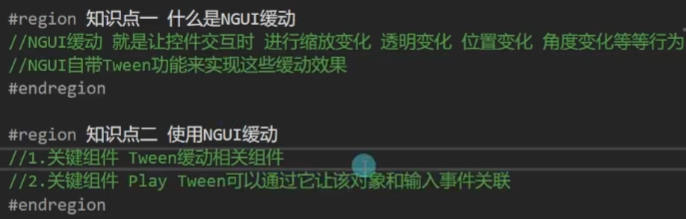

### **tween 参数**

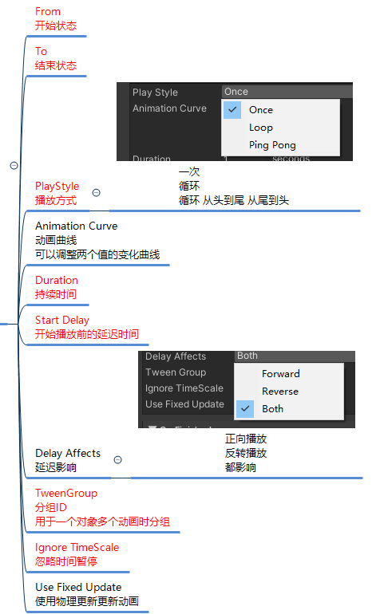

### **play tween 参数**

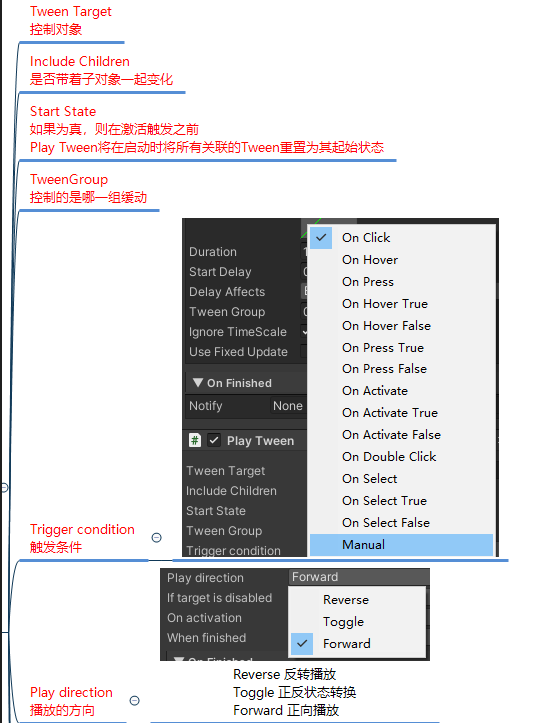

## NGUI中显示3D模型和粒子特效
```c#
#region 知识点一 NGUI中显示3D模型
//方法一：
//使用UI摄像机渲染3D模型
//1.改变NGUI的整体层级 为 UI层
//2.改变主摄像机和NGUI摄像机的 渲染层级
//3.将想要被UI摄像机渲染的对象层级改为 UI层
//4.调整模型和UI控件的Z轴距离

//方法二：
//使用多摄像机渲染 Render Texture
#endregion

#region 知识点二 NGUI中显示粒子特效
//1.让Panel和粒子特效处于一个排序层
//2.在粒子特效的 Render参数中 设置自己的层级
#endregion
```

## 其他
```c#
#region 知识点一 NGUI 事件响应 播放音效
//PlaySound 脚本
#endregion

#region 知识点二 NGUI控件和键盘按键绑定
//KeyBinding 脚本
#endregion

#region 知识点三 PC端 tab键快捷切换选中
//KeyNavigation 脚本
#endregion

#region 知识点四 语言本地化
//Localization脚本
//1.在Resources下创建一个txt文件 命名必须为Localization
//2.配置文件
//3.给想要切换文字的Label对象下挂载Localize 关联Key
//4.给用于切换语言的下拉列表下添加脚本LanguageSelection
#endregion
```