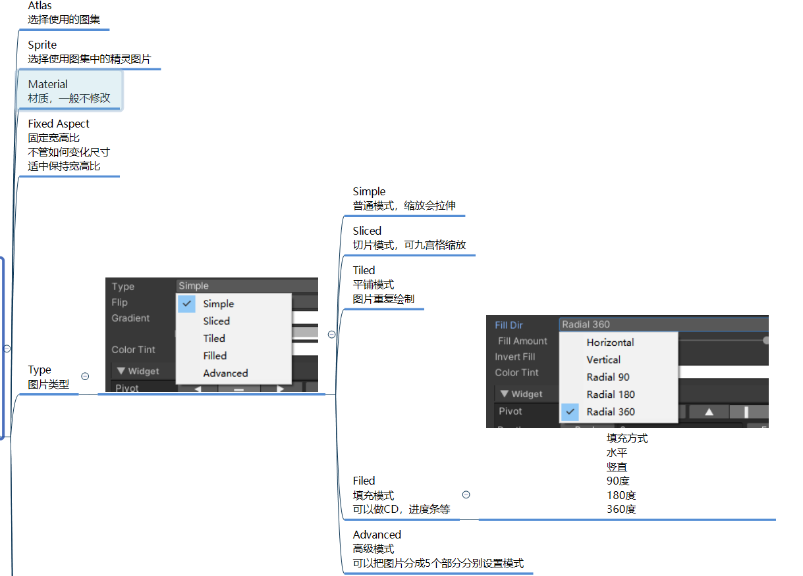

# NGUI基础组件
## Root组件 UIRoot
```c#
#region 知识点一 必备知识——分辨率概念
//1.分辨率
//屏幕宽高两个方向的像素点
//比如1920 * 1080
//宽1920个像素
//高1080个像素

//2.像素
//像素
//像素即px
//是画面中最小的点(单位色块)

//3.屏幕尺寸
//屏幕对角线长度

//4.屏幕比例
//PC显示器
//1920:1080 = 16:9

//苹果手机
//iPhone7,8：1334 * 750 = 16:9
//iPhone 7,8 Plus：1920 * 1080 = 16:9
//iPhoneX：2436 * 1125 = 19.5:9
//iPhone12: 2532 * 1170 = 19.5:9

//目前市面上设备分辨率比例传统的有：
//4:3(ipad)
//16:10
//16:9(老手机 、电脑显示器)
//18:9（去掉留海屏幕）
//19.5:9（ 新款手机）
//19.9:9

//5.dpi
//像素密度
//单位面积上有多少个像素点
//一般指一英寸有多少个像素点
#endregion

#region 知识点二 Root是用来干啥的
//Root是用于分辨率自适应的根对象
//可以设置基本分辨率,相当于设置UI显示区域
//并且管理所有UI控件的分辨率自适应

//可以简单理解 它管理一个 UI画布 所有的UI都是显示在这个画布上的
//它会管理 UI画布 和 不同屏幕分辨率的 适应关系
#endregion

#region 知识点三 Root相关参数

#endregion

#region 总结
//1.Flexible 适用于可以手动拖窗口改变分辨率的设备 比如pc端

//2.Constrained 适用于移动设备
//  因为移动设备都是全屏应用 不会频繁改变分辨率 只用适配不同分辨率的设备
//  横屏勾选 高 fit  竖屏 勾选 宽 fit 一般就可以比较好的进行分辨率适应了 
//  需要注意的是 背景图 一定要考虑 极限 宽高比来出 最大宽高比  19.9:9

//3.Constrained On Mobiles 是上面两者的综合体 适用于多平台发布的游戏和应用
#endregion
```


## Panel
```c#
#region 知识点一 Panel用来干啥
//1.管理一个UI面板的渲染顺序
//2.管理一个UI面板上的所有子控件
#endregion

#region 知识点二 Panel参数相关

#endregion

#region 总结
//1.没有Panel父对象 UI控件看不到
//2.Panel一般用于管理面板 控制层级
//3.Panel可以有多个 一般一个Panel管理一个面板
#endregion
```


## EventSystem组件 (UICamera)

```c#
#region 知识点一 EventSystem是用来干啥的
//主要作用是让摄像机渲染出来的物体
//能够接收到NGUI的输入事件
//大部分设置不需要我们去修改

//有了它我们通过鼠标 触碰 键盘 控制器 操作UI 响应玩家的输入
#endregion

#region 知识点二 相关参数

#endregion

#region 总结
//1.EventSystem很重要，如果没有它，我们没有办法监听玩家输入
//2.创建UI时的 2DUI 和3DUI 主要就是摄像机的模式不一样
//  EventSystem的2D和3D主要是 采用2D碰撞器 还是3D碰撞器 不能直接改变摄像机模式
#endregion
```


# 图集制作
```c#
#region 知识点一 图集用来干啥
//NGUI中的最小图片控件Sprite要使用图集中的图片进行显示
//图集 就是把很多单独的小图 合并为 一张大图 合并后的大图就是图集
//目的：提高渲染性能
#endregion

#region 知识点二 打开图集制作工具
//方法一：Project右键打开
//方法二：上方工具栏NGUI——Open——Atlas Maker
#endregion

#region 知识点三 新建图集
//在图集工具中创建

//图集关键文件有3
//1.图集文件
//2.图集材质
//3.图集图片
#endregion

#region 知识点四 修改删除图集元素
//在图集工具中操作
//增删改
#endregion
```


# 三大基础控件

## Sprite 精灵图片
```c#
#region 知识点一 Sprite用来做啥
//NGUI中所有中小尺寸图片显示都用Sprite显示
//使用它来显示图集中的单个图片资源
#endregion

#region 知识点二 创建Sprite

#endregion

#region 知识点三 Sprite参数

#endregion

#region 知识点四 代码设置图片
//sprite.width = 200;
//sprite.height = 300;
//1.改变为当前图集中选择的图片
sprite.spriteName = "bk";

//2.改变为其它图集中的图片
//先加载图集
NGUIAtlas atlas = Resources.Load<NGUIAtlas>("Atlas/login");
sprite.atlas = atlas;
//再设置图片
sprite.spriteName = "ui_DL_anniuxiao_01";
#endregion
```




**widget**


## Label
```c#
public UILabel label;

#region 知识点一 Label用来干啥
//NGUI中所有文本显示都使用Label来显示
#endregion

#region 知识点二 创建Label

#endregion

#region 知识点三 Label参数

#endregion

#region 知识点四 富文本

#endregion

#region 知识点五 代码设置Label
label.text = "123123123123";
#endregion
```


**富文本**

