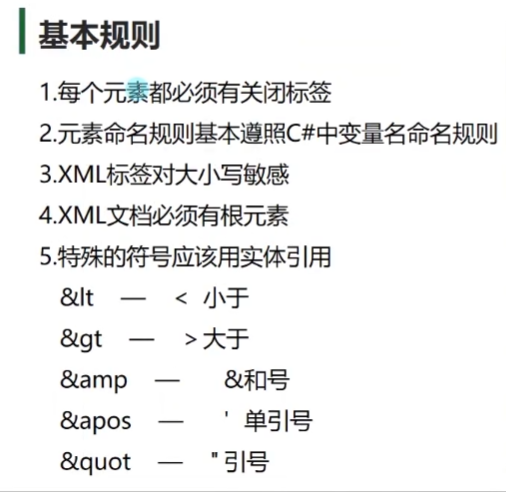
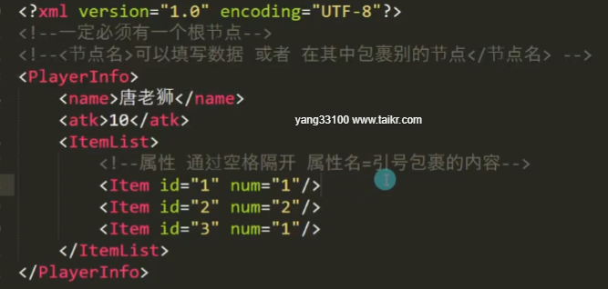
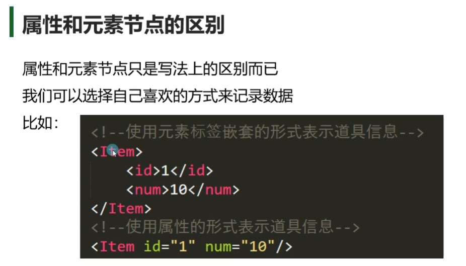
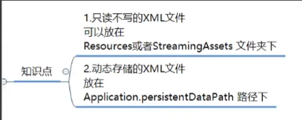

# 文件格式
## 基本语法
```xml
<?xml version="1.0" encoding="UTF-8"?>
<!--固定内容 version代表版本 encoding代表编码格式-->

<PlayerInfo>
	<name>Myname</name>
	<atk>10</atk>
	<ItemList>
		<Item>
			<id>1</id>
			<num>1</num>
		</Item>
		<Item>
			<id>2</id>
			<num>10</num>
		</Item>
		<Item>
			<id>2</id>
			<num>10</num>
		</Item>
	</ItemList>
</PlayerInfo>
```


## 属性







# C#读取存储XML

## XML文件存放位置


## C#读取xml
```c#
//C#读取XML的方法有几种 
//1.XmlDocument    (把数据加载到内存中，方便读取)
//2.XmlTextReader  (以流形式加载，内存占用更少，但是是单向只读，使用不是特别方便，除非有特殊需求，否则不会使用)
//3.Linq           (以后专门讲Linq的时候讲)

//使用XmlDocument类读取是较方便最容易理解和操作的方法
#region 知识点一 读取xml文件信息
XmlDocument xml = new XmlDocument();
//通过XmlDocument读取xml文件 有两个API
//1.直接根据xml字符串内容 来加载xml文件
//存放在Resorces文件夹下的xml文件加载处理
TextAsset asset = Resources.Load<TextAsset>("TestXml");
xml.LoadXml(asset.text);
//通过这个方法 就能够翻译字符串为xml对象

//2.是通过xml文件的路径去进行加载
xml.Load(Application.streamingAssetsPath + "/TestXml.xml");
#endregion

#region 知识点二 读取元素和属性信息
//节点信息类
//XmlNode 单个节点信息类
//节点列表信息
//XmlNodeList 多个节点信息类

//获取xml当中的根节点
XmlNode root = xml.SelectSingleNode("Root");
//再通过根节点 去获取下面的子节点
XmlNode nodeName = root.SelectSingleNode("name");
//如果想要获取节点包裹的元素信息 直接 .InnerText
print(nodeName.InnerText);

XmlNode nodeAge = root.SelectSingleNode("age");
print(nodeAge.InnerText);

XmlNode nodeItem = root.SelectSingleNode("Item");
//第一种方式 直接 中括号获取信息
print(nodeItem.Attributes["id"].Value);
print(nodeItem.Attributes["num"].Value);
//第二种方式 
print(nodeItem.Attributes.GetNamedItem("id").Value);
print(nodeItem.Attributes.GetNamedItem("num").Value);

//这里是获取 一个节点下的同名节点的方法
XmlNodeList friendList = root.SelectNodes("Friend");

//遍历方式一：迭代器遍历
//foreach (XmlNode item in friendList)
//{
//    print(item.SelectSingleNode("name").InnerText);
//    print(item.SelectSingleNode("age").InnerText);
//}
//遍历方式二：通过for循环遍历
//通过XmlNodeList中的 成员变量 Count可以得到 节点数量
for (int i = 0; i < friendList.Count; i++)
{
    print(friendList[i].SelectSingleNode("name").InnerText);
    print(friendList[i].SelectSingleNode("age").InnerText);
}
#endregion

#region 总结
//1.读取XML文件
//XmlDocument xml = new XmlDocument();
//读取文本方式1-xml.LoadXml(传入xml文本字符串)
//读取文本方式2-xml.Load(传入路径)

//2.读取元素和属性
//获取单个节点 : XmlNode node = xml.SelectSingleNode(节点名)
//获取多个节点 : XmlNodeList nodeList = xml.SelectNodes(节点名)

//获取节点元素内容：node.InnerText
//获取节点元素属性：
//1.item.Attributes["属性名"].Value
//2.item.Attributes.GetNamedItem("属性名").Value

//通过迭代器遍历或者循环遍历XmlNodeList对象 可以获取到各单个元素节点

#endregion
```

## 存储xml
```c#
#region 知识点一 决定存储在哪个文件夹下
//注意：存储xml文件 在Unity中一定是使用各平台都可读可写可找到的路径
// 1.Resources 可读 不可写 打包后找不到  ×
// 2.Application.streamingAssetsPath 可读 PC端可写 找得到  ×
// 3.Application.dataPath 打包后找不到  ×
// 4.Application.persistentDataPath 可读可写找得到   √

string path = Application.persistentDataPath + "/PlayerInfo2.xml";
print(Application.persistentDataPath);
#endregion

#region 知识点二 存储xml文件
//关键类 XmlDocument 用于创建节点 存储文件
//关键类 XmlDeclaration 用于添加版本信息
//关键类 XmlElement 节点类

//存储有5步
//1.创建文本对象
XmlDocument xml = new XmlDocument();

//2.添加固定版本信息
//这一句代码 相当于就是创建<?xml version="1.0" encoding="UTF-8"?>这句内容
XmlDeclaration xmlDec = xml.CreateXmlDeclaration("1.0", "UTF-8", "");
//创建完成过后 要添加进入 文本对象中
xml.AppendChild(xmlDec);

//3.添加根节点
XmlElement root = xml.CreateElement("Root");
xml.AppendChild(root);

//4.为根节点添加子节点
//加了一个 name子节点
XmlElement name = xml.CreateElement("name");
name.InnerText = "唐老狮";
root.AppendChild(name);

XmlElement atk = xml.CreateElement("atk");
atk.InnerText = "10";
root.AppendChild(atk);

XmlElement listInt = xml.CreateElement("listInt");
for (int i = 1; i <= 3; i++)
{
    XmlElement childNode = xml.CreateElement("int");
    childNode.InnerText = i.ToString();
    listInt.AppendChild(childNode);
}
root.AppendChild(listInt);

XmlElement itemList = xml.CreateElement("itemList");
for (int i = 1; i <= 3; i++)
{
    XmlElement childNode = xml.CreateElement("Item");
    //添加属性
    childNode.SetAttribute("id", i.ToString());
    childNode.SetAttribute("num", (i * 10).ToString());
    itemList.AppendChild(childNode);
}
root.AppendChild(itemList);

//5.保存
xml.Save(path);
#endregion

#region 知识点三 修改xml文件
//1.先判断是否存在文件
if( File.Exists(path) )
{
    //2.加载后 直接添加节点 移除节点即可
    XmlDocument newXml = new XmlDocument();
    newXml.Load(path);

    //修改就是在原有文件基础上 去移除 或者添加
    //移除
    XmlNode node;// = newXml.SelectSingleNode("Root").SelectSingleNode("atk");
    //这种是一种简便写法 通过/来区分父子关系
    node = newXml.SelectSingleNode("Root/atk");
    //得到自己的父节点
    XmlNode root2 = newXml.SelectSingleNode("Root");
    //移除子节点方法
    root2.RemoveChild(node);

    //添加节点
    XmlElement speed = newXml.CreateElement("moveSpeed");
    speed.InnerText = "20";
    root2.AppendChild(speed);

    //改了记得存
    newXml.Save(path);
}

#endregion

#region 总结
//1.路径选取
//在运行过程中存储 只能往可写且能找到的文件夹存储
//故 选择了Application.persistentDataPath

//2.存储xml关键类
//XmlDocument  文件  
//   创建节点 CreateElement
//   创建固定内容方法 CreateXmlDeclaration
//   添加节点 AppendChild
//   保存 Save
//XmlDeclaration 版本
//XmlElement 元素节点  
//   设置属性方法SetAttribute

//3.修改
//RemoveChild移除节点
//可以通过 /的形式 来表示 子节点的子节点 
#endregion
```