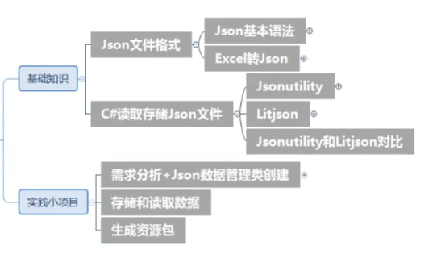
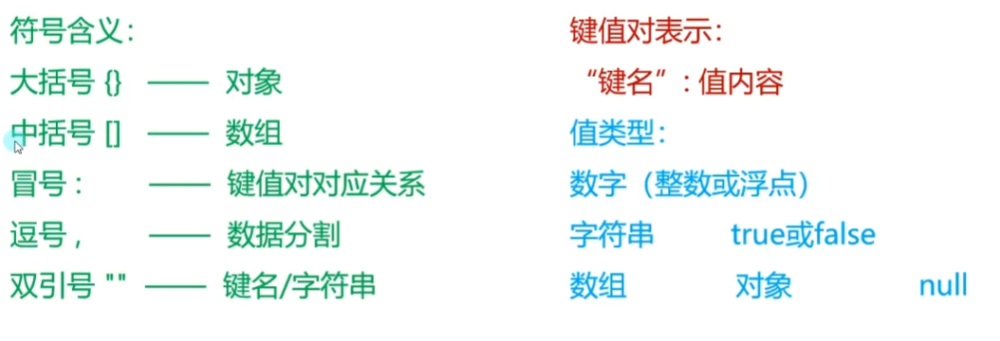
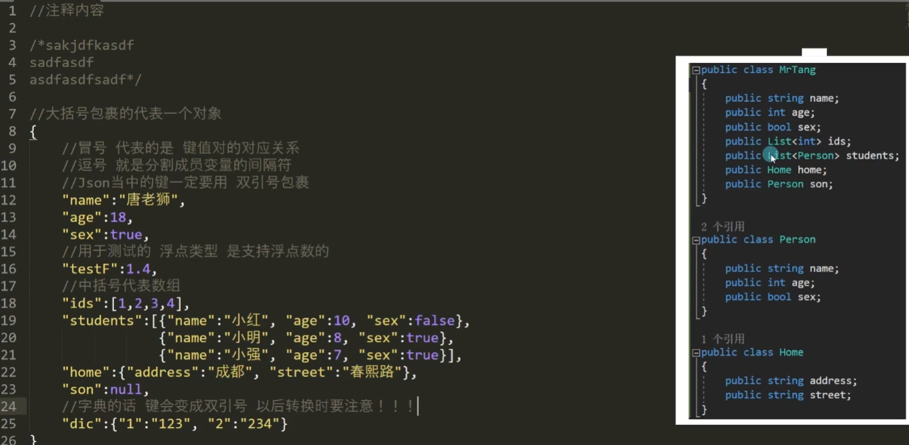
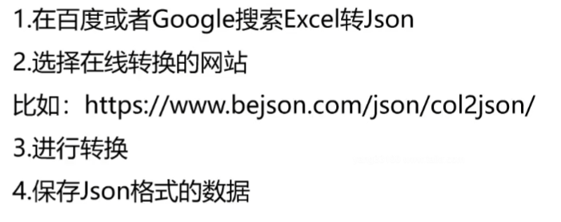

# 语法




# excel转Json


# Json Utlity
```c#
using System.Collections;
using System.Collections.Generic;
using System.IO;
using UnityEngine;

[System.Serializable]
public class Student
{
    public int age;
    public string name;

    public Student(int age, string name)
    {
        this.age = age;
        this.name = name;
    }
}

public class MrTang
{
    public string name;
    public int age;
    public bool sex;
    public float testF;
    public double testD;

    public int[] ids;
    public List<int> ids2;
    public Dictionary<int, string> dic;
    public Dictionary<string, string> dic2;

    public Student s1;
    public List<Student> s2s;

    [SerializeField]
    private int privateI = 1;
    [SerializeField]
    protected int protectedI = 2;
}

public class RoleData
{
    public List<RoleInfo> list;
}

[System.Serializable]
public class RoleInfo
{
    public int hp;
    public int speed;
    public int volume;
    public string resName;
    public int scale;
}


#region 知识点一 JsonUtlity是什么？
//JsonUtlity 是Unity自带的用于解析Json的公共类
//它可以
//1.将内存中对象序列化为Json格式的字符串
//2.将Json字符串反序列化为类对象
#endregion

#region 知识点二 必备知识点——在文件中存读字符串
//1.存储字符串到指定路径文件中
//第一个参数 填写的是 存储的路径
//第二个参数 填写的是 存储的字符串内容
//注意：第一个参数 必须是存在的文件路径 如果没有对应文件夹 会报错
File.WriteAllText(Application.persistentDataPath + "/Test.json", "唐老狮存储的json文件");
print(Application.persistentDataPath);

//2.在指定路径文件中读取字符串
string str = File.ReadAllText(Application.persistentDataPath + "/Test.json");
print(str);
#endregion

#region 知识点三 使用JsonUtlity进行序列化
//序列化：把内存中的数据 存储到硬盘上
//方法：
//JsonUtility.ToJson(对象)
MrTang t = new MrTang();
t.name = "唐老狮";
t.age = 18;
t.sex = false;
t.testF = 1.4f;
t.testD = 1.4;

t.ids = new int[] { 1, 2, 3, 4 };
t.ids2 = new List<int>() { 1, 2, 3 };
t.dic = new Dictionary<int, string>() { { 1, "123" }, { 2, "234" } };
t.dic2 = new Dictionary<string, string>() { { "1", "123" }, { "2", "234" } };

t.s1 = null;//new Student(1, "小红");
t.s2s = new List<Student>() { new Student(2, "小明"), new Student(3, "小强") };

//Jsonutility提供了线程的方法 可以把类对象 序列化为 json字符串
string jsonStr = JsonUtility.ToJson(t);
File.WriteAllText(Application.persistentDataPath + "/MrTang.json", jsonStr);

//注意：
//1.float序列化时看起来会有一些误差
//2.自定义类需要加上序列化特性[System.Serializable]
//3.想要序列化私有变量 需要加上特性[SerializeField]
//4.JsonUtility不支持字典
//5.JsonUtlity存储null对象不会是null 而是默认值的数据
#endregion

#region 知识点四 使用JsonUtlity进行反序列化
//反序列化：把硬盘上的数据 读取到内存中
//方法：
//JsonUtility.FromJson(字符串)
//读取文件中的 Json字符串
jsonStr = File.ReadAllText(Application.persistentDataPath + "/MrTang.json");
//使用Json字符串内容 转换成类对象
MrTang t2 = JsonUtility.FromJson(jsonStr, typeof(MrTang)) as MrTang;
MrTang t3 = JsonUtility.FromJson<MrTang>(jsonStr);

//注意：
//如果Json中数据少了，读取到内存中类对象中时不会报错
#endregion

#region 知识点五 注意事项
//1.JsonUtlity无法直接读取数据集合
jsonStr = File.ReadAllText(Application.streamingAssetsPath + "/RoleInfo2.json");
print(jsonStr);
//List<RoleInfo> roleInfoList = JsonUtility.FromJson<List<RoleInfo>>(jsonStr);
RoleData data = JsonUtility.FromJson<RoleData>(jsonStr);

//2.文本编码格式需要时UTF-8 不然无法加载
#endregion

#region 总结
//1.必备知识点 —— File存读字符串的方法 ReadAllText和WriteAllText
//2.JsonUtlity提供的序列化反序列化方法 ToJson 和 FromJson
//3.自定义类需要加上序列化特性[System.Serializable]
//4.私有保护成员 需要加上[SerializeField]
//5.JsonUtlity不支持字典
//6.JsonUtlity不能直接将数据反序列化为数据集合
//7.Json文档编码格式必须是UTF-8
#endregion
```

# Lit Json
```c#
public class Student2
{
    public int age;
    public string name;

    public Student2() { }

    public Student2(int age, string name)
    {
        this.age = age;
        this.name = name;
    }
}

public class MrTang2
{
    public string name;
    public int age;
    public bool sex;
    public float testF;
    public double testD;

    public int[] ids;
    public List<int> ids2;
    //public Dictionary<int, string> dic;
    public Dictionary<string, string> dic2;

    public Student2 s1;
    public List<Student2> s2s;

    private int privateI = 1;
    protected int protectedI = 2;
}

public class RoleInfo2
{
    public int hp;
    public int speed;
    public int volume;
    public string resName;
    public int scale;
}


#region 知识点一 LitJson是什么？
//它是一个第三方库，用于处理Json的序列化和反序列化
//LitJson是C#编写的，体积小、速度快、易于使用
//它可以很容易的嵌入到我们的代码中
//只需要将LitJson代码拷贝到工程中即可
#endregion

#region 知识点二 获取LitJson
//1.前往LitJson官网
//2.通过官网前往GitHub获取最新版本代码
//3.讲代码拷贝到Unity工程中 即可开始使用LitJson
#endregion

#region 知识点三 使用LitJson进行序列化
//方法：
//JsonMapper.ToJson(对象)
MrTang2 t = new MrTang2();
t.name = "唐老狮";
t.age = 18;
t.sex = true;
t.testF = 1.4f;
t.testD = 1.4;

t.ids = new int[] { 1, 2, 3, 4 };
t.ids2 = new List<int>() { 1, 2, 3 };
//t.dic = new Dictionary<int, string>() { { 1, "123" }, { 2, "234" } };
t.dic2 = new Dictionary<string, string>() { { "1", "123" }, { "2", "234" } };

t.s1 = null;//new Student(1, "小红");
t.s2s = new List<Student2>() { new Student2(2, "小明"), new Student2(3, "小强") };

string jsonStr = JsonMapper.ToJson(t);
print(Application.persistentDataPath);
File.WriteAllText(Application.persistentDataPath + "/MrTang2.json", jsonStr);

//注意：
//1.相对JsonUtlity不需要加特性
//2.不能序列化私有变量
//3.支持字典类型,字典的键 建议都是字符串 因为 Json的特点 Json中的键会加上双引号
//4.需要引用LitJson命名空间
//5.LitJson可以准确的保存null类型
#endregion

#region 知识点四 使用LitJson反序列化
//方法：
//JsonMapper.ToObject(字符串)
jsonStr = File.ReadAllText(Application.persistentDataPath + "/MrTang2.json");
//JsonData是LitJson提供的类对象 可以用键值对的形式去访问其中的内容
JsonData data = JsonMapper.ToObject(jsonStr);
print(data["name"]);
print(data["age"]);
//通过泛型转换 更加的方便 建议使用这种方式
MrTang2 t2 = JsonMapper.ToObject<MrTang2>(jsonStr);

//注意：
//1.类结构需要无参构造函数，否则反序列化时报错
//2.字典虽然支持 但是键在使用为数值时会有问题 需要使用字符串类型
#endregion

#region 知识点五 注意事项
//1.LitJson可以直接读取数据集合
jsonStr = File.ReadAllText(Application.streamingAssetsPath + "/RoleInfo.json");
RoleInfo2[] arr = JsonMapper.ToObject<RoleInfo2[]>(jsonStr);

List<RoleInfo2> list = JsonMapper.ToObject<List<RoleInfo2>>(jsonStr);

jsonStr = File.ReadAllText(Application.streamingAssetsPath + "/Dic.json");
Dictionary<string, int> dicTest = JsonMapper.ToObject<Dictionary<string, int>>(jsonStr);

//2.文本编码格式需要是UTF-8 不然无法加载
#endregion

#region 总结
//1.LitJson提供的序列化反序列化方法 JsonMapper.ToJson和ToObject<>
//2.LitJson无需加特性
//3.LitJson不支持私有变量
//4.LitJson支持字典序列化反序列化
//5.LitJson可以直接将数据反序列化为数据集合
//6.LitJson反序列化时 自定义类型需要无参构造
//7.Json文档编码格式必须是UTF-8
#endregion

```

# JsonUtlity和LitJson对比
```c#
#region 知识点一 JsonUtlity和LitJson相同点
//1.他们都是用于Json的序列化反序列化
//2.Json文档编码格式必须是UTF-8
//3.都是通过静态类进行方法调用
#endregion

#region 知识点二 JsonUtlity和LitJson不同点
//1.JsonUtlity是Unity自带，LitJson是第三方需要引用命名空间
//2.JsonUtlity使用时自定义类需要加特性,LitJson不需要
//3.JsonUtlity支持私有变量(加特性),LitJson不支持
//4.JsonUtlity不支持字典,LitJson支持(但是键只能是字符串)
//5.JsonUtlity不能直接将数据反序列化为数据集合(数组字典),LitJson可以
//6.JsonUtlity对自定义类不要求有无参构造，LitJson需要
//7.JsonUtlity存储空对象时会存储默认值而不是null，LitJson会存null
#endregion

#region 知识点三 如何选择两者
//根据实际需求
//建议使用LitJson
//原因：LitJson不用加特性，支持字典，支持直接反序列化为数据集合，存储null更准确
#endregion
```