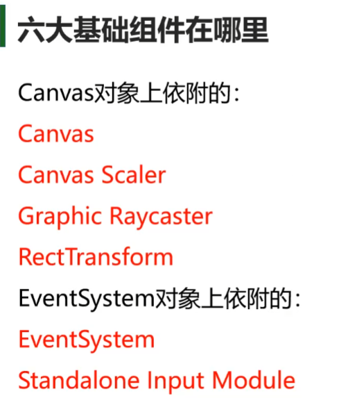
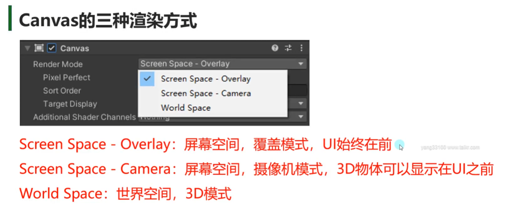
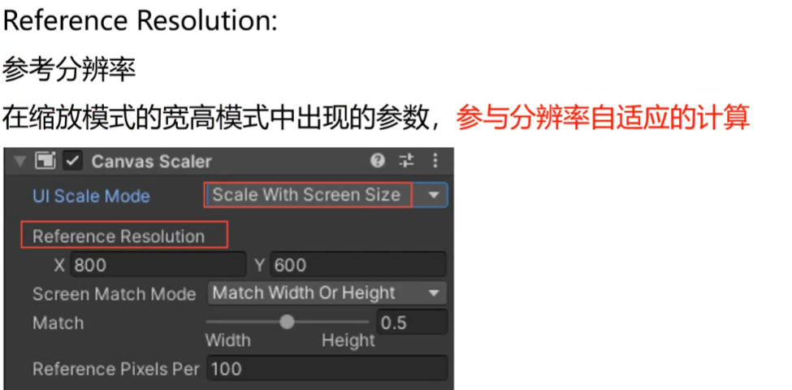
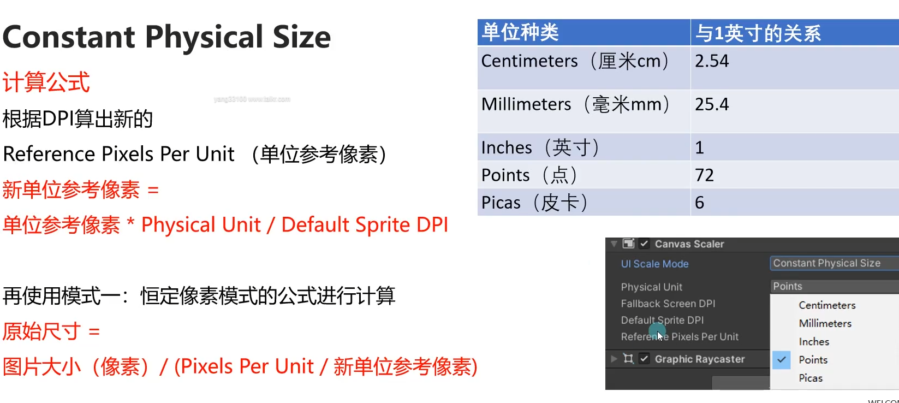
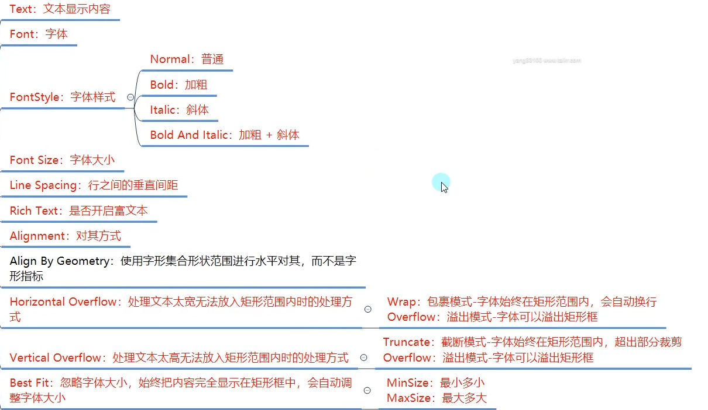
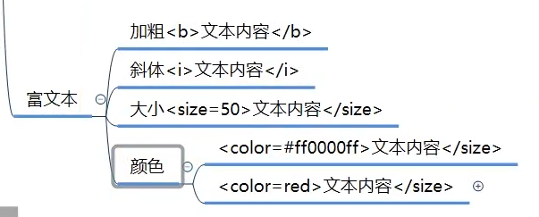
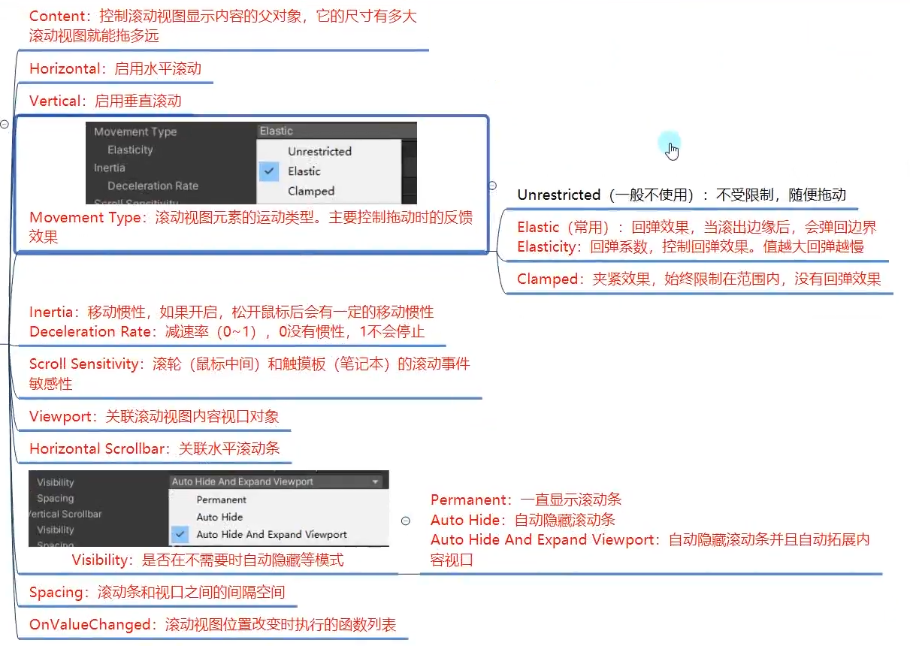

#  六大基础组件



## Canvas画布



### screen—space Overlay


### screen—space Camera


### world space


## CanvasScaler画布缩放控制器组件



### 恒定像素模式
* 无论屏幕大小如何，UI始终保持相同像素大小
* 它不会让UI控件进行分辨率大小自适应  会让UI控件始终保持设置的尺寸大小显示
* 一般在进行游戏开发极少使用这种模式  除非通过代码计算来设置缩放系数


### 缩放模式
* 根据屏幕尺寸进行缩放，随着屏幕尺寸放大缩小


    
    
    
    
    
    
### 恒定物理模式
* 无论屏幕大小和分辨率如何，UI元素始终保持相同物理大小




### 区别


### 3D模式


## Graphic Raycaster图形射线投射器


## EventSystem和Standalone Input Module


## RectTransform


# 三大基础控件

## Image


## Text



* outline 脚本
* shadow 脚本
## RawImage


# 组合控件

## Button
```csharp

    #region 知识点一 Button是什么
    //Button是按钮组件
    //是UGUI中用于处理玩家按钮相关交互的关键组件

    //默认创建的Button由2个对象组成
    //父对象——Button组件依附对象 同时挂载了一个Image组件 作为按钮背景图
    //子对象——按钮文本（可选）
    #endregion

    #region 知识点二 Button参数

    #endregion

    #region 知识点三 代码控制
    Button btn = this.GetComponent<Button>();
    btn.interactable = true;
    btn.transition = Selectable.Transition.None;

    Image img = this.GetComponent<Image>();

    #endregion

    #region 知识点四 监听点击事件的两种方式
    //点击事件 是 在按钮区域抬起按下一次 就算一次点击

    //1.拖脚本

    //2.代码添加
    btn.onClick.AddListener(ClickBtn2);
    btn.onClick.AddListener(() => {
        print("123123123");
    });

    btn.onClick.RemoveListener(ClickBtn2);
    btn.onClick.RemoveAllListeners();
    #endregion
    

    public void ClickBtn()
    {
        print("按钮点击，通过拖代码的形式");
    }

    private void ClickBtn2()
    {
        print("按钮点击，通过拖代码的形式2");
    }

```
## Toggle
```csharp
#region 知识点一 Toggle是什么
    //Toggle是开关组件
    //是UGUI中用于处理玩家单选框多选框相关交互的关键组件

    //开关组件 默认是多选框
    //可以通过配合ToggleGroup组件制作为单选框

    //默认创建的Toggle由4个对象组成
    //父对象——Toggle组件依附
    //子对象——背景图（必备）、选中图（必备）、说明文字（可选）
    #endregion

    #region 知识点二 Toggle参数

    #endregion

    #region 知识点三 代码控制
    Toggle tog = this.GetComponent<Toggle>();
    tog.isOn = true;
    print(tog.isOn);

    ToggleGroup togGroup = this.GetComponent<ToggleGroup>();
    togGroup.allowSwitchOff = false;

    //可以遍历提供的迭代器 得到当前处于选中状态的 Toggle
    foreach (Toggle item in togGroup.ActiveToggles())
    {
        print(item.name + " " + item.isOn);
    }
    #endregion

    #region 知识点四 监听事件的两种方式
    //1.拖脚本
    //2.代码添加
    tog.onValueChanged.AddListener(ChangeValue2);
    tog.onValueChanged.AddListener((b) =>
    {
        print("代码监听 状态改变" + b);
    });
    #endregion
    

    public void ChangValue(bool isOn)
    {
        print("状态改变" + isOn);
    }    

    private void ChangeValue2(bool v)
    {
        print("代码监听 状态改变" + v);
    }
```
## InputField
```csharp

    #region 知识点一 InputField是什么
    //InputField是输入字段组件
    //是UGUI中用于处理玩家文本输入相关交互的关键组件

    //默认创建的InputField由3个对象组成
    //父对象——InputField组件依附对象 以及 同时在其上挂载了一个Image作为背景图
    //子对象——文本显示组件（必备）、默认显示文本组件（必备）
    #endregion

    #region 知识点二 InputField参数

    #endregion

    #region 知识点三 代码控制
    InputField input = this.GetComponent<InputField>();
    print(input.text);
    input.text = "123123123123";
    #endregion

    #region 知识点四 监听事件的两种方式
    //1.拖脚本
    //2.代码添加
    input.onValueChanged.AddListener((str) =>
    {
        print("代码监听 改变" + str);
    });

    input.onEndEdit.AddListener((str) =>
    {
        print("代码监听 结束输入" + str);
    });
    #endregion
    

    public void ChangeInput(string str)
    {
        print("改变的输入内容" + str);
    }

    public void EndInput(string str)
    {
        print("结束输入时内容" + str);
    }
```
## Slider
```csharp
#region 知识点一 Slider是什么
//Slider是滑动条组件
//是UGUI中用于处理滑动条相关交互的关键组件

//默认创建的Slider由4组对象组成
//父对象——Slider组件依附的对象
//子对象——背景图、进度图、滑动块三组对象
#endregion

#region 知识点二 Slider参数

#endregion

#region 知识点三 代码控制
Slider s = this.GetComponent<Slider>();
print(s.value);

#endregion

#region 知识点四 监听事件的两种方式
//1.拖脚本
//2.代码添加
s.onValueChanged.AddListener((v) =>
{
    print("代码添加的监听" + v);
});
#endregion
```

## ScrollBar
```csharp
#region 知识点一 Scrollbar是什么
//Scrollbar是滚动条组件
//是UGUI中用于处理滚动条相关交互的关键组件

//默认创建的Scrollbar由2组对象组成
//父对象——Scrollbar组件依附的对象
//子对象——滚动块对象

//一般情况下我们不会单独使用滚动条 
//都是配合ScrollView滚动视图来使用
#endregion

#region 知识点二 Scrollbar参数

#endregion

#region 知识点三 代码控制
Scrollbar sb = this.GetComponent<Scrollbar>();
print(sb.value);
print(sb.size);
#endregion

#region 知识点四 监听事件的两种方式
//1.拖脚本
//2.代码添加
sb.onValueChanged.AddListener((v) => {
    print("代码监听的函数" + v);
});
#endregion
```
## ScrollView

```csharp
#region 知识点一 ScrollRect是什么
//ScrollRect是滚动视图组件
//是UGUI中用于处理滚动视图相关交互的关键组件

//默认创建的ScrollRect由4组对象组成
//父对象——ScrollRect组件依附的对象 还有一个Image组件 最为背景图
//子对象
//Viewport控制滚动视图可视范围和内容显示
//Scrollbar Horizontal 水平滚动条
//Scrollbar Vertical 垂直滚动条

#endregion

#region 知识点二 ScrollRect参数

#endregion

#region 知识点三 代码控制
ScrollRect sr = this.GetComponent<ScrollRect>();
//改变内容的大小 具体可以拖动多少 都是根据它的尺寸来的
//sr.content.sizeDelta = new Vector2(200, 200);

sr.normalizedPosition = new Vector2(0, 0.5f);
#endregion

#region 知识点四 监听事件的两种方式
//1.拖脚本
//2.代码添加

sr.onValueChanged.AddListener((vec) =>
{
    print(vec);
});
#endregion
```
## Dropdown

```csharp
#region 知识点一 DropDown是什么
//DropDown是下拉列表（下拉选单）组件
//是UGUI中用于处理下拉列表相关交互的关键组件

//默认创建的DropDown由4组对象组成
//父对象
//DropDown组件依附的对象 还有一个Image组件 作为背景图

//子对象
//Label是当前选项描述
//Arrow右侧小箭头
//Template下拉列表选单

#endregion

#region 知识点二 DropDown参数

#endregion

#region 知识点三 代码控制
Dropdown dd = this.GetComponent<Dropdown>();

print(dd.value);

print(dd.options[dd.value].text);

dd.options.Add(new Dropdown.OptionData("123123123"));
#endregion

#region 知识点四 监听事件的两种方式
//1.拖脚本
//2.代码添加
dd.onValueChanged.AddListener((index) => {

    print(index);
});
#endregion
```
# 图集制作
```csharp
#region 知识点一 为什么要打图集
//UGUI和NGUI使用上最大的不同是 NGUI使用前就要打图集
//UGUI可以再之后再打图集

//打图集的目的就是减少DrawCall 提高性能
//具体DrawCall是什么在NGUI课程中已经详细讲解
//该节课是免费课 即使没有购买 也可以前往观看

//简单回顾DrawCall
//DC就是CPU通知GPU进行一次渲染的命令
//如果DC次数较多会导致游戏卡顿
//我们可以通过打图集，将小图合并成大图，将本应n次的DC变成1次DC来提高性能
#endregion

#region 知识点二 在Unity中打开自带的打图集功能
//在工程设置面板中打开功能
//Edit——>Project Setting——>Editor
//Sprite Packer(精灵包装器，可以通过Unity自带图集工具生成图集)
//Disabled：默认设置，不会打包图集

//Enabled For Builds（Legacy Sprite Packer）：Unity仅在构建时打包图集，在编辑模式下不会打包图集
//Always Enabled（Legacy Sprite Packer）：Unity在构建时打包图集，在编辑模式下运行前会打包图集

//Legacy Sprite Packer传统打包模式 相对下面两种模式来说 多了一个设置图片之间的间隔距离
//Padding Power:选择打包算法在计算打包的精灵之间以及精灵与生成的图集边缘之间的间隔距离
//              这里的数字 代表2的n次方

//Enabled For Build：Unity进在构建时打包图集，在编辑器模式下不会打包
//Always Enabled：Unity在构建时打包图集，在编辑模式下运行前会打包图集
#endregion

#region 知识点三 打图集参数注意

#endregion

#region 知识点四 代码加载
//加载图集 注意：需要引用命名空间
SpriteAtlas sa = Resources.Load<SpriteAtlas>("MyAlas");
//从图集中加载指定名字的小图
sa.GetSprite("bk");
#endregion
```
# 进阶

## UI事件监听接口
```csharp
public class Lesson18 : MonoBehaviour, IPointerEnterHandler, IPointerExitHandler, IPointerDownHandler, IPointerUpHandler, IDragHandler
{
    public void OnDrag(PointerEventData eventData)
    {
        print(eventData.delta);
    }

    public void OnPointerDown(PointerEventData eventData)
    {
        print("鼠标（触碰）按下");
        print(eventData.pointerId);

        print(eventData.position);
    }

    public void OnPointerEnter(PointerEventData eventData)
    {
        //鼠标进入 在移动设备上 是不存在 因为不存在 进入的概念
        print("鼠标进入");
    }

    public void OnPointerExit(PointerEventData eventData)
    {
        //鼠标离开 在移动设备上 是不存在 因为不存在 进入的概念
        print("鼠标离开");
    }

    public void OnPointerUp(PointerEventData eventData)
    {
        print("鼠标（触碰）抬起");
    }

    // Start is called before the first frame update
    void Start()
    {
        #region 知识点一 事件接口是用来解决什么问题的
        //目前所有的控件都只提供了常用的事件监听列表
        //如果想做一些类似长按，双击，拖拽等功能是无法制作的
        //或者想让Image和Text，RawImage三大基础控件能够响应玩家输入也是无法制作的

        //而事件接口就是用来处理类似问题
        //让所有控件都能够添加更多的事件监听来处理对应的逻辑
        #endregion

        #region 知识点二 有哪些事件接口

        #region 常用事件接口
        //IPointerEnterHandler - OnPointerEnter - 当指针进入对象时调用 （鼠标进入）
        //IPointerExitHandler - OnPointerExit - 当指针退出对象时调用 （鼠标离开）
        //IPointerDownHandler - OnPointerDown - 在对象上按下指针时调用 （按下）
        //IPointerUpHandler - OnPointerUp - 松开指针时调用（在指针正在点击的游戏对象上调用）（抬起）
        //IPointerClickHandler - OnPointerClick - 在同一对象上按下再松开指针时调用 （点击）

        //IBeginDragHandler - OnBeginDrag - 即将开始拖动时在拖动对象上调用 （开始拖拽）
        //IDragHandler - OnDrag - 发生拖动时在拖动对象上调用 （拖拽中）
        //IEndDragHandler - OnEndDrag - 拖动完成时在拖动对象上调用 （结束拖拽）
        #endregion

        #region 不常用事件接口 了解即可
        //IInitializePotentialDragHandler - OnInitializePotentialDrag - 在找到拖动目标时调用，可用于初始化值
        //IDropHandler - OnDrop - 在拖动目标对象上调用
        //IScrollHandler - OnScroll - 当鼠标滚轮滚动时调用
        //IUpdateSelectedHandler - OnUpdateSelected - 每次勾选时在选定对象上调用

        //ISelectHandler - OnSelect - 当对象成为选定对象时调用
        //IDeselectHandler - OnDeselect - 取消选择选定对象时调用

        //导航相关
        //IMoveHandler - OnMove - 发生移动事件（上、下、左、右等）时调用
        //ISubmitHandler - OnSubmit - 按下 Submit 按钮时调用
        //ICancelHandler - OnCancel - 按下 Cancel 按钮时调用
        #endregion

        #endregion

        #region 知识点三 使用事件接口
        //1.继承MonoBehavior的脚本继承对应的事件接口，引用命名空间
        //2.实现接口中的内容
        //3.将该脚本挂载到想要监听自定义事件的UI控件上
        #endregion

        #region 知识点四 PointerEventData参数的关键内容
        //父类：BaseEventData

        //pointerId： 鼠标左右中键点击鼠标的ID 通过它可以判断右键点击
        //position：当前指针位置（屏幕坐标系）
        //pressPosition：按下的时候指针的位置
        //delta：指针移动增量
        //clickCount：连击次数
        //clickTime：点击时间

        //pressEventCamera：最后一个OnPointerPress按下事件关联的摄像机
        //enterEvetnCamera：最后一个OnPointerEnter进入事件关联的摄像机
        #endregion

        #region 总结
        //好处：
        //需要监听自定义事件的控件挂载继承实现了接口的脚本就可以监听到一些特殊事件
        //可以通过它实现一些长按，双击拖拽等功能

        //坏处：
        //不方便管理，需要自己写脚本继承接口挂载到对应控件上，比较麻烦
        #endregion
    }
}
```
## EventTrigger事件触发器
```csharp
void Start()
{
    #region 知识点一 事件触发器是什么
    //事件触发器是EventTrigger组件
    //它是一个集成了上节课中学习的所有事件接口的脚本
    //它可以让我们更方便的为控件添加事件监听
    #endregion

    #region 知识点二 如何使用事件触发器
    //1.拖曳脚本进行关联

    //2.代码添加

    //申明一个希望监听的事件对象
    EventTrigger.Entry entry = new EventTrigger.Entry();
    //申明 事件的类型
    entry.eventID = EventTriggerType.Drag;
    //监听函数关联
    entry.callback.AddListener((data) =>
    {
        print("抬起");
    });


    //把申明好的 事件对象 加入到 EventTrigger当中
    et.triggers.Add(entry);

    entry = new EventTrigger.Entry();
    //申明 事件的类型
    entry.eventID = EventTriggerType.BeginDrag;
    //监听函数关联
    entry.callback.AddListener((data) =>
    {
        print("抬起");
    });

    et.triggers.Add(entry);

    entry = new EventTrigger.Entry();
    //申明 事件的类型
    entry.eventID = EventTriggerType.BeginDrag;
    //监听函数关联
    entry.callback.AddListener((data) =>
    {
        print("抬起");
    });

    et.triggers.Add(entry);
    #endregion

    #region 总结
    //EventTrigger可以让我们写更少的代码
    //可以在面板类中处理面板控件的事件逻辑，更加的面向对象，便于管理
    #endregion
}

public void TestPointerEnter( BaseEventData data )
{
    PointerEventData eventData = data as PointerEventData;

    print("鼠标进入 " + eventData.position);
}
```
## 屏幕坐标转UI相对坐标
```csharp
void Start()
{
    #region 知识点一 RectTransformUtility类
    //RectTransformUtility 公共类是一个RectTransform的辅助类
    //主要用于进行一些 坐标的转换等等操作
    //其中对于我们目前来说 最重要的函数是 将屏幕空间上的点，转换成UI本地坐标下的点
    #endregion
}

public void OnDrag(PointerEventData eventData)
{
    #region 知识点二 将屏幕坐标转换为UI本地坐标系下的点
    //方法：
    //RectTransformUtility.ScreenPointToLocalPointInRectangle
    ////参数一：相对父对象
    ////参数二：屏幕点
    ////参数三：摄像机
    ////参数四：最终得到的点
    ////一般配合拖拽事件使用
    Vector2 nowPos;
    RectTransformUtility.ScreenPointToLocalPointInRectangle(
        parent,
        eventData.position,
        eventData.enterEventCamera,
        out nowPos );

    this.transform.localPosition = nowPos;

    //this.transform.position += new Vector3(eventData.delta.x, eventData.delta.y, 0);
    #endregion
}

```
## 遮罩Mask
```csharp
#region 知识点一 遮罩是什么
//在不改变图片的情况下
//让图片在游戏中只显示其中的一部分
#endregion

#region 知识点二 遮罩如何使用
//实现遮罩效果的关键组件时Mask组件
//通过在父对象上添加Mask组件即可遮罩其子对象

//注意：
//1.想要被遮罩的Image需要勾选Maskable
//2.只要父对象添加了Mask组件，那么所有的UI子对象都会被遮罩
//3.遮罩父对象图片的制作，不透明的地方显示，透明的地方被遮罩
#endregion
```
## 模型和粒子显示在UI之前
```csharp
#region 知识点一 模型显示在UI之前

#region 方法一：直接用摄像机渲染3D物体
//Canvas的渲染模式要不是覆盖模式
//摄像机模式 和 世界(3D)模式都可以让模型显示在UI之前（Z轴在UI元素之前即可）

//注意：
//1.摄像机模式时建议用专门的摄像机渲染UI相关
//2.面板上的3D物体建议也用UI摄像机进行渲染
#endregion

#region 方法二：将3D物体渲染在图片上，通过图片显示
//专门使用一个摄像机渲染3D模型，将其渲染内容输出到Render Texture上
//类似小地图的制作方式
//再将渲染的图显示在UI上

//该方式 不管Canvas的渲染模式是哪种都可以使用
#endregion

#endregion

#region 知识点二 粒子特效显示在UI之前

//粒子特效的显示和3D物体类似

//注意点：
//在摄像机模式下时
//可以在粒子组件的Renderer相关参数中改变排序层 让粒子特效始终显示在其之前不受Z轴影响
#endregion
```
## 异形按钮
```csharp
#region 知识点一 什么是异形按钮
//图片形状不是传统矩形的按钮
#endregion

#region 知识点二 如何让异形按钮能够准确点击

#region 方法一 通过添加子对象的形式
//按钮之所以能够响应点击，主要是根据图片矩形范围进行判断的
//它的范围判断是自下而上的，意思是如果有子对象图片，子对象图片的范围也会算为可点击范围
//那么我们就可以用多个透明图拼凑不规则图形作为按钮子对象用于进行射线检测
#endregion

#region 方法二 通过代码改变图片的透明度响应阈值
//1.第一步：修改图片参数 开启Read/Write Enabled开关
//2.第二步：通过代码修改图片的响应阈值

//该参数含义：指定一个像素必须具有的最小alpha值，以变能够认为射线命中了图片
//说人话：当像素点alpha值小于了 该值 就不会被射线检测了
img.alphaHitTestMinimumThreshold = 0.1f;
#endregion

#endregion
```
## 自动布局组件
```csharp
#region 知识点一 自动布局是什么
//虽然UGUI的RectTransform已经非常方便的可以帮助我们快速布局
//但UGUI中还提供了很多可以帮助我们对UI控件进行自动布局的组件
//他们可以帮助我们自动的设置UI控件的位置和大小等

//自动布局的工作方式一般是
//自动布局控制组件 + 布局元素 = 自动布局

//自动布局控制组件：Unity提供了很多用于自动布局的管理性质的组件用于布局
//布局元素：具备布局属性的对象们，这里主要是指具备RectTransform的UI组件
#endregion

#region 知识点二 布局元素的布局属性
//要参与自动布局的布局元素必须包含布局属性
//布局属性主要有以下几条
//Minmum width：该布局元素应具有的最小宽度
//Minmum height：该布局元素应具有的最小高度

//Preferred width：在分配额外可用宽度之前，此布局元素应具有的宽度
//Preferred height：在分配额外可用高度之前，此布局元素应具有的高度。

//Flexible width：此布局元素应相对于其同级而填充的额外可用宽度的相对量
//Flexible height：此布局元素应相对于其同级而填充的额外可用宽度的相对量

//在进行自动布局时 都会通过计算布局元素中的这6个属性得到控件的大小位置

//在布局时，布局元素大小设置的基本规则是
//1.首先分配最小大小Minmum width和Minmum height
//2.如果父类容器中有足够的可用空间，则分配Preferred width和Preferred height
//3.如果上面两条分配完成后还有额外空间，则分配Flexible width和Flexible height

//一般情况下布局元素的这些属性都是0
//但是特定的UI组件依附的对象布局属性会被改变，比如Image和Text

//一般情况下我们不会去手动修改他们，但是如果你有这些需求
//可以手动添加一个LayoutElement组件 可以修改这些布局属性
#endregion

#region 知识点三 水平垂直布局组件
//水平垂直布局组件
//将子对象并排或者竖直的放在一起

//组件名：Horizontal Layout Group 和 Vertical Layout Group
//参数相关：
//Padding：左右上下边缘偏移位置
//Spacing:子对象之间的间距

//ChildAlignment:九宫格对其方式
//Control Child Size：是否控制子对象的宽高
//Use Child Scale：在设置子对象大小和布局时，是否考虑子对象的缩放
//Child Force Expand：是否强制子对象拓展以填充额外可用空间
#endregion

#region 知识点四 网格布局组件
//网格布局组件
//将子对象当成一个个的格子设置他们的大小和位置

//组件名：Grid Layout Group
//参数相关：
//Padding：左右上下边缘偏移位置
//Cell Size：每个格子的大小
//Spacing：格子间隔
//Start Corner:第一个元素所在位置（4个角）
//Start Axis：沿哪个轴放置元素；Horizontal水平放置满换行，Vertical竖直放置满换列
//Child Alignment：格子对其方式（9宫格）
//Constraint：行列约束
//  Flexible：灵活模式，根据容器大小自动适应
//  Fixed Column Count：固定列数
//  Fixed Row Count：固定行数
#endregion

#region 知识点五 内容大小适配器
//内容大小适配器
//它可以自动的调整RectTransform的长宽来让组件自动设置大小
//一般在Text上使用 或者 配合其它布局组件一起使用

//组件名：Content Size Fitter
//参数相关
//Horizontal Fit：如何控制宽度
//Vertical Fit:如何控制高度

//Unconstrained：不根据布局元素伸展
//Min Size：根据布局元素的最小宽高度来伸展
//Preferred Size：根据布局元素的偏好宽度来伸展宽度。
#endregion

#region 知识点六 宽高比适配器
//宽高比适配器
//1.让布局元素按照一定比例来调整自己的大小
//2.使布局元素在父对象内部根据父对象大小进行适配

//组件名：Aspect Ratio Fitter
//参数相关：
//Aspect Mode：适配模式，如果调整矩形大小来实施宽高比
//  None：不让矩形适应宽高比
//  Width Controls Height：根据宽度自动调整高度
//  Height Controls Width：根据高度自动调整宽度
//  Fit In Parent：自动调整宽度、高度、位置和锚点，使矩形适应父项的矩形，同时保持宽高比，会出现“黑边”
//  Envelope Parent：自动调整宽度、高度、位置和锚点，使矩形覆盖父项的整个区域，同时保持宽高比，会出现“裁剪”

//Aspect Ratio：宽高比；宽除以高的比值
#endregion
```
## 画布组Canvas Group
```csharp
#region 知识点一 问题：如何整体控制一个面板的淡入淡出等
//如果我们想要整体控制一个面板的淡入淡出 或者 整体禁用
//使用目前学习的知识点 是无法方便快捷的设置的
#endregion

#region 知识点二 解决方案：Canvas Group
//为面板父对象添加 CanvasGroup组件 即可整体控制

//参数相关：
//Alpha：整体透明度控制
//Interactable:整体启用禁用设置
//Blocks Raycasts：整体射线检测设置
//Ignore Parent Groups：是否忽略父级CanvasGroup的作用
#endregion
```