# 模型的制作过程
* 建模
    * 建模
    * 展UV
    * 材质和纹理贴图
* 动作
    * 骨骼绑定
    * 动画制作

# 图片导入设置

## Unity支持的图片格式
```csharp
//Unity支持的图片格式有很多
//BMP:是Windows操作系统的标准图像文件格式，特点是几乎不进行压缩，占磁盘空间大
//TIF:基本不损失图片信息的图片格式，缺点是体积大

//JPG:一般指JPEG格式，属于有损压缩格式，能够让图像压缩在很小的存储空间，一定程度上会损失图片数据，无透明通道
//PNG:无损压缩算法的位图格式，压缩比高，生成文件小，有透明通道

//TGA:支持压缩，使用不失真的压缩算法，还支持编码压缩。体积小，效果清晰，兼备BMP的图像质量和JPG的体积优势，有透明通道
//PSD:是PhotoShop（PS）图形处理软件专用的格式，通过一些第三方工具或自制工具可以直接将PSD界面转为UI界面

//其它还支持
//EXR、GIF、HDR、IFF、PICT等等
//其中Unity最常用的图片格式是 JPG、PNG、TGA 三种格式
```
## 1.纹理类型
### Default 默认纹理，大部分导入的模型贴图都是该类型

### Normal map 法线贴图格式

### Editor GUI and Legacy GUI 一般在编辑器中或者GUI上使用的纹理

### Sprite（2D and UI） 2D游戏或者UGUI中使用的格式

### Cursor 自定义光标

### Cookie 光源剪影格式

### Lightmap 光照贴图格式

### Single Channel 纹理只需要单通道的格式


## 2.纹理形状
```csharp
#region 知识点一 纹理形状主要是设置什么？
//纹理不仅可以用于模型贴图
//还可以用于制作天空盒和反射探针
//纹理形状设置 主要就是用于在两种模式之间进行切换
#endregion
```


## 3.高级设置
```csharp
#region 知识点一 高级设置是设置什么？
//高级设置主要是纹理的一些尺寸规则、读写规则、以及MipMap相关设置
#endregion

#region 知识点二 MipMap是什么？
//在三维计算机图形的贴图渲染中有一个常用的技术被称为Mipmapping。
//为了加快渲染速度和减少图像锯齿，贴图被处理成由一系列被预先计算和优化过的图片组成的文件
//这样的贴图被称为mipmap
// Mipmap 需要占用一定的内存空间

//Mipmap中每一个层级的小图都是主图的一个特定比例的缩小细节的复制品
//虽然在某些必要的视角，主图仍然会被使用，来渲染完整的细节。
//但是当贴图被缩小或者只需要从远距离观看时，mipmap就会转换到适当的层级

//因为mipmap贴图需要被读取的像素远少于普通贴图，所以渲染的速度得到了提升。
//而且操作的时间减少了，因为mipmap的图片已经是做过抗锯齿处理的，从而减少了实时渲染的负担。
//放大和缩小也因为mipmap而变得更有效率。

//如果贴图的基本尺寸是256x256像素的话,它mipmap就会有8个层级。
//每个层级是上一层级的四分之一的大小
//依次层级大小就是：128x128;64x64;32x32;16x16;8x8;4x4;2x2;1x1(一个像素)

//说人话，开启MipMap功能后，Unity会帮助我们根据图片信息生成n张不同分辨率的图片
//在场景中会根据我们离该模型的距离选择合适尺寸的图片用于渲染，提升渲染效率
#endregion
```
### Non-Power of 2：如果纹理尺寸非2的幂如何处理


### Read/Write Enabled：启用可以使用Unity中提供的一些方法从纹理中获取到数据（一般需要获取图片数据时才开启）

### Streaming Mipmaps：启用则可以使用纹理串流，主要用于在控制加载在内存中的Mipmap级别，用于减少Unity对于纹理所需的内存总量，用性能换内存

### Generate Mip Maps：允许生成MipMap


## 4.平铺拉伸
```csharp
#region 知识点一 平铺拉伸主要是做什么？
//平铺拉伸主要设置纹理的平铺规则以及拉伸规则
#endregion
```
### Wrap Mode：平铺纹理时的方式

### Filter Mode：纹理在通过3D变化拉伸时如何进行过度

### Aniso Level：以大角度查看纹理时提高纹理质量。性能消耗高

## 5.平台设置
```csharp
#region 知识点一 平台设置主要设置什么？
//平台设置主要设置纹理最终打包时在不同平台的尺寸、格式、压缩方式
//它非常的重要，因为它影响了你的包大小和读取性能方面的问题
#endregion
```
### Max Size：设置导入的纹理的最大尺寸，即使美术出的很大的图，也可以通过这里把它们限制在一定范围内

### Resize Algorithm：当纹理尺寸大于指定的Max Size时，使用的缩小算法

### Format：纹理格式 各平台支持的格式有所不同 如果选择Automatic 会根据平台使用默认设置
* 都支持的格式


* 移动端和网页端特有格式

### Compression：选择纹理的压缩类型，帮助Unity正确选择压缩格式 会根据平台和压缩格式的可用性进行压缩

### Use Crunch Compression：启用后，使用Crunch压缩。Crunch是一种基于DXT或ETC纹理压缩的有损压缩格式。压缩时间长，解压速度快。
### Split Alpha Channel：Alpha通道分离，节约内存。会把一张图分成两张纹理。一张包含RGB数据，一张包含Alpha数据，在渲染时再合并渲染。
### Override ETC2 fallback：不支持ETC2压缩的设备上，使用的格式

# 【唐老狮】Unity四部曲之Unity核心

# 任务1：概述

## Unity入门到精通系列课程——第三部分

- Unity入门
- Unity基础
- Unity核心
- Unity进阶

## Unity入门前情回顾	

- 环境搭建
- 界面基础
- 工作原理
- 脚本基础
- 重要组件和API
- 核心系统

## Unity入门实践回顾

- Unity入门
- GUI
- PlayerPrefs

## Unity基础前情回顾

- 3D数学
- 延迟函数
- 协同程序
- Resources资源加载
- 异步加载
- LineRenderer
- 范围检测和射线检测

## Unity基础实践回顾

- Unity基础
- NGUI
- XML

## 目前的状态

在学习过前两部曲后，你已经掌握的内容

1. 1.Unity引擎的工作原理
2. 2.能够熟练使用Unity引擎提供的各个重要组件
3. 3.能够熟练使用Unity引擎提供的API

目前除了2D和动画相关，其它游戏功能基本已经能够独立制作了。

## Unity核心 主要学习内容

#### 主要学习内容

知识点

1. Unity中的2D动画相关
2. Unity中的3D动画相关
3. Unity中的角色控制器
4. Unity中的导航寻路系统

#### 主要学习方式

理论+习题+实践

理论：语法操作相关知识

习题：基于知识点的针对性习题

实践：基于知识点的小项目实践

### 学习建议

重视基础知识点，多思考多练习。

当我们学习完毕Unity核心相关知识点后

你基本已经可以独立完成90%以上的游戏基础功能

大家要==切忌浮躁==

好好学习，天天向上

# 任务3：认识模型的制作流程

## 学习制作过程的目的

提前了解一些基本概念，为之后的知识点做准备

## 模型的制作过程

美术工种——建模

- 第一步：建模
- 第二步：展UV
- 第三步：材质和纹理贴图
- 美术工种——动作
- 第四步：骨骼绑定
- 第五步：动画制作

### 第一步：建模

美术同学通过建模软件（3Dmax或Maya等等），用一个个的面片像捏泥人一样将模型制作出来

面片：3点构成一个面，面的最小单位是三角形，建模时可以使用3点以上的面但是建议都使用三角面。

网格信息：一般指的就是模型的这些顶点面片信息

说人话：建模其实就是用三角面组装拼凑捏泥人

### 第二步：展UV

UV是纹理贴图坐标的简称，它有U轴和V轴。

类似空间中的xyz轴。纹理坐标中的每一个点，都和3D模型上的位置信息是相互联系的

展UV就好像是把做好的3D模型平铺到一张2D图片上，并且把这张图片上对应位置的信息和3D模型上位置信息对应起来，为之后给模型上色做准备。

说人话：展UV就好像把一张纸做的立方体拆开变成一张纸

### 第三步：材质和纹理贴图

纹理：一张2D图片

贴图：把纹理通过UV坐标映射到3D物理表面

纹理贴图：代指模型的颜色信息、UV信息等等

材质：模型的表现，通过纹理贴图提供的信息,使用不同的着色器算法，呈现出不同的表现效果

比如：金属、塑料、玻璃、透明等等效果

着色器：Shader就是着色器，它决定了材质的表现效果.

### 第四步：骨骼绑定

完成前三步后，模型就制作完成了。

接着如果想让模型能够栩栩如生的动起来，首先要进行骨骼绑定；

骨骼绑定就是为模型定义骨骼信息，定义骨骼控制哪些网格信息。

### 第五步：动画制作

骨骼绑定完成后，我们就可以利用这些骨骼的旋转来制作3D动画了。

在一条时间轴上，制作关键帧的位置，通过一些规则决定从上一关键帧到这一关键帧的变化应该
如何过渡，不停的制作关键帧就可以制作出最终的动画效果。

## 模型的制作过程—总结

美术工种——建模

- 第一步：建模——三角面片拼凑模型
- 第二步：展UV——展开模型的网格到平面上产生映射关系
- 第三步：材质和纹理贴图——使用UV信息画贴图选择材质出效果

美术工种——动作

- 第四步：骨骼绑定——对模型进行骨骼关联
- 第五步：动画制作——利用模型骨骼制作动画

# 图片导入相关设置

# 任务4：图片导入概述 知识点

## 知识点一 Unity支持的图片格式

Unity支持的图片格式有很多

- BMIP：是windows操作系统的标准图像文件格式，特点是几乎不进行压缩，占磁盘空间大

- TIF：基本不损失国片信息的图片格式，缺点是体积大
- JPG：一般指JPEG格式，属于有损压缩格式，能够让图像压缩在很小的存储空间，一定程度上会损失图片数据，无透明通道
- PNG：无损压缩算法的位图格式，压缩比高，生成文件小,有透明通道
- TGA：支持压缩，使用不失真的压缩算法，还支持编码压缩。体积小，效果清晰，兼备BNP的图像质量和PNG的体积优势，有透明通道
- PSD：是PhotoShop(PS)图形处理软件专用的格式，通过一些第三方工具或自制工具可以直接将PSD界面为UI界面

其它还支持

- EXR、GIF、HDR、IFF、PICT等等
- 其中Unity最常用的图片格式是JPG、PNG、TGA三种格式

## 知识点二 图片设置的6大部分

1. 纹理类型
2. 纹理形状
3. 高级设置
4. 平铺拉伸
5. 平台设置
6. 预览窗口

> [Texture Import Settings - Unity 手册](https://docs.unity.cn/cn/2020.3/Manual/class-TextureImporter.html)

# 任务5：纹理类型设置 知识点

> [纹理类型 - Unity 手册](https://docs.unity.cn/cn/2020.3/Manual/TextureTypes.html)
>
> [Texture Import Settings - Unity 手册](https://docs.unity.cn/cn/2020.3/Manual/class-TextureImporter.html)

##  知识点一 纹理类型主要是设置什么

设置纹理类型主要是为了让纹理图片有不同的主要用途.

指明其是用于哪项工作的纹理.

## 知识点二 参数讲解

> [纹理类型 - Unity 手册](https://docs.unity.cn/cn/2020.3/Manual/TextureTypes.html#default)


## Texture Type：纹理类型

### Default

默认纹理，大部分导入的模型贴图都是该类型

1. sRGB(Color Texture)：启用可以将纹理存储在伽马空间中（对每一个像素做一次幂函数运算）

   > [颜色空间 - Unity 手册](https://docs.unity.cn/cn/2020.3/Manual/LinearLighting.html)

2. Alpha Source：指定如何生成纹理的Alpha通道

   1. None：无论输入纹理是否有Alpha通道，导入的纹理都没有Alpha通道
   2. Input Texture Alpha：输入纹理中的Alpha
   3. From Gray Scale：从输入纹理RGB值的平均值生成Alpha

3. Alpha Is Transparency：启用可以避免边缘上的过滤瑕疵

### Normal map

法线贴图格式

法线贴图就是在原物体的凹凸表面的每个点上均作法线

法线就是垂直于某个点的切线的方向向量

渲染时，通过Shader和法线和材质，将低模（低面模型）渲染成更加立体的模型。

法线贴图就是用来记录高模贴图当中的凹凸点法线作记录。

1. Create From Grayscale：启用此属性可以从灰度高度贴图创建法线贴图
   1. Bumpiness：控制凹凸程度，值越大凹凸感越强
   2. Filtering：如何计算凹凸值
      1. Smooth：使用标准算法生成法线贴图（光滑）
      2. Sharp：生成比标准模式更锐利的法线贴图
2. Ignore PNG file gamma：启用此属性可忽略 PNG 文件中的伽马 (Gamma) 特性。

### Editor GUI and Legacy GUI

一般在编辑器中或者GUI上使用的纹理

### Sprite（2D and UI）

2D游戏或者UGUI中使用的格式

1. Sprite Mode：图像中提取精灵图形的方式
   1. Single：按原样使用精灵图像
   2. Multiple：瓦片模式，如果是图集，使用该选项，可以在Sprite Editor编辑窗口自定义图片
   3. Polygon：网格精灵模式
2. Pixels Per Unit：世界空间中的一个距离单位对应多少像素
3. MeshType：网格类型；只有`Single`和`Multiple`模式才支持
   1. Full Rect：创建四边形，将精灵显示在四边形上
   2. Tight：基于像素Alpha值来生成网格，更加贴合精灵图片的形状
      任何小于32*32的精灵都使用FullRect模式，即使设置成Tight模式也是
4. Extrude Edges：使用滑动条确定生成的网格中精灵周围流出的区域大小
5. Pivot：精灵图片的轴心点，`Single`模式才有此选项
   对应九宫格布局的九个点，还可以在Sprite Editor自定义
6. Generate Physics Shape：启用此选项，Unity会自动根据精灵轮廓生成默认物理形状
   只有Single 和Multiple模式才可使用
7. Sprite Editor：编辑Sprite，需要安装2D Sprite包，之后单独讲解

### Cursor

自定义光标

### Cookie

光源剪影格式

1. Light Type：应用的光源类型
   一般点光源的剪影需要设置为立方体纹理
   方向光和聚光灯的剪影设置为2D纹理
   1. Spotlight：聚光灯类型，需要边缘纯黑色纹理
   2. Directional：方向光，平铺纹理
   3. Point：点光源，需要设置为立方体形状

### Lightmap

光照贴图格式

在Unity进阶，讲解光照烘焙贴图时讲解。

### Single Channel

纹理只需要单通道的格式

1. Channel：希望将纹理处理为Alpha还是Red通道
   1. Alpha：使用Alpha通道，不允许进行压缩
   2. Red：使用红色通道

其他类型为Unity新版本添加的类型，可以在Unity手册当中查看具体含义。

## 官方说明：Texture Type

使用 **Texture Type** 属性可选择要从源图像文件创建的纹理类型。Texture Import Settings 窗口中的其他属性将根据此处设置的值而变化。

有关特定纹理类型的信息，请参阅[纹理类型 (Texture Types)](https://docs.unity.cn/cn/2020.3/Manual/TextureTypes.html) 文档。

| **属性：**                    | **功能：**                                                   |
| :---------------------------- | :----------------------------------------------------------- |
| **Default**                   | 这是用于所有纹理的最常用设置。此选项可用于访问大多数纹理导入属性。有关更多信息，请参阅 [Default](https://docs.unity.cn/cn/2020.3/Manual/TextureTypes.html#Default) 纹理类型。 |
| **Normal map**                | 选择此选项可将颜色通道转换为适合实时法线贴图的格式。有关更多信息，请参阅 [Normal map](https://docs.unity.cn/cn/2020.3/Manual/TextureTypes.html#NormalMap) 纹理类型文档。  有关一般法线贴图的更多信息，请参阅[导入纹理](https://docs.unity.cn/cn/2020.3/Manual/ImportingTextures.html#Normalmaps)。 |
| **Editor GUI and Legacy GUI** | 如果要在任何 HUD 或 GUI 控件上使用纹理，请选择此选项。有关更多信息，请参阅 [Editor GUI and Legacy GUI](https://docs.unity.cn/cn/2020.3/Manual/TextureTypes.html#Editor) 纹理类型文档。 |
| **Sprite (2D and UI)**        | 如果要在 2D 游戏中使用该纹理作为[精灵](https://docs.unity.cn/cn/2020.3/Manual/Sprites.html)，请选择此选项。有关更多信息，请参阅 [Sprite (2D and UI)](https://docs.unity.cn/cn/2020.3/Manual/TextureTypes.html#Sprite) 纹理类型文档。 |
| **Cursor**                    | 如果要将纹理用作自定义游标，请选择此选项。有关更多信息，请参阅 [Cursor](https://docs.unity.cn/cn/2020.3/Manual/TextureTypes.html#Cursor) 纹理类型文档。 |
| **Cookie**                    | 选择此选项可通过基本参数来设置纹理，从而将其用于场景[光源](https://docs.unity.cn/cn/2020.3/Manual/class-Light.html)的[剪影](https://docs.unity.cn/cn/2020.3/Manual/Cookies.html)。有关更多信息，请参阅 [Cookie](https://docs.unity.cn/cn/2020.3/Manual/TextureTypes.html#Cookie) 纹理类型文档。 |
| **光照贴图**                  | 如果要将纹理用作[光照贴图](https://docs.unity.cn/cn/2020.3/Manual/class-LightmapParameters.html)，请选择此选项。此选项允许将纹理编码为特定格式（RGBM 或 dLDR，具体取决于平台）并通过后期处理步骤对纹理数据进行处理（推拉式扩张通道）。有关更多信息，请参阅 [Lightmap](https://docs.unity.cn/cn/2020.3/Manual/TextureTypes.html#Lightmap) 纹理类型文档。 |
| **Single Channel**            | 如果在纹理中只需要一个通道，请选择此选项。有关仅可用于此类型的属性的信息，请参阅 [Single Channel](https://docs.unity.cn/cn/2020.3/Manual/TextureTypes.html#SingleChannel) 纹理类型文档。 |

# 任务6：纹理形状设置 知识点

> [Texture Import Settings - Unity 手册](https://docs.unity.cn/cn/2020.3/Manual/class-TextureImporter.html)

## 知识点一 纹理形状主要是设置什么？

纹理不仅可以用于模型贴图

还可以用于制作天空盒和反射探针

纹理形状设置，主要就是用于在两种模式之间进行切换

## 知识点二 参数讲解

1. 2D：2D纹理，最常用设置，这些纹理将使用到模型和GUI元素上
2. Cube：立方体贴图，主要用于天空盒和反射探针
  1. Mapping：如何将纹理投影到游戏对象上

    - Auto：根据纹理信息创建布局
    - 6 Frames Layout：纹理包含标准立方体贴图布局之一排列的六个图像
    - Latitude-Longitude Layout：将纹理映射到2D维度/经度
    - Mirrored Ball：将纹理映射到类似球体的立方体贴图上
  2. Convolution Type：纹理的过滤类型

    - None：无过滤
    - Specular：将立方体作为反射探针
    - Diffuse：将纹理进行过滤表示辐照度，可作为光照探针
  3. Fixup Edge Seams：

    Convolution Type 为None 和 Diffuse下才有用。解决低端设备上面之间立方体贴图过滤错误

## 官方说明 Texture Shape

> 使用 **Texture Shape** 属性可选择和定义纹理的形状和结构。有四种形状类型：
>
> - **2D** 是用于所有纹理的最常用设置；它将图像文件定义为 2D 纹理。这些设置用于将纹理映射到 3D 网格和 GUI 元素以及其他项目元素。
> - **Cube** 将纹理定义为[立方体贴图](https://docs.unity.cn/cn/2020.3/Manual/class-Cubemap.html)。例如，可将其用于天空盒或反射探针。此类型仅可用于 [Default](https://docs.unity.cn/cn/2020.3/Manual/TextureTypes.html#Default)、[Normal Map](https://docs.unity.cn/cn/2020.3/Manual/TextureTypes.html#NormalMap) 和 [Single Channel](https://docs.unity.cn/cn/2020.3/Manual/TextureTypes.html#SingleChannel) 纹理类型。
> - **2D Array** 将纹理定义为 [2D 数组纹理](https://docs.unity.cn/cn/2020.3/Manual/class-Texture2DArray.html)。这通常用作某些渲染技术的优化，其中会使用许多具有相同大小和格式的纹理。
> - **3D** 将纹理定义为 [3D 纹理](https://docs.unity.cn/cn/2020.3/Manual/class-Texture3D.html)。某些渲染技术使用 3D 纹理表示体积数据。

# 任务7：纹理高级设置 知识点

> [Texture Import Settings - Unity 手册](https://docs.unity.cn/cn/2020.3/Manual/class-TextureImporter.html)

## 知识点一 高级设置是设置什么？

高级设置主要是纹理的一些尺寸规则、读写规则、以及MipMap相关设置。

## 知识点二 参数讲解

1. Non-Power of 2：如果纹理尺寸非2的幂如何处理
   - 为什么纹理要设置为2的N次方？
     因为图形学规则，纹理必须是2的幂尺寸
   - None：纹理尺寸大小保持不变
   - To nearest：将纹理缩放到最接近2的幂的大小
     （注意：PVRTC格式要求纹理为正方形）
   - To larger：将纹理缩放到最大尺寸大小值的2的幂的大小
   - To smaller：将纹理缩放到最小尺寸大小值的2的幂的大小
2. Read/Write Enabled：启用可以使用Unity中提供的一些方法从纹理中获取到数据（一般需要获取图片数据时才开启）
3. Streaming Mipmaps：启用则可以使用纹理串流，主要用于在控制加载在内存中的Mipmap级别，用于减少Unity对于纹理所需的内存总量，用性能换内存
   - Mip Map Priority：
     Mipmap优先级，Unity根据优先级来确定分配资源时优先考虑哪些Mipmap
4. Generate Mip Maps：允许生成MipMap
   - Border Mip Maps：启用可避免颜色向外渗透到较低MIP级别的边缘
   - Mip Map Filtering：优化图像质量的过滤方法
     - Box：随着尺寸减小，级别更加平滑
     - Kaiser：随着Mipmap尺寸大小下降而使用的锐化算法，如果远处纹理太模糊，可以使用该算法
   - Mip Maps Preserve Coverage：Mipmap的Alpha通道在Alpha测试期间保留覆盖率
     - Alpha Cutoff Value：覆盖率参考值
   - Fadeout Mip Maps：级别递减时使Mipmap淡化为灰色

## 知识点三 MipMap是什么？

在三维计算机图形的贴图渲染中有一个常用的技术被称为Mipmapping。
为了加快渲染速度和减少图像锯齿，贴图被处理成由一系列被预先计算和优化过的图片组成的文件
这样的贴图被称为mipmap
Mipmap 需要占用一定的==内存空间==

Mipmap中每一个层级的小图都是主图的一个特定比例的缩小细节的复制品

虽然在某些必要的视角，主图仍然会被使用，来渲染完整的细节。
但是当贴图被缩小或者只需要从远距离观看时，mipmap就会转换到适当的层级

因为mipmap贴图需要被读取的像素远少于普通贴图，所以渲染的速度得到了提升。
而且操作的时间减少了，因为mipmap的图片已经是做过抗锯齿处理的，从而减少了实时渲染的负担。
放大和缩小也因为mipmap而变得更有效率。

如果贴图的基本尺寸是256x256像素的话,它mipmap就会有8个层级。
每个层级是上一层级的四分之一的大小
依次层级大小就是：128x128;64x64;32x32;16x16;8x8;4x4;2x2;1x1(一个像素)

说人话，开启MipMap功能后，Unity会帮助我们根据图片信息生成n张不同分辨率的图片
在场景中会根据我们离该模型的距离选择合适尺寸的图片用于渲染，提升渲染效率

# 任务8：纹理平铺拉伸设置 知识点

## 知识点一 平铺拉伸主要是做什么？

平铺拉伸主要设置纹理的平铺规则以及拉伸规则

## 知识点二 参数讲解

Wrap Mode：平铺纹理时的方式

1. Repeat：在区块中重复纹理
2. Clamp：
   拉伸纹理的边缘
3. Mirror：
   在每个整数边界上镜像纹理以创建重复图案
4. Mirror Once：
   镜像纹理一次，然后将拉伸边缘纹理
5. Per-axis：
   单独控制如何在U轴和V轴上包裹纹理

Filter Mode：纹理在通过3D变化拉伸时如何进行过度

1. Point：纹理在靠近时变为块状
2. Bilinear：纹理在靠近时变得模糊
3. Trilinear：与Bilinear类似，但纹理也在不同的Mip级别之间模糊

常用的是Filter Mode。

# 任务9：纹理平台打包相关设置 知识点(非常重要)

> [Texture Import Settings - Unity 手册](https://docs.unity.cn/cn/2020.3/Manual/class-TextureImporter.html)

## 知识点一 平台设置主要设置什么？

平台设置主要设置纹理最终打包时在不同平台的尺寸、格式、压缩方式

它非常的重要，因为它影响了你的包大小和读取性能方面的问题

## 知识点二 参数相关

> [Texture formats - Unity 手册](https://docs.unity.cn/cn/2020.3/Manual/texture-compression-formats.html)

Max Size：设置导入的纹理的最大尺寸，即使美术出的很大的图，也可以通过这里把它们限制在一定范围内

- Resize Algorithm：当纹理尺寸大于指定的Max Size时，使用的缩小算法

  - Mitchell：默认米切尔算法来调整大小，该算法是常用的尺寸缩小算法
  - Bilinear：使用双线性插值来调整大小。如果细节很重要的图片，可以使用它，它比米切尔算法保留的细节更多

- Format：纹理格式
  各平台支持的格式有所不同
  如果选择Automatic
  会根据平台使用默认设置

  > [Recommended, default, and supported texture formats, by platform - Unity 手册](https://docs.unity.cn/cn/2020.3/Manual/class-TextureImporterOverride.html)

  - 关于格式选择的注意事项，根据不同平台单独进行设置

  - IOS：选择默认的纹理压缩设置 (PVRTC) 可获得更大的兼容性。
    如果您的应用程序不包含 OpenGL ES 2 支持，则可以选择一种 ASTC 格式。这些格式提供更好的质量和灵活性，并且压缩速度比 PVRTC 快。

  - 由于安卓设备众多，设备标准都不统一，一般会根据不同的设备标准制作多个安装包

    1. 构建一个以 OpenGL ES 3 为目标的 APK

       ​	1-1访问 Android 的 Player Settings

       ​	（菜单：Edit > Project Settings >Player Settings，然后选择 Android 	类别）。 

       ​	1-2.向下滚动到 Graphics APIs 部分。 

       ​	1-3.确保 OpenGL ES 2 不在列表中。 

       ​	1-4.构建 APK

       ​	（菜单：File > Build Settings，然后单击 Build）。

    1. 构建一个以 OpenGL ES 2 为目标的单独 APK

       ​	2-1访问 Android Player Settings。 

       ​	2-2.向下滚动到 Graphics APIs 部分。 

       ​	2-3.在列表中添加 OpenGL ES 2 ，并删除 OpenGL ES 3 和 Vulkan。 

       ​	2-4.构建 APK。

- Compression：
  选择纹理的压缩类型，帮助Unity正确选择压缩格式
  会根据平台和压缩格式的可用性进行压缩
  - None：不压缩纹理
  - Low Quality：以低质量格式压缩纹理
  - Normal Quality：以标准格式压缩纹理
  - High Quality：以高质量格式压缩纹理
- Use Crunch Compression：
  启用后，使用Crunch压缩。Crunch是一种基于DXT或ETC纹理压缩的有损压缩格式。压缩时间长，解压速度快。
- Split Alpha Channel：Alpha通道分离，节约内存。会把一张图分成两张纹理。一张包含RGB数据，一张包含Alpha数据，在渲染时再合并渲染。
- Override ETC2 fallback：不支持ETC2压缩的设备上，使用的格式

# Sprite

# 任务10：Sprite Editor—Single图片编辑 知识点

## 知识点一 SpriteEditor是什么？

顾名思义，SpriteEditor就是精灵图片编辑器

它主要用于编辑2D游戏开发中使用的Sprite精灵图片

它可以用于编辑 图集中提取元素，设置精灵

## 知识点二 安装 2D Sprite

如果是3D模板，新版本Unity需要安装 2D Sprite包才能使用SpriteEditor。

在PackManager中搜索并导入即可。

如果是2D模板，直接就可以使用。

## 知识点三 Single图片编辑 功能讲解

> [Sprite Editor - Unity 手册](https://docs.unity.cn/cn/2020.3/Manual/SpriteEditor.html)

Single图片编辑主要讲解的就是在设置图片时
将精灵图片模式（Sprite Mode）设置为Single的精灵图片在Sprite Editor窗口中如何编辑

### 1.Sprite Editor

基础图片设置（右下角窗口）
主要用于设置单张图片的基础属性

1. Snap：将控制点贴近在最近的像素
2. Outline Tolerance：轮廓点的复杂性和准确性，0~1，值越大轮廓点越多，越准确
3. Generate：生成网格轮廓

### 2.Custom Outline（决定渲染区域）

> [Sprite Editor：Custom Outline - Unity 手册](https://docs.unity.cn/cn/2020.3/Manual/SpriteOutlineEditor.html)

自定义边缘线设置，可以自定义精灵网格的轮廓形状
默认情况下不修改都是在矩形网格上渲染，边缘外部透明区域会被渲染，浪费性能
使用自定义轮廓，可以调小透明区域，提高性能

### 3.Custom Physics Shape（决定碰撞判断区域）

> [Sprite Editor：Custom Physics Shape - Unity 手册](https://docs.unity.cn/cn/2020.3/Manual/CustomPhysicsShape.html)

自定义精灵图片的物理形状，主要用于设置需要物理碰撞判断的2D图形
它决定了之后产生碰撞检测的区域

### 4.Secondary Textures(为图片添加特殊效果)

> [Sprite Editor：Secondary Textures - Unity 手册](https://docs.unity.cn/cn/2020.3/Manual/SpriteEditor-SecondaryTextures.html)

次要纹理设置，可以将其它纹理和该精灵图片关联
着色器可以得到这些辅助纹理然后用于做一些效果处理
让精灵应用其它效果

# 任务11：Sprite Editor—Multiple图片编辑 知识点

## 知识点一 Multiple图集元素分割

当我们的图片资源是图集时

我们需要在设置时将模式设置为Multiple

这时我们可以使用Sprite Editor自带的功能进行图集元素分割

## 知识点二 参数讲解

> [Sprite Editor - Unity 手册](https://docs.unity.cn/cn/2020.3/Manual/SpriteEditor.html)

### 1、手动分割

我们可以直接在SpriteEditor模式下，直接在界面上矩形选择，然后通过设置右下角参数，就可以分割一张图片。

### 2、自动分割

选择左上角Slice，设置参数Type：Automatic。

- Type：Automatic
- Pivot：单张图片轴心点位置
- Custom Pivot：自定义轴心点
- Method：如何处理现有对象
  - Delete Existing：替换掉已经选择的任何矩形
  - Smart：尝试创建新矩形同时保留或调整现有矩形
  - Safe：添加新矩形而不更改任何已经存在的矩形

### 3、按单元格大小分割

Type：Grid By Cell Size

- Pixel Size：单元格宽高
- Offset：偏移位置
- Padding：和边缘的偏移位置
- Keep Empty Rects：是否保留空矩形

### 4、按单元格数量分割

Type：Grid By Cell Count

- Column & Row：行列数

### Trim按钮

选择切片矩形，可以根据图片大小，自动收缩切片矩形。

# 任务12：Sprite Editor—Polygon图片编辑 知识点

## 知识点一 Polygon多边形编辑

如果我们使用的资源时多边形资源，我们可以在设置时将模式设置为Polygon。

然后可以在Sprite Editor中进行快捷设置

但是一般这种模式在实际开发中使用较少

## 知识点二 参数讲解

Slides：边数（0~128）

输入边数确定，即ChangeValue之后，会根据边数，确定一个多边形。

渲染时，会根据这个多边形缺点渲染范围。

注意：设置为多边形且确定之后，切换为另一个模式，将会保留之前的渲染范围，需要重新设定一次。

# 任务13：SpriteRenderer 精灵渲染器 知识点

## 知识点一 知识回顾

我们目前已经学习了如何设置导入的图片
如果我们想将导入的图片用于2D游戏开发，需要将图片类型设置为 Sprite精灵类型  

我们还学习了使用Sprite Editor精灵图片编辑器来对精灵图片进行编辑

但是我们还没有真正的使用这些图片
这节课我们就来讲解Sprite精灵图片的使用

## 知识点二 Sprite Renderer是什么

顾名思义，Sprite Renderer是精灵渲染器

所有2D游戏中游戏资源（除UI外）都是通过Sprite Renderer让我们看到的

它是2D游戏开发中的一个==极为重要==的组件

## 知识点三 2D对象创建

1. 直接拖入Sprite图片
2. 右键创建
3. 空物体添加脚本

## 知识点四 参数讲解

> [Sprite Renderer - Unity 手册](https://docs.unity.cn/cn/2020.3/Manual/class-SpriteRenderer.html)

- Sprite：渲染的精灵图片
- Color：定义着色，一般没有特殊需求不会修改（闪烁功能可能可以使用这个实现）
- Filp：水平或竖直翻转精灵图片
- Draw Mode：绘制模式，当尺寸变化时的缩放方式
  - Simple：简单模式，缩放时整个图像一起缩放
  - Sliced：
    切片模式，9宫格切片模式，十字区域缩放，4个角不变化
    一般用于变化不大的纯色图
    （注意：需要把精灵的网格类型设置为==Full Rect==）
  - Tiled：
    平铺模式，将中间部分进行平铺而不是缩放
    （注意：需要把精灵的网格类型设置为==Full Rect==）
    - Continuous：当尺寸变化时，中间部分将均匀平铺
    - Adaptive：当尺寸变化时，类似Simple模式，当更改尺寸达到Stretch Value时，中间才开始平铺
- Mask Interaction：与精灵遮罩交互时的方式
  - None：不与场景中任何精灵遮罩交互
  - Visible inside Mask：精灵遮罩覆盖的地方可见，而遮罩外部不可见
  - Visible Outside Mask：精灵遮罩外部的地方可见，而遮罩覆盖处不可见
- Sprite Sort Point：计算摄像机和精灵之间距离时，使用精灵中心Center还是轴心点Pivot，一般情况下不用修改
- Material：材质，可以使用一些自定义材质来显示一些特殊效果
  一般情况不修改。默认材质是不会受到光照影响的，如果想要受光照影响，可以选择Default-Diffuse
- Additional Settings：高级设置
  - Sorting Layer：排序层选择
  - Order in Layer：层级序列号，数值越大约会显示在前面

## 知识点五 代码设置

```csharp
GameObject obj = new GameObject();
SpriteRenderer sr = obj.AddComponent<SpriteRenderer>();
//动态的改变图片
sr.sprite = Resources.Load<Sprite>("dead1");
//动态的加载 图集中的图
Sprite[] sprs = Resources.LoadAll<Sprite>("RobotBoyIdleSprite");
sr.sprite = sprs[10];

print(sprs[10].name);
```

## 总结

主要掌握参数含义 和 如何代码控制
其中重要的参数是

1. 绘制模式 控制缩放规则
2. 遮罩相关
3. 层级相关

## 练习题

### 第一题

写一个工具类，让我们可以更加方便的加载Multiple类型的图集资源

```csharp
using System.Collections;
using System.Collections.Generic;
using UnityEngine;
//**********************************
//创建人：
//功能说明：
//**********************************
public class SpriteLoad
{
    private static SpriteLoad _instance = new SpriteLoad();
    private SpriteLoad() { }

    public static SpriteLoad Instance => _instance;
    public Dictionary<string, Dictionary<string, Sprite>> spriteDic = new Dictionary<string, Dictionary<string, Sprite>>();

    /// <summary>
    /// 从图集当中加载指定图片
    /// </summary>
    /// <param name="parentFileName">图集路径</param>
    /// <param name="fileName">指定图片名称</param>
    /// <returns></returns>
    public Sprite LoadSprite(string parentFileName, string fileName)
    {
        //完美的代码是不可能的
        if (spriteDic.ContainsKey(parentFileName))
        {
            return spriteDic[parentFileName][fileName];
        }
        else
        {
            Dictionary<string, Sprite> tempDic = new Dictionary<string, Sprite>();
            Sprite[] sprites = Resources.LoadAll<Sprite>(parentFileName);
            if (sprites == null)
            {
                return null;
            }
            for (int i = 0; i < sprites.Length; i++)
            {
                tempDic.Add(sprites[i].name, sprites[i]);
            }
            spriteDic.Add(parentFileName, tempDic);

            if (!spriteDic[parentFileName].ContainsKey(fileName))
            {
                return null;
            }
            return spriteDic[parentFileName][fileName];
        }
    }
}

```

### 第二题

用我提供的角色资源，制作一个通过wasd键 控制其上下左右移动的功能

```csharp
using System.Collections;
using System.Collections.Generic;
using UnityEngine;
//**********************************
//创建人：
//功能说明：
//**********************************
public class Lesson10_p : MonoBehaviour
{
    public float moveSpeed = 10;

    private SpriteRenderer spriteRender;

    // Start is called before the first frame update
    void Start()
    {
        spriteRender = this.GetComponent<SpriteRenderer>();
    }

    // Update is called once per frame
    void Update()
    {
        float horizontal = Input.GetAxis("Horizontal");
        float vertical = Input.GetAxis("Vertical");
        this.transform.Translate(this.transform.right * horizontal * moveSpeed * Time.deltaTime);
        this.transform.Translate(this.transform.up * vertical * moveSpeed * Time.deltaTime);
        //转向，根据资源
        if (horizontal < 0)
        {
            spriteRender.flipX = false;
        }
        else if (horizontal > 0) 
        {
            spriteRender.flipX = true;
        }
    }
}
```

# 任务15：SpriteCreator 精灵创造者 知识点

## 知识点一 Sprite Creator是什么？

顾名思义，Sprite Creator是精灵创造者
我们可以利用Sprite Editor的多边形工具创造出各种多边形
Unity也为我们提供了现成的一些多边形

它的主要作用是2D游戏的替代资源
在等待美术出资源时我们可以用他们作为替代品
有点类似Unity提供的自带几何体

替代资源是做demo和学习时的必备品

## 知识点二 使用Sprite Creator

在Project窗口右键创建各种形状的Sprite精灵图片

## 练习题

使用菱形替代资源，制作一个按空格键让角色发射菱形子弹的功能

```csharp
using System.Collections;
using System.Collections.Generic;
using UnityEngine;
//**********************************
//创建人：
//功能说明：
//**********************************
public class RhombusBullet : MonoBehaviour
{
    public float moveSpeed = 20;
    public Vector2 moveDir = Vector2.right;
    
    // Update is called once per frame
    void Update()
    {
        this.transform.Translate(moveDir * moveSpeed * Time.deltaTime);
    }

    public void ChangeDir(Vector2 dir)
    {
        moveDir = dir;
    }
}

```

```csharp
public class AutoDestroy : MonoBehaviour
{
    // Start is called before the first frame update
    void Start()
    {
        Destroy(this.gameObject, 3f);
    }
}
```

```csharp
using System.Collections;
using System.Collections.Generic;
using UnityEngine;
//**********************************
//创建人：
//功能说明：
//**********************************
public class PlayerObj : MonoBehaviour
{
    public float moveSpeed = 10;
    public GameObject rhombusBullet;

    private SpriteRenderer spriteRender;


    // Start is called before the first frame update
    void Start()
    {
        spriteRender = this.GetComponent<SpriteRenderer>();
        rhombusBullet = Resources.Load<GameObject>("Prefabs/rhombusBullet");
    }

    // Update is called once per frame
    void Update()
    {
        float horizontal = Input.GetAxis("Horizontal");
        float vertical = Input.GetAxis("Vertical");
        this.transform.Translate(this.transform.right * horizontal * moveSpeed * Time.deltaTime);
        this.transform.Translate(this.transform.up * vertical * moveSpeed * Time.deltaTime);
        //转向
        if (horizontal < 0)
        {
            spriteRender.flipX = false;
        }
        else if (horizontal > 0)
        {
            spriteRender.flipX = true;
        }

        if (Input.GetKeyDown(KeyCode.Space))
        {
            Fire();
        }
    }

    void Fire()
    {
        GameObject obj = Instantiate(rhombusBullet);
        obj.transform.position = this.transform.position;
        RhombusBullet bullet = obj.GetComponent<RhombusBullet>();
        bullet.ChangeDir(spriteRender.flipX ? Vector2.right : Vector2.left);
    }
}
```

# 任务17：SpriteMask 精灵遮罩 知识点

## 知识点一 SpriteMask是什么？

顾名思义，SpriteMask是精灵遮罩的意思
它的主要作用就是对精灵图片产生遮罩
制作一些特殊的功能，比如只显示图片的一部分让玩家看到

## 知识点二 参数相关

右键Hierarchy窗口，选择2DObjects->Sprite->SpriteMask

可以创建一个Sprite Mask，自带一个SpiteMask组件，选着遮罩图片，就可以影响其他图片了。

- Sprite：遮罩图片
- Alpha Cutoff：如果Alpha包含透明区域和不透明区域之间的混合（半透明），则可以手动确定所显示区域的分界点（0~1）
- Custom Range：自定义遮罩范围
  开启后可以设置遮罩的范围，按照排序层来划分
  - 要使得精灵受到遮罩影响，必须设置使得精灵BackSortingLayer  <= SortingLayer < FrontSortingLayer 
  - 如果在同一SortingLayer，必须设置使得精灵BackOrder In Layer < 精灵Order In Layer < Front OrderInLayer

## 练习题

用我提供的资源，制作一个类似放大镜的功能

# 任务19：SortingGroup 排序分组 知识点

> [Rendering.SortingGroup - Unity 脚本 API](https://docs.unity.cn/cn/2020.3/ScriptReference/Rendering.SortingGroup.html)

## 知识点一 SortingGroup是什么？

顾名思义，SortingGroup是排序分组的意思
它的主要作用就是对多个精灵图片进行分组排序
Unity会将同一个排序组中的精灵图片一起排序，就好像他们是单个游戏对象一样
主要作用是对于需要分层的2D游戏用于整体排序

## 知识点二 SortingGroup的使用

使用：给对象添加SortingGroup组

我们可以使用SortingGroup组件控制场景当中显示的层级。

比如前景使用一个SortingGroup，近景使用一个SortingGroup，远景使用一个SortingGroup。

对于子物体当中存在的SortingGroup，每一个SortingGroup只管理自己的子物体显示。

## 知识点三 注意事项

1. 子排序组，先排子对象 再按父对象和别人一起排 （同层和同层比）

2. 多个 挂载排序分组组件的预设体 之间 通过修改排序索引号（OrderInLayer）来决定前后顺序

3. 排序层级SortingLayer是优先于transform中的z轴的。

4. SortingGroup的层级设置，高于Sprite本身的SortingLayer。

   也就是说，即使一个Sprite的SortingLayer高于SortingGroup的SortingLayer，也会被降级显示为SortingGroup的SortingLayer

# 任务20：SpriteAtlas 精灵图集 知识点

## 知识点一 为什么要打图集

打图集的目的就是减少DrawCall 提高性能

具体DrawCall是什么在NGUI课程中已经详细讲解

该节课是免费课，即使没有购买，也可以前往观看

在2D游戏开发，以及UI开发中是会频繁使用的功能

所以大家一定要先去看了DrawCall相关的知识再继续往下看

> [Unity DrawCall详解_以梦为马,不负韶华的博客-CSDN博客](https://blog.csdn.net/yu1368072332/article/details/85676537)

## 知识点二 在Unity中打开自带的打图集功能

> [Editor - Unity 手册](https://docs.unity.cn/cn/2020.3/Manual/class-EditorManager.html)

在工程设置面板中打开功能
Edit——>Project Setting——>Editor->Sprite Packer(精灵包装器，可以通过Unity自带图集工具生成图集)

### 选项讲解

- Disabled：默认设置，不会打包图集
- Enabled For Builds（Legacy Sprite Packer）：Unity仅在构建时打包图集，在编辑模式下不会打包图集
  Always Enabled（Legacy Sprite Packer）：Unity在构建时打包图集，在编辑模式下运行前会打包图集
- Legacy Sprite Packer传统打包模式 相对下面两种模式来说 多了一个设置图片之间的间隔距离
- Padding Power:选择打包算法在计算打包的精灵之间以及精灵与生成的图集边缘之间的间隔距离
  这里的数字 代表2的n次方
- Enabled For Build：Unity进在构建时打包图集，在编辑器模式下不会打包
- Always Enabled：Unity在构建时打包图集，在编辑模式下运行前会打包图集

本渣渣使用的2020.3.37f1c1，2D模板是以下选项

- Sprite Atlas V1 - Enabled For Builds
- Sprite Atlas V1 - Always Enabled
- Sprite Atlas V2 (experimental) - Enabled

注意：如果这里设置为Disabled，打图集面板中将没有PackPreview，即不可打图集。

## 知识点三 打图集面板参数相关

> [精灵图集 - Unity 手册](https://docs.unity.cn/cn/2020.3/Manual/class-SpriteAtlas.html)

### Type：图集类型

Master：主图集

- Include in Build：选中可以在当前构建中包含图集
- Allow Rotation：选中此选项将在打包图集时对图片元素进行旋转，可以最大限度提高组合后的图集密度；
- 注意！！！如果是UI图集，请禁用此选项，因为打包时会将场景中UI元素旋转
- Tight Packing：选中此选项在打包图集时使用图片轮廓来打包而不是根据矩形，可以最大限度提高组合后的图集密度
- Padding：图集中各图片的间隔像素

Variant：变体类型的图集

- Master Atlas：关联的主图集（图集类型必须是Master）
- Include in Build：选中可以在当前构建中包含图集
- Scale：设置变体图集的缩放因子（0~1），变体图集的大小是主图集乘以Scale的结果
- 变体图集的主要作用是以主图集为基础，对它进行缩放产生一个新的图集副本。如果想使用变体图集中的内容，只需要勾选变体图集的Include in build选项，而主图集禁用此选项即可

### Texture

`Read/Write Enabled`：允许通过脚本访问纹理数据。如果启用，会创建纹理数据的副本。会让内存翻倍，一般情况下不需要开启它

Generate Mip Maps：勾选它会生成Mipmap；Mipmap是一种性能优化手段，用内存换性能。一般情况下不用开启

SRGB：启用此属性可指定将纹理存储在伽马空间中。对于非 HDR 颜色纹理（例如反照率和镜面反射颜色），应始终选中此复选框。如果纹理存储了有特定含义的信息，并且您需要着色器中的确切值（例如，平滑度或金属度），请禁用此属性。默认情况下会启用此属性。

Filter Mode：纹理在3D变化拉伸时如何进行过滤

- Point：纹理靠近时变为块状
- Bilinear：纹理靠近时变得模糊
- Trilinear：与Bilinear类似，但是纹理在不同的MIP级别之间模糊

### 设备相关

Default

- Format：指定纹理的内部表示，在不同平台上会有不同的参数
- Compression：纹理压缩类型
  - 不压缩
  - 低质量
  - 普通质量
  - 高质量
  - 质量越高占用内存越多，不压缩质量最好
- Use Crunch Compression：使用Crunch压缩，是一种有损压缩格式，压缩耗时长，但是运行时解压速度快
- Compressor Quality：压缩质量，质量越高纹理越大，耗时越长

### Objects for Packing

关联需要打图集的图片们，注意：一定是Sprite类型的图片

可以直接拖入图片，或者拖入文件夹，或者点击加号添加。

## 知识点四 代码控制

```csharp
GameObject obj = new GameObject();
SpriteRenderer sr = obj.AddComponent<SpriteRenderer>();
//加载图集资源
SpriteAtlas spriteAtlas = Resources.Load<SpriteAtlas>("MyAtlas");
//加载图集资源中的某一张小图
sr.sprite = spriteAtlas.GetSprite("dead1");
```

## 知识点五 观察DrawCall数量

通过观察Game窗口Stats当中，Graphics：Batches，这是一个图像渲染相关参数。

可以通过此参数初步观察到DrawCall。

如需具体数量，可以到Profiler面板查看Rendering，当中有DrawCall数量。

> [batches](https://www.zhihu.com/search?q=batches&search_source=Entity&hybrid_search_source=Entity&hybrid_search_extra={"sourceType"%3A"answer"%2C"sourceId"%3A610459313})，也就是合批次，我理解的意思是把相同材质或者相同的模型合并成一个drawcall（绘图命令），通过cpu发送给gpu，从而进行绘制，batches和[drawcall](https://www.zhihu.com/search?q=drawcall&search_source=Entity&hybrid_search_source=Entity&hybrid_search_extra={"sourceType"%3A"answer"%2C"sourceId"%3A610459313})的关系不大，一个是场景物体合并的过程，合并之后的才是drawcall。【知乎】
>
> [Unity3d的Batches如何限制硬件性能？ - 知乎 (zhihu.com)](https://www.zhihu.com/question/313989500)

​	

## 练习题

### 第一题

将我提供给大家的资源制作成图集，并且通过代码加载图集中的一张图片来使用

```csharp
GameObject pig = new GameObject();
SpriteRenderer sr = pig.AddComponent<SpriteRenderer>();
SpriteAtlas sa = Resources.Load<SpriteAtlas>("Sprites/Atlas/PigAtlas");
sr.sprite = sa.GetSprite("6");
```

### 第二题

在场景中有3张图片，3张图片叠在一起放，最底层和最上层的图片在一个图集中，中间的图片和他们两不在一个图集中，请告诉我当前的DrawCall数量是多少？

> 三个，因为中间的图片打乱了渲染顺序，没渲染一张图片，都会产生一次DrawCall。

# 2D物理系统

# 任务22：刚体2D 知识点

## 知识点一 学习2D物理系统的前提

学习2D物理系统之前建议先学习Unity入门当中的3D物理系统，因为他们非常的类似。

由于我们之前详细讲解了3D物理系统，所以在讲解2D物理系统时会相对简洁一些，一些讲过的知识点就不过多赘述了。

## 知识点二 2D物理系统中的刚体组件

刚体是物理系统中用于帮助我们进行模拟物理碰撞中力的效果的。

2D物理系统中的刚体和3D中的刚体基本是一样的
最大的区别是对象只会在XY平面中移动，并且只在垂直于该平面的轴上旋转。

产生碰撞的条件：两个物体一个有刚体和碰撞盒，一个有碰撞盒。

产生触发的条件：两个物体都有碰撞盒。

## 知识点三 参数相关

> [2D 刚体 - Unity 手册](https://docs.unity.cn/cn/2020.3/Manual/class-Rigidbody2D.html)

### Dynamic：动态类型

受重力和力的影响移动和旋转。

- **Material**：

  物理材质，在刚体上设置了物理材质，如果子物体有碰撞器但是没有设置材质则会通用刚体的物理材质

  如果不设置，将使用在Physics 2D窗口中设置的默认材质

  物理材质的使用优先级：

  - 2D碰撞器上指定的2D物理材质
  - 2D刚体上指定的2D物理材质
  - Physics 2D窗口指定的2D默认物理材质

- **Simulated**：
  如果希望2D刚体以及所有子对象2D碰撞器和2D关节都能模拟物理效果
  需要启用该选项

- **Use Auto Mass**：是否使用自动质量

- **Mass**：质量

- **Linear Dray**：影响位置移动的阻力系数

- **Angular Drag**：影响旋转移动的阻力系数

- **Gravity Scale**：受重力影响的程度

- **Collision Detection**：碰撞检测算法

  - **Discrete**：离散检测算法，只会用新位置进行计算，速度过快时会穿过
  - **Continuous**：连续检测算法，计算量更大，但是不会发生穿过的情况

- **Sleeping Mode**：对象处于静止状态时进入睡眠模式

  - **Never Sleep**：从不休眠，会一直进行检测计算，性能消耗较大
  - **Start Awake**：最初处于唤醒状态
  - **Start Asleep**：最初处于睡眠状态，但是可以被碰撞唤醒

- **Interpolate**：物理更新间隔之间的插值运算

  - **None**：不应用移动平滑
  - **Interpolate**：根据前一帧进行平滑处理
  - **Extrapolate**：根据后一帧位置进行平滑处理

- **Constraints**：约束限制，可以让某一个轴不受力影响位移或者旋转

### Kinematic：运动学类型

不受力的影响，只能通过代码让其动起来
能和Dynamic 2D刚体产生碰撞，但是不会动，只会进入碰撞检测函数
因此它没有了质量摩擦系数等属性

因此它的性能能消耗较低，主要会通过代码来处理其移动旋转

- Simulated：

  如果希望2D刚体以及所有子对象2D碰撞器和2D关节都能模拟物理效果，需要启用该选项

  当启用时，会充当一个无限质量的不可移动对象，可以和所有2D刚体产生碰撞
  如果Use Full Kinematic Contacts禁用，它只会和Dynamic 2D刚体碰撞

- Use Full Kinematic Contacts：如果希望能和所有2D刚体碰撞，启用它。如果不启用，它不会和Kinematic 2D和Static 2D刚体碰撞

### Static：静态类型

完全不动的需要检测碰撞的对象
相当于是无限质量不可移动的对象
它的性能消耗最小，它只能和Dynamic 2D刚体碰撞

和它类似的有只加碰撞器而不加刚体的物体
它们会和刚体物体产生碰撞，但是自己不会动

## 知识点四 如何选择不同类型的刚体

Dynamic动态刚体：受力的作用，要动要碰撞的对象

Kinematic运动学刚体：通过刚体API移动的对象，不受力的作用，但是想要进行碰撞检测 

Static静态刚体：不动不受力作用的静态物体，但是想要进行碰撞检测

## 知识点五 刚体API

API上，基本和**RigidBody3D**一致。

```csharp
//加力
Rigidbody2D rigid = this.GetComponent<Rigidbody2D>();
rigid.AddForce(new Vector2(0, 100));
//速度
rigid.velocity = new Vector2(1, 0);
```

# 任务23：碰撞器 知识点

## 知识点一 碰撞器是用来干嘛的？

碰撞器是用于在物理系统中，表示物体体积的的（形状或范围）

刚体通过得到碰撞器的范围信息进行计算

判断两个物体的范围是否接触

如果接触 刚体就会模拟力的效果产生速度和旋转

## 知识点二 2D碰撞器

### 1.圆形碰撞器 Circle Collider 2D

> [UnityEngine.CircleCollider2D - Unity 脚本 API](https://docs.unity.cn/cn/2020.3/ScriptReference/CircleCollider2D.html)

- Material：一种物理材质，用于确定碰撞的属性，控制摩擦和弹性
- Is Trigger：是否是触发器
- Used By Effector：是否被附加的2D效应器使用
- Offset：圆心偏移位置
- Radius：圆形的半径

### 2.盒状碰撞器

> [UnityEngine.BoxCollider2D - Unity 脚本 API](https://docs.unity.cn/cn/2020.3/ScriptReference/BoxCollider2D.html)

- Used by Composite：如果勾选，则该碰撞器将附加到2D复合碰撞器中使用
  勾选后，将消失一些属性，这些属性将在复合碰撞器中配置。
  
  单独使用物体，不需要勾选。
  
- Auto Tiling：如果经理渲染器组件的Draw Mode设置为Tiled平铺模式，勾选该选项后，当改变精灵大小时将自动更新碰撞器的尺寸

- Size：矩形的宽高

- Edge Radius：边圆角半径，使四个顶点为圆角

### 3.多边形碰撞器

> [UnityEngine.PolygonCollider2D - Unity 脚本 API](https://docs.unity.cn/cn/2020.3/ScriptReference/PolygonCollider2D.html)

Points：多边形顶点
虽然可以手动修改，但是一般情况下 我们通过数值编辑太复杂了
都通过Edit Collider编辑，或者让Unity自动识别创建

### 4.边界碰撞器

> [UnityEngine.EdgeCollider2D - Unity 脚本 API](https://docs.unity.cn/cn/2020.3/ScriptReference/EdgeCollider2D.html)

自定义边界，主要用来做特殊（不规则地形）

边界碰撞器的编辑主要还是通过Edit Collider
一般不会手动去通过数值加点

### 5.胶囊碰撞器

> [UnityEngine.CapsuleCollider2D - Unity 脚本 API](https://docs.unity.cn/cn/2020.3/ScriptReference/CapsuleCollider2D.html)

- Size：胶囊的宽高
- Direction：是竖直胶囊还是水平胶囊

### 6.复合碰撞器

> [UnityEngine.CompositeCollider2D - Unity 脚本 API](https://docs.unity.cn/cn/2020.3/ScriptReference/CompositeCollider2D.html)

可以理解为，一个碰撞器是由多个碰撞器组成的。

一般父物体使用符合碰撞器，子物体勾选Used by Composite，组合成一个碰撞器。

- Geometry Type：几何学类型，合并碰撞体时，碰撞体顶点将组合为两种不同的几何体类型
  - Outlines：空心轮廓，类似边界碰撞器
  - Polygons：实心多边形，类似多边形碰撞器
- Generation Type：生成类型，复合碰撞器在何时生成新几何体
  - Synchronous：对2D复合碰撞器或使用的其它碰撞器修改时，Unity立即生成新几何体
  - Manual：手动生成新几何体，通过代码生成或者点击下方的Regenerate Geometry生成按钮
- Vertex Distance：从复合碰撞器收集顶点时允许的最小间距值，就是转角需要最小多少距离才产生碰撞轮廓。

注意：复合碰撞器是配合RigidBody使用的！

## 知识点三 碰撞检测函数

和3D一样，只不过函数名后加了`2D`。

```csharp
//碰撞进入
private void OnCollisionEnter2D(Collision2D collision)
{

}
//碰撞退出
private void OnCollisionExit2D(Collision2D collision)
{

}
//碰撞持续
private void OnCollisionStay2D(Collision2D collision)
{

}
//触发进入
private void OnTriggerEnter2D(Collider2D collision)
{

}
//触发退出
private void OnTriggerExit2D(Collider2D collision)
{

}
//触发持续
private void OnTriggerStay2D(Collider2D collision)
{

}
```

## 练习题

在之前练习题的基础上，请用2D刚体和碰撞器制作一个玩家，它可以在一个平台上移动跳跃。

（注意：移动和跳跃都通过刚体的API进行制作，类似3D物理系统中刚体加力和给速度）

```csharp
using System.Collections;
using System.Collections.Generic;
using UnityEngine;
//**********************************
//创建人：
//功能说明：
//**********************************
public class Knight : MonoBehaviour
{
    public float moveSpeed = 10;
    public float jumpHigh = 10;
    public GameObject rhombusBullet;
    public bool inAir = false;


    private SpriteRenderer spriteRender;
    private Rigidbody2D rigidybody;

    // Start is called before the first frame update
    void Start()
    {
        spriteRender = this.GetComponent<SpriteRenderer>();
        rhombusBullet = Resources.Load<GameObject>("Prefabs/rhombusBullet");
        rigidybody = this.GetComponent<Rigidbody2D>();
    }

    // Update is called once per frame
    void Update()
    {
        //MoveAndJumpUseTransform();

        MoveAndJumpUseForce();
    }

    void Fire()
    {
        GameObject obj = Instantiate(rhombusBullet);
        obj.transform.position = this.transform.position;
        RhombusBullet bullet = obj.GetComponent<RhombusBullet>();
        bullet.ChangeDir(spriteRender.flipX ? Vector2.right : Vector2.left);
    }

    void MoveAndJumpUseTransform()
    {
        float horizontal = Input.GetAxis("Horizontal");
        float vertical = Input.GetAxis("Vertical");
        this.transform.Translate(this.transform.right * horizontal * moveSpeed * Time.deltaTime);
        this.transform.Translate(this.transform.up * vertical * moveSpeed * Time.deltaTime);


        //转向
        if (horizontal < 0)
        {
            spriteRender.flipX = false;
        }
        else if (horizontal > 0)
        {
            spriteRender.flipX = true;
        }

        //if (Input.GetKeyDown(KeyCode.Space))
        //{
        //    Fire();
        //}
    }

    void MoveAndJumpUseForce()
    {
        float horizontal = Input.GetAxisRaw("Horizontal");
        
        //左右移动
        if (Input.GetKey(KeyCode.A) || Input.GetKey(KeyCode.D))
        {
            rigidybody.AddForce(Vector2.right * moveSpeed * horizontal, ForceMode2D.Force);
        }

        //跳跃，不知道怎么控制多段跳啊
        if (Input.GetKeyDown(KeyCode.Space))
        {
            rigidybody.AddForce(Vector2.up * jumpHigh, ForceMode2D.Impulse);
            //inAir = true;
        }
        
		//控制左右移动手感，不至于太飘
        if (Input.GetKeyUp(KeyCode.A) || Input.GetKeyUp(KeyCode.D))
        {
            rigidybody.velocity = new Vector2(moveSpeed * horizontal, rigidybody.velocity.y);
        }

        //转向
        if (horizontal < 0)
        {
            spriteRender.flipX = false;
        }
        else if (horizontal > 0)
        {
            spriteRender.flipX = true;
        }
    }
}
```

# 任务25：物理材质 知识点

## 知识点一 什么是物理材质

物理材质是用于决定在物体产生碰撞时这些物体之间的摩擦和弹性表现的。

通过物理材质我们可以做出类似斜坡不滑落，小球反弹等效果

在Project窗口右键->Create->2D->Physic Material2D，即可创建2D物理材质。

在Project窗口右键->Create->Physic Material，即可创建3D物理材质

物理材质一般用于RigidBody（刚体）和Collider（碰撞器）材质。

## 知识点二 参数讲解

> [物理材质 - Unity 手册](https://docs.unity.cn/cn/2020.3/Manual/class-PhysicMaterial.html)
>
> [2D 物理材质 - Unity 手册](https://docs.unity.cn/cn/2020.3/Manual/class-PhysicsMaterial2D.html)

| 参数           | 含义                                                         |
| -------------- | ------------------------------------------------------------ |
| **Friction**   | 此碰撞体的摩擦系数。                                         |
| **Bounciness** | 碰撞从表面反弹的程度。值为 0 表示没有弹性，而值为 1 表示完美弹性，没有能量损失。 |

Friction：摩擦系数，为0表示没有摩擦力，越高摩擦力越大
Bounciness：反弹程度。0表示没有弹力，1表示完美弹力（没有能量损失一直弹）

# 任务26：恒定力 知识点

## 知识点一 什么是恒定力？

`Constant Force`（恒定力）是一个特殊的脚本，它可以给一个2D刚体持续添加一个力，
在做一些随着时间推移而加速的对象时很适用。

比如类似火箭发射等效果。

恒定力脚本会线性的为对象添加力和扭矩力，让其移动和旋转。

## 知识点二 参数讲解

> [恒定力 - Unity 手册](https://docs.unity.cn/cn/2020.3/Manual/class-ConstantForce.html)
>
> [2D 恒定力 (Constant Force 2D) - Unity 手册](https://docs.unity.cn/cn/2020.3/Manual/class-ConstantForce2D.html)

注意：物体必须要拥有RigidBody（刚体），才可以使用恒定力，因为恒定力是通过加力移动的。

2D和3D都有这个脚本。

- Force：物理更新时施加于2D刚体上的线性力
- Relative Force：物理更新时施加的线性力（相对刚体对象坐标系）
- Torque：物理更新时施加于2D刚体的扭矩力，用于自动旋转。

# 任务27：区域效应器 知识点

## 知识点一 2D效应器是什么？

> [2D 区域效应器 (Area Effector 2D) - Unity 手册](https://docs.unity.cn/cn/2020.3/Manual/class-AreaEffector2D.html)

2D效应器是配合2D碰撞器一起使用

可以让游戏对象在相互接触时产生一些特殊的物理作用力

可以通过2D效应器

快捷的实现一些类似传送带、互斥、吸引、漂浮、单向碰撞等等效果。

| 参数                  | 含义                                                         |
| --------------------- | ------------------------------------------------------------ |
| **Use Collider Mask** | 选中此选项可启用 **Collider Mask** 属性。如果未启用此选项，则所有 2D 碰撞体都将默认采用全局碰撞矩阵 (Global Collision Matrix)。 |
| **Collider Mask**     | 此遮罩用于选择允许与 2D 区域效应器进行交互的特定层。         |
| **Use Global Angle**  | 选中此选项可将 **Force Angle** 定义为全局（世界空间）角度。如果未选中，物理引擎会将 **Force Angle** 视为局部角度。 |
| **Force Angle**       | 要施加的力的角度。                                           |
| **Force Magnitude**   | 要施加的力的大小。                                           |
| **Force Variation**   | 要施加的力的大小变化。                                       |
| **Drag**              | 应用于 2D 刚体的线性阻力。                                   |
| **Angular Drag**      | 应用于 2D 刚体的角阻力。                                     |
| **Force Target**      | 2D 区域效应器在目标游戏对象上施力的作用点。                  |
| Collider              | 目标点定义为 2D 碰撞体的当前位置。如果 2D 碰撞体没有位于质心处，则在此处施力会产生扭矩（旋转）。 |
| Rigidbody             | 目标点定义为 2D 刚体的当前质心。在此处施力绝对不会产生扭矩（旋转）。 |

## 知识点二 不同种类2D效应器的使用

1. 区域效应器
2. 浮力效应器
3. 点效应器
4. 平台效应器
5. 表面效应器

## 1.区域效应器

> [2D 区域效应器 (Area Effector 2D) - Unity 手册](https://docs.unity.cn/cn/2020.3/Manual/class-AreaEffector2D.html)

`Area Effector 2D`组件

主要作用：在一个区域内让游戏对象受到力和扭矩力的作用

注意：使用此组件需要勾选碰撞器的Is Trigger，因为此组件是以触发器为基础工作的。

- Use Collider Mask：是否启用碰撞器遮罩，如果开启才会出现下面的Collider Mask，可以通过选择层，决定该效应器只会作用于哪些层的对象
- Use Global Angle：勾选将使用世界坐标系角度，如果不勾选，角度为局部角度
- Force Angle：施加力的角度
- Force Magnitude：施加力的大小
- Force Variation：施加力的随机大小变化 会在Force Magnitude基础上根据该值进行随机变化
- ForceTarget：效应器在目标对象上施加力的作用点
  - Collider：以碰撞器的当前位置（如果碰撞器有偏移，没有位于质心，可能会产生扭矩力，带来旋转）
  - Rigidbody：以刚体的当前质心（不会产生扭矩力）
- Drag：阻力
- Angular Drag：扭矩阻力

## 任务28：浮力效应器 知识点

> [2D 浮力效应器 (Buoyancy Effector 2D) - Unity 手册](https://docs.unity.cn/cn/2020.3/Manual/class-BuoyancyEffector2D.html)

`Buoyancy Effector 2D`组件

主要作用：模拟流体行为，浮动和阻力相关设置，让玩家在该区域看起来像在水里移动

注意：使用此组件需要勾选碰撞器的Is Trigger，因为此组件是以触发器为基础工作的。

- Density：流体密度，密度较大，碰撞体会下沉，密度越小碰撞体会上浮密度和流体相同的碰撞体会浮在流体中
- Surface Level：定义浮力流体的表面位置，对象高于此线时，不会对其施加浮力，以下或者相交会施加浮力。沿世界Y轴偏移
- Linear Drag：影响对象在水中移动的阻力系数
- Angular Drag：影响对象在水中旋转的阻力系数
- Flow Angle：流体流动方向相对世界控件的角度，沿指定方向施加浮力
- Flow Magnitude：与FlowAngle结合使用，前者决定力的角度，该值确定浮力大小
- Flow Variation：随机改变流体力的值

## 任务29：点效应器 知识点

> [2D 点效应器 (Point Effector 2D) - Unity 手册](https://docs.unity.cn/cn/2020.3/Manual/class-PointEffector2D.html)

`Point Effector 2D`组件

主要作用：模拟磁铁 吸引或者排斥的效果

注意：使用此组件需要勾选碰撞器的Is Trigger，因为此组件是以触发器为基础工作的。

- Force Magnitude：施加力的大小，负数就是吸力，正数就是排斥力。
- Force Variation：施加力的大小变化。
- Distance Scale：效应器和目标之间距离的缩放。计算距离时，会按该比值对距离进行缩放。
- Force Source：力源来自哪个位置，从该点计算距离。
  - Collider：碰撞器的位置
  - Rigidbody：刚体的位置
- Force Target：作用力目标位置，用改点计算位置
  - Collider：碰撞器的位置，如果碰撞器有偏移，可能会产生扭矩力
  - Rigidbody：刚体的位置，不会产生扭矩力
- Force Mode：计算力的模式
  - Constant：忽略源和目标之间相隔的距离
  - Inverse Linear：反线性距离计算，距离越远，力的大小呈线性减小
  - Inverse Squared：反平方距离计算，力的大小呈指数减小（按平方下降），类似现实世界重力

## 任务30：平台效应器 知识点

> [2D 表面效应器 (Surface Effector 2D) - Unity 手册](https://docs.unity.cn/cn/2020.3/Manual/class-SurfaceEffector2D.html)

主要作用：2D游戏当中的平台或可往上跳跃的墙壁

注意：不用勾选触发器

- Rotational Offset：旋转偏移量，控制平台角度偏移
- One Way
  - Use One Way：是否使用单向碰撞行为
  - Use One Way Grouping：当平台式有多个碰撞器组合时，可以通过它将所有碰撞器设置为单向碰撞行为
  - Surface Arc：以局部坐标系下向上的方向为中心，填写一个角度值，定义不允许通过的表面，该角度外的其它地方视为单向碰撞
- Sides
  - Use Side Friction：是否应该在平台两侧使用摩擦
  - Use Side Bounce：是否应该在平台两侧使用弹性
  - Side Arc：用于定义左右两侧平台的响应弧度

## 任务31：表面效应器 知识点

> [2D 表面效应器 (Surface Effector 2D) - Unity 手册](https://docs.unity.cn/cn/2020.3/Manual/class-SurfaceEffector2D.html)

主要作用：模拟传送带

注意：不用勾选触发器

- Force
  - Speed：表面保持的速度
  - Speed Variation：速度的随机增加值
  - Force Scale：缩放沿表面移动时施加的力。如果是0表示不施加力，相当于禁用。值越低越慢，值越高越快，建议不要设置为1，因为当设置为1时可能会抵消施加在物体上的其它力，比如跳跃的力
- Options
  - Use Contact Force：是否对接触物体表面的出点施加力，如果选择会让对象旋转，如果不开启则不会旋转
  - Use Friction：是否使用摩擦力
  - Use Bounce：是否使用弹力

## 总结

效应器其实只是Unity为我们写好的一些2D游戏中常用功能的一些代码

在实际开发中我们不应该过于依赖效应器

如果发现效应器和自己的游戏需求不太匹配时

我们完全可以自己实现符合需求的“效应器”

## 练习题

在上一次练习题的基础上，在场景中加入各种效应器，让场景更具多样性。

# SpriteShape

# 任务32：SpriteShapeProfile 精灵形状概述文件 知识点

## 知识点一 SpriteShape是用来做什么的？

顾名思义，SpriteShape是精灵形状的意思。

它主要是方便我们节约美术资源为前提而使用的，制作2D游戏场景地形或者背景的。

## 知识点二 导入SpriteShape工具

1. 在Package Manager中导入相关工具
2. 可以选择性导入事例和拓展资源

## 知识点三 准备 精灵形状概括资源

想要节约美术资源的创建地形或其它类似资源，首先我们要准备精灵形状概括资源，之后我们就会使用它来创建地形等资源。

1. 开放不封闭的图形
2. 封闭的图形

### Sprite Shape Profile

精灵形状概述文件配置

- Use Sprite Borders：是否使用精灵边框，用于九宫格拉伸
- Texture：用于填充实心部分的纹理（使用的纹理的平铺模式必须是Repeat重复模式）
- Offset：纹理偏移量
- Angle Ranges：角度范围
  - 这里的设置主要用于封闭图形，在不同角度范围内使用的图片不同，可以达到一个封闭效果。
  - Angle Ranges：角度范围
  - Start：起始角度
  - End：结束角度
  - Order：Sprite相交时的优先级，优先级高的显示在前面
- Sprites：指定角度范围内的精灵列表
  在该角度范围内，可以选择使用的图片资源
- Corners：指定角显示的精灵图片，主要用于封闭图形
  - 外部四个角用的图片
  - 内部四个角用的图片

## 知识点四 使用精灵形状概括资源创建地形

在我使用的Unity2020.3版本当中，不能直接创建封闭或者不封闭的SpriteShape Profile。

只能直接创建Sprite Shap Profile，创建出来是不封闭的。

可以手动调整为封闭的。

Project窗口右键->create->2D->Sprite Shape Profile

添加指定角度图片，和填充Texture，突入场景即可使用。

# 任务33：SpriteShapeRenderer和Controller 知识点

## 知识点一 回顾：使用精灵形状概述文件

创建，然后拖入创建，创建一个SpriteShape

## 知识点二 Sprite Shape Renderer参数相关

> [Sprite Shape Renderer - Unity 手册](https://docs.unity.cn/cn/2020.3/Manual/class-SpriteShapeRenderer.html)

Sprite Shape Renderer：精灵形状渲染器

该组件主要是控制 材质 颜色 以及和其它Sprite交互时的排序等等信息，基本上和SpriteRenderer差不多。

- Color：颜色
- Mask Interaction：遮罩相互作用规则设置
- Fill Material和Edge Material：填充材质和边缘材质
- Sorting Layer和Order in Layer：排序相关

## 知识点三 Sprite Shape Controller参数相关

Sprite Shape Controller：精灵形状控制器组件

- Profile：使用的精灵形状概述文件

- Detail：精灵形状的质量
  高中低三种质量

- Is Open Ended：是否是开放的，不封闭的

- Adaptive UV：自适应UV，如果开启，会自动帮助我们判断是平铺还是拉伸
  开启后只有宽度够才会平铺，如果宽度不够会拉伸
  不开启始终平铺，但是可能会出现裁剪效果
  一般根据你的实际效果进行选择

- Optimize Geometry：优化三角形数量，勾选后会最小化精灵图形中的三角形数量

- Enable Tangents：是否启用切线计算功能
  如果你的着色器中需要切线信息参与计算，则勾选

- Corner Threshold：角阈值，当拐角处的角度达到这个阈值时将使用角图片

- Stretch UV：是否拉伸UV，如果勾选纹理的UV将伸展到整个精灵形状的直线上

- Pixel Per Unit：禁用拉伸UV时才有，Unity单位对应多少像素，较高的值会较少纹理的大小

- Worldspace UV：根据世界控件的UV填充纹理

- 启用编辑状态后

  - Tangent Mode ：切线模式

    从左至右依次是：
    顶点模式-点两侧不构成曲线
    切线模式-点两侧构成曲线，并且可以控制切线弧度
    左右切线模式-点两侧构成曲线，并且可以分别控制左右两侧切线弧度

  - Position：选中点的局部坐标位置

  - Height：控制点左右两侧精灵图片的高度

  - Corner：是否使用角度图片

    - Disabled：不使用角度图片
    - Automatic：自动

  - Sprite Variant：选择使用的精灵图片

  - Snapping：是否开启捕捉设置控制点，开启后，移动点会按步长移动。

## 知识点四 生成碰撞器

1. 使用边界碰撞器（Edge Collider）
2. 使用多边形碰撞器（Polygon Collider）配合复合碰撞器（Composite Collider）

# Tilemap瓦片地图

# 任务34：瓦片资源 知识点

## 知识点一 什么是Tilemap？

> [创建瓦片地图 (Tilemap) - Unity 手册](https://docs.unity.cn/cn/2020.3/Manual/Tilemap-CreatingTilemaps.html)

Tilemap一般称之为瓦片地图或者平铺地图，是Unity2017中新增的功能
主要用于快速编辑2D游戏中的场景，通过复用资源的形式提升地图多样性。

工作原理就是用一张张的小图排列组合为一张大地图

它和SpriteShape的异同

- 共同点
  - 他们都是用于制作2D游戏的场景或地图的
- 不同点
  1. SpriteShape可以让地形有弧度,TileMap不行
  2. TileMap可以快捷制作有伪“Z”轴的地图，SpriteShape不行

## 知识点二 从PackageManager中引入Tilemap包

在PackageManager搜索TileMap，然后导入。

## 知识点三 Tilemap的最小单位——"瓦片"

首先导入学习用资源

方法一：
Assets——>Create——>Tile

方法二：
在Tile Palette瓦片调色板窗口创建
1.首先新建一个瓦片地图编辑文件
2.将资源拖入到窗口中选择要保存的路径

### 参数相关

- Preview：预览图
- Sprite：瓦片关联的精灵纹理
- Color：瓦片色调颜色
- Collider Type：碰撞器类型
- None：不生成碰撞器
- Sprite：基于精灵轮廓生成碰撞器形状
- Grid：基于瓦片单元格生成碰撞器形状

# 任务35：瓦片调色板窗口 知识点

> [Grid - Unity 手册](https://docs.unity.cn/cn/2020.3/Manual/class-Grid.html)
>
> [Tilemap - Unity 手册](https://docs.unity.cn/cn/2020.3/Manual/class-Tilemap.html)

## 知识点一 创建瓦片调色器相关参数

> [创建瓦片地图 (Tilemap) - Unity 手册](https://docs.unity.cn/cn/2020.3/Manual/Tilemap-CreatingTilemaps.html)
>
> [Creating a Tile Palette - Unity 手册](https://docs.unity.cn/cn/2020.3/Manual/Tilemap-Palette.html)

在`TilePalette`窗口，选择`Create New TilePalette`，创建瓦片调色器。

- Name：瓦片调色器名称

- Grid：瓦片的网格布局
  - Rectangle：矩形瓦片
  
  - Hexagon：六边形瓦片
  
  - Isometric：等距瓦片，单元格为菱形
  
  - Isometric Z as Y：等距瓦片并且Unity将单元格Z轴转换为局部Y坐标
  
    > [等距瓦片地图 - Unity 手册](https://docs.unity.cn/cn/2020.3/Manual/Tilemap-Isometric.html)
    >
    > [创建等距瓦片地图 - Unity 手册](https://docs.unity.cn/cn/2020.3/Manual/Tilemap-Isometric-CreateIso.html)
    >
    > [Tilemap Renderer 模式 - Unity 手册](https://docs.unity.cn/cn/2020.3/Manual/Tilemap-Isometric-RenderModes.html)
  
- Hexagon Type：六边形瓦片地图类型
  - Point Top：点朝顶部的六边形
  - Flat Top：面朝顶部的六边形
  
- Cell Size：瓦片绘制到单元格的大小
  - Automatic：基于瓦片资源的精灵大小自动设置
  - Manual：自定义大小

注意：如果创建的是`Isometric，Isometric Z as Y`类型的瓦片地图

需要进行设置

- Project Setting->Graphic->Transparency Sort Mode为CustomAxis
- Project Setting->Graphic->Transparency Sort Axis 为(0, 1, -0.26)，才能正确显示格子。
- 将组件TileMapRenderer中的Mode设置为Individual，才能单独渲染每一个格子。

## 知识点二 TilePalette瓦片调色板窗口基本操作技巧

> [在瓦片地图上绘制 - Unity 手册](https://docs.unity.cn/cn/2020.3/Manual/Tilemap-Painting.html)

操作技巧

- 单击瓦片——选择瓦片
- 在多个瓦片上移动——选择多个瓦片
- Alt+左键拖动——平移
- 滚轮键拖动——平移
- 旋转滚轮键——放大/缩小

## 知识点三 TilePalette瓦片调色板窗口面板基本功能

一般来说，先使用选取工具选择，然后使用画笔工具绘制到地图。

## 知识点四 编辑瓦片地图

方法一：通过瓦片调色板文件创建
方法二：直接在场景中进行创建

矩形瓦片地图用于做横版游戏地图
六边形瓦片地图用于做策略游戏地图
等距瓦片地图用于做有"Z"轴的2D游戏

注意：
在编辑等距瓦片地图时

1. 需要修改工程的自定义轴排序 以Y轴决定渲染顺序
2. 如果地图存在前后关系需要修改TileRenderer的渲染模式
3. 可以通过Z轴偏移来控制绘制单个瓦片时的高度
4. 精灵纹理的中心点会影响最终的显示效果

# 任务36：瓦片地图关键脚本和碰撞器 知识点

## 知识点一 回顾：瓦片地图编辑

在Project窗口当中创建2D TileMap，拖入瓦片资源。

选择工具，在地图上绘制即可。

## 知识点二 瓦片地图关键脚本参数

### Grid组件

> [Grid - Unity 手册](https://docs.unity.cn/cn/2020.3/Manual/class-Grid.html)

- Cell Size：网格单元格的大小
- Cell Gap：网格之间的间隔大小
- Cell Layout：网格单元的形状和排列
  - Rectangle：矩形
  - Hexagon：六边形
  - Isometric：等距布局，单元格为菱形
  - Isometric Z as Y：等距布局，但Unity将单元格Z轴转换为局部Y坐标
- Cell Swizzle：Unity将XYZ单元格坐标重新排序为你选择的类型

注意：Sprite资源的`Pixels Per Unit`参数将影响Sprite在瓦片上的显示

### TileMap组件

> [Tilemap - Unity 手册](https://docs.unity.cn/cn/2020.3/Manual/class-Tilemap.html)

- Animation Frame Rate：Unity播放瓦片动画的速率。相当于倍速
- Color：瓦片色调颜色
- Tile Anchor：瓦片的锚点偏移
- Orientation：瓦片地图上瓦片的方向。相当于2D平面使用的是Unity中的哪两个轴

### TIleMapRenderer

> [瓦片地图渲染器 (Tilemap Renderer) - Unity 手册](https://docs.unity.cn/cn/2020.3/Manual/class-TilemapRenderer.html)

- Sort Order：设置所选瓦片地图上的瓦片排序方向
- Mode：渲染器的渲染模式
  - Chunk：按位置对瓦片进行分组，并将瓦片精灵一起批处理进行渲染，性能较好
  - Individual：单独渲染每个瓦片，会考虑他们的位置和排序顺序。会让瓦片精灵和场景中其它渲染器或自定义排序轴进行交互。使用Isometric Z as Y模式，将需要选用此模式。
- Detect Chunk Culling：渲染器如何剔除瓦片地图的边界（如何处理摄像机范围外的瓦片地图）
  - Auto：自动检测
  - Manual：手动设置拓展边界
- Chunk Culling Bounds：当选择手动设置剔除拓展边界时，可以在这里自己填写拓展的值

## 知识点三 瓦片地图碰撞器

为挂载TilemapRenerer脚本的对象添加Tilemap Collider2D脚本，会自动添加碰撞器。

注意：想要生成碰撞器的瓦片Collider Type类型要进行设置

在Sprite资源的Inspector窗口可以设置

# 任务37：瓦片地图关键脚本和碰撞器 练习题一（重要内容）

注意：

1. 我们不应该过渡依赖TileMap。比如，我们要实现一个方块可以被玩家顶掉（马里奥），就可以直接使用一个Sprite，而不是使用TileMap。
2. 我们应该综合的应用TileMap和各种工具，TileMap主要是制作通用的地图的。

# 任务38：瓦片地图关键脚本和碰撞器 练习题二（重要内容）

重点知识运用

1. 等距瓦片地图的两项重要设置
   1. Project Setting->Graphic->Transparency Sort Mode为CustomAxis
   2. Project Setting->Graphic->Transparency Sort Axis 为(0, 1, -0.26)，才能正确显示格子。
   3. 将组件TileMapRenderer中的Mode设置为Individual，才能单独渲染每一个格子。
2. 两种等距瓦片地图的区别
3. 等距瓦片地图的排序问题
   1. 轴心点排序
   2. 排序层排序（推荐）
4. 等距瓦片地图角色不使用重力
   1. 因为底面是不生成碰撞器的
5. 等距瓦片碰撞器建议使用格子形状
   1. 向上碰撞问题：可以通过设定一个另一个格子的碰撞盒，移动碰撞盒解决。
6. 等距瓦片地图上跳跃问题
   1. 设定一个父物体，跳跃时，控制子物体的坐标，达到一个跳跃的效果，但是没有移动。
   2. 移动时，移动父物体即可。

# 任务39：瓦片地图拓展包—导入 知识点

## 知识点一 下载官方拓展包

下载地址：

https://github.com/Unity-Technologies/2d-extras

## 知识点二 导入官方拓展包

解压后直接拖入到Assets文件夹中即可

## 知识点三 了解官方拓展包为Tilemap添加了什么

拓展包为Tilemap添加新的瓦片类型和笔刷类型，帮助我们更加方便的编辑2D场景。

# 任务40：瓦片地图拓展包—新增瓦片类型 知识点

> [Scriptable Tiles | 2D Tilemap Extras | 1.8.4-preview (unity3d.com)](https://docs.unity3d.com/Packages/com.unity.2d.tilemap.extras@1.8/manual/Tiles.html)

## 知识点一 规则瓦片 RuleTile

定义不同方向是否存在连接图片的规则

让我们更加快捷的进行地图编辑

参数

- Default Sprite：默认图片
- Default GameObject ：默认游戏对象
- Default Collider：默认碰撞器规则
- Tiling Rules：平铺规则 可以自己添加删除

## 知识点二 动画瓦片 AnimatedTile

可以指定序列帧，产生可以播放序列帧动画的瓦片。

- Number Of Animated Sprites：动画有多少张图构成
- Minimum Speed：最小播放速度
- Maximum Speed：最大播放速度
- Start Time：开始播放的时间
- Strat Frame：从那一帧开始播放

## 知识点三 管道瓦片 PipelineTile

根据自己相邻瓦片的数量更换显示的图片

- None：一个都不相邻时使用的图片
- One——Four：相邻1~4个时使用的图片

## 知识点四 随机瓦片 RandomTile

根据你设置的图片，随机从中选一个进行绘制

- Number Of Sprites：随机图片数量（之后会随机取一个图片来使用）

## 知识点五 地形瓦片 TerrainTile

有点类似规则瓦片，只不过地形瓦片是帮助你定好的规则

- Filled:填满
- Three Sides:三个面
- Two Sides and One Corner:两面一角
- Two Adjacent Sides:相邻两侧
- Two Opposite Sides:两个相对的侧面
- One Side and Two Corners:一侧和两个角
- One Side and One Upper Corner:一边和上角
- One Side:一面
- Four Corners:四个角
- Three Corners:三个角
- Two Adjacent Corners:两个相邻角
- Two Opposite Corners：两个相反的角
- One Corner：一个角
- Empty：空

## 知识点六 权重随机瓦片 WeightedRandomTile

比随机瓦片多了一个权重，相当于概率

## 知识点七 (高级)规则覆盖瓦片 (Advanced)Rule Override Tile

在一个规则瓦片的基础上，自定义新的规则瓦片。

# 任务41：瓦片地图拓展包—新增笔刷类型 知识点

> [Scriptable Brushes | 2D Tilemap Extras | 1.8.4-preview (unity3d.com)](https://docs.unity3d.com/Packages/com.unity.2d.tilemap.extras@1.8/manual/Brushes.html)

## 知识点一 新建自定义笔刷

1. 预设体笔刷——用于快捷刷出想要创建的精灵
2. 预设体随机笔刷——用于快捷随机刷出想要创建的精灵
3. 随机笔刷——可以指定瓦片进行关联，随机刷出对应瓦片
   1. Ranform TIle Set Size：随机瓦片的个数，X * Y * Z
   2. Random TIle Sets：瓦片集

## 知识点二 拓展笔刷

1. Coordinate Brush 坐标笔刷 —— 可以实时看到格子坐标
2. GameObject Brush 游戏对象笔刷 —— 可以在场景中选择和擦除游戏对象仅限于选定的游戏对象的子级
3. Group Brush 组合笔刷 —— 可以设置参数 当点击一个瓦片样式时 会自动取出一个范围内的瓦片
   1. Gap检测到几个空格子就听下来
   2. Limit最多检测几个格子，从0开始，填3就是4个格子（包括本身）
4. Line Brush 线性笔刷 —— 决定起点和终点画一条线出来
   1. Line Start Active：以上一个起点为起点
   2. Fill Gaps：更好的填充，填充间隙
5. Random Brush 随机笔刷 —— 和之前的自定义随机画笔类似，可以随机画出瓦片
6. Tint Brush 着色笔刷 —— 可以给瓦片着色 瓦片的颜色锁要开启（Inspector窗口切换Debug模式 修改Flags）
7. Tint Brush(Smooth) 光滑着色笔刷 —— 可以给瓦片进行渐变着色，需要按要求改变材质

# 任务42：瓦片地图—代码控制 知识点

## 知识点一 获取Tilemap和TileBase和Grid

瓦片地图信息，可以通过它得到瓦片格子

```csharp
public Tilemap tilemap;
```

格子位置相关控制，可以通过它进行坐标转换

```csharp
public Grid grid;
```

瓦片资源基类通过它可以得到瓦片资源

```csharp
public TileBase tile;
```

- Tilemap组件：用于管理瓦片地图

- TileBase组件：瓦片资源对象基类
- Grid组件：用于坐标转换

使用他们需要引用命名空间`using UnityEngine.Tilemaps;`

## 知识点二 重要API

注意：瓦片资源的格子坐标是`Vector3Int`

### 1.清空瓦片地图

```csharp
tilemap.ClearAllTiles();
```

### 2.获取指定坐标格子

如果坐标没有瓦片，返回null；

有则打印出的是瓦片资源名。

```csharp
TileBase temp = tilemap.GetTile(Vector3Int.zero);
print(temp);
```

### 3.设置删除瓦片

```csharp
//设置瓦片
tilemap.SetTile(Vector3Int.zero, tile);
//设置为空就是删除瓦片
tilemap.SetTile(Vector3Int.zero, null);

//设置多个瓦片
public void SetTiles(Vector3Int[] positionArray, TileBase[] tileArray)
{
    SetTileAssets(positionArray, tileArray);
}
```

### 4.替换瓦片

注意：所有使用此瓦片资源的瓦片都将被替换。

```csharp
map.SwapTile(tmp, tileBase);
```

### 5.世界坐标转格子坐标

一般来说，先屏幕坐标转世界坐标，再世界坐标转格子坐标

```csharp
Vector3 tempVec3 = Camera.main.ScreenToWorldPoint(Input.mousePosition);
print(grid.WorldToCell(tempVec3));
```

# 动画基础

# 任务43：认识Animation动画窗口 知识点

## 知识点一 打开Animation窗口

Window——>Animation——>Animation

## 知识点二 Animation窗口是用来干啥的

Animation窗口 直译就是动画窗口
它主要用于在Unity内部创建和修改动画
所有在场景中的对象都可以通过Animation窗口为其制作动画

原理：
制作动画时：记录在固定时间点对象挂载的脚本的变量变化
播放动画时：将制作动画时记录的数据在固定时间点进行改变，产生动画效果

## 知识点三 关键词说明

动画时间轴：
每一个动画文件都有自己的一个生命周期，从动画开始到结束
我们可以在动画时间轴上编辑每一个动画生命周期中变化

动画中的帧：
假设某个动画的帧率为60帧每秒，意味着该动画1秒钟最多会有60次改变机会
每一帧的间隔时间是 1s/60 ≈ 16.67毫秒
也就是说 我们最快可以每16.67毫秒改变一次对象状态

关键帧：
动画在时间轴上的某一个时间节点上处于的状态

## 知识点四 认识Animation窗口功能

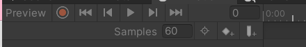

从左至右：

1. 预览模式（开关）
2. 录制模式（开关）打开后预览模式默认开启
3. 回到动画开头
4. 上一关键帧（快捷键：键盘逗号）
5. 播放动画（快捷键：键盘Alt+逗号）
6. 下一关键帧（快捷键：键盘句号）
7. 回到动画结尾（快捷键：键盘Alt+句号）
8. 当前处于第几帧

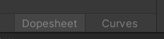

- Dopesheet：关键帧模式
- Curves：曲线模式


从左至右：

- 按选择筛选
- 添加关键帧
- 添加事件

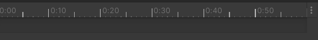

动画时间轴面板
当编辑动画时，会在该面板上编辑关键帧等信息

# 任务44：创建编辑Animation动画 知识点

> [动画系统概述 - Unity 手册](https://docs.unity.cn/cn/2020.3/Manual/AnimationOverview.html)
>
> [Animation 窗口指南 - Unity 手册](https://docs.unity.cn/cn/2020.3/Manual/AnimationEditorGuide.html)
>
> [使用 Animation 视图 - Unity 手册](https://docs.unity.cn/cn/2020.3/Manual/animeditor-UsingAnimationEditor.html)

## 知识点一 创建动画

创建Animation Clip：

1. 在场景中选中想要创建动画的对象

2. 在Animation窗口中点击创建
3. 选择动画文件将要保存到的位置

保存动画文件时，Unity会帮助我们完成以下操作：

1. 创建一个 Animator Controller（动画控制器或称之为动画状态机） 资源（新动画系统）
2. 将新创建的动画文件添加到Animator Controller中
3. 为动画对象添加Animator组件
4. 为Animator组件关联创建的Animator Controller文件

## 知识点二 窗口上的变化

### 左侧面板

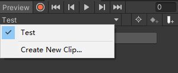

多出一个可以选择当前动画的下拉列表，可以在这里创建新动画和切换动画。

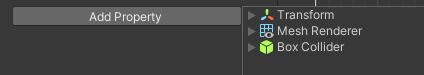

多出一个可以添加变化属性的按钮
在这里你可以任意添加你想要在动画中变化的脚本变量

### 右侧面板

时间轴可以拖动

注意：时间轴上的单位为n秒n帧，一格代表一帧（并不是秒）

#### 选择关键帧右键


- Add Key：添加关键帧

- Delete Key：删除关键帧
- Clamped Auto：切线模式，自动设置切线
- Auto：旧版切线模式，和Clamped Auto基本类似，主要用于老动画系统，建议不使用除非是老动画
- Free Smooth：自由设置切线
- Flat：切线设置为水平
- Broken：单独控制左右曲线切线
- Free：自由设置
- Linear：直线
- Constant：常量切换
- Weighted：权重切换

## 知识点三 关键帧模式下编辑动画

点击录制按钮，我们可以添加Property（属性），再添加关键帧，在关键帧处编辑属性，Unity会自动生成一些过渡动画，已达到动画的效果。

或者拖到帧到指定位置，然后直接修改物体面板参数或者在场景当中直接移动物体，Unity会自动生成一些关键帧，记录我们的操作。

## 知识点四 曲线模式下编辑动画

每一条曲线，就代表一个Property，可以通过右键关键帧，选择功能进行编辑。

## 知识点五 动画文件界面参数

Animation Clip参数


- Loop Time：是否是循环动画（在动画结尾时重新开始）
- Loop Pose：无缝循环运动
- Cycle Offset：循环动画在其他时间开始时的周期偏移

调整到Debug将显示额外参数

- Sample Rate：帧率，和Animation窗口上的Samples是同一个。
- Wrap Mode：播放模式

### Animation窗口右上角更多选项


- Seconds：以秒显示时间轴
- Frames：以帧显示时间轴
- Show Sample Rate：在Animation窗口显示帧率
- Set Sample Rate：快捷设置帧率

# 任务45：代码控制动画（老动画系统） 知识点

## 知识点一 什么是老动画系统

Unity中有两套动画系统

- 新：Mecanim动画系统——主要用Animator组件控制动画
- 老：Animation动画系统——主要用Animation组件控制动画（Unity4之前的版本可能会用到）

目前我们为对象在Animation窗口创建的动画都会被新动画系统支配。

有特殊需求或者针对一些简易动画，才会使用老动画系统。

## 知识点二 老动画系统控制动画播放

注意：

在创建动画之前为对象添加Animation组件之后再制作动画，这时制作出的动画和之前的动画格式是有区别的。

### Animation参数

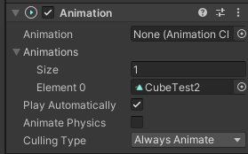

- Animation：默认播放的动画
- Animations：该动画组件可以控制的所有动画
- Play AutoMatically：是否一开始就自动播放默认动画
- Animate Physics：动画是否与物理交互
- Culling Type：决定什么时候不播放动画
- Always Animate：始终播放
- Based On Renderers：基于默认动画姿势剔除

### Animation Clip参数

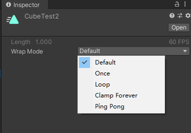

- Default：读取设置得更高的默认重复模式
- Once：播放一次就停止
- Loop：从头到尾不停循环播放
- PingPong：从头到尾从尾到头不停播放
- ClampForever：播放结束会停在最后一帧，并且会一直播放最后一帧（相当于状态不停止），表现效果和Once一样，但是逻辑处理上不同

# 知识点三 代码控制播放

### 获取组件

```csharp
animation = this.GetComponent<Animation>();
```

### 1.播放动画

参数为动画文件名。

```csharp
if(Input.GetKeyDown(KeyCode.Alpha1))
{
    animation.Play("1");
}
if (Input.GetKeyDown(KeyCode.Alpha2))
{
    animation.Play("2");
}
```

### 2.淡入播放,自动产生过渡效果

```csharp
if(Input.GetKeyDown(KeyCode.Alpha3))
{
    //当你要播放的动画的开始状态 和当前的状态 不一样时 
    //就会产生过渡效果
    animation.CrossFade("3");
    //animation.Play("3");
}
```

### 3.前一个播完再播放下一个

```csharp
if( Input.GetKeyDown(KeyCode.Alpha4) )
{
    //animation.PlayQueued("2");	//没有过渡效果
    animation.CrossFadeQueued("2");	//自动产生过渡效果
}
```

### 4.停止播放所有动画

```csharp
animation.Stop();
```

### 5.是否在播放某个动画

```csharp
if( animation.IsPlaying("1") )
{

}
```

### 6.播放模式设置

```csharp
animation.wrapMode = WrapMode.Loop;
```

### 7.其它（了解即可，新动画系统中会详细讲解）

层级和权重以及混合（老动画系统需要通过代码来达到动画的遮罩、融合等效果）

设置层级

```csharp
animation["1"].layer = 1;
```

设置权重

```csharp
animation["1"].weight = 1;
```

混合模式 叠加还是混合

```csharp
animation["1"].blendMode = AnimationBlendMode.Additive;
```

设置混组相关骨骼信息

```csharp
animation[""].AddMixingTransform();
```

## 知识点四 动画事件

动画事件主要用于处理 当动画播放到某一时刻想要触发某些逻辑。

比如进行伤害检测、发射子弹、特效播放等等。

### 事件添加

在Animation窗口，在某一帧处点击Add Event，即可添加事件。

动画执行到此帧时，将执行事件。

在Animation窗口选择这个事件，可以关联函数。

函数设置参数，即可在Inspector窗口传参数。

## 总结

老动画系统主要用于处理老版本项目和简单的一些自制动画。

新项目都不建议大家使用了。

关键组件：Animation

## 练习题

使用Animation相关知识

请自己用Unity自带几何体拼凑一个机器人，有手有脚

为它制作两个动作，一个待机动作（站立不动），一个走路动作

我们可以通过键盘控制它移动切换动作

# 任务46：Animation 练习题

注意：如果对整体录制动画，当动画过渡时，如果某些子物体没有设定初始关键帧，在物体过渡时，将出现无法还原为初始状态的情况。

解决：对于不使用的子物体，在第0帧设置一个关键帧，设置其第0帧为想要的初始状态。

# 任务47：有限状态机概念 知识点

## 知识点一 什么是有限状态机

有限状态机（Finite - state machine, FSM）
又称有限状态自动机，简称状态机
是表示有限个状态以及在这些状态之间的转移和动作等行为的数学模型

有限：表示是有限度的不是无限的
状态：指所拥有的所有状态

举例说明：
假设我们人会做很多个动作，也就是有很多种状态
这些状态包括 站立、走路、跑步、攻击、防守、睡觉等等
我们每天都会在这些状态中切换，而且这些状态虽然多但是是有限的
当达到某种条件时，我们就会在这些状态中进行切换
而且这种切换时随时可能发生的

## 知识点二 有限状态机对于我们的意义

游戏开发中有很多功能系统都是有限状态机
最典型的状态机系统

- 动作系统 —— 当满足某个条件切换一个动作，且动作是有限的
- AI（人工智能）系统 —— 当满足某个条件切换一个状态，且状态时有限的

所以状态机是游戏开发中一个必不可少的概念。

## 知识点三 最简单的状态机实现

最简单的状态机实现代码就是基于switch的实现

```csharp
//假设我们只有一个值来控制当前玩家的状态
string animName = "idle";
switch (animName)
{
    case "idle":
        //待机动作逻辑
        break;
    case "move":
        //移动动作逻辑
        break;
    case "run":
        //跑步动作逻辑
        break;
    case "atk":
        //攻击动作逻辑
        break;
}
```

## 总结

游戏开发中某些系统中存在有限种状态的切换变化时，我们可以使用有限状态机的设计思路来进行逻辑编写。

# 任务48：Animator Controller动画控制器（状态机） 知识点

> [Animator 窗口 - Unity 手册](https://docs.unity.cn/cn/2020.3/Manual/AnimatorWindow.html)
>
> [使用动画事件 - Unity 手册](https://docs.unity.cn/cn/2019.4/Manual/script-AnimationWindowEvent.html)

## 知识点一 创建动画状态机

1. 通过为场景中物体创建动画时自动创建   
   1. 对物体创建动画，就会自动创建动画状态机文件（Animator Controller）
2. 手动创建动画状态机文件
   1. 右键Project窗口创建Animator Controller

## 知识点二 基础使用——初识动画状态机窗口

### 左侧面板


- Layers：动画层级页签，为动画添加更多的层级，层级高的动画播放会覆盖层级低的
  - 根据层级的权重（weight）控制显示
- Parameters：参数页签，为动画状态机添加控制状态切换的参数
- 眼睛图标：显隐左侧面板

### 右侧面板


网格化布局区域：
主要用于编辑状态之前的切换关系

1. 窗口中的每一个矩形表示一个状态
2. 窗口中的每一个箭头表示一个切换条件

矩形说明：
默认三大矩形：

- 绿色Entry矩形：进入状态机流程
- 红色Exit矩形：退出状态机流程
- Any State：任意状态，代表状态机中的任意状态

人为添加矩形：

- 橙色矩形：一开始的默认状态动画，和Entry相连，表示一开始播放的动画
- 灰色矩形：自己添加的某一种动作状态

## 知识点三 基础使用——添加动画

1. 自动添加——为对象创建动画后会自动将动画添加到状态机中
2. 手动添加1——将动画文件拖入到状态机中（注意：老动画拖入会有警告）
3. 手动添加2——右键创建状态，再关联动画

## 知识点四 基础使用——添加切换连线

在Animator窗口右键状态，选择 `Make Transition`，即可创建状态转变。

## 知识点五 基础使用——添加切换条件

在`Parameters`，点击加号，选择类型即可添加需要的参数。

## 知识点六 基础使用——设置动画间切换条件

选择两个状态之间的连线，在Inspector窗口即可添加`Conditions`（条件），用以状态改变。

# 任务49：代码控制动画状态机切换 知识点

## 知识点一 关键组件Animator

> [Animator 组件 - Unity 手册](https://docs.unity.cn/cn/2020.3/Manual/class-Animator.html)

### 参数相关

- Controller：对应的动画控制器（状态机）
- Avatar：对应的替身配置信息（之后讲解3D模型时详细讲解）
- Apply Root Motion：是否启用动画位移更新
- UpdateMode：更新模式（一般不修改它）
  - Normal：正常更新
  - Animate Physics：物理更新
  - Unscaled Time：不受时间缩放影响

- Culling Mode：裁剪剔除模式
  - Always Animate：始终播放动画，即使在屏幕外也不剔除
  - Cull Update Transforms：摄像机没有渲染该物体时，停止位置、IK的写入
  - Cull Completely：摄像机没有渲染物体时，整个动画被完全禁用

## 知识点二 Animator中的API

我们用代码控制状态机切换主要使用的就是Animator提供给我们的API

我们知道一共有四种切换条件 int float bool trigger

所以对应的API也是和这四种类型有关系的。

### 1.通过状态机条件切换动画

```csharp
animator = this.GetComponent<Animator>();

animator.SetFloat("条件名", 1.2f);
animator.SetInteger("条件名", 5);
animator.SetBool("条件名", true);
animator.SetTrigger("条件名");

animator.GetFloat("条件名");
animator.GetInteger("条件名");
animator.GetBool("条件名");
```

### 2.直接切换动画 除非特殊情况 不然一般不使用

```csharp
animator.Play("状态名");
```

## 练习题

使用Animator相关知识
请自己用Unity自带几何体拼凑一个机器人，有手有脚
为它制作两个动作，一个待机动作（站立不动），一个走路动作
我们可以通过键盘控制它移动切换动作

# 2D动画

# 任务51：2D序列帧动画 知识点

## 知识点一 什么是序列帧动画

我们最常见的序列帧动画就是我们看的日本动画片。

以固定时间间隔，按序列切换图片，就是序列帧动画的本质。

当固定时间间隔足够短时，我们肉眼就会认为图片是连续动态的，进而形成动画（会动的画面）。

它的本质和游戏的帧率概念有点类似，原理就是在一个循环中按一定时间间隔不停的切换显示的图片。

## 知识点二 代码制作序列帧动画

```csharp
public class Lesson35 : MonoBehaviour
{
    public Sprite[] sprites;
    private float time = 0;
    private SpriteRenderer spR;
    private int spIndex = 0;

    // Start is called before the first frame update
    void Start()
    {
        spR = this.GetComponent<SpriteRenderer>();
    }

    // Update is called once per frame
    void Update()
    {
        time += Time.deltaTime;
        if (time >= 0.03)
        {
            ++spIndex;
            spIndex %= sprites.Length;
            time = 0;
            spR.sprite = sprites[spIndex];
        }
    }
}
```

## 知识点三 Animation窗口制作序列帧动画

### 方法一：

1. 创建一个空物体
2. 创建一个动画
3. 直接将某一个动作的序列帧拖入窗口中

### 方法二：

直接将图片拖入Hierarchy层级窗口中

注意：需要修改动画帧率 来控制动画的播放速度（修改Samples）

## 知识点四 利用Animator进行动画控制

```csharp
if (Input.GetKey(KeyCode.D))
{

    animator.SetBool("run", true);
    animator.SetBool("idle", false);
    spRenderer.flipX = true;
    this.transform.Translate(Vector2.right * moveSpeed * Time.deltaTime);
}

if (Input.GetKey(KeyCode.A))
{
    spRenderer.flipX = false;
    animator.SetBool("run", true);
    animator.SetBool("idle", false);
    this.transform.Translate(Vector2.left * moveSpeed * Time.deltaTime);
}

if (Input.GetKeyUp(KeyCode.A) || Input.GetKeyUp(KeyCode.D))
{
    animator.SetBool("run", false);
    animator.SetBool("idle", true);
}
```

## 练习题

在之前2D相关练习题的基础上，为控制的对象加上序列帧动画

# 任务53：单张图片骨骼编辑 知识点

## 知识点一 什么是2D骨骼动画

首先回顾一下序列帧动画
传统的序列帧动画为了达到好的动画效果
理论上来说，图片越多，动作越流畅
往往需要较多的美术资源，虽然效果好但是资源占用较多

而2D骨骼动画是利用3D骨骼动画的制作原理进行制作的。
将一张2D图片分割成n个部位，为每个部位绑上骨骼，控制骨骼旋转移动
达到用最少的2D美术资源做出流畅的2D动画效果

## 知识点二 Unity中如何制作2D骨骼动画

主要方式有两种

1. 使用Unity2018新加功能 2D Animation 工具制作
2. 使用跨平台骨骼动画制作工具 Spine 制作

## 知识点三 导入2D Animation工具

在Package Manager窗口 搜索 2D Animation并安装

## 知识点四 面板讲解

导入工具后 在Sprite Editor窗口会多一个选项 Skinning Editor

> [Editor tools and shortcuts | 2D Animation | 5.2.6 (unity3d.com)](https://docs.unity3d.com/Packages/com.unity.2d.animation@5.2/manual/SkinEdToolsShortcuts.html)

### 工具栏

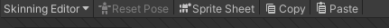

- $\textcolor{OrangeRed}{Reset Pose：将角色骨骼和关节恢复到原始位置}$
- Sprite Sheet：图集显示
- Copy：复制当前选择的数据
- Paste：粘贴复制数据

### 左侧工具

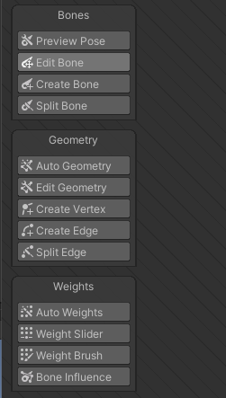

### Bone骨骼相关

- $\textcolor{OrangeRed}{Preview Pose：预览模式，可以预览动作并不会真正的改变设置}$
- $\textcolor{OrangeRed}{Edit Bone：编辑骨骼，可以改变骨骼的位置、长度、方向、名称等等}$
- $\textcolor{OrangeRed}{Create Bone：创建骨骼}$
- $\textcolor{OrangeRed}{Split Bone：拆分骨骼，将一个骨骼一分为二}$

### Geometry蒙皮相关

蒙皮决定了骨骼主要控制哪一部分

- $\textcolor{OrangeRed}{Auto Geometry:自动蒙皮}$
  - 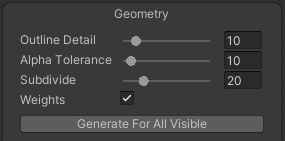
  - $\textcolor{OrangeRed}{OUtline Detail边缘细节，值越大，轮廓越细致}$
  - Alpha Tolerance：阿尔法公差值，控制蒙皮细节
  - Subdivide：细化程度，控制蒙皮细节
  - Weights：是否自动设置权重，一般勾选
- $\textcolor{OrangeRed}{Edit Geometry编辑蒙皮}$
- $\textcolor{OrangeRed}{Create Vertex创建顶点}$
- $\textcolor{OrangeRed}{Create Edge创建边线}$
- $\textcolor{OrangeRed}{Split Edge拆分边，用一个新的顶点分离一个边}$

### Weights权重相关

决定了当骨骼动时如何印象顶点和边

- $\textcolor{OrangeRed}{Auto Weights自动赋予权重}$
- $\textcolor{OrangeRed}{Weight Slider编辑顶点和边的权重}$
  - 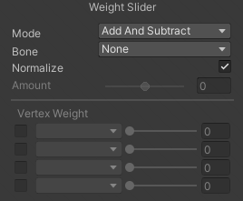
  - $\textcolor{OrangeRed}{Mode：计算模式}$
    - $\textcolor{OrangeRed}{Add And Subtract：加减法}$
    - $\textcolor{OrangeRed}{Grow And Shrink：增长和收缩}$
    - $\textcolor{OrangeRed}{Smooth：平滑}$
  - $\textcolor{OrangeRed}{Bone：设置权重的骨骼}$
  - $\textcolor{OrangeRed}{Normalize：标准化设置}$
  - $\textcolor{OrangeRed}{Amount：数量级}$
  - $\textcolor{OrangeRed}{Vertex Weight：顶点权重，对应的骨骼}$
- $\textcolor{OrangeRed}{Weight Brush用笔刷赋予权重}$
  - 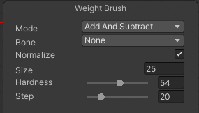
  - $\textcolor{OrangeRed}{Size：笔刷大小}$
  - $\textcolor{OrangeRed}{Hardness：笔刷强度，越大效果越明显}$
  - $\textcolor{OrangeRed}{Step：步数}$

- $\textcolor{OrangeRed}{Bone Influence选择骨骼用的Sprite}$
  - 主要用于在psb图片中，使用骨骼控制点的图片关联


### Visibility

切换选定精灵或骨骼的可见性


- 左侧拖动条：控制编辑时骨骼透明度
- 右侧拖动条：控制编辑时权重透明度
- $\textcolor{OrangeRed}{下方列表：浏览各骨骼名和骨骼层级信息，用来更改骨骼名称}$

## 知识点五 骨骼动画使用

给对象添加SpriteSkin脚本，然后创建Bones，就会自动绑定骨骼。

此时，将自动给对象创建骨骼对象，可以通过操作场景内的骨骼，制作动画。

# 任务54：图集图片骨骼编辑 知识点

## 知识点一 注意事项

1. 设置Sprite为图集模式
2. 对图集图片进行切片

## 知识点二 图集骨骼编辑

对于图集来说，切片的图片每一个都要单独设置骨骼。

在拖入场景中时，需要设计父子物体关系。

比如：

- 所有物体应该设置一个父物体
- 头、左手、右手应该是身体骨骼的子物体，以方便旋转移动

渲染层级问题，可以使用order in layer解决。

## 知识点三 图集骨骼动画使用

选中父物体，单个设定动画即可。

# 任务55：psb图片骨骼编辑 知识点

## 知识点一 认识PSB文件

认识PSB之前先认识PS
PS（photoshop）是一款强大的图像处理软件
在各领域都被广泛使用
在游戏行业中也是美术同学使用最多的图像处理软件之一

PSD和PSB两种格式，都是PS这款软件用于保存图像处理数据的文件格式

PSD和PSB两种格式并没有太大的区别
最大的区别是PSD格式兼容除PS以外的其它一些软件
而PSB只能用PS打开

在Unity中官方建议使用psb格式

## 知识点二 在Unity中使用PSB文件

需要在Packages Manager窗口中引入 2D PSD Importer工具包

## 知识点三 设置PSB文件关键参数


- Extrude Edges：图片边缘延伸网格
- Import Hidden：是否导入psb文件中隐藏的图层
- $\textcolor{OrangeRed}{Moszic：启用后，将图层生成Sprite，并将他们合并成单个纹理}$
- $\textcolor{OrangeRed}{Character Rig：是否使用人物已经绑定的骨骼}$
- $\textcolor{OrangeRed}{Use Layer Grouping：使用psb文件中的层分组}$
- $\textcolor{OrangeRed}{Pivot：轴心点位置}$
- Reslice：从导入层重新生成Sprite，并清除对Sprite的任何更改，只有启用Moszic后又用
- Keep Duplicate Name：让Sprite名称保留PSB文件中的名字

## 知识点四 为PSB文件编辑骨骼信息

此时，SpriteSheet可以切换显示图集和组合后的图片。

此时，Bone Influence配合Visibility的Sprite，将显示每一个图片收到哪些骨骼的影响，根据需要配置即可。

# 任务56：反向动力学IK 知识点

## 知识点一 什么是IK？

在骨骼动画中，构建骨骼的方法被称为正向动力学
它的表现形式是，子骨骼（关节）的位置根据父骨骼（关节）的旋转而改变
用我们人体举例子
当我们抬起手臂时，是肩部关节带动的整个手臂的运动，用父子骨骼理解的话就是父带动了子

而`IK`全称是`Inverse Kinematics`，翻译过来的意思就是反向动力学的意思
它和正向动力学恰恰相反
它的表现形式是，子骨骼（关节）末端的位置改变会带动自己以及自己的父骨骼（关节）旋转
用我们人体举例子
当我们拿起一个杯子的时候是用手掌去拿，以杯子为参照物，我们移动杯子的位置，手臂会随着杯子一起移动
用父子骨骼理解的话就是子带动了父

## 知识点二 2D IK包引入

在Package Manager窗口中引入2D IK工具包
需要在Advanced高级选项中选中Show preview packages（显示预览包）
这样才能看到2D IK相关内容

注意：如果在引入包时报错，需要在Windows防火墙中添加入站规则

==注意：Unity高版本（Unity2020.3.37f1c1）的2D Animation包含了2D IK，不用再导入了。==

## 知识点三 2D IK的使用

给物体一个空父物体，然后在这个父物体上添加 `IK Manager2D`脚本。

点击加号，选择模式，创建IK，此时会多出一个物体，就是Target。


IK Solvers：IK解算器，在这里添加IK
Weight：权重，当有多个IK控制同一点时权重会影响控制的百分比
Restore Default Pose：回复默认位置


Chain（CCD）：可以自定义影响N个关节点，不能反向
Chain（FABRIK）：可以自定义影响N个关节点，可以反向
Limb：只会影响3个关节点


Effector：默认的IK点位置（==一般使用末尾骨骼的子物体（空物体）实现==）
Target：会根据IK点位置生成真正的IK点对象（==就是多出来的物体==）
Flip：反向
Constrain Rotation：约束旋转程度
Solve from Default Pose：从默认姿势进行求解计算
Weight：权重


Chain Length：IK影响的骨骼数量
Iterations：算法运行的次数
Tolerance：容错程度
Velocity：速度

## 知识点四 IK对于我们的意义

1. 瞄准功能
2. 头部朝向功能
3. 拾取物品功能

等等有指向性的功能时 我们都可以通过IK来达到目的

最大的作用，可以方便我们进行动画制作

## 练习题

请制作一个鼠标指向哪，2D人物的手臂就指向哪里的功能。

注意：使用`Camera.main.WorldToScreenPoint`，一定要谨记z轴是横截面位置，需要进行一个替换。

```csharp
using System.Collections;
using System.Collections.Generic;
using UnityEngine;
//**********************************
//创建人：
//功能说明：
//**********************************
public class Lesson39_P : MonoBehaviour
{
    public Transform leftHandIK;

    
    private float z;
    private Vector3 mousePos;

    private void Awake()
    {
        //获取横截面z位置，用于之后的屏幕坐标转世界坐标
        z = Camera.main.WorldToScreenPoint(leftHandIK.position).z;
    }

    // Update is called once per frame
    void Update()
    {
        mousePos = Input.mousePosition;
        mousePos.z = z;
        //由于是用IK对象的位置控制的旋转，那么，我们直接将IK对象的设置为鼠标的位置即可
        leftHandIK.position = Camera.main.ScreenToWorldPoint(mousePos);

    }
}
```

# 任务58：换装—在同一文件中的换装资源 知识点

## 知识点一 如何在同一个psb文件中制作换装资源

1. 在ps中制作美术资源时，将一个游戏对象的所有换装资源都摆放好位置
2. 当我们导入该资源时，要注意是否导入隐藏的图层

## 知识点二 编辑换装资源的骨骼信息以及分组类别

在Sprite Skinng当中，Visibility的Category可以设置组别和标签

注意事项：

- 每个部位 关联的骨骼要明确设置
- 为同一个部位的不同装备分组

## 知识点三 如何换装

两个关键组件

- SpriteLibrary——精灵资料库，确定类别分组信息
- SpriteResolver——精灵解算器，用于确定部位类别和使用的图片

一个数据文件

- SpriteLibraryAsset——精灵资料库资源，具体记录类别分组信息的文件

## 知识点四 代码换装

1. 获取各部位的SpriteResolver（需要引用命名空间）
2. 使用SpriteResolver的API进行装备切换

获取当前部位默认的类别名

```csharp
GetCategory();
```

设置当前部位想要切换的图片信息

```csharp
sr.SetCategoryAndLabel(sr.GetCategory(), "CASK 1");
```

使用字典配合SpriteResolver实现换装

```csharp
using System.Collections;
using System.Collections.Generic;
using UnityEngine;
using UnityEngine.Experimental.U2D.Animation;

public class Lesson40 : MonoBehaviour
{
    public SpriteResolver sr;

    private Dictionary<string, SpriteResolver> equipDic = new Dictionary<string, SpriteResolver>();

    // Start is called before the first frame update
    void Start()
    {
        #region 知识点四 代码换装
        // 1.获取各部位的SpriteResolver（需要引用命名空间）
        // 2.使用SpriteResolver的API进行装备切换
        // GetCategory() 获取当前部位默认的类别名
        // SetCategoryAndLabel 设置当前部位想要切换的图片信息
        // sr.SetCategoryAndLabel(sr.GetCategory(), "CASK 1");

        SpriteResolver[] srs = this.GetComponentsInChildren<SpriteResolver>();
        for (int i = 0; i < srs.Length; i++)
        {
            equipDic.Add(srs[i].GetCategory(), srs[i]);
        }

        ChangeEquip("Cask", "CASK 1");

        #endregion
    }


    public void ChangeEquip(string category, string equipName)
    {
        if( equipDic.ContainsKey(category) )
        {
            equipDic[category].SetCategoryAndLabel(category, equipName);
        }
    }

    // Update is called once per frame
    void Update()
    {
        
    }
}

```

# 任务59：换装—在不同文件中的换装资源 知识点

## 知识点一 如何在不同psb文件中制作换装资源

1. 保证个部位在PS文件中的统一
2. 基础部位可选择性隐藏

## 知识点二 编辑换装资源的骨骼信息

注意事项：不同文件的骨骼信息必须统一，所以我们直接使用复制的方式

复制骨骼后，编辑权重

## 知识点三 手动添加关键组件和数据文件

1. 首先创建SpriteLibraryAsset数据文件

   注意：Unity2020版本在Create->2D->SpriteLibraryAsset

2. 为跟对象添加SpriteLibrary并关联数据文件

3. 为换装部位关联SpriteResolver

## 总结 如何选择 同一文件和 不同文件 制作换装资源两种方案

换装较少的游戏 比如只有面部表情更换 可以使用同一psb文件方案
换装较多的游戏 比如各部位有n种装备 可以使用不同psb文件方案
不同psb文件 拓展性更强

一切根据需求而定

# 任务60：Spine—运行库导入 知识点

## 知识点一 Spine是什么？

Spine是一个收费的跨平台的2D骨骼动画制作工具
它支持Unity，UE，Cocos2D，Cocos2D-x等等游戏引擎
相对Unity2018才推出的 2D Animation
Spine是目前商业游戏中较为常用的骨骼动画制作方案 稳定且高效

官方地址：http://zh.esotericsoftware.com/

## 知识点二 如何学习Spine

制作骨骼动画时美术人员的工作
除非你是要做独立游戏，美术程序一人包
那么我们没有必要去学习如何通过Spine制作骨骼动画

我们只需要学习如何在Unity中通过程序使用Spine制作的资源
如果想要学习如何制作Spine骨骼动画，可以根据官网提供的教学内容进行学习

## 知识点三 导入Unity使用的Spine运行库

有了Spine提供的支持Unity开发的运行库
我们才能在Unity中使用Spine制作的骨骼动画
你可以简单理解其实就是官方写好的识别文件处理文件呈现效果的代码
我们只需要学习如何使用它提供的API即可

# 任务61：Spine—骨骼动画文件的使用 知识点

## 知识点一 Spine导出的Unity资源

Spine导出的资源有3个文件

- .json 存储了骨骼信息
- .png  使用的图片图集
- .atlas.txt    图片在图集中的位置信息

当我们把这三个资源导入到已经引入了Spine运行库的Unity工程后
会自动为我们生成

- \_Atlas    		              材质和.atlas.txt文件的引用配置文件
- \_Material                     材质文件
- \_SkeletonData            json和\_Atlas资源的引用配置文件

## 知识点二 使用Spine导出的骨骼动画

1. 直接将_SkeletonData文件 拖入到场景中

   选择创建 SkeletonAnimation对象

2. 创建空对象 然后手动添加脚本进行关联

# 任务62：Spine—骨骼动画参数相关 知识点

## 知识点回顾 Spine骨骼动画的使用

导入关键文件，然后使用脚本`SkeletonAnimation`控制动画。

## 知识点一 骨骼数据文件参数相关

### 骨骼数据文件

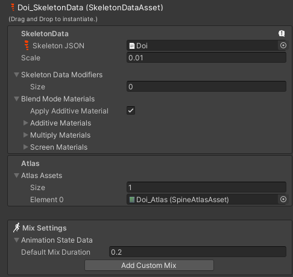

- $\textcolor{OrangeRed}{SkeletonData JSON:骨骼数据文件}$
- Scale：缩放大小
- Skeleton Data Modifiers：骨骼数据修改器
- Blend Mode Materizls：混合模式材质
- Apply Additive Material：是否使用叠加材质
- Additive Materials：叠加材质
- Multiply Materials：相乘材质
- Screen Materials：屏幕材质
- $\textcolor{OrangeRed}{Atlas Assets：图集资源}$
- $\textcolor{OrangeRed}{Mix Settings：混合设置}$
  - $\textcolor{OrangeRed}{Animation State Data：动画状态数据}$
    $\textcolor{OrangeRed}{Default Mix Duration：默认混合持续时间}$
  - $\textcolor{OrangeRed}{Add Custom Mix：添加自定义混合（可以指定某两个动画之间的持续时间）}$

Preview：预览


- $\textcolor{OrangeRed}{Animations}$：动画

- $\textcolor{OrangeRed}{Setup Pose}$：设置姿势（还原到默认姿势）

- $\textcolor{OrangeRed}{Create Animation Reference Assets}$：创建动画参考资源

- $\textcolor{OrangeRed}{Slots}$：插槽相关（一个部位有多张图片构成，可以在这预览）

- SkeletonMecanim：骨骼机制
  Controller：关联动画控制器

  SkeletonMecanim是SkeletonAnimation的替代品，它不是必须的

Skin：蒙皮选择

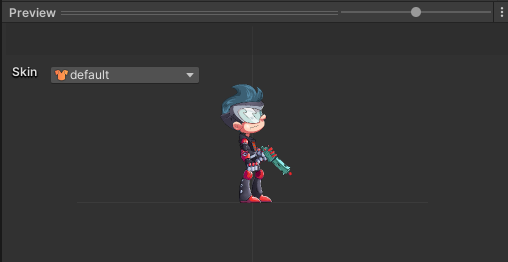

## 知识点二 骨骼动画脚本参数相关


- $\textcolor{OrangeRed}{SkeletonData Asset}$：关联的骨骼动画信息
- $\textcolor{OrangeRed}{Animation Name}$：当前播放的动画名
- $\textcolor{OrangeRed}{Loop}$：是否循环
- Initial Skin：初始蒙皮
  美术在制作时可能有几套蒙皮
  一般情况下只有一套 不需要修改
- $\textcolor{OrangeRed}{Time Scale}$：时间缩放，值越大动画播放的越快
- Root Motion：是否添加根运动的脚本，一般情况下不添加

# 任务63：Spine—骨骼动画代码相关 知识点

注意：需要先引入命名空间

```csharp
using Spine;
using Spine.Unity;
```

## 知识点一 动画播放

```csharp
sa = this.GetComponent<SkeletonAnimation>();
```

方法一：直接改变SkeletonAnimation中参数

```csharp
sa.loop = true;
sa.AnimationName = "jump";
```

方法二：使用SkeletonAnimation中动画状态改变的函数

```csharp
//马上播放
sa.AnimationState.SetAnimation(0, jumpName, false);
//排队播放
sa.AnimationState.AddAnimation(0, "walk", true, 0);
```

## 知识点二 转向

```csharp
sa.skeleton.ScaleX = -1;
```

## 知识点三 动画事件

```csharp
//动画开始播放
sa.AnimationState.Start += (t) =>
{
    print( sa.AnimationName +  "动画开始播放");
};

//动画被中断或者清除
sa.AnimationState.End += (t) =>
{
    print(sa.AnimationName + "动画中断或者清除");
};

//播放完成
sa.AnimationState.Complete += (t) =>
{
    print(sa.AnimationName + "动画播放完成");
};

//做动画时添加的自定义事件
sa.AnimationState.Event += (t, e) =>
{
    print(sa.AnimationName + "自定义事件");
};
```

## 知识点四 便捷特性

```csharp
动画特性
[SpineAnimation]

骨骼特性
[SpineBone]

插槽特性
[SpineSlot]

附件特性
[SpineAttachment]
```

## 知识点五 获取骨骼、设置插槽附件

获取骨骼

```csharp
Bone b = sa.skeleton.FindBone(boneName);
sa.skeleton.SetAttachment(slotName, attachmentName);
```

## 知识点六 在UI中使用

创建SkeletonGraphic（UnityUI）对象，即可在UGUi当中使用。

# 模型导入相关设置

# 任务64：模型导入概述 知识点

## 知识点一 Unity中使用的模型

> [Model Import Settings 窗口 - Unity 手册](https://docs.unity.cn/cn/2020.3/Manual/class-FBXImporter.html)

Unity支持很多模型格式
比如

- .fbx
- .dae
- .3ds
- .dxf
- .obj等等

99%的模型都不是在Unity中制作的，都是美术人员在建模软件中制作
如 3DMax、Maya等等
当他们制作完模型后，虽然Unity支持很多模型格式
但是官方建议是将模型在建模软件中导出为FBX格式后再使用

使用FBX模型格式的优势

1. 减少不必要数据，提升导入效率
2. 不需要在每台计算机上安装建模软件的授权副本
3. 对Unity版本无要求，使用原始3D模型格式可能会因为版本不同导致错误或意外

如果美术同学不知道如何导出FBX格式的模型和导出规范
可以参考Unity官网文档或者百度谷歌

美术同学在导出模型时需要注意

1. https://docs.unity.cn/cn/2019.4/Manual/CreatingDCCAssets.html
2. 坐标轴，人物面朝向为Z轴正方向，Y轴正方向为头顶方向，X轴正方向为人物右侧

## 知识点二 导入模型的基本流程

1. 美术同学用3D建模软件制作好模型导出FBX格式模型资源
2. 程序将这些模型资源导入到Unity的资源文件夹中
3. 在Unity内部对这些模型进行基础设置——模型、骨骼、动作、材质

## 知识点三 如何在Unity中设置模型相关内容

在Project窗口选中导入的模型
在Inspector窗口进行相关设置
4个页签分别是

1. Model 模型页签
2. Rig 操纵（骨骼）页签
3. Animation 动画页签
4. Materials 材质纹理页签

通过这4个页签对模型动作相关信息设置完成后
之后我们才能在场景中更好的使用这些模型资源

# 任务65：Model模型页签 知识点

## 知识点一 Model模型页签是设置什么的

该页签主要是用于设置
比如
模型比例设置
是否导入模型中的摄像机和光源
网格压缩方式 等等相关信息

修改模型中存储的各种元素和属性
最终会影响在Unity中使用模型时的一些表现

## 知识点二 参数讲解

> [Model 选项卡 - Unity 手册](https://docs.unity.cn/cn/2020.3/Manual/FBXImporter-Model.html)

# 任务66：Rig操纵页签 知识点

## 知识点一 Rig操纵（骨骼）页签是用来干啥的

该页签主要是用于设置
如何将骨骼映射到导入模型中的网格，以便能够将其动画化
对于人形角色模型，需要分配或创建Avatar（替身信息）
对于非人形角色模型，需要在骨骼中确定根骨骼

简单来说Rig页签主要是设置骨骼和替身系统相关信息的
设置了他们，动画才能正常的播放

## 知识点二 面板基础参数讲解

> [Rig 选项卡 - Unity 手册](https://docs.unity.cn/cn/2020.3/Manual/FBXImporter-Rig.html)

### 面板基础信息


Animation Type：动画类型

- None：不存在动画主要用于一些环境静态模型
- Humanoid：人形模型
  一般情况下，有头和四肢（一个头两条腿两只手）为人形
  人形模型需要使用Avatar化身系统
  绑定人主要关节的映射关系
- Generic：通用模型，非人形模型
  不是标准的人形模型，可以是任意形状，可能有8只腿两个头等等
  这种模型主要需要设置骨骼根节点
- Legacy：旧版动画类型
  与Unity3.x及更早版本导入和使用动画
  一般不使用

## 知识点三 Avatar化身系统是什么

> [Avatar Mask 窗口 - Unity 手册](https://docs.unity.cn/cn/2020.3/Manual/class-AvatarMask.html)

理解化身系统首先要知道骨骼动画是什么
通过我们之前基础知识的讲解和2D骨骼动画的讲解
相信大家已经了解骨骼动画是什么
3D动画的本质 也是骨骼动画
为制作好的模型绑定骨骼制作动画是模型动画的制作流程

形象的理解
对于人来说
人的整体结构都是一致的
另一个人能做的动作理论上来说我们是完全可以模仿出来的
而化身系统的本质，就是动作的模仿（复用）
我们可以把一个标准人形动作通过化身系统复用到其它人形模型上
只要保证他们的关节点对应关系是一致的

而这节课要学习的就是如何设置人形模型在化身系统中关节的对应关系

## 知识点四 化身系统设置讲解

> [Avatar Mapping 选项卡 - Unity 手册](https://docs.unity.cn/cn/2020.3/Manual/class-Avatar.html)
>
> [Avatar Muscle & Settings 选项卡 - Unity 手册](https://docs.unity.cn/cn/2020.3/Manual/MuscleDefinitions.html)

- Mapping
  我们需要在这个页签对模型关节进行映射设置
  因为人物动画无非就是改变这些关节的角度
- Muscles&Settings
  - Muscle Group Preview
    肌肉群预览
    可以在这里预览在不同姿势的旋转变化
    用来观察之前的关联映射关系是否合理
    主要起到预览作用
  - Per-Muscle Settings
    肌肉设置
    用于设置各骨骼在旋转时的范围限制
    因为如果不设置限制，在一些极限角度时会非常奇怪
    我们可以在这里单独设置限制范围

# 任务67：Animation动画页签概述 知识点

## 知识点一 Animation动画页签是用来干啥的

当我们选中包含动画剪辑的的模型时
该页签将显示动画设置相关的内容

动画剪辑是Unity动画的最小构成元素
代表一个单独的动作

当美术同学做好动画导出时建议将模型和动画文件分别导出

1. 导出包含网格信息不包含动作信息模型
2. 导出不包含网格信息包含动作信息的动作（模型）文件

具体的导出规则可以参考

1. 如何导入外部创建的模型资源

   https://docs.unity.cn/cn/2019.4/Manual/CreatingDCCAssets.html

2. 使用多个模型文件来导入动画

   https://docs.unity.cn/cn/2019.4/Manual/Splittinganimations.html

## 知识点二 Animation动画页签的4大部分

1. 基础信息设置
2. 动画剪辑属性基本设置
3. 动画剪辑属性其它设置
4. 预览窗口

> [Animation 选项卡 - Unity 手册](https://docs.unity.cn/cn/2020.3/Manual/class-AnimationClip.html)

# 3D动画相关

# 任务73：3D动画的使用 知识点

## 知识点一 使用导入的3D动画

1. 将模型拖入场景中
2. 为模型对象添加Animator脚本
3. 为其撞见Animator Controller动画控制器（状态机）
4. 将想要使用的相关动作 拖入Animator Controller动画控制器（状态机）窗口
5. 在Animator Controller动画控制器（状态机）窗口编辑动画关系（使用之前学习的状态机相关知识）
6. 代码控制状态切换

## 知识点二 状态设置相关参数

我们可以选中状态机窗口中的某一个状态为其设置相关参数
我们可以称之为动画状态设置
主要设置的是 当前状态的播放速度等等细节

## 知识点三 连线设置相关参数

我们可以选中状态机窗口中的某一条箭头为其设置相关参数
我们可以称之为动画过渡设置
主要设置的是 从一个状态切换到另一个状态时 的表现效果和切换条件

## 总结

注意点

1. Has Exit Time是否启用 如果希望瞬间切换动画不需过多等待，取消该选项
2. Can Transition To self是否启用 如果希望自己不要打断自己，取消该选项

## 练习题

请使用资料区的模型，设置它的状态机，我们可以通过W键控制其前进，S键控制其后退，空格键控制其跳跃，AD键可以控制其转向

```csharp
using System.Collections;
using System.Collections.Generic;
using UnityEngine;
//**********************************
//创建人：
//功能说明：
//**********************************
public class Lesson50_P : MonoBehaviour
{
    private Animator animator;

    // Start is called before the first frame update
    void Start()
    {
        animator = GetComponent<Animator>();
    }

    // Update is called once per frame
    void Update()
    {
        animator.SetInteger("Speed", (int)Input.GetAxisRaw("Vertical"));
        if (Input.GetKeyDown(KeyCode.Space))
        {
            animator.SetBool("Jump", true);
        }
        this.transform.Rotate(Vector3.up, Input.GetAxis("Horizontal") * 40 * Time.deltaTime);
    }

    public void JumpOver()
    {
        animator.SetBool("Jump", false);
    }
}
```

# 任务75-1：动画分层和遮罩 知识点

动画分层的作用
游戏中会有这样的需求
人物健康状态时播放正常动画
人物非健康状态时播放特殊动画
比如血量低于一定界限，人物的大部分动作将表现为虚弱状态
我们可以利用动画分层来快速实现这样的功能

动画分层和动画遮罩结合使用
3D游戏中我们常常会面对这样的需求

- 人物站立时会有开枪动作
- 人物跑动时会有开枪动作
- 人物蹲下时会有开枪动作

从表现上来看光是开枪动作可能就有3种
如果要让美术同学做3种开枪动作费时又费资源

我们是否可以这样做
比如开枪动画只影响上半身
下半身根据实际情况播放站立，跑动，蹲下动作
通过上下半身播放不同的动画就可以达到动画的组合播放

动画分层的主要就是达到这两个目的

1. 两套不同层动作的切换
2. 结合动画遮罩让两个动画叠加在一起播放

提升动画多样性，节约资源

## 知识点二 如何使用动画分层

1. 新建一个动画层
2. 设置动画层参数
3. 在该层中设置状态机（注意：结合遮罩使用时默认状态一般为Null状态）
4. 根据需求创建动画遮罩

通过代码改变某层的权重

```csharp
animator = this.GetComponent<Animator>();
animator.SetLayerWeight(animator.GetLayerIndex("MyLayer2"), 1);
```

## 总结

利用动画分层我们可以做到

1. 上下半身播放两个动画进行组合，比如上半身扔炸弹，下半身待机移动蹲下
2. 快速制作正常状态和受伤状态的动作切换

## 练习题

1. 在之前练习题的基础上，按J键可以让人物上半身播放一个其他动画
2. 为角色制作受伤时，基础动画改变的功能

# 任务77-1：动画1D混合 知识点

## 知识点一 什么是动画混合

游戏动画中常见的功能就是在两个或者多个相似运动之间进行混合
比如

1. 根据角色的速度来混合行走和奔跑动画
2. 根据角色的转向来混合向左或向右倾斜的动作

你可以理解是高级版的动画过渡

之前我们学习的动画过渡是处理两个不同类型动作之间切换的过渡效果
而动画混合是允许合并多个动画来使动画平滑混合

## 知识点二 如何在状态机窗口创建动画混合状态

在Animator Controller窗口 右键->Create State->From New Blend Tree

## 知识点三 1D混合的使用

1D混合就是通过一个参数来混合子运动

注意：往混合树里面加入动作时需要找到动画文件进行关联

## 练习题

在之前练习题的基础上，通过1D混合树制作前进后退的功能。

通过控制Blend Tree的参数，我们可以简单的实现按住Shift实现奔跑的效果。

```csharp
using System.Collections;
using System.Collections.Generic;
using UnityEngine;

public class Lesson52_Exercises : MonoBehaviour
{
    private Animator animator;

    private float dValue = 0.5f;

    // Start is called before the first frame update
    void Start()
    {
        #region 练习题
        //在之前练习题的基础上，通过1D混合树制作前进后退的功能

        animator = this.GetComponent<Animator>();
        #endregion
    }

    // Update is called once per frame
    void Update()
    {
        animator.SetFloat("Speed", Input.GetAxis("Vertical")* dValue);

        if (Input.GetKeyDown(KeyCode.LeftShift))
            dValue = 1;
        if (Input.GetKeyUp(KeyCode.LeftShift))
            dValue = 0.5f;


        if (Input.GetKeyDown(KeyCode.Space))
            animator.SetTrigger("Jump");
    }
}
```

# 任务79-1：动画2D混合 知识点

## 知识点一 1D混合和2D混合

1D混合是用一个参数控制动画的混合，之所以叫1D是因为一个参数可以看做是1维线性的

2D混合你可以简单理解是用两个参数控制动画的混合，之所以叫2D是因为两个参数可以看做是2维平面xy轴的感觉

## 知识点二 2D混合的种类

1. 2D Simple Directional     

   2D简单定向模式  运动表示不同方向时使用 比如向前、后、左、右走

2. 2D Freeform Directional   

   2D自由形式定向模式   同上 运动表示不同方向时使用 但是可以在同一方向上有多个运动 比如向前跑和走

3. 2D Freeform Cartesian     

   2D自由形式笛卡尔坐标模式  运动不表示不同方向时使用 比如向前走不拐弯 向前跑不拐弯 向前走右转 向前跑右转

4. Direct                    

   直接模式   自由控制每个节点权重，一般做表情动作等

## 知识点三 2D混合的使用

将Blend Type修改为除了1D的其他类型即可。

## 知识点四 总结

前三种方式只是针对动作的不同采用不同的算法来进行混合的
第四种可以用多个参数进行融合

混合树中还可以再嵌入混合树，使用上是一致的，根据实际情况选择性使用

## 练习题

通过2D混合树制作前进后退左右旋转的功能

# 任务81-1：动画子状态机 知识点

## 知识点一 什么是子状态机

子状态机顾名思义就是在状态机里还有一个状态机
它的主要作用就是某一个状态是由多个动作状态组合而成的复杂状态
比如某一个技能它是由3段动作组合而成的，跳起，攻击，落下
当我们释放这个技能时会连续播放这3个动作
那么我们完全可以把他们放到一个子状态机中

## 知识点二 创建子状态机

在Animator Controller窗口中右键->Create Sub-State Machine

## 知识点三 编辑子状态机

注意：子状态机和外部状态的相互连接方式

子状态机连接回到上一层动画，可以选择回到状态机还是回到某个状态。

# 任务83-1：动画IK控制 知识点

## 知识点一 什么是IK？

在骨骼动画中，构建骨骼的方法被称为正向动力学
它的表现形式是，子骨骼（关节）的位置根据父骨骼（关节）的旋转而改变
用我们人体举例子
当我们抬起手臂时，是肩部关节带动的整个手臂的运动，用父子骨骼理解的话就是父带动了子

而IK全称是Inverse Kinematics，翻译过来的意思就是反向动力学的意思
它和正向动力学恰恰相反
它的表现形式是，子骨骼（关节）末端的位置改变会带动自己以及自己的父骨骼（关节）旋转
用我们人体举例子
当我们拿起一个杯子的时候是用手掌去拿，以杯子为参照物，我们移动杯子的位置，手臂会随着杯子一起移动
用父子骨骼理解的话就是子带动了父

## 知识点二 如何进行IK控制

1. 在状态机的层级设置中 开启 IK 通道

2. 继承MonoBehavior的类中

   Unity定义了一个IK回调函数:OnAnimatorIK

   我们可以在该函数中调用Unity提供的IK相关API来控制IK

3. Animator中的IK相关API

   1. SetLookAtWeight     设置头部IK权重
   2. SetLookAtPosition   设置头部IK看向位置
   3. SetIKPositionWeight 设置IK位置权重
   4. SetIKRotationWeight 设置IK旋转权重
   5. SetIKPosition       设置IK对应的位置
   6. SetIKRotation       设置IK对应的角度
   7. AvatarIKGoal枚举    四肢末端IK枚举

```csharp
private void OnAnimatorIK(int layerIndex)
{
    //头部IK相关
    //weight:LookAt全局权重0~1
    //bodyWeight:LookAt时身体的权重0~1
    //headWeight:LookAt时头部的权重0~1
    //eyesWeight:LookAt时眼镜的权重0~1
    //clampWeight:0表示角色运动时不受限制，1表示角色完全固定无法执行LookAt，0.5表示只能够移动范围的一半
    animator.SetLookAtWeight(1, 1f, 1f);
    animator.SetLookAtPosition(pos.position);

    //animator.SetIKPositionWeight(AvatarIKGoal.RightFoot, 1);
    animator.SetIKRotationWeight(AvatarIKGoal.RightFoot, 1);
    //animator.SetIKPosition(AvatarIKGoal.RightFoot, pos2.position);
    animator.SetIKRotation(AvatarIKGoal.RightFoot, pos2.rotation);
}
```

## 知识点三 IK反向动力学控制对于我们的意义

IK在游戏开发中的应用

1. 拾取某一件物品
2. 持枪或持弓箭瞄准某一个对象

等等

## 知识点四 关于OnAnimatorIK和OnAnimatorMove两个函数的理解

我们可以简单理解这两个函数是两个和动画相关的特殊生命周期函数
他们在Update之后LateUpdate之前调用
他们会在每帧的状态机和动画处理完后调用
OnAnimatorIK在OnAnimatorMove之前调用
OnAnimatorIK中主要处理 IK运动相关逻辑
OnAnimatorMove主要处理 动画移动以修改根运动的回调逻辑

他们存在的目的只是多了一个调用时机，当每帧的动画和状态机逻辑处理完后再调用

# 任务85-1：动画目标匹配 知识点

## 知识点一 什么是动画目标匹配

动画目标匹配主要指的是
当游戏中角色要以某种动作移动，该动作播放完毕后，人物的手或者脚必须落在某一个地方

比如：角色需要跳过踏脚石或者跳跃并抓住房梁
那么这时我们就需要动作目标匹配来达到想要的效果

## 知识点二 如何实现动画目标匹配

Unity中的Animator提供了对应的函数来完成该功能
使用步骤是

1. 找到动作关键点位置信息（比如起跳点，落地点，简单理解就是真正可能产生位移的动画表现部分）
2. 将关键信息传入MatchTargetAPI中

## 知识点三 注意

调用匹配动画的时机有一些限制

1. 必须保证动画已经切换到了目标动画上

2. 必须保证调用时动画并不是处于过渡阶段而是真正在播放目标动画

   如果发现匹配不正确，往往都是这两个原因造成的

3. 需要开启Apply Root Motion

我们可以在动画当中添加时间，在动画播放的某一帧启动事件。

事件当中进行动画目标匹配

```csharp
private void MatchTarget()
{
    //参数一：目标位置
    //参数二：目标角度
    //参数三：匹配的骨骼位置
    //参数四：位置角度权重
    //参数五：开始位移动作的百分比
    //参数六：结束位移动作的百分比
    animator.MatchTarget(targetPos.position, targetPos.rotation, AvatarTarget.RightFoot, new MatchTargetWeightMask(Vector3.one, 1), 0.4f, 0.64f);
}
```

# 任务86-1：状态机行为脚本 知识点

## 知识点一 状态机行为脚本是什么？

状态机行为脚本时一类特殊的脚本,继承指定的基类
它主要用于关联到状态机中的状态矩形上
我们可以按照一定规则编写脚本
当进入、退出、保持在某一个特定状态时我们可以进行一些逻辑处理
简单解释就是为Animator Controller状态机窗口中的某一个状态添加一个脚本
利用这个脚本我们可以做一些特殊功能
比如

1. 进入或退出某一状态时播放声音
2. 仅在某些状态下检测一些逻辑，比如是否接触地面等等
3. 激活和控制某些状态相关的特效

## 知识点二 如何使用状态机脚本

1. 新建一个脚本继承StateMachineBehaviour基类
2. 实现其中的特定方法进行状态行为监听
   - OnStateEnter    进入状态时，第一个Update中调用
   - OnStateExit     退出状态时，最后一个Update中调用
   - OnStateIK       OnAnimatorIK后调用
   - OnStateMove     OnAnimatorMove后调用
   - OnStateUpdate   除第一帧和最后一帧，每个Update上调用
   - OnStateMachineEnter     子状态机进入时调用，第一个Update中调用
   - OnStateMachineExit      子状态机退出时调用，最后一个Update中调用
3. 处理对应逻辑

## 知识点三 状态机行为脚本和动画事件如何选择

状态机行为脚本相对动画事件来说更准确
但是使用起来稍微麻烦一些

根据实际需求选择使用即可。

# 任务87-1：状态机复用 知识点

## 知识点一 状态机复用是什么？

游戏开发时经常遇到这样的情况
有n个玩家和n个怪物，他们的动画状态机行为都是一致的，只是对应的动作不同而已
这时如果我们为他们每一个对象都创建一个状态机进行状态设置和过渡设置无疑是浪费时间的
所以状态机复用就是解决这一问题的方案
主要用于为不同对象使用共同的状态机行为
减少工作量 提升开发效率

## 知识点二 如何复用状态机

1. 在Project窗口右键Create->Animator Override Controller
2. 为Animator Override Controller文件在Inspector窗口关联基础的Animator Controller文件
3. 关联需要的动画

# 角色控制器

# 任务88-1：角色控制器 知识点

角色控制器是让角色可以受制于碰撞，但是不会被刚体所牵制
如果我们对角色使用刚体判断碰撞，可能会出现一些奇怪的表现
比如：
1.在斜坡上往下滑动
2.不加约束的情况碰撞可能让自己被撞飞
等等
而角色控制器会让角色表现的更加稳定
Unity提供了角色控制器脚本专门用于控制角色

注意：
添加角色控制器后，不用再添加刚体
能检测碰撞函数
能检测触发器函数
能被射线检测

## 知识点二 角色控制器的使用

注意：使用角色控制器后，就不要使用Animator的Apply Root Motion（动画影响骨骼移动）

因为将使用角色控制器移动

### 1.参数相关


- Slope Limit
  坡度度数限制，大于该值的斜坡上不去
- Step Offset：台阶偏移值，单位为米，低于这个值的台阶才能上去，该值不能大于角色控制器的高度
- Skin Width：皮肤的宽度，两个碰撞体可以穿透彼此最大的皮肤宽度，较大的值可以减少抖动，较小的值可能导致角色卡住，建议设置为半径的10%
- MinMoveDistance：最小移动距离，大多数情况下为0，可以用来减少抖动

角色控制器的碰撞器是一个胶囊碰撞器，使用Center、Radius、Height可以调整其形状

### 2.代码相关

关键参数： `isGrounded`

关键方法：

- `SimpleMove`：重力移动（较慢）
- `Move`：无重力移动（较快）
- 碰撞检测使用 `OnControllerColliderHit`（特殊生命周期）方法
- 触发器仍然使用 `OnTriggerEnter`

```csharp
cc = this.GetComponent<CharacterController>();
animator = this.GetComponent<Animator>();
//关键参数
//是否接触了地面
if ( cc.isGrounded )
{
print("接触地面了");
}
//关键方法
//受重力作用的移动
//cc.SimpleMove(Vector3.forward * 10 * Time.deltaTime);
//不受重力作用的移动
//cc.Move(Vector3.forward * 10 * Time.deltaTime);
```

```csharp
void Update()
{
    animator.SetInteger("Speed", (int)Input.GetAxisRaw("Vertical"));

    cc.Move(this.transform.forward * 80 * Time.deltaTime * Input.GetAxisRaw("Vertical"));

    if (cc.isGrounded)
    {
        print("接触地面了");
    }
}

//当角色控制器想要判断和别的碰撞器产生碰撞时 使用该函数
private void OnControllerColliderHit(ControllerColliderHit hit)
{
    print(hit.collider.gameObject.name);
}

//对角色控制器没用 
//private void OnCollisionEnter(Collision collision)
//{
//    print("碰撞触发");
//}

//可以检测触发器
private void OnTriggerEnter(Collider other)
{
    print("触发器触发");
}
```

# 导航寻路系统

# 任务90-1：导航寻路系统概述 知识点

## 知识点一 什么是导航寻路系统

Unity中的导航寻路系统是能够让我们在游戏世界当中
让角色能够从一个起点准确的到达另一个终点
并且能够自动避开两个点之间的障碍物选择最近最合理的路径进行前往

Unity中的导航寻路系统的本质
就是在A星寻路算法的基础上进行了拓展和优化

## 知识点二 我们要学习那些内容

> [Unity 中的导航系统 - Unity 手册](https://docs.unity.cn/cn/2020.3/Manual/nav-NavigationSystem.html)

1. 导航网格(NavMesh)的生成——要想角色能够在场景中自动寻路产生行进路径，那么必须得先有场景地形数据，导航网格生成就是生成用于寻路的地形数据
2. 导航网格寻路组件(NavMesh Agent)——寻路组件就是帮助我们根据地形数据计算路径让角色动起来的关键
3. 导航网格连接组件(Off-Mesh Link)——当地形中间有断层，想让角色能从一个平面跳向另一个平面，网格连接组件时关键
4. 导航网格动态障碍物组件(NavMesh Obstacle)——地形中可能存在的可以移动或动态销毁的障碍物需要挂载的组件

# 任务91-1：导航寻路场景地形数据生成 知识点

> [导航系统的内部工作原理 - Unity 手册](https://docs.unity.cn/cn/2020.3/Manual/nav-InnerWorkings.html)

## 知识点一 准备地形

> [构建导航网格 - Unity 手册](https://docs.unity.cn/cn/2020.3/Manual/nav-BuildingNavMesh.html)

在进行导航寻路网格生成时
第一步是需要有地形
地形由美术同学制作模型

## 知识点二 打开导航网格窗口

Window——>AI——>Navigation 打开Unity内置的导航网格生成窗口

## 知识点三 参数相关

1. Object页签——设置参与寻路烘焙的对象
2. Bake页签——导航数据烘焙页签，设置寻路网格具体信息
3. Areas页签——导航地区页签，设置对象的寻路消耗
4. Agents页签——代理页签，设置寻路代理信息

# 任务92-1：导航网格寻路组件 知识点

> [导航系统的内部工作原理 - Unity 手册](https://docs.unity.cn/cn/2020.3/Manual/nav-InnerWorkings.html)

## 知识点一 导航网格寻路组件是用来干什么的？

通过上节课导航网格生成知识点的学习
我们已经准备好了地形相关的数据
知道地形上哪些地方可以到达，哪些不能
那么寻路组件的作用就是帮助我们让角色可以在地形上准确的移动起来

寻路组件的本质就是根据烘焙出的寻路网格信息
通过基于A星寻路的算法计算出行进路径让我们在该路径上移动起来

## 知识点二 寻路组件参数相关

导航网格寻路组件
Nav Mesh Agent（导航网格代理人）

> [导航网格代理 (NavMesh Agent) - Unity 手册](https://docs.unity.cn/cn/2020.3/Manual/class-NavMeshAgent.html)

## 知识点三 寻路组件代码相关

> [AI.NavMeshAgent - Unity 脚本 API](https://docs.unity.cn/cn/2020.3/ScriptReference/AI.NavMeshAgent.html)

使用网格相关脚本需要引用命名空间

```csharp
UnityEngine.AI;
```

### 常用内容

```csharp
public NavMeshAgent agent;
//自动寻路设置目标点
agent.SetDestination()

//停止寻路
agent.isStopped = true;
```

### 不常用内容

#### 变量

```csharp
//关键变量
//1.面板参数相关 速度 加速度 旋转速度等等
print(agent.speed);
print(agent.acceleration);
print(agent.angularSpeed);
//2.其它重要属性
//2-1当前是否有路径
if( agent.hasPath )
{

}
//2-2代理目标点 可以设置 也可以得到
print(agent.destination);

//2-3是否停止 可以得到也可以设置
print(agent.isStopped);

//2-4当前路径
print(agent.path);

//2-5路径是否在计算中
if( agent.pathPending )
{

}
//2-6路径状态
print(agent.pathStatus);

//2-7是否更新位置
agent.updatePosition = true;

//2-8是否更新角度
agent.updateRotation = true;

//2-9代理速度
print(agent.velocity);
```

#### 方法

```csharp
//手动寻路
//计算生成路径
NavMeshPath path = new NavMeshPath();
if( agent.CalculatePath(Vector3.zero, path) )
{

}
//设置新路径
if(agent.SetPath(path))
{

}
//清除路径
agent.ResetPath();

//调整到指定点位置
agent.Warp(Vector3.zero);
```

```csharp
void Update()
{
    if( Input.GetMouseButtonDown(0) )
    {
        RaycastHit hit;
        if( Physics.Raycast(Camera.main.ScreenPointToRay(Input.mousePosition), out hit ) )
        {
            print(hit.collider.name);
            agent.isStopped = false;
            //让对象朝目标点移动 先生成行进路径 然后再移动
            agent.SetDestination(hit.point);
        }
    }

    if( Input.GetKeyDown(KeyCode.Space) )
    {
        agent.isStopped = true;
    }
}
```

# 任务94-1：导航网格外连接组件 知识点

## 知识点一 网格外连接组件是什么？

我们在烘焙地形数据的时候
可以生成网格外连接
但是它是满足条件的都会生成
而且是要在编辑模式下生成

如果我们只希望两个未连接的平面之间只有有限条连接路径可以跳跃过去
并且运行时可以动态添加
就可以使用网格外连接组件
达到“指哪打哪”的效果

## 知识点二 网格外连接组件的使用

1. 使用两个对象作为两个平面之间的连接点（起点和终点）
2. 添加Off Mesh Link脚本进行关联
3. 设置参数

### 参数相关

> [网格外链接 (Off-Mesh Link) - Unity 手册](https://docs.unity.cn/cn/2020.3/Manual/class-OffMeshLink.html)


- Start：起始点
- End：结束点
- Cost Override
  覆盖消耗值
  负数或0则使用所属Area区域中的消耗值
  如果为正数，则使用Area区域寻路消耗值*正数代表该连接点的寻路消耗
  相当于我们可以自定义连接点的寻路消耗
  主要用来解决当有"步行"和连接点都可以到达某一个目标时，希望优先选择步行区域，但是步行路径明显更远时修改该值
- Bi Directional
  是否开启双向连接点
  开启后可以从Start到End，反之也可以
  如果关闭，则只能Start到End
- Activated
  是否启用该连接点
  如果关闭，则自动寻路时相当于失效
- Auto Update Positions
  是否自动更新位置
  如果启用
  当开始和结束位置改变时，导航网格也将更新
  如果不启用，即使改变了开始结束位置，也会按照刚开始的位置进行计算

# 任务95-1：导航网格动态障碍组件 知识点

## 知识点一 导航网格动态障碍组件用来干啥？

在游戏中常常会有这样的一个功能
场景中有一道门，如果这道门没有被破坏是不能自动导航到门后场景的
只有当这道门被破坏了，才可以通过此处前往下一场景
而类似这样的物体本身是不需要进行寻路的所以没有必要为它添加NavMeshAgent脚本
这时就会使用动态障碍组件实现该功能

## 知识点二 导航动态障碍物组件的使用

> [导航网格障碍物 (Nav Mesh Obstacle) - Unity 手册](https://docs.unity.cn/cn/2020.3/Manual/class-NavMeshObstacle.html)

1. 为需要进行动态阻挡的对象添加NavMeshObstacle组件
2. 设置相关参数
3. 代码逻辑控制其的移动或者显隐

> [AI.NavMeshObstacle - Unity 脚本 API](https://docs.unity.cn/cn/2020.3/ScriptReference/AI.NavMeshObstacle.html)

### 导航网格动态障碍物组件


- Shape：动态障碍的形状

  - Capsule：胶囊
  - Box：盒装

- Carve：
  是否开启雕刻功能
  开启后，障碍物会在导航网格中挖一个孔，所谓挖孔就是会生成对应的网格信息，认为这篇区域无法前往

  如果动态障碍物是固定不动的，建议开启，比如阻碍物门木桶栅栏等等
  如果动态障碍物是频繁移动的，建议不开启该功能，比如汽车和玩家

  - Move Threshold：
    移动阈值
    当障碍物移动超过该距离时，会认为其为移动状态，会更新移动的孔
  - Time To Stationary：
    障碍物作为静止状态需要等待的时间，单位为秒
    当静止时间超过该值会认为真正静止了
  - Carve Only Stationary：
    只有在静止状态时才会计算孔

# 任务97-1：知识点总结

## 学习主要内容

- 2D相关
- 动画相关
- 角色控制器
- 导航寻路系统

## Unity核心中知识点的重要性

- 2D相关——Sprite，2D物理系统，SpriteShape，Tilemap 
- 动画相关——Animation，Animator
-  2D动画相关——2D序列帧，2D骨骼 
- 3D动画相关——动画混合、分层、遮罩、IK控制、目标匹配等等 
- 角色控制器——相对物理系统更稳定 
- 导航寻路系统——自动避障寻路

## 如何学好Unity？

用所学知识点
==独立==的去模拟你喜欢的游戏中的一些基础功能
从简单功能开始入手去练习
随着你实现的功能越多
知识点自然可以==融会贯通==

做游戏就是用程序逻辑排列组合这些知识点

## 强调

不要基础知识点都没有弄明白 
就急于求成的去照着实践教学视频学习 
实践视频是不会讲知识点原理的 

要积少成多，慢慢积累 
$\textcolor{OrangeRed}{理论结合实践的提升自己的编程和逻辑能力}$

