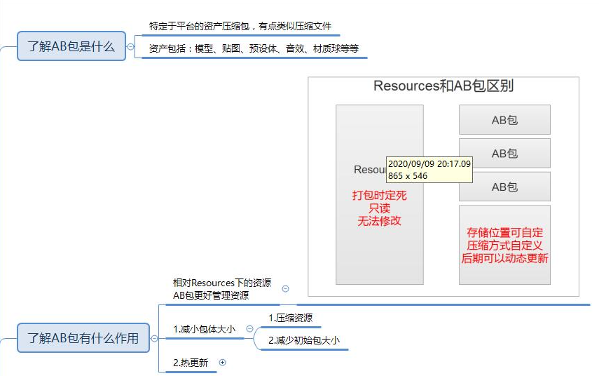
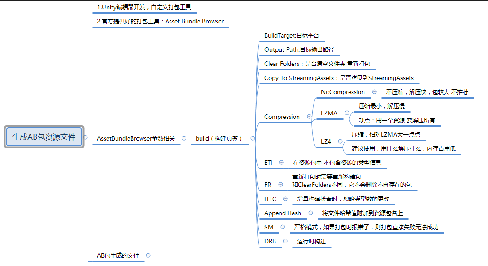
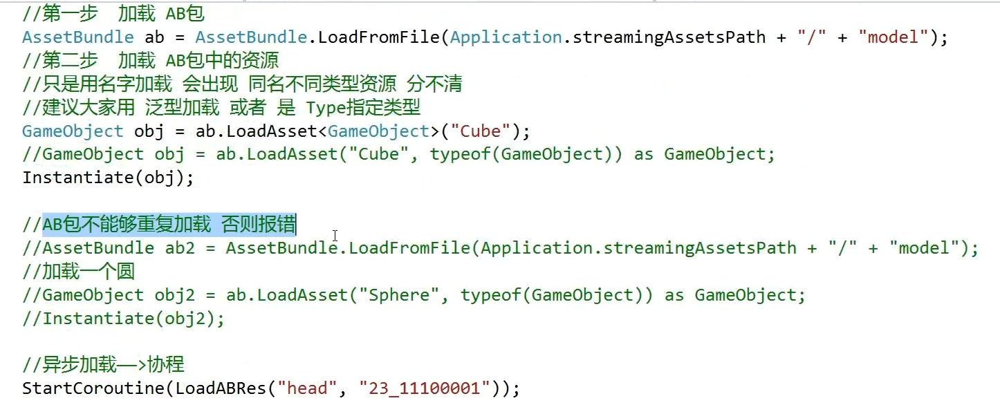
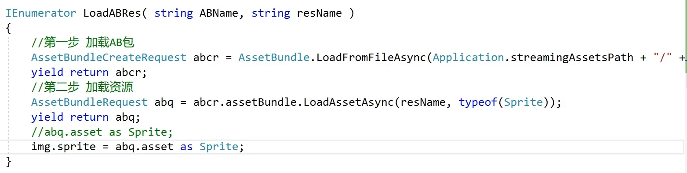

# AB包








```csharp
//AB包不能重复加载
//卸载所有AB包，包括场景上的资源
AssetBundle.UnloadAllAssetBundles(true);
//卸载所有AB包，不包括场景上的资源
AssetBundle.UnloadAllAssetBundles(false);
//单个卸载，布尔值同理
AB类名.Unload(true or false);

//关于AB包的依赖 
//一个资源身上用到了别的AB包中的资源 这个时候 如果只加载自己的AB包
//通过它创建对象，会出现资源丢失的情况
//这种时候 需要把依赖包 一起加载了 才能正常

//依赖包的关键知识点一利用主包 获取依赖信息
//加载主包
//加载主包中的固定文件
AssetBundleManifest abManifest = 主包名.LoadAsset<AssetBundleManifest>("AssetBundleManifest");
//从固定文件中 得到依赖的包名
string[] strs = abManifest.GetAllDependencies(包名);
for(int i = 0; i < strs.Length; i ++ )
{
    AssetBundle.LoadFromFile(Application.streamingAssetsPath + "/" + strs[i]);
}
```

* AB Manager
```csharp

using System.Collections;
using System.Collections.Generic;
using UnityEngine;
using UnityEngine.Events;

//知识点
//字典
//协程
//AB包相关API
//委托
//lambda表达式
//单例模式基类——>观看Unity小框架视频 进行学习
public class ABMgr : SingletonAutoMono<ABMgr>
{
    //主包
    private AssetBundle mainAB = null;
    //主包依赖获取配置文件
    private AssetBundleManifest manifest = null;

    //选择存储 AB包的容器
    //AB包不能够重复加载 否则会报错
    //字典知识 用来存储 AB包对象
    private Dictionary<string, AssetBundle> abDic = new Dictionary<string, AssetBundle>();

    /// <summary>
    /// 获取AB包加载路径
    /// </summary>
    private string PathUrl
    {
        get
        {
            return Application.streamingAssetsPath + "/";
        }
    }

    /// <summary>
    /// 主包名 根据平台不同 报名不同
    /// </summary>
    private string MainName
    {
        get
        {
#if UNITY_IOS
            return "IOS";
#elif UNITY_ANDROID
            return "Android";
#else
            return "PC";
#endif
        }
    }

    /// <summary>
    /// 加载主包 和 配置文件
    /// 因为加载所有包是 都得判断 通过它才能得到依赖信息
    /// 所以写一个方法
    /// </summary>
    private void LoadMainAB()
    {
        if( mainAB == null )
        {
            mainAB = AssetBundle.LoadFromFile( PathUrl + MainName);
            manifest = mainAB.LoadAsset<AssetBundleManifest>("AssetBundleManifest");
        }
    }

    /// <summary>
    /// 加载指定包的依赖包
    /// </summary>
    /// <param name="abName"></param>
    private void LoadDependencies(string abName)
    {
        //加载主包
        LoadMainAB();
        //获取依赖包
        string[] strs = manifest.GetAllDependencies(abName);
        for (int i = 0; i < strs.Length; i++)
        {
            if (!abDic.ContainsKey(strs[i]))
            {
                AssetBundle ab = AssetBundle.LoadFromFile(PathUrl + strs[i]);
                abDic.Add(strs[i], ab);
            }
        }
    }

    /// <summary>
    /// 泛型资源同步加载
    /// </summary>
    /// <typeparam name="T"></typeparam>
    /// <param name="abName"></param>
    /// <param name="resName"></param>
    /// <returns></returns>
    public T LoadRes<T>(string abName, string resName) where T:Object
    {
        //加载依赖包
        LoadDependencies(abName);
        //加载目标包
        if ( !abDic.ContainsKey(abName) )
        {
            AssetBundle ab = AssetBundle.LoadFromFile(PathUrl + abName);
            abDic.Add(abName, ab);
        }

        //得到加载出来的资源
        T obj = abDic[abName].LoadAsset<T>(resName);
        //如果是GameObject 因为GameObject 100%都是需要实例化的
        //所以我们直接实例化
        if (obj is GameObject)
            return Instantiate(obj);
        else
            return obj;
    }

    /// <summary>
    /// Type同步加载指定资源
    /// </summary>
    /// <param name="abName"></param>
    /// <param name="resName"></param>
    /// <param name="type"></param>
    /// <returns></returns>
    public Object LoadRes(string abName, string resName, System.Type type) 
    {
        //加载依赖包
        LoadDependencies(abName);
        //加载目标包
        if (!abDic.ContainsKey(abName))
        {
            AssetBundle ab = AssetBundle.LoadFromFile(PathUrl + abName);
            abDic.Add(abName, ab);
        }

        //得到加载出来的资源
        Object obj = abDic[abName].LoadAsset(resName, type);
        //如果是GameObject 因为GameObject 100%都是需要实例化的
        //所以我们直接实例化
        if (obj is GameObject)
            return Instantiate(obj);
        else
            return obj;
    }

    /// <summary>
    /// 名字 同步加载指定资源
    /// </summary>
    /// <param name="abName"></param>
    /// <param name="resName"></param>
    /// <returns></returns>
    public Object LoadRes(string abName, string resName)
    {
        //加载依赖包
        LoadDependencies(abName);
        //加载目标包
        if (!abDic.ContainsKey(abName))
        {
            AssetBundle ab = AssetBundle.LoadFromFile(PathUrl + abName);
            abDic.Add(abName, ab);
        }

        //得到加载出来的资源
        Object obj = abDic[abName].LoadAsset(resName);
        //如果是GameObject 因为GameObject 100%都是需要实例化的
        //所以我们直接实例化
        if (obj is GameObject)
            return Instantiate(obj);
        else
            return obj;
    }

    /// <summary>
    /// 泛型异步加载资源
    /// </summary>
    /// <typeparam name="T"></typeparam>
    /// <param name="abName"></param>
    /// <param name="resName"></param>
    /// <param name="callBack"></param>
    public void LoadResAsync<T>(string abName, string resName, UnityAction<T> callBack) where T:Object
    {
        StartCoroutine(ReallyLoadResAsync<T>(abName, resName, callBack));
    }
    //正儿八经的 协程函数
    private IEnumerator ReallyLoadResAsync<T>(string abName, string resName, UnityAction<T> callBack) where T : Object
    {
        //加载依赖包
        LoadDependencies(abName);
        //加载目标包
        if (!abDic.ContainsKey(abName))
        {
            AssetBundle ab = AssetBundle.LoadFromFile(PathUrl + abName);
            abDic.Add(abName, ab);
        }
        //异步加载包中资源
        AssetBundleRequest abq = abDic[abName].LoadAssetAsync<T>(resName);
        yield return abq;

        if (abq.asset is GameObject)
            callBack(Instantiate(abq.asset) as T);
        else
            callBack(abq.asset as T);
    }

    /// <summary>
    /// Type异步加载资源
    /// </summary>
    /// <param name="abName"></param>
    /// <param name="resName"></param>
    /// <param name="type"></param>
    /// <param name="callBack"></param>
    public void LoadResAsync(string abName, string resName, System.Type type, UnityAction<Object> callBack)
    {
        StartCoroutine(ReallyLoadResAsync(abName, resName, type, callBack));
    }

    private IEnumerator ReallyLoadResAsync(string abName, string resName, System.Type type, UnityAction<Object> callBack)
    {
        //加载依赖包
        LoadDependencies(abName);
        //加载目标包
        if (!abDic.ContainsKey(abName))
        {
            AssetBundle ab = AssetBundle.LoadFromFile(PathUrl + abName);
            abDic.Add(abName, ab);
        }
        //异步加载包中资源
        AssetBundleRequest abq = abDic[abName].LoadAssetAsync(resName, type);
        yield return abq;

        if (abq.asset is GameObject)
            callBack(Instantiate(abq.asset));
        else
            callBack(abq.asset);
    }

    /// <summary>
    /// 名字 异步加载 指定资源
    /// </summary>
    /// <param name="abName"></param>
    /// <param name="resName"></param>
    /// <param name="callBack"></param>
    public void LoadResAsync(string abName, string resName, UnityAction<Object> callBack)
    {
        StartCoroutine(ReallyLoadResAsync(abName, resName, callBack));
    }

    private IEnumerator ReallyLoadResAsync(string abName, string resName, UnityAction<Object> callBack)
    {
        //加载依赖包
        LoadDependencies(abName);
        //加载目标包
        if (!abDic.ContainsKey(abName))
        {
            AssetBundle ab = AssetBundle.LoadFromFile(PathUrl + abName);
            abDic.Add(abName, ab);
        }
        //异步加载包中资源
        AssetBundleRequest abq = abDic[abName].LoadAssetAsync(resName);
        yield return abq;

        if (abq.asset is GameObject)
            callBack(Instantiate(abq.asset));
        else
            callBack(abq.asset);
    }

    //卸载AB包的方法
    public void UnLoadAB(string name)
    {
        if( abDic.ContainsKey(name) )
        {
            abDic[name].Unload(false);
            abDic.Remove(name);
        }
    }

    //清空AB包的方法
    public void ClearAB()
    {
        AssetBundle.UnloadAllAssetBundles(false);
        abDic.Clear();
        //卸载主包
        mainAB = null;
    }
}

```