# C#核心
```
面向对象
三大特性：封装、继承、多态
七大原则：开闭、依赖倒转、里氏替换、单一职责、接口隔离、合成复用、迪米特
```

# 封装

## 类的语法
```c#
class 类名
{
    特征-成员变量
    行为-成员方法
    保护特征-成员属性

    构造函数析构函数
    索引器
    运算符重载
    静态成员
}

类名 变量名;
类名 变量名 = null;
类名 变量名 = new 类名();
```
## 访问修饰符
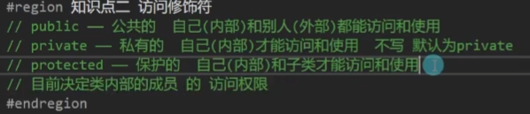

## this妙用
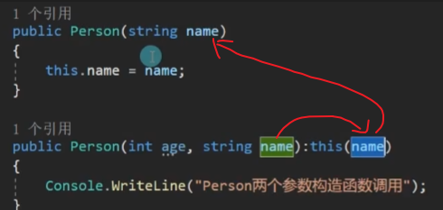
```
后面加 :this(本函数参数名) 先调用后面的构造函数，再执行本构造函数
```

## 成员属性
```c#
//用于保护成员变量
//可以进行加密处理


语法：
访问修饰符 属性类型 属性名
{
    /*
        get、set 前的访问修饰符：
        1.默认不加则使用属性申明时的权限
        2.加的访问修饰符要低于属性的访问权限
        3.不能让get、set都低于属性的权限
        
        可以用修饰符于实现只能获取不能修改，只能修改不能获取
        也可以直接不写其中一个
    */
    (访问修饰符) get{}
    (访问修饰符) set{}
}


class Person
{
    private string name;

    pubilc string Name
    {
        get
        {
            //可以进行加密处理
            return name;
        }
        set
        {
            //可以进行加密处理
            //value 关键字用于表示 外部传入的值
            name = value;
        }
    }
}

Person p = new Person();
p.Name = "xxx";

//自动属性
外部能得不能改的特征
public float Height
{
    get;
    private set;
}

```

## 垃圾回收机制 GC（Garbage Collector）
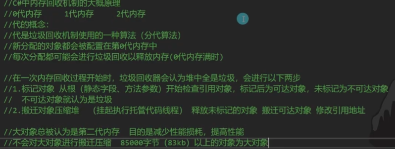
```c#
算法：
引用计数(Reference Counting)
标记清除(Mark Sweep)
标记整理(Mark Compact)
复制集合(Copy Collection)

手动使用：
//一般不频繁调用，在loading时使用
GC.Collect();
```

## 索引器
```c#
让对象可以像数组一样通过索引来访问内部元素
语法:
访问修饰符 返回类型 this[参数类型 参数名,....]
{
    get{}
    set{}
}

class Person
{
    private string name;
    private int age;
    private Person[] friends;

    public Person this[int index]
    {
        get
        {
            //可以写逻辑
            return friends[index];
        }
        set
        {
            //可以写逻辑
            friends[index] = value;
        }
    }
}

Person p = new Person();
p[0] = new Person();

//索引器可以重载（参数类型，数量，顺序不同）

```

## 静态关键字 static
```c#
//可以加在变量、函数、属性等前
//特点：直接用 类名.xxx 使用，存储在堆上，生命周期：在程序结束后才释放，具有唯一性

注意：
1.静态函数中不能使用非静态成员
2.非静态函数可以使用静态成员

作用：
//静态变量：
1.常用唯一变量的申明
2.方便别人获取的对象申明
//静态方法
常用的唯一的方法申明 （如相同规则的数学函数）

常量和静态变量：
//相同点：
都可以通过 类名.xxx 使用
//不同点：
1.const必须初始化，不能修改
2.const只能修饰变量，static可以修饰很多
3.const一定要写在访问修饰符后面，static没有这个要求
```
### 作业
```c#
//一个类对象在整个程序生命周期中，有且只有一个该对象存在，不能在外部实例化，直接通过类名即可得到该对象
class Test
{
    //只有一个
    private static Test t = new Test();
    public int x = 10;
    //防止被修改
    public static Test T
    {
        get
        {
            return t;
        }
    }

    //不能在外部实例化
    private Test(){}
}

Test.T.x //10
```
## 静态类
```c#
特点：只能包含静态成员，不能被实例化

作用：
1.将常用的静态成员写在静态类中，方便使用
2.静态类不能被实例化，更能体现作为工具的唯一性
//console就是一个静态类
```

## 静态构造函数
```c#
特点：
1.静态类和普通类都可以有
2.不能使用访问修饰符
3.不能有参数
4.只在第一次使用时自动调用一次
5.可以和普通构造函数重名，但不算重载
作用：
初始化静态变量
```

## 拓展方法
```c#
概念：
    为现有非静态变量类型添加新方法（所以不能给静态类添加）

作用：
    1.提升程序拓展性
    2.不需要再对象中重新写方法
    3.不需要继承来添加方法
    4.为别人封装的类型写额外的方法
特点：
    1.一定写在静态类中
    2.一定是个静态函数
    3.第一个参数为拓展目标
    4.第一个参数用this修饰

语法：

访问修饰符 static 返回类型 函数名(this 拓展类名 参数名, 参数类型1 参数名1, ...)

例：

static class Tools
{
    //为普通类型拓展方法
    public static void ShowValue(this int value, int x)
    {
        Console.Write(value + x);
    }

    //为自定义类型拓展方法
    //如果拓展方法名与已有方法重名，则使用已有方法
    public static void TestNewFun1(this Test t)
    {
        Console.Write("newfun");
    }
}

int i = 10;
i.ShowValue(1); //输出11

Test t = new Test();
t.TestNewFun1();
```

## 运算符重载
```c#
特点：
1.一定是一个public static 方法
2.返回值写在operator前
3.逻辑处理自定义

语法：
public static 返回类型 operator 运算符(参数列表)

作用：
让自定义类和结构体对象进行运算符运算

tips：
1.条件运算符需要成对实现
2.一个符号可以多个重载
3.不能使用ref、out

例:
class Point
{
    public int x,y;

    public Point(int x, int y)
    {
        this.x = x;
        this.y = y;
    }

    public static Point operator +(Point p1,Point p2)
    {
        return new Point(p1.x + p2.x, p1.y + p2.y);
    }
}

Point a = new Point(1,2),b = new Point(2,1);
Point c = a + b;
Console.Write("{0},{1}",c.x,c.y);
```

## 内部类、分部类(不常用？)
```c#
//内部类
概念：类中申明的类
作用：亲密关系的表现
需要注意访问修饰符

使用：
class person
{
    public name;
    public class Body
    {
        public weight;
        private class Arm
        {
            public length;
        }
    }
}
Person p = new Person();
Person.Body = new Person.Body();

//分部类
概念：把一个类分成几部分申明
关键字 partial

作用：
1.分部描述一个类
2.增加程序拓展性

tips：
1.可以写在多个脚本文件中
2.访问修饰符要一致
3.不能有重复成员

例：
partial class Student
{
    public bool sex;
}

partial class Student
{
    public string name;
}

Student stu = new Student();
stu.sex;
stu.name;

//分部方法
概念：将方法的申明和实现分离
特点：
1.不能加访问修饰符，默认私有
2.只能在分部类中申明
3.返回值只能是void
4.可以有参数但不能用out关键字

```
### 分部方法例
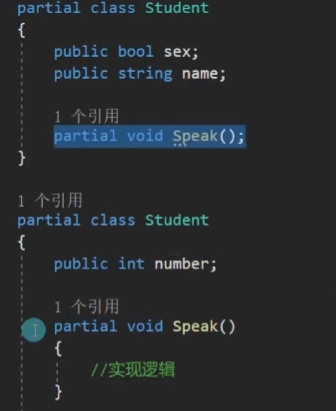

# 继承

## 继承的基本规则
```c#
概念：
类Son继承类Father
类Son将会继承类Father的所有成员，拥有其所有特征和行为

被继承类称为父类、基类、超类
继承类称为子类、派生类

性质：
1.单根性： 子类只能有一个父类
2.传递性： 子类可以间接继承父类的父类

语法:
class 类名 : 被继承类名
{

}

访问修饰符的影响：
public
protected
private
internal 内部的 只有在同一个程序集的文件中，内部类型或者是成员才可以访问

子类和父类的同名成员
1. csharp允许存在，子类成员覆盖父类成员
2. 不建议使用

```

## 里氏替换原则
```c#
概念：
任何父类出现的地方，子类都可以替代
重点：
父类容器装载子类对象，因为子类对象包含父类的所有内容
作用：
方便进行对象存储和管理

例：
class GameObject
{

}

class Player : GameObject
{
    public void PlayerAtk()
    {
        //逻辑
    }
}

class Boss : GameObject
{
    public void BossAtk()
    {
        //逻辑
    }
}

//父类容器装载子类对象
GameObject player = new Player();
GameObject[] objects = new GameObject[]{new Player(),new Boss()};
```
#### is和as
```c#
概念：
is：判断一个对象是否是指定类对象
返回 bool

as：将一个对象转换为指定类对象
返回 指定对象类型，失败返回null

语法：
类对象 is 类名
类对象 as 类型
```
```c#
//当想使用装载在父类容器中的子类对象的特征时
if(player is Player) (player as Player).PlayerAtk();

```

## 继承中的构造函数
```c#
申明一个子类对象时
 先执行父类构造函数
  再执行子类构造函数
    类似一棵树，从树的根开始按顺序执行
子类可以通过base关键字调用父类构造

tips：
    子类实例化默认调用的是父类的无参构造，如果父类无参构造被顶掉会报错

//通过base调用指定父类构造
class Father
{
    public Father(){}
    public Father(int x){}
}

class Son : Father
{
    //调用父类的Father(int x)而不是无参构造
    public Son(int i) : base(i){}

    //通过Son(int i)间接调用父类构造
    public Son(int i, string s) : this(i) {}
}
```

## object
```c#
object是所有类型的基类(引用类型)
作用：
1.使用里氏替换原则用object容器装所有对象
2.可以用来表示不确定类型，作为函数参数类型

object o1 = 1f;

//转值类型用强转
float f1 = (float)o1;

//转引用类型用as
object str = "12";
string str1 = str as string;

object arr = new int[10];
int[] ar = arr as int[];
```

## 装箱拆箱
```c#
发生条件：
装箱：用object存值类型
拆箱：把object转回值类型

//装箱
把值类型用引用类型存储，栈内存迁移到堆内存

//拆箱
把引用类型存储的值去除，堆内存迁移到栈内存

好处：不确定类型时可以方便参数的存储和传递
坏处：存在内存迁移，降低性能

//方便传入
static void TestFun(params object[] array)
{
    //使用时用is as判断
}
```

## 密封类 sealed
```c#
使用sealed关键字修饰的类

作用：让类无法再被继承

sealed class Father
{

}

作用：
不允许最底层子类被继承
保证程序的规范性和安全性、 结构性
```
# 多态

概念：让继承同一父类的子类在执行相同方法时有不同的表现
```c#
问题：
class Father
{
    public show()
    {
        //父类方法
    }
}

class Son : Father
{
    public new void Show()
    {
        //子类方法
    }
}
Father f = new Son();
f.Show();//父类方法
(f as Son).Show();//子类方法
将子类装载在父类中想使用子类的方法但是使用的是父类方法，所以需要多态

//已经学过的多态
编译时多态：函数重载

//将要学习的
运行时多态：vob 抽象函数 接口
```
## 多态vob（tls自编名词）
```c#
v：virtual 虚函数
o：override 重写
v：base 父类

class GameObject
{
    public string name;

    public GameObject(string name)
    {
        this.name = name;
    }

    //virtual 虚函数
    public virtual void Atk()
    {
        游戏对象攻击
    }
}

class Player:GameObject
{
    public Player(string name):base(name){}
    //override 重写
    public override void Atk()
    {
        //base 代表父类 通过其保留父类的行为
        base.Atk();

        玩家攻击
    }
}
```

## 抽象类和抽象方法
```c#
//抽象类
概念：被抽象关键字abstract修饰的类
特点：
1.不能被实例化
2.可以包含抽象方法
3.继承抽象类必须重写其抽象方法

//抽象方法（纯虚方法）
用abstract修饰的方法
特点：
1.只能在抽象类中申明
2.没有方法体
3.不能是私有
4.继承后必须实现，用override重写

abstract class Thing
{
    //可以像普通类那样写
    public string name;

    //可以写抽象函数
    public abstract void Show();
}

class Fruit:Thing
{
    public override void Show()
    {
        //实现
    }
}

//abstract 和 vitural 区别：
虚方法：
1.可以写内容
2.可以由子类选择性实现
抽象方法
1.不可以写内容
2.必须被子类实现
3.只能写在抽象类中

共同点：都可以被子类无限重写
```

## 接口 interface
```c#
概念：行为的抽象规范，也是一种自定义类型
//理解：抽象行为的“基类”（飞机和鸟都会飞）
申明规范：
1.不包含成员变量
2.只包含方法、属性、索引器、事件
3.成员不能被实现
4.成员可以不用写访问修饰符，不能是私有的
5.接口不能继承类，但是可以继承另一个接口

使用规范：
1.类可以继承多个接口
2.类继承接口后，必须实现接口中所有成员

特点：
1.它和类的申明类似
2.接口是用来继承的
3.接口不能被实例化，但是可以作为容器存储对象
```
### 接口的申明
```c#
interface 接口名
{

}

例：
//通常在开头加个I作为命名规范
interface IFly
{
    void Fly();

    string Name
    {
        get;
        set;
    }

    int this[int id]
    {
        get;
        set;
    }

    event Action doSomthing;
}
```

### 接口的使用
```c#
1.类可以继承1个类和n个接口
2.继承了接口后，必须实现其中内容，必须是public
3.实现的接口函数可以加virtual变成虚函数再在子类中重写
4.接口也遵循里氏替换原则
5.接口可以继承接口，相当于行为合并
class Animal
{

}

class Person : Animal, IFly
{
    public virtual void Fly() { }

    public string Name
    {
        get { return "1"; }
        set { }
    }

    public int this[int id]
    {
        get { return 0; }
        set { }
    }

    public event Action doSomthing;
}

```

### 显式实现接口
```c#
当一个类继承2个接口，但接口中存在同名方法时使用
tips：显式实现时不能写访问修饰符

interface IAtk
{
    void Atk();
}
interface ISuperAtk
{
    void Atk();
}

class Player : IAtk, ISuperAtk
{
    //接口名.方法名
    void IAtk.Atk()
    {

    }
    void ISuperAtk.Atk()
    {

    }
}

这样实现的接口方法只能用as转为父类再使用

可以用接口装载无关系但有相同行为的对象
```
## 密封方法
```c#
用密封关键字sealed修饰的重写函数
作用：让虚方法或者抽象方法之后不能再被重写
特点：和override一起出现
``` 

# 额外知识点

## 命名空间
```c#
概念：用来组织和重用代码
作用：像工具包，类就是工具

语法:
namespace 命名空间名
{
    class xx1{}
    class xx2{}
    ...
}

//在不同命名空间中使用别的命名空间
using 命名空间名; //在本文件中可随意使用
命名空间名.类名 

tips:
1.命名空间可以分开写
2.不同命名空间可以有同名类，但要注意用 . 区分
3.命名空间内可以包裹命名空间
    namespace MyGame
    {
        namespace UI
        {

        }
    }
    //想要在其他文件使用ui的类
    using MyGame.UI
4.类前的修饰关键字
public  都能用
internal 只能在该程序集中使用，默认
abstract 抽象类
sealed 密封类
partial 分部类
```

## object方法
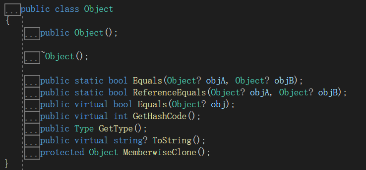
```c#
静态方法:
Equals(Object A,Object B) //值类型判断值，引用类型判断地址，按左侧对象Equals方法规则
ReferenceEquals(Object A,Object B) //值类型比较全返回false，用来比较引用类型

成员方法：
GetType() //获取对象运行时的Type
MemberwiseClone() //获取对象的一个新浅拷贝对象，即引用成员变量与原对象一致

虚方法：
Equals:
//默认实现相当于ReferenceEquals，所有值类型的基类System.ValueType中被重写用于比较值相等，可重写
GetHashCode
//获取对象的哈希码，可重写
ToString
//返回字符串，可重写
```

## String重要方法
```c#
String s="ABC";

s[0] //获取指定位置字符

s.ToCharArray() //返回char数组

s = string.Format("{0} 12 {1}",A,D); //字符串拼接

s.IndexOf("xxx") //正向查找字符(串)位置,未找到返回-1

s.LastIndexOf("xxx") //反向查找字符(串)位置,未找到返回-1

s.Remove( 指定位置(,长度) ) //移除指定位置开始的几个字符，返回字符串,越界会报错

s.Replace("old chars","new chars") //替换后返回字符串

s.ToUpper() //返回大写字母的字符串
s.ToLower() //返回小写字母的字符串

s.substring( 指定位置(,长度) )  //字符串截取，返回字符串，越界会报错

//字符串切割
s = "1,2,3,4,5";
string[] strs = str.Split(','); //{"1","2","3","4","5"} 
```

## StringBuilder
```c#
用于处理字符串的公共类，优化内存
需要引用命名空间System.Text

StringBuilder str = new StringBuilder("123213");
Console.Write(str);

//容量
每次往里面增加会自动扩容，类vector实现原理

str.Capacity //容量大小

str.Length //长度

str.Append("A"); //123213A

str.AppendFormat("{0}","V"); //123213AV

str.Insert(下标,"xxx"); //xxx123213AV

str.Remove(下标，长度)

str.clear()

str[0] // x

str[0] = 'a' //axx123213AV

str.Replace("oldchars","newchars");

str.Equals("xxx")

```

## 结构体和类的区别
```
1.结构体是值类型，类是引用类型
2.结构体存储在栈上，类存储在堆上
3.结构体具有封装特性，但没有继承和多态特性，所以不能用protected修饰
4.结构体成员变量不能赋初始值
5.结构体不能声明无参构造
6.结构体申明有参构造不会顶掉无参构造
7.结构体不能声明析构函数
8.结构体在构造函数必须初始化所有成员变量
9.结构体不能被static修饰
10.结构体不能在自己内部申明和自己一样的结构体变量

特殊：结构体可以继承 接口

选择问题：
1.想用继承和多态使用类
2.对象数据集合优先用结构体
3.从值类型和引用类型考虑，经常传值进函数，但不想改变原对象则用结构体

```

## 抽象类和接口的区别
```
相同
1.都可以被继承
2.都不能被实例化
3.都包含方法申明
4.子类必须实现未实现的方法
5.都遵循里氏替换原则
不同
1.抽象类可以有构造函数
2.抽象类只能单一继承，接口可以被继承多个
3.抽象类可以有成员变量
4.抽象类可以申明成员方法，虚方法，抽象方法，静态方法，接口只能申明没有实现的方法
5.抽象类方法可以使用访问修饰符，接口不建议写，默认public

```

## 多脚本文件
```c#
解决方案名.sln //解决方案主入口
工程名1 （文件夹）
工程名2 （文件夹）


//工程文件夹中
bin 文件夹 //bin中debug内的文件夹可以直接执行
obj 文件夹
脚本名.cs //脚本文件


接口 类 结构体 一个申明 对应一个脚本

```

## UML类图
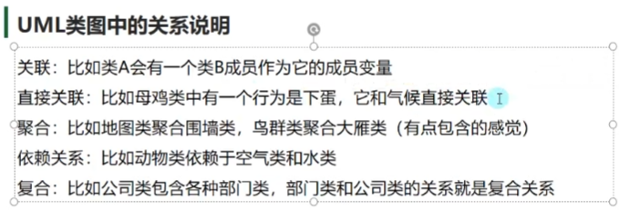

## 面向对象七大原则
```c#
目标：高内聚，低耦合
//从类的角度看：减少对其他类的调用
//从功能块来看：减少模块之间的交互复杂度
```
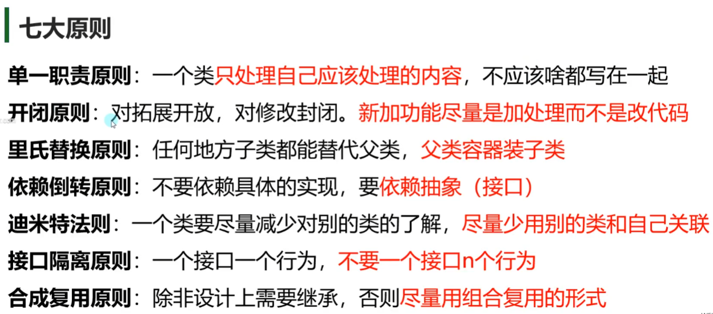
### 1.单一职责原则
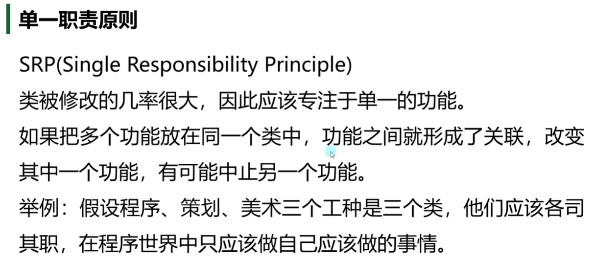
### 2.开闭原则
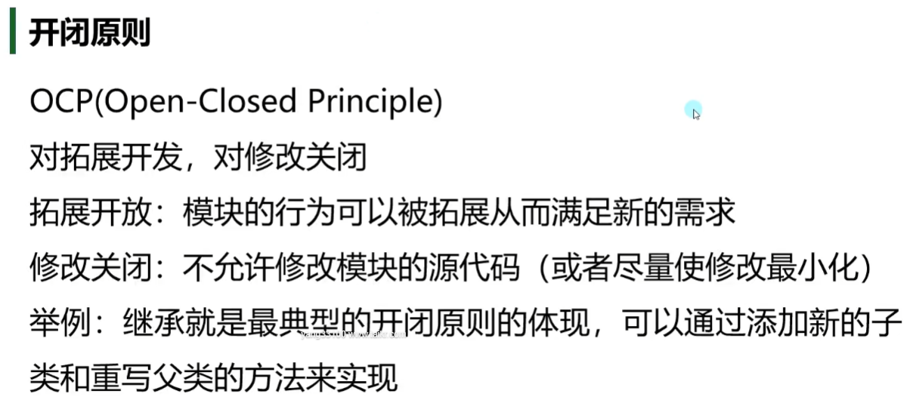
### 3.里氏替换原则
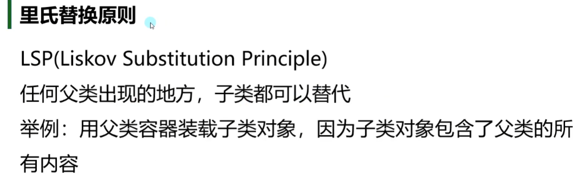
### 4.依赖倒转原则
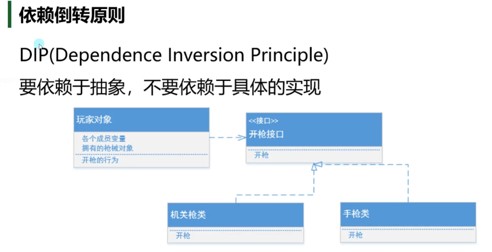
### 5.接口隔离原则
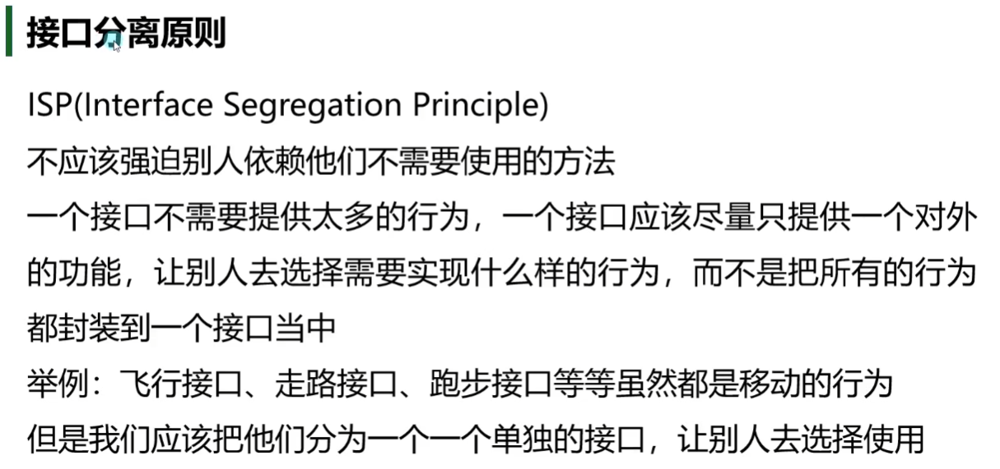
### 6.合成复用原则
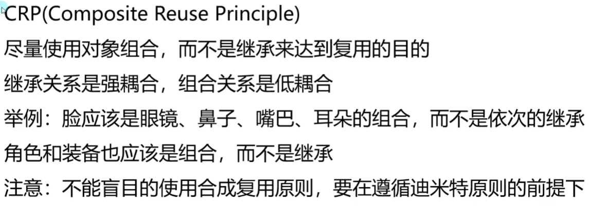
### 7.迪米特原则


## 实践
```
Console.KeyAvailable
检测输入
```