# 数据结构

## ArrayList
```c#
本质是一个object类型的数组类

using System.Collections

//申明
ArrayList array = new ArrayList(capacity容量大小);

array.Count //长度
array.capacity //容量

//增加
array.Add(任意类型)
array.AddRange(ArrayList类型)

//插入指定位置
array.Insert(index,元素值)

//删除从左到右第一个匹配的元素
array.Remove(元素值)

//移出指定位置元素
array.RemoveAt(index)

//清空
array.Clear()

//判断是否存在该值
array.Contains(元素值)

//正向查找返回index 找不到返回-1
array.IndexOf(元素值)

//反向查找返回index 找不到返回-1
array.LastIndexOf(元素值);

//使用指定的比较器在已排序 ArrayList 的某个元素范围中搜索元素，并返回该元素从零开始的索引。 L,R范围和cmp可选
array.BinarySearch(Int32, Int32, Object, IComparer)

//L R cmp可选  快排 平均O nlogn
array.Sort(Int32, Int32, IComparer)

//遍历
for(int i = 0; i < array.Count; i ++)

foreach (object item in array)

//装箱拆箱
值类型存储会装箱，取出值类型会拆箱
```
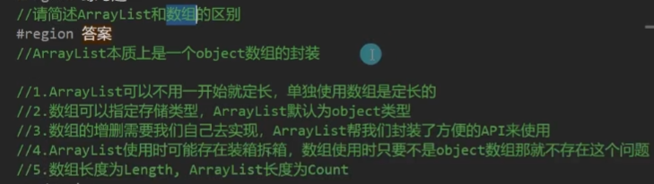

## Stack
```c#
命名空间 System.Collections
object类型数组

Stack stk = new Stack();

stk.Push(值);

//返回出栈值
stk.Pop();

//栈顶元素
stk.Peek()

//是否存在该值
stk.Contains(元素值)

stk.Clear()

stk.Count() //长度

//从栈顶到底
foreach (object it in stk)
{}

//强转成object数组 也是从顶到底的顺序
object[] arr = stack.ToArray();
for(int i = 0; i < arr.Length; i ++)

while( stack.Count > 0)
{
    object o = stack.Pop();
    //使用o
}

存在装箱拆箱
```

## Queue
```c#
Queue q = new Queue();

q.Enqueue(元素)

//返回取出的队头元素
q.Dequeue()

//队头元素
q.Peek()

q.Contains(元素)

q.Clear()

装箱拆箱
```

## HashTable
```c#
Hashtable hash = new Hashtable()

hash.Add(key , value);

hash.Remove(key)

hash.Clear()

//返回value 找不到返回null
hash[key]

hash.Contains(key)
hash.ContainsKey(key)
hash.ContainsValue(value)

//修改
hash[xx] = 3;

//对数
hash.Count()

//遍历键
foreach (object it in hash.Keys)
//遍历值
foreach (object it in hash.Values)

//遍历key value 对
foreach (DictionaryEntry it in hash)
{
    it.Key
    it.Value
}

//迭代器
IDictionaryEnumerator myEnumerator = hash.GetEnumerator();
bool flag = myEnumerator.MoveNext();
while(flag)
{
    myEnumerator.Key
    myEnumerator.Value
    flag = myEnumerator.MoveNext();
}

//装箱拆箱
```

# 泛型
## 泛型知识点
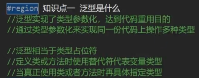
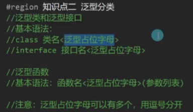
```c#
class Test<T>
{
    public T value;
}
class Test2<T,P>
{
    public T value1;
    public P value1;
}

Test<int> t = new Test<int>();
Test2<int,string> t2 = new Test2<int,string>();
```
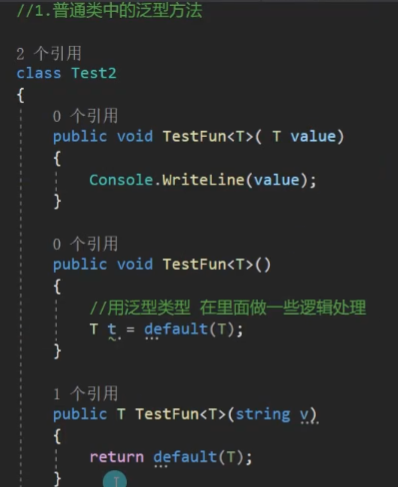
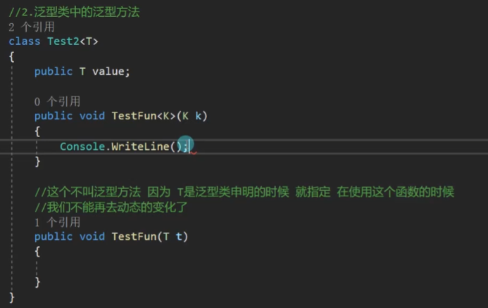

```c#
作用：
1.不同类型对象的相同逻辑处理可以选择泛型
2.使用泛型可以一定程度避免装箱拆箱
```

## 泛型约束
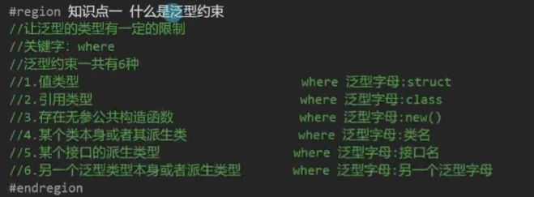
```c#
//例
class Test1<T> where T:struct
{
    public T value;
    public void TestFun<K>() where K:struct
    {

    }
}

//可以组合约束

//多个泛型有约束
class Test<T, K> where T:class,new() where K:struct
{

}

//用泛型实现一个单例模式基类(有缺点：可以new)
class SingleInstanceBase<T> where T : new()
{
    private static T instance = new T();

    public static T Instance
    { get {  return instance; } }
}
```
# 泛型数据结构
## List
```c#
本质：可变类型的泛型数组
using System.Collections.Generic

List<int> list1 = new List<int>();
List<int> list2 = new List<int>();
List<string> list3 = new List<string>();

list1.Add(3);
list2.Add(1);
list1.AddRange(list2);
list1.Insert(1,2);
list1.Remove(3);
list2.RemoveAt(0);
list1.Clear();

list[index] = xxx;

list.Contains(元素)

list.IndexOf(index)
list.LastIndexOf(index)

list.Reverse()

list.Count
list.Capacity

for(int i = 0; i < list.Count; i ++ )
{
    //list[i]
}

foreach (int it in list)
{
    //it
}
```

## Dictionary 类c++的map
```c#
using System.Collections.Generic

Dictionary<int,int> dic = new Dictionary<int,int>();

dic.Add(1,2);
dic[1] = 5;
dic.Remove(key)
dic.Clear();
//后略 参照HashTable

foreach (KeyValuePair<int,int> it in dic)
{
    it.Key
    it.Value
}
```

## LinkedList
```c#
可变类型的泛型双向链表

LinkedList<int> linkedList = new LinkedList<int>();


AddLast(元素)
AddFirst(元素)

//适合和Find共用
AddAfter(LinkedListNode,元素值) //插入在LinkedListNode类型值的后面
AddBefore(LinkedListNode,元素值)

RemoveFirst()
RemoveLast()
Remove(元素)
Clear()

//返回头结点 尾结点同
LinkedListNode<int> first = linkedList.First;

//返回节点LinkedListNode
Find(元素)

Contains(元素)

LinkedListNode.value = xxx;

//遍历
foreach (int it in linkedList)
{
    //it为值
}

LinkedListNode<int> p = linkedList.First;
while(p != null)
{
    //p.value
    p = p.Next; 
}

LinkedListNode<int> p = linkedList.Last;
while(p != null)
{
    //p.value
    p = p.Previous; 
}

```

## Stack<> Queue<>
```
泛型栈 泛型队列
```

# 委托和事件
## 委托 delegate
```c#
//概念
委托是 函数(方法) 的容器
可以理解为表示 函数(方法) 的变量类型
用来存储、传递 函数(方法)
委托的本质是一个类，用来定义 函数(方法) 的类型(返回值和参数的类型)
不同的 函数(方法) 必须对应和各自"格式"一致的委托
//委托支持泛型

关键字：delegate
语法：
//访问修饰符不写默认为public（可以在别的命名空间访问）
//同一语句块中委托名不能重名
访问修饰符 delegate 返回值 委托名(参数列表);

可以申明在namespace和class中


//定义和使用自定义委托
//无参无返回值
delegate void MyFun();//申明了一个可以用来存储无参无返回值函数的容器
static void Fun(){}
//f装载了Fun函数
MyFun f = new Myfun(Fun); //相同写法:MyFun f = Fun;
f.Invoke(); // 调用执行
f() // 执行第二种写法

//有参有返回值
delegate int F(int x);
static int Fun1(int x){}
F f1 = Fun1; //F f1 = new F(Fun1)
f1(1); // f1.Invoke(1)

委托变量是函数的容器
委托常用在：
1.作为类的成员
2.作为函数的参数

class Test
{
    public MyFun myFun;

    public Test(MyFun f1,MyFun f2)
    {
        this.myFun = f1;
        f2();
    }
}

//用委托存储多个函数 多播委托
MyFun f = null;
f += Fun;
f += Fun;
f(); //执行两次Fun()
f -= Fun; //多减不会报错，不处理
f(); //执行1次

//系统定义好的委托 Action无返回值，Func有返回值
//无参      无返回值
System.Action act = Fun;
act += Fun;
act();

//可以传多个参数的(最多支持16个) 无返回值
System.Action<参数类型1,参数类型2，...，参数类型16> act;

//无参    有泛型返回值
System.Func<返回值类型> fc = MyFunReturnString;

//可以传多个参数的(最多支持16个) 有泛型返回值的
System.Func<参数类型1,...,参数类型16，返回类型> fc;

```

## 事件 event
```c#
//概念
事件是基于委托的存在
事件是委托的安全包裹
让委托的使用更具有安全性
事件是一种特殊的变量类型

//申明语法:
访问修饰符 event 委托类型 事件名;

//事件的使用:
1.事件是作为成员变量存在于类中
2.委托怎么用 事件就怎么用

//事件相对于委托的区别:
1.不能在类外部赋值,但可以加减
2.不能在类外部调用

//注意:
它只能作为成员存在于类和接口以及结构体中

class Test
{
    public Action myDelegate;
    public event Action myEvent;
}

//作用：
1.防止外部随意置空委托
2.防止外部随意调用委托
3.事件相当于对委托进行了一次封装让其更加安全
```

## 匿名函数
```c#
顾名思义，就是没有名字的函数
匿名函数的使用主要是配合委托和事件进行使用
脱离委托和事件是不会使用匿名函数的

delegate (参数列表)
{
    //函数逻辑
};

//何时使用?
1.函数中传递委托参数时
2.委托或事件赋值时

例:
//无参无返回
Action act = delegate ()
{
    Console.Write("Hello");
};

act();

//有参
Action<int,string> act = delegate (int x,string s)
{
    console.WriteLine(x,s);
};
act(100,"123");

//有返回值
Func<int> fc = delegate ()
{
    return 100;
}
fc();

//一般情况会作为函数参数传递 或者 作为函数返回值
class Test
{
    public Action action;
    public void DoSomething(int a, Action fun)
    {
        Console.WriteLine(a);
        fun();
    }

    public Action GetFun()
    {
        return delegate (){Console.Write("Hello");};
    }
}

Test t = new Test();
//作为参数
t.DoSomething(100, delegate (){Console.Write("hello");} );
//作为返回值
Action ac = t.GetFun();

//缺陷
添加到委托或事件容器中 不记录，因为没有名字无法单独移除，只能clear
```


## lambda表达式
```c#
可以将lambad表达式理解为匿名函数的简写
它除了写法不同外
使用上和匿名函数一模一样
都是和委托或者事件配合使用的

语法：
(参数列表) => {函数体};

//无参无返回
Action act = () =>
{
    Console.Write("无参无返回值逻辑");
};

//有参
Action<int> act = (int val) =>
{
    Console.Write("无返回值逻辑" + val);
};

//甚至参数类型都可以省略参数类型和委托或事件容器一致
Action<int> act = (val) =>
{
    Console.Write("无返回值逻辑" + val);
};

//有返回值
Func<string,int> fc = (val) =>
{
    console.Write("val");
    return "12";
}

缺点同匿名函数
```
## 闭包
```c#
内层的函数可以引用包含在它外层的函数的变量即使外层函数的执行已经终止
注意:
该变量提供的值并非变量创建时的值，而是在父函数范围内的最终值。
```
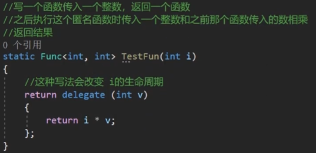

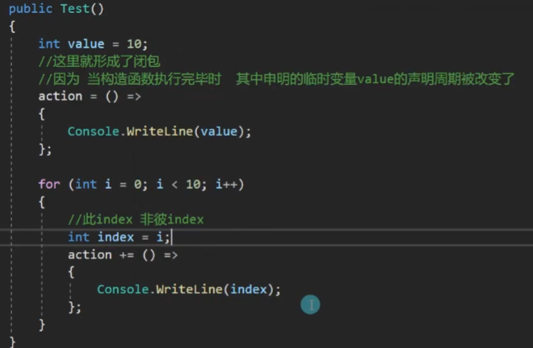

## 补充知识
```
当用有返回值的委托容器存储多个函数时,调用时调用只会给最后执行的返回值
委托容器中存在方法GetInvocationList()可以返回一个委托数组
```
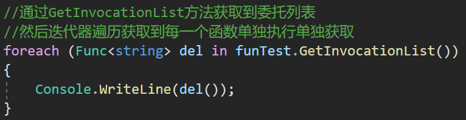

# List排序
```c#
List<int> list = new List<int>();
list.Add(3);
list.Add(2);
list.Add(1);

//List自带排序
list.Sort(); //ArryList也有

//通过重写接口方法自定义排序
class Item : IComparable<Item>
{
    public int money;
    public Item(int money)
    {
        this.money = money;
    }

    public int CompareTo(Item other)
    {
        // <0 放在传入对象的前面
        // =0 不变
        // >0 放在传入对象的后面
        return this.money - other.money;//升序
        return -this.money + other.money;//降序
    }
}
List<Item> items = new List<Item>();
list.Add(new Item(45));
list.Add(new Item(12));
list.Add(new Item(23));

//通过自定义函数排序
static int Cmp(Item x, Item y)
{
    // <0 放在传入对象的前面
    // =0 不变
    // >0 放在传入对象的后面
    return x.money - y.money;//升序
    return -x.money + y.money;//降序
}

List<Item> items = new List<Item>();
list.Add(new Item(45));
list.Add(new Item(12));
list.Add(new Item(23));
list.Sort(Cmp);

//通过委托/lambda函数排序
list.Sort((Item x, Item y)=>
{
    // <0 放在传入对象的前面
    // =0 不变
    // >0 放在传入对象的后面
    return x.money - y.money;//升序
    return -x.money + y.money;//降序
});
```
# 协变逆变
```c#
协变和逆变是用来修饰泛型的，只有泛型接口和泛型委托能使用
//协变:父类泛型委托装子类泛型委托
out T，限制接口、委托泛型只能作返回值
//逆变:子类泛型委托装父类泛型委托
in T，限制接口、委托泛型只能作参数

使用：
//用out修饰的泛型只能作返回值，in修饰的只能作参数
delegate T Test<out T, in P> (P val);
interface ITest<out T, in P>
{
    T show(P x)
    {
        return T类型;
    }
}
```
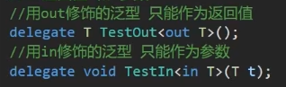
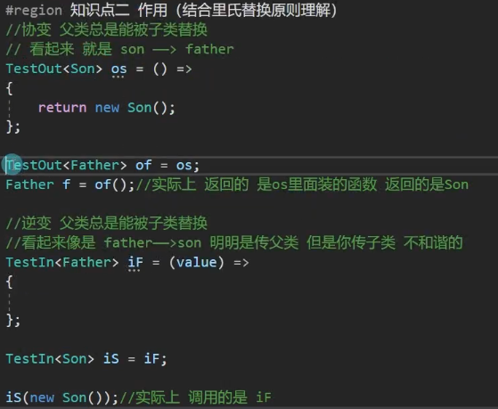

# 多线程
```c#
//进程(Process)
是计算机中的程序关于某数据集合上的一次运行活动
是系统进行资源分配和调度的基本单位，是操作系统结构的基础
说人话:打开应用程序就是在操作系统上开启了一个进程
进程之间可以相互独立运行，互不干扰
进程之间也可以相互访问、操作

//线程
操作系统能够进行运算调度的最小单位。
被包含在进程之中，是进程中的实际运作单位
一条线程指的是进程中一个单一顺序的控制流，一个进程中可以并发多个线程
我们目前写的程序都在主线程中
简单理解线程:
就是代码从上到下运行的一条“管道”

//线程类 Thread
需要引用命名空间using System.Threading;

// 声明一个新的线程
注意线程执行的代码需要封装到一个函数中
Thread t = new Thread(函数);

// 启动线程
t.Start();

// 设置为后台线程
当前台线程都结束了的时候,整个程序也就结束了,即使还有后台线程正在运行
后台线程不会防止应用程序的进程被终止掉
如果不设置为后台线程可能导致进程无法正常关闭
t.IsBackgroud = true;

// 关闭释放一个线程
如果开启的线程中不是死循环是能够结束的逻辑那么不用刻意的去关闭它
如果是死循环想要中止这个线程有两种方式
//1-死循环中bool标识为全局静态变量，可以控制循环

//2-通过线程提供的方法(注意在.Net core版本中无法中止会报错)
t.Abort();
t = null;

// 线程休眠xx毫秒
Thread.Sleep(1000);

// 共享问题
多个线程使用的内存是共享的，都属于该应用程序(进程)
所以要注意当多线程同时操作同一片内存区域时可能会出问题
可以通过加锁的形式避免问题

// 锁
lock(引用类型对象)
{
    //逻辑
}

//处理一些复杂耗时的逻辑：寻路、网络通信等
```

# 预处理器指令
**编译器**

是一种翻译程序

它用于将源语呈序翻译为目标语言程序

源语言程序:某种程序设计语言写成的,比如C#、C、C++、Java等语言写的程序

目标语言程序:二进制数表示的伪机器代码写的程序

___

**预处理器指令**

指导编译器在实际编译开始之前对信息进行预处理

预处理器指令都是以#开始

预处理器指令不是语句，所以它们不以分号;结束

```c#
#region 
#endregion
//就是预处理器指令 
```

___

```c#
#define 
//定义一个符号，类似一个没有值的变量
#undef
/*取消define定义的符号，让其失效
两者都是写在脚本文件最前面
一般配合if指令 或 配合特性 使用*/
```

___

```c#
//和if语句规则一样，一般配合#define定义的符号使用

//用于告诉编译器进行编译代码的流程控制
#if
#elif
#else
#endif
```
___


```c#
//告诉编译器是报警告还是报错误,一般还是配合if使用
#warning
#error
```


*例:*
```c#
#define IOS
#define Andriod
#define PS5
#define PC

#if IOS
//逻辑
#warning 有些代码可能有问题

#elif Andriod || PS5
//逻辑
#error 这个版本不准执行

#else
//逻辑

#endif
```

# 反射和特性

## 反射
**程序集**
```
程序集是经由编译器编译得到的，供进一步编译执行的那个中间产物
在windows系统中它一般表现为后缀为.dll(库文件)或者是.exe(可执行文件)的格式
说人话:
程序集就是我们写的一个代码集合,我们现在写的所有代码
最终都会被编译器翻译为一个程序集供别人使用
比如一个代码库文件(dll)或者一个可执行文件(exe)
```

___

**元数据**
```
元数据就是用来描述数据的数据
这个概念不仅仅用于程序上，在别的领域也有元数据
说人话:
程序中的类，类中的函数、变量等等信息就是程序的元数据
有关程序以及类型的数据被称为元数据，它们保存在程序集中
```

___

**反射的概念**
```
程序正在运行时，可以查看其它程序集或者自身的元数据。
一个运行的程序查看本身或者其它程序的元数据的行为就叫做反射
说人话:
在程序运行时，通过反射可以得到其它程序集或者自己程序集代码的各种信息
类，函数，变量，对象等等，实例化它们，执行它们，操作它们
```

___

**反射的作用**
```
因为反射可以在程序编译后获得信息，所以它提高了程序的拓展性和灵活性
1.程序运行时得到所有元数据，包括元数据的特性
2.程序运行时，实例化对象，操作对象
3.程序运行时创建新对象，用这些对象执行任务
```

___

**Type**
```c#
Type(类的信息类)
它是反射功能的基础!
它是访问元数据的主要方式。
使用 Type的成员获取有关类型声明的信息
有关类型的成员(如构造函数、方法、字段、属性和类的事件)

每一个Type类型有唯一的地址

//获取Type
1. object中的GetType()获取对象的Type
int a = 4;
Type type1 = a.GetType();

2. 通过typeof(类名) 获得
Type type2 = typeof(int);

3. 通过类名获取类型 类名必须包含命名空间
Type type3 = Type.GetType("System.Int32");

//得到类的程序集信息
type.Assembly

//获取类中的所有公共成员
using System.Reflection
MemberInfo[] infos = type.GetMembers();

//获取类的公共构造函数并调用
1.获取所有构造函数
ConstructorInfo[] ctors = type.GetConstuctors();

2.获取其中一个构造函数 并执行
//得构造函数 传入Type数组    数组中内容按顺序是参数类型
//执行构造函数 传入object数组 表示按顺序传入的参数

    无参构造
ConstructorInfo info1 = type.GetConstuctor(new Type[0]);
info1.Invoke(null); //相当于创建了一个类的实例

    有参构造
ConstructorInfo info2 = type.GetConstuctor(new Type[]{typeof(int),typeof(string)});
info1.Invoke(new object[]{2,"123"}); //相当于创建了一个类的实例


//获取类的公共成员变量
1.得到所有成员变量
FieldInfo[] fieldInfos = type.GetFields();

2.得到指定名称的公共成员变量
FieldInfo info = type.GetField("变量名");

3.通过反射获取和设置对象的值
    获取值
info.Getvalue(类名);

    设置值
info.SetValue(类名，新值);

//获取类的公共成员方法
通过Type类中的GetMethod方法得到类中的方法
MethodInfo是 方法的反射信息
Type strType = typeof(string);
1.如果存在方法重载用Type数组表示参数类型
MethodInfo[] methods = strType.GetMethods();
MethosInfo subStr = strType.GetMethod("Substring",new Type[]{typeof(int), typeof(int)});
2.调用该方法
注意:如果是静态方法Invoke中的第一个参数传null即可
string str = "Hello world";
subStr.Invoke(str, new object[]{6, 5});//world
```
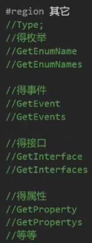

___

**Activator**
```c#
用于快速实例化对象的类
用于将Type对象快捷实例化为对象
先得到Type
然后快速实例化一个对象

Type t = typeof(类名);

//无参构造创建实例
Activator.CreateInstance(t);

//有参构造
Activator.CreateInstance(t, 参数列表);
```

___

**Assembly**
```c#
//程序集类
主要用来加载其它程序集，加载后才能用Type来使用其它程序集中的信息
如果想要使用不是自己程序集中的内容 需要先加载程序集 比如dll文件(库文件)
简单的把库文件看成一种代码仓库，它提供给使用者一些可以直接拿来用的变量、函数或类

//三种加载程序集的函数

一般用来加载在同一文件下的其它程序集
Assembly asembly2 = Assembly.Load("程序集名称");

一般用来加载不在同一文件下的其它程序集
Assembly asembly = Assembly.LoadFrom("包含程序集清单的文件的名称或路径");
Assembly asembly3 = Assembly.LoadFile("要加载的文件的完全限定路径");
```
```c#
//1.先加载一个指定程序集
Assembly asembly = Assembly.LoadFrom(@"C:\Users\MECHREVO\Desktop\CSharp进阶教学\Lesson18_练习题\bin\Debug\netcoreapp3.1\Lesson18_练习题");
Type[] types = asembly.GetTypes();
for (int i = 0; i < types.Length; i++)
{
    Console.WriteLine(types[i]);
}
//2.再加载程序集中的一个类对象 之后才能使用反射
Type icon = asembly.GetType("Lesson18_练习题.Icon");
MemberInfo[] members = icon.GetMembers();
for (int i = 0; i < members.Length; i++)
{
    Console.WriteLine(members[i]);
}
//通过反射 实例化一个 icon对象
//首先得到枚举Type 来得到可以传入的参数
Type moveDir = asembly.GetType("Lesson18_练习题.E_MoveDir");
FieldInfo right = moveDir.GetField("Right");
//直接实例化对象
object iconObj = Activator.CreateInstance(icon, 10, 5, right.GetValue(null));
//得到对象中的方法 通过反射
MethodInfo move = icon.GetMethod("Move");
MethodInfo draw = icon.GetMethod("Draw");
MethodInfo clear = icon.GetMethod("Clear");

Console.Clear();
while(true)
{
    Thread.Sleep(1000);
    clear.Invoke(iconObj, null);
    move.Invoke(iconObj, null);
    draw.Invoke(iconObj, null);
}
```

**类库**
```
只能写代码，生成后有dll文件，可以利用反射执行
```
## 反射实践
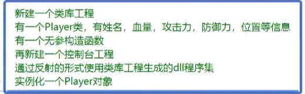

**Player类库**

```c#
namespace Player
{
    public struct Position
    {
        public int x;
        public int y;
        public Position(int x, int y)
        {
            this.x = x;
            this.y = y;
        }
    }
    public class Player
    {
        public string name;
        public int hp, atk, def;
        public Position pos;

        public Player()
        {
            name = "无名氏";
            hp = 100;
            atk = 20;
            def = 20;
            pos = new Position(20,15);
        }
    }
}
```
**实现对Player类库的反射**
```c#
public static void Main(string[] args)
{
    Assembly assembly = Assembly.LoadFrom("E:\\Visual Studio Projects\\C#GrammarTest\\Player\\bin\\Debug\\net6.0\\Player");

    /*
    Type[] types = assembly.GetTypes();
    foreach (var item in types)
    {
        Console.WriteLine(item);
    }
    */
    Type player = assembly.GetType("Player.Player"); //得到Player类的类型
    /*
    
    MemberInfo[] memberInfos = player.GetMembers();
    foreach (MemberInfo memberInfo in memberInfos)
    {
        Console.WriteLine(memberInfo);
    }
    */

    Type position = assembly.GetType("Player.Position"); //得到position结构体类型

    object playerObj = Activator.CreateInstance(player); //创建Player类实例

    FieldInfo[] fieldInfos = player.GetFields(); //得到Player类的变量
    FieldInfo fieldInfo = player.GetField("pos"); //得到得到Player类的pos变量

    foreach (FieldInfo fields in fieldInfos)
    {
        Console.WriteLine(fields.GetValue(playerObj)); //输出实例playerObj的各变量值
    }
                
    FieldInfo x = position.GetField("x"); //得到pos结构体中x的变量
    FieldInfo y = position.GetField("y"); //得到pos结构体中y的变量
    Console.WriteLine(x.GetValue(fieldInfo.GetValue(playerObj))); //输出实例playerObj的变量pos的x
    Console.WriteLine(y.GetValue(fieldInfo.GetValue(playerObj))); //输出实例playerObj的变量pos的y
}
```
## 特性
**特性的概念**
```c#
特性是一种允许我们向程序的程序集添加元数据的语言结构
它是用于保存程序结构信息的某种特殊类型的类
特性提供功能强大的方法以将声明信息与C#代码（类型、方法、属性等)相关联.
特性与程序实体关联后，即可在运行时使用反射查询特性信息
特性的目的是告诉编译器把程序结构的某组元数据嵌入程序集中
它可以放置在几乎所有的声明中(类、变量、函数等等申明)
说人话:
特性本质是个类
我们可以利用特性类为元数据添加额外信息
比如一个类、成员变量、成员方法等等为他们添加更多的额外信息
之后可以通过反射来获取这些额外信息
```

___

**自定义特性**
```c#
//继承特性基类 Attribute
//继承特性基类 Attribute
[AttributeUsage(AttributeTargets.Class | AttributeTargets.Field, AllowMultiple = true, Inherited = false)]
class MyCustomAttribute : Attribute
{
    //特性中的成员 一般根据需求来写
    public string info;

    public MyCustomAttribute(string info)
    {
        this.info = info;
    }

    public void TestFun()
    {
        Console.WriteLine("特性的方法");
    }
}
```

___

**特性的使用**
```c#
基本语法:
[特性名(参数列表)]
本质上就是在调用特性类的构造函数
写在：类、函数、变量上一行，表示他们具有该特性信息
```
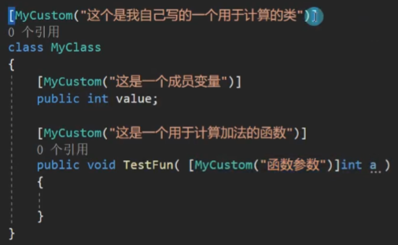

```c#
MyClass mc = new MyClass();
Type t = mc.GetType();
//t = typeof(MyClass);
//t = Type.GetType("Lesson21_特性.MyClass");

//判断是否使用了某个特性
//参数一：特性的类型
//参数二：代表是否搜索继承链（属性和事件忽略此参数）
if( t.IsDefined(typeof(MyCustomAttribute), false) )
{
    Console.WriteLine("该类型应用了MyCustom特性");
}

//获取Type元数据中的所有特性
object[] array = t.GetCustomAttributes(true);
for (int i = 0; i < array.Length; i++)
{
    if( array[i] is MyCustomAttribute )
    {
        Console.WriteLine((array[i] as MyCustomAttribute).info);
        (array[i] as MyCustomAttribute).TestFun();
    }
}
```

___

**限制自定义特性的使用范围**
```c#
//通过为特性类 加特性 限制其使用范围
[AttributeUsage(AttributeTargets.Class | AttributeTargets.Struct, AllowMultiple = true, Inherited = true)]
//参数一：AttributeTargets —— 特性能够用在哪些地方
//参数二：AllowMultiple —— 是否允许多个特性实例用在同一个目标上
//参数三：Inherited —— 特性是否能被派生类和重写成员继承
public class MyCustom2Attribute : Attribute
{

}
```

___

**系统自带特性——过时特性**
```c#
//过时特性
//Obsolete
//用于提示用户 使用的方法等成员已经过时 建议使用新方法
//一般加在函数前的特性
```
___

**系统自带特性——调用者信息特性**
```c#
//哪个文件调用？
//CallerFilePath特性
//哪一行调用？
//CallerLineNumber特性
//哪个函数调用？
//CallerMemberName特性

//需要引用命名空间 using System.Runtime.CompilerServices;
//一般作为函数参数的特性
```
___

**系统自带特性——条件编译特性**
```c#
//条件编译特性
//Conditional
//它会和预处理指令 #define配合使用

//需要引用命名空间using System.Diagnostics;
//主要可以用在一些调试代码上
//有时想执行有时不想执行的代码

#define Fun

[Conditional("Fun")] //有define过这个名字才会执行
static void Fun()
{
    Console.WriteLine("Fun执行");
}

```

___

**系统自带特性——外部Dll包函数特性**
```c#
//DllImport

//用来标记非.Net(C#)的函数，表明该函数在一个外部的DLL中定义。
//一般用来调用 C或者C++的Dll包写好的方法
//需要引用命名空间 using System.Runtime.InteropServices

[DllImport("Test.dll")]
public static extern int Add(int a, int b);
```

___

**自带特性 例**
```c#
class TestClass
{
    //参数一：调用过时方法时 提示的内容
    //参数二：true-使用该方法时会报错  false-使用该方法时直接警告
    [Obsolete("OldSpeak方法已经过时了，请使用Speak方法", false)]
    public void OldSpeak(string str)
    {
        Console.WriteLine(str);
    }

    public void Speak()
    {

    }

    public void SpeakCaller(string str, [CallerFilePath]string fileName = "", 
        [CallerLineNumber]int line = 0, [CallerMemberName]string target = "")
    {
        Console.WriteLine(str);
        Console.WriteLine(fileName);
        Console.WriteLine(line);
        Console.WriteLine(target);
    }
}

TestClass tc = new TestClass();
tc.OldSpeak("123");
tc.Speak();

tc.SpeakCaller("123123123123123");
```