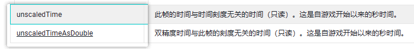

# 【唐老狮】Unity四部曲

笔记整理者：盘子ssa，QQ（2426966358），2023年1月24日

# 【唐老狮】Unity四部曲之Unity入门 

# Unity环境搭建

# 任务3：Unity引擎是什么

## 游戏引擎是什么？

游戏引擎是指一些已编写好的可编辑电脑游戏系统或者一些交互式实时图像应用程序的核心组件。这些系统为游戏设计者提供各种编写游戏所需的各种工具，其目的在于让游戏设计者能容易和快速地做出游戏程序而不用由零开始。

通俗来讲:

游戏引擎就是专门做游戏的软件。它提供了很多现成的功能供我们使用让开发游戏事半功倍

## 游戏引擎对于我们的意义

1. 降低做游戏的门槛……不用学太多的专业知识
2. 提升游戏开发的效率……不用从零开始

## 如何学习Unity

Unity相当于就是一个游戏开发工具包，我们只要学会使用工具包中的各个工具即可而使用这些工具的媒介就是我们已经学习完毕的C#程序语言

## 总结

1. 什么是游戏引擎——开发游戏的软件
2. 游戏引擎对于我们的意义——门槛低，效率高
3. 如何学习游戏引擎——软件操作、公共API、核心系统

Unity就是一个做游戏的工具软件，它可以让开发游戏事半功倍。我们将通过我们学习的C#程序语言，作为和这个工具沟通的媒介，制作出最终的游戏产品。

# 任务5：新建工程和工程文件夹

## 工程文件夹

1. Assets:工程资源文件夹(美术资源，脚本等等)
2. Library:库文件夹(Unity自动生成管理)
3. Logs:日志文件夹，记录特殊信息(Unity自动生成管理)
4. obj:编译产生中间文件(Unity自动生成管理)
5. Packages:包配置信息(Unity自动生成管理)
6. ProjectSettings:工程设置信息(Unity自动生成管理)

# Unity界面基础

# 任务6：Scene和Hierarchy窗口 知识点

## Scene和Hierarchy

场景窗口和层级窗口是息息相关的
层级窗口中看到的内容就是场景窗口中的显示对象

## Hierarchy层级窗口

我们可以在Hierarchy窗口中创建或拖入各种游戏对象比如：模型、光源、图片UI等等内容

层级窗口中显示的，就是一个场景中的所有对象

在此窗口右键，可创建一些简单的3D物体，并对对象进行一些简单操作（复制，粘贴，克隆等）。

在物体前，可以选择是否显示和是否可选。

## Scene场景窗口

窗口上方工具条内容

1. 渲染模式
   1. Shaded：着色器模式
   2. Wireframe：网格模式
2. 2D、3D视图切换
3. 光源、音效、特效显示开启
4. 辅助线显示
5. Gizmos：辅助功能，控制场景上提示图标等
6. 搜索栏
7. 场景轴向

### 坐标轴

关于Unity中的3D世界坐标轴

红色为X轴正向，绿色为Y轴正向，蓝色为Z轴正向

以屏幕为参照物：垂直屏幕向内为Z正方向，平行屏幕向右为X正方向，平行屏墓向上为Y正方向

点击坐标轴中间方块，变为ISO（正交试图）

点击不同坐标轴，切换到对应视图（正视图，侧视图，俯视图等）

### 快捷工具栏

Q：手动工具，可使用鼠标左键平移视角

W：移动工具，物体移动

E：旋转工具，物体旋转

R：缩放工具，物体缩放

T：矩形工具（2D）

Y：综合工具，随意选择、移动、旋转、缩放物体

Global/Local：世界/本地坐标系，旋转时，轴的相对目标

Global/Local 右边那个：移动物体时，一次只移动一步长（米），步长可在。

### 快捷键操作

#### 左键相关

鼠标单击:选中单个物体

鼠标框选:选中多个物体

Ctrl+鼠标单击:多选物体

鼠标右键按下+移动鼠标:旋转视口

长按ALT键+鼠标左键+移动鼠标:相对观察视口中心点旋转

#### 右键相关

鼠标右键按下+移动鼠标:旋转视口心

鼠标右键按下+WASD:漫游场景

鼠标右键按下+WASD+Shift:快速漫游场景

长按ALT键+鼠标右键+移动鼠标:相对屏幕中心点拉近拉远

#### 中键相关

滚动鼠标中间:相对屏幕中心点拉近拉远

鼠标中间按下+移动鼠标:平移观察视口

长按ALT键+滚动鼠标中间:鼠标指哪就朝哪拉近拉远

#### 其他

选中物体之后，按F键:居中显示物体
(或者在层级窗口中双击对象)

## 总结

所有的游戏对象都会出现在

Scene场景窗口和Hierarchy层级窗口中需要掌握的就是熟练快捷的在

Scene窗口中操作游戏物体（位置旋转缩放)

# 任务8：Game和Project窗口 知识点

## Game游戏窗口

Game游戏窗口中显示的内容；

是场景中**摄像机**，拍摄范围内的游戏对象是玩家通过屏幕能看到的东西

1.引擎中运行游戏

⒉暂停运行

3.逐帧运行

Display1：显示设备选择

FreeAspect：屏幕分辨率

Scale：缩放（一般为1）

Maximize On Play：运行时全屏

Stats：渲染统计信息

## Project工程窗口

窗口中显示的内容主要是，Assets文件夹中的所有内容。

主要用来**管理资源、脚本**文件，所有游戏资源都会显示在该窗口中。

在此窗口中，右键资源，可以对其进行一些操作。

常用的有

**Show In Explorer**：将当前选中的资源，在文件资源管理器下显示

**Create**：创建一个指定类型的资源

### Project工程窗口默认文件夹

默认文件夹（老版本没有）

Assets：资源文件夹，游戏资源全部都放这里。

Scenes：里面有一个默认空场景

Packages：官方拓展包

### Project工程窗口关键功能

1. 窗口设置：右上角三点
2. 创建相关资源文件：左上角+，或者右键create
3. 查找
4. 按资源类型查找：t:type
5. 按名字查找

### 资源类型

图片格式：jpg、png、tga

模型格式：fbx、max、maya

音效：wav、mp3、ogg

文本：txt、json、bytes

视频：mp4

## 总结

Game游戏界面，是玩家玩游戏看到的画面

界面中重要功能是：分辨率设置项、渲染统计界面

Project工程界面，是我们用于管理游戏资源和代码的

重要的是知道支持的主要资源类型

# 任务10：Inspector和Console窗口 知识点

## Inspector和Console

Inspector检查窗口：查看场景中游戏对象关联的C#脚本信息

Console控制台窗口：用于查看调试信息的窗口；报错、警告、测试打印都可以显示在其中

## Inspector检查窗口

不选择场景中游戏对象或，不进行任何相关设置，该界面不会显示任何信息

当选择场景中意游戏对象时，该界面将显示和该游戏对象，关联的C#脚本信息

红色部分：游戏对象基本设置

Cube-对象名字；Static-静态；Tag-标签；Layer-层级；

蓝色部分：关联的C#脚本

Transform-位置旋转缩放信息组件；

绿色部分：脚本的公共成员变量

Add Component：添加组件


## Console控制台窗口

默认未开启，可以在Window——>General中开启，或者使用快捷键：Ctrl+Shift+C

该窗口，将显示代码编译过程中，或者游戏运行过程中的报错、警告、测试信息，主要用于查错和调试用。

1. 清空控制台
2. 相同内容折叠显示
3. 运行时清空
4. 构建时清空
5. 报错暂停运行
6. 是否显示错误信息
7. 是否显示警告信息
8. 是否显示打印信息


## 总结

1. Inspector检查窗口：用于设置游戏对象具体信息
2. Console控制台窗口：用于显示调试信息，报错、警告、打印信息等
3. Scene场景窗口：所有游戏对象所在地
4. Hierarchy层级窗口：所有游戏的对象名单
5. Game游戏窗口：玩家看到的游戏画面
6. Project工程窗口：所有游戏资源和脚本内容

在Unity中做游戏就像在拍戏

Scene是舞台，所有演员都在舞台上

Hierarchy是舞台演员名单

Game是摄像机拍到的画面

Inspector可以看到每个演员的剧本，它要扮演什么角色

Project是后台，所有未上场的演员和没有使用的剧本都在这里

Console是表演过程中的信息反馈

## 练习题

在场景中用Cube堆砌一个，有4层Cube高的金字塔出来，摄像机要斜向下45度拍摄它。

# 任务12：工具栏和父子关系 知识点

## 工具栏


1. 文件操作：新建工程，新建场景，工程打包等等

   1. Build Settings：工程打包

2. 编辑操作：对象编辑操作相关，工程设置，引擎设置相关

   1. **shift+F**：视角锁定对象
   2. ctrl+alt+数字：将选中的物体编组
   3. ctrl+shift+数字：选中编组中的物体
   4. **Project Settings**：项目设置，对应工程文件夹的ProjectSettings文件夹
   5. **Preferences**：首选项，包含很多编辑器的设置
   6. Shortcuts：快捷键设置
   7. **Grid and Snap Settings**：步长设置

3. 资源操作：基本等同于**Project窗口中右键**相关功能，其他功能为导入相关的功能。

4. 对象操作：基本等同于Hierarchy窗口中右键相关功能

   1. **MoveToVie**：将选中物体移动到视线中心
   2. **AlignWithView**：将选中物体移动到视角位置
   3. **AlignVieToSelected**：将视角移动到选中的物体位置
   4. **ToggleActiveState**：激活/失活对象

5. 脚本操作：Unity自带的脚本，可以添加各系统中的脚本

6. 窗口：可以打开Unity各核心系统的窗口

   > 注意：AssetStore在高版本Unity已经没有了

7. 帮助：检查更新，查看版本等等功能

   1. UnityManual：Unity使用手册
   2. ScriptingReference：脚本使用说明

File中的重要选项：**BuildSetting**（工程发布打包）

Edit中的重要选项：**Project Setting**（工程各系统设置）；**Preferences**（首选项，可以设置编程软件）

GameObject中的重要选项：**MoveToView、Align With View、Align View to Selected**（几种快捷设置位置的功能）

MoveToView：ctrl+alt+F

Align With View：ctrl+shift+F

## 对象的父子关系

对象在另一个对象的右下，就说明他们存在父子关系

1. 子对象会随着父对象的变化而变化
2. 子对象Inspector窗口中Transform信息是相对父对象的
   1. 选择Inspector的debug模式，可以看到子对象是Local坐标，即相对于父对象的坐标
3. Pivot：锚点，默认为本身，但会根据子对象改变
4. Global：全局，世界坐标，一般来说，对象在世界坐标，对象根据世界坐标操作。
5. Local：本地坐标，对象根据自身的本地坐标操作

## 总结

1. 上方工具栏：

   目前只需要记住工具栏中的几个重要选项即可

   哪里打包程序？哪里设置编程软件？哪里可以打开其它窗口？

2. 父子关系：

   对象之间产生父子关系后，如何相互影响？

   爸爸干嘛，儿子干嘛

   儿子干嘛，爸爸不管

## 习题

在场景中用自带几何体拼一个坦克出来，坦克有身体、炮台、炮管、四个轮子。
他们有共同的父对象，父对象移动，其它部件跟随移动，炮管跟着炮台转向。

# Unity工作原理

# 任务14：反射机制和游戏场景 知识点

## 1.Unity中的反射机制

Unity引擎本质是一个软件，使用它时是处于运行中的
我们是在一个运行中的软件里制作游戏的，Unity开发的本质就是
在Unity引擎的基础上，利用反射和引擎提供的各种功能，进行的拓展开发

### 回忆一下反射的概念

程序正在运行时，可以查看其它程序集或者自身的元数据

一个**运行的程序查看本身或者其它程序的元数据的行为**就叫做反射

在程序运行时，通过反射可以得到其它程序集或者自己程序集中
代码的各种信息，比如类，函数，变量，对象等等
我们可以实例化它们，执行它们，操作它们

### 场景中对象的本质是什么

GameObject类对象是Unity引擎提供给我们的
作为场景中所有对象的根本
在游戏场景中出现一个对象
不管是图片、模型、音效、摄像机等等都是
依附于**GameObject对象**的

拟人化记忆：GameObject就是没有剧本的演员

### Transform是什么

GameObject对象作为一个出现在舞台（3D场景）中的演员
必须有一个表示自己所在位置的信息
Transform就是一个必不可少的剧本
它的本质就是发了一本表示位置的剧本给演员
（相当于就是用一个Transform类对象和GameObject类对象进行关联）
用于设置和得到演员在世界中的位置角度缩放等信息

### 反射机制的体现

除了Transform这个表示位置的标配剧本外
我们可以为这个演员（GameObject）关联各种剧本（C#脚本）
让它按照我们剧本中（代码逻辑中）的命令来处理事情
而为演员添加剧本的这个过程，就是在利用反射new一个新的剧本对象和演员（GameObject）对象进行关联，让其按我们的命令做事。

### 图示表现


### 举例体现

前提：Unity帮助我们实现了对象查找和关联

1. 修改Inspector面板中Transform的内容

   **利用反射**：**已知对象，类名，变量名，通过反射为该对象设置变量**

2. 新建一个脚本后，添加给一个指定的GameObject对象

   **利用反射**：**已知类名，可以获取所有公共成员，故可以在Inspector面板上创建各公共字段信息**

## 2.游戏场景

### 基本知识点

1. 游戏场景的保存：ctrl+s

2. 游戏场景的新建：在Project窗口Assets->Scenew文件夹下创建

3. 多个游戏场景叠加显示：

   可将多个场景拖到Hierarchy窗口，进行同时渲染（没啥用，最多可以复制两个场景不同的东西）

### 游戏场景的本质

游戏场景文件，后缀为.unity

它的本质就是一个配置文件

Unity有一套自己识别处理它的机制

但是本质就是把场景对象相关信息读取出来

通过反射来创建各个对象关联各个脚本对象

> 简单来说：
>
> 就是Unity通过读取写入这个场景文件，获取对象信息，在Unity运行时，用C#反射来实例化并编辑对象
>
> 这些对象的所有字段（成员变量）、组件，都在场景文件当中
>
> 比如下面的MyCube，它本身是一个GameObejct，有一个TransForm组件
>
> 这个GameOjbect的m_Name是MyCube
>
> 其他字段参考：[UnityEngine.GameObject - Unity 脚本 API](https://docs.unity.cn/cn/2020.3/ScriptReference/GameObject.html)
>
> 也就是说，我们可以**直接修改场景文件**，修改后Unity会提示你重新加载场景，你的修改就会被体现


# Unity脚本基础

# 任务15：预设体和资源包的导入导出 知识点

## 1.预制体

### 什么是预制体？

Prefab：预先制作好的的物体，文件后缀**\.prefab**

**Prefab在Scene当中的所有实例都是一样的**

我们可以将在场景当中配置好的物体，拖入到Assets->Prefabs文件夹当中，使得其变为一个预制体（prefab）


### 预制体的本质

我们可以文本形式打开.prefab文件，发现它和场景文件（.unity)文件一样，是一个配置文件。

原理同场景文件。

> 注意：中文在这些配置文件中以Unicode编码体现，所以不能直接查找到中文


### Prefab的修改

在Scene窗口修改（添加东西）Prefab之后，在Inspector窗口

选择**Overrides**：

**Revert All**（重置所有）：重置所有预制体实例为初始（本来）状态。

Apple All（应用所有）：应用修改到所有预制体实例

Open Prefab：在Project**双击**或者在Inspector **Open**预制体，打开预制体修改模式，这是用来专门修改预制体的，所有修改都会应用。

### UnPack Prefab

选中物体右键后，可以选择UnPack Prefab，解除与预制体的关系。

### 实例物体右键->Prefab

有一些有关于物体的Prefab的操作，比如Select Assets（选中预制体源文件）

## 2.导入导出资源包

在Project窗口，右键后可以选择导入（Import Package）导出（Export Package）资源包。

资源包文件后缀：**.unitypackage**

# 任务17：脚本基本规则 知识点

## 1.创建规则

1. 不在VS中创建脚本了

2. 可以放在Assets文件夹下的任何位置（建议同—文件夹管理，一般使用一个Scripts文件夹管理)

3. 类名和文件名必须—致,不然不能挂载（因为反射机制创建对象，会通过文件名去找Type）

   挂载：将此脚本作为一个组件添加到某个物体当中

4. 建议不要使用中文名命名

5. 没有特殊需求不用管命名空间

6. 创建的脚本默认继承MonoBehavior

## 2.MonoBehavior基类

1. 创建的脚本默认都**继承MonoBehaviour**，继承了它才**能够**挂载在GameObject上

2. 继承了MonoBehavior的脚本**不能new只能挂**!!! ! !! !!

   > [Unity的坑——避免用New来创建继承于MonoBehaviour脚本的对象_弹吉他的小刘鸭的博客-CSDN博客_unity銝要ew](https://blog.csdn.net/alexhu2010q/article/details/106695166)

3. 继承了MonnBehavior的脚本不要去写构造函数，因为我们不会去new它，写构造函数没有任何意义

4. 继承了MonoBehavior的脚本可以在一个对象上挂多个（如果没有加DisallowMultipleComponent特性)

   DisallowMultipleComponent特性：不允许挂载多个相同脚本。

5. 继承MonoBehavior的类也可以再次被继承，遵循面向对象继承多态的规则

   再次继承后的类脚本，也可以挂载到物体上。

## 3.不继承MonoBehavior的类

1. 不继承Mono的类不能挂载在GameObject 上
2. 不继承Mono的类想怎么写怎么写，如果要使用需要自己new
3. 不继承Mono的类**一般是单例模式的类**（用于**管理模块**）或者**数据结构类**（用于存储数据）
4. 不继承Mono的类不用保留默认出现的几个函数

## 4.脚本执行的顺序

Project Settings->Script Execution Order

或者选择脚本->Inspector->Execution Order（右上角）

可以设置脚本执行顺序

## 5.默认脚本内容

脚本模板路径

```C#
EditorVersion\Editor\Data\Resources\ScriptTemplates
```

修改对应模板文件即可。

## 习题

1. 为什么继承MonoBehavior的类不能写构造函数?

   因为继承MonoBehavior的类不能new，构造函数也就没有意义。

   Unity会在这种类的构造函数进行一些内部的操作，如果强行new出来，会被UnityObject重写ToString，得到一个"null"字符串，但是仍然可以调用一些函数。

2. 为什么继承MonoBehavior的类不能直接new出来用，要挂载?

   由于继承MonoBehavior的类，都是组件，而组件就是设计用来挂载的。

   > The MonoBehaviour base class is the only base class from where you can derive your own components from
   >
   > Unity的代码看似用的C#，实际上底层是翻译成C++使用的，所以不能完全从.Net的角度来看Unity的设计思路，Unity为什么这么设计语言，我也没有找到定论，这里只能做一个大概的猜测，猜测这么做的原因主要有两点：
   >
   > 1、在C#里，对于Object，用new关键字来创建对象，会调用该类的构造函数，但Unity引擎对于MonoBehaviour类的对象，需要利用其构造函数做一些引擎内的事情，所以不提倡使用new关键字调用其构造函数，而是用Awake和Start函数来代替构造函数的功能。举个例子，下面部分是MonoBehaviour在C#这边的部分源码，可以看到，引擎自己在里面使用了构造函数：
   >
   > ```C#
   > // MonoBehaviour.bindings.cs文件夹
   > namespace UnityEngine
   > {
   >     // MonoBehaviour is the base class every script derives from.
   >     [RequiredByNativeCode]
   >     [ExtensionOfNativeClass]
   >     [NativeHeader("Runtime/Mono/MonoBehaviour.h")]
   >     [NativeHeader("Runtime/Scripting/DelayedCallUtility.h")]
   >     public class MonoBehaviour : Behaviour
   >     {
   >         public MonoBehaviour()
   >         {
   >             ConstructorCheck(this);
   >         }
   > 		...
   >     }
   > }
   > ```
   >
   > 2、把ScriptComponents组件统一用AddComponent或Instantiate函数来创建，可能是一种类似工厂模式的设计理念，旨在统一管理对象的创建。
   >
   > [Unity的坑——避免用New来创建继承于MonoBehaviour脚本的对象_unity銝要ew_弹吉他的小刘鸭的博客-CSDN博客](https://blog.csdn.net/alexhu2010q/article/details/106695166)

3. 请写一个类用于说明不继承MonoBehavior的类对于我们的作用

   管理资源的类，一般不需要继承MonoBehavior，因为它不需要挂载到场景当中，作为组件存在。
   
   数据结构类一般也不需要继承MonoBehavior，因为数据只需要读取，也不需要挂载到场景当中，作为组件存在。
   
   ```C#
   public class SceneMgr()
   {
       private static SceneMgr instance = new SceneMgr();
       private SceneMgr() {}
       public static SceneMgr Instance 
       {
       	get => this;    
       }
       
       public void Func() { ... }  
   }
   ```

### 唐老狮答案

第1题

因为MonoBehaviour不能new只能挂我们不会通过构造函数实例化对象写构造函数没有意义

第二题

1. 这是Unity定下的规则；
2. 继承MonoBehavior的类只能挂载在GameObject上配合使用

第三题

数据结构类或者单例管理类

```C#
//玩家信息类
public class PlayerInfo
{
	public string name;
	public bool sex;
	
	public int atk;
	public int def;
	public int hp;
	public int maxHp;
}
//怪物管理类
public class MonsterMgr
{
    private static MonsterMgr instance = new MonsterMgr();
    public static MonsterMgr Instance => instance;
}
```

# 任务19：生命周期函数 知识点

## 知识点一 了解帧的概念

### 什么是帧?

游戏的本质就是一个死循环；每—次循环处理游戏逻辑，就会更新一次画面。

之所以能看到画面在动，是因为，切换画面的速度到达—定时人眼就认为画面是流畅的。

—帧就是执行一次循环。

FPS（Frame Per Second）：即每秒帧数。

人眼舒适放松时可视帧数是每秒24帧

> 电影就是24帧的

游戏卡顿的原因：跑1帧游戏逻辑中的计算量过大，或者CPU不给力，不能在—帧的时间内处理完所有游戏逻辑。

### Unity当中的游戏死循环

Unity 底层已经帮助我们做好了死循环，我们需要学习Unity的生命周期函数，利用它做好的规则来执行我们的游戏逻辑就行了。

## 知识点二 生命周期函数的概念

所有继承MonoBehavior的脚本 最终都会挂载到GameObject游戏对象上。

生命周期函数 就是该脚本对象依附的GameObject对象从**出生到消亡**整个**生命周期**中，会通过反射自动调用的一些特殊函数。

Unity帮助我们记录了一个GameObject对象依附了哪些脚本；

会自动的得到这些对象，通过反射去执行一些固定名字的函数

## 知识点三 生命周期函数


> 物理碰撞触发相关函数将在后讲解

注意：

生命周期函数的访问修饰符一般为**private**和**protected**；

因为不需要在外部自己调用生命周期函数，都是Unity自己帮助我们调用的。

这是一种观察者模式。

### Awake

出生时调用，类似构造函数一个对象只会调用一次

当对象（自己这个类对象）**被创建时** 才会调用该生命周期函数。

类似构造函数的存在，我们可以在一个类对象**刚创建**进行一些初始化操作

> Awake 在加载脚本实例时调用。
>
> [MonoBehaviour-Awake() - Unity 脚本 API](https://docs.unity.cn/cn/2020.3/ScriptReference/MonoBehaviour.Awake.html)

```C#
private virtual void Awake() {
		
}
```

### 在Unity中打印信息的两种方式

1. 没有继承MOnoBehavior类的时候,使用

   ```C#
   Debug.Log(str);
   ```

2. 继承了MonoBehavior，有一个现成的方法可以使用

   ```C#
   print(str);
   ```

### OnEnable

依附的GameObject对象每次激活时调用

对于我们来说，想要当一个对象**被激活时**，进行一些逻辑处理，就可以写在这个函数。

> 该函数在对象变为启用和激活状态时调用。
>
> [MonoBehaviour-OnEnable() - Unity 脚本 API](https://docs.unity.cn/cn/2020.3/ScriptReference/MonoBehaviour.OnEnable.html)

### Start

从自己被创建出来后，第一次帧更新之前调用，—个对象只会**调用一次**。

主要作用还是用于**初始化信息**的，但是它相对Awake来说 要晚一点。

因为它是在对象，进行第一次帧更新之前才会执行的。

> 在首次调用任何 Update 方法之前启用脚本时，在帧上调用 Start。
>
> [MonoBehaviour-OnEnable() - Unity 脚本 API](https://docs.unity.cn/cn/2020.3/ScriptReference/MonoBehaviour.OnEnable.html)

### FixedUpdate

物理帧更新，固定间隔时间执行，间隔时间可以设置。

它主要是用于进行**物理更新**，它是每一帧的执行的。但是，这里的帧和游戏帧有点不同。

它的时间间隔是可以在ProjectSettings中的 Time里去设置的。

### Update

逻辑帧更新每帧执行。

主要用于处理游戏核心逻辑更新的函数。

> 如果启用了 MonoBehaviour，则每帧调用 Update。
>
> 在实现任何类型的游戏脚本时，`Update` 都是最常用函数。 但并非所有 `MonoBehaviour` 脚本都需要 Update。
>
> [MonoBehaviour-Update() - Unity 脚本 API](https://docs.unity.cn/cn/2020.3/ScriptReference/MonoBehaviour.Update.html)

### LateUpdate

每帧执行，于Update之后执行。

一般这个更新是用来处理 摄像机位置更新相关内容的；

Update和LateUpdate之间Unity进了一些处理，处理我们动画相关的更新。

摄像机的控制一般写在这里，因为要等渲染完成之后才查看。

> 如果启用了 [Behaviour](https://docs.unity.cn/cn/2020.3/ScriptReference/Behaviour.html)，则每帧调用 LateUpdate。
>
> LateUpdate 在调用所有 Update 函数后调用。 这对于安排脚本的执行顺序很有用。例如，跟随摄像机应始终在 LateUpdate 中实现， 因为它跟踪的对象可能已在 Update 中发生移动。
>
> [MonoBehaviour-LateUpdate() - Unity 脚本 API](https://docs.unity.cn/cn/2020.3/ScriptReference/MonoBehaviour.LateUpdate.html)

### OnDisable

依附的GameObject对象每次激活时调用。

如果我们希望在一个对象失活时做一些处理 就可以在该函数中写逻辑。

> 该函数在行为被禁用时调用。
>
> 当对象销毁时也会调用该函数，它可用于任何清理代码。 当编译完成后重新加载脚本时，将调用 OnDisable，并在加载脚本后调用 OnEnable。
>
> [MonoBehaviour-OnDisable() - Unity 脚本 API](https://docs.unity.cn/cn/2020.3/ScriptReference/MonoBehaviour.OnDisable.html)

### OnDestroy

对象销毁时调用，依附的GameObject对象被删除时。

注意：调用此方法，将会调用一次OnDisable，因为此时对象失活一次。

> 销毁附加的行为将导致游戏或场景收到 [OnDestroy](https://docs.unity.cn/cn/2020.3/ScriptReference/MonoBehaviour.OnDestroy.html)。
>
> [MonoBehaviour-OnDestroy() - Unity 脚本 API](https://docs.unity.cn/cn/2020.3/ScriptReference/MonoBehaviour.OnDestroy.html)

## 知识点四 生命周期函数 支持继承多态

即使父类脚本没有挂载，子类挂载了，也可以执行父类方法。

## 总结

这些生命周期函数，如果你不打算在其中写逻辑，那就不要在这些出生命周期函数。

因为如果你重写了这些函数，即使里面没有内容，Unity也会通过反射获取并执行，增加一些额外性能消耗。

其他：

1. 脚本可以挂载到场景当中的任意对象当中。
2. 一个对象挂载的脚本，就实例化了一个类，是一份独特的唯一实例，不和这个类的其他实例互通（静态除外）。
3. 当场景当中的脚本一开始就处于失活状态时，不会调用生命周期函数。

## 练习题

1. 生命周期函数都在何时执行，执行的先后顺序是什么？

   Awake：在加载脚本实例时调用（类似构造函数）

   OnEnable：在脚本实例被激活是调用。

   Start：在游戏帧更新开始前调用。

   FixedUpdate：物理帧更新，根据设定的物理时间调用。

   Update：游戏帧更新，游戏中每一帧调用。

   LateUpdate：在所有Update执行完成后调用，可以用来设置摄像机跟随。

   OnDisable：在脚本实例失活时调用。

   OnDestroy：在对象被销毁时调用。

2. 生命周期函数并不是基类中的成员，为什么Unity可以自动的执行这些特殊的函数。

   通过反射。

## 答案

2：

Unity帮助我们记录了场景上的所有GameObject对象以及各个关联的脚本对象；

在游戏执行的特定时机（对象创建时，失活激活时，帧更新时)；

它会通过函数名反射得到脚本对象中对应的生命周期函数，然后在这些特定时机执行他们。

# 任务21：脚本基本规则补充 关于继承Mono的类的构造函数

我们要知道，虽然建议大家不在继承MonoBehavior的类中写构造函数

但是不意味着我们不能写，当我们在继承MonoBehavior的类中写无参构造函数时，你会发现在编辑模式下或者运行后，只要该脚本挂载在场景中，那么该无参构造函数是会被自动执行的。

因为Unity的工作原理中提到的反射机制，Unity实际上通过反射帮助我们实例化了该脚本对象，既然要实例化那么肯定是需要new的，只不过Unity中不需要我们自己new继承了MonoBehavior的类，只要挂载后Unity帮助我们做了这件事。

那么为什么不建议大家写构造函数呢？

1.Unity的规则就是，继承MonoBehavior的脚本不能new只能挂载

2.生命周期函数的Awake是类似构造函数的存在，当对象出生就会自动调用

3.写构造函数反而在结构上会破坏Unity设计上的规范

 

总结：

如果继承MonoBehavior的脚本想要进行初始化相关，可以在Awake或者Start中进行，搞清这两个生命周期函数的执行时机，根据需求选择在哪里进行初始化。

切记！！继承MonoBehavior的脚本不要new，不要new，不要new！！

# 任务22：不同对象的生命周期函数是在同一个线程中执行的吗？

答案：Unity中所有对象上挂载的生命周期函数都是在一个主线程中按先后执行的

理解：Unity会主动把场景上的对象，对象上挂载的脚本都统统记录下来，在主线程的死循环中，按顺序按时机的通过反射，执行记录的对象身上挂载的脚本的对应生命周期函数

# 任务23：Inspector窗口可编辑的变量 知识点

Inspector显示的可编辑内容就是脚本的成员变量

## 知识点一 私有和保护无法显示编辑

私有和保护无法显示在Inspector窗口当中进行编辑。

## 知识点二 让私有的和保护的也可以被显示

加上强制序列化字段特性

```C#
[SerializeField]
```

所谓序列化就是把一个对象保存到一个文件或数据库字段中去。

```C#
[SerializeField]
private int privateInt;
[SerializeField]
protected string protectedStr;
```

## 知识点三 公共的可以显示编辑

公共的字段可以直接在Inspector窗口编辑。

## 知识点四 公共的也不让其显示编辑

在变量前加上特性

```C#
[HideInInspector]
public int publicInt2 = 50;
```

## 知识点五 大部分类型都能显示编辑

```C#
public int[] array;
public List<int> list;
public E_TestEnum type;
public GameObject gameObj;

//字典不能被Inspector窗口显示
public Dictionary<int, string> dic;
//自定义类型变量
public MyStruct myStruct;
public MyClass myClass;
```

## 知识点六 让自定义类型可以被访问

加上序列化特性

```C#
[System.Serializable]
```

> 字典怎样都不行

## 知识点七 一些辅助特性

### 1.分组说明特性Header

为成员分组，Header特性

```C#
[Header("基础属性")]
public int age;
public bool sex;
[Header("战斗属性")]
public int atk;
public int def;
```

### 2.悬停注释Tooltip

为变量添加说明

```C#
[Tooltip("闪避")]
public int miss;
```

### 3.间隔特性 Space()

让两个字段间出现间隔

```C#
[Space()]
public int crit;
```

### 4.修饰数值的滑条范围Range

[Range(最小值, 最大值)]

```C#
[Range(0,10)]
public float luck;
```

### 5.多行显示字符串

 默认不写参数显示3行，写参数就是对应行

```C#
[Multiline(5)]
public string tips;
```

### 6.滚动条显示字符串 

默认不写参数就是超过3行显示滚动条

[TextArea(3, 4)]

最少显示3行，最多4行，超过4行就显示滚动条

```C#
[TextArea(3,4)]
public string myLife;
```

### 7.为变量添加快捷方法 

ContextMenuItem

参数1 显示按钮名

参数2 方法名 不能有参数

[ContextMenuItem("显示按钮名", "方法名")]

```C#
[ContextMenuItem("重置钱", "Test")]
public int money;
private void Test()
{
    money = 99;
}
```

### 8.为方法添加特性能够在Inspector中执行

[ContextMenu("测试函数")]

```C#
[ContextMenu("哈哈哈哈")]
private void TestFun()
{
    print("测试方法");
}
```

## 注意

1. Inspector窗口中的变量关联的就是对象的成员变量，运行时改变他们就是在改变成员变量
2. 拖曳到GameObject对象后 再改变脚本中变量默认值 界面上不会改变
3. 运行中修改的信息不会保存

## 练习题

1. 如何让公共成员不在lnspector面板上设置
   如何让私有或保护成员可以在lnspector面板上设置

   ```C#
   [HideOnInspector]
   public int publicInt;
   [SerializeField]
   private int privateInt;
   ```

2. 为什么加不同的特性，在lnspector窗口上会有不同的效果请说出你的理解

   因为Unity在通过使用反射加载类时，会判断拥有的特性，然后按对应特性实现对应功能。

答案

2.因为Unity中是通过反射得到类的信息，然后在Inspector窗口中显示字段信息。Unity内部通过反射获取字段的特性，当具有一些特殊特性时，便会做对应的处理。

# 任务25：MonoBehavior中的重要内容 知识点

继承链：

MonoBehavior->Behavior->Component->Object

所以，这期其实是讲的这些类当中的一些方法属性。

> [UnityEngine.MonoBehaviour - Unity 脚本 API](https://docs.unity.cn/cn/2020.3/ScriptReference/MonoBehaviour.html)
>
> [UnityEngine.Behaviour - Unity 脚本 API](https://docs.unity.cn/cn/2020.3/ScriptReference/Behaviour.html)
>
> [UnityEngine.Component - Unity 脚本 API](https://docs.unity.cn/cn/2020.3/ScriptReference/Component.html)
>
> [UnityEngine.Object - Unity 脚本 API](https://docs.unity.cn/cn/2020.3/ScriptReference/Object.html)

## 知识点一 重要成员

1.获取依附的GameObject

```C#
print(this.gameObject.name);
```

2.获取依附的GameObject的位置信息

```C#
//得到对象位置信息
print(this.transform.position);	//位置
print(this.transform.eularAngeles);	//角度
print(this.transform.lossyScale);	//缩放大小
```

这种写法和上面是一样的效果，都是得到依附的对象的位置信息

```C#
this.gameObject.transform
```

3.获取脚本是否激活

```c#
this.enabled = false;
```

获取别的脚本对象 依附的gameobject和 transform位置信息

```C#
print(otherLesson3.gameObject.name);
print(otherLesson3.transform.position);
```

## 知识点二 重要方法

### 1.得到自己挂载的单个脚本

根据脚本名获取

获取脚本的方法，如果获取失败，就是没有对应的脚本，会默认返回空。

```c#
Lesson3_Test t = this.GetComponent("Lesson3_Test") as Lesson3_Test;
```

根据Type获取

```C#
t = t.GetComponent(typeof(Lesson3_Test)) as Lesson3_Test;
```

根据泛型获取，建议使用泛型获取，因为不用二次转换

```C#
t = this.GetComponent<Lesson3_Test>();
```

只要你能得到场景中别的对象或者对象依附的脚本

那你就可以获取到它的所有信息

### 2.得到自己挂载的多个脚本

```C#
Lesson3[] array = this.GetComponents<Lesson3>();

List<Lesson3> list = new List<Lesson3>();
this.GetComponents<Lesson3>(list);
```

### 3.得到子对象挂载的脚本(它默认也会找自己身上是否挂载该脚本)

函数是有一个参数的，默认不传 是false，意思就是，如果子对象失活，是不会去找这个对象上是否有某个脚本的。如果传true即使失活 也会找。

得子对象挂载脚本，单个

```C#
t = this.GetComponentInChildren<Lesson3_Test>(true);
```

得子对象挂载脚本，多个

```C#
Lesson3_Test[] lts = this.GetComponentsInChildren<Lesson3_Test>(true);

List<Lesson3_Test> list2 = new List<Lesson3_Test>();
this.GetComponetsInChildren<Lesson3_Test>(true, list2);
```

### 4.得到父对象挂载的脚本(它默认也会找自己身上是否挂载该脚本)

```C#
t = this.GetComponentInParent<Lesson3_Test>();

lts = this.GetComponentsInParent<Lesson3_Test>();
this.GetComponentsInParent<Lesson3_Test>(lts);
```

### 5.尝试获取脚本

提供了一个更加安全的，获取单个脚本的方法。如果得到了，会返回true。

然后再来进行逻辑处理即可。

```C#
if (this.TryGetComponent<Lesson3_Test>(out l3t)) {
	...
}
```

## 练习题

### 第一题

请说出一个继承了MonoBehavior的脚本中
this、this.gameObject、this.transform分别代表什么?

this：代表自己；this.gameObject：依附的对象；this.transform：依附的对象上的transform。

### 第二题

一个脚本A，一个脚本B，他们都挂在一个GameObject上

实现在A中的Start函数中让B脚本失活，请用代码失活。

```C#
public class A : MonoBehaviour
{
    private void Start()
    {
        B bComp = this.GetComponent<B>();
        if (bComp != null)
        {
            bComp.enabled = false;
        }
    }
}
```

### 第三题

—个脚本A一个脚本B，脚本A挂在A对象上，脚本B挂在B对象上。

实现在A脚本的Start函数中将B对象上的B脚本失活。

```C#
public class A : MonoBehaviour
{
    public GameObject bObj;
    private void Start()
    {
        if (bObj != null)
        {
            bObj.GetComponent<B>().enabled = false;
        }
    }
}
```

# 任务27：基础知识 总结

学习Unity，其实首先是学习Unity编辑器的基本使用。

然后学习Unity自带的脚本，如果GameObject，Transform等等。

当Unity自带脚本不能满足我们自己的需求时，就需要自定义脚本。

自定义脚本往往实现我们自己想要的效果。

当游戏运行后，挂载到物体上的脚本其实会通过反射实例化为一个个对象。

每一个物体上的脚本都是独立的一个个对象。

# Unity重要组件和API

# 任务28-31：GameObject成员变量 知识点

继承链：

GameObject->Object

所以，这期其实是讲的这些类当中的一些方法属性。

> [UnityEngine.Object - Unity 脚本 API](https://docs.unity.cn/cn/2020.3/ScriptReference/Object.html)
>
> [UnityEngine.GameObject - Unity 脚本 API](https://docs.unity.cn/cn/2020.3/ScriptReference/GameObject.html)

##  知识点一 重要成员（字段）

```C#
//名字
print(this.gameObject.name);
this.gameObject.name = "Panzi";
print(this.gameObject.name);
//是否激活
print(this.gameObject.activeSelf);
//是否是静态
print(this.gameObject.isStatic);
//层级
print(this.gameObject.layer);
//标签
print(this.gameObject.tag);
//transform
//this.transform 上一节课讲解的 通过Mono去得到的依附对象的GameObject的位置信息
//他们得到的信息是一样 都是依附的GameObject的位置信息
print(this.gameObject.transform.position);
```

## 知识点二 GameObject中的静态方法

### 创建自带几何体

```C#
//只要得到了一个GameObject对象 我就可以得到它身上挂在的任何脚本信息
//通过obj.GetComponent来得去
GameObject obj = GameObject.CreatePrimitive(PrimitiveType.Cube);
obj.name = "唐老狮创建的立方体";
```

### 查找对象相关的知识

1. 无法找到失活的对象，只能找到激活的对象。
2. 如果场景中存在多个满足条件的对象，我们无法准确确定找到的是谁。

得到某一个单个对象 目前有2种方式了

1. 是public从外部面板拖 进行关联
2. 通过API去找

#### 通过对象名查找

通过对象名无法查找到多个对象，如果场景中存在多个满足条件的对象，我们无法准确确定找到的是谁。

```C#
//通过对象名查找
//这个查找效率比较低下  因为他会在场景中的所有对象去查找
//没有找到 就会返回null
GameObject obj2 = GameObject.Find("唐老狮");
if( obj2 != null )
{
    print(obj2.name);
}
else
{
    print("没有找到对应对象");
}
```

#### 通过tag来查找对象

```C#
//GameObject obj3 = GameObject.FindWithTag("Player");
//该方法和上面这个方法 效果一样 只是名字不一样而已
GameObject obj3 = GameObject.FindGameObjectWithTag("Player");
if (obj3 != null)
{
    print("根据tag找的对象" + obj3.name);
}
else
{
    print("根据tag没有找到对应对象");
}

//通过tag找到多个对象
//它也是 只能找到 激活对象 无法找到失活对象
GameObject[] objs = GameObject.FindGameObjectsWithTag("Player");
print("找到tag为Player对象的个数" + objs.Length);
```

#### 其他方法

还有几个查找对象相关是用的比较少的方法 是GameObject父类 Object提供的方法

```C#
//它可以找到场景中挂载的某一个脚本对象
//效率更低 上面的GameObject.Find 和通过FindWithTag找 只是遍历对象
//这个方法 不仅要遍历对象 还要遍历对象上挂载的脚本 
Lesson4 o = GameObject.FindObjectOfType<Lesson4>();	//不止这一个
print(o.gameObject.name);
```

### 额外知识补充

Unity中的Object和C#中的万物之父的区别：

Unity里面的Object 不是指的万物之父object；

Unity里的Object 命名空间在UnityEngine中的Object类，也是集成万物之父的一个自定义类。

C#中的Object 命名空间是在System中的 

> 就是两个不同命名空间的同名类，与Unity相关的类都继承UnityEngine命名空间中的基类

### 实例化对象（克隆对象）的方法

实例化(克隆)对象 它的作用 是根据一个GameObject对象 创建出一个和它一模一样的对象

```C#
GameObject obj5 = GameObject.Instantiate(myObj);
//以后学了更多知识点 就可以在这操作obj5
//如果你继承了 MonoBehavior 其实可以不用写GameObject一样可以使用
//因为 这个方法时Unity里面的 Object基类提供给我们的 所以可以直接用
//Instantiate(myObj);
```

### 删除对象的方法

删除对象有两种作用：

1. 是删除指定的一个游戏对象
2. 是删除一个指定的脚本对象

注意：这个Destroy方法 不会马上移除对象，只是给这个对象加了一个移除标识；
一般情况下 它会在下一帧时把这个对象移除并从内存中移除

如果没有特殊需求 就是一定要马上移除一个对象的话，建议使用上面的 Destroy方法

因为 是**异步的** 降低卡顿的几率。

```C#
//是UnityEngine.Object当中的方法
GameObject.Destroy(myObj2);
//第二个参数 代表延迟几秒钟删除
GameObject.Destroy(obj5, 5);
//Destroy不仅可以删除对象 还可以删除脚本
//GameObject.Destroy(this);

//如果是继承MonoBehavior的类 不用写GameObject
//Destroy(myObj2);
//DestroyImmediate(myObj);
```

下面这个方法 就是立即把对象 从内存中移除C了

```C#
GameObject.DestroyImmediate(myObj);	//立即删除这个对象
```

### 过场景不移除

默认情况，在切换场景时，场景中对象都会被自动删除掉；

如果你希望某个对象，过场景不被移除。下面这句代码 就是不想谁过场景被移除，就传谁。

一般都是传依附的**GameObject对象**。

比如下面这句代码的意思 就是自己依附的GameObject对象 过场景不被删除

```C#
//是UnityEngine.Object当中的方法
GameObject.DontDestroyOnLoad(this.gameObject);
//如果继承MOnoBehavior也可以直接写
//DontDestroyOnLoad(this.gameObject);
```

## 知识点三 GameObject中的成员方法

### 创建空物体

new一个GameObject就是在创建一个空物体

```C#
GameObject obj6 = new GameObject();
GameObject obj7 = new GameObject("唐老狮创建的空物体");
GameObject obj8 = new GameObject("顺便加脚本的空物体", typeof(Lesson2),typeof(Lesson1));
```

### 为对象添加脚本

继承MOnoBehavior的脚本 是不能够去new ；

如果想要动态的添加继承MonoBehavior的脚本，在某一个对象上，直接使用GameObject提供的方法即可

```C#
Lesson1 les1 = obj6.AddComponent(typeof(Lesson1)) as Lesson1;
//用泛型更方便
Lesson2 les2 = obj6.AddComponent<Lesson2>();
//通过返回值，可以得到加入的脚本信息
//来进行一些处理
//得到脚本的成员方 和继承Mono的类得到脚本的方法 一模一样  
```

### 标签比较

下面两种比较的方法是一样的.

```C#
if(this.gameObject.CompareTag("Player"))
{
    print("对象的标签 是 Player");
}
if(this.gameObject.tag == "Player")
{
    print("对象的标签 是 Player");
}
```

### 设置激活失活

```C#
//false 失活
//true 激活
obj6.SetActive(false);
obj7.SetActive(false);
obj8.SetActive(false);
```

### 广播消息

> 次要的成员方法 了解即可，不建议使用。
>
> 强调：下面讲的方法，都不建议大家使用，效率比较低。

通过广播或者发送消息的形式，让自己或者别人 执行某些行为方法。

通知自己执行什么行为。

命令自己，去执行这个TestFun这个函数，会在自己身上挂在的所有脚本去找这个名字的函数。

它会去找到，自己身上所有的脚本，有这个名字的函数去执行。

```C#
this.gameObject.SendMessage("TestFun");
this.gameObject.SendMessage("TestFun2", 199);

//广播行为 让自己和自己的子对象执行
//this.gameObject.BroadcastMessage("函数名");

//向父对象和自己发送消息 并执行
//this.gameObject.SendMessageUpwards("函数名");
```

## 总结

GameObject的常用内容

基本成员变量：名字，失活激活状态，标签，层级等等。

静态方法相关：创建自带几何体，查找场景中对象，实例化对象，删除对象，过场景不移除。

成员方法：为对象动态添加指定脚本，设置失活激活的状态，和MonoBehavior中相同的得到脚本相关的方法。

## 练习题

### 第一题

1.一个空物体上挂了一个脚本，游戏运行时该脚本可以实例化出之前的坦克预设体

```C#
public class Lesson4_P1 : MonoBehaviour
{
    public GameObject tankPrefab;
    // Start is called before the first frame update
    void Start()
    {
        Instantiate(tankPrefab);
    }
}
```

答案

```C#
private void Start()
{
    GameObject tank = GameObject.Find("tank");
    if (tank != null)
    {
        //找到场景当中的坦克再创建
        Instantiate(tank);
    }

}
```


### 第二题

2.—个脚本A，─个脚本B，脚本A挂在A对象上，脚本B挂在B对象上。

实现在A脚本的Start函数中将B对象上的B脚本失活（用GameObject相关知识做)。

```C#
public class A : MonoBehaviour
{
    private void Start()
    {
        GameObject obj = GameObject.Find("B");
        if (obj != null)
        {
            obj.GetComponent<B>().enabled = false;
        }
    }
}
```

### 第三题

3.一个对象A和一个对象B，在A上挂一个脚本，通过这个脚本可以让B对象改名，失活，延迟删除，立即删除。可以在lnspector窗口进行设置，让B实现不同的效果(提示: GameObject、枚举)

```C#
public enum E_Do_Type
{
    //改名
    ChangeName,
    //失活
    ActiveFlase, 
    //延迟删除
    DelayDes,
    //删除
    Des,
}

public class Lesson4_A1 : MonoBehaviour
{
    //申明一个枚举 表示不同的状态
    public E_Do_Type type = E_Do_Type.ChangeName;

    //通过Inspector窗口 关联B 这种方式 更加效率
    public GameObject B;

    // Start is called before the first frame update
    void Start()
    {
        switch (type)
        {
            case E_Do_Type.ChangeName:
                B.name = "B改名";
                break;
            case E_Do_Type.ActiveFlase:
                B.SetActive(false);
                break;
            case E_Do_Type.DelayDes:
                Destroy(B, 5);
                break;
            case E_Do_Type.Des:
                DestroyImmediate(B);
                break;
            default:
                break;
        }
    }
}
```

# 任务32：Time 知识点

Time相关内容主要用来干啥?

时间相关内容 主要 用于游戏中参与位移、记时、时间暂停等

> 这期主要讲Time的一些字段
>
> [UnityEngine.Time - Unity 脚本 API](https://docs.unity.cn/cn/2020.3/ScriptReference/Time.html)
>
> 一般来说，单机游戏或者测试时，使用物理时间Time，网络游戏，使用服务器时间。




## 知识点一 时间缩放比例

时间停止

```C#
Time.timeScale = 0;
```

正常

```C#
Time.timeScale = 1;
```

2倍速

```C#
Time.timeScale = 2;
```

##  知识点二 帧间隔时间

帧间隔时间：Time.**deltaTime**，最近的一帧用了多长时间（秒），受scale影响

```C#
print("帧间隔时间" + Time.deltaTime);
```

不受scale影响的帧间隔时间：Time.**unscaledDeltaTime**;

```C#
print("不受timeScale影响的帧间隔时间" + Time.unscaledDeltaTime);
```

帧间隔时间，主要是用来**计算位移**。

**路程 = 时间 * 速度**

根据需求，选择参与计算的间隔时间。

如果希望游戏暂停时就不动的，那就使用**deltaTime**；

如果希望不受暂停影响，使用**unscaledDeltaTime**。

## 知识点三 游戏开始到现在的时间

Time.time：游戏当前时间（游戏未运行时为0）

它主要用来计时 单机游戏中计时，受scale影响

```C#
print("游戏开始到现在的时间:" + Time.time);
```

不受scale影响

```C#
print("不受scale影响的游戏开始到现在的时间:" + Time.unscaledTime);
```

## 知识点四 物理帧间隔时间

固定物理帧时间运行的函数为**FixedUpdate**，这个物理帧时间是可以设置的。

物理帧间隔时间：Time.**fixedDeltaTime**;

受scale影响

```C#
print(Time.fixedDeltaTime);
```

不受scale影响

```C#
print(Time.fixedUnscaledDeltaTime);
```

## 知识点五 帧数

从开始到现在游戏跑了多少帧(次循环)

```C#
print(Time.frameCount);
```

## 练习题

### 第一题

在哪里可以设置物理更新的间隔时间?

答：工具栏->Edit->ProjectSettings->Time

### 第二题

请问Time中的各个时间对于我们来说，可以用来做什么？至少选择两个时间变量来进行说明。

> [UnityEngine.Time - Unity 脚本 API](https://docs.unity.cn/cn/2020.3/ScriptReference/Time.html)
>
> 各种时间加上unsacled就是不受Time.timeScale影响。

Time.timeScale：时间缩放比例，用来控制时间的快慢。

Time.deltaTime，Time.unscaledDeltaTime：帧时间间隔，可以用来计算行走的路程，路程 = 时间 * 速度。

Time.time：从游戏开始到现在经过的时间，可以用来计时。

Time.fixedDeltaTime：物理帧间隔时间，用来处理物理效果

# 必不可少的Transform

> [UnityEngine.Transform - Unity 脚本 API](https://docs.unity.cn/cn/2020.3/ScriptReference/Transform.html)

# 任务34-35：Vector3基础和位置相关 知识点

> [UnityEngine.Transform - Unity 脚本 API](https://docs.unity.cn/cn/2020.3/ScriptReference/Transform.html)

## Transform主要用来干嘛？

游戏对象（GameObject）**位移、旋转、缩放、父子关系、坐标转换**等相关操作都由它处理。

它是Unity提供的**极其重要的类**

> 用于表示 3D 向量和点。
>
> Unity 内部使用该结构传递 3D 位置和方向。 此外，它还包含用于执行常见向量操作的函数。
>
> [UnityEngine.Vector3 - Unity 脚本 API](https://docs.unity.cn/cn/2020.3/ScriptReference/Vector3.html)

## 知识点一 必备知识点 Vector3基础

Vector3主要是用来表示三维坐标系中的一个点或者一个向量。

声明

```C#
Vector3 v1 = new Vector3(0, 0, 0);
```

Vector的基本计算

```C#
//其实就是运算符重载
public static Vector3 operator +(Vector3 a, Vector3 b)
public static Vector3 operator -(Vector3 a, Vector3 b)
public static Vector3 operator -(Vector3 a)
public static Vector3 operator *(Vector3 a, float d)
public static Vector3 operator *(float d, Vector3 a)
public static Vector3 operator /(Vector3 a, float d)
public static bool operator ==(Vector3 lhs, Vector3 rhs)
public static bool operator !=(Vector3 lhs, Vector3 rhs)
```

常用静态成员，大部分用来表示一个方向

```C#
public static Vector3 zero => zeroVector;
public static Vector3 one => oneVector;
public static Vector3 forward => forwardVector;
public static Vector3 back => backVector;
public static Vector3 up => upVector;
public static Vector3 down => downVector;
public static Vector3 left => leftVector;
public static Vector3 right => rightVector;
public static Vector3 positiveInfinity => positiveInfinityVector;
public static Vector3 negativeInfinity => negativeInfinityVector;

private static readonly Vector3 zeroVector = new Vector3(0f, 0f, 0f);
private static readonly Vector3 oneVector = new Vector3(1f, 1f, 1f);
private static readonly Vector3 upVector = new Vector3(0f, 1f, 0f);
private static readonly Vector3 downVector = new Vector3(0f, -1f, 0f);
private static readonly Vector3 leftVector = new Vector3(-1f, 0f, 0f);
private static readonly Vector3 rightVector = new Vector3(1f, 0f, 0f);
private static readonly Vector3 forwardVector = new Vector3(0f, 0f, 1f);
private static readonly Vector3 backVector = new Vector3(0f, 0f, -1f);
```

常用的一个方法

```C#
//返回两点之间距离
public static float Distance(Vector3 a, Vector3 b)
{
    float num = a.x - b.x;
    float num2 = a.y - b.y;
    float num3 = a.z - b.z;
    return (float)Math.Sqrt(num * num + num2 * num2 + num3 * num3);
}
```

## 知识点二 位置

### position和localPostion

相对世界坐标系

通过position得到的位置，是相对于世界坐标系的原点的位置，可能和面板上显示的是不一样的。

因为如果对象有父子关系，并且父对象位置不在原点，那么和面板上肯定就是不一样的

```C#
print(this.transform.position);
```

相对父对象

这两个坐标 对于我们来说很重要，如果你想以面板坐标为准来进行位置设置。

那一定是通过localPosition来进行设置的。

```C#
print(this.transform.localPosition);
```

position和localPositio可能出现是一样的情况，是因为父对象是原点或者没有父对象。

### 修改位置

注意：位置的赋值不能直接改变x，y，z 只能整体改变

> 因为position是结构体，而结构体是值类型，获取x时，返回的是一个值副本，这样修改就没啥用啦。
>
> Unity干脆直接将他设置为不能修改
>
> 所以需要使用一个Vector中转一下。
>
> [在Unity中不能对transform.position.x/y/z直接赋值的原因探究_自然妙有猫仙人的博客-CSDN博客_transform.position.x](https://blog.csdn.net/qq_32821435/article/details/79938144)

```C#
this.transform.position = new Vector3(10, 10, 10);
this.transform.localPosition = Vector3.up * 10;

//如果只想改一个值x y和z要保持原有坐标一致
//1.直接赋值
this.transform.position = new Vector3(19, this.transform.position.y, this.transform.position.z);
//2.先取出来 再赋值
//虽然不能直接改 transform的 xyz 但是 Vector3是可以直接改 xyz的
//所以可以先取出来改Vector3 再重新赋值
Vector3 vPos = this.transform.localPosition;
vPos.x = 10;
this.transform.localPosition = vPos;
```

### 获取以当前物体为参照的其他朝向位置

如果你想得到对象当前的一个朝向 ，那么就是通过 transform.出来的 

注意：这个方向是相对于**本物体**的！！

> [UnityEngine.Transform - Unity 脚本 API](https://docs.unity.cn/cn/2020.3/ScriptReference/Transform.html)

```C#
//对象当前的各朝向
//对象当前的面朝向
print(this.transform.forward);
//对象当前的头顶朝向
print(this.transform.up);
//对象当前的右手边
print(this.transform.right);
```

## 知识点三 位移

在多维坐标系上，由于存在多个轴，自然就存在方向。

路程 = 方向 * 速度 * 时间

### 方式一，自己计算

用当前的位置 + 我要动多长距离，得出最终所在的位置

移动后的位置 = 当前位置 + 方向 * 速度 * 时间

```C#
this.transform.position = this.transform.position + this.transform.up * 1 * Time.deltaTime;
//复合运算
this.transform.position += this.transform.forward * 1 * Time.deltaTime;
```

### 方式二，调用API

> [Transform-Translate - Unity 脚本 API](https://docs.unity.cn/cn/2020.3/ScriptReference/Transform.Translate.html)

```C#
Transform.Translate;
//6个重载，常用的是下面这个
public void Translate(Vector3 translation, [DefaultValue("Space.Self")] Space relativeTo)
```

根据 `translation` 的方向和距离移动变换。

参数一：表示位移多少，路程 = 方向 * 速度 * 时间。

参数二：表示相对坐标系默认该参数是相对于自己坐标系的。

```C#
//1相对于世界坐标系的Z轴动，始终是朝世界坐标系的Z轴正方向移动
this.transform.Translate(Vector3.forward * 1 * Time.deltaTime, Space.World);

//2相对于世界坐标的，自己的面朝向去动，始终朝自己的面朝向移动
this.transform.Translate(this.transform.forward * 1 * Time.deltaTime, Space.World);

//3相对于自己的坐标系 下的 自己的面朝向向量移动 （一定不会这样让物体移动） XXXXXXX
this.transform.Translate(this.transform.forward * 1 * Time.deltaTime, Space.Self);

//4相对于自己的坐标系 下的 Z轴正方向移动  始终朝自己的面朝向移动
this.transform.Translate(Vector3.forward * 1 * Time.deltaTime, Space.Self);
```

注意：一般使用API来进行位移

## 总结

### Vector3

如何声明？提供的常用静态属性和一个计算距离的方法是什么？

```C#
Vector3 v = new Vector3(x, y, z);
```

提供的常用静态属性：zero，one，forward，left，right，up，down

一个计算距离的方法：Vector.Distanve(v1, v2);

### 位置（transform.position)

#### 相对于世界坐标系和相对于父对象这两个坐标的区别?

世界坐标：无论物体做了任何的转换（移动，旋转等），世界三个轴方向仍然不变。

本地坐标：
如果物体无父对象，本地坐标就是世界坐标。

如果物体有父对象，本地坐标就是就是相对于父对象的坐标计算出来的坐标（根据父对象的位置进行偏移）。

#### 不能够单独修改 xyz，只能一起统一改？

因为position是结构体，而值类型返回的是值副本，所以需要通过中转一个Vector修改。

### 位移（transform.Translate)

#### 自己修改

路程 = 方向 * 速度 * 时间

新位置 = 原位置 + 路程向量

#### 调用API

通常使用API进行位移。

```C#
Translate(Vector3 translation, [DefaultValue("Space.Self")] Space relativeTo)
```

translation：路程（带方向）

relativeTo：参照坐标系

## 练习题

### 第一题

1.一个空对象上挂了一个脚本，这个脚本可以让游戏运行时，在场景中创建出一个n层由Cube构成的金字塔(提示:实例化预设体或者实例化自带几何体方法)

```C#
void InstantiateGoldenTower(int n = 7)
{
    GameObject GoldenTower = new GameObject("GoldenTower");
    for(int i = 0; i < n; ++i)
    {
        for (int k = 0; k < (n - i); ++k)
        {
            for (int j = 0; j < (n - i); ++j)
            {
                GameObject cube = GameObject.CreatePrimitive(PrimitiveType.Cube);
                cube.transform.position = new Vector3((k + 0.5f * i), i, (j + 0.5f * i));
                cube.transform.parent = GoldenTower.transform;
            }
        }
    }
}
```

### 第二题

```C#
this.transform.Translate(Vector3.forward, Space.World);
this.transform.Translate(Vector3.forward, Space.Self);
this.transform.Translate(this.transform.forward, Space.Self);
this.transform.Translate(this.transform.forward, Space.World);
```

这四个方法，哪些才能让对象朝自己的面朝向移动?为何?(可以画图说明)

第二个方法可以，因为是按照本地坐标系，然后朝前移动的。就是按照自己的方向朝自己的前面移动。

第四个方法可以，因为是按照世界坐标系，并且是朝自己前面移动的。

### 第三题

```C#
this.transform.Translate(Vector3.forward * Time.deltaTime * 1f, Space.Self);
this.transform.Translate(this.transform.forward * Time.deltaTime, Space.World);
```

# 任务37：角度和旋转 知识点

> [UnityEngine.Transform - Unity 脚本 API](https://docs.unity.cn/cn/2020.3/ScriptReference/Transform.html)

注意：面板上显示的，都是相对于父对象（local本地）的坐标或角度。

## 知识点一 角度相关

> [Transform-eulerAngles - Unity 脚本 API](https://docs.unity.cn/cn/2020.3/ScriptReference/Transform-eulerAngles.html)

相对世界坐标角度

```C#
print(this.transform.eulerAngles);
this.transform.eulerAngles = new Vector3(10, 10, 10);
```

相对父对象角度

```C#
print(this.transform.localEulerAngles);
this.transform.localEulerAngles = new Vector3(10, 10, 10);
```

注意：设置角度和设置位置一样，不能单独设置xyz 要一起设置。

如果我们希望改变的角度是面板上显示的内容，那一定是改变相对父对象（本地）的角度。

## 知识点二 旋转相关

自己计算（省略不讲了 和位置一样 不停改变角度即可）

### API

自转

每个轴，具体转多少度

Transform.Rotate

> 使用 Transform.Rotate 以各种方式旋转 GameObjects。通常以欧拉角而不是四元数提供旋转。
>
> 可以在世界轴或本地轴中指定旋转。
>
> [Transform-Rotate - Unity 脚本 API](https://docs.unity.cn/cn/2020.3/ScriptReference/Transform.Rotate.html)

第一个参数 相当于 是旋转的角度 每一帧 
第二个参数 默认不填 就是相对于自己坐标系 进行的旋转

```C#
//每个轴 具体转多少度
//第一个参数 相当于 是旋转的角度 每一帧 
//第二个参数 默认不填 就是相对于自己坐标系 进行的旋转
this.transform.Rotate(new Vector3(0, 10, 0) * Time.deltaTime);
this.transform.Rotate(new Vector3(0, 10, 0) * Time.deltaTime, Space.World);

//相对于某个轴 转多少度
//参数一：是相对哪个轴进行转动
//参数二：是转动的 角度 是多少
//参数三：默认不填 就是相对于自己的坐标系 进行旋转
//       如果填  可以填写相对于 世界坐标系进行旋转
this.transform.Rotate(Vector3.right, 10 * Time.deltaTime);
this.transform.Rotate(Vector3.right, 10 * Time.deltaTime, Space.World);

//相对于某一个点转
//参数一：相当于哪一个点 转圈圈
//参数二：相对于那一个点的 哪一个轴转圈圈
//参数三：转的度数  旋转速度 * 时间
this.transform.RotateAround(Vector3.zero, Vector3.right, 10 * Time.deltaTime);
```

## 练习题

### 第一题

1.使用你之前创建的坦克预设体，在坦克下面加一个底座（用自带几何体即可)让其可以原地旋转，类似一个展览台

将坦克作为展示盘的子对象，然后围绕自身y轴旋转。

```C#
this.transform.Rotate(Vector3.up * 10 * Time.deltaTime);
```

### 第二题

2.在第一题的基础上，让坦克的炮台可以自动左右来回旋转，炮管可以自动上下抬起

```C#
using System.Collections;
using System.Collections.Generic;
using UnityEngine;
//**********************************
//创建人：
//功能说明：
//**********************************
public class Lesson7_P : MonoBehaviour
{
    public GameObject tankBattery;
    public GameObject tankGunBarrel;
    int upDownFlag = 1;
    int leftRightFlag = 1;
    // Start is called before the first frame update
    void Start()
    {
        tankBattery = GameObject.Find("炮台");
        tankGunBarrel = GameObject.Find("炮管");
    }

    // Update is called once per frame
    void Update()
    {
        //整体旋转
        this.transform.Rotate(Vector3.up * 10 * Time.deltaTime);
        //炮台左右旋转
        tankBattery?.transform.Rotate(Vector3.up * 10 * leftRightFlag * Time.deltaTime);
        if (tankBattery?.transform.eulerAngles.y > 180f || tankBattery?.transform.eulerAngles.y < -180f)
        {
            leftRightFlag = -leftRightFlag;
        }

        //炮管上下旋转
        tankGunBarrel?.transform.Rotate(Vector3.right * 10 * upDownFlag * Time.deltaTime);
        if (tankGunBarrel?.transform.eulerAngles.x > 16f || tankGunBarrel?.transform.eulerAngles.x < -20f)
        {
            upDownFlag = -upDownFlag;
        }
    }
}
```

> 注意，localEulerAngles是没有负数的！！

### 第三题

3.请用3个球体，模拟太阳、地球、月亮之间的旋转移动

> 写的不太对，不要看

```C#
using System.Collections;
using System.Collections.Generic;
using UnityEngine;
//**********************************
//创建人：
//功能说明：
//**********************************
public class Lesson7_P3 : MonoBehaviour
{
    public GameObject sun;
    public GameObject earth;
    public GameObject moon;
    // Start is called before the first frame update
    void Start()
    {
        sun = GameObject.Find("sun");
        earth = GameObject.Find("earth");
        moon = GameObject.Find("moon");
    }

    // Update is called once per frame
    void Update()
    {
        sun.transform.Rotate(Vector3.up * 30 * Time.deltaTime, Space.Self);
        earth.transform.RotateAround(sun.transform.position, Vector3.up, 20 * Time.deltaTime);
        moon.transform.RotateAround(earth.transform.position, Vector3.up, 10 * Time.deltaTime);
    }
}
```

### 答案

```C#
using System.Collections;
using System.Collections.Generic;
using UnityEngine;

public class Lesson7_Exercises : MonoBehaviour
{
    public float rotateSpeed = 10;
    public float headRotateSpeed = 10;
    public float pkPosRotateSpeed = 10;
    //头部位置信息
    public Transform head;
    public Transform pkPos;

    public Transform dq;
    public Transform ty;
    public Transform yl;
    // Start is called before the first frame update
    void Start()
    {
        #region 练习题一 
        //1.使用你之前创建的坦克预设体，在坦克下面加一个底座（用自带几何体即可）
        //让其可以原地旋转，类似一个展览台
        #endregion

        #region 练习题二 
        //2.在第一题的基础上，让坦克的炮台可以自动左右来回旋转，炮管可以自动上下抬起
        #endregion

        #region 练习题三 
        //3.请用3个球体，模拟太阳、地球、月亮之间的旋转移动
        #endregion
    }

    // Update is called once per frame
    void Update()
    {
        #region 练习题一
        this.transform.Rotate(Vector3.up, rotateSpeed * Time.deltaTime);
        #endregion

        #region 练习题二
        //炮台左右来回旋转
        head.Rotate(Vector3.up, headRotateSpeed * Time.deltaTime);
        //炮管上下来回旋转
        pkPos.Rotate(Vector3.right, pkPosRotateSpeed * Time.deltaTime);
        //通过head.localEulerAngles得到的角度 不会出现负数的情况 
        //虽然界面上显示出了负数 但是 通过代码获取 始终 只能得到0~360之间的数

        //只能是0到360 那就只有特殊判断了
        if (!(head.localEulerAngles.y >= 315 && head.localEulerAngles.y <= 360) &&
            head.localEulerAngles.y >= 45 && headRotateSpeed > 0)
            headRotateSpeed = -headRotateSpeed;
        else if (!(head.localEulerAngles.y <= 45 && head.localEulerAngles.y >= 0) &&
                  head.localEulerAngles.y <= 315 && headRotateSpeed < 0)
            headRotateSpeed = -headRotateSpeed;

        //只能是0到360 那就只有特殊判断了
        if (!(pkPos.localEulerAngles.x >= 350 && pkPos.localEulerAngles.x <= 360) &&
            pkPos.localEulerAngles.x >= 10 && pkPosRotateSpeed > 0)
            pkPosRotateSpeed = -pkPosRotateSpeed;
        else if (!(pkPos.localEulerAngles.x <= 10 && pkPos.localEulerAngles.x >= 0) &&
                  pkPos.localEulerAngles.x <= 350 && pkPosRotateSpeed < 0)
            pkPosRotateSpeed = -pkPosRotateSpeed;
        #endregion

        #region 练习题三
        //太阳自转
        ty.Rotate(Vector3.up, 10 * Time.deltaTime);
        //地球自转
        dq.Rotate(Vector3.up, 10 * Time.deltaTime);
        //月亮自转
        yl.Rotate(Vector3.up, 10 * Time.deltaTime);

        //地球公转
        dq.RotateAround(ty.position, Vector3.up, 10 * Time.deltaTime);
        #endregion
    }
}
```

# 任务39：缩放和看向 知识点

> [UnityEngine.Transform - Unity 脚本 API](https://docs.unity.cn/cn/2020.3/ScriptReference/Transform.html)

## 知识点一 缩放

注意：lossyScale不能修改

```C#
//相对世界坐标系
print(this.transform.lossyScale);
//相对本地坐标系（父对象）
print(this.transform.localScale);

//注意：
//1.同样缩放不能只改xyz 只能一起改(相对于世界坐标系的缩放大小只能得 不能改)
//所以 我们一般要修改缩放大小 都是改的 相对于父对象的 缩放大小 localScale
this.transform.localScale = new Vector3(3, 3, 3);

//2.Unity没有提供关于缩放的API
//之前的 旋转 位移 都提供了 对应的 API 但是 缩放并没有
//如果你想要 让 缩放 发生变化 只能自己去写(自己算)
this.transform.localScale += Vector3.one * Time.deltaTime;
```

## 知识点二 看向

> [Transform-LookAt - Unity 脚本 API](https://docs.unity.cn/cn/2020.3/ScriptReference/Transform.LookAt.html)

让一个对象的面朝向，可以一直看向某一个点或者某一个对象。

看向一个点，相对于世界坐标系的。

```c#
this.transform.LookAt(Vector3.zero);
```

看向一个对象就传入一个对象的  Transform信息。

```C#
this.transform.LookAt(lookAtObj);
```

## 总结

缩放相关：

相对于世界坐标系的缩放，只能得，不能改，只能去修改相对于本地坐标系的缩放（相对于父对象）。

没有提供对应的API来 缩放变化 只能自己算

看向：LookAt 看向一个点 或者一个对象。一定记住，是写在Update里面才会不停变化。

## 练习题

```C#
using System.Collections;
using System.Collections.Generic;
using UnityEngine;
//**********************************
//创建人：
//功能说明：
//**********************************
public class Lesson8_p : MonoBehaviour
{
    public GameObject camera;

    // Start is called before the first frame update
    void Start()
    {
        camera = GameObject.Find("Main Camera");

    }

    // Update is called once per frame
    void LateUpdate()
    {
        camera.transform.LookAt(GameObject.Find("展示台").transform);
    }
}
```

# 任务41：父子关系 知识点

> [UnityEngine.Transform - Unity 脚本 API](https://docs.unity.cn/cn/2020.3/ScriptReference/Transform.html)

## 知识点一 获取和设置父对象

获取父对象

```C#
print(this.transform.parent.name);
```

设置父对象，断绝父子关系

```C#
this.transform.parent = null;
```

设置父对象 `认爸爸`

```C#
this.transform.parent = GameObject.Find("Father2").transform;
```

通过API来进行父子关系的设置

```C#
this.transform.SetParent(null);//断绝父子关系
this.transform.SetParent(GameObject.Find("Father2").transform);//认爸爸
```

重载

参数一：目标父对象。
参数二：是否保留世界坐标的 位置 角度 缩放 信息。

true：会保留世界坐标下的状态和父对象进行计算，得到本地坐标系的信息，原来缩放怎么样，还是怎么样。

false：不会保留会直接把世界坐标系下的位置角度缩放，直接赋值到本地坐标系下，会参照父对象进行坐标缩放变换。

```C#
this.transform.SetParent(GameObject.Find("Father3").transform, false);
```

## 知识点二 抛妻弃子

就是和自己的所有儿子，断绝关系，没有父子关系了。

```C#
this.transform.DetachChildren();
```

## 知识点三 获取子对象

### transform.Find

按名字查找儿子，找到儿子的 transform信息

**transform.Find**方法，是能够找到**失活的对象**的 ！！！！！ 

GameObject相关的 查找 是不能找到失活对象的

```C#
print(this.transform.Find("Cube (1)").name);
```

他只能找到自己的儿子 找不到自己的孙子 ！！！！！！

```C#
//GameObject是Cube (1)的子对象
print(this.transform.Find("GameObject").name);
```

虽然它的效率比GameObject.Find要高一些，但是前提是你必须知道父亲是谁才能找。

### 遍历儿子

先获取子对象数量

1. 失活的儿子也会算数量
2. 找不到孙子所以孙子不会算数量

```C#
//这是一个字段
print(this.transform.childCount);
```

再通过transform.GetChild(index)获取。

通过索引号，去得到自己对应的儿子。如果编号超出了儿子数量的范围，会直接报错。

返回值是**transform**，可以得到对应儿子的位置相关信息。

```C#
this.transform.GetChild(0);

for (int i = 0; i < this.transform.childCount; i++)
{
    print("儿子的名字：" + this.transform.GetChild(i).name);
}
```

## 知识点四 儿子的操作

一个对象，判断自己是不是另一个对象的儿子。

```C#
if(son.IsChildOf(this.transform))
{
    print("是我的儿子");
}
```

得到自己作为儿子的编号，编号**从0开始**。

```C#
print(son.GetSiblingIndex());
```

把自己设置为第一个儿子

```C#
son.SetAsFirstSibling();
```

把自己设置为最后一个儿子

```c#
son.SetAsLastSibling();
```

把自己设置为指定个儿子

就算你填的数量 超出了范围（负数或者更大的数） 不会报错 会直接设置成最后一个编号

```C#
son.SetSiblingIndex(1);
```

## 总结

设置父对象相关的内容

```C#
transform.SetParent(obj, true/false);
```

获取子对象

```C#
transform.childCount;
```

抛弃妻子

```C#
transform.DetachChildren();
```

儿子的操作

```C#
transform.IsChildOf(obj);
transform.GetSiblingIndex();
transform.SetSiblingIndex(int);
transform.SetAsFirstSibling();
transform.SetAsLastSibling();
```

## 练习题

### 第一题

请为Transform写一个拓展方法，可以将它的子对象按名字的长短进行排序改变他们的顺序，名字短的在前面，名字长的在后面。

```C#
public static class Lesson9_P
{
    public static void SortByName(this Transform transform)
    {
        //这里可以使用List
        Transform[] trans = new Transform[transform.childCount];
        for (int i = 0; i < transform.childCount; ++i)
        {
            trans[i] = transform.GetChild(i);
        }
        Array.Sort(trans, (a, b) => a.name.Length < b.name.Length ? -1 : 1);
        for (int i = 0; i < trans.Length; i++)
        {
            trans[i].SetSiblingIndex(i);
        }
    }
}
```

### 第二题

请为Transform写一个拓展方法，传入一个名字查找子对象，即使是子对象的子对象也能查找到

```C#
public static Transform FindInAllSubObject(this Transform parent, string name)
{
    Transform ret = parent.Find(name);
    if (ret == null)
    {
        for (int i = 0; i < parent.childCount; ++i)
        {
            ret = parent.GetChild(i).FindInAllSubObject(name);
            if (ret != null)
            {
                return ret;
            }
        }
    }
    return ret;
}
```

### 答案

```C#
using System.Collections;
using System.Collections.Generic;
using UnityEngine;

public static class Tools
{
    /// <summary>
    /// 这个方法 是我们为Transform写的一个拓展方法
    /// 主要用来把子对象按名字长短排序
    /// </summary>
    /// <param name="obj"></param>
    public static void Sort( this Transform obj)
    {
        //有什么知识点 是和排序相关
        //使用List的排序 比较符合我们的需求
        //我们的思路 就是把子对象 放到一个 list容器中 然后对list进行排序 
        //排序完毕后 遍历list 去设置 这个顺序中的 对象的 子对象位置
        List<Transform> list = new List<Transform>();
        for (int i = 0; i < obj.childCount; i++)
        {
            list.Add(obj.GetChild(i));
        }
        //这是根据 名字长短进行排序 利用的 是list的排序
        list.Sort((a, b) =>
        {
            if (a.name.Length < b.name.Length)
                return -1;
            else
                return 1;
        });
        //根据 list中的排序结果 重新设置每一个对象的 索引编号
        for (int i = 0; i < list.Count; i++)
        {
            list[i].SetSiblingIndex(i);
        }
    }


    /// <summary>
    /// 根据名字找到 子对象 不管藏多深
    /// </summary>
    /// <param name="father">调用方法的对象</param>
    /// <param name="childName">要找的对象名字</param>
    /// <returns></returns>
    public static Transform CustomFind( this Transform father, string childName)
    {
        //如何查找子对象的子对象
        //我要找的对象
        Transform target = null;
        //先从自己身上的子对象找
        target = father.Find(childName);
        if (target != null)
            return target;

        //如果在自己身上没有找到 那就去找自己的子对象的子对象
        for (int i = 0; i < father.childCount; i++)
        {
            //让子对象去帮我找 有没有这个名字的对象
            //递归
            target = father.GetChild(i).CustomFind(childName);
            //找到了 直接返回
            if (target != null)
                return target;
        }

        return target;
    }
}
```

# 任务43：坐标转换 知识点

> 世界坐标系指向是永远不变的，而本地坐标系指向是会随着自身旋转而改变的。
>
> [UnityEngine.Transform - Unity 脚本 API](https://docs.unity.cn/cn/2020.3/ScriptReference/Transform.html)

## 知识点一 世界坐标转本地坐标

世界坐标系转本地坐标系，可以帮助我们大概判断一个相对位置。

将世界坐标系的点转换为相对本地坐标系的点。

> 这个相对于本地坐标系是指：以当前物体坐标为中心
>
> 比如世界坐标(0,0,0)相对于坐标(-5, 0, 5)的本地坐标，就是(0,0,0)->(-5, 0, -5)
>
> 就是以(-5, 0, 5)为中心(0,0,0)，当前坐标相对于(-5, 0, 5)的坐标是什么。

受到缩放影响（会除以缩放值）

**transform.InverseTransformPoint**：世界坐标系的**点**，转换为相对本地坐标系的**点**（受到缩放影响）

**transform.InverseTransformVector**：世界坐标系的**方向**，转换为相对本地坐标系的**方向** （受到缩放影响）

**transform.InverseTransformDirection**：世界坐标系的**方向**，转换为相对本地坐标系的**方向** （不受缩放影响）

```C#
//受缩放影响
print("转换后的点 " + this.transform.InverseTransformPoint(Vector3.forward));
print("转换后的方向(受缩放影响)" + this.transform.InverseTransformVector(Vector3.forward));
```

```C#
//世界坐标系的方向 转换 为相对本地坐标系的方向 
//不受缩放影响
print("转换后的方向" + this.transform.InverseTransformDirection(Vector3.forward));
```

## 知识点二 本地坐标转世界坐标

> 常用，比如我们需要在我们的前面释放一个技能，需要释放到世界坐标。
>
> 那么，我们就直接将我们坐标的前面的坐标，转换成世界坐标就可以了。

**transform.TransformPoint**：本地坐标系的**点**，转换为相对世界坐标系的**点** （受到缩放影响）

**transform.TransformDirection**：本地坐标系的**方向**，转换为相对世界坐标系的**方向**（受到缩放影响）

**transform.TransformVector**：本地坐标系的**方向**，转换为相对世界坐标系的方向（不受缩放影响）

```C#
//本地坐标系的点 转换 为相对世界坐标系的点 受到缩放影响
print("本地 转 世界 点" + this.transform.TransformPoint(Vector3.forward));

//本地坐标系的方向 转换 为相对世界坐标系的方向 
//不受缩放影响
print("本地 转 世界 方向" + this.transform.TransformDirection(Vector3.forward));
//受缩放影响
print("本地 转 世界 方向" + this.transform.TransformVector(Vector3.forward));
```

## 练习题

### 第一题

一个物体A，不管它在什么位置，写一个方法，只要执行这个方法就可以在它的左前方(-1,0,1)，处创建一个空物体

```C#
public void CreateObj()
{
    GameObject obj = new GameObject("左前方的物体");
    obj.transform.position = this.transform.TransformPoint(new Vector3(-1, 0, 1));
}
```

### 第二题

一个物体A，不管它在什么位置，写一个方法，只要执行这个方法就可以在它的前方创建出3个球体，位置分别是（0,0,1）,（0,0,2）,（0,0,3）

```C#
public void CreateSphere()
{
    for (int i = 0; i < 3; ++i)
    {
        GameObject obj = GameObject.CreatePrimitive(PrimitiveType.Sphere);
        obj.transform.position = this.transform.TransformPoint(new Vector3(0, 0, i + 1));
    }
}
```

### 答案

```C#
using System.Collections;
using System.Collections.Generic;
using UnityEngine;

public class Lesson10_Exercises : MonoBehaviour
{
    [ContextMenu("左前方创建空物体")]
    void TestFun1()
    {
        #region 练习题一
        //一个物体A，不管它在什么位置，写一个方法，只要执行这个方法就可以在它的左前方（-1,0,1）处创建一个空物体
        //Vector3 pos = this.transform.TransformPoint(new Vector3(-1, 0, 1));
        GameObject obj = new GameObject("左前方物体");
        obj.transform.position = this.transform.TransformPoint(new Vector3(-1, 0, 1));
        #endregion
    }

    [ContextMenu("面前创建3个球体")]
    void TestFun2()
    {
        #region 练习题二
        //一个物体A，不管它在什么位置，写一个方法，只要执行这个方法就可以在它的前方创建出3个球体，
        //位置分别是（0,0,1）,（0,0,2）,（0,0,3）
        //GameObject obj = GameObject.CreatePrimitive(PrimitiveType.Sphere);
        //obj.transform.position = this.transform.TransformPoint(new Vector3(0, 0, 1));

        //obj = GameObject.CreatePrimitive(PrimitiveType.Sphere);
        //obj.transform.position = this.transform.TransformPoint(new Vector3(0, 0, 2));

        //obj = GameObject.CreatePrimitive(PrimitiveType.Sphere);
        //obj.transform.position = this.transform.TransformPoint(new Vector3(0, 0, 3));

        for (int i = 1; i <= 3; i++)
        {
            GameObject obj = GameObject.CreatePrimitive(PrimitiveType.Sphere);
            obj.transform.position = this.transform.TransformPoint(Vector3.forward * i);
        }
        #endregion
    }
}
```

# 任务45：Input鼠标键盘输入 知识点

注意：输入相关内容肯定是写在Update中的

> [UnityEngine.Input - Unity 脚本 API](https://docs.unity.cn/cn/2020.3/ScriptReference/Input.html)

## 知识点一 鼠标在屏幕位置

屏幕坐标的原点是在屏幕的左下角，往右是X轴正方向，往上时Y轴正方向。

返回值时Vector3，但是只有x和y有值。z一直是0，是因为屏幕本来就是2D的 不存在Z轴。

## 知识点二 检测鼠标输入

鼠标按下相关检测，对于我们来说

比如： 1.可以做发射子弹；2.可以控制摄像机 转动

```C#
//鼠标按下一瞬间 进入
//0左键 1右键 2中键
//只要按下的这一瞬间 进入一次
if( Input.GetMouseButtonDown(0) )
{
    print("鼠标左键按下了");
}

//鼠标抬起一瞬间 进入
if( Input.GetMouseButtonUp(0) )
{
    print("鼠标左键抬起了");
}

//鼠标长按按下抬起都会进入
//就是 当按住按键不放时 会一直进入 这个判断
if( Input.GetMouseButton(1))
{
    print("右键按下");
}

//中键滚动
//返回值的 y -1往下滚  0没有滚  1往上滚
//它的返回值 是Vector的值 我们鼠标中键滚动 会改变其中的Y值
print(Input.mouseScrollDelta);
```

## 知识点三 检测键盘输入

注意：如果使用字符串重载，则只能传入小写字母字符串。

```C#
//比如说 按一个键释放一个技能或者切换武器 等等的操作

//键盘按下
if( Input.GetKeyDown(KeyCode.W) )
{
    print("W键按下");
}

//传入字符串的重载
//这里传入的 字符串 不能是大写的 不然会报错
//只能传入小写字符串
if( Input.GetKeyDown("q") )
{
    print("q按下");
}

//键盘抬起
if( Input.GetKeyUp(KeyCode.W) )
{
    print("W键抬起");
}

//键盘长按
if( Input.GetKey(KeyCode.W) )
{
    print("W键长按");
}
```

## 知识点四 检测默认轴输入

我们学习鼠标、键盘输入，主要是用来控制玩家,比如旋转、位移等等。

所以Unity提供了更方便的方法，来帮助我们控制对象的位移和旋转。

**Input.GetAxis(string)**，**Input.GetAxisRaw(string)**

> 注意：这个参数，是可以设置的，在Edit->ProjectSettings->InputManager
>
> GetAxisRaw的返回值是-1或1或0。
>
> GeAxisRaw的返回值就是一个在【-1，1】精确的float值。

参数：

**Horizontal**：水平移动，检测A，D

**Vertical**：垂直移动，检测W，S

**Mouse X**：鼠标水平移动

**Mouse Y**：鼠标垂直移动

```C#
//键盘AD按下时 返回 -1到1之间的变换
//相当于 得到得这个值 就是我们的 左右方向 我们可以通过它来控制 对象左右移动 或者左右旋转
float h = Input.GetAxis("Horizontal");
print(h);

//键盘SW按下时 返回 -1到1之间的变换
//得到得这个值 就是我们的 上下方向 我们可以通过它来控制 对象上下移动 或者上下旋转
print(Input.GetAxis("Vertical"));

//鼠标横向移动时 -1 到 1 左 右
print(Input.GetAxis("Mouse X"));

//鼠标竖向移动时  -1 到 1 下 上
print(Input.GetAxis("Mouse Y"));

//我们默认的 GetAxis方法 是有渐变的 会总 -1~0~1之间 渐变 会出现小数

//GetAxisRaw方法 和 GetAxis使用方式相同
//只不过 它的返回值 只会是 -1 0 1 不会有中间值
```

# 任务46：Input触摸手柄陀螺仪 知识点

## 其它

是否有任意键或鼠标长按

```C#
if (Input.anyKey) ...
```

是否有任意键或鼠标按下

```C#
if (Input.anyKeyDown) ...
```

获取当前帧输入的是什么按键

```C#
//这一帧的键盘输入
print(Input.inputString);
```

## 手柄输入相关

得到连接的手柄的所有按钮名字

```C#
string[] strs = Input.GetJoystickNames();
```

某一个手柄键按下

```C#
if(Input.GetButtonDown("Jump"))
```

某一个手柄键抬起

```C#
if(Input.GetButton("Jump"))
```

## 移动设备触摸相关

> [UnityEngine.Touch - Unity 脚本 API](https://docs.unity.cn/cn/2020.3/ScriptReference/Touch.html)

触摸次数。保证在整个帧期间不会更改。（只读）

```C#
if(Input.touchCount > 0)
{
    Touch t1 = Input.touches[0];
    //位置
    print(t1.position);
    //相对上次位置的变化
    print(t1.deltaPosition);
}
```

是否启用多点触控

> 该属性指示系统是否处理多点触控。

```C#
Input.multiTouchEnabled = false;
```

## 陀螺仪（重力感应）

是否开启陀螺仪 必须开启 才能正常使用

```C#
Input.gyro.enabled = true;
```

重力加速度向量

```C#
print(Input.gyro.gravity);
```

旋转速度

```C#
print(Input.gyro.rotationRate);
```

陀螺仪当前的旋转四元数

比如，可以用这个角度信息来控制场景上的一个3D物体受到重力影响

手机怎么动它怎么动

```C#
print(Input.gyro.attitude);
```

## 总结

Input类提供大部分和输入相关的内容：鼠标、键盘、触屏、手柄、重力感应。

对于我们目前来说，鼠标、键盘是必须掌握的核心知识。

今天必须记住鼠标键盘输入相关的API，GetAxis等等。

## 练习题

把这道题的代码保留好，之后的题会用到。

### 第一题

1.使用之前的坦克预设体，用WASD键控制坦克的前景后退，左右转向

```C#
using System.Collections;
using System.Collections.Generic;
using UnityEngine;
//**********************************
//创建人：
//功能说明：
//**********************************
public class Lesson11_P : MonoBehaviour
{
    float horizontal = 0;
    float vertical = 0;
    // Update is called once per frame
    void Update()
    {
        horizontal = Input.GetAxis("Horizontal");
        vertical = Input.GetAxis("Vertical");
        this.transform.Rotate(Vector3.up * 50 * horizontal * Time.deltaTime);
        this.transform.Translate(Vector3.forward * 5 * vertical* Time.deltaTime, Space.Self);
    }
}
```

### 第二题

2.在上一题的基础上，鼠标左右移动控制炮台的转向

```C#
using System.Collections;
using System.Collections.Generic;
using UnityEngine;
//**********************************
//创建人：
//功能说明：
//**********************************
public class Lesson11_P : MonoBehaviour
{
    float horizontal = 0;
    float vertical = 0;
    float mouseHorizontal = 0;

    float moveSpeed = 5;
    float roateSpeed = 50;
    Transform tankBattery;
    // Start is called before the first frame update
    void Start()
    {
        tankBattery = this.transform.Find("炮台");

    }

    // Update is called once per frame
    void Update()
    {
        horizontal = Input.GetAxis("Horizontal");
        vertical = Input.GetAxis("Vertical");
        this.transform.Rotate(Vector3.up * roateSpeed * horizontal * Time.deltaTime);
        this.transform.Translate(Vector3.forward * moveSpeed * vertical* Time.deltaTime, Space.Self);

        mouseHorizontal = Input.GetAxis("Mouse X");
        tankBattery.Rotate(Vector3.up * roateSpeed * mouseHorizontal * Time.deltaTime);
    }
}

```

# 任务48：屏幕相关Screen 知识点

> [UnityEngine.Screen - Unity 脚本 API](https://docs.unity.cn/cn/2020.3/ScriptReference/Screen.html)

## 知识点一 静态属性

### 常用

当前屏幕设备分辨率

```C#
Resolution r = Screen.currentResolution;
print("当前屏幕分辨率的宽" + r.width + "高" + r.height);
```

屏幕窗口当前宽高

这得到的是当前窗口的宽高，不是设备分辨率的宽高。

一般写代码，要用窗口宽高做计算时，就用他们。

```C#
print(Screen.width);
print(Screen.height);
```

屏幕休眠模式

> 节能设置，允许屏幕在无用户交互一段时间后变暗。

```C#
Screen.sleepTimeout = SleepTimeout.NeverSleep;
```

### 不常用

运行时是否全屏模式

```C#
Screen.fullScreen = true;
```

窗口模式：

独占全屏：FullScreenMode.ExclusiveFullScreen

全屏窗口：FullScreenMode.FullScreenWindow

最大化窗口：FullScreenMode.MaximizedWindow

窗口模式：FullScreenMode.Windowed

```c#
Screen.fullScreenMode = FullScreenMode.Windowed;
```

移动设备屏幕转向相关

```C#
//移动设备屏幕转向相关
//允许自动旋转为左横向 Home键在左
Screen.autorotateToLandscapeLeft = true;
//允许自动旋转为右横向 Home键在右
Screen.autorotateToLandscapeRight = true;
//允许自动旋转到纵向 Home键在下
Screen.autorotateToPortrait = true;
//允许自动旋转到纵向倒着看 Home键在上
Screen.autorotateToPortraitUpsideDown = true;

//指定屏幕显示方向
Screen.orientation = ScreenOrientation.Landscape;
```

## 练习题

1.在输入习题的基础上，鼠标滚轮控制控制炮管的抬起放下

2.在上一题的基础上，加入长按鼠标右键移动鼠标可以让摄像机围着坦克旋转，改变观察坦克的视角

```C#
using System.Collections;
using System.Collections.Generic;
using UnityEngine;
//**********************************
//创建人：
//功能说明：
//**********************************
public class Lesson12_P : MonoBehaviour
{
    float horizontal = 0;
    float vertical = 0;
    float mouseHorizontal = 0;
    float mouseVertical = 0;

    float moveSpeed = 5;
    float rotateSpeed = 50;
    Transform tankBattery;
    Transform tankGunBarrel;
    Transform camera;
    // Start is called before the first frame update
    void Start()
    {
        tankBattery = this.transform.Find("炮台");
        tankGunBarrel = tankBattery.Find("炮管");
        camera = this.transform.Find("Main Camera");
        camera.LookAt(this.transform);

    }

    // Update is called once per frame
    void Update()
    {
        horizontal = Input.GetAxis("Horizontal");
        vertical = Input.GetAxis("Vertical");
        this.transform.Rotate(Vector3.up * rotateSpeed * horizontal * Time.deltaTime);
        this.transform.Translate(Vector3.forward * moveSpeed * vertical * Time.deltaTime, Space.Self);

        mouseHorizontal = Input.GetAxis("Mouse X");
        mouseVertical = Input.GetAxis("Mouse Y");
        tankBattery.Rotate(Vector3.up * rotateSpeed * mouseHorizontal * Time.deltaTime);

        tankGunBarrel.Rotate(Vector3.left * rotateSpeed * Input.mouseScrollDelta * Time.deltaTime);

        if (Input.GetMouseButton(1))
        {
            camera.RotateAround(this.transform.position, Vector3.up, rotateSpeed * mouseHorizontal * Time.deltaTime);
        }
    }
}

```

### 答案

```C#
using System.Collections;
using System.Collections.Generic;
using UnityEngine;

public class Lesson11_Exercises : MonoBehaviour
{
    public float moveSpeed = 10;
    public float rotateSpeed = 10;

    public Transform head;
    public float headRotateSpeed = 50;

    public Transform pkPos;
    public float pkRotateSpeed = 20;

    //子弹预设体
    public GameObject bulletObj;
    //子弹将要出现的位置
    public Transform bulletPos;
    // Start is called before the first frame update
    void Start()
    {
        
    }

    // Update is called once per frame
    void Update()
    {
        #region 练习题一
        //1.使用之前的坦克预设体，用WASD键控制坦克的前景后退，左右转向
        //Transform当中的 位移 自转 相关知识点
        //键盘输入相关知识点

        //Input.GetAxis("Horizontal"); 水平方向 -1到1之间的值 0就是没有按下
        //Input.GetAxis("Vertical");  竖直方向 -1到1之间的值 0就是没有按下
        //ws键 控制位移
        // 这公式 是 ： 前进方向 * 速度 * 时间 * 当前是否移动（-1~1 相当于 正向还是反向的感觉 不按就不动 0）
        this.transform.Translate(Vector3.forward * moveSpeed * Time.deltaTime * Input.GetAxis("Vertical"));

        //ad键 控制 左右转向
        // 这公式 是 ： 转动的轴 * 速度 * 时间 * 当前是否移动（-1~1 相当于 正向还是反向的感觉 不按就不动 0）
        this.transform.Rotate(Vector3.up * rotateSpeed * Time.deltaTime * Input.GetAxis("Horizontal"));
        #endregion

        #region 练习题二
        //2.在上一题的基础上，鼠标左右移动控制炮台的转向
        //鼠标输入相关 
        //Input.GetAxis("Mouse X");
        // 这公式 是 ： 转动的轴 * 速度 * 时间 * 当前是否移动（-1~1 相当于 正向还是反向的感觉 不按就不动 0）
        head.Rotate(Vector3.up * headRotateSpeed * Time.deltaTime * Input.GetAxis("Mouse X"));
        #endregion

        #region Lesson12 练习题一
        //1.在输入习题的基础上，鼠标滚轮控制控制炮管的抬起放下
        //Input.mouseScrollDelta.y
        pkPos.Rotate(Vector3.right * pkRotateSpeed * Time.deltaTime * Input.mouseScrollDelta.y);
        #endregion

        #region Lesson16 练习题一
        if( Input.GetMouseButtonDown(0) )
        {
            //实例化一个子弹对象
            GameObject obj = Instantiate(bulletObj);
            //设置对象的位置
            obj.transform.position = bulletPos.position;
            //角度
            //obj.transform.rotation = bulletPos.rotation;
            //角度
            obj.transform.eulerAngles = bulletPos.eulerAngles;
        }
        #endregion
    }
}
```

```C#
using System.Collections;
using System.Collections.Generic;
using UnityEngine;

public class Lesson12_Exercises : MonoBehaviour
{
    //摄像机看向的对象
    public Transform target;
    //摄像机旋转的速度
    public float roundSpeed = 50;

    // Start is called before the first frame update
    void Start()
    {
        #region 练习题一
        //1.在输入习题的基础上，鼠标滚轮控制控制炮管的抬起放下
        #endregion

        #region 练习题二
        //2.在上一题的基础上，加入长按鼠标右键移动鼠标
        // 可以让摄像机围着坦克旋转，改变观察坦克的视角
        #endregion
    }

    // Update is called once per frame
    void Update()
    {
        this.transform.LookAt(target);

        //使用 绕着某一个点 的某一个轴 旋转的知识点 进行处理
        //鼠标 右键按下 知识点
        if( Input.GetMouseButton(1) )
        {
            this.transform.RotateAround(target.position, //围绕的点
                Vector3.up, //哪个轴
                roundSpeed * Time.deltaTime * Input.GetAxis("Mouse X"));//速度 Mouse X -1到1 
        }
    }
}
```

# 任务50：Camera可编辑参数 知识点

> [Camera component - Unity 手册](https://docs.unity.cn/cn/2020.3/Manual/class-Camera.html)

## 常用重要的

### Clear Flags

设置如何清除背景。

> 确定将清除屏幕的哪些部分。使用多个摄像机来绘制不同游戏元素时，这会很方便

SkyBox：天空盒，主要用于3D游戏。

SolidColor：颜色填充，一般用于2D游戏。

**Depth only**：叠加渲染，只渲染当前Depth上的物体，配合Depth使用。

Dont't clear：不移除上一帧的渲染，一般不使用。

### Background

背景颜色，配合SolidColor使用。

### Culling Mask

> 包含或忽略要由摄像机渲染的对象层。在检视面板中将层分配到对象。

确定需要渲染的层级。

### Projection

> 切换摄像机模拟透视的功能。

Perspective：摄像机将以完整透视角度渲染对象。

Orthographic：摄像机将均匀渲染对象，没有透视感。

> **注意**：在正交模式下不支持延迟渲染。始终使用前向渲染。

### FOV Axis

摄像机视口轴。

### Field of view

根据轴进行大小调整。

### Size

正交视口大小。

### Clipping Planes

裁剪屏幕距离，在near-far区间内，才能被看到，如果不在这个区间，将被裁剪。

Near：最近距离

Far：最远距离

### Depth

渲染顺序上的深度。

数字越小越先被渲染，越大越后被渲染。

### TargetTexture

渲染纹理

可以把摄像机画面渲染到—张图，上主要用于制作小地图

在Project右键创建 Render Texture

### Occlusion Culling

是否启用剔除遮挡，一般默认勾选。

是否渲染看不见的物体（比如一个物体在另一个物体后面，看不到）

## 其他

### Viewport Rect

视口范围，屏幕上将绘制该摄像机视图的位置。

主要用于双摄像机游戏，0~1相当于宽高百分比。

### Rendering Path

渲染路径，不常用，了解即可。

### HDR

是否允许高动态范围渲染

### MSAA 

是否允许抗锯齿

### Dynamic Resolution 

是否允许动态分辨率呈现

### Target Display

用于哪个显示器，主要用来开发有多个屏幕的平台游戏。

## 练习题

1.请用两个摄像机实现分屏效果

用之前制作的可以移动的坦克，一个摄像机俯视坦克跟随移动一个摄像机在炮口位置跟随坦克炮口移动。

2.场景上有两个物体A和B，有两个摄像机A和B。A摄像机渲染A，B摄像机渲染B，玩家能在Game窗口同时看到A和B

# 任务52：Camera代码相关 知识点

> [UnityEngine.Camera - Unity 脚本 API](https://docs.unity.cn/cn/2020.3/ScriptReference/Camera.html)

## 知识点一 重要静态成员

注意：主摄像机的tag一定是MainCamera，不然MainCamera回事空的

### 1.获取摄像机

如果用之前的知识，来获取摄像机，需要使用Find或者对象关联。

Unity提供了直接获取的方法。

如果想通过这种方式,快速获取主摄像机，那么场景上必须有一个tag为MainCamera的摄像机。

如果有多个主摄像机，则获取第一个。一般来说，只有一个主摄像机。

```C#
//主摄像机的获取
print(Camera.main.name);
```

获取摄像机的数量

```C#
print(Camera.allCamerasCount);
```

得到所有摄像机

```C#
Camera[] allCamera = Camera.allCameras;
print(allCamera.Length);
```

### 2.渲染相关委托

摄像机剔除前处理的委托函数

```C#
//参数是一个Camera
Camera.onPreCull += (c) =>
{
	...
};
```

摄像机渲染后处理的委托

```C#
//参数是一个Camera
Camera.onPoseCull _= (c)
{

};
```

## 知识点二 重要成员

### 1.界面上的参数 都可以在Camera中获取到

比如 下面这句代码 就是得到主摄像机对象 上的深度 进行设置

```C#
Camera.main.depth = 10;
```

### 2.世界坐标转屏幕坐标

将一个世界坐标，转换为屏幕坐标

我们会用这个来做的功能，最多的就是头顶血条相关的功能

转换过后，x和y对应的就是屏幕坐标，z对应的 是 这个3D物体 里我们的摄像机有多远。

```C#
Vector3 v = Camera.main.WorldToScreenPoint(this.transform.position);
print(v);
```

### 3.屏幕坐标转世界坐标

将一个屏幕坐标，转换为世界坐标

之所以改变Z轴，是因为，如果不改Z默认为0。

转换过去的世界坐标系的点，永远都是一个点，可以理解为，视口相交的焦点。

如果改变了Z，那么转换过去的世界坐标的点，就是相对于摄像机前方多少的单位的横截面上的世界坐标点。

> 这个z就是摄像机的z离转换后z坐标的距离

```C#
//不断获取鼠标位置，然后重置物体位置。
Vector3 v = Input.mousePosition;
v.z = 5;
obj.position = Camera.main.ScreenToWorldPoint(v);
```

## 练习题

### 第一题

1.游戏画面中央有一个立方体，请将该立方体的世界坐标系位置，转换为屏幕坐标，并打印出来。

```C#
void Start()
{
    GameObject cube = GameObject.Find("Lesson14");
    print(Camera.main.WorldToScreenPoint(cube.transform.position));
}
```

### 第二题

2.在屏幕上点击一下鼠标，则在对应的世界坐标位置创建一个Cube出来。

```C#
void Update()
{
    if (Input.GetMouseButtonDown(0))
    {
        Vector3 pos = Input.mousePosition;
        pos = Camera.main.ScreenToWorldPoint(new Vector3(pos.x, pos.y, 5));
        GameObject.CreatePrimitive(PrimitiveType.Cube).transform.position = pos;
    }
}
```

# 核心系统

# 核心系统—光源系统基础

# 任务54：光源组件 知识点

> [光源 - Unity 手册](https://docs.unity.cn/cn/2020.3/Manual/class-Light.html)

## 知识点一 面板参数


## 知识点二 代码控制

> [UnityEngine.Light - Unity 脚本 API](https://docs.unity.cn/cn/2020.3/ScriptReference/Light.html)

大部分是成员，直接获取修改即可。

## 练习题

1. 通过代码结合点光源模拟一个蜡烛的光源效果

   通过左右小幅度移动光源位置，小幅度调整光源强度实现。

1. 通过代码结合方向光模拟白天黑夜的变化

   通过旋转方向光实现。

答案

```C#
using System.Collections;
using System.Collections.Generic;
using UnityEngine;

public class Lesson15_Exercises : MonoBehaviour
{
    public Light light;
    public float moveSpeed = 10;
    public float flashSpeed = 10;

    public Transform lightTransform;
    public float rotateSpeed = 10;

    // Start is called before the first frame update
    void Start()
    {
        
    }

    // Update is called once per frame
    void Update()
    {
        #region 练习题一 
        //1.通过代码结合点光源
        //模拟一个蜡烛的光源效果
        //来回横跳
        light.transform.Translate(Vector3.right * moveSpeed * Time.deltaTime);
        if (light.transform.position.x >= 1)
            moveSpeed = -moveSpeed;
        else if (light.transform.position.x <= 0.8f)
            moveSpeed = -moveSpeed;
        //闪一闪
        light.intensity += flashSpeed * Time.deltaTime;
        if (light.intensity >= 1)
            flashSpeed = -flashSpeed;
        else if(light.intensity <= 0.5f)
            flashSpeed = -flashSpeed;
        #endregion

        #region 练习题二
        //2.通过代码结合方向光
        //模拟白天黑夜的变化
        lightTransform.Rotate(Vector3.right, rotateSpeed * Time.deltaTime);
        #endregion
    }
}
```

# 任务56：光面板相关 知识点

> [Lighting 窗口 - Unity 手册](https://docs.unity.cn/cn/2020.3/Manual/lighting-window.html)


# 核心系统—物理系统之碰撞检测

# 任务57：碰撞检测之刚体 知识点

> [面向对象的项目的 3D 物理系统 - Unity 手册](https://docs.unity.cn/cn/2020.3/Manual/PhysicsOverview.html)


# 任务58：碰撞检测之碰撞器 知识点

## 知识点


## 注意

1. 子物体的碰撞器参与父物体的刚体碰撞检测。
2. 加了刚体的网格碰撞器必须启用Convex，不然会报错
3. 轮胎碰撞器是和整个车配合使用的，需要作为子物体，并且父物体拥有高质量和刚体，它会模拟车辆的物理效果。

# 任务59：碰撞检测之物理材质 知识点

## 1.创建物理材质

在Project窗口右键创建Physic Material

## 2.材质属性


# 任务60：碰撞检测之碰撞检测函数 知识点

## 知识点回顾

1. 如何让两个游戏物体之间产生碰撞（至少1个刚体 和 两个碰撞器）
2. 如何让两个物体之间碰撞时表现出不同效果（物理材质）
3. 触发器的作用是什么(让两个物体碰撞没有物理效果，只进行碰撞处理)

注意：碰撞和触发响应函数，属于**特殊的生命周期函数**，也是通过反射调用


## 知识点一 物理碰撞检测响应函数

> [UnityEngine.Collider - Unity 脚本 API](https://docs.unity.cn/cn/2020.3/ScriptReference/Collider.html)
>
> [UnityEngine.Collision - Unity 脚本 API](https://docs.unity.cn/cn/2020.3/ScriptReference/Collision.html)

关键参数

1. 碰撞到的对象碰撞器的信息：collision.collider
2. 碰撞对象的依附对象（GameObject）：collision.gameObject
3. 碰撞对象的依附对象的位置信息：collision.transform
4. 触碰点数相关：collision.contactCount
5. 接触点，具体的坐标：ContactPoint[] pos = collision.contacts;

只要得到了，碰撞到的对象的。任意一个信息，就可以得到它的所有信息

碰撞触发接触时，会自动执行这个函数

```C#
private void OnCollisionEnter(Collision collision)
{
    print(this.name + "被" + collision.gameObject.name + "碰到了");
}
```

碰撞结束分离时，会自动执行的函数

```C#
private void OnCollisionExit(Collision collision)
{
    print(this.name + "和" + collision.gameObject.name + "结束了贴贴~");
}
```

两个物体相互接触摩擦时，会不停的调用该函数

```C#
private void OnCollisionStay(Collision collision)
{
    print(this.name + "和" + collision.gameObject.name + "一直在贴贴");
}
```

## 知识点二 触发器检测响应函数

触发开始的函数，当第一次接触时，会自动调用。

```c#
private void OnTriggerEnter(Collider other)
{
    print(this.name + "和" + other.gameObject.name + "开始了贴贴");
}
```

触发结束的函数，当水乳相融的状态结束时，会调用一次。

```C#
private void OnTriggerExit(Collider other)
{
    print(this.name + "和" + other.gameObject.name + "结束了贴贴");
}
```

当两个对象水乳相融的时候，会不停调用。

```C#
private void OnTriggerStay(Collider other)
{
    print(this.name + "和" + other.gameObject.name + "在贴贴");

}
```

## 知识点三 要明确什么时候会响应函数

1. 只要挂载的对象，能和别的物体产生碰撞或者触发，那么对应的这6个函数，就能够被响应。
2. 6个函数不是说，必须都得写；我们一般是根据需求来进行选择书写。
3. 如果是一个异形物体，刚体在父对象上，如果你想通过子对象上挂脚本检测碰撞是不行的 必须挂载到这个刚体父对象上才行
4. 要明确，物理碰撞和触发器响应的区别。

## 知识点四 碰撞和触发器函数都可以写成虚函数 在子类去重写逻辑

由于不需要我们自己调用这些碰撞函数，所以一般碰撞函数是私有或者保护的。

一般会把想要重写的，碰撞和触发函数，写成保护类型的；

没有必要写成public，因为不会自己手动调用，都是Unity通过反射帮助我们自动调用的。

## 练习题

1. 在之前Input和Screen中的练习题基础上，加入一个点击鼠标左键可以发射一颗子弹飞出的功能。
2. 在上一题的基础上，加入子弹触碰到地面会自动消失的功能。
3. 在上一题的基础上，在场景加入一些立方体，每个立方体被子弹打3下就会消失。

```C#
using System.Collections;
using System.Collections.Generic;
using UnityEngine;

public class Lesson11_Exercises : MonoBehaviour
{
    public float moveSpeed = 10;
    public float rotateSpeed = 10;

    public Transform head;
    public float headRotateSpeed = 50;

    public Transform pkPos;
    public float pkRotateSpeed = 20;

    //子弹预设体
    public GameObject bulletObj;
    //子弹将要出现的位置
    public Transform bulletPos;
    void Update()
    {
        #region 练习题一
        //1.使用之前的坦克预设体，用WASD键控制坦克的前景后退，左右转向
        //Transform当中的 位移 自转 相关知识点
        //键盘输入相关知识点

        //Input.GetAxis("Horizontal"); 水平方向 -1到1之间的值 0就是没有按下
        //Input.GetAxis("Vertical");  竖直方向 -1到1之间的值 0就是没有按下
        //ws键 控制位移
        // 这公式 是 ： 前进方向 * 速度 * 时间 * 当前是否移动（-1~1 相当于 正向还是反向的感觉 不按就不动 0）
        this.transform.Translate(Vector3.forward * moveSpeed * Time.deltaTime * Input.GetAxis("Vertical"));

        //ad键 控制 左右转向
        // 这公式 是 ： 转动的轴 * 速度 * 时间 * 当前是否移动（-1~1 相当于 正向还是反向的感觉 不按就不动 0）
        this.transform.Rotate(Vector3.up * rotateSpeed * Time.deltaTime * Input.GetAxis("Horizontal"));
        #endregion

        #region 练习题二
        //2.在上一题的基础上，鼠标左右移动控制炮台的转向
        //鼠标输入相关 
        //Input.GetAxis("Mouse X");
        // 这公式 是 ： 转动的轴 * 速度 * 时间 * 当前是否移动（-1~1 相当于 正向还是反向的感觉 不按就不动 0）
        head.Rotate(Vector3.up * headRotateSpeed * Time.deltaTime * Input.GetAxis("Mouse X"));
        #endregion

        #region Lesson12 练习题一
        //1.在输入习题的基础上，鼠标滚轮控制控制炮管的抬起放下
        //Input.mouseScrollDelta.y
        pkPos.Rotate(Vector3.right * pkRotateSpeed * Time.deltaTime * Input.mouseScrollDelta.y);
        #endregion

        #region Lesson16 练习题一
        if( Input.GetMouseButtonDown(0) )
        {
            //实例化一个子弹对象
            GameObject obj = Instantiate(bulletObj);
            //设置对象的位置
            obj.transform.position = bulletPos.position;
            //角度
            //obj.transform.rotation = bulletPos.rotation;
            //角度
            obj.transform.eulerAngles = bulletPos.eulerAngles;
        }
        #endregion
    }
}
```

Bullet.cs

```C#
using System.Collections;
using System.Collections.Generic;
using UnityEngine;

public class BulletObj : MonoBehaviour
{
    public float moveSpeed = 10;
    // Update is called once per frame
    void Update()
    {
        this.transform.Translate(Vector3.forward * moveSpeed * Time.deltaTime);
    }

    //private void OnCollisionEnter(Collision collision)
    //{
    //    //问题一：如果发射子弹时  和坦克自身的碰撞和重合了 可能一开始 就会被移除
    //    //解决方案：判断自己碰撞到的对象 是什么 一定是特定对象 才移除自己
    //    if(collision.gameObject.CompareTag("Ground"))
    //    {
    //        //碰撞到别的东西 就让子弹小时
    //        //一定是移除自己依附的GameObject对象 而不是脚本自己
    //        Destroy(this.gameObject);
    //    }

    //    //问题二：坦克本身就带有碰撞盒  当子弹和坦克自身的碰撞盒碰撞可能会产生力的作用 出现一些意想不到的效果
    //    //解决方案：把子弹做成触发器 这样就没有了力的作用
    //}

    private void OnTriggerEnter(Collider other)
    {
        //问题一：如果发射子弹时  和坦克自身的碰撞和重合了 可能一开始 就会被移除
        //解决方案：判断自己碰撞到的对象 是什么 一定是特定对象 才移除自己
        if (other.gameObject.CompareTag("Ground") ||
            other.gameObject.CompareTag("Monster"))
        {
            //碰撞到别的东西 就让子弹小时
            //一定是移除自己依附的GameObject对象 而不是脚本自己
            Destroy(this.gameObject);
        }

        //问题二：坦克本身就带有碰撞盒  当子弹和坦克自身的碰撞盒碰撞可能会产生力的作用 出现一些意想不到的效果
        //解决方案：把子弹做成触发器 这样就没有了力的作用
    }
}
```

CubeObj.cs

```C#
using System.Collections;
using System.Collections.Generic;
using UnityEngine;

public class CubeObj : MonoBehaviour
{
    public int HP = 3;

    //当子弹碰到我时  就减血 血量为0了 就移除
    private void OnTriggerEnter(Collider other)
    {
        //由于场景上 只有子弹时触发器 所以我们可以不用进行任何判断 就可以完成这个功能
        //减血
        HP -= 1;
        //为0就移除自己
        if( HP <= 0 )
        {
            Destroy(this.gameObject);
        }
    }
}
```

# 任务62：碰撞检测之刚体加力 知识点

> [UnityEngine.Rigidbody - Unity 脚本 API](https://docs.unity.cn/cn/2020.3/ScriptReference/Rigidbody.html)

## 知识点一 刚体自带添加力的方法

给刚体加力的目标就是：让其有一个速度，朝向某一个方向移动。

### 1.首先应该获取刚体组件

```C#
rigidBody = this.GetComponent<Rigidbody>();
```

### 2.添加力

> 加力过后，对象是否停止移动，是由阻力决定的。
>
> 如果阻力（Drag）为0，那给了一个力过后，始终是不会停止运动。

相对世界坐标系，Z轴正方向加了一个力

```C#
public void AddForce(Vector3 force)
rigidBody.AddForce(Vector3.forward * 10);
```

相对世界坐标系方法中，让对象相对于自己的面朝向移动。

```C#
rigidBody.AddForce(this.transform.forward * 10);
```

相对本地坐标施加力。

```c#
public void AddRelativeForce(Vector3 force)
rigidBody.AddRelativeForce(Vector3.forward * 10);
```

### 3.添加扭矩力，让其旋转

相对世界坐标

```C#
public void AddTorque(Vector3 torque)
rigidBody.AddTorque(Vector3.up * 10);
```

相对本地坐标

```C#
public void AddRelativeTorque(Vector3 torque)
rigidBody.AddRelativeTorque(Vector3.up * 10);
```

### 4.直接改变速度

如果要直接通过改变速度，来让其移动。这个速度方向，是相对于，世界坐标系的 。

一定要注意这一点。

```C#
rigidBody.velocity = Vector3.forward * 5;
rigidBody.angularVelocity = Vector3.forward * 5;
```

### 5.模拟爆炸效果

模拟爆炸的力，一定是所有希望产生爆炸效果影响的对象。

都需要得到他们的刚体，来执行这个方法，才能都有效果。

> 也就是说，这个爆炸只影响本身。

```C#
public void AddExplosionForce(float explosionForce, Vector3 explosionPosition, float explosionRadius);
//explosionForce：力大小
//explosionPosition：产生力的位置（世界坐标系）
//explosionRadius：爆炸力半径
rigidBody.AddExplosionForce(100, Vector3.zero, 10);
```

## 知识点二 力的几种模式

### 力的模式

所有添加力的方法都有一个重载，第二个参数为添加的力的模式。

第二个参数，力的模式主要的作用，是计算方式不同而已。

由于4中计算方式的不同，最终的移动速度就会不同。

默认模式为：Force

```C#
public void AddForce(Vector3 force, [DefaultValue("ForceMode.Force")] ForceMode mode)
rigidBody.AddForce(Vector3.forward * 10, ForceMode.Acceleration)
```

```C#
public enum ForceMode {
	Force = 0,
	Acceleration = 5,
        Impulse = 1,
	VelocityChange = 2
}
```

### 动量定理

F * t = m * v，力 * 时间 = 质量 * 速度
v = F * t / m;
F：力大小
t：时间
m：质量
v：速度

### 1.Acceleration 

给物体增加一个持续的加速度，**忽略其质量**

v = F * t / m
F：(0,0,10)
t：0.02s（时间，物理帧间隔）
m：默认为1（这里的m是质量mass）
v = 10 \* 0.02 / 1 = 0.2 m/s（这里的m是米）

每物理帧移动 0.2m/s \* 0.02 = 0.004m（这里的m是米）

### 2.Force

给物体添加一个持续的力，与物体的质量有关

v = F \* t / m
F：(0,0,10)
t：0.02s
m：2kg（这里的m是质量mass）
v = 10 \*0.02/ 2 = 0.1m/s（这里的m是米）
每物理帧移动 0.1m / s \* 0.02 = 0.002m（这里的m是米）

### 3.Impulse

给物体添加一个瞬间的力，与物体的质量有关，忽略时间，默认为1。

v = F \* t / m
F：(0,0,10)
t：默认为1
m：2kg（这里的m是质量mass）
v = 10 \*1 / 2 = 5 m/s（这里的m是米）

每物理帧移动5m / s \* 0.02 = 0.1m（这里的m是米）

### 4.VelocityChange

给物体添加一个瞬时速度，忽略质量，忽略时间

v = F \* t / m
F：(0,0,10)
t：默认为1
m：默认为1（这里的m是质量mass）
v = 10  \* 1 / 1 = 10m /s（这里的m是米）

每物理帧移动10m/s * 0.02 = 0.2m（这里的m是米）

比较符合正常逻辑的模式是Force，几个参数都参与了计算。

## 知识点三 力场脚本

力场组件：Constant Force

添加此组件，会自动给未添加Rigidbody组件的物体添加Rigidbody组件。

可以直接修改Constan Force组件上的参数，来给物体施加一个持续的力。

## 练习题

请问现在让一个物体产生位移有几种方式?

1. 修改transform，使用Translate方法。
2. 给拥有Rigidbody的物体施加力。
3. 修改Rigidbody的velocity，给物体添加速度。

### 答案

1. 直接在Update生命周期函数中改变Transform当中的Position属性
2. 直接在Update生命周期函数中使用Transform提供的APITransLate这个方法
3. 通过加力
   1. rigidBody.AddForce
   2. rigidBody.AddRelativeForce
4. 通过改变刚体速度变量：rigidBody.velocity = Vector3.forward * 10;

# 核心系统—音效系统

# 任务64：音频文件导入 知识点

> [音频文件 - Unity 手册](https://docs.unity.cn/cn/2020.3/Manual/AudioFiles.html)


# 任务65：音频源和音频监听脚本 知识点

> [音频源 - Unity 手册](https://docs.unity.cn/cn/2020.3/Manual/class-AudioSource.html)


# 任务66：代码控制音频源 知识点

> [UnityEngine.AudioSource - Unity 脚本 API](https://docs.unity.cn/cn/2020.3/ScriptReference/AudioSource.html)
>
> [UnityEngine.AudioClip - Unity 脚本 API](https://docs.unity.cn/cn/2020.3/ScriptReference/AudioClip.html)

## 知识点一 代码控制播放停止

播放

```C#
audioSource.Play();
```

延迟（秒）播放

```C#
audioSource.PlayDelayed(5);
```

停止播放

```C#
audioSource.Stop();
```

暂停播放

```C#
audioSource.Pause();
```

停止暂停

```C#
audioSource.UnPause();
```

## 知识点二 如何检测音效播放完毕

如果你希望某一个音效播放完毕后，想要做什么事情。

那就可以在Update生命周期函数中，不停的去检测它的该属性。

如果是false就代表播放完毕了

```C#
audioSource.isPlaying
```

## 知识点三 如何动态控制音效播放

### 第一种方法

1. 使用一个空物体挂载一个AudioSource，做成prefab。
2. 直接在要播放音效的对象上挂载脚本，控制播放
3. 需要播放时，实例化挂载了音效源脚本的对象，这种方法，其实用的比较少。

```C#
Instantiate(obj);
```

### 第二种方法

用一个AudioSource来控制播放不同的音效

```C#
AudioSource aus = this.gameObject.AddComponent<AudioSource>();
aus.clip = clip;
aus.Play();
```

潜在知识点
一个GameObject可以挂载多个 音效源脚本AudioSource。使用时要注意，如果要挂载多个，那一定要自己管理他们，控制他们的播放、停止。不然，我们没有办法准确的获取谁是谁。

# 任务67：麦克风输入相关 知识点

> [UnityEngine.Microphone - Unity 脚本 API](https://docs.unity.cn/cn/2020.3/ScriptReference/Microphone.html)

## 知识点一 获取设备麦克风信息

```C#
string[] strs = Microphone.devices;
for (int i = 0; i < strs.Length; i++)
{
    print(strs[i]);
}
```

## 知识点二 开始录制

参数一：设备名，传空使用默认设备
参数二：超过录制长度后，是否重头录制
参数三：录制时长
参数四：采样率

```C#
clip = Microphone.Start(null, false, 10, 44100);
```

## 知识点三 结束录制

参数为设备名，表示停止某个设备的录制。

```C#
Microphone.End(null);
```

## 知识点四 获取音频数据用于存储或者传输

> [UnityEngine.AudioClip - Unity 脚本 API](https://docs.unity.cn/cn/2020.3/ScriptReference/AudioClip.html)
>
> [AudioClip-GetData - Unity 脚本 API](https://docs.unity.cn/cn/2020.3/ScriptReference/AudioClip.GetData.html)
>
> 注意，对于压缩音频文件，仅当在音频导入器中将 *Load Type* 设置为 *Decompress on Load* 时才能检索样本数据。否则，将返回所有样本值均为零的数组。

规则：用于存储数组数据的 长度 = 声道数 * 剪辑长度。

```C#
float[] f = new float[clip.channels * clip.samples];
clip.GetData(f, 0);
print(f.Length);
```

# Unity入门总结

## 本期学习的主要内容

1. Unity环境搭建
2. Unity界面基础
3. Unity工作原理
4. Unity脚本基础
5. GameObject
6. Time
7. Transform
8. Input和Screen
9. Camera
10. 物理、光源、音效系统

## 学习Unity是学习什么？

1. Unity引擎核心系统的窗口操作和系统组件
2. Unity引擎公共API
3. 面向对象思想的应用

## 如何学好Unity？

每学习一个Unity引擎的新知识点你脑海里面要思考，要举一反三。

要想想这个知识点，在游戏开发时可以用来完成什么功能。

所有的游戏功能，就是各个知识点有逻辑的排列组合在一起实现的。

## 强调

不要好高骛远

不要心浮气躁

不要急于求成

要积少成多，慢慢积累

理论结合实践的提升自己的编程和逻辑能力

# 必备知识点

# 任务69：必备知识点—场景切换和退出游戏

## 知识点一 场景切换

使用SceneManager提供的API：LoadScene();

> 在加载场景前，需要把场景添加到场景列表当中

```C#
if( Input.GetKeyDown(KeyCode.Space) )
{
    //切换到场景2
    //直接 写代码 切换场景 可能会报错
    //原因是没有把该场景加载到场景列表当中
    SceneManager.LoadScene("Test2");

    //用它不会报错 只会有警告 一样可以切换场景 
    //SceneManager
    //Application.LoadLevel("Test2");
}
```

## 知识点二 退出游戏

> 退出只会在打包为exe文件之后才可以体现

```C#
if( Input.GetKeyDown(KeyCode.Escape) )
{
    //执行这句代码 就会退出游戏
    //但是 在编辑模式下没有作用
    //一定是发布游戏过后 才有用
    Application.Quit();
}
```

# 任务70：必备知识点—鼠标隐藏锁定相关

## 知识点一 隐藏鼠标

修改Cursor类中的visible属性

```C#
Cursor.visible = true;	//true显示，false隐藏
```

## 知识点二 锁定鼠标

锁定鼠标在游戏屏幕范围内。

None：不锁定
Locked:：锁定鼠标会被限制在，屏幕的中心点；不仅会被锁定，还会被隐藏，可以通过ESC键，摆脱编辑模式下的锁定。
Confined：限制在窗口范围内。

```C#
Cursor.lockState = CursorLockMode.Confined;
```

## 知识点三 设置鼠标图片

> [UnityEngine.Texture2D - Unity 脚本 API](https://docs.unity.cn/cn/2020.3/ScriptReference/Texture2D.html)

参数一：光标图片，Texture（纹理图片）

> 注意，光标的图片应该是正方形的，否则会发生扭曲；
>
> 并且如果光标的图片不是png格式，还需要设置材质TextureType 为Cursor

参数二：偏移位置，相对图片左上角

参数三：平台支持的光标模式（硬件或软件），一般用Auto

```C#
Cursor.SetCursor(tex, Vector2.zero, CursorMode.Auto);
```

# 任务71：必备知识点—随机数和Unity自带委托相关

## 知识点一 随机数

### Unity中的随机数

Unity当中 的Random类 此Random(Unity)非彼Random（C#）

使用随机数int重载，规则是左包含右不包含（左闭有开）

```C#
//0~99之间的数
int randomNum = Random.Range(0, 100);
print(randomNum);
```

float重载，规则是左右都包含（左闭右闭）

```
float randomNumF = Random.Range(1.1f, 99.9f);
```

### C#中的随机数

```c#
System.Random r = new System.Random();
r.Next(0, 100);
```

## 知识点二 委托

C#的自带委托，==Action==，==Func==

```C#
System.Action ac = () =>
        {
            print("123");
        };

        System.Action<int, float> ac2 = (i, f) =>
        {

        };

        System.Func<int> fun1 = () =>
        {
            return 1;
        };

        System.Func<int,string> fun2 = (i) =>
        {
            return "123";
        };
```

Unity的自带委托，==UnityEngine.Events.UnityAction==

> 注意：Unity没有提供类似Func的委托
>
> [Events.UnityEvent - Unity 脚本 API](https://docs.unity.cn/cn/2020.3/ScriptReference/Events.UnityEvent.html)

```C#
UnityAction uac = () =>
{

};

UnityAction<string> uac1 = (s) =>
{

};
```

# 任务72：必备知识点—模型资源的导入

## 主要内容

1. 模型由什么构成
2. Unity支持的模型格式
3. 如何指导美术同学导出模型
4. 学习阶段在哪里获取模型资源

## 模型由什么构成

骨（骨骼）——非必须，有动作的模型才需要
肉（网格面片）——必须，决定了模型的轮廓
皮（贴图）——必须，决定了模型的颜色效果

## Unity支持的模型格式

官方推荐使用FBX格式的模型文件，其它格式虽然支持，但是不推荐。
支持的格式：.fbx，.dae，.3ds，.dxf，.obj

## 如何指导美术同学导出模型

Unity官网，有指导手册，让美术同学查看手册按步骤导出即可。

> https://docs.unity.cn/cn/2019.4/Manual/CreatingDCCAssets.html

重点规则：Unity中模型面朝向朝模型坐标系的Z轴；缩放大小单位要注意

## 学习阶段哪里获取模型资源

1. 官方AssetStore（推荐）
2. 淘宝（推荐）
3. 一些第三方的资源下载网站

获取的资源一般两种形式

1. Unity资源包（更方便我们使用）
2. 原生的模型贴图资源（需要我们自己进行一些设置）

## 总结

1. 模型由什么构成——骨肉皮
2. Unity支持的模型格式——推荐FBX
3. 如何指导美术同学导出模型——官方文档
4. 学习阶段在哪里获取模型资源——Asset Store和淘宝

# 任务99：项目打包

## BuildSetting

TargetPlatform：目标平台，win、mac、linux等

Architecture：结构模式，x86、x64

ServerBuild：服务器构建，开启后可为应用程序编写特定于服务器的代码，方便调试

CopyPDBFile：开启后可以在打包出的数据中，包含程序数据库文件，之后可以用于调试应用程序

CreateVisualStudio Solution：开启后可以生成VS解决方案文件可以在VS中进行正式的打包可以设置更多额外信息

DevelopmentBuild：启用后，会在打包出的版本中开启性能分析器，之后可以用于调试

Autoconnect Profiler：启用Development Build后才有用，开启后Unity性能分析器可以自动连接到你的打包项目

Deep Profiling：启用Development Build后才有用，开启后，性能分析器可以分析到每个函数的调用来获取更详细数据

ScriptDebugging：启用Development Build后才有用，开启后，Unity会将调试符号添加到脚本代码中

Scripts Only Build：启用Development Build后才有用，启用后可以提高打包时间，只会更新更改的脚本

Compression Method：压缩数据格式

1. Default不压缩
2. LZ4：快速压缩格式
3. LZ4HC：LZ4的高度压缩变体，构建速度会变慢，但是压缩效果好

## PlayerSetting-Player部分内容

CompanyName：公司名

ProductName：产品名，游戏名

Version：版本号

Default Icon：默认图标

DefaultCursor：默认鼠标图标

CursorHostpot：鼠标图标偏移位置

Icon：自定义各种尺寸的游戏图标

### Resolution

FullscreenMode

1. FullScreenWindow：以游戏设定分辨率全屏
2. ExlusiveFullscreen：适配全屏
3. MaximizedWindow：最大化窗口化
4. Window：窗口化

Default Is Native Resolution：勾选时，使用显示器分辨率；取消勾选时，使用设置的分辨率(窗口模式才有用)

Default Screen Height：游戏画面默认高度，窗口模式才有用

Mac Retina Support：是否在Mac系统上启用高DPI支持

Run In background：开启后，程序失去焦点时可以继续运行而不是暂停

# 任务100：实践总结

## Unity做游戏的套路

1. C#相关知识（基础语法，面向对象等等)
2. Unity相关知识(API的使用，系统脚本使用)

两者结合来进行游戏开发，你需要熟练掌握C#知识，了解Unity提供的各功能可以帮助我们完成什么样的需求。

Unity中：脚本+预设体+面向对象；脚本控制模型或者图片等预设体，让他们呈现出游戏逻辑比如移动、旋转、动态创建等等

## 如何学好Unity

1. 搞定前提条件——C#

   扎实的C#基础可以让你事半功倍，特别是对面向对象的理解

2. 养成惯性思考习惯

   在学习Unity的一个新知识点时，要在脑袋里思考这个知识点可以帮助我们制作怎样的游戏功能，产生映射记忆

C# + Unity + 面向对象＋实践和思考 = 无所不能

## 达到目的

1. 总结Unity做游戏的套路——C#+Unity+面向对象
2. 结如何学好Unity ——扎实的语言基础＋映射记忆＋实践＋思考

## 练习

1. 完善类图

   将实践小项目的类图重新绘制，理清关系，整理思路

2. 拓展功能

   为实践小项目加一些自己的想法，比如:关卡选择，更多的坦克类型等等

# --------------------------------------

# 【唐老狮】Unity四部曲之Unity基础

## 目前状态

在学习过Unity入门后，你已经掌握的内容

1. Unity引擎的工作原理
2. 能够熟练使用Unity引擎提供的各个重要组件
3. 能够熟练使用Unity引擎提供的API

## 主要学习内容

知识点

1. Unity中必备的3D数学知识
2. Unity中的核心系统和组件以及APl
3. 实践小项目
4. 窥探如何制作商业游戏———配置文件

## 主要学习方式

理论+习题+实践

理论：语法操作相关知识

习题：基于知识点的针对性习题

实践：基于知识点的小项目实践

## 学习建议

重视基础知识点

多思考多练习

==切忌浮躁==

Unity基础当中都是实用又重要的基础知识，必须都要掌握

# 3D数学基础

# 任务2：Mathf 知识点

> [UnityEngine.Mathf - Unity 脚本 API](https://docs.unity.cn/cn/2020.3/ScriptReference/Mathf.html)

## 知识点一 Mathf和Math

Math是C#中封装好的用于数学计算的工具类 —— 位于System命名空间中

Mathf是Unity中封装好的用于数学计算的工具结构体 —— 位于UnityEngine命名空间中

他们都是提供来用于进行数学相关计算的

## 知识点二 他们的区别

Mathf 和 Math中的相关方法几乎一样

Math是C#自带的工具类，主要就提供一些数学相关计算方法

Mathf是Unity专门封装的，不仅包含Math中的方法，还多了一些适用于游戏开发的方法

所以我们在进行Unity游戏开发时，使用Mathf中的方法用于数学计算即可。

## 知识点三 Mathf中的常用方法——一般计算一次

### 1.π - PI

```C#
//     The well-known 3.14159265358979... value (Read Only).
public const float PI = (float)Math.PI;
```

### 2.取绝对值 - Abs

有不同重载，支持多种数值类型

```C#
public static int Abs(int value)
{
    return Math.Abs(value);
}
```

### 3.向上取整 - Ceil，CeilToInt

注意返回值

```C#
print(Mathf.Ceil(1.3f));        //2
print(Mathf.CeilToInt(1.3f));   //2

public static float Ceil(float f)
{
    return (float)Math.Ceiling(f);
}

public static int CeilToInt(float f)
{
    return (int)Math.Ceiling(f);
}
```

### 4.向下取整 - Floor，FloorToInt

注意返回值

```C#
print(Mathf.Floor(1.6f));       //1
print(Mathf.FloorToInt(1.6f));  //1

public static float Floor(float f)
{
    return (float)Math.Floor(f);
}
public static int FloorToInt(float f)
{
    return (int)Math.Floor(f);
}

```

### 5.钳制函数 - Clamp，Clamp01

传递一个值，和一个区间；如果这个值不在这个区间，返回边界值，否则返回本身。

对于int和float有两个重载。

Clamp01：只传递一个值，边界值为0和1。

```C#
print(Mathf.Clamp(10, 11, 20)); //11
print(Mathf.Clamp(13, 11, 20)); //13
print(Mathf.Clamp(20, 11, 20)); //20

print(Mathf.Clamp01(-1)); //0
print(Mathf.Clamp01(0.2f)); //0.2
print(Mathf.Clamp01(2)); //1

public static int Clamp(int value, int min, int max)
{
    if (value < min)
    {
        value = min;
    }
    else if (value > max)
    {
        value = max;
    }

    return value;
}

public static float Clamp01(float value)
{
    if (value < 0f)
    {
        return 0f;
    }

    if (value > 1f)
    {
        return 1f;
    }

    return value;
}
```

### 6.获取最大值 - Max

多个数值是使用变长参数实现的。

```C#
print(Mathf.Max(1, 2, 3, 4));   //4
print(Mathf.Max(1, 2));         //2

public static int Max(int a, int b)
{
    return (a > b) ? a : b;
}

public static int Max(params int[] values)
{
    int num = values.Length;
    if (num == 0)
    {
        return 0;
    }

    int num2 = values[0];
    for (int i = 1; i < num; i++)
    {
        if (values[i] > num2)
        {
            num2 = values[i];
        }
    }

    return num2;
}
```

### 7.获取最小值 - Min

多个数值是使用变长参数实现的。

```C#
print(Mathf.Min(1, 2, 3, 4, 545, 6, 1123, 123));    //1
print(Mathf.Min(1.1f, 0.4f));   //0.4f

public static int Min(int a, int b)
{
    return (a < b) ? a : b;
}

public static int Min(params int[] values)
{
    int num = values.Length;
    if (num == 0)
    {
        return 0;
    }

    int num2 = values[0];
    for (int i = 1; i < num; i++)
    {
        if (values[i] < num2)
        {
            num2 = values[i];
        }
    }

    return num2;
}
```

### 8.一个数的n次幂 - Pow

```C#
print(Mathf.Pow(4, 2)); //16
print(Mathf.Pow(2, 3)); //8

public static float Pow(float f, float p)
{
    return (float)Math.Pow(f, p);
}
```

### 9.四舍五入 - Round，RoundToInt

```C#
print(Mathf.RoundToInt(1.2f));  //1
print(Mathf.Round(1.5f));   //2f

public static float Round(float f)
{
    return (float)Math.Round(f);
}

public static int RoundToInt(float f)
{
    return (int)Math.Round(f);
}
```

### 10.返回一个数的平方根 - Sqrt

```C#
print(Mathf.Sqrt(2f));  //1.414214
print(Mathf.Sqrt(3f));  //1.732051

public static float Sqrt(float f)
{
    return (float)Math.Sqrt(f);
}
```

### 11.判断一个数是否是2的n次方 - IsPowerOfTwo

```C#
print(Mathf.IsPowerOfTwo(8));   //True   
print(Mathf.IsPowerOfTwo(1));   //True
print(Mathf.IsPowerOfTwo(3));   //False
print(Mathf.IsPowerOfTwo(2));   //True

public static extern bool IsPowerOfTwo(int value);
```

### 12.判断正负数，返回它的符号 - Sign

```C#
print(Mathf.Sign(-1));  //-1
print(Mathf.Sign(2));   //1
print(Mathf.Sign(0));   //0

public static float Sign(float f)
{
    return (f >= 0f) ? 1f : (-1f);
}
```

## 知识点四 Mathf中的常用方法Lerp，一般使用其不停计算

### 插值运算 - Lerp

Lerp函数公式：

```C#
result = start + (end - start) * t
result = Mathf.Lerp(start, end, t);
```

t为插值系数，取值范围为 0~1

#### 插值运算用法一

每帧改变start的值——变化速度先快后慢，位置无限接近，但是不会得到end位置。

因为start一直在变大，end - start的值一直在变小。

```C#
start = Mathf.Lerp(start, 10, Time.dletatime);
```

#### 插值运算用法二

每帧改变t的值——变化速度匀速，位置每帧接近，当 t >= 1时，得到结果。

因为start不变，end - start的值由time决定，当time为1时，到达end。

```C#
time += Time.deltaTime;
result = Mathf.Lerp(start, 10, time);
```

## 练习题

使用线性插值实现一个方块跟随另一个方块移动

```C#
using System.Collections;
using System.Collections.Generic;
using UnityEngine;
//**********************************
//创建人：
//功能说明：
//**********************************
public class Lesson1_p : MonoBehaviour
{
    public Transform targetObj;
    public Transform followObj;
    public float moveSpeed = 2;

    Vector3 tempPos;
    float time = 0;

    // Start is called before the first frame update
    void Start()
    {
        tempPos = followObj.position;
    }

    // Update is called once per frame
    void Update()
    {
        //第一种使用方法，先快后慢接近，但是最后永远不会重合
        Vector3 newPos = followObj.position;
        newPos.x = Mathf.Lerp(followObj.position.x, targetObj.position.x, Time.deltaTime);
        newPos.y = Mathf.Lerp(followObj.position.y, targetObj.position.y, Time.deltaTime);
        newPos.z = Mathf.Lerp(followObj.position.z, targetObj.position.z, Time.deltaTime);
        followObj.position = newPos;

        //第二种使用方法，匀速移动，最后重合
        //Vector3 newPos = followObj.position;
        //time += Time.deltaTime;
        //newPos.x = Mathf.Lerp(tempPos.x, targetObj.position.x, time);
        //newPos.y = Mathf.Lerp(tempPos.y, targetObj.position.y, time);
        //newPos.z = Mathf.Lerp(tempPos.z, targetObj.position.z, time);
        //followObj.position = newPos;

        targetObj.Translate(Vector3.forward * Time.deltaTime * moveSpeed);
    }
}

```

# 任务4：三角函数 知识点

## 知识点一 弧度、角度相互转化

### 角度和弧度都是度量角的单位

角度：1°

弧度：1 radian

圆一周的角度：360°

圆一周的弧度：2派（Π） radian

### 角度和弧度的转换关系

1 rad = 180°

1 rad = (180 / 派)° => 1 rad = 180/ 3.14 ≈ 57.3°

1°= (派 / 180) rad => 1°= 3.14 / 180 ≈ 0.01745 rad

由此可以得出
弧度 \* 57.3 = 对应角度

角度 \* 0.01745 = 对应弧度

### Unity当中的角度弧度转换

使用Mathf.Deg2Rad和Mathf.Rad2Deg

```C#
//弧度转角度
float rad = 1;
float anger = rad * Mathf.Rad2Deg;
print(anger);   //57.29578

//角度转弧度
anger = 1;
rad = anger * Mathf.Deg2Rad;
print(rad);     //0.01745329
```

## 知识点二 三角函数

正弦函数Sin：对边比斜边，A / C

余弦函数Cos：邻边比斜边，B / C

正切函数Tan：对边比邻边，A / B

常用特殊度数正弦余弦值

|      | 0    | 30        | 45        | 60        | 90   | 180  | 270  | 360  |
| ---- | ---- | --------- | --------- | --------- | ---- | ---- | ---- | ---- |
| Sin  | 0    | 1 / 2     | 根号2 / 2 | 根号3 / 2 | 1    | 0    | -1   | 0    |
| Cos  | 1    | 根号3 / 2 | 根号2 / 2 | 1 / 2     | 0    | -1   | 0    | 1    |
| Tan  | 0    | 根号3 / 3 | 1         | 根号3     |      | 0    |      | 0    |

### Unity当中的三角函数

传入一个弧度，返回对应的函数值。

```C#
public static float Sin(float f)
{
    return (float)Math.Sin(f);
}

public static float Cos(float f)
{
    return (float)Math.Cos(f);
}

public static float Tan(float f)
{
    return (float)Math.Tan(f);
}

print(Mathf.Sin(30 * Mathf.Deg2Rad));       //0.5
print(Mathf.Cos(30 * Mathf.Deg2Rad) * 2);   //1.732051
print(Mathf.Tan(30 * Mathf.Deg2Rad) * 3);   //1.732051
```

## 知识点三 反三角函数

### 反三角函数

1. 反三角函数是初等函数之一
2. 包括反正弦函数、反余弦函数等

作用：通过反三角函数计算正弦值或余弦值对应的==弧度值==

### Unity当中的反三角函数

使用Asin，Acos，Atan，传入一个正、余弦值，正切值，返回对应的弧度

```C#
public static float Asin(float f)
{
    return (float)Math.Asin(f);
}

public static float Acos(float f)
{
    return (float)Math.Acos(f);
}

public static float Atan(float f)
{
    return (float)Math.Atan(f);
}

print(Mathf.Asin(0.5f) * Mathf.Rad2Deg);        //30
print(Mathf.Acos(0.8660254f) * Mathf.Rad2Deg);  //30    
print(Mathf.Atan(0.5773503f) * Mathf.Rad2Deg);  //30
```

## 总结

1. 三角函数———Mathf.Sin(弧度)、Mathf.Cos(弧度)
2. 角度和弧度———Mathf.Rad2Deg、Mathf.Deg2Rad
3. 三角函数曲线——Sin和Cos函数曲线对于我们的意义
4. 反三角函数———Mathf.Asin(正弦值)、Mathf.Acos(余弦值)

## 练习题

实现一个物体按曲线移动(正弦或者余弦曲线)

```C#
using System.Collections;
using System.Collections.Generic;
using UnityEngine;
//**********************************
//创建人：
//功能说明：
//**********************************
public class Lesson2_p : MonoBehaviour
{
    public Transform runObj;
    public float moveSpeedDeg;

    Vector3 newPos;
    // Start is called before the first frame update
    void Start()
    {
        newPos = runObj.position;
        moveSpeedDeg = 1;
    }

    // Update is called once per frame
    void Update()
    {
        newPos.x += moveSpeedDeg * Mathf.Deg2Rad;
        newPos.y = Mathf.Sin(newPos.x);
        runObj.position = newPos;
    }
}

```

# 任务6：坐标系 知识点

## 知识点一 世界坐标系

原点：世界的中心点

轴向：世界坐标系的三个轴向是固定的

### Unity当中获取世界坐标相关

目前学习的和世界坐标系相关的，修改他们 会是相对世界坐标系的变化。

```C#
this.transform.position;
this.transform.rotation;
this.transform.eulerAngles;
this.transform.lossyScale;
```

## 知识点二 物体坐标系

原点：物体的中心点（建模时决定)

轴向：

- 物体右方为x轴正方向
- 物体上方为y轴正方向
- 物体前方为z轴正方向

### Unity当中获取本地坐标

相对父对象的物体坐标系的位置的本地坐标，相对坐标。

修改他们，会是相对父对象物体坐标系的变化。

> 加了local的就是本地坐标

```C#
this.transform.localPosition;
this.transform.localEulerAngles;
this.transform.localRotation;
this.transform.localScale;
```

## 知识点三 屏幕坐标系

原点：屏幕左下角

轴向：

- 向右为x轴正方向
- 向上为y轴正方向

最大宽高:

- Screen.width
- Screen.height

### Unity当中获取屏幕坐标

通过鼠标位置获取屏幕坐标

```C#
Input.mousePosition;
Screen.width;
Screen.height;
```

## 知识点四 视口坐标系

原点：屏幕左下角

轴向:

- 向右为x轴正方向
- 向上为y轴正方向

特点:

- 左下角为(0,0)
- 右上角为(1,1)

和屏幕坐标类似，只不过是将坐标单位化，变成了比例。

### Unity当中的视口坐标

就是摄像机上的ViewPort Rect；

x，y，width，height都是0~1。

## 坐标转换相关

> [UnityEngine.Camera - Unity 脚本 API](https://docs.unity.cn/cn/2020.3/ScriptReference/Camera.html)

世界转本地

```C#
this.transform.InverseTransformDirection
this.transform.InverseTransformPoint
this.transform.InverseTransformVector
```

本地转世界

```C#
this.transform.TransformDirection
this.transform.TransformPoint  
this.transform.TransformVector
```

世界转屏幕

```C#
Camera.main.WorldToScreenPoint
```

屏幕转世界

```C#
Camera.main.ScreenToWorldPoint
```

世界转视口

```C#
Camera.main.WorldToViewportPoint
```

视口转世界

```C#
Camera.main.ViewportToWorldPoint
```

视口转屏幕

```C#
Camera.main.ViewportToScreenPoint
```

屏幕转视口

```C#
Camera.main.ScreenToViewportPoint
```

# 任务7：向量模长和单位向量 知识点

## 知识点一 向量

标量：有数值大小，没有方向

向量：有数值大小，有方向的矢量（一维、二维、三维）

注意：向量在空间中有无数条可以随意移动

### Unity当中的向量

Unity当中，使用三维、二维向量，即Vector3和Vector2

Vector2、Vector3即可以代表一个点，也可以代表一个方向。

```C#
print(this.transform.position);	//表示坐标
print(this.transform.forward);	//表示这个物体的面朝向的方向
```

## 知识点二 两点决定一向量

A（点）向量：（x1，y1）

B（点）向量：（x2，y2）

则向量AB为B-A，即（x2 - x1，y2 - y1）；

向量BA为A - B，即（x1 - x2，y1 - y2）。

```C#
Vector3 A = new Vector3(1, 0, 0);
Vector3 B = new Vector3(2, 0, 0);
Vector3 AB = B - A;
Vector3 BA = A - B;

print(A);   //1,0,0 
print(B);   //2,0,0
print(AB);  //1,0,0
print(BA);  //-1,0,0
```

对于我们的意义：要求B物体在A物体什么方向，我们就可以使用B物体的position - A物体的position，得到一个AB向量，即一个方向。

## 知识点三 零向量和负向量

零向量(0,0,0)

零向量是唯一一个大小为0的向量

负向量

(x,y,z)的负向量为(-x,-y,-z)

负向量和原向量大小相等

负向量和原向量方向相反

```C#
print(Vector3.zero);
print(Vector3.forward);
print(-Vector3.forward);
```

## 知识点四 向量的模长

向量的模长就是向量的长度

向量是由两个点算出，所以向量的模长就是两个点的距离

模长公式：A向量（x，y，z），则模长 = 根号（x^2 + y ^ 2 + z ^ 2）。

Vector3中提供了获取向量模长的成员属性：magnitude

```C#
print(AB.magnitude);
Vector3 C = new Vector3(5, 6, 7);
print(C.magnitude);

print(Vector3.Distance(A, B));

public float magnitude => (float)Math.Sqrt(x * x + y * y + z * z);
```

## 知识点五 单位向量

模长为1的向量为单位向量

任意一个向量经过归─化就是单位向量

只需要方向，不想让模长影响计算结果时使用单位向量

归一化公式：

A向量(x,y,z)，模长 = 根号（x^2 + y ^ 2 + z ^ 2）

单位向量 = ( x / 模长，y / 模长，z / 模长)

Vector3中提供了获取单位向量的成员属性：normalized

```C#
print(AB.normalized);
print(AB / AB.magnitude);
```

## 总结

1. Vector3这边变量，可以表示一个点，也可以表示一个向量，具体表示什么，是根据我们的具体需求和逻辑决定。
2. 如何在Unity里面，终点减起点就可以得到向量，点C也可以代表向量，代表的就是OC向量，O是坐标系原点。
3. 得到了向量，就可以利用Vector3中提供的成员属性得到模长和单位向量。
4. 模长相当于可以得到两点之间的距离 ，单位向量主要是用来进行移动计算的，它不会影响我们想要的移动效果。

## 练习题

1. Unity中判断两点之间举例有几种方式?

   1. 使用Vector3.Distance(Vector3, Vector3)方法
   2. 计算AB向量或者BA向量的模

2. 计算向量(3,4,5）的模长（手写）

   根号(3 ^ 2 + 4 ^ 2 + 5 ^ 2) = 根号(9 + 16 + 25) = 根号50。

3. 计算向量(3,-4)的单位向量（手写）

   模长 = 根号(3 ^ 2 + (-4) ^ 2) = 5

   单位向量：（3 / 5, -4 / 5)

# 任务9：向量加减乘除 知识点

## 知识点一 向量加法

向量A（x1，y1，z1），向量B（x2，y2，z2）

A + B = （x1 + x2， y1 + y2， z1 + z2）

几何意义：

- 位置 + 位置：两个位置相加，一般没有任何意义。
- 向量 + 向量：两个向量相加得到一个新的向量
  - 向量相加，首尾相连
- 位置 + 向量：位置加向量，得到一个新的位置
  - 位置和向量相加 = 平移位置。

```C#
this.transform.position += new Vector3(1, 2, 3);
this.transform.Translate(Vector3.forward * 5);

public void Translate(Vector3 translation, [DefaultValue("Space.Self")] Space relativeTo)
{
    if (relativeTo == Space.World)
    {
        position += translation;
    }
    else
    {
        position += TransformDirection(translation);
    }
}
```

## 知识点二 向量减法

向量A（x1，y1，z1），向量B（x2，y2，z2）

A + B = （x1 - x2， y1 - y2， z1 - z2）

几何意义：

- 位置 - 位置：两个位置相减，得到一个新的向量
  - 两点决定一个向量，终点 - 起点
- 向量 - 向量：两个向量相减得到一个新的向量
  - 向量相减，头连头，尾指尾
  - A - B = B头指A头
- 位置 - 向量：位置减向量，得到一个新的位置
  - 位置和向量相加 = 平移位置。
- 向量 - 位置：一般情况下，没啥意义

```C#
this.transform.position -= new Vector3(1, 2, 3);
this.transform.Translate(-Vector3.forward * 5);
```

## 知识点三 向量乘除标量

向量只会和标量进行乘除法运算

向量A(x,y,z)

标量a

A \* a = （x \* a， y \* a， z \* a）

A / a = （x / a， y / a，z / a）

几何意义：

- 向量 \* or / 标量 = 向量
- 向量 \* or / 正数，方向不变，放大缩小模长
- 向量 \* or / 负数，方向相反，放大缩小模长
- 向量 \* 0，得到零向量

注意：全局缩放`lossyScale`不可修改，需要修改缩放，只能修改localScale

```C#
this.transform.localScale *= 2;
this.transform.localScale /= 2;
```

## 总结

1. 向量加法——主要用于位置平移和向量计算
2. 向量减法——主要用于位置平移和向量计算
3. 向量乘除法——主要用于模长放大缩小

## 练习题

用向量相关知识，实现摄像机跟随(摄像机不设置为对象子物体)

摄像机一直在物体的后方4米，向上偏7米的位置

```C#
using System.Collections;
using System.Collections.Generic;
using UnityEngine;
//**********************************
//创建人：
//功能说明：
//**********************************
public class Lesson5 : MonoBehaviour
{
    public Transform targetTransfrom;
    private Vector3 lastPos;

    // Start is called before the first frame update
    void Start()
    {
        Vector3 pos = targetTransfrom.position - targetTransfrom.forward * 4 + targetTransfrom.up * 7;
        Camera.main.transform.position = pos;
        Camera.main.transform.LookAt(targetTransfrom);

        lastPos = targetTransfrom.position;
    }
    
    private void LateUpdate()
    {
        if (lastPos != targetTransfrom.position)
        {
            Vector3 pos = targetTransfrom.position - targetTransfrom.forward * 4 + targetTransfrom.up * 7;
            Camera.main.transform.position = pos;
            Camera.main.transform.LookAt(targetTransfrom);
            lastPos = targetTransfrom.position;
        }
    }
}
```

# 任务11：向量点乘 知识点

## 点乘计算公式

向量A (Xa,Ya,Za)

向量B(Xb,Yb,Zb)

A **·** B = Xa \* Xb + Ya \* Yb + Za \* Zb

向量 **·** 向量 = 标量

## 点乘几何意义

点乘可以得到：一个向量在自己向量上投影的长度。

点乘结果 > 0 两个向量夹角为`锐角`；

点乘结果 = 0 两个向量夹角为`直角`；

点乘结果 < 0 两个向量夹角为`钝角`；

我们可以用这个规律判断敌方的大致方位。

## 补充知识 调试画线

使用Debug.DrawLine和Debug.DrawDRay，可以画出辅助线和辅助射线。

```C#
public static void DrawLine(Vector3 start, Vector3 end, Color color);
public static void DrawLine(Vector3 start, Vector3 end, Color color, float duration);

public static void DrawRay(Vector3 start, Vector3 dir, Color color);
public static void DrawRay(Vector3 start, Vector3 dir, Color color, float duration);
```

## 知识点一 通过点乘判断对象方位

首先，获取自己的向量即this.transform.position，对方的向量targetTransform.position。

求得AB向量，使用`Vector3.Dot`，计算当前的正朝向即this.transform.forward和AB向量的点乘结果。

如果大于0，为锐角，即在前方；小于0，为钝角，即在后方。

> 注意，这里求方向需要使用的是当前的面朝向向量，和AB向量

```C#
Debug.DrawRay(this.transform.position, this.transform.forward, Color.red);
Debug.DrawRay(this.transform.position, targetTransform.position - transform.position, Color.red);

//使用this.transform.forward和AB向量
float dotRet = Vector3.Dot(transform.forward, targetTransform.position - transform.position);
if (dotRet >= 0f)
{
    print("target 在我前面");
}
else
{
    print("target 在我后面");
}

public static float Dot(Vector3 lhs, Vector3 rhs)
{
    return lhs.x * rhs.x + lhs.y * rhs.y + lhs.z * rhs.z;
}
```

## 知识点二 通过点乘推导公式算出夹角

### 公式推导

1. Cosβ = 直角边 / 单位向量模长

   直角边 = Cosβ * 单位向量模长

2. 直角边 = 单位向量A **·** 单位向量B

   Cosβ \* 单位向量B模长 = 单位向量A **·** 单位向量B

   Cosβ = 单位向量A **·** 单位向量B

推出结果：β = ArcCos（单位向量A **·** 单位向量B）。


### Unity当中使用公式算出夹角

我们可以使用上述公式计算出夹角，也可以直接使用`Vector3.Angle`直接求出两向量的夹角。

两者的结果是一致的。

```C#
//计算
dotRet = Vector3.Dot(transform.forward, (targetTransform.position - transform.position).normalized);
print("计算角度为：" + Mathf.Acos(dotRet) * Mathf.Rad2Deg);

//使用API
print("api计算角度为：" + Vector3.Angle(transform.forward, targetTransform.position - transform.position));


public static float Angle(Vector3 from, Vector3 to)
{
    
    float num = (float)Math.Sqrt(from.sqrMagnitude * to.sqrMagnitude);
    if (num < 1E-15f)
    {
        return 0f;
    }
	
    //公式
    float num2 = Mathf.Clamp(Dot(from, to) / num, -1f, 1f);
    return (float)Math.Acos(num2) * 57.29578f;
}
```

## 总结

向量点乘对于我们的意义

1. 判断对象的大致方位
2. 计算两个向量之间的夹角

## 练习题

当一个物体B在物体A前方45度角范围内，并且离A只有5米距离时，在控制台打印“发现入侵者”

```C#
using System.Collections;
using System.Collections.Generic;
using UnityEngine;
//**********************************
//创建人：
//功能说明：
//**********************************
public class Lesson6_p : MonoBehaviour
{
    public Transform targetTransform;
    
    // Update is called once per frame
    void Update()
    {
        #region DrawRay
        Debug.DrawRay(this.transform.position, this.transform.forward, Color.red);
        Debug.DrawRay(this.transform.position, targetTransform.position - this.transform.position, Color.red);
        #endregion

        #region 使用公式一步步算
        
        //使用公式计算
        //计算AB向量
        Vector3 AB = targetTransform.position - this.transform.position;
        float distance = Mathf.Sqrt(AB.x * AB.x + AB.y * AB.y + AB.z * AB.z);
        //计算AB向量模长
        float abModLen = Mathf.Sqrt(AB.x * AB.x + AB.y * AB.y + AB.z * AB.z);
        //求AB向量的单位向量
        AB = new Vector3(AB.x / abModLen, AB.y / abModLen, AB.z / abModLen);
        //求两个单位向量点乘结果，即Cosβ
        float dotRet = this.transform.forward.x * AB.x + this.transform.forward.y * AB.y + this.transform.forward.z * AB.z;
        //根据Cosβ，使用Acos求得弧度，再乘转换值得到角度
        float angle = Mathf.Acos(dotRet) * Mathf.Rad2Deg;
        if (distance < 5 && angle >= 0f && angle <= 45f)
        {
            print($"计算方式1--发现入侵者，距离：{distance}，角度：{angle}");
        }
        #endregion

        #region 使用API计算Cosβ
        //使用API计算Cosβ
        dotRet = Vector3.Dot(this.transform.forward, (targetTransform.position - this.transform.position).normalized);
        angle = Mathf.Acos(dotRet) * Mathf.Rad2Deg;
        if (distance < 5 && angle >= 0f && angle <= 45f)
        {
            print($"计算方式2--发现入侵者，距离：{distance}，角度：{angle}");
        }
        #endregion

        #region 使用API直接计算夹角
        //使用API直接计算夹角
        angle = Vector3.Angle(this.transform.forward, (targetTransform.position - this.transform.position));
        if (distance < 5 && angle >= 0f && angle <= 45f)
        {
            print($"计算方式3--发现入侵者，距离：{distance}，角度：{angle}");
        }
        #endregion

    }
}
```

# 任务13：向量叉乘 知识点

## 知识点一 叉乘计算

向量 x 向量 = 向量

向量A (Xa,Ya,Za)

向量B(Xb,Yb,Zb)

Ax B =(X,Y,Z)

X = Ya \* Zb - Za \* Yb

Y = Za \* Xb - Xa \* Zb

Z = Xa \* Yb - Ya \* Xb

### Unity当中向量叉乘计算

使用API`Vector3.Cross`

```C#
print(Vector3.Cross(a.position, b.position));
```

## 叉乘的几何意义

A x B得到的向量，叫做`法向量`

同时垂直A和B

A x B向量垂直于A和B组成的平面

A x B = -(B x A)

假设向量 A和B 都在 XZ平面上

向量A 叉乘 向量 B

y大于0 证明 B在A右侧

y小于0 证明 B在A左侧

## 总结

向量叉乘对于我们的意义

1. 得到一个平面的法向量
2. 得到两个向量之间的左右位置关系

## 练习题

1. 判断一个物体B位置再另一个物体A的位置的左上，左下，右上，右下哪个方位。
2. 当一个物体B在物体A左前方20度角或右前方30度范围内，并且离A只有5米距离时，在控制台打印"发现入侵者"

```C#
using System.Collections;
using System.Collections.Generic;
using UnityEngine;
//**********************************
//创建人：
//功能说明：
//**********************************
public class Lesson7_p : MonoBehaviour
{
    public Transform a;
    public Transform b;
    private Vector3 c;
    // Update is called once per frame
    void Update()
    {
        c = Vector3.Cross(a.position, b.position);
        float angle = Vector3.Angle(a.forward, b.position - a.position);
        if (c.y <= 0 && angle >= 0f && angle < 90f)
        {
            print("b 在 a的左上，角度：" + angle);
            if (angle < 20f)
            {
                print("发现入侵者");
            }
        }
        else if (c.y <= 0 && angle >= 90f && angle <= 180f)
        {
            print("b 在 a的左下，角度：" + angle);
        }

        if (c.y > 0 && angle >= 0f && angle < 90f)
        {
            print("b 在 a的右上，角度：" + angle);
            if (angle < 30f)
            {
                print("发现入侵者");
            }
        }
        else if (c.y > 0 && angle >= 90f && angle <= 180f)
        {
            print("b 在 a的右下，角度：" + angle);
        }
    }
}

```

### 唐老狮答案

```C#
using System.Collections;
using System.Collections.Generic;
using UnityEngine;

public class FindEnemy2 : MonoBehaviour
{
    public Transform A;
    public Transform B;
    private float dotResult;
    private Vector3 crossResult;

    // Update is called once per frame
    void Update()
    {
        //第一题
        dotResult = Vector3.Dot(A.forward, B.position - A.position);
        crossResult = Vector3.Cross(A.forward, B.position - A.position);
        //判断前后
        if (dotResult >= 0 )
        {
            //右侧
            if(crossResult.y >= 0)
            {
                print("右前");
            }
            //左侧
            else
            {
                print("左前");
            }
        }
        else
        {
            //右侧
            if (crossResult.y >= 0)
            {
                print("右后");
            }
            //左侧
            else
            {
                print("左后");
            }
        }

        //第二题
        if( Vector3.Distance(A.position, B.position) <= 5 )
        {
            if( crossResult.y >= 0 && Vector3.Angle(A.forward, B.position - A.position) <= 30 ||
                crossResult.y < 0 && Vector3.Angle(A.forward, B.position - A.position) <= 20)
            {
                print("发现入侵者");
            }
        }
    }
}
```

# 任务15：向量插值运算 知识点

## 知识点一 线性插值

对两个点进行插值运算

公式：`result = start + (end - start) * t`

### 1.先快后慢 每帧改变start位置 位置无限接近 但不会得到end位置

```C#
a.position = Vector3.Lerp(a.position, target.position, Time.deltaTime);
```

### 2.匀速 每帧改变时间  当t>=1时 得到结果

注意：如果目标物体位置改变了，则需要重置参数。

```C#
b.position = Vector3.Lerp(startPos, nowTarget, time);
time += Time.deltaTime;
//如果目标位置改变了，需要重置参数
if (target.position != nowTarget)
{
    nowTarget = target.position;
    startPos = b.position;
    time = 0;
}
```

## 知识点二 球性插值

### 线性和球形插值的区别

线性：直接平移，直线轨迹

球性：旋转并移动，弧形轨迹

在Unity当中，使用`Vector3.Slerp`，进行球性插值计算。

```C#
c.position = Vector3.Slerp(c.position, target.position, Time.deltaTime);
```

## 总结

1. 线性插值——用于跟随移动，摄像机跟随。
2. 球形插值——用于曲线运动，模拟太阳运动弧线。

## 练习题

### 第一题

用线性插值相关知识，实现摄像机跟随（摄像机不设置为对象子物体）

摄像机一直在物体的后方4米，向上偏7米的位置。

```C#
using System.Collections;
using System.Collections.Generic;
using UnityEngine;
//**********************************
//创建人：
//功能说明：
//**********************************
public class Lesson8_P : MonoBehaviour
{
    public Transform target;

    private float time;
    private Vector3 nowTargetPos;
    private Vector3 startPos;

    // Start is called before the first frame update
    void Start()
    {
        nowTargetPos = target.position - target.forward * 4 + target.up * 7;
        startPos = Camera.main.transform.position;
    }

    private void LateUpdate()
    {
        //第一种，先快后慢
        //Camera.main.transform.position = Vector3.Lerp(Camera.main.transform.position, nowTargetPos, Time.deltaTime);
        Camera.main.transform.LookAt(target);

        //第二种，匀速移动
        Camera.main.transform.position = Vector3.Lerp(startPos, nowTargetPos, time);
        time += Time.deltaTime;
        if (nowTargetPos != (target.position - target.forward * 4 + target.up * 7))
        {
            time = 0;
            startPos = Camera.main.transform.position;
            nowTargetPos = target.position - target.forward * 4 + target.up * 7;
        }
    }
}
```

### 第二题

通过球性插值模拟太阳的升降变化

```C#
using System.Collections;
using System.Collections.Generic;
using UnityEngine;
//**********************************
//创建人：
//功能说明：
//**********************************
public class SunRiseAndDown : MonoBehaviour
{
    public Transform leftPos;
    public Transform rightPos;
    public Transform sun;

    private bool moveLeft;
    private Vector3 startPos;
    private float time;

    // Start is called before the first frame update
    void Start()
    {
        moveLeft = true;
        startPos = sun.position;
        time = 0;
    }

    // Update is called once per frame
    void Update()
    {
        float leftDistance = Vector3.Distance(sun.position, leftPos.position) - 1E-1f;
        float rightDistance = Vector3.Distance(sun.position, rightPos.position) - 1E-1f;
        if (leftDistance < 1E-1f || rightDistance < 1E-1f)
        {
            moveLeft = !moveLeft;
            startPos = sun.position;
            time = 0;
        }
        time += Time.deltaTime / 2;
        if (moveLeft)
        {
            sun.position = Vector3.Slerp(startPos, leftPos.position + Vector3.up * 0.1f, time * 0.3f);
        }
        else
        {
            sun.position = Vector3.Slerp(startPos, rightPos.position + Vector3.up * 0.1f, time * 0.3f);
        }
    }
}

```

# 任务17：为何使用四元数 知识点

## 欧拉角

由三个角度(x,y,z)组成

在特定坐标系下用于描述物体的旋转量

空间中的任意旋转都可以分解成绕

三个互相垂直轴的三个旋转角组成的序列

### 欧拉角旋转约定

heading-pitch-bank：是一种最常用的旋转序列约定

Y-X-Z约定

heading：物体绕自身的对象坐标系的Y轴，旋转的角度

pitch：物体绕自身的对象坐标系的X轴，旋转的角度

bank：物体绕自身的对象坐标系的Z轴，旋转的角度

### Unity中的欧拉角

lnspector窗口中调节的Rotation就是欧拉角；

`this.transform.eulerAngles`得到的就是欧拉角角度。

### 欧拉角的优缺点

优点：

- 直观、易理解；存储空间小(三个数表示)；
- 可以进行从一个方向到另一个方向旋转大于180度的角度

缺点：

- 同一旋转的表示不唯一

  就是x轴转90度，等于x轴转450度

- 万向节死锁

  简单理解就是，当两个旋转轴重合时，继续旋转时，发生了维度的丢失，导致旋转的错误旋转。

  > [欧拉角万向节死锁 - 知乎 (zhihu.com)](https://zhuanlan.zhihu.com/p/344050856)

### 万向节死锁

当某个特定轴达到某个特殊值时，绕一个轴旋转可能会覆盖住另一个轴的旋转，从而失去一维自由度。

Unity中X轴达到90度时，会产生万向节死锁，此时旋转y轴和z轴，都只会绕着z轴旋转。

## 总结

因为欧拉角存在一些缺点

1. 同一旋转的表示不唯一
2. 万向节死锁

而四元数旋转不存在万向节死锁问题，因此在计算机中我们往往使用四元数来表示三维空间中的旋转信息。

# 任务18：四元数是什么 知识点

## 四元数的概念

四元数是简单的超复数，由实数加上三个虚数单位组成，主要用于在三维空间中表示旋转。

四元数原理包含大量数学相关知识，较为复杂比如∶复数、四维空间等等；

因此此处我们只对其基本构成和基本公式进行讲解，如想深入了解数学原理请从数学层面去查找资料了解它。

## 四元数构成

一个四元数包含一个标量和一个3D向量

[w,v]，w为标量，v为3D向量

[w,(x,y,z)]

对于给定的任意一个四元数：表示3D空间中的一个旋转量

### 轴-角对

在3D空间中，任意旋转都可以表示绕着某个轴旋转一个旋转角得到

注意：该轴并不是空间中的x,y,z轴而是任意一个轴

对于给定旋转，假设为绕着n轴，旋转β度，n轴为(x，y，z)

那么可以构成四元数为

四元数Q=\[cos(β/2)，sin(β / 2) n\]

四元数Q= \[cos(β / 2)，sin(β / 2) x，sin(β / 2) y，sin( p / 2) z\]

四元数Q则表示绕着轴n，旋转β度的旋转量

## Unity当中的四元数

`Quaternion`是Unity中表示四元数的结构体

### Unity中的四元数初始化方法

轴角对公式初始化

四元数Q= [cos(β / 2)，sin(β / 2) x，sin(β / 2) y，sin( p / 2) z]

```C#
Quaternion q = new Quaternion(sin(β/2)x, sin(β/2)y, sin(β/2)z,cos(β/2));
```

轴角对方法初始化

四元数Q = Quaternion.AngleAxis(角度,轴);

```C#
Quaternion q = Quaternion.AngleAxis(60, Vector3.right);
```

## 知识点一 四元数 Quaternion

初始化了一个四元数，表示绕x轴旋转60度。

```C#
//四元数Q = [cos(β/2),  sin(β/2)x, sin(β/2)y, sin(β/2)z]
Quaternion q = new Quaternion(Mathf.Sin(30 * Mathf.Deg2Rad) * 1, 0, 0, Mathf.Cos(30 * Mathf.Deg2Rad));
GameObject obj = GameObject.CreatePrimitive(PrimitiveType.Cube);
obj.transform.rotation = q;
```

轴角对初始化方法

> [Quaternion-AngleAxis - Unity 脚本 API](https://docs.unity.cn/cn/2020.3/ScriptReference/Quaternion.AngleAxis.html)

```C#
Quaternion q2 = Quaternion.AngleAxis(60, Vector3.right);
```

## 知识点二 四元数和欧拉角转换

四元数和欧拉角转换

欧拉角转四元数

```C#
Quaternion.Euler(x,y,z)
```

四元数转欧拉角

```C#
Quaternion q;
q.eulerAngles
```

```C#
print(Quaternion.Euler(q.eulerAngles));
print(q.eulerAngles);
//(0.5, 0.0, 0.0, 0.9)
//(60.0, 0.0, 0.0)
```

## 知识点三 四元数弥补的欧拉角缺点

欧拉角缺点：

1. 同一旋转的表示不唯一
2. 万向节死锁

必备知识点：四元数相乘代表旋转四元数

### 同一旋转的表示不唯一

由于欧拉角的性质，90度的旋转和450的旋转时一致的，表示不唯一。

而四元数的旋转，只会在\[0，180\]，\[0，-180\]之间

### 万向节死锁

我们想让物体绕y轴转，但是由于万向节死锁，物体会绕着z轴转。

```C#
//start
this.transform.eulerAngles = Vector3.right * 90;

//update
Vector3 e = this.transform.eulerAngles;
e += Vector3.up;
this.transform.rotation = Quaternion.Euler(e);
```

使用四元数解决

> 四元数相乘，表示一个旋转。
>
> 注意：这里的旋转是相对于本地坐标系的

```C#
this.transform.rotation *= Quaternion.AngleAxis(1, Vector3.up);
```

## 总结

1. 四元数构成——[cos(β / 2)，sin(β / 2) x，sin(β / 2) y，sin( p / 2) z]
2. Unity中的四元数——Quaternion
3. 四元数弥补了欧拉角的缺点—同一旋转的表示不唯一、万向节死锁

注意：我们一般不会直接通过四元数的w，x，y，z进行修改

# 任务19：四元数常用方法 知识点

> [UnityEngine.Quaternion - Unity 脚本 API](https://docs.unity.cn/cn/2020.3/ScriptReference/Quaternion.html)

## 知识点一 单位四元数

单位四元数表示没有旋转量（角位移）

当角度为0或者360度时

对于给定轴都会得到`单位四元数`

按给定公式理解，Q = \[cos(β / 2), sin(β / 2), sin(β / 2), sin(β / 2)\]

\[1,(0,0,0)\] 和 \[-1,(0,0,0)\] 都是单位四元数表示没有旋转量。

Unity当中，使用`Quaternion.identity`

```C#
print(Quaternion.identity); //(0.0, 0.0, 0.0, 1.0)
testObj.rotation = Quaternion.identity;
```

何时使用：初始化对象时，可以使用单位四元数

```C#
Instantiate(testObj, Vector3.zero, Quaternion.identity);
```

## 知识点二 插值运算

> [Quaternion-Lerp - Unity 脚本 API](https://docs.unity.cn/cn/2020.3/ScriptReference/Quaternion.Lerp.html)
>
> [Quaternion-Slerp - Unity 脚本 API](https://docs.unity.cn/cn/2020.3/ScriptReference/Quaternion.Slerp.html)

四元数中同样提供如同Vector3的插值运算

Lerp和Slerp

在四元数中Lerp和Slerp只有一些细微差别

由于算法不同

Slerp的效果会好一些

Lerp的效果相比Slerp更快，但是如果旋转范围较大效果较差。

所以建议使用Slerp进行插值运算

```C#
a.rotation = Quaternion.Slerp(a.rotation, targetTransform.rotation, Time.deltaTime);

time += Time.deltaTime;
b.rotation = Quaternion.Slerp(start, targetTransform.rotation, time);
```

## 知识点三 LookRotation，向量指向转四元数

```C#
Quaternino.LookRotation(面朝向量);
```

LookRoataion方法可以将传入的面朝向量转换为对应的四元数角度信息

举例：当人物面朝向想要改变时，只需要把目标面朝向传入该函数，便可以得到目标四元数角度信息。

之后将人物四元数角度信息改为得到的信息即可达到转向

## 练习题

### 第一题

利用四元数的LookRotation方法，实现LookAt的效果

```C#
a.rotation = Quaternion.LookRotation(b.position - a.position);
```

### 第二题

将之前摄像机移动的练习题中的LookAt换成LookRotation实现并且通过Slerp来缓慢看向玩家

```C#
Quaternion tempQuat = Quaternion.LookRotation(player.position - Camera.main.transform.position);

Camera.main.transform.rotation = Quaternion.Slerp(Camera.main.transform.rotation, tempQuat, Time.deltaTime);
```

# 任务21：四元数计算 知识点

## 知识点一 四元数相乘

> [Quaternion-operator * - Unity 脚本 API](https://docs.unity.cn/cn/2020.3/ScriptReference/Quaternion-operator_multiply.html)

q3 = q1 * q2

两个四元数相乘得到一个新的四元数，代表两个旋转量的叠加，相当于旋转。

注意：旋转相对的坐标系是物体==自身坐标系==

```C#
Quaternion q = Quaternion.AngleAxis(60, Vector3.up);
this.transform.rotation *= q;
this.transform.rotation *= q;
```

## 知识点二 四元数乘向量

v2 = q1 * v1

四元数乘向量返回一个新向量，可以将指定向量旋转对应四元数的旋转量，相当于旋转向量。

注意：四元数乘向量，必须四元数在前，向量在后，因为Quaternion没有实现向量在前的方法

```C#
Vector3 forward = Vector3.forward;
print(forward); //0, 0, 0
forward = Quaternion.AngleAxis(45, Vector3.up) * forward;
print(forward); //0.7, 0, 0.7
forward = Quaternion.AngleAxis(45, Vector3.up) * forward;
print(forward); //1, 0, 0
```

使用场景：飞机发射子弹，已知飞机朝向，只需要一个四元数乘上朝向向量，就可以得到不同方向，就可以在不同方向发射子弹。

## 练习题

### 第一题

用目前所学知识，模拟飞机发射不同类型子弹的方法

单发，双发，扇形，环形

```C#
using System.Collections;
using System.Collections.Generic;
using UnityEngine;
//**********************************
//创建人：
//功能说明：
//**********************************

enum E_Bullet_Type
{
    Single,
    Double,
    Fan,
    Annular
}


public class AirPlane : MonoBehaviour
{
    public GameObject bulletPrefab;
    E_Bullet_Type bulletType = E_Bullet_Type.Single;

    // Update is called once per frame
    void Update()
    {
        if (Input.GetKeyDown(KeyCode.Alpha1))
        {
            bulletType = E_Bullet_Type.Single;
        }

        if (Input.GetKeyDown(KeyCode.Alpha2))
        {
            bulletType = E_Bullet_Type.Double;
        }

        if (Input.GetKeyDown(KeyCode.Alpha3))
        {
            bulletType = E_Bullet_Type.Fan;
        }

        if (Input.GetKeyDown(KeyCode.Alpha4))
        {
            bulletType = E_Bullet_Type.Annular;
        }

        if (Input.GetMouseButtonDown(0))
        {
            Fire();
        }
    }

    void Fire()
    {
        switch (bulletType)
        {
            case E_Bullet_Type.Single:
                //在前方生成
                Vector3 pos1 = this.transform.position + this.transform.forward;
                Instantiate(bulletPrefab, pos1, this.transform.rotation);
                break;
            case E_Bullet_Type.Double:
                //在左右前方生成
                Vector3 leftPos = this.transform.position + this.transform.forward + Vector3.left;
                Vector3 rightPos = this.transform.position + this.transform.forward + Vector3.right;
                Instantiate(bulletPrefab, leftPos, this.transform.rotation);
                Instantiate(bulletPrefab, rightPos, this.transform.rotation);
                break;
            case E_Bullet_Type.Fan:
                //由于四元数的旋转量唯一，只能是-180~180，所以正半圆是-90~90
                for (float angle = -90; angle <= 90; angle += 30)
                {
                    GameObject bullet = Instantiate(bulletPrefab);
                    bullet.transform.position = this.transform.position;
                    bullet.transform.rotation = this.transform.rotation;
                    bullet.transform.forward = Quaternion.AngleAxis(angle, this.transform.up) * this.transform.forward;
                }
                break;
            case E_Bullet_Type.Annular:
                //由于四元数的旋转量唯一，只能是-180~180，所以环形是-180~180
                for (float angle = -180; angle <= 180; angle += 30)
                {
                    GameObject bullet = Instantiate(bulletPrefab);
                    bullet.transform.position = this.transform.position;
                    bullet.transform.rotation = this.transform.rotation;
                    bullet.transform.forward = Quaternion.AngleAxis(angle, this.transform.up) * this.transform.forward;
                }
                break;
            default:
                break;
        }
    }
}
```

```C#
using System.Collections;
using System.Collections.Generic;
using UnityEngine;
//**********************************
//创建人：
//功能说明：
//**********************************
public class Bullet : MonoBehaviour
{
    public float moveSpeed;
    // Start is called before the first frame update
    void Start()
    {
        Destroy(this.gameObject, 3);
    }

    // Update is called once per frame
    void Update()
    {
        this.transform.Translate(Vector3.forward * Time.deltaTime * moveSpeed);
    }
}

```

### 第二题

用所学3D数学知识实现摄像机跟随效果

1. 摄像机在人物斜后方，通过角度控制倾斜率
2. 通过鼠标滚轮可以控制摄像机距离人物的距离（有最大最小限制)
3. 摄像机看向人物头顶上方一个位置（可调节)
4. Vector3.Lerp实现相机跟随人物
5. Quaternino.Slerp实现摄像机朝向过渡效果

```C#
using System.Collections;
using System.Collections.Generic;
using UnityEngine;
//**********************************
//创建人：
//功能说明：
//**********************************
public class CameraMove : MonoBehaviour
{
    public Transform target;    //目标对象
    public float maxDistance = 10;  //摄像机最大距离
    public float minDistance = 3;   //摄像机最小距离
    public float batter = 45;       //摄像机倾斜度
    public float headOffset = 1;    //目标头顶偏移位置
    public float distance = 5;      //距离
    public float rotateSpeed = 1;   //旋转速度
    public float lookAtSpeed = 1;   //看向目标的速度
    public float moveSpeed = 1;     //移动速度
    private Vector3 nowPos;         //当前应该在的位置
    private Vector3 nowDir;         //当前方向

    private void LateUpdate()
    {
        //鼠标滚轮移动摄像机与目标的距离
        distance += Input.GetAxis("Mouse ScrollWheel") * rotateSpeed;
        distance = Mathf.Clamp(distance, minDistance, maxDistance);
        //向头顶偏移
        nowPos = target.position + target.up * headOffset;
        //向斜后方偏移
        nowDir = Quaternion.AngleAxis(batter, target.right) * -target.forward;
        nowPos = nowPos + nowDir * distance;

        //使用Lerp移动到指定位置
        this.transform.position = Vector3.Lerp(this.transform.position, nowPos, Time.deltaTime * moveSpeed);
        //辅助线
        Debug.DrawLine(this.transform.position, target.position + target.up * headOffset);

        //使用Slerp看向对象
        this.transform.rotation = Quaternion.Slerp(this.transform.rotation, Quaternion.LookRotation(-nowDir), Time.deltaTime * lookAtSpeed);
    }
}
```


# Mono中的重要功能

# 任务24：延迟函数 知识点

> [UnityEngine.MonoBehaviour - Unity 脚本 API](https://docs.unity.cn/cn/2020.3/ScriptReference/MonoBehaviour.html)
>
> 为了更好的性能，请使用携程

## 知识点一 什么是延迟函数

延迟函数顾名思义，就是会延时执行的函数

我们可以自己设定延时要执行的函数和具体延时的时间

是MonoBehaviour基类中实现好的方法

## 知识点二 延迟函数的使用

> [MonoBehaviour-Invoke - Unity 脚本 API](https://docs.unity.cn/cn/2020.3/ScriptReference/MonoBehaviour.Invoke.html)
>
> [MonoBehaviour-InvokeRepeating - Unity 脚本 API](https://docs.unity.cn/cn/2020.3/ScriptReference/MonoBehaviour.InvokeRepeating.html)

### 1.延迟函数

使用`Invoke(funcNam, time)`

传入一个函数名，函数将在time秒后执行。

```C#
Invoke("Func", 5);

void Fun()
{
    print("Func call");
    Fun(2);
}

void Fun(int i)
{
    print(i);
}
```

注意：

1. 延时函数第一个参数传入的是函数名字符串
2. 延时函数没办法传入参数，只有包裹一层
   1. 就是在一个无参函数里面调用有参函数，然后Invoke调用这个无参函数。
3. 函数名必须是该脚本上声明的函数

### 2.延迟重复执行函数

在 `time` 秒后调用 `methodName` 方法，然后每 `repeatRate` 秒调用一次。

```C#
InvokeRepeating("Func", 5, 2);
public void InvokeRepeating(string methodName, float time, float repeatRate);
```

### 3.取消延迟函数

> [MonoBehaviour-CancelInvoke - Unity 脚本 API](https://docs.unity.cn/cn/2020.3/ScriptReference/MonoBehaviour.CancelInvoke.html)

不带参数，取消该脚本上的所有延时函数执行。

```C#
CancelInvoke();
public void CancelInvoke();
```

带参数，指定函数取消执行

```C#
CancelInvoke("Fun");
public void CancelInvoke(string methodName)
```

### 4.判断是否有延迟函数

> [MonoBehaviour-IsInvoking - Unity 脚本 API](https://docs.unity.cn/cn/2020.3/ScriptReference/MonoBehaviour.IsInvoking.html)

```C#
if (IsInvoking() && IsInvoking("Fun"))
{
    print("yes");
}
else
{
    print("no");
}
public bool IsInvoking();
public bool IsInvoking(string methodName);
```

## 知识点三 延迟函数受对象失活销毁影响

脚本依附对象失活或者脚本自己失活，延迟函数可以继续执行，不会受到影响。

脚本依附对象销毁或者脚本移除，延迟函数无法继续执行。

所以，通常在生命周期函数OnEnable当中开启延迟函数，在OnDisable当中关闭延迟函数。

```C#
private void OnEnable()
{
    //对象激活 的生命周期函数中 开启延迟（重复执行的延迟）
}

private void OnDisable()
{
    //对象失活 的生命周期函数中 停止延迟
}
```

## 练习题

### 第一题

利用延时函数实现一个计秒器

```C#
using System.Collections;
using System.Collections.Generic;
using UnityEngine;
//**********************************
//创建人：
//功能说明：
//**********************************
public class Lesson13_P : MonoBehaviour
{
    // Start is called before the first frame update
    private float time = 0;

    private void OnEnable()
    {
        InvokeRepeating("TimeCounter", 0, 1);
    }

    private void OnDisable()
    {
        time = 0;
        CancelInvoke();
    }

    void TimeCounter()
    {
        print($"Now is {time} seconds");
        ++time;
    }
}
```

### 第二题

请用两种方式延时销毁一个指定对象

```C#
Destory(this.gameObject, 4);
```

```C#
Invoke("DestroyObj", 0);

void DestroyObj()
{
    DestroyObj(10);
}

void DestroyObj(float time)
{
    Destroy(this.gameObject);
}
```

# 任务26-27：协同程序 知识点

## 知识点一 Unity是否支持多线程？

首先要明确一点，Unity是支持多线程的，只是新开线程无法访问Unity相关对象的内容。

下面的代码是可以在Unity运行的。

注意：

1. Unity中的多线程，要记住关闭。因为只要Unity编辑器没有关闭，线程就不会结束。
2. Unity当中使用多线程有使用限制，大部分Unity内容不可在多线程当中访问
3. 虽然不能使用Unity当中的大部分内容，但是可以使用多线程来进行复杂计算，将计算结果放到公共成员当中。

```C#
using System.Collections;
using System.Collections.Generic;
using System.Threading;
using UnityEngine;
//**********************************
//创建人：
//功能说明：
//**********************************
public class Lesson14 : MonoBehaviour
{
    //公共成员，存放数据
    private Queue<int> que = new Queue<int>();
    Thread t;

    void Start()
    {
        t = new Thread(Test);
        t.Start();
    }

    void Update()
    {
        print(que.Dequeue());
    }

    
    private void Test()
    {
        while (true)
        {
            //线程当中不能使用Unity.Random
            System.Random r = new System.Random();
            que.Enqueue(r.Next(-10, 10));
        }
    }

    private void OnDestroy()
    {
        //使用Abort方法关闭线程
        t.Abort();  
        t = null;
    }
}
```

## 知识点二 协同程序是什么？

协同程序简称协程，它是“假”的多线程，它==不是==多线程。

它的主要作用：将代码分时执行，不卡主线程。

简单理解，是把可能会让主线程卡顿的耗时的逻辑分时分步执行。

协程函数每一次返回，只是将协程挂起，等待下一次执行。

主要使用场景

- 异步加载文件
- 异步下载文件
- 场景异步加载
- 批量创建时防止卡顿

## 知识点三 协同程序和线程的区别

新开一个线程是独立的一个管道，和主线程并行执行

新开一个协程是在原线程之上开启，进行逻辑分时分步执行

## 知识点四 协程的使用

> 继承MonoBehavior的类都可以开启协程函数。

### 第一步：声明协程函数

协程函数2个关键点

1. 返回值为IEnumerator类型及其子类
2. 函数中通过`yield return 返回值;` 进行返回

```c#
//返回值为IEnumerator
private IEnumerator MyCoroutine(int i, string str)
{
    print(i);
    //返回一个等待5秒的类
    yield return new WaitForSeconds(5f);	//一个yield return就是一个分段
    print(str);
    yield return new WaitForSeconds(2f);	
    print(233);
}
```

### 第二步：开启协程函数

协程函数是不能够直接这样去执行的！！！！！！！

这样执行没有任何效果

```C#
MyCoroutine(1, "123");
```

常用开启方式

```C#
public Coroutine StartCoroutine(IEnumerator routine);
//第一种
IEnumerator ie = MyCoroutine(2, "22");
StartCoroutine(ie);

//第二种一步到位
StartCoroutine(MyCoroutine(10, "Panzi"));
```

### 第三步：关闭协程

`StartCoroutine`返回一个`Coroutine`，就是协程对象。

使用`StopCoroutine`指定协程对象进行关闭。

使用`StopAllCoroutine`关闭所有协程。

> 不建议使用指定函数名进行关闭协程。

```C#
IEnumerator ie = MyCoroutine(2, "22");
//协程对象
Coroutine c1 = StartCoroutine(ie);

Coroutine c2 = StartCoroutine(MyCoroutine(10, "Panzi"));

//关闭所有协程
StopAllCoroutines();
//关闭指定协程
StopCoroutine(c1);
StopCoroutine(c2);
```

## 知识点五 yield return 不同内容的含义

### 1.下一帧执行

注意：==yield return数字会产生装箱拆箱==。

```C#
yield return 数字;
yield return null;
```

### 2.等待指定秒后执行

在Update和LateUpdate之间执行

```C#
yield return new WaitForSeconds(秒);
```

### 3.等待下一个固定物理帧更新时执行

在FixedUpdate和碰撞检测相关函数之后执行

```C#
yield return new WaitForFixedUpdate();
```

### 4.等待摄像机和GUI渲染完成后执行

在LateUpdate之后的渲染相关处理完毕后之后，主要会用来截图时会使用

```C#
yield return new WaitForEndOfFrame();
```

### 5.一些特殊类型的对象 比如异步加载相关函数返回的对象

之后讲解 异步加载资源 异步加载场景 网络加载（WWW）时再讲解

一般在Update和LateUpdate之间执行

### 6.跳出协程

```C#
yield break;
```

## 知识点六 协程受对象和组件失活销毁的影响

协程开启后，组件和物体销毁，协程不执行

物体失活协程不执行，组件失活协程仍然执行

## 总结

1. Unity支持多线程，只是新开线程无法访问主线程中Unity相关内容

   一般主要用于进行复杂逻辑运算或者网络消息接收等等

   注意：Unity中的多线程一定记住关闭

2. 协同程序不是多线程，它是将线程中逻辑进行分时执行，避免卡顿

3. 继承MonoBehavior的类都可以使用协程

4. 开启协程方法、关闭协程方法

5. yield return 返回的内容对于我们的意义

6. 协程只有当组件单独失活时不受影响，其它情况协程会停止

## 练习题

### 第一题

利用协程制作一个计秒器

```C#
public class YieldTimeCounter : MonoBehaviour
{
    float time = 0;
    // Start is called before the first frame update
    void Start()
    {
        Coroutine timeCounter = StartCoroutine(TimeCounter());
    }

    IEnumerator TimeCounter()
    {
        while (true)
        {
            print($"Now is {time} seconds");
            ++time;
            yield return new WaitForSeconds(1f);
        }
    }
}
```

### 第二题

请在场景中创建100000个随机位置的立方体，让其不会明显卡顿

本渣渣只能想到隔几秒创建100个，或者几帧创建100个，直到创建完100000个。

创建完成后的掉帧不可避免

```C#
public class CubeCreator : MonoBehaviour
{
    // Update is called once per frame
    void Update()
    {
        if (Input.GetMouseButtonDown(0))
        {
            Coroutine cubeCreate = StartCoroutine(CreateCube());
        }
    }

    IEnumerator CreateCube()
    {
        for (int i = 0; i < 100000; i += 100)
        {
            for (int j = 0; j < 100; ++j)
            {
                GameObject cube = GameObject.CreatePrimitive(PrimitiveType.Cube);
                cube.transform.position = new Vector3(Random.Range(-100, 100), Random.Range(-100, 100));
            }
            yield return new WaitForSeconds(0.5f);
        }
    }
}
```

# 任务29：协同程序原理 知识点

## 知识点一 协程的本质

协程可以分成两部分：

1. 协程函数本体
2. 协程调度器

协程本体就是一个能够中间暂停返回的函数

协程调度器是Unity内部实现的，会在对应的时机帮助我们继续执行协程函数。

Unity只实现了协程调度部分，协程的本体本质上就是一个C#的迭代器方法。

## 知识点二 协程本体是迭代器方法的体现

### 1.协程函数本体

如果我们不通过开启协程方法执行协程，Unity的协程调度器是不会帮助我们管理协程函数的。

```C#
IEnumerator Test()
{
    print("call 1");
    yield return 1;

    print("call 2");
    yield return 2;

    print("call 3");
    yield return 1;

    print("call 4");
    yield return new TestClass(10);
}
```

但是，由于其是一个迭代器函数。

我们可以通过迭代器的MoveNext函数执行分段的函数，`MoveNext`的返回值就是是否还有下一个分段函数需要执行；

通过迭代器的`Current`属性，可以获取到每一次`yield return`返回的对象。

```C#
IEnumerator ie = Test();
while (ie.MoveNext())
{
    print(ie.Current);
}
//output
1
call 2
2
call 3
1
call 4
TestClass
```

### 2.协程调度器

继承MonoBehavior后开启协程，相当于是把一个协程函数（迭代器）放入Unity的协程调度器中帮助我们管理进行执行，具体的yield return 后面的规则 也是Unity定义的一些规则。

### 总结

你可以简化理解迭代器函数，C#看到迭代器函数和yield return 语法糖，就会把原本是一个的 函数 变成"几部分"。

我们可以通过迭代器，从上到下遍历这 "几部分"进行执行，就达到了将一个函数中的逻辑分时执行的目的。

而协程调度器就是利用迭代器函数返回的内容来进行之后的处理。

比如Unity中的协程调度器，根据yield return 返回的内容决定了下一次在何时继续执行迭代器函数中的"下一部分"。

理论上来说 我们可以利用迭代器函数的特点自己实现协程调度器来取代Unity自带的调度器。

## 总结

协程的本质就是利用C#的迭代器函数"分步执行"的特点；

加上，协程调度逻辑，实现的一套分时执行函数的规则。

## 练习题

请不使用Unity自带的协程协调器开启协程

通过迭代器函数实现每隔一秒执行函数中的一部分逻辑

```C#
using System.Collections;
using System.Collections.Generic;
using System.Threading;
using UnityEngine;
using System.Reflection;
using System;
using UnityEngine.PlayerLoop;
//**********************************
//创建人：
//功能说明：
//**********************************
public class YieldReturnTime
{
    public IEnumerator ie;
    public float time;
}


public class CoroutineMgr : MonoBehaviour
{
    private static CoroutineMgr _instance = new CoroutineMgr();
    public static CoroutineMgr Instance => _instance;

    List<YieldReturnTime> timeList = new List<YieldReturnTime>();

    private void Awake()
    {
        _instance = this;
    }

    public void MyStartCoroutine(IEnumerator ie)
    {
        if (ie.MoveNext())
        {
            if (ie.Current is int)
            {
                YieldReturnTime yrt = new YieldReturnTime();
                yrt.time = Time.time + (int)ie.Current;
                yrt.ie = ie;
                timeList.Add(yrt);
            }
        }
    }

    private void Update()
    {
        for (int i = timeList.Count - 1; i >= 0; --i)
        {
            if (timeList[i].time <= Time.time)
            {
                if (timeList[i].ie.MoveNext())
                {
                    if (timeList[i].ie.Current is int)
                    {
                        timeList[i].time = Time.time + (int)timeList[i].ie.Current;
                    }
                }
                else
                {
                    timeList.RemoveAt(i);
                }
            }
        }
    }
}
```

# Resources资源动态加载

# 任务31：特殊文件夹 知识点

## 知识点一 工程路径获

注意：

该方式获取到的路径，一般情况下只在编辑模式下使用。我们不会在实际发布游戏后，还使用该路径；可以认为，游戏发布过后，该路径就不存在了 。

```C#
print(Application.dataPath);
```

## 知识点二 Resources 资源文件夹

路径获取：一般不获取，而是直接使用Resources相关API进行加载

如果硬要获取，可以用工程路径拼接

```C#
print(Application.dataPath + "/Resources");
```

注意：需要我们自己将创建

作用：资源文件夹

1. 需要通过Resources相关API动态加载的资源需要放在其中
2. 该文件夹下所有文件都会被打包出去
3. 打包时Unity会对其压缩加密
4. 该文件夹打包后只读 只能通过Resources相关API加载

## 知识点三 StreamingAssets 流动资源文件夹

路径获取：

```C#
print(Application.streamingAssetsPath);
```

注意：需要我们自己创建

作用：流文件夹

1. 打包出去不会被压缩加密，可以任由我们摆布
2. 移动平台只读，PC平台可读可写
3. 可以放入一些需要自定义动态加载的初始资源

##  知识点四 persistentDataPath 持久数据文件夹

路径获取：

```C#
print(Application.persistentDataPath);
```

注意：不需要我们自己将创建

作用：固定数据文件夹

1. 所有平台都可读可写
2. 一般用于放置动态下载或者动态创建的文件，游戏中创建或者获取的文件都放在其中

## 知识点五 Plugins 插件文件夹

路径获取：一般不获取

注意：需要我们自己将创建

作用：插件文件夹，不同平台的插件相关文件放在其中，比如IOS和Android平台。

## 知识点六 Editor 编辑器文件夹

路径获取：一般不获取，如果硬要获取 可以用工程路径拼接。

```C#
print(Application.dataPath + "/Editor");
```

注意：需要我们自己将创建
作用：编辑器文件夹

1. 开发Unity编辑器时，编辑器相关脚本放在该文件夹中
2. 该文件夹中内容不会被打包出去

## 知识点七 默认资源文件夹 Standard Assets

路径获取：一般不获取

注意：需要我们自己将创建

作用：默认资源文件夹

一般Unity自带资源都放在这个文件夹下，代码和资源优先被编译

# 任务32：Resources资源同步加载 知识点

## 知识点一 Resources资源动态加载的作用

1. 通过代码动态加载Resources文件夹下指定路径资源
2. 避免繁琐的拖曳操作

## 知识点二 常用资源类型

1. 预设体对象——GameObject

2. 音效文件——AudioClip
3. 文本文件——TextAsset
4. 图片文件——Texture
5. 其它类型——需要什么用什么类型

注意：预设体对象加载需要实例化，其它资源加载一般直接用。

## 知识点三 资源同步加载 普通方法

在一个工程当中Resources文件夹，可以在多个目录下有多个，通过API加载时，它会自己去这些同名的Resources文件夹中去找资源，打包时Resources文件夹里的内容都会打包在一起。

### 1.预设体对象

想要创建在场景上，记住实例化

第一步：要去加载预设体的资源文件(本质上，就是加载配置数据在内存中)。

```C#
Object obj = Resources.Load("Cube");
```

第二步：如果想要在场景上创建预设体，一定是加载配置文件过后，然后实例化。

```C#
Instantiate(obj);
```

### 2.音效资源

第一步：就是加载数据；

```C#
Object obj3 = Resources.Load("Music/BKMusic");
```

第二步：使用数据，我们不需要实例化；音效切片，我们只需要把数据，赋值到正确的脚本上即可。

```C#
audioS.clip = obj3 as AudioClip;
audioS.Play();
```

### 3.文本资源

文本资源支持的格式

```C#
.txt	//文本文件
.xml	//xml配置文件
.bytes	//二进制文件
.json	//json配置文件
.html	//网页文件
.csv.....
```

```C#
TextAsset ta = Resources.Load("Txt/Test") as TextAsset;
```

文本内容

```C#
print(ta.text);
```

字节数据组

```C#
print(ta.bytes);
```

### 4.图片

```C#
tex = Resources.Load("Tex/TestJPG") as Texture;
```

### 5.其它类型，需要什么类型，就用什么类型就行

```C#
Resources.Load("fileName") as xxx;
```

### 6.问题：资源同名怎么办

`Resources.Load`加载同名资源时，无法准确加载出你想要的内容。

可以使用另外的API

#### 6-1加载指定类型的资源

```C#
tex = Resources.Load("Tex/TestJPG", typeof(Texture)) as Texture;
ta = Resources.Load("Tex/TestJPG", typeof(TextAsset)) as TextAsset;
print(ta.text);
```

#### 6 - 2加载指定名字的所有资源


```C#
Object[] objs = Resources.LoadAll("Tex/TestJPG");
foreach (Object item in objs)
{
    if (item is Texture)
    {

    }
    else if (item is TextAsset)
    {

    }
}
```

## 知识点四 资源同步加载 泛型方法

使用泛型指定类型，省略了as步骤，一般应该都是使用泛型方法。

```C#
TextAsset ta2 = Resources.Load<TextAsset>("Tex/TestJPG");
print(ta2.text);

tex = Resources.Load<Texture>("Tex/TestJPG");
```

## 总结

Resources动态加载资源的方法，让拓展性更强，相对拖曳来说，它更加一劳永逸 ，更加方便。

重要知识点：

- 记住API：`Resources.Load`
- 记住一些特定的格式
  - TextAssets：文本文件
  - AudioClip：音频切片
  - Texture：材质（图片）
  - Gameobject：预设体
- 预设体加载出来一定要实例化

## 练习题

请把之前四元数练习题中，发射散弹等相关逻辑改为动态加载资源并创建。

```C#
void Start()
{
    bulletPrefab = Resources.Load<GameObject>("Prefab/Bullet");
}
```

### 关于重复加载同一个资源

多次加载同一个资源，Unity会将这个资源保存到缓存池当中，不会多耗费内存。

但是，加载同一个资源，Unity会去缓存池当中查找这个资源，会多耗费性能。

# 任务34：Resources资源异步加载 知识点

## 知识点一 Resources异步加载是什么？

上节课学习的同步加载中，如果我们加载过大的资源可能会造成程序卡顿；

卡顿的原因就是，从硬盘上把数据读取到内存中，是需要进行计算的。

越大的资源耗时越长，就会造成掉帧卡顿；

Resources异步加载，就是内部新开一个线程进行资源加载，不会造成主线程卡顿。

> 注意：异步加载不是立刻就能获取到资源的，同步加载是可以立刻加载立刻使用的。

## 知识点二 Resources异步加载方法

> [UnityEngine.Resources - Unity 脚本 API](https://docs.unity.cn/cn/2020.3/ScriptReference/Resources.html)

注意：异步加载，不能马上得到加载的资源，至少要等一帧。

YieldInstruction是AsyncOperation 的父类，AsyncOperation 是 ResourceRequest的父类。

继承链：ResourceRequest -> AsyncOperation -> YieldInstruction

### 1.通过异步加载中的完成事件监听，使用加载的资源

这句代码，可以理解为，Unity在内部就会去开一个线程进行资源加载。

```C#
ResourceRequest rq = Resources.LoadAsync<Texture>("Tex/TestJPG");
//这个，刚刚执行了异步加载的执行代码，资源还没有加载完毕，这样用是不对的。
//一定要等加载结束过后，才能使用。
//rq.asset ××××××××××××
```

`ResourceRequest`当中有一个事件`completed`，在资源加载完成之后，会立刻执行此事件。

我们可以向这个事件当中添加函数，用来执行其他代码。

注意：事件的委托模板需要带一个`AsyncOperation`类型的参数，是加载完成后的资源。

```C#
rq.completed += LoadOver;
print(Time.frameCount);

private void LoadOver( AsyncOperation rq)
{
    print("加载结束");
    //asset 是资源对象 加载完毕过后 就能够得到它
    tex = (rq as ResourceRequest).asset as Texture;
    print(Time.frameCount);
}
```

### 2.通过协程 使用加载的资源

通过协程，我们可以在加载资源的时候做一些其他事情，比如资源进度条的显示等等。

如果我们直接返回`ResourceRequest`，由于其是一个`YieldInstruction`的子类，所以，Unity会进行特殊处理，只有当资源加载完成之后，才会继续执行协程后方的代码。

```C#
StartCoroutine(Load());

IEnumerator LoadOver()
{
    ResourceRequest rq = Resources.LoadAsync<TextAsset>("TextAsset/words");
    yield return rq;
    ta = rq.asset as TextAsset;
    print(ta.text);
}
```

如果不返回获取`ResourceRequest`；

那么我们可以通过`ResourceRequest.isDonw`判断资源是否加载完成；

通过`ResourceRequest.progress`获取资源加载进度，这个进度不是特别准确。

> [UnityEngine.AsyncOperation - Unity 脚本 API](https://docs.unity.cn/cn/2020.3/ScriptReference/AsyncOperation.html)

```C#
IEnumerator LoadOver()
{
    ResourceRequest rq = Resources.LoadAsync<TextAsset>("TextAsset/words");
    //yield return rq;
    while (!rq.isDone)
    {
        print(rq.progress);
        yield return null;
    }
    ta = rq.asset as TextAsset;
    print(ta.text);
}
```

## 总结

### 1.完成事件监听异步加载

好处：写法简单

坏处：只能在资源加载结束后，进行处理

类似“线性加载”

### 2.协程异步加载

好处：可以在协程中处理复杂逻辑，比如同时加载多个资源，比如进度条更新

坏处：写法稍麻烦

类似“并行加载”

### 注意：

理解为什么异步加载不能马上加载结束，为什么至少要等1帧

- 因为异步加载是类似于开了一个新线程，线程同步需要时间。

理解协程异步加载的原理

- 异步加载`LoadAsync`返回值是`YieldInstruction`的一个子类；
- 协程异步加载是通过yield return返回值，使得Unity知道这个协程是在加载资源，就会等待资源的加载。
- 资源加载过后，才会执行之后的代码。

## 练习题

请写一个简单的资源管理器，提供统一的方法给外部用于资源异步加载。外部可以传入委托用于当资源加载结束时使用资源。

> 使用两种方式实现，并添加了已加载的资源部重复加载。

```C#
using System;
using System.Collections;
using System.Collections.Generic;
using System.IO;
using System.Runtime.InteropServices.WindowsRuntime;
using System.Xml.Schema;
using UnityEngine;
using UnityEngine.Events;
//**********************************
//创建人：
//功能说明：
//**********************************
public class ResourceLoadMgr {
    private static ResourceLoadMgr _instance = new ResourceLoadMgr();
    public static ResourceLoadMgr Instance => _instance;

    //使用一个哈希表，记录是否已经加载过了
    public Dictionary<string, object> loadDic = new Dictionary<string, object>();

    public void AsyncLoadUseCompleted<T>(string path, UnityAction<T> action) where T : class
    {
        if (loadDic.ContainsKey(path))
        {
            action(loadDic[path] as T);
            //Debug.Log("Already load");
            return;
        }
        ResourceRequest rq = Resources.LoadAsync(path);
        rq.completed += (value) =>
        {
            T t = (value as ResourceRequest).asset as T;
            action(t);
            if (!loadDic.ContainsKey(path))
            {
                loadDic.Add(path, t);
            }
        };
        
    }

    public void AsyncLoadUseIEnumerator<T>(string path, UnityAction<T> action) where T : class
    {
        if (loadDic.ContainsKey(path))
        {
            action(loadDic[path] as T);
            Debug.Log("Already load");
            return;
        }
        Load(path, action);
    }

    IEnumerator Load<T>(string path, UnityAction<T> action) where T : class
    {
        ResourceRequest rq = Resources.LoadAsync(path);
        yield return rq;
        action((rq.asset) as T);
        if (!loadDic.ContainsKey(path))
        {
            loadDic.Add(path, (rq.asset) as T);
        }
    }
}
```

# 任务36：Resources资源卸载 知识点

## 知识点一 Resources重复加载资源会浪费内存吗？

其实Resources加载一次资源过后，该资源就一直存放在内存中作为缓存。

第二次加载时发现缓存中存在该资源，会直接取出来进行使用。

所以，多次重复加载不会浪费内存。

但是会浪费性能（每次加载都会去查找取出，始终伴随一些性能消耗）。

## 知识点二 如何手动释放掉缓存中的资源

### 1.卸载指定资源

`Resources.UnloadAsset` 方法

```C#
Resources.UnloadAsset(asset);

TextAsset tex = Resources.Load<TextAsset>("TextAsset/words");
print(tex.text);
Resources.UnloadAsset(tex);
tex = null;
if (tex == null)
{
    print("unload");
}
```

注意：该方法，不能释放GameObject对象，因为GameObject是用于实例化对象的。

它只能用于一些 不需要实例化的内容 比如 图片 和 音效 文本等等

一般情况下 我们很少单独使用它。

```C#
GameObject obj = Resources.Load<GameObject>("Cube");
Resources.UnloadAsset(obj);	//报错
```

即使是没有实例化的，GameObject对象也不能进行卸载。

### 2.卸载未使用的资源

注意：一般在过场景时和GC一起使用

使用`Resources.UnloadUnusedAssets();`

```C#
Resources.UnloadUnusedAssets();
GC.Collect();
```

## Unity性能监听面板

> [Profiler Module Editor（性能分析器模块编辑器） - Unity 手册](https://docs.unity.cn/cn/2020.3/Manual/profiler-module-editor.html)

可以使用`ctrl + 7`或者`windows->panels->7 profiler`打开Unity性能监听面板，查看游戏运行时的各种情况。

在memory即内存当中，可以查看到加载的资源数和锁占内存。

# 任务37：场景异步加载 知识点

## 知识点一 回顾场景同步切换

```C#
SceneManager.LoadScene("Lesson19");
```

### 场景同步切换的缺点

在切换场景时，Unity会删除当前场景上所有对象，并且去加载下一个场景的相关信息。

如果当前场景，对象过多或者下一个场景对象过多。

这个过程会非常的耗时，会让玩家感受到卡顿，所以异步切换就是来解决该问题的。

## 知识点二 场景异步切换

场景异步加载和资源异步加载几乎一致，有两种方式。

### 1.通过事件回调函数 异步加载

```C#
AsyncOperation ao = SceneManager.LoadSceneAsync("Lesson20Test");
```

当场景异步加载结束后，就会自动调用该事件函数。

我们如果希望在加载结束后，做一些事情，那么就可以在该函数中写处理逻辑。

```C#
ao.completed += (a) =>
{
	print("加载结束");
};

ao.completed += LoadOver;
```

### 2.通过协程异步加载

需要注意的是，加载场景会把当前场景上，没有特别处理的对象都删除了。

所以，协程中的部分逻辑，可能是执行不了的。

解决思路：让处理场景加载的脚本依附的对象，过场景时不被移除。

```C#
//该脚本依附的对象,过场景时不会被移除
DontDestroyOnLoad(this.gameObject);
StartCoroutine(LoadScene("Lesson20Test"));
```

协程的好处，是异步加载场景时，我可以在加载的同时，做一些别的逻辑。

```C#
IEnumerator LoadScene(string name)
{
    //第一步
    //异步加载场景
    AsyncOperation ao = SceneManager.LoadSceneAsync(name);
    //Unity内部的 协程协调器 发现是异步加载类型的返回对象 那么就会等待
    //等待异步加载结束后 才会继续执行 迭代器函数中后面的步骤
    print("异步加载过程中 打印的信息");
    //协程的好处 是异步加载场景时 我可以在加载的同时 做一些别的逻辑
    //yield return ao;
    //第二步
    print("异步加载结束后 打印的信息");

    //比如 我们可以在异步加载过程中 去更新进度条
    //第一种 就是利用 场景异步加载 的进度 去更新 但是 不是特别准确 一般也不会直接用
    //while(!ao.isDone)
    //{
    //    print(ao.progress);
    //    yield return null;
    //}

    //离开循环后 就会认为场景加载结束
    //可以把进度条顶满 然后 隐藏进度条

    //第二种 就是根据你游戏的规则 自己定义 进度条变化的条件
    yield return ao;
    //场景加载结束 更新20%进度
    //接着去加载场景中 的其它信息
    //比如
    //动态加载怪物
    //这时 进度条 再更新20%
    //动态加载 场景模型
    //这时 就认为 加载结束了 进度条顶满 
    //隐藏进度条
}
```

## 总结

场景异步加载和资源异步加载 一样，有两种方式

1. 通过事件回调函数
2. 协程异步加载

他们的优缺点表现和资源异步加载 也是一样的

1. 事件回调函数

   优点：写法简单，逻辑清晰

   缺点：只能加载完场景做一些事情 不能再加载过程中处理逻辑

2. 协程异步加载

   优点：可以在加载过程中处理逻辑，比如进度条更新等

   缺点：写法较为麻烦，要通过协程

## 练习题

请写一个简单的场景管理器，提供统一的方法给外部用于场景异步切换。外部可以传入委托用于当异步切换结束时执行某些逻辑

```C#
using System.Collections;
using System.Collections.Generic;
using UnityEngine;
using UnityEngine.Events;
using UnityEngine.SceneManagement;
//**********************************
//创建人：
//功能说明：
//**********************************
public class SceneLoadMgr : MonoBehaviour
{
    private static SceneLoadMgr _instance = new SceneLoadMgr();
    public static SceneLoadMgr Instance => _instance;
    private SceneLoadMgr() { }

    public void LoadSceneUseCompleted(string scene, UnityAction action = null)
    {
        AsyncOperation ao = SceneManager.LoadSceneAsync(scene);
        ao.completed += (a) =>
        {
            action();
        };
    }

    public void LoadSceneUseIEnumerator(string scene, UnityAction action = null)
    {
        Load(scene, action);
    }

    IEnumerator Load(string scene, UnityAction action = null)
    {
        AsyncOperation ao = SceneManager.LoadSceneAsync(scene);
        yield return ao;
        action();
    }
}
```

# 任务39：LineRenderer 知识点

## 知识点一 LineRenderer是什么

LineRenderer是Unity提供的一个用于画线的组件，使用它我们可以在场景中绘制线段。

一般可以用于：

1. 绘制攻击范围
2. 武器红外线
3. 辅助功能
4. 其它画线功能

## 知识点二 LineRender参数相关

### 重要参数

- Loop：是否终点起始自动相连
- Positions：线段的点
- 线段宽度曲线调整
- Color：颜色变化
- Corner Vertices（角顶点，圆角）：此属性指示在一条线中绘制角时使用了多少额外的顶点。
  增加此值，使线角看起来更圆。
- End Cap Vertices（终端顶点，圆角）：终点圆角
- Generate Lighting Data：生成光源数据，使得生成的线收光的影响
- Use World Space：是否使用世界坐标系，如果勾选，则点的位置就是世界坐标，否则是相对于父物体的坐标。
- Materials：线使用的材质球

## 知识点三 LineRender代码相关

> [UnityEngine.LineRenderer - Unity 脚本 API](https://docs.unity.cn/cn/2020.3/ScriptReference/LineRenderer.html)

动态添加一个线段

注意：只要添加了一个LineRenderer组件，他们就有两个点，所以在使用的时候，要先将`positionCount`置0

```C#
GameObject line = new GameObject();
line.name = "Line";
LineRenderer lineRenderer = line.AddComponent<LineRenderer>();
```

首尾相连

```C#
lineRenderer.loop = true;
```

开始结束宽

```C#
lineRenderer.startWidth = 0.02f;
lineRenderer.endWidth = 0.02f;
```

开始结束颜色

```C#
lineRenderer.startColor = Color.white;
lineRenderer.endColor = Color.red;
```

设置材质

```C#
m = Resources.Load<Material>("M");
lineRenderer.material = m;
```

设置点
注意：设置点要先设置点的个数！！

```C#
lineRenderer.positionCount = 4;
```

接着设置对应每个点的位置。

如果设置了个数，但是未设置具体点位置，那么这些点的位置将是（0，0，0）。

```C#
lineRenderer.SetPositions(new Vector3[] { new Vector3(0,0,0),
                                         new Vector3(0,0,5),
                                         new Vector3(5,0,5)});
lineRenderer.SetPosition(3, new Vector3(5, 0, 0));
```

是否使用世界坐标系，决定了，是否随对象移动而移动。

```C#
lineRenderer.useWorldSpace = false;
```

让线段受光影响，会接受光数据，进行着色器计算。

```C#
lineRenderer.generateLightingData = true;
```

## 练习题

### 第一题

请写一个方法，传入一个中心点，传入一个半径，用LineRender画一个圆出来

```C#
void DrawRing(Vector3 center, int radius, int pointNum)
{
    GameObject obj = new GameObject("ring");
    obj.transform.position = center;
    LineRenderer line = obj.AddComponent<LineRenderer>();
    line.useWorldSpace = false;
    line.loop = true;

    float angle = 360 / pointNum;
    line.positionCount = pointNum;
    for (int i = 0; i < pointNum; ++i)
    {
        line.SetPosition(i, center + Quaternion.AngleAxis(angle * i, Vector3.up) * Vector3.forward * radius);
    }
}
```

### 第二题

请实现，在Game窗口长按鼠标用LineRender画出鼠标移动的轨迹

```C#
void Update()
{
    if (Input.GetMouseButtonDown(0))
    {
        GameObject obj = new GameObject("line");
        obj.transform.SetParent(lineParent.transform);
        //初始化这条线
        line = obj.AddComponent<LineRenderer>();
        line.startWidth = 0.5f;
        line.endWidth = 0.5f;
        line.loop = false;
        //将默认的两个点清除
        line.positionCount = 0;
    }

    if (Input.GetMouseButton(0))
    {
        //获取鼠标所在位置（这是一个屏幕位置）
        pointPos = Input.mousePosition;
        //将z改为10，这个是距离
        pointPos.z = 10;    
        //添加一个点
        line.positionCount++;
        //设置这个点的位置，将屏幕坐标转换为世界坐标
        line.SetPosition(line.positionCount - 1, Camera.main.ScreenToWorldPoint(pointPos));
    }
    //将上一个绘制的线删除的功能
    if (Input.GetMouseButtonDown(1))
    {
        Transform trans = lineParent.transform;
        Destroy(trans.GetChild(trans.childCount - 1).gameObject);
    }
}
```

# Unity核心系统-物理系统-检测相关

# 任务41：范围检测 知识点

> [UnityEngine.Physics - Unity 脚本 API](https://docs.unity.cn/cn/2020.3/ScriptReference/Physics.html)

## 知识回顾 物理系统之碰撞检测

碰撞产生的必要条件

1. 至少一个物体有刚体
2. 两个物体都必须有碰撞器

碰撞和触发

- 碰撞会产生实际的物理效果
- 触发看起来不会产生碰撞，但是可以通过函数监听触发
- 碰撞检测主要用于实体物体之间产生物理效果时使用

## 知识点一 什么是范围检测

游戏中瞬时的攻击范围判断一般会使用范围检测

举例：

1. 玩家在前方5m处释放一个地刺魔法，在此处范围内的对象将受到地刺伤害；
2. 玩家攻击，在前方1米圆形范围内对象都受到伤害。

等等

类似这种并没有实体物体，只想要检测在指定某一范围，是否让敌方受到伤害时，便可以使用范围判断。

简而言之：在指定位置，进行范围判断，我们可以得到处于指定范围内的对象。

目的是对对象进行处理，比如受伤、减血等等。

## 知识点二 如何进行范围检测

> [Physics-OverlapBox - Unity 脚本 API](https://docs.unity.cn/cn/2020.3/ScriptReference/Physics.OverlapBox.html)

必备条件：想要被范围检测到的对象，必须具备碰撞器（Collider）

注意点：

1. 范围检测相关API，只有当执行该句代码时，进行一次范围检测，它是瞬时的。
2. 范围检测相关API，并不会真正产生一个碰撞器，只是碰撞判断计算而已。

范围检测API

### 1.盒状范围检测

| 参数                    | 意义                                                         |
| ----------------------- | ------------------------------------------------------------ |
| center                  | 盒体的中心。                                                 |
| halfExtents             | 盒体各个维度大小的一半。                                     |
| orientation             | 盒体的旋转。                                                 |
| layerMask               | [层遮罩](https://docs.unity.cn/cn/2020.3/Manual/Layers.html)，用于在投射射线时有选择地忽略碰撞体。 |
| queryTriggerInteraction | 指定该查询是否应该命中触发器。                               |

- 参数一：立方体中心点

- 参数二：立方体三边大小的一半

- 参数三：立方体角度

- 参数四：检测指定层级（不填检测所有层）

- 参数五：

  - 是否忽略触发器UseGlobal-使用全局设置

  - Collide - 检测触发器

  - Ignore - 忽略触发器

  - 不填使用UseGlobal

返回值：在该范围内的触发器（得到了对象触发器就可以得到对象的所有信息）

```C#
print(LayerMask.NameToLayer("UI"));
Collider[] colliders = Physics.OverlapBox( Vector3.zero, Vector3.one, Quaternion.AngleAxis(45, Vector3.up), 
                                          1 << LayerMask.NameToLayer("UI") |
                                          1 << LayerMask.NameToLayer("Default"), QueryTriggerInteraction.UseGlobal);

for (int i = 0; i < colliders.Length; i++)
{
    print(colliders[i].gameObject.name);
}
```

### 重要知识点：

关于层级
通过名字得到层级编号 `LayerMask.NameToLayer`，我们需要通过编号左移构建二进制数。

这样每一个编号的层级，都是对应位为1的2进制数；

我们通过，位运算，可以选择想要检测层级。

好处：一个int就可以表示所有想要检测的层级信息

层级编号是 0~31 刚好32位

是一个int数

每一个编号，代表的都是二进制的一位。

```C#
0—— 1 << 0——0000 0000 0000 0000 0000 0000 0000 0001 = 1
1—— 1 << 1——0000 0000 0000 0000 0000 0000 0000 0010 = 2
2—— 1 << 2——0000 0000 0000 0000 0000 0000 0000 0100 = 4
3—— 1 << 3——0000 0000 0000 0000 0000 0000 0000 1000 = 8
4—— 1 << 4——0000 0000 0000 0000 0000 0000 0001 0000 = 16
5—— 1 << 5——0000 0000 0000 0000 0000 0000 0010 0000 = 32
```

#### 另一个API

返回值：碰撞到的碰撞器数量
参数：传入一个数组进行存储
`Physics.OverlapBoxNonAlloc()`

```C#
if (Physics.OverlapBoxNonAlloc(Vector3.zero, Vector3.one, colliders) != 0)
{

}
```

### 2.球形范围检测

> [Physics-OverlapSphere - Unity 脚本 API](https://docs.unity.cn/cn/2020.3/ScriptReference/Physics.OverlapSphere.html)

- 参数一：中心点
- 参数二：球半径
- 参数三：检测指定层级（不填检测所有层）
- 参数四：是否忽略触发器 UseGlobal-使用全局设置 Collide - 检测触发器 Ignore - 忽略触发器 不填使用UseGlobal
- 返回值：在该范围内的触发器（得到了对象触发器就可以得到对象的所有信息）

```C#
colliders = Physics.OverlapSphere(Vector3.zero, 5, 
                                  1 << LayerMask.NameToLayer("Default"));
```

另一个API

- 返回值：碰撞到的碰撞器数量

- 参数：传入一个数组进行存储

- `Physics.OverlapSphereNonAlloc`

    ```C#
    if( Physics.OverlapSphereNonAlloc(Vector3.zero, 5, colliders) != 0 )
    {
    	
    }
    ```
    
    

### 3.胶囊范围检测

> [Physics-OverlapCapsule - Unity 脚本 API](https://docs.unity.cn/cn/2020.3/ScriptReference/Physics.OverlapCapsule.html)

- 参数一：半圆一中心点
- 参数二：半圆二中心点
- 参数三：半圆半径
- 参数四：检测指定层级（不填检测所有层）
- 参数五：是否忽略触发器 UseGlobal-使用全局设置 Collide - 检测触发器 Ignore - 忽略触发器 不填使用UseGlobal
- 返回值：在该范围内的触发器（得到了对象触发器就可以得到对象的所有信息）

```C#
colliders = Physics.OverlapCapsule(Vector3.zero, Vector3.up, 1, 1 << LayerMask.NameToLayer("UI"), QueryTriggerInteraction.UseGlobal);
```

另一个API

- 返回值：碰撞到的碰撞器数量
- 参数：传入一个数组进行存储
- `Physics.OverlapCapsuleNonAlloc`

```C#
if ( Physics.OverlapCapsuleNonAlloc(Vector3.zero, Vector3.up, 1, colliders ) != 0 )
{
	
}
```

### Layer（图层相关）

所有关于图层的使用，都是使用一个Int32的整数表示的，Layer最多有32个。

## 总结

范围检测主要用于==瞬时==的碰撞范围检测。

主要掌握

- Physics类中的静态方法
- 球形、盒状、胶囊三种API的使用即可

## 练习题

世界坐标原点有一个立方体，键盘WASD键可以控制其前后移动和旋转。

请结合所学知识实现

1. 按J键在立方体面朝向前方1米处进行立方体范围检测
2. 按K键在立方体前面5米范围内进行胶囊范围检测
3. 按L键以立方体脚下为原点，半径10米内进行球形范围检测

```C#
void Update()
    {
        this.transform.Translate(Input.GetAxis("Vertical") * Vector3.forward * moveSpeed * Time.deltaTime);
        this.transform.Rotate(Input.GetAxis("Horizontal") * Vector3.up * rotateSpeed * Time.deltaTime);


        //画线
        Debug.DrawLine(this.transform.position, this.transform.position + this.transform.forward * 2);
        
        //按J键在立方体面朝向前方1米处进行立方体范围检测
        if (Input.GetKeyDown(KeyCode.J))
        {
            Collider[] colliders = Physics.OverlapBox(this.transform.position + this.transform.forward * 0.5f, 
                Vector3.one * 0.5f, 
                this.transform.rotation,
                1 << LayerMask.NameToLayer("Default")
                );
            for (int i = 0; i < colliders.Length; i++)
            {
                print(colliders[i].gameObject.name);
                print("距离" + colliders[i].gameObject.name
                    + Vector3.Distance(this.transform.position, colliders[i].transform.position).ToString()
                    + "米");
            }
        }

        //按K键在立方体前面5米范围内进行胶囊范围检测
        if (Input.GetKeyDown(KeyCode.K))
        {
            Collider[] colliders = Physics.OverlapCapsule(
                this.transform.position,
                this.transform.position + this.transform.forward * 5,
                0.5f,
                1 << LayerMask.NameToLayer("Default")
                );
            for (int i = 0; i < colliders.Length; i++)
            {
                print(colliders[i].gameObject.name);
                print("距离" + colliders[i].gameObject.name 
                    + Vector3.Distance(this.transform.position, colliders[i].transform.position).ToString()
                    + "米");
            }
        }

        //按L键以立方体脚下为原点，半径10米内进行球形范围检测
        if (Input.GetKeyDown(KeyCode.L))
        {
            Collider[] colliders = Physics.OverlapSphere(
                this.transform.position,
                10f,
                1 << LayerMask.NameToLayer("Default")
                );
            for (int i = 0; i < colliders.Length; i++)
            {
                print(colliders[i].gameObject.name);
                print("距离" + colliders[i].gameObject.name
                    + Vector3.Distance(this.transform.position, colliders[i].transform.position).ToString()
                    + "米");
            }
        }
    }
```

# 任务43：射线检测 知识点

## 知识点一 什么是射线检测

Unity物理系统中，目前我们学习的物体相交判断：

1. 碰撞检测——必备条件 1刚体2碰撞器
2. 范围检测——必备条件 碰撞器

如果想要做这样的碰撞检测呢？

1. 鼠标选择场景上一物体
2. 一些FPS射击游戏当中的射击（无弹道 - 不产生实际的子弹对象进行移动，而是射线检测）

等等需要判断一条线和物体的碰撞情况，射线检测就是来解决这些问题的。它可以在指定点发射一个指定方向的射线，判断该射线与哪些碰撞器相交，得到对应对象。

## 知识点二 射线对象

### 1.3D世界中的射线

假设有一条，起点为坐标(1, 0, 0)，方向为世界坐标Z轴正方向的射线

```C#
 Ray r = new Ray(Vector3.right, Vector3.forward);
```

注意理解参数含义：

- 参数一：起点
- 参数二：方向（一定**记住**，不是两点决定射线方向，第二个参数**直接**就代表方向向量）

目前只是声明了一个射线对象，对于我们来说，没有任何的用处。

Ray中的成员

```C#
print(r.origin);	//起点
print(r.direction);	//方向
```

### 2.摄像机发射出的射线

得到一条从屏幕位置作为起点，摄像机视口方向为方向的射线。

```C#
Ray r2 = Camera.main.ScreenPointToRay(Input.mousePosition);
```

### 注意：

单独的射线对于我们来说没有实际的意义，我们需要用它结合物理系统进行射线碰撞判断。

## 知识点三 碰撞检测函数

Physics类中提供了很多进行射线检测的静态函数，他们有很多种重载类型，我们只需要掌握核心的几个函数，其它函数自然就明白什么意思了。

注意：射线检测也是瞬时的，执行代码时进行一次射线检测。

### 1.最原始的射线检测

准备一条射线

```C#
Ray r3 = new Ray(Vector3.zero, Vector3.forward);
```

进行射线检测，如果碰撞到对象，返回true。

- 参数一：射线对象
- 参数二：检测的最大距离，超出这个距离不检测
- 参数三：检测指定层级（不填检测所有层）
- 参数四：是否忽略触发器 UseGlobal-使用全局设置 Collide - 检测触发器 Ignore - 忽略触发器 不填使用UseGlobal
- 返回值：bool 当碰撞到对象时 返回 true 没有 返回false
- 注意：这个API只能检测是否有碰撞到对象，不返回碰到的对象

```C#
if (Physics.Raycast(r3, 
                    1000, 
                    1 << LayerMask.NameToLayer("Monster"), 	
                    QueryTriggerInteraction.UseGlobal))
{
    print("碰撞到了对象");
}
```

还有一种重载，不用传入射线，直接传入起点和方向，也可以用于判断是否碰到了对象。

就是把，第一个参数射线变成了射线的两个点，一个起点一个方向。

```C#
//就是上一个API，不过射线换成了临时创建的。
if (Physics.Raycast(Vector3.zero, 
                    Vector3.forward, 
                    1000, 
                    1 << LayerMask.NameToLayer("Monster"), 
                    QueryTriggerInteraction.UseGlobal))
{
    print("碰撞到了对象2");
}
```

### 2.获取相交的单个物体信息

物体信息类`RaycastHit`

```C#
RaycastHit hitInfo;
```

- 参数一：射线
- 参数二：RaycastHit是结构体，是值类型；Unity会通过out关键字，在函数内部处理后 得到碰撞数据后返回到该参数中（就是传引用，并且out修饰，必须在函数内修改）。
- 参数三：距离
- 参数四：检测指定层级（不填检测所有层）
- 参数五：是否忽略触发器 UseGlobal-使用全局设置 Collide - 检测触发器 Ignore - 忽略触发器 不填使用UseGlobal

```C#
if ( Physics.Raycast(r3, out hitInfo, 1000, 1<<LayerMask.NameToLayer("Monster"), QueryTriggerInteraction.UseGlobal) )
{
    print("碰撞到了物体 得到了信息");

    //碰撞器信息
    print("碰撞到物体的名字" + hitInfo.collider.gameObject.name);
    //碰撞到的点
    print(hitInfo.point);
    //法线信息
    print(hitInfo.normal);

    //得到碰撞到对象的位置
    print(hitInfo.transform.position);

    //得到碰撞到对象 离自己的距离
    print(hitInfo.distance);

}
```

`RaycastHit`该类对于我们的意义：

- 它不仅可以得到我们碰撞到的对象信息，还可以得到一些碰撞的点、距离、法线等等的信息。
- 碰撞器信息：`hitInfo.collider.gameObject.name`
- 碰撞到的点：`hitInfo.point`
- 得到碰撞到对象的位置：`hitInfo.transform.position`
- 得到碰撞到对象，离自己的距离：`hitInfo.distance`
- 注意：它是一个==结构体==

还有一种重载，不用传入射线直接传入起点和方向，也可以用于判断。

```C#
if (
    Physics.Raycast(
    	Vector3.zero, 
    	Vector3.forward, 
    	out hitInfo, 
    	1000, 
    	1 << LayerMask.NameToLayer("Monster"), 
    	QueryTriggerInteraction.UseGlobal))
{

}
```

### 3.获取相交的多个物体

可以得到碰撞到的多个对象，如果没有就是容量为0的数组。

- 参数一：射线
- 参数二：距离
- 参数三：检测指定层级（不填检测所有层）
- 参数四：是否忽略触发器 UseGlobal-使用全局设置 Collide - 检测触发器 Ignore - 忽略触发器 不填使用UseGlobal
- 返回RaycastHit数组

```C#
RaycastHit[] hits = Physics.RaycastAll(
    r3, 
    1000, 
    1 << LayerMask.NameToLayer("Monster"), 
    QueryTriggerInteraction.UseGlobal
);

for (int i = 0; i < hits.Length; i++)
{
    print("碰到的所有物体 名字分别是" + hits[i].collider.gameObject.name);
}
```

还有一种重载，不用传入射线，直接传入起点和方向，也可以用于判断；

之前的参数一射线，通过两个点传入。

```C#
RaycastHit[] hitInfos = Physics.RaycastAll(r3, 1000, 1 << LayerMask.NameToLayer("Default"), QueryTriggerInteraction.UseGlobal);
for (int i = 0; i < hitInfos.Length; i++)
{
    print(hitInfos[i].collider.gameObject.name);
    print(hitInfos[i].point);
    print(hitInfos[i].transform.position);
    print(hitInfos[i].normal);
    print(hitInfos[i].distance);
}
```

还有一种函数，返回的碰撞的数量，通过传入数组得到数据。

注意：如果这个数组不赋值，将无法访问元素，因为这个函数是`NonAlloc`的，即不分配内存。

```C#
RaycastHit[] hitInfos = new RaycastHit[3];

if (Physics.RaycastNonAlloc(r3, hitInfos, 1000f, 1 << LayerMask.NameToLayer("Default"), QueryTriggerInteraction.UseGlobal) > 0)
{
    for (int i = 0; i < hitInfos.Length; i++)
    {
        print(hitInfos[i].collider.gameObject.name);
        print(hitInfos[i].point);
        print(hitInfos[i].transform.position);
        print(hitInfos[i].normal);
        print(hitInfos[i].distance);
    }
}
```

## 知识点四 使用时注意的问题

### 注意：

距离、层级两个参数，都是数值类型。当我们传入参数时，一定要明确传入的参数代表的是距离还是层级。
举例
这样写是错误的，因为第二个参数，代表的是距离，不是层级。

```C#
//错误，使用了只传入射线距离的重载函数！
if (Physics.Raycast(r3, 1 << LayerMask.NameToLayer("Monster")))
{

}
public static bool Raycast(Ray ray, float maxDistance);
```

应该这么写

```C#
if (Physics.Raycast(r3, 1000, 1 << LayerMask.NameToLayer("Monster")))
{

}
public static bool Raycast(Ray ray, float maxDistance, int layerMask);
```

## 练习题

### 第一题

请用资料区给的资源，实现鼠标点击场景上一面墙，在点击的位置创建子弹特效和弹孔。

```C#
using System.Collections;
using System.Collections.Generic;
using UnityEngine;
//**********************************
//创建人：
//功能说明：
//**********************************
public class Lesson23_P : MonoBehaviour
{
    public GameObject bulletEff;
    public GameObject bulletHole;
    // Start is called before the first frame update
    void Start()
    {
        bulletEff = Resources.Load<GameObject>("ArtRes/BulletEff/MagicArsenal/Effects/Prefabs/Projectiles/Fire/FireImpactSmall");
        bulletHole = Resources.Load<GameObject>("ArtRes/BulletEff/MagicArsenal/Effects/Prefabs/Projectiles/Fire/FireProjectileSmall");
    }

    // Update is called once per frame
    void Update()
    {
        if (Input.GetMouseButtonDown(0))
        {
            Ray ray = Camera.main.ScreenPointToRay(Input.mousePosition);
            RaycastHit hitInfo;
            if (Physics.Raycast(ray, out hitInfo, 1000, 1 << LayerMask.NameToLayer("Walls"), QueryTriggerInteraction.UseGlobal)) {
                GameObject obj = Instantiate(bulletEff);
                obj.transform.position = hitInfo.point;
                Destroy(obj, 2f);

                GameObject hole = Instantiate(bulletHole);
                hole.transform.position = hitInfo.point + Vector3.back * 0.1f;
                Destroy(hole, 5f);
            }
        }
    }
}

```

### 第二题

场景上有一个平面，有一个立方体，当鼠标点击选中立方体时，长按鼠标左键可以拖动立方体在平面上移动，点击鼠标右键取消选中。

```C#
using System.Collections;
using System.Collections.Generic;
using UnityEditor.PackageManager;
using UnityEngine;
//**********************************
//创建人：
//功能说明：
//**********************************
public class Lesson23_P2 : MonoBehaviour
{
    private GameObject selectedObj;
    
    // Update is called once per frame
    void Update()
    {
        if (Input.GetMouseButtonDown(0) || Input.GetMouseButton(0))
        {
            Ray ray = Camera.main.ScreenPointToRay(Input.mousePosition);
            RaycastHit hitInfo;
            if (selectedObj == null)
            {
                if (Physics.Raycast(ray, out hitInfo, 1000, 1 << LayerMask.NameToLayer("Default"), QueryTriggerInteraction.UseGlobal))
                {
                    selectedObj = hitInfo.collider.gameObject;
                }
            }
            else
            {
                if (Physics.Raycast(ray, out hitInfo, 1000, 1 << LayerMask.NameToLayer("Walls"), QueryTriggerInteraction.UseGlobal))
                {
                    selectedObj.transform.position = hitInfo.point;
                }
            }
            
        }
        if (Input.GetMouseButtonDown(1))
        {
            selectedObj = null;
        }

        //下面这个是左键抬起就不选
        //if (Input.GetMouseButtonUp(0) || Input.GetMouseButtonDown(1))
        //{
        //    selectedObj = null;
        //}
    }
}
```

# 任务45：总结

## 学习的主要内容

1. 3D数学
   1. Mathf
   2. 三角函数
   3. Unity当中的坐标系
   4. Vector3向量
   5. Quaternion四元数
2. Mono当中的重要内容
   1. 延迟函数
   2. 协同程序
   3. 协同程序原理
3. Resources资源加载
   1. Unity中的特殊文件夹
   2. Resources同步加载
   3. Resources异步加载
   4. Resources卸载资源
4. 场景异步加载
5. 画线功能：LineRenderer
6. 核心系统
   1. 物理系统之范围检测
   2. 物理系统之射线检测

## Unity基础中知识点的重要性

- 向量和四元数——游戏中移动旋转都和它有关
- 协程——可以分时分步处理逻辑，避免卡顿
- 范围检测——动作游戏必备
- 射线检测——交互功能必备
- 资源场景的同步异步加载——所有功能必备

## 如何学好Unity?

用所学知识点，独立的去模拟，你喜欢的游戏中的一些基础功能，从简单功能开始入手去练习。

随着你实现的功能越多知识点自然可以融会贯通。

## 强调

不要基础知识点都没有弄明白，就急于求成的去照着实践教学视频学习，实践视频是不会给讲知识点原理的。
要积少成多，慢慢积累，理论结合实践的提升自己的编程和逻辑能力。

# ------------------------------------------

# 【唐老狮】Unity四部曲之Unity核心

# 任务1：概述

## Unity入门到精通系列课程——第三部分

- Unity入门
- Unity基础
- Unity核心
- Unity进阶

## Unity入门前情回顾	

- 环境搭建
- 界面基础
- 工作原理
- 脚本基础
- 重要组件和API
- 核心系统

## Unity入门实践回顾

- Unity入门
- GUI
- PlayerPrefs

## Unity基础前情回顾

- 3D数学
- 延迟函数
- 协同程序
- Resources资源加载
- 异步加载
- LineRenderer
- 范围检测和射线检测

## Unity基础实践回顾

- Unity基础
- NGUI
- XML

## 目前的状态

在学习过前两部曲后，你已经掌握的内容

1. 1.Unity引擎的工作原理
2. 2.能够熟练使用Unity引擎提供的各个重要组件
3. 3.能够熟练使用Unity引擎提供的API

目前除了2D和动画相关，其它游戏功能基本已经能够独立制作了。

## Unity核心 主要学习内容

#### 主要学习内容

知识点

1. Unity中的2D动画相关
2. Unity中的3D动画相关
3. Unity中的角色控制器
4. Unity中的导航寻路系统

#### 主要学习方式

理论+习题+实践

理论：语法操作相关知识

习题：基于知识点的针对性习题

实践：基于知识点的小项目实践

### 学习建议

重视基础知识点，多思考多练习。

当我们学习完毕Unity核心相关知识点后

你基本已经可以独立完成90%以上的游戏基础功能

大家要==切忌浮躁==

好好学习，天天向上

# 任务3：认识模型的制作流程

## 学习制作过程的目的

提前了解一些基本概念，为之后的知识点做准备

## 模型的制作过程

美术工种——建模

- 第一步：建模
- 第二步：展UV
- 第三步：材质和纹理贴图
- 美术工种——动作
- 第四步：骨骼绑定
- 第五步：动画制作

### 第一步：建模

美术同学通过建模软件（3Dmax或Maya等等），用一个个的面片像捏泥人一样将模型制作出来

面片：3点构成一个面，面的最小单位是三角形，建模时可以使用3点以上的面但是建议都使用三角面。

网格信息：一般指的就是模型的这些顶点面片信息

说人话：建模其实就是用三角面组装拼凑捏泥人

### 第二步：展UV

UV是纹理贴图坐标的简称，它有U轴和V轴。

类似空间中的xyz轴。纹理坐标中的每一个点，都和3D模型上的位置信息是相互联系的

展UV就好像是把做好的3D模型平铺到一张2D图片上，并且把这张图片上对应位置的信息和3D模型上位置信息对应起来，为之后给模型上色做准备。

说人话：展UV就好像把一张纸做的立方体拆开变成一张纸

### 第三步：材质和纹理贴图

纹理：一张2D图片

贴图：把纹理通过UV坐标映射到3D物理表面

纹理贴图：代指模型的颜色信息、UV信息等等

材质：模型的表现，通过纹理贴图提供的信息,使用不同的着色器算法，呈现出不同的表现效果

比如：金属、塑料、玻璃、透明等等效果

着色器：Shader就是着色器，它决定了材质的表现效果.

### 第四步：骨骼绑定

完成前三步后，模型就制作完成了。

接着如果想让模型能够栩栩如生的动起来，首先要进行骨骼绑定；

骨骼绑定就是为模型定义骨骼信息，定义骨骼控制哪些网格信息。

### 第五步：动画制作

骨骼绑定完成后，我们就可以利用这些骨骼的旋转来制作3D动画了。

在一条时间轴上，制作关键帧的位置，通过一些规则决定从上一关键帧到这一关键帧的变化应该
如何过渡，不停的制作关键帧就可以制作出最终的动画效果。

## 模型的制作过程—总结

美术工种——建模

- 第一步：建模——三角面片拼凑模型
- 第二步：展UV——展开模型的网格到平面上产生映射关系
- 第三步：材质和纹理贴图——使用UV信息画贴图选择材质出效果

美术工种——动作

- 第四步：骨骼绑定——对模型进行骨骼关联
- 第五步：动画制作——利用模型骨骼制作动画

# 图片导入相关设置

# 任务4：图片导入概述 知识点

## 知识点一 Unity支持的图片格式

Unity支持的图片格式有很多

- BMIP：是windows操作系统的标准图像文件格式，特点是几乎不进行压缩，占磁盘空间大

- TIF：基本不损失国片信息的图片格式，缺点是体积大
- JPG：一般指JPEG格式，属于有损压缩格式，能够让图像压缩在很小的存储空间，一定程度上会损失图片数据，无透明通道
- PNG：无损压缩算法的位图格式，压缩比高，生成文件小,有透明通道
- TGA：支持压缩，使用不失真的压缩算法，还支持编码压缩。体积小，效果清晰，兼备BNP的图像质量和PNG的体积优势，有透明通道
- PSD：是PhotoShop(PS)图形处理软件专用的格式，通过一些第三方工具或自制工具可以直接将PSD界面为UI界面

其它还支持

- EXR、GIF、HDR、IFF、PICT等等
- 其中Unity最常用的图片格式是JPG、PNG、TGA三种格式

## 知识点二 图片设置的6大部分

1. 纹理类型
2. 纹理形状
3. 高级设置
4. 平铺拉伸
5. 平台设置
6. 预览窗口

> [Texture Import Settings - Unity 手册](https://docs.unity.cn/cn/2020.3/Manual/class-TextureImporter.html)

# 任务5：纹理类型设置 知识点

> [纹理类型 - Unity 手册](https://docs.unity.cn/cn/2020.3/Manual/TextureTypes.html)
>
> [Texture Import Settings - Unity 手册](https://docs.unity.cn/cn/2020.3/Manual/class-TextureImporter.html)

##  知识点一 纹理类型主要是设置什么

设置纹理类型主要是为了让纹理图片有不同的主要用途.

指明其是用于哪项工作的纹理.

## 知识点二 参数讲解

> [纹理类型 - Unity 手册](https://docs.unity.cn/cn/2020.3/Manual/TextureTypes.html#default)


## Texture Type：纹理类型

### Default

默认纹理，大部分导入的模型贴图都是该类型

1. sRGB(Color Texture)：启用可以将纹理存储在伽马空间中（对每一个像素做一次幂函数运算）

   > [颜色空间 - Unity 手册](https://docs.unity.cn/cn/2020.3/Manual/LinearLighting.html)

2. Alpha Source：指定如何生成纹理的Alpha通道

   1. None：无论输入纹理是否有Alpha通道，导入的纹理都没有Alpha通道
   2. Input Texture Alpha：输入纹理中的Alpha
   3. From Gray Scale：从输入纹理RGB值的平均值生成Alpha

3. Alpha Is Transparency：启用可以避免边缘上的过滤瑕疵

### Normal map

法线贴图格式

法线贴图就是在原物体的凹凸表面的每个点上均作法线

法线就是垂直于某个点的切线的方向向量

渲染时，通过Shader和法线和材质，将低模（低面模型）渲染成更加立体的模型。

法线贴图就是用来记录高模贴图当中的凹凸点法线作记录。

1. Create From Grayscale：启用此属性可以从灰度高度贴图创建法线贴图
   1. Bumpiness：控制凹凸程度，值越大凹凸感越强
   2. Filtering：如何计算凹凸值
      1. Smooth：使用标准算法生成法线贴图（光滑）
      2. Sharp：生成比标准模式更锐利的法线贴图
2. Ignore PNG file gamma：启用此属性可忽略 PNG 文件中的伽马 (Gamma) 特性。

### Editor GUI and Legacy GUI

一般在编辑器中或者GUI上使用的纹理

### Sprite（2D and UI）

2D游戏或者UGUI中使用的格式

1. Sprite Mode：图像中提取精灵图形的方式
   1. Single：按原样使用精灵图像
   2. Multiple：瓦片模式，如果是图集，使用该选项，可以在Sprite Editor编辑窗口自定义图片
   3. Polygon：网格精灵模式
2. Pixels Per Unit：世界空间中的一个距离单位对应多少像素
3. MeshType：网格类型；只有`Single`和`Multiple`模式才支持
   1. Full Rect：创建四边形，将精灵显示在四边形上
   2. Tight：基于像素Alpha值来生成网格，更加贴合精灵图片的形状
      任何小于32*32的精灵都使用FullRect模式，即使设置成Tight模式也是
4. Extrude Edges：使用滑动条确定生成的网格中精灵周围流出的区域大小
5. Pivot：精灵图片的轴心点，`Single`模式才有此选项
   对应九宫格布局的九个点，还可以在Sprite Editor自定义
6. Generate Physics Shape：启用此选项，Unity会自动根据精灵轮廓生成默认物理形状
   只有Single 和Multiple模式才可使用
7. Sprite Editor：编辑Sprite，需要安装2D Sprite包，之后单独讲解

### Cursor

自定义光标

### Cookie

光源剪影格式

1. Light Type：应用的光源类型
   一般点光源的剪影需要设置为立方体纹理
   方向光和聚光灯的剪影设置为2D纹理
   1. Spotlight：聚光灯类型，需要边缘纯黑色纹理
   2. Directional：方向光，平铺纹理
   3. Point：点光源，需要设置为立方体形状

### Lightmap

光照贴图格式

在Unity进阶，讲解光照烘焙贴图时讲解。

### Single Channel

纹理只需要单通道的格式

1. Channel：希望将纹理处理为Alpha还是Red通道
   1. Alpha：使用Alpha通道，不允许进行压缩
   2. Red：使用红色通道

其他类型为Unity新版本添加的类型，可以在Unity手册当中查看具体含义。

## 官方说明：Texture Type

使用 **Texture Type** 属性可选择要从源图像文件创建的纹理类型。Texture Import Settings 窗口中的其他属性将根据此处设置的值而变化。

有关特定纹理类型的信息，请参阅[纹理类型 (Texture Types)](https://docs.unity.cn/cn/2020.3/Manual/TextureTypes.html) 文档。

| **属性：**                    | **功能：**                                                   |
| :---------------------------- | :----------------------------------------------------------- |
| **Default**                   | 这是用于所有纹理的最常用设置。此选项可用于访问大多数纹理导入属性。有关更多信息，请参阅 [Default](https://docs.unity.cn/cn/2020.3/Manual/TextureTypes.html#Default) 纹理类型。 |
| **Normal map**                | 选择此选项可将颜色通道转换为适合实时法线贴图的格式。有关更多信息，请参阅 [Normal map](https://docs.unity.cn/cn/2020.3/Manual/TextureTypes.html#NormalMap) 纹理类型文档。  有关一般法线贴图的更多信息，请参阅[导入纹理](https://docs.unity.cn/cn/2020.3/Manual/ImportingTextures.html#Normalmaps)。 |
| **Editor GUI and Legacy GUI** | 如果要在任何 HUD 或 GUI 控件上使用纹理，请选择此选项。有关更多信息，请参阅 [Editor GUI and Legacy GUI](https://docs.unity.cn/cn/2020.3/Manual/TextureTypes.html#Editor) 纹理类型文档。 |
| **Sprite (2D and UI)**        | 如果要在 2D 游戏中使用该纹理作为[精灵](https://docs.unity.cn/cn/2020.3/Manual/Sprites.html)，请选择此选项。有关更多信息，请参阅 [Sprite (2D and UI)](https://docs.unity.cn/cn/2020.3/Manual/TextureTypes.html#Sprite) 纹理类型文档。 |
| **Cursor**                    | 如果要将纹理用作自定义游标，请选择此选项。有关更多信息，请参阅 [Cursor](https://docs.unity.cn/cn/2020.3/Manual/TextureTypes.html#Cursor) 纹理类型文档。 |
| **Cookie**                    | 选择此选项可通过基本参数来设置纹理，从而将其用于场景[光源](https://docs.unity.cn/cn/2020.3/Manual/class-Light.html)的[剪影](https://docs.unity.cn/cn/2020.3/Manual/Cookies.html)。有关更多信息，请参阅 [Cookie](https://docs.unity.cn/cn/2020.3/Manual/TextureTypes.html#Cookie) 纹理类型文档。 |
| **光照贴图**                  | 如果要将纹理用作[光照贴图](https://docs.unity.cn/cn/2020.3/Manual/class-LightmapParameters.html)，请选择此选项。此选项允许将纹理编码为特定格式（RGBM 或 dLDR，具体取决于平台）并通过后期处理步骤对纹理数据进行处理（推拉式扩张通道）。有关更多信息，请参阅 [Lightmap](https://docs.unity.cn/cn/2020.3/Manual/TextureTypes.html#Lightmap) 纹理类型文档。 |
| **Single Channel**            | 如果在纹理中只需要一个通道，请选择此选项。有关仅可用于此类型的属性的信息，请参阅 [Single Channel](https://docs.unity.cn/cn/2020.3/Manual/TextureTypes.html#SingleChannel) 纹理类型文档。 |

# 任务6：纹理形状设置 知识点

> [Texture Import Settings - Unity 手册](https://docs.unity.cn/cn/2020.3/Manual/class-TextureImporter.html)

## 知识点一 纹理形状主要是设置什么？

纹理不仅可以用于模型贴图

还可以用于制作天空盒和反射探针

纹理形状设置，主要就是用于在两种模式之间进行切换

## 知识点二 参数讲解

1. 2D：2D纹理，最常用设置，这些纹理将使用到模型和GUI元素上
2. Cube：立方体贴图，主要用于天空盒和反射探针
  1. Mapping：如何将纹理投影到游戏对象上

    - Auto：根据纹理信息创建布局
    - 6 Frames Layout：纹理包含标准立方体贴图布局之一排列的六个图像
    - Latitude-Longitude Layout：将纹理映射到2D维度/经度
    - Mirrored Ball：将纹理映射到类似球体的立方体贴图上
  2. Convolution Type：纹理的过滤类型

    - None：无过滤
    - Specular：将立方体作为反射探针
    - Diffuse：将纹理进行过滤表示辐照度，可作为光照探针
  3. Fixup Edge Seams：

    Convolution Type 为None 和 Diffuse下才有用。解决低端设备上面之间立方体贴图过滤错误

## 官方说明 Texture Shape

> 使用 **Texture Shape** 属性可选择和定义纹理的形状和结构。有四种形状类型：
>
> - **2D** 是用于所有纹理的最常用设置；它将图像文件定义为 2D 纹理。这些设置用于将纹理映射到 3D 网格和 GUI 元素以及其他项目元素。
> - **Cube** 将纹理定义为[立方体贴图](https://docs.unity.cn/cn/2020.3/Manual/class-Cubemap.html)。例如，可将其用于天空盒或反射探针。此类型仅可用于 [Default](https://docs.unity.cn/cn/2020.3/Manual/TextureTypes.html#Default)、[Normal Map](https://docs.unity.cn/cn/2020.3/Manual/TextureTypes.html#NormalMap) 和 [Single Channel](https://docs.unity.cn/cn/2020.3/Manual/TextureTypes.html#SingleChannel) 纹理类型。
> - **2D Array** 将纹理定义为 [2D 数组纹理](https://docs.unity.cn/cn/2020.3/Manual/class-Texture2DArray.html)。这通常用作某些渲染技术的优化，其中会使用许多具有相同大小和格式的纹理。
> - **3D** 将纹理定义为 [3D 纹理](https://docs.unity.cn/cn/2020.3/Manual/class-Texture3D.html)。某些渲染技术使用 3D 纹理表示体积数据。

# 任务7：纹理高级设置 知识点

> [Texture Import Settings - Unity 手册](https://docs.unity.cn/cn/2020.3/Manual/class-TextureImporter.html)

## 知识点一 高级设置是设置什么？

高级设置主要是纹理的一些尺寸规则、读写规则、以及MipMap相关设置。

## 知识点二 参数讲解

1. Non-Power of 2：如果纹理尺寸非2的幂如何处理
   - 为什么纹理要设置为2的N次方？
     因为图形学规则，纹理必须是2的幂尺寸
   - None：纹理尺寸大小保持不变
   - To nearest：将纹理缩放到最接近2的幂的大小
     （注意：PVRTC格式要求纹理为正方形）
   - To larger：将纹理缩放到最大尺寸大小值的2的幂的大小
   - To smaller：将纹理缩放到最小尺寸大小值的2的幂的大小
2. Read/Write Enabled：启用可以使用Unity中提供的一些方法从纹理中获取到数据（一般需要获取图片数据时才开启）
3. Streaming Mipmaps：启用则可以使用纹理串流，主要用于在控制加载在内存中的Mipmap级别，用于减少Unity对于纹理所需的内存总量，用性能换内存
   - Mip Map Priority：
     Mipmap优先级，Unity根据优先级来确定分配资源时优先考虑哪些Mipmap
4. Generate Mip Maps：允许生成MipMap
   - Border Mip Maps：启用可避免颜色向外渗透到较低MIP级别的边缘
   - Mip Map Filtering：优化图像质量的过滤方法
     - Box：随着尺寸减小，级别更加平滑
     - Kaiser：随着Mipmap尺寸大小下降而使用的锐化算法，如果远处纹理太模糊，可以使用该算法
   - Mip Maps Preserve Coverage：Mipmap的Alpha通道在Alpha测试期间保留覆盖率
     - Alpha Cutoff Value：覆盖率参考值
   - Fadeout Mip Maps：级别递减时使Mipmap淡化为灰色

## 知识点三 MipMap是什么？

在三维计算机图形的贴图渲染中有一个常用的技术被称为Mipmapping。
为了加快渲染速度和减少图像锯齿，贴图被处理成由一系列被预先计算和优化过的图片组成的文件
这样的贴图被称为mipmap
Mipmap 需要占用一定的==内存空间==

Mipmap中每一个层级的小图都是主图的一个特定比例的缩小细节的复制品

虽然在某些必要的视角，主图仍然会被使用，来渲染完整的细节。
但是当贴图被缩小或者只需要从远距离观看时，mipmap就会转换到适当的层级

因为mipmap贴图需要被读取的像素远少于普通贴图，所以渲染的速度得到了提升。
而且操作的时间减少了，因为mipmap的图片已经是做过抗锯齿处理的，从而减少了实时渲染的负担。
放大和缩小也因为mipmap而变得更有效率。

如果贴图的基本尺寸是256x256像素的话,它mipmap就会有8个层级。
每个层级是上一层级的四分之一的大小
依次层级大小就是：128x128;64x64;32x32;16x16;8x8;4x4;2x2;1x1(一个像素)

说人话，开启MipMap功能后，Unity会帮助我们根据图片信息生成n张不同分辨率的图片
在场景中会根据我们离该模型的距离选择合适尺寸的图片用于渲染，提升渲染效率

# 任务8：纹理平铺拉伸设置 知识点

## 知识点一 平铺拉伸主要是做什么？

平铺拉伸主要设置纹理的平铺规则以及拉伸规则

## 知识点二 参数讲解

Wrap Mode：平铺纹理时的方式

1. Repeat：在区块中重复纹理
2. Clamp：
   拉伸纹理的边缘
3. Mirror：
   在每个整数边界上镜像纹理以创建重复图案
4. Mirror Once：
   镜像纹理一次，然后将拉伸边缘纹理
5. Per-axis：
   单独控制如何在U轴和V轴上包裹纹理

Filter Mode：纹理在通过3D变化拉伸时如何进行过度

1. Point：纹理在靠近时变为块状
2. Bilinear：纹理在靠近时变得模糊
3. Trilinear：与Bilinear类似，但纹理也在不同的Mip级别之间模糊

常用的是Filter Mode。

# 任务9：纹理平台打包相关设置 知识点(非常重要)

> [Texture Import Settings - Unity 手册](https://docs.unity.cn/cn/2020.3/Manual/class-TextureImporter.html)

## 知识点一 平台设置主要设置什么？

平台设置主要设置纹理最终打包时在不同平台的尺寸、格式、压缩方式

它非常的重要，因为它影响了你的包大小和读取性能方面的问题

## 知识点二 参数相关

> [Texture formats - Unity 手册](https://docs.unity.cn/cn/2020.3/Manual/texture-compression-formats.html)

Max Size：设置导入的纹理的最大尺寸，即使美术出的很大的图，也可以通过这里把它们限制在一定范围内

- Resize Algorithm：当纹理尺寸大于指定的Max Size时，使用的缩小算法

  - Mitchell：默认米切尔算法来调整大小，该算法是常用的尺寸缩小算法
  - Bilinear：使用双线性插值来调整大小。如果细节很重要的图片，可以使用它，它比米切尔算法保留的细节更多

- Format：纹理格式
  各平台支持的格式有所不同
  如果选择Automatic
  会根据平台使用默认设置

  > [Recommended, default, and supported texture formats, by platform - Unity 手册](https://docs.unity.cn/cn/2020.3/Manual/class-TextureImporterOverride.html)

  - 关于格式选择的注意事项，根据不同平台单独进行设置

  - IOS：选择默认的纹理压缩设置 (PVRTC) 可获得更大的兼容性。
    如果您的应用程序不包含 OpenGL ES 2 支持，则可以选择一种 ASTC 格式。这些格式提供更好的质量和灵活性，并且压缩速度比 PVRTC 快。

  - 由于安卓设备众多，设备标准都不统一，一般会根据不同的设备标准制作多个安装包

    1. 构建一个以 OpenGL ES 3 为目标的 APK

       ​	1-1访问 Android 的 Player Settings

       ​	（菜单：Edit > Project Settings >Player Settings，然后选择 Android 	类别）。 

       ​	1-2.向下滚动到 Graphics APIs 部分。 

       ​	1-3.确保 OpenGL ES 2 不在列表中。 

       ​	1-4.构建 APK

       ​	（菜单：File > Build Settings，然后单击 Build）。

    1. 构建一个以 OpenGL ES 2 为目标的单独 APK

       ​	2-1访问 Android Player Settings。 

       ​	2-2.向下滚动到 Graphics APIs 部分。 

       ​	2-3.在列表中添加 OpenGL ES 2 ，并删除 OpenGL ES 3 和 Vulkan。 

       ​	2-4.构建 APK。

- Compression：
  选择纹理的压缩类型，帮助Unity正确选择压缩格式
  会根据平台和压缩格式的可用性进行压缩
  - None：不压缩纹理
  - Low Quality：以低质量格式压缩纹理
  - Normal Quality：以标准格式压缩纹理
  - High Quality：以高质量格式压缩纹理
- Use Crunch Compression：
  启用后，使用Crunch压缩。Crunch是一种基于DXT或ETC纹理压缩的有损压缩格式。压缩时间长，解压速度快。
- Split Alpha Channel：Alpha通道分离，节约内存。会把一张图分成两张纹理。一张包含RGB数据，一张包含Alpha数据，在渲染时再合并渲染。
- Override ETC2 fallback：不支持ETC2压缩的设备上，使用的格式

# Sprite

# 任务10：Sprite Editor—Single图片编辑 知识点

## 知识点一 SpriteEditor是什么？

顾名思义，SpriteEditor就是精灵图片编辑器

它主要用于编辑2D游戏开发中使用的Sprite精灵图片

它可以用于编辑 图集中提取元素，设置精灵

## 知识点二 安装 2D Sprite

如果是3D模板，新版本Unity需要安装 2D Sprite包才能使用SpriteEditor。

在PackManager中搜索并导入即可。

如果是2D模板，直接就可以使用。

## 知识点三 Single图片编辑 功能讲解

> [Sprite Editor - Unity 手册](https://docs.unity.cn/cn/2020.3/Manual/SpriteEditor.html)

Single图片编辑主要讲解的就是在设置图片时
将精灵图片模式（Sprite Mode）设置为Single的精灵图片在Sprite Editor窗口中如何编辑

### 1.Sprite Editor

基础图片设置（右下角窗口）
主要用于设置单张图片的基础属性

1. Snap：将控制点贴近在最近的像素
2. Outline Tolerance：轮廓点的复杂性和准确性，0~1，值越大轮廓点越多，越准确
3. Generate：生成网格轮廓

### 2.Custom Outline（决定渲染区域）

> [Sprite Editor：Custom Outline - Unity 手册](https://docs.unity.cn/cn/2020.3/Manual/SpriteOutlineEditor.html)

自定义边缘线设置，可以自定义精灵网格的轮廓形状
默认情况下不修改都是在矩形网格上渲染，边缘外部透明区域会被渲染，浪费性能
使用自定义轮廓，可以调小透明区域，提高性能

### 3.Custom Physics Shape（决定碰撞判断区域）

> [Sprite Editor：Custom Physics Shape - Unity 手册](https://docs.unity.cn/cn/2020.3/Manual/CustomPhysicsShape.html)

自定义精灵图片的物理形状，主要用于设置需要物理碰撞判断的2D图形
它决定了之后产生碰撞检测的区域

### 4.Secondary Textures(为图片添加特殊效果)

> [Sprite Editor：Secondary Textures - Unity 手册](https://docs.unity.cn/cn/2020.3/Manual/SpriteEditor-SecondaryTextures.html)

次要纹理设置，可以将其它纹理和该精灵图片关联
着色器可以得到这些辅助纹理然后用于做一些效果处理
让精灵应用其它效果

# 任务11：Sprite Editor—Multiple图片编辑 知识点

## 知识点一 Multiple图集元素分割

当我们的图片资源是图集时

我们需要在设置时将模式设置为Multiple

这时我们可以使用Sprite Editor自带的功能进行图集元素分割

## 知识点二 参数讲解

> [Sprite Editor - Unity 手册](https://docs.unity.cn/cn/2020.3/Manual/SpriteEditor.html)

### 1、手动分割

我们可以直接在SpriteEditor模式下，直接在界面上矩形选择，然后通过设置右下角参数，就可以分割一张图片。

### 2、自动分割

选择左上角Slice，设置参数Type：Automatic。

- Type：Automatic
- Pivot：单张图片轴心点位置
- Custom Pivot：自定义轴心点
- Method：如何处理现有对象
  - Delete Existing：替换掉已经选择的任何矩形
  - Smart：尝试创建新矩形同时保留或调整现有矩形
  - Safe：添加新矩形而不更改任何已经存在的矩形

### 3、按单元格大小分割

Type：Grid By Cell Size

- Pixel Size：单元格宽高
- Offset：偏移位置
- Padding：和边缘的偏移位置
- Keep Empty Rects：是否保留空矩形

### 4、按单元格数量分割

Type：Grid By Cell Count

- Column & Row：行列数

### Trim按钮

选择切片矩形，可以根据图片大小，自动收缩切片矩形。

# 任务12：Sprite Editor—Polygon图片编辑 知识点

## 知识点一 Polygon多边形编辑

如果我们使用的资源时多边形资源，我们可以在设置时将模式设置为Polygon。

然后可以在Sprite Editor中进行快捷设置

但是一般这种模式在实际开发中使用较少

## 知识点二 参数讲解

Slides：边数（0~128）

输入边数确定，即ChangeValue之后，会根据边数，确定一个多边形。

渲染时，会根据这个多边形缺点渲染范围。

注意：设置为多边形且确定之后，切换为另一个模式，将会保留之前的渲染范围，需要重新设定一次。

# 任务13：SpriteRenderer 精灵渲染器 知识点

## 知识点一 知识回顾

我们目前已经学习了如何设置导入的图片
如果我们想将导入的图片用于2D游戏开发，需要将图片类型设置为 Sprite精灵类型  

我们还学习了使用Sprite Editor精灵图片编辑器来对精灵图片进行编辑

但是我们还没有真正的使用这些图片
这节课我们就来讲解Sprite精灵图片的使用

## 知识点二 Sprite Renderer是什么

顾名思义，Sprite Renderer是精灵渲染器

所有2D游戏中游戏资源（除UI外）都是通过Sprite Renderer让我们看到的

它是2D游戏开发中的一个==极为重要==的组件

## 知识点三 2D对象创建

1. 直接拖入Sprite图片
2. 右键创建
3. 空物体添加脚本

## 知识点四 参数讲解

> [Sprite Renderer - Unity 手册](https://docs.unity.cn/cn/2020.3/Manual/class-SpriteRenderer.html)

- Sprite：渲染的精灵图片
- Color：定义着色，一般没有特殊需求不会修改（闪烁功能可能可以使用这个实现）
- Filp：水平或竖直翻转精灵图片
- Draw Mode：绘制模式，当尺寸变化时的缩放方式
  - Simple：简单模式，缩放时整个图像一起缩放
  - Sliced：
    切片模式，9宫格切片模式，十字区域缩放，4个角不变化
    一般用于变化不大的纯色图
    （注意：需要把精灵的网格类型设置为==Full Rect==）
  - Tiled：
    平铺模式，将中间部分进行平铺而不是缩放
    （注意：需要把精灵的网格类型设置为==Full Rect==）
    - Continuous：当尺寸变化时，中间部分将均匀平铺
    - Adaptive：当尺寸变化时，类似Simple模式，当更改尺寸达到Stretch Value时，中间才开始平铺
- Mask Interaction：与精灵遮罩交互时的方式
  - None：不与场景中任何精灵遮罩交互
  - Visible inside Mask：精灵遮罩覆盖的地方可见，而遮罩外部不可见
  - Visible Outside Mask：精灵遮罩外部的地方可见，而遮罩覆盖处不可见
- Sprite Sort Point：计算摄像机和精灵之间距离时，使用精灵中心Center还是轴心点Pivot，一般情况下不用修改
- Material：材质，可以使用一些自定义材质来显示一些特殊效果
  一般情况不修改。默认材质是不会受到光照影响的，如果想要受光照影响，可以选择Default-Diffuse
- Additional Settings：高级设置
  - Sorting Layer：排序层选择
  - Order in Layer：层级序列号，数值越大约会显示在前面

## 知识点五 代码设置

```C#
GameObject obj = new GameObject();
SpriteRenderer sr = obj.AddComponent<SpriteRenderer>();
//动态的改变图片
sr.sprite = Resources.Load<Sprite>("dead1");
//动态的加载 图集中的图
Sprite[] sprs = Resources.LoadAll<Sprite>("RobotBoyIdleSprite");
sr.sprite = sprs[10];

print(sprs[10].name);
```

## 总结

主要掌握参数含义 和 如何代码控制
其中重要的参数是

1. 绘制模式 控制缩放规则
2. 遮罩相关
3. 层级相关

## 练习题

### 第一题

写一个工具类，让我们可以更加方便的加载Multiple类型的图集资源

```C#
using System.Collections;
using System.Collections.Generic;
using UnityEngine;
//**********************************
//创建人：
//功能说明：
//**********************************
public class SpriteLoad
{
    private static SpriteLoad _instance = new SpriteLoad();
    private SpriteLoad() { }

    public static SpriteLoad Instance => _instance;
    public Dictionary<string, Dictionary<string, Sprite>> spriteDic = new Dictionary<string, Dictionary<string, Sprite>>();

    /// <summary>
    /// 从图集当中加载指定图片
    /// </summary>
    /// <param name="parentFileName">图集路径</param>
    /// <param name="fileName">指定图片名称</param>
    /// <returns></returns>
    public Sprite LoadSprite(string parentFileName, string fileName)
    {
        //完美的代码是不可能的
        if (spriteDic.ContainsKey(parentFileName))
        {
            return spriteDic[parentFileName][fileName];
        }
        else
        {
            Dictionary<string, Sprite> tempDic = new Dictionary<string, Sprite>();
            Sprite[] sprites = Resources.LoadAll<Sprite>(parentFileName);
            if (sprites == null)
            {
                return null;
            }
            for (int i = 0; i < sprites.Length; i++)
            {
                tempDic.Add(sprites[i].name, sprites[i]);
            }
            spriteDic.Add(parentFileName, tempDic);

            if (!spriteDic[parentFileName].ContainsKey(fileName))
            {
                return null;
            }
            return spriteDic[parentFileName][fileName];
        }
    }
}

```

### 第二题

用我提供的角色资源，制作一个通过wasd键 控制其上下左右移动的功能

```C#
using System.Collections;
using System.Collections.Generic;
using UnityEngine;
//**********************************
//创建人：
//功能说明：
//**********************************
public class Lesson10_p : MonoBehaviour
{
    public float moveSpeed = 10;

    private SpriteRenderer spriteRender;

    // Start is called before the first frame update
    void Start()
    {
        spriteRender = this.GetComponent<SpriteRenderer>();
    }

    // Update is called once per frame
    void Update()
    {
        float horizontal = Input.GetAxis("Horizontal");
        float vertical = Input.GetAxis("Vertical");
        this.transform.Translate(this.transform.right * horizontal * moveSpeed * Time.deltaTime);
        this.transform.Translate(this.transform.up * vertical * moveSpeed * Time.deltaTime);
        //转向，根据资源
        if (horizontal < 0)
        {
            spriteRender.flipX = false;
        }
        else if (horizontal > 0) 
        {
            spriteRender.flipX = true;
        }
    }
}
```

# 任务15：SpriteCreator 精灵创造者 知识点

## 知识点一 Sprite Creator是什么？

顾名思义，Sprite Creator是精灵创造者
我们可以利用Sprite Editor的多边形工具创造出各种多边形
Unity也为我们提供了现成的一些多边形

它的主要作用是2D游戏的替代资源
在等待美术出资源时我们可以用他们作为替代品
有点类似Unity提供的自带几何体

替代资源是做demo和学习时的必备品

## 知识点二 使用Sprite Creator

在Project窗口右键创建各种形状的Sprite精灵图片

## 练习题

使用菱形替代资源，制作一个按空格键让角色发射菱形子弹的功能

```C#
using System.Collections;
using System.Collections.Generic;
using UnityEngine;
//**********************************
//创建人：
//功能说明：
//**********************************
public class RhombusBullet : MonoBehaviour
{
    public float moveSpeed = 20;
    public Vector2 moveDir = Vector2.right;
    
    // Update is called once per frame
    void Update()
    {
        this.transform.Translate(moveDir * moveSpeed * Time.deltaTime);
    }

    public void ChangeDir(Vector2 dir)
    {
        moveDir = dir;
    }
}

```

```C#
public class AutoDestroy : MonoBehaviour
{
    // Start is called before the first frame update
    void Start()
    {
        Destroy(this.gameObject, 3f);
    }
}
```

```C#
using System.Collections;
using System.Collections.Generic;
using UnityEngine;
//**********************************
//创建人：
//功能说明：
//**********************************
public class PlayerObj : MonoBehaviour
{
    public float moveSpeed = 10;
    public GameObject rhombusBullet;

    private SpriteRenderer spriteRender;


    // Start is called before the first frame update
    void Start()
    {
        spriteRender = this.GetComponent<SpriteRenderer>();
        rhombusBullet = Resources.Load<GameObject>("Prefabs/rhombusBullet");
    }

    // Update is called once per frame
    void Update()
    {
        float horizontal = Input.GetAxis("Horizontal");
        float vertical = Input.GetAxis("Vertical");
        this.transform.Translate(this.transform.right * horizontal * moveSpeed * Time.deltaTime);
        this.transform.Translate(this.transform.up * vertical * moveSpeed * Time.deltaTime);
        //转向
        if (horizontal < 0)
        {
            spriteRender.flipX = false;
        }
        else if (horizontal > 0)
        {
            spriteRender.flipX = true;
        }

        if (Input.GetKeyDown(KeyCode.Space))
        {
            Fire();
        }
    }

    void Fire()
    {
        GameObject obj = Instantiate(rhombusBullet);
        obj.transform.position = this.transform.position;
        RhombusBullet bullet = obj.GetComponent<RhombusBullet>();
        bullet.ChangeDir(spriteRender.flipX ? Vector2.right : Vector2.left);
    }
}
```

# 任务17：SpriteMask 精灵遮罩 知识点

## 知识点一 SpriteMask是什么？

顾名思义，SpriteMask是精灵遮罩的意思
它的主要作用就是对精灵图片产生遮罩
制作一些特殊的功能，比如只显示图片的一部分让玩家看到

## 知识点二 参数相关

右键Hierarchy窗口，选择2DObjects->Sprite->SpriteMask

可以创建一个Sprite Mask，自带一个SpiteMask组件，选着遮罩图片，就可以影响其他图片了。

- Sprite：遮罩图片
- Alpha Cutoff：如果Alpha包含透明区域和不透明区域之间的混合（半透明），则可以手动确定所显示区域的分界点（0~1）
- Custom Range：自定义遮罩范围
  开启后可以设置遮罩的范围，按照排序层来划分
  - 要使得精灵受到遮罩影响，必须设置使得精灵BackSortingLayer  <= SortingLayer < FrontSortingLayer 
  - 如果在同一SortingLayer，必须设置使得精灵BackOrder In Layer < 精灵Order In Layer < Front OrderInLayer

## 练习题

用我提供的资源，制作一个类似放大镜的功能

# 任务19：SortingGroup 排序分组 知识点

> [Rendering.SortingGroup - Unity 脚本 API](https://docs.unity.cn/cn/2020.3/ScriptReference/Rendering.SortingGroup.html)

## 知识点一 SortingGroup是什么？

顾名思义，SortingGroup是排序分组的意思
它的主要作用就是对多个精灵图片进行分组排序
Unity会将同一个排序组中的精灵图片一起排序，就好像他们是单个游戏对象一样
主要作用是对于需要分层的2D游戏用于整体排序

## 知识点二 SortingGroup的使用

使用：给对象添加SortingGroup组

我们可以使用SortingGroup组件控制场景当中显示的层级。

比如前景使用一个SortingGroup，近景使用一个SortingGroup，远景使用一个SortingGroup。

对于子物体当中存在的SortingGroup，每一个SortingGroup只管理自己的子物体显示。

## 知识点三 注意事项

1. 子排序组，先排子对象 再按父对象和别人一起排 （同层和同层比）

2. 多个 挂载排序分组组件的预设体 之间 通过修改排序索引号（OrderInLayer）来决定前后顺序

3. 排序层级SortingLayer是优先于transform中的z轴的。

4. SortingGroup的层级设置，高于Sprite本身的SortingLayer。

   也就是说，即使一个Sprite的SortingLayer高于SortingGroup的SortingLayer，也会被降级显示为SortingGroup的SortingLayer

# 任务20：SpriteAtlas 精灵图集 知识点

## 知识点一 为什么要打图集

打图集的目的就是减少DrawCall 提高性能

具体DrawCall是什么在NGUI课程中已经详细讲解

该节课是免费课，即使没有购买，也可以前往观看

在2D游戏开发，以及UI开发中是会频繁使用的功能

所以大家一定要先去看了DrawCall相关的知识再继续往下看

> [Unity DrawCall详解_以梦为马,不负韶华的博客-CSDN博客](https://blog.csdn.net/yu1368072332/article/details/85676537)

## 知识点二 在Unity中打开自带的打图集功能

> [Editor - Unity 手册](https://docs.unity.cn/cn/2020.3/Manual/class-EditorManager.html)

在工程设置面板中打开功能
Edit——>Project Setting——>Editor->Sprite Packer(精灵包装器，可以通过Unity自带图集工具生成图集)

### 选项讲解

- Disabled：默认设置，不会打包图集
- Enabled For Builds（Legacy Sprite Packer）：Unity仅在构建时打包图集，在编辑模式下不会打包图集
  Always Enabled（Legacy Sprite Packer）：Unity在构建时打包图集，在编辑模式下运行前会打包图集
- Legacy Sprite Packer传统打包模式 相对下面两种模式来说 多了一个设置图片之间的间隔距离
- Padding Power:选择打包算法在计算打包的精灵之间以及精灵与生成的图集边缘之间的间隔距离
  这里的数字 代表2的n次方
- Enabled For Build：Unity进在构建时打包图集，在编辑器模式下不会打包
- Always Enabled：Unity在构建时打包图集，在编辑模式下运行前会打包图集

本渣渣使用的2020.3.37f1c1，2D模板是以下选项

- Sprite Atlas V1 - Enabled For Builds
- Sprite Atlas V1 - Always Enabled
- Sprite Atlas V2 (experimental) - Enabled

注意：如果这里设置为Disabled，打图集面板中将没有PackPreview，即不可打图集。

## 知识点三 打图集面板参数相关

> [精灵图集 - Unity 手册](https://docs.unity.cn/cn/2020.3/Manual/class-SpriteAtlas.html)

### Type：图集类型

Master：主图集

- Include in Build：选中可以在当前构建中包含图集
- Allow Rotation：选中此选项将在打包图集时对图片元素进行旋转，可以最大限度提高组合后的图集密度；
- 注意！！！如果是UI图集，请禁用此选项，因为打包时会将场景中UI元素旋转
- Tight Packing：选中此选项在打包图集时使用图片轮廓来打包而不是根据矩形，可以最大限度提高组合后的图集密度
- Padding：图集中各图片的间隔像素

Variant：变体类型的图集

- Master Atlas：关联的主图集（图集类型必须是Master）
- Include in Build：选中可以在当前构建中包含图集
- Scale：设置变体图集的缩放因子（0~1），变体图集的大小是主图集乘以Scale的结果
- 变体图集的主要作用是以主图集为基础，对它进行缩放产生一个新的图集副本。如果想使用变体图集中的内容，只需要勾选变体图集的Include in build选项，而主图集禁用此选项即可

### Texture

`Read/Write Enabled`：允许通过脚本访问纹理数据。如果启用，会创建纹理数据的副本。会让内存翻倍，一般情况下不需要开启它

Generate Mip Maps：勾选它会生成Mipmap；Mipmap是一种性能优化手段，用内存换性能。一般情况下不用开启

SRGB：启用此属性可指定将纹理存储在伽马空间中。对于非 HDR 颜色纹理（例如反照率和镜面反射颜色），应始终选中此复选框。如果纹理存储了有特定含义的信息，并且您需要着色器中的确切值（例如，平滑度或金属度），请禁用此属性。默认情况下会启用此属性。

Filter Mode：纹理在3D变化拉伸时如何进行过滤

- Point：纹理靠近时变为块状
- Bilinear：纹理靠近时变得模糊
- Trilinear：与Bilinear类似，但是纹理在不同的MIP级别之间模糊

### 设备相关

Default

- Format：指定纹理的内部表示，在不同平台上会有不同的参数
- Compression：纹理压缩类型
  - 不压缩
  - 低质量
  - 普通质量
  - 高质量
  - 质量越高占用内存越多，不压缩质量最好
- Use Crunch Compression：使用Crunch压缩，是一种有损压缩格式，压缩耗时长，但是运行时解压速度快
- Compressor Quality：压缩质量，质量越高纹理越大，耗时越长

### Objects for Packing

关联需要打图集的图片们，注意：一定是Sprite类型的图片

可以直接拖入图片，或者拖入文件夹，或者点击加号添加。

## 知识点四 代码控制

```C#
GameObject obj = new GameObject();
SpriteRenderer sr = obj.AddComponent<SpriteRenderer>();
//加载图集资源
SpriteAtlas spriteAtlas = Resources.Load<SpriteAtlas>("MyAtlas");
//加载图集资源中的某一张小图
sr.sprite = spriteAtlas.GetSprite("dead1");
```

## 知识点五 观察DrawCall数量

通过观察Game窗口Stats当中，Graphics：Batches，这是一个图像渲染相关参数。

可以通过此参数初步观察到DrawCall。

如需具体数量，可以到Profiler面板查看Rendering，当中有DrawCall数量。

> [batches](https://www.zhihu.com/search?q=batches&search_source=Entity&hybrid_search_source=Entity&hybrid_search_extra={"sourceType"%3A"answer"%2C"sourceId"%3A610459313})，也就是合批次，我理解的意思是把相同材质或者相同的模型合并成一个drawcall（绘图命令），通过cpu发送给gpu，从而进行绘制，batches和[drawcall](https://www.zhihu.com/search?q=drawcall&search_source=Entity&hybrid_search_source=Entity&hybrid_search_extra={"sourceType"%3A"answer"%2C"sourceId"%3A610459313})的关系不大，一个是场景物体合并的过程，合并之后的才是drawcall。【知乎】
>
> [Unity3d的Batches如何限制硬件性能？ - 知乎 (zhihu.com)](https://www.zhihu.com/question/313989500)

​	

## 练习题

### 第一题

将我提供给大家的资源制作成图集，并且通过代码加载图集中的一张图片来使用

```C#
GameObject pig = new GameObject();
SpriteRenderer sr = pig.AddComponent<SpriteRenderer>();
SpriteAtlas sa = Resources.Load<SpriteAtlas>("Sprites/Atlas/PigAtlas");
sr.sprite = sa.GetSprite("6");
```

### 第二题

在场景中有3张图片，3张图片叠在一起放，最底层和最上层的图片在一个图集中，中间的图片和他们两不在一个图集中，请告诉我当前的DrawCall数量是多少？

> 三个，因为中间的图片打乱了渲染顺序，没渲染一张图片，都会产生一次DrawCall。

# 2D物理系统

# 任务22：刚体2D 知识点

## 知识点一 学习2D物理系统的前提

学习2D物理系统之前建议先学习Unity入门当中的3D物理系统，因为他们非常的类似。

由于我们之前详细讲解了3D物理系统，所以在讲解2D物理系统时会相对简洁一些，一些讲过的知识点就不过多赘述了。

## 知识点二 2D物理系统中的刚体组件

刚体是物理系统中用于帮助我们进行模拟物理碰撞中力的效果的。

2D物理系统中的刚体和3D中的刚体基本是一样的
最大的区别是对象只会在XY平面中移动，并且只在垂直于该平面的轴上旋转。

产生碰撞的条件：两个物体一个有刚体和碰撞盒，一个有碰撞盒。

产生触发的条件：两个物体都有碰撞盒。

## 知识点三 参数相关

> [2D 刚体 - Unity 手册](https://docs.unity.cn/cn/2020.3/Manual/class-Rigidbody2D.html)

### Dynamic：动态类型

受重力和力的影响移动和旋转。

- **Material**：

  物理材质，在刚体上设置了物理材质，如果子物体有碰撞器但是没有设置材质则会通用刚体的物理材质

  如果不设置，将使用在Physics 2D窗口中设置的默认材质

  物理材质的使用优先级：

  - 2D碰撞器上指定的2D物理材质
  - 2D刚体上指定的2D物理材质
  - Physics 2D窗口指定的2D默认物理材质

- **Simulated**：
  如果希望2D刚体以及所有子对象2D碰撞器和2D关节都能模拟物理效果
  需要启用该选项

- **Use Auto Mass**：是否使用自动质量

- **Mass**：质量

- **Linear Dray**：影响位置移动的阻力系数

- **Angular Drag**：影响旋转移动的阻力系数

- **Gravity Scale**：受重力影响的程度

- **Collision Detection**：碰撞检测算法

  - **Discrete**：离散检测算法，只会用新位置进行计算，速度过快时会穿过
  - **Continuous**：连续检测算法，计算量更大，但是不会发生穿过的情况

- **Sleeping Mode**：对象处于静止状态时进入睡眠模式

  - **Never Sleep**：从不休眠，会一直进行检测计算，性能消耗较大
  - **Start Awake**：最初处于唤醒状态
  - **Start Asleep**：最初处于睡眠状态，但是可以被碰撞唤醒

- **Interpolate**：物理更新间隔之间的插值运算

  - **None**：不应用移动平滑
  - **Interpolate**：根据前一帧进行平滑处理
  - **Extrapolate**：根据后一帧位置进行平滑处理

- **Constraints**：约束限制，可以让某一个轴不受力影响位移或者旋转

### Kinematic：运动学类型

不受力的影响，只能通过代码让其动起来
能和Dynamic 2D刚体产生碰撞，但是不会动，只会进入碰撞检测函数
因此它没有了质量摩擦系数等属性

因此它的性能能消耗较低，主要会通过代码来处理其移动旋转

- Simulated：

  如果希望2D刚体以及所有子对象2D碰撞器和2D关节都能模拟物理效果，需要启用该选项

  当启用时，会充当一个无限质量的不可移动对象，可以和所有2D刚体产生碰撞
  如果Use Full Kinematic Contacts禁用，它只会和Dynamic 2D刚体碰撞

- Use Full Kinematic Contacts：如果希望能和所有2D刚体碰撞，启用它。如果不启用，它不会和Kinematic 2D和Static 2D刚体碰撞

### Static：静态类型

完全不动的需要检测碰撞的对象
相当于是无限质量不可移动的对象
它的性能消耗最小，它只能和Dynamic 2D刚体碰撞

和它类似的有只加碰撞器而不加刚体的物体
它们会和刚体物体产生碰撞，但是自己不会动

## 知识点四 如何选择不同类型的刚体

Dynamic动态刚体：受力的作用，要动要碰撞的对象

Kinematic运动学刚体：通过刚体API移动的对象，不受力的作用，但是想要进行碰撞检测 

Static静态刚体：不动不受力作用的静态物体，但是想要进行碰撞检测

## 知识点五 刚体API

API上，基本和**RigidBody3D**一致。

```C#
//加力
Rigidbody2D rigid = this.GetComponent<Rigidbody2D>();
rigid.AddForce(new Vector2(0, 100));
//速度
rigid.velocity = new Vector2(1, 0);
```

# 任务23：碰撞器 知识点

## 知识点一 碰撞器是用来干嘛的？

碰撞器是用于在物理系统中，表示物体体积的的（形状或范围）

刚体通过得到碰撞器的范围信息进行计算

判断两个物体的范围是否接触

如果接触 刚体就会模拟力的效果产生速度和旋转

## 知识点二 2D碰撞器

### 1.圆形碰撞器 Circle Collider 2D

> [UnityEngine.CircleCollider2D - Unity 脚本 API](https://docs.unity.cn/cn/2020.3/ScriptReference/CircleCollider2D.html)

- Material：一种物理材质，用于确定碰撞的属性，控制摩擦和弹性
- Is Trigger：是否是触发器
- Used By Effector：是否被附加的2D效应器使用
- Offset：圆心偏移位置
- Radius：圆形的半径

### 2.盒状碰撞器

> [UnityEngine.BoxCollider2D - Unity 脚本 API](https://docs.unity.cn/cn/2020.3/ScriptReference/BoxCollider2D.html)

- Used by Composite：如果勾选，则该碰撞器将附加到2D复合碰撞器中使用
  勾选后，将消失一些属性，这些属性将在复合碰撞器中配置。
  
  单独使用物体，不需要勾选。
  
- Auto Tiling：如果经理渲染器组件的Draw Mode设置为Tiled平铺模式，勾选该选项后，当改变精灵大小时将自动更新碰撞器的尺寸

- Size：矩形的宽高

- Edge Radius：边圆角半径，使四个顶点为圆角

### 3.多边形碰撞器

> [UnityEngine.PolygonCollider2D - Unity 脚本 API](https://docs.unity.cn/cn/2020.3/ScriptReference/PolygonCollider2D.html)

Points：多边形顶点
虽然可以手动修改，但是一般情况下 我们通过数值编辑太复杂了
都通过Edit Collider编辑，或者让Unity自动识别创建

### 4.边界碰撞器

> [UnityEngine.EdgeCollider2D - Unity 脚本 API](https://docs.unity.cn/cn/2020.3/ScriptReference/EdgeCollider2D.html)

自定义边界，主要用来做特殊（不规则地形）

边界碰撞器的编辑主要还是通过Edit Collider
一般不会手动去通过数值加点

### 5.胶囊碰撞器

> [UnityEngine.CapsuleCollider2D - Unity 脚本 API](https://docs.unity.cn/cn/2020.3/ScriptReference/CapsuleCollider2D.html)

- Size：胶囊的宽高
- Direction：是竖直胶囊还是水平胶囊

### 6.复合碰撞器

> [UnityEngine.CompositeCollider2D - Unity 脚本 API](https://docs.unity.cn/cn/2020.3/ScriptReference/CompositeCollider2D.html)

可以理解为，一个碰撞器是由多个碰撞器组成的。

一般父物体使用符合碰撞器，子物体勾选Used by Composite，组合成一个碰撞器。

- Geometry Type：几何学类型，合并碰撞体时，碰撞体顶点将组合为两种不同的几何体类型
  - Outlines：空心轮廓，类似边界碰撞器
  - Polygons：实心多边形，类似多边形碰撞器
- Generation Type：生成类型，复合碰撞器在何时生成新几何体
  - Synchronous：对2D复合碰撞器或使用的其它碰撞器修改时，Unity立即生成新几何体
  - Manual：手动生成新几何体，通过代码生成或者点击下方的Regenerate Geometry生成按钮
- Vertex Distance：从复合碰撞器收集顶点时允许的最小间距值，就是转角需要最小多少距离才产生碰撞轮廓。

注意：复合碰撞器是配合RigidBody使用的！

## 知识点三 碰撞检测函数

和3D一样，只不过函数名后加了`2D`。

```C#
//碰撞进入
private void OnCollisionEnter2D(Collision2D collision)
{

}
//碰撞退出
private void OnCollisionExit2D(Collision2D collision)
{

}
//碰撞持续
private void OnCollisionStay2D(Collision2D collision)
{

}
//触发进入
private void OnTriggerEnter2D(Collider2D collision)
{

}
//触发退出
private void OnTriggerExit2D(Collider2D collision)
{

}
//触发持续
private void OnTriggerStay2D(Collider2D collision)
{

}
```

## 练习题

在之前练习题的基础上，请用2D刚体和碰撞器制作一个玩家，它可以在一个平台上移动跳跃。

（注意：移动和跳跃都通过刚体的API进行制作，类似3D物理系统中刚体加力和给速度）

```C#
using System.Collections;
using System.Collections.Generic;
using UnityEngine;
//**********************************
//创建人：
//功能说明：
//**********************************
public class Knight : MonoBehaviour
{
    public float moveSpeed = 10;
    public float jumpHigh = 10;
    public GameObject rhombusBullet;
    public bool inAir = false;


    private SpriteRenderer spriteRender;
    private Rigidbody2D rigidybody;

    // Start is called before the first frame update
    void Start()
    {
        spriteRender = this.GetComponent<SpriteRenderer>();
        rhombusBullet = Resources.Load<GameObject>("Prefabs/rhombusBullet");
        rigidybody = this.GetComponent<Rigidbody2D>();
    }

    // Update is called once per frame
    void Update()
    {
        //MoveAndJumpUseTransform();

        MoveAndJumpUseForce();
    }

    void Fire()
    {
        GameObject obj = Instantiate(rhombusBullet);
        obj.transform.position = this.transform.position;
        RhombusBullet bullet = obj.GetComponent<RhombusBullet>();
        bullet.ChangeDir(spriteRender.flipX ? Vector2.right : Vector2.left);
    }

    void MoveAndJumpUseTransform()
    {
        float horizontal = Input.GetAxis("Horizontal");
        float vertical = Input.GetAxis("Vertical");
        this.transform.Translate(this.transform.right * horizontal * moveSpeed * Time.deltaTime);
        this.transform.Translate(this.transform.up * vertical * moveSpeed * Time.deltaTime);


        //转向
        if (horizontal < 0)
        {
            spriteRender.flipX = false;
        }
        else if (horizontal > 0)
        {
            spriteRender.flipX = true;
        }

        //if (Input.GetKeyDown(KeyCode.Space))
        //{
        //    Fire();
        //}
    }

    void MoveAndJumpUseForce()
    {
        float horizontal = Input.GetAxisRaw("Horizontal");
        
        //左右移动
        if (Input.GetKey(KeyCode.A) || Input.GetKey(KeyCode.D))
        {
            rigidybody.AddForce(Vector2.right * moveSpeed * horizontal, ForceMode2D.Force);
        }

        //跳跃，不知道怎么控制多段跳啊
        if (Input.GetKeyDown(KeyCode.Space))
        {
            rigidybody.AddForce(Vector2.up * jumpHigh, ForceMode2D.Impulse);
            //inAir = true;
        }
        
		//控制左右移动手感，不至于太飘
        if (Input.GetKeyUp(KeyCode.A) || Input.GetKeyUp(KeyCode.D))
        {
            rigidybody.velocity = new Vector2(moveSpeed * horizontal, rigidybody.velocity.y);
        }

        //转向
        if (horizontal < 0)
        {
            spriteRender.flipX = false;
        }
        else if (horizontal > 0)
        {
            spriteRender.flipX = true;
        }
    }
}
```

# 任务25：物理材质 知识点

## 知识点一 什么是物理材质

物理材质是用于决定在物体产生碰撞时这些物体之间的摩擦和弹性表现的。

通过物理材质我们可以做出类似斜坡不滑落，小球反弹等效果

在Project窗口右键->Create->2D->Physic Material2D，即可创建2D物理材质。

在Project窗口右键->Create->Physic Material，即可创建3D物理材质

物理材质一般用于RigidBody（刚体）和Collider（碰撞器）材质。

## 知识点二 参数讲解

> [物理材质 - Unity 手册](https://docs.unity.cn/cn/2020.3/Manual/class-PhysicMaterial.html)
>
> [2D 物理材质 - Unity 手册](https://docs.unity.cn/cn/2020.3/Manual/class-PhysicsMaterial2D.html)

| 参数           | 含义                                                         |
| -------------- | ------------------------------------------------------------ |
| **Friction**   | 此碰撞体的摩擦系数。                                         |
| **Bounciness** | 碰撞从表面反弹的程度。值为 0 表示没有弹性，而值为 1 表示完美弹性，没有能量损失。 |

Friction：摩擦系数，为0表示没有摩擦力，越高摩擦力越大
Bounciness：反弹程度。0表示没有弹力，1表示完美弹力（没有能量损失一直弹）

# 任务26：恒定力 知识点

## 知识点一 什么是恒定力？

`Constant Force`（恒定力）是一个特殊的脚本，它可以给一个2D刚体持续添加一个力，
在做一些随着时间推移而加速的对象时很适用。

比如类似火箭发射等效果。

恒定力脚本会线性的为对象添加力和扭矩力，让其移动和旋转。

## 知识点二 参数讲解

> [恒定力 - Unity 手册](https://docs.unity.cn/cn/2020.3/Manual/class-ConstantForce.html)
>
> [2D 恒定力 (Constant Force 2D) - Unity 手册](https://docs.unity.cn/cn/2020.3/Manual/class-ConstantForce2D.html)

注意：物体必须要拥有RigidBody（刚体），才可以使用恒定力，因为恒定力是通过加力移动的。

2D和3D都有这个脚本。

- Force：物理更新时施加于2D刚体上的线性力
- Relative Force：物理更新时施加的线性力（相对刚体对象坐标系）
- Torque：物理更新时施加于2D刚体的扭矩力，用于自动旋转。

# 任务27：区域效应器 知识点

## 知识点一 2D效应器是什么？

> [2D 区域效应器 (Area Effector 2D) - Unity 手册](https://docs.unity.cn/cn/2020.3/Manual/class-AreaEffector2D.html)

2D效应器是配合2D碰撞器一起使用

可以让游戏对象在相互接触时产生一些特殊的物理作用力

可以通过2D效应器

快捷的实现一些类似传送带、互斥、吸引、漂浮、单向碰撞等等效果。

| 参数                  | 含义                                                         |
| --------------------- | ------------------------------------------------------------ |
| **Use Collider Mask** | 选中此选项可启用 **Collider Mask** 属性。如果未启用此选项，则所有 2D 碰撞体都将默认采用全局碰撞矩阵 (Global Collision Matrix)。 |
| **Collider Mask**     | 此遮罩用于选择允许与 2D 区域效应器进行交互的特定层。         |
| **Use Global Angle**  | 选中此选项可将 **Force Angle** 定义为全局（世界空间）角度。如果未选中，物理引擎会将 **Force Angle** 视为局部角度。 |
| **Force Angle**       | 要施加的力的角度。                                           |
| **Force Magnitude**   | 要施加的力的大小。                                           |
| **Force Variation**   | 要施加的力的大小变化。                                       |
| **Drag**              | 应用于 2D 刚体的线性阻力。                                   |
| **Angular Drag**      | 应用于 2D 刚体的角阻力。                                     |
| **Force Target**      | 2D 区域效应器在目标游戏对象上施力的作用点。                  |
| Collider              | 目标点定义为 2D 碰撞体的当前位置。如果 2D 碰撞体没有位于质心处，则在此处施力会产生扭矩（旋转）。 |
| Rigidbody             | 目标点定义为 2D 刚体的当前质心。在此处施力绝对不会产生扭矩（旋转）。 |

## 知识点二 不同种类2D效应器的使用

1. 区域效应器
2. 浮力效应器
3. 点效应器
4. 平台效应器
5. 表面效应器

## 1.区域效应器

> [2D 区域效应器 (Area Effector 2D) - Unity 手册](https://docs.unity.cn/cn/2020.3/Manual/class-AreaEffector2D.html)

`Area Effector 2D`组件

主要作用：在一个区域内让游戏对象受到力和扭矩力的作用

注意：使用此组件需要勾选碰撞器的Is Trigger，因为此组件是以触发器为基础工作的。

- Use Collider Mask：是否启用碰撞器遮罩，如果开启才会出现下面的Collider Mask，可以通过选择层，决定该效应器只会作用于哪些层的对象
- Use Global Angle：勾选将使用世界坐标系角度，如果不勾选，角度为局部角度
- Force Angle：施加力的角度
- Force Magnitude：施加力的大小
- Force Variation：施加力的随机大小变化 会在Force Magnitude基础上根据该值进行随机变化
- ForceTarget：效应器在目标对象上施加力的作用点
  - Collider：以碰撞器的当前位置（如果碰撞器有偏移，没有位于质心，可能会产生扭矩力，带来旋转）
  - Rigidbody：以刚体的当前质心（不会产生扭矩力）
- Drag：阻力
- Angular Drag：扭矩阻力

## 任务28：浮力效应器 知识点

> [2D 浮力效应器 (Buoyancy Effector 2D) - Unity 手册](https://docs.unity.cn/cn/2020.3/Manual/class-BuoyancyEffector2D.html)

`Buoyancy Effector 2D`组件

主要作用：模拟流体行为，浮动和阻力相关设置，让玩家在该区域看起来像在水里移动

注意：使用此组件需要勾选碰撞器的Is Trigger，因为此组件是以触发器为基础工作的。

- Density：流体密度，密度较大，碰撞体会下沉，密度越小碰撞体会上浮密度和流体相同的碰撞体会浮在流体中
- Surface Level：定义浮力流体的表面位置，对象高于此线时，不会对其施加浮力，以下或者相交会施加浮力。沿世界Y轴偏移
- Linear Drag：影响对象在水中移动的阻力系数
- Angular Drag：影响对象在水中旋转的阻力系数
- Flow Angle：流体流动方向相对世界控件的角度，沿指定方向施加浮力
- Flow Magnitude：与FlowAngle结合使用，前者决定力的角度，该值确定浮力大小
- Flow Variation：随机改变流体力的值

## 任务29：点效应器 知识点

> [2D 点效应器 (Point Effector 2D) - Unity 手册](https://docs.unity.cn/cn/2020.3/Manual/class-PointEffector2D.html)

`Point Effector 2D`组件

主要作用：模拟磁铁 吸引或者排斥的效果

注意：使用此组件需要勾选碰撞器的Is Trigger，因为此组件是以触发器为基础工作的。

- Force Magnitude：施加力的大小，负数就是吸力，正数就是排斥力。
- Force Variation：施加力的大小变化。
- Distance Scale：效应器和目标之间距离的缩放。计算距离时，会按该比值对距离进行缩放。
- Force Source：力源来自哪个位置，从该点计算距离。
  - Collider：碰撞器的位置
  - Rigidbody：刚体的位置
- Force Target：作用力目标位置，用改点计算位置
  - Collider：碰撞器的位置，如果碰撞器有偏移，可能会产生扭矩力
  - Rigidbody：刚体的位置，不会产生扭矩力
- Force Mode：计算力的模式
  - Constant：忽略源和目标之间相隔的距离
  - Inverse Linear：反线性距离计算，距离越远，力的大小呈线性减小
  - Inverse Squared：反平方距离计算，力的大小呈指数减小（按平方下降），类似现实世界重力

## 任务30：平台效应器 知识点

> [2D 表面效应器 (Surface Effector 2D) - Unity 手册](https://docs.unity.cn/cn/2020.3/Manual/class-SurfaceEffector2D.html)

主要作用：2D游戏当中的平台或可往上跳跃的墙壁

注意：不用勾选触发器

- Rotational Offset：旋转偏移量，控制平台角度偏移
- One Way
  - Use One Way：是否使用单向碰撞行为
  - Use One Way Grouping：当平台式有多个碰撞器组合时，可以通过它将所有碰撞器设置为单向碰撞行为
  - Surface Arc：以局部坐标系下向上的方向为中心，填写一个角度值，定义不允许通过的表面，该角度外的其它地方视为单向碰撞
- Sides
  - Use Side Friction：是否应该在平台两侧使用摩擦
  - Use Side Bounce：是否应该在平台两侧使用弹性
  - Side Arc：用于定义左右两侧平台的响应弧度

## 任务31：表面效应器 知识点

> [2D 表面效应器 (Surface Effector 2D) - Unity 手册](https://docs.unity.cn/cn/2020.3/Manual/class-SurfaceEffector2D.html)

主要作用：模拟传送带

注意：不用勾选触发器

- Force
  - Speed：表面保持的速度
  - Speed Variation：速度的随机增加值
  - Force Scale：缩放沿表面移动时施加的力。如果是0表示不施加力，相当于禁用。值越低越慢，值越高越快，建议不要设置为1，因为当设置为1时可能会抵消施加在物体上的其它力，比如跳跃的力
- Options
  - Use Contact Force：是否对接触物体表面的出点施加力，如果选择会让对象旋转，如果不开启则不会旋转
  - Use Friction：是否使用摩擦力
  - Use Bounce：是否使用弹力

## 总结

效应器其实只是Unity为我们写好的一些2D游戏中常用功能的一些代码

在实际开发中我们不应该过于依赖效应器

如果发现效应器和自己的游戏需求不太匹配时

我们完全可以自己实现符合需求的“效应器”

## 练习题

在上一次练习题的基础上，在场景中加入各种效应器，让场景更具多样性。

# SpriteShape

# 任务32：SpriteShapeProfile 精灵形状概述文件 知识点

## 知识点一 SpriteShape是用来做什么的？

顾名思义，SpriteShape是精灵形状的意思。

它主要是方便我们节约美术资源为前提而使用的，制作2D游戏场景地形或者背景的。

## 知识点二 导入SpriteShape工具

1. 在Package Manager中导入相关工具
2. 可以选择性导入事例和拓展资源

## 知识点三 准备 精灵形状概括资源

想要节约美术资源的创建地形或其它类似资源，首先我们要准备精灵形状概括资源，之后我们就会使用它来创建地形等资源。

1. 开放不封闭的图形
2. 封闭的图形

### Sprite Shape Profile

精灵形状概述文件配置

- Use Sprite Borders：是否使用精灵边框，用于九宫格拉伸
- Texture：用于填充实心部分的纹理（使用的纹理的平铺模式必须是Repeat重复模式）
- Offset：纹理偏移量
- Angle Ranges：角度范围
  - 这里的设置主要用于封闭图形，在不同角度范围内使用的图片不同，可以达到一个封闭效果。
  - Angle Ranges：角度范围
  - Start：起始角度
  - End：结束角度
  - Order：Sprite相交时的优先级，优先级高的显示在前面
- Sprites：指定角度范围内的精灵列表
  在该角度范围内，可以选择使用的图片资源
- Corners：指定角显示的精灵图片，主要用于封闭图形
  - 外部四个角用的图片
  - 内部四个角用的图片

## 知识点四 使用精灵形状概括资源创建地形

在我使用的Unity2020.3版本当中，不能直接创建封闭或者不封闭的SpriteShape Profile。

只能直接创建Sprite Shap Profile，创建出来是不封闭的。

可以手动调整为封闭的。

Project窗口右键->create->2D->Sprite Shape Profile

添加指定角度图片，和填充Texture，突入场景即可使用。

# 任务33：SpriteShapeRenderer和Controller 知识点

## 知识点一 回顾：使用精灵形状概述文件

创建，然后拖入创建，创建一个SpriteShape

## 知识点二 Sprite Shape Renderer参数相关

> [Sprite Shape Renderer - Unity 手册](https://docs.unity.cn/cn/2020.3/Manual/class-SpriteShapeRenderer.html)

Sprite Shape Renderer：精灵形状渲染器

该组件主要是控制 材质 颜色 以及和其它Sprite交互时的排序等等信息，基本上和SpriteRenderer差不多。

- Color：颜色
- Mask Interaction：遮罩相互作用规则设置
- Fill Material和Edge Material：填充材质和边缘材质
- Sorting Layer和Order in Layer：排序相关

## 知识点三 Sprite Shape Controller参数相关

Sprite Shape Controller：精灵形状控制器组件

- Profile：使用的精灵形状概述文件

- Detail：精灵形状的质量
  高中低三种质量

- Is Open Ended：是否是开放的，不封闭的

- Adaptive UV：自适应UV，如果开启，会自动帮助我们判断是平铺还是拉伸
  开启后只有宽度够才会平铺，如果宽度不够会拉伸
  不开启始终平铺，但是可能会出现裁剪效果
  一般根据你的实际效果进行选择

- Optimize Geometry：优化三角形数量，勾选后会最小化精灵图形中的三角形数量

- Enable Tangents：是否启用切线计算功能
  如果你的着色器中需要切线信息参与计算，则勾选

- Corner Threshold：角阈值，当拐角处的角度达到这个阈值时将使用角图片

- Stretch UV：是否拉伸UV，如果勾选纹理的UV将伸展到整个精灵形状的直线上

- Pixel Per Unit：禁用拉伸UV时才有，Unity单位对应多少像素，较高的值会较少纹理的大小

- Worldspace UV：根据世界控件的UV填充纹理

- 启用编辑状态后

  - Tangent Mode ：切线模式

    从左至右依次是：
    顶点模式-点两侧不构成曲线
    切线模式-点两侧构成曲线，并且可以控制切线弧度
    左右切线模式-点两侧构成曲线，并且可以分别控制左右两侧切线弧度

  - Position：选中点的局部坐标位置

  - Height：控制点左右两侧精灵图片的高度

  - Corner：是否使用角度图片

    - Disabled：不使用角度图片
    - Automatic：自动

  - Sprite Variant：选择使用的精灵图片

  - Snapping：是否开启捕捉设置控制点，开启后，移动点会按步长移动。

## 知识点四 生成碰撞器

1. 使用边界碰撞器（Edge Collider）
2. 使用多边形碰撞器（Polygon Collider）配合复合碰撞器（Composite Collider）

# Tilemap瓦片地图

# 任务34：瓦片资源 知识点

## 知识点一 什么是Tilemap？

> [创建瓦片地图 (Tilemap) - Unity 手册](https://docs.unity.cn/cn/2020.3/Manual/Tilemap-CreatingTilemaps.html)

Tilemap一般称之为瓦片地图或者平铺地图，是Unity2017中新增的功能
主要用于快速编辑2D游戏中的场景，通过复用资源的形式提升地图多样性。

工作原理就是用一张张的小图排列组合为一张大地图

它和SpriteShape的异同

- 共同点
  - 他们都是用于制作2D游戏的场景或地图的
- 不同点
  1. SpriteShape可以让地形有弧度,TileMap不行
  2. TileMap可以快捷制作有伪“Z”轴的地图，SpriteShape不行

## 知识点二 从PackageManager中引入Tilemap包

在PackageManager搜索TileMap，然后导入。

## 知识点三 Tilemap的最小单位——"瓦片"

首先导入学习用资源

方法一：
Assets——>Create——>Tile

方法二：
在Tile Palette瓦片调色板窗口创建
1.首先新建一个瓦片地图编辑文件
2.将资源拖入到窗口中选择要保存的路径

### 参数相关

- Preview：预览图
- Sprite：瓦片关联的精灵纹理
- Color：瓦片色调颜色
- Collider Type：碰撞器类型
- None：不生成碰撞器
- Sprite：基于精灵轮廓生成碰撞器形状
- Grid：基于瓦片单元格生成碰撞器形状

# 任务35：瓦片调色板窗口 知识点

> [Grid - Unity 手册](https://docs.unity.cn/cn/2020.3/Manual/class-Grid.html)
>
> [Tilemap - Unity 手册](https://docs.unity.cn/cn/2020.3/Manual/class-Tilemap.html)

## 知识点一 创建瓦片调色器相关参数

> [创建瓦片地图 (Tilemap) - Unity 手册](https://docs.unity.cn/cn/2020.3/Manual/Tilemap-CreatingTilemaps.html)
>
> [Creating a Tile Palette - Unity 手册](https://docs.unity.cn/cn/2020.3/Manual/Tilemap-Palette.html)

在`TilePalette`窗口，选择`Create New TilePalette`，创建瓦片调色器。

- Name：瓦片调色器名称

- Grid：瓦片的网格布局
  - Rectangle：矩形瓦片
  
  - Hexagon：六边形瓦片
  
  - Isometric：等距瓦片，单元格为菱形
  
  - Isometric Z as Y：等距瓦片并且Unity将单元格Z轴转换为局部Y坐标
  
    > [等距瓦片地图 - Unity 手册](https://docs.unity.cn/cn/2020.3/Manual/Tilemap-Isometric.html)
    >
    > [创建等距瓦片地图 - Unity 手册](https://docs.unity.cn/cn/2020.3/Manual/Tilemap-Isometric-CreateIso.html)
    >
    > [Tilemap Renderer 模式 - Unity 手册](https://docs.unity.cn/cn/2020.3/Manual/Tilemap-Isometric-RenderModes.html)
  
- Hexagon Type：六边形瓦片地图类型
  - Point Top：点朝顶部的六边形
  - Flat Top：面朝顶部的六边形
  
- Cell Size：瓦片绘制到单元格的大小
  - Automatic：基于瓦片资源的精灵大小自动设置
  - Manual：自定义大小

注意：如果创建的是`Isometric，Isometric Z as Y`类型的瓦片地图

需要进行设置

- Project Setting->Graphic->Transparency Sort Mode为CustomAxis
- Project Setting->Graphic->Transparency Sort Axis 为(0, 1, -0.26)，才能正确显示格子。
- 将组件TileMapRenderer中的Mode设置为Individual，才能单独渲染每一个格子。

## 知识点二 TilePalette瓦片调色板窗口基本操作技巧

> [在瓦片地图上绘制 - Unity 手册](https://docs.unity.cn/cn/2020.3/Manual/Tilemap-Painting.html)

操作技巧

- 单击瓦片——选择瓦片
- 在多个瓦片上移动——选择多个瓦片
- Alt+左键拖动——平移
- 滚轮键拖动——平移
- 旋转滚轮键——放大/缩小

## 知识点三 TilePalette瓦片调色板窗口面板基本功能

一般来说，先使用选取工具选择，然后使用画笔工具绘制到地图。

## 知识点四 编辑瓦片地图

方法一：通过瓦片调色板文件创建
方法二：直接在场景中进行创建

矩形瓦片地图用于做横版游戏地图
六边形瓦片地图用于做策略游戏地图
等距瓦片地图用于做有"Z"轴的2D游戏

注意：
在编辑等距瓦片地图时

1. 需要修改工程的自定义轴排序 以Y轴决定渲染顺序
2. 如果地图存在前后关系需要修改TileRenderer的渲染模式
3. 可以通过Z轴偏移来控制绘制单个瓦片时的高度
4. 精灵纹理的中心点会影响最终的显示效果

# 任务36：瓦片地图关键脚本和碰撞器 知识点

## 知识点一 回顾：瓦片地图编辑

在Project窗口当中创建2D TileMap，拖入瓦片资源。

选择工具，在地图上绘制即可。

## 知识点二 瓦片地图关键脚本参数

### Grid组件

> [Grid - Unity 手册](https://docs.unity.cn/cn/2020.3/Manual/class-Grid.html)

- Cell Size：网格单元格的大小
- Cell Gap：网格之间的间隔大小
- Cell Layout：网格单元的形状和排列
  - Rectangle：矩形
  - Hexagon：六边形
  - Isometric：等距布局，单元格为菱形
  - Isometric Z as Y：等距布局，但Unity将单元格Z轴转换为局部Y坐标
- Cell Swizzle：Unity将XYZ单元格坐标重新排序为你选择的类型

注意：Sprite资源的`Pixels Per Unit`参数将影响Sprite在瓦片上的显示

### TileMap组件

> [Tilemap - Unity 手册](https://docs.unity.cn/cn/2020.3/Manual/class-Tilemap.html)

- Animation Frame Rate：Unity播放瓦片动画的速率。相当于倍速
- Color：瓦片色调颜色
- Tile Anchor：瓦片的锚点偏移
- Orientation：瓦片地图上瓦片的方向。相当于2D平面使用的是Unity中的哪两个轴

### TIleMapRenderer

> [瓦片地图渲染器 (Tilemap Renderer) - Unity 手册](https://docs.unity.cn/cn/2020.3/Manual/class-TilemapRenderer.html)

- Sort Order：设置所选瓦片地图上的瓦片排序方向
- Mode：渲染器的渲染模式
  - Chunk：按位置对瓦片进行分组，并将瓦片精灵一起批处理进行渲染，性能较好
  - Individual：单独渲染每个瓦片，会考虑他们的位置和排序顺序。会让瓦片精灵和场景中其它渲染器或自定义排序轴进行交互。使用Isometric Z as Y模式，将需要选用此模式。
- Detect Chunk Culling：渲染器如何剔除瓦片地图的边界（如何处理摄像机范围外的瓦片地图）
  - Auto：自动检测
  - Manual：手动设置拓展边界
- Chunk Culling Bounds：当选择手动设置剔除拓展边界时，可以在这里自己填写拓展的值

## 知识点三 瓦片地图碰撞器

为挂载TilemapRenerer脚本的对象添加Tilemap Collider2D脚本，会自动添加碰撞器。

注意：想要生成碰撞器的瓦片Collider Type类型要进行设置

在Sprite资源的Inspector窗口可以设置

# 任务37：瓦片地图关键脚本和碰撞器 练习题一（重要内容）

注意：

1. 我们不应该过渡依赖TileMap。比如，我们要实现一个方块可以被玩家顶掉（马里奥），就可以直接使用一个Sprite，而不是使用TileMap。
2. 我们应该综合的应用TileMap和各种工具，TileMap主要是制作通用的地图的。

# 任务38：瓦片地图关键脚本和碰撞器 练习题二（重要内容）

重点知识运用

1. 等距瓦片地图的两项重要设置
   1. Project Setting->Graphic->Transparency Sort Mode为CustomAxis
   2. Project Setting->Graphic->Transparency Sort Axis 为(0, 1, -0.26)，才能正确显示格子。
   3. 将组件TileMapRenderer中的Mode设置为Individual，才能单独渲染每一个格子。
2. 两种等距瓦片地图的区别
3. 等距瓦片地图的排序问题
   1. 轴心点排序
   2. 排序层排序（推荐）
4. 等距瓦片地图角色不使用重力
   1. 因为底面是不生成碰撞器的
5. 等距瓦片碰撞器建议使用格子形状
   1. 向上碰撞问题：可以通过设定一个另一个格子的碰撞盒，移动碰撞盒解决。
6. 等距瓦片地图上跳跃问题
   1. 设定一个父物体，跳跃时，控制子物体的坐标，达到一个跳跃的效果，但是没有移动。
   2. 移动时，移动父物体即可。

# 任务39：瓦片地图拓展包—导入 知识点

## 知识点一 下载官方拓展包

下载地址：

https://github.com/Unity-Technologies/2d-extras

## 知识点二 导入官方拓展包

解压后直接拖入到Assets文件夹中即可

## 知识点三 了解官方拓展包为Tilemap添加了什么

拓展包为Tilemap添加新的瓦片类型和笔刷类型，帮助我们更加方便的编辑2D场景。

# 任务40：瓦片地图拓展包—新增瓦片类型 知识点

> [Scriptable Tiles | 2D Tilemap Extras | 1.8.4-preview (unity3d.com)](https://docs.unity3d.com/Packages/com.unity.2d.tilemap.extras@1.8/manual/Tiles.html)

## 知识点一 规则瓦片 RuleTile

定义不同方向是否存在连接图片的规则

让我们更加快捷的进行地图编辑

参数

- Default Sprite：默认图片
- Default GameObject ：默认游戏对象
- Default Collider：默认碰撞器规则
- Tiling Rules：平铺规则 可以自己添加删除

## 知识点二 动画瓦片 AnimatedTile

可以指定序列帧，产生可以播放序列帧动画的瓦片。

- Number Of Animated Sprites：动画有多少张图构成
- Minimum Speed：最小播放速度
- Maximum Speed：最大播放速度
- Start Time：开始播放的时间
- Strat Frame：从那一帧开始播放

## 知识点三 管道瓦片 PipelineTile

根据自己相邻瓦片的数量更换显示的图片

- None：一个都不相邻时使用的图片
- One——Four：相邻1~4个时使用的图片

## 知识点四 随机瓦片 RandomTile

根据你设置的图片，随机从中选一个进行绘制

- Number Of Sprites：随机图片数量（之后会随机取一个图片来使用）

## 知识点五 地形瓦片 TerrainTile

有点类似规则瓦片，只不过地形瓦片是帮助你定好的规则

- Filled:填满
- Three Sides:三个面
- Two Sides and One Corner:两面一角
- Two Adjacent Sides:相邻两侧
- Two Opposite Sides:两个相对的侧面
- One Side and Two Corners:一侧和两个角
- One Side and One Upper Corner:一边和上角
- One Side:一面
- Four Corners:四个角
- Three Corners:三个角
- Two Adjacent Corners:两个相邻角
- Two Opposite Corners：两个相反的角
- One Corner：一个角
- Empty：空

## 知识点六 权重随机瓦片 WeightedRandomTile

比随机瓦片多了一个权重，相当于概率

## 知识点七 (高级)规则覆盖瓦片 (Advanced)Rule Override Tile

在一个规则瓦片的基础上，自定义新的规则瓦片。

# 任务41：瓦片地图拓展包—新增笔刷类型 知识点

> [Scriptable Brushes | 2D Tilemap Extras | 1.8.4-preview (unity3d.com)](https://docs.unity3d.com/Packages/com.unity.2d.tilemap.extras@1.8/manual/Brushes.html)

## 知识点一 新建自定义笔刷

1. 预设体笔刷——用于快捷刷出想要创建的精灵
2. 预设体随机笔刷——用于快捷随机刷出想要创建的精灵
3. 随机笔刷——可以指定瓦片进行关联，随机刷出对应瓦片
   1. Ranform TIle Set Size：随机瓦片的个数，X * Y * Z
   2. Random TIle Sets：瓦片集

## 知识点二 拓展笔刷

1. Coordinate Brush 坐标笔刷 —— 可以实时看到格子坐标
2. GameObject Brush 游戏对象笔刷 —— 可以在场景中选择和擦除游戏对象仅限于选定的游戏对象的子级
3. Group Brush 组合笔刷 —— 可以设置参数 当点击一个瓦片样式时 会自动取出一个范围内的瓦片
   1. Gap检测到几个空格子就听下来
   2. Limit最多检测几个格子，从0开始，填3就是4个格子（包括本身）
4. Line Brush 线性笔刷 —— 决定起点和终点画一条线出来
   1. Line Start Active：以上一个起点为起点
   2. Fill Gaps：更好的填充，填充间隙
5. Random Brush 随机笔刷 —— 和之前的自定义随机画笔类似，可以随机画出瓦片
6. Tint Brush 着色笔刷 —— 可以给瓦片着色 瓦片的颜色锁要开启（Inspector窗口切换Debug模式 修改Flags）
7. Tint Brush(Smooth) 光滑着色笔刷 —— 可以给瓦片进行渐变着色，需要按要求改变材质

# 任务42：瓦片地图—代码控制 知识点

## 知识点一 获取Tilemap和TileBase和Grid

瓦片地图信息，可以通过它得到瓦片格子

```C#
public Tilemap tilemap;
```

格子位置相关控制，可以通过它进行坐标转换

```C#
public Grid grid;
```

瓦片资源基类通过它可以得到瓦片资源

```C#
public TileBase tile;
```

- Tilemap组件：用于管理瓦片地图

- TileBase组件：瓦片资源对象基类
- Grid组件：用于坐标转换

使用他们需要引用命名空间`using UnityEngine.Tilemaps;`

## 知识点二 重要API

注意：瓦片资源的格子坐标是`Vector3Int`

### 1.清空瓦片地图

```C#
tilemap.ClearAllTiles();
```

### 2.获取指定坐标格子

如果坐标没有瓦片，返回null；

有则打印出的是瓦片资源名。

```C#
TileBase temp = tilemap.GetTile(Vector3Int.zero);
print(temp);
```

### 3.设置删除瓦片

```C#
//设置瓦片
tilemap.SetTile(Vector3Int.zero, tile);
//设置为空就是删除瓦片
tilemap.SetTile(Vector3Int.zero, null);

//设置多个瓦片
public void SetTiles(Vector3Int[] positionArray, TileBase[] tileArray)
{
    SetTileAssets(positionArray, tileArray);
}
```

### 4.替换瓦片

注意：所有使用此瓦片资源的瓦片都将被替换。

```C#
map.SwapTile(tmp, tileBase);
```

### 5.世界坐标转格子坐标

一般来说，先屏幕坐标转世界坐标，再世界坐标转格子坐标

```C#
Vector3 tempVec3 = Camera.main.ScreenToWorldPoint(Input.mousePosition);
print(grid.WorldToCell(tempVec3));
```

# 动画基础

# 任务43：认识Animation动画窗口 知识点

## 知识点一 打开Animation窗口

Window——>Animation——>Animation

## 知识点二 Animation窗口是用来干啥的

Animation窗口 直译就是动画窗口
它主要用于在Unity内部创建和修改动画
所有在场景中的对象都可以通过Animation窗口为其制作动画

原理：
制作动画时：记录在固定时间点对象挂载的脚本的变量变化
播放动画时：将制作动画时记录的数据在固定时间点进行改变，产生动画效果

## 知识点三 关键词说明

动画时间轴：
每一个动画文件都有自己的一个生命周期，从动画开始到结束
我们可以在动画时间轴上编辑每一个动画生命周期中变化

动画中的帧：
假设某个动画的帧率为60帧每秒，意味着该动画1秒钟最多会有60次改变机会
每一帧的间隔时间是 1s/60 ≈ 16.67毫秒
也就是说 我们最快可以每16.67毫秒改变一次对象状态

关键帧：
动画在时间轴上的某一个时间节点上处于的状态

## 知识点四 认识Animation窗口功能


从左至右：

1. 预览模式（开关）
2. 录制模式（开关）打开后预览模式默认开启
3. 回到动画开头
4. 上一关键帧（快捷键：键盘逗号）
5. 播放动画（快捷键：键盘Alt+逗号）
6. 下一关键帧（快捷键：键盘句号）
7. 回到动画结尾（快捷键：键盘Alt+句号）
8. 当前处于第几帧


- Dopesheet：关键帧模式
- Curves：曲线模式


从左至右：

- 按选择筛选
- 添加关键帧
- 添加事件


动画时间轴面板
当编辑动画时，会在该面板上编辑关键帧等信息

# 任务44：创建编辑Animation动画 知识点

> [动画系统概述 - Unity 手册](https://docs.unity.cn/cn/2020.3/Manual/AnimationOverview.html)
>
> [Animation 窗口指南 - Unity 手册](https://docs.unity.cn/cn/2020.3/Manual/AnimationEditorGuide.html)
>
> [使用 Animation 视图 - Unity 手册](https://docs.unity.cn/cn/2020.3/Manual/animeditor-UsingAnimationEditor.html)

## 知识点一 创建动画

创建Animation Clip：

1. 在场景中选中想要创建动画的对象

2. 在Animation窗口中点击创建
3. 选择动画文件将要保存到的位置

保存动画文件时，Unity会帮助我们完成以下操作：

1. 创建一个 Animator Controller（动画控制器或称之为动画状态机） 资源（新动画系统）
2. 将新创建的动画文件添加到Animator Controller中
3. 为动画对象添加Animator组件
4. 为Animator组件关联创建的Animator Controller文件

## 知识点二 窗口上的变化

### 左侧面板


多出一个可以选择当前动画的下拉列表，可以在这里创建新动画和切换动画。


多出一个可以添加变化属性的按钮
在这里你可以任意添加你想要在动画中变化的脚本变量

### 右侧面板

时间轴可以拖动

注意：时间轴上的单位为n秒n帧，一格代表一帧（并不是秒）

#### 选择关键帧右键


- Add Key：添加关键帧

- Delete Key：删除关键帧
- Clamped Auto：切线模式，自动设置切线
- Auto：旧版切线模式，和Clamped Auto基本类似，主要用于老动画系统，建议不使用除非是老动画
- Free Smooth：自由设置切线
- Flat：切线设置为水平
- Broken：单独控制左右曲线切线
- Free：自由设置
- Linear：直线
- Constant：常量切换
- Weighted：权重切换

## 知识点三 关键帧模式下编辑动画

点击录制按钮，我们可以添加Property（属性），再添加关键帧，在关键帧处编辑属性，Unity会自动生成一些过渡动画，已达到动画的效果。

或者拖到帧到指定位置，然后直接修改物体面板参数或者在场景当中直接移动物体，Unity会自动生成一些关键帧，记录我们的操作。

## 知识点四 曲线模式下编辑动画

每一条曲线，就代表一个Property，可以通过右键关键帧，选择功能进行编辑。

## 知识点五 动画文件界面参数

Animation Clip参数


- Loop Time：是否是循环动画（在动画结尾时重新开始）
- Loop Pose：无缝循环运动
- Cycle Offset：循环动画在其他时间开始时的周期偏移

调整到Debug将显示额外参数

- Sample Rate：帧率，和Animation窗口上的Samples是同一个。
- Wrap Mode：播放模式

### Animation窗口右上角更多选项


- Seconds：以秒显示时间轴
- Frames：以帧显示时间轴
- Show Sample Rate：在Animation窗口显示帧率
- Set Sample Rate：快捷设置帧率

# 任务45：代码控制动画（老动画系统） 知识点

## 知识点一 什么是老动画系统

Unity中有两套动画系统

- 新：Mecanim动画系统——主要用Animator组件控制动画
- 老：Animation动画系统——主要用Animation组件控制动画（Unity4之前的版本可能会用到）

目前我们为对象在Animation窗口创建的动画都会被新动画系统支配。

有特殊需求或者针对一些简易动画，才会使用老动画系统。

## 知识点二 老动画系统控制动画播放

注意：

在创建动画之前为对象添加Animation组件之后再制作动画，这时制作出的动画和之前的动画格式是有区别的。

### Animation参数


- Animation：默认播放的动画
- Animations：该动画组件可以控制的所有动画
- Play AutoMatically：是否一开始就自动播放默认动画
- Animate Physics：动画是否与物理交互
- Culling Type：决定什么时候不播放动画
- Always Animate：始终播放
- Based On Renderers：基于默认动画姿势剔除

### Animation Clip参数


- Default：读取设置得更高的默认重复模式
- Once：播放一次就停止
- Loop：从头到尾不停循环播放
- PingPong：从头到尾从尾到头不停播放
- ClampForever：播放结束会停在最后一帧，并且会一直播放最后一帧（相当于状态不停止），表现效果和Once一样，但是逻辑处理上不同

# 知识点三 代码控制播放

### 获取组件

```C#
animation = this.GetComponent<Animation>();
```

### 1.播放动画

参数为动画文件名。

```C#
if(Input.GetKeyDown(KeyCode.Alpha1))
{
    animation.Play("1");
}
if (Input.GetKeyDown(KeyCode.Alpha2))
{
    animation.Play("2");
}
```

### 2.淡入播放,自动产生过渡效果

```C#
if(Input.GetKeyDown(KeyCode.Alpha3))
{
    //当你要播放的动画的开始状态 和当前的状态 不一样时 
    //就会产生过渡效果
    animation.CrossFade("3");
    //animation.Play("3");
}
```

### 3.前一个播完再播放下一个

```C#
if( Input.GetKeyDown(KeyCode.Alpha4) )
{
    //animation.PlayQueued("2");	//没有过渡效果
    animation.CrossFadeQueued("2");	//自动产生过渡效果
}
```

### 4.停止播放所有动画

```C#
animation.Stop();
```

### 5.是否在播放某个动画

```C#
if( animation.IsPlaying("1") )
{

}
```

### 6.播放模式设置

```C#
animation.wrapMode = WrapMode.Loop;
```

### 7.其它（了解即可，新动画系统中会详细讲解）

层级和权重以及混合（老动画系统需要通过代码来达到动画的遮罩、融合等效果）

设置层级

```C#
animation["1"].layer = 1;
```

设置权重

```C#
animation["1"].weight = 1;
```

混合模式 叠加还是混合

```C#
animation["1"].blendMode = AnimationBlendMode.Additive;
```

设置混组相关骨骼信息

```C#
animation[""].AddMixingTransform();
```

## 知识点四 动画事件

动画事件主要用于处理 当动画播放到某一时刻想要触发某些逻辑。

比如进行伤害检测、发射子弹、特效播放等等。

### 事件添加

在Animation窗口，在某一帧处点击Add Event，即可添加事件。

动画执行到此帧时，将执行事件。

在Animation窗口选择这个事件，可以关联函数。

函数设置参数，即可在Inspector窗口传参数。

## 总结

老动画系统主要用于处理老版本项目和简单的一些自制动画。

新项目都不建议大家使用了。

关键组件：Animation

## 练习题

使用Animation相关知识

请自己用Unity自带几何体拼凑一个机器人，有手有脚

为它制作两个动作，一个待机动作（站立不动），一个走路动作

我们可以通过键盘控制它移动切换动作

# 任务46：Animation 练习题

注意：如果对整体录制动画，当动画过渡时，如果某些子物体没有设定初始关键帧，在物体过渡时，将出现无法还原为初始状态的情况。

解决：对于不使用的子物体，在第0帧设置一个关键帧，设置其第0帧为想要的初始状态。

# 任务47：有限状态机概念 知识点

## 知识点一 什么是有限状态机

有限状态机（Finite - state machine, FSM）
又称有限状态自动机，简称状态机
是表示有限个状态以及在这些状态之间的转移和动作等行为的数学模型

有限：表示是有限度的不是无限的
状态：指所拥有的所有状态

举例说明：
假设我们人会做很多个动作，也就是有很多种状态
这些状态包括 站立、走路、跑步、攻击、防守、睡觉等等
我们每天都会在这些状态中切换，而且这些状态虽然多但是是有限的
当达到某种条件时，我们就会在这些状态中进行切换
而且这种切换时随时可能发生的

## 知识点二 有限状态机对于我们的意义

游戏开发中有很多功能系统都是有限状态机
最典型的状态机系统

- 动作系统 —— 当满足某个条件切换一个动作，且动作是有限的
- AI（人工智能）系统 —— 当满足某个条件切换一个状态，且状态时有限的

所以状态机是游戏开发中一个必不可少的概念。

## 知识点三 最简单的状态机实现

最简单的状态机实现代码就是基于switch的实现

```C#
//假设我们只有一个值来控制当前玩家的状态
string animName = "idle";
switch (animName)
{
    case "idle":
        //待机动作逻辑
        break;
    case "move":
        //移动动作逻辑
        break;
    case "run":
        //跑步动作逻辑
        break;
    case "atk":
        //攻击动作逻辑
        break;
}
```

## 总结

游戏开发中某些系统中存在有限种状态的切换变化时，我们可以使用有限状态机的设计思路来进行逻辑编写。

# 任务48：Animator Controller动画控制器（状态机） 知识点

> [Animator 窗口 - Unity 手册](https://docs.unity.cn/cn/2020.3/Manual/AnimatorWindow.html)
>
> [使用动画事件 - Unity 手册](https://docs.unity.cn/cn/2019.4/Manual/script-AnimationWindowEvent.html)

## 知识点一 创建动画状态机

1. 通过为场景中物体创建动画时自动创建   
   1. 对物体创建动画，就会自动创建动画状态机文件（Animator Controller）
2. 手动创建动画状态机文件
   1. 右键Project窗口创建Animator Controller

## 知识点二 基础使用——初识动画状态机窗口

### 左侧面板


- Layers：动画层级页签，为动画添加更多的层级，层级高的动画播放会覆盖层级低的
  - 根据层级的权重（weight）控制显示
- Parameters：参数页签，为动画状态机添加控制状态切换的参数
- 眼睛图标：显隐左侧面板

### 右侧面板


网格化布局区域：
主要用于编辑状态之前的切换关系

1. 窗口中的每一个矩形表示一个状态
2. 窗口中的每一个箭头表示一个切换条件

矩形说明：
默认三大矩形：

- 绿色Entry矩形：进入状态机流程
- 红色Exit矩形：退出状态机流程
- Any State：任意状态，代表状态机中的任意状态

人为添加矩形：

- 橙色矩形：一开始的默认状态动画，和Entry相连，表示一开始播放的动画
- 灰色矩形：自己添加的某一种动作状态

## 知识点三 基础使用——添加动画

1. 自动添加——为对象创建动画后会自动将动画添加到状态机中
2. 手动添加1——将动画文件拖入到状态机中（注意：老动画拖入会有警告）
3. 手动添加2——右键创建状态，再关联动画

## 知识点四 基础使用——添加切换连线

在Animator窗口右键状态，选择 `Make Transition`，即可创建状态转变。

## 知识点五 基础使用——添加切换条件

在`Parameters`，点击加号，选择类型即可添加需要的参数。

## 知识点六 基础使用——设置动画间切换条件

选择两个状态之间的连线，在Inspector窗口即可添加`Conditions`（条件），用以状态改变。

# 任务49：代码控制动画状态机切换 知识点

## 知识点一 关键组件Animator

> [Animator 组件 - Unity 手册](https://docs.unity.cn/cn/2020.3/Manual/class-Animator.html)

### 参数相关

- Controller：对应的动画控制器（状态机）
- Avatar：对应的替身配置信息（之后讲解3D模型时详细讲解）
- Apply Root Motion：是否启用动画位移更新
- UpdateMode：更新模式（一般不修改它）
  - Normal：正常更新
  - Animate Physics：物理更新
  - Unscaled Time：不受时间缩放影响

- Culling Mode：裁剪剔除模式
  - Always Animate：始终播放动画，即使在屏幕外也不剔除
  - Cull Update Transforms：摄像机没有渲染该物体时，停止位置、IK的写入
  - Cull Completely：摄像机没有渲染物体时，整个动画被完全禁用

## 知识点二 Animator中的API

我们用代码控制状态机切换主要使用的就是Animator提供给我们的API

我们知道一共有四种切换条件 int float bool trigger

所以对应的API也是和这四种类型有关系的。

### 1.通过状态机条件切换动画

```C#
animator = this.GetComponent<Animator>();

animator.SetFloat("条件名", 1.2f);
animator.SetInteger("条件名", 5);
animator.SetBool("条件名", true);
animator.SetTrigger("条件名");

animator.GetFloat("条件名");
animator.GetInteger("条件名");
animator.GetBool("条件名");
```

### 2.直接切换动画 除非特殊情况 不然一般不使用

```C#
animator.Play("状态名");
```

## 练习题

使用Animator相关知识
请自己用Unity自带几何体拼凑一个机器人，有手有脚
为它制作两个动作，一个待机动作（站立不动），一个走路动作
我们可以通过键盘控制它移动切换动作

# 2D动画

# 任务51：2D序列帧动画 知识点

## 知识点一 什么是序列帧动画

我们最常见的序列帧动画就是我们看的日本动画片。

以固定时间间隔，按序列切换图片，就是序列帧动画的本质。

当固定时间间隔足够短时，我们肉眼就会认为图片是连续动态的，进而形成动画（会动的画面）。

它的本质和游戏的帧率概念有点类似，原理就是在一个循环中按一定时间间隔不停的切换显示的图片。

## 知识点二 代码制作序列帧动画

```C#
public class Lesson35 : MonoBehaviour
{
    public Sprite[] sprites;
    private float time = 0;
    private SpriteRenderer spR;
    private int spIndex = 0;

    // Start is called before the first frame update
    void Start()
    {
        spR = this.GetComponent<SpriteRenderer>();
    }

    // Update is called once per frame
    void Update()
    {
        time += Time.deltaTime;
        if (time >= 0.03)
        {
            ++spIndex;
            spIndex %= sprites.Length;
            time = 0;
            spR.sprite = sprites[spIndex];
        }
    }
}
```

## 知识点三 Animation窗口制作序列帧动画

### 方法一：

1. 创建一个空物体
2. 创建一个动画
3. 直接将某一个动作的序列帧拖入窗口中

### 方法二：

直接将图片拖入Hierarchy层级窗口中

注意：需要修改动画帧率 来控制动画的播放速度（修改Samples）

## 知识点四 利用Animator进行动画控制

```C#
if (Input.GetKey(KeyCode.D))
{

    animator.SetBool("run", true);
    animator.SetBool("idle", false);
    spRenderer.flipX = true;
    this.transform.Translate(Vector2.right * moveSpeed * Time.deltaTime);
}

if (Input.GetKey(KeyCode.A))
{
    spRenderer.flipX = false;
    animator.SetBool("run", true);
    animator.SetBool("idle", false);
    this.transform.Translate(Vector2.left * moveSpeed * Time.deltaTime);
}

if (Input.GetKeyUp(KeyCode.A) || Input.GetKeyUp(KeyCode.D))
{
    animator.SetBool("run", false);
    animator.SetBool("idle", true);
}
```

## 练习题

在之前2D相关练习题的基础上，为控制的对象加上序列帧动画

# 任务53：单张图片骨骼编辑 知识点

## 知识点一 什么是2D骨骼动画

首先回顾一下序列帧动画
传统的序列帧动画为了达到好的动画效果
理论上来说，图片越多，动作越流畅
往往需要较多的美术资源，虽然效果好但是资源占用较多

而2D骨骼动画是利用3D骨骼动画的制作原理进行制作的。
将一张2D图片分割成n个部位，为每个部位绑上骨骼，控制骨骼旋转移动
达到用最少的2D美术资源做出流畅的2D动画效果

## 知识点二 Unity中如何制作2D骨骼动画

主要方式有两种

1. 使用Unity2018新加功能 2D Animation 工具制作
2. 使用跨平台骨骼动画制作工具 Spine 制作

## 知识点三 导入2D Animation工具

在Package Manager窗口 搜索 2D Animation并安装

## 知识点四 面板讲解

导入工具后 在Sprite Editor窗口会多一个选项 Skinning Editor

> [Editor tools and shortcuts | 2D Animation | 5.2.6 (unity3d.com)](https://docs.unity3d.com/Packages/com.unity.2d.animation@5.2/manual/SkinEdToolsShortcuts.html)

### 工具栏


- $\textcolor{OrangeRed}{Reset Pose：将角色骨骼和关节恢复到原始位置}$
- Sprite Sheet：图集显示
- Copy：复制当前选择的数据
- Paste：粘贴复制数据

### 左侧工具


### Bone骨骼相关

- $\textcolor{OrangeRed}{Preview Pose：预览模式，可以预览动作并不会真正的改变设置}$
- $\textcolor{OrangeRed}{Edit Bone：编辑骨骼，可以改变骨骼的位置、长度、方向、名称等等}$
- $\textcolor{OrangeRed}{Create Bone：创建骨骼}$
- $\textcolor{OrangeRed}{Split Bone：拆分骨骼，将一个骨骼一分为二}$

### Geometry蒙皮相关

蒙皮决定了骨骼主要控制哪一部分

- $\textcolor{OrangeRed}{Auto Geometry:自动蒙皮}$
  - 
  - $\textcolor{OrangeRed}{OUtline Detail边缘细节，值越大，轮廓越细致}$
  - Alpha Tolerance：阿尔法公差值，控制蒙皮细节
  - Subdivide：细化程度，控制蒙皮细节
  - Weights：是否自动设置权重，一般勾选
- $\textcolor{OrangeRed}{Edit Geometry编辑蒙皮}$
- $\textcolor{OrangeRed}{Create Vertex创建顶点}$
- $\textcolor{OrangeRed}{Create Edge创建边线}$
- $\textcolor{OrangeRed}{Split Edge拆分边，用一个新的顶点分离一个边}$

### Weights权重相关

决定了当骨骼动时如何印象顶点和边

- $\textcolor{OrangeRed}{Auto Weights自动赋予权重}$
- $\textcolor{OrangeRed}{Weight Slider编辑顶点和边的权重}$
  - 
  - $\textcolor{OrangeRed}{Mode：计算模式}$
    - $\textcolor{OrangeRed}{Add And Subtract：加减法}$
    - $\textcolor{OrangeRed}{Grow And Shrink：增长和收缩}$
    - $\textcolor{OrangeRed}{Smooth：平滑}$
  - $\textcolor{OrangeRed}{Bone：设置权重的骨骼}$
  - $\textcolor{OrangeRed}{Normalize：标准化设置}$
  - $\textcolor{OrangeRed}{Amount：数量级}$
  - $\textcolor{OrangeRed}{Vertex Weight：顶点权重，对应的骨骼}$
- $\textcolor{OrangeRed}{Weight Brush用笔刷赋予权重}$
  - 
  - $\textcolor{OrangeRed}{Size：笔刷大小}$
  - $\textcolor{OrangeRed}{Hardness：笔刷强度，越大效果越明显}$
  - $\textcolor{OrangeRed}{Step：步数}$

- $\textcolor{OrangeRed}{Bone Influence选择骨骼用的Sprite}$
  - 主要用于在psb图片中，使用骨骼控制点的图片关联


### Visibility

切换选定精灵或骨骼的可见性


- 左侧拖动条：控制编辑时骨骼透明度
- 右侧拖动条：控制编辑时权重透明度
- $\textcolor{OrangeRed}{下方列表：浏览各骨骼名和骨骼层级信息，用来更改骨骼名称}$

## 知识点五 骨骼动画使用

给对象添加SpriteSkin脚本，然后创建Bones，就会自动绑定骨骼。

此时，将自动给对象创建骨骼对象，可以通过操作场景内的骨骼，制作动画。

# 任务54：图集图片骨骼编辑 知识点

## 知识点一 注意事项

1. 设置Sprite为图集模式
2. 对图集图片进行切片

## 知识点二 图集骨骼编辑

对于图集来说，切片的图片每一个都要单独设置骨骼。

在拖入场景中时，需要设计父子物体关系。

比如：

- 所有物体应该设置一个父物体
- 头、左手、右手应该是身体骨骼的子物体，以方便旋转移动

渲染层级问题，可以使用order in layer解决。

## 知识点三 图集骨骼动画使用

选中父物体，单个设定动画即可。

# 任务55：psb图片骨骼编辑 知识点

## 知识点一 认识PSB文件

认识PSB之前先认识PS
PS（photoshop）是一款强大的图像处理软件
在各领域都被广泛使用
在游戏行业中也是美术同学使用最多的图像处理软件之一

PSD和PSB两种格式，都是PS这款软件用于保存图像处理数据的文件格式

PSD和PSB两种格式并没有太大的区别
最大的区别是PSD格式兼容除PS以外的其它一些软件
而PSB只能用PS打开

在Unity中官方建议使用psb格式

## 知识点二 在Unity中使用PSB文件

需要在Packages Manager窗口中引入 2D PSD Importer工具包

## 知识点三 设置PSB文件关键参数


- Extrude Edges：图片边缘延伸网格
- Import Hidden：是否导入psb文件中隐藏的图层
- $\textcolor{OrangeRed}{Moszic：启用后，将图层生成Sprite，并将他们合并成单个纹理}$
- $\textcolor{OrangeRed}{Character Rig：是否使用人物已经绑定的骨骼}$
- $\textcolor{OrangeRed}{Use Layer Grouping：使用psb文件中的层分组}$
- $\textcolor{OrangeRed}{Pivot：轴心点位置}$
- Reslice：从导入层重新生成Sprite，并清除对Sprite的任何更改，只有启用Moszic后又用
- Keep Duplicate Name：让Sprite名称保留PSB文件中的名字

## 知识点四 为PSB文件编辑骨骼信息

此时，SpriteSheet可以切换显示图集和组合后的图片。

此时，Bone Influence配合Visibility的Sprite，将显示每一个图片收到哪些骨骼的影响，根据需要配置即可。

# 任务56：反向动力学IK 知识点

## 知识点一 什么是IK？

在骨骼动画中，构建骨骼的方法被称为正向动力学
它的表现形式是，子骨骼（关节）的位置根据父骨骼（关节）的旋转而改变
用我们人体举例子
当我们抬起手臂时，是肩部关节带动的整个手臂的运动，用父子骨骼理解的话就是父带动了子

而`IK`全称是`Inverse Kinematics`，翻译过来的意思就是反向动力学的意思
它和正向动力学恰恰相反
它的表现形式是，子骨骼（关节）末端的位置改变会带动自己以及自己的父骨骼（关节）旋转
用我们人体举例子
当我们拿起一个杯子的时候是用手掌去拿，以杯子为参照物，我们移动杯子的位置，手臂会随着杯子一起移动
用父子骨骼理解的话就是子带动了父

## 知识点二 2D IK包引入

在Package Manager窗口中引入2D IK工具包
需要在Advanced高级选项中选中Show preview packages（显示预览包）
这样才能看到2D IK相关内容

注意：如果在引入包时报错，需要在Windows防火墙中添加入站规则

==注意：Unity高版本（Unity2020.3.37f1c1）的2D Animation包含了2D IK，不用再导入了。==

## 知识点三 2D IK的使用

给物体一个空父物体，然后在这个父物体上添加 `IK Manager2D`脚本。

点击加号，选择模式，创建IK，此时会多出一个物体，就是Target。


IK Solvers：IK解算器，在这里添加IK
Weight：权重，当有多个IK控制同一点时权重会影响控制的百分比
Restore Default Pose：回复默认位置


Chain（CCD）：可以自定义影响N个关节点，不能反向
Chain（FABRIK）：可以自定义影响N个关节点，可以反向
Limb：只会影响3个关节点


Effector：默认的IK点位置（==一般使用末尾骨骼的子物体（空物体）实现==）
Target：会根据IK点位置生成真正的IK点对象（==就是多出来的物体==）
Flip：反向
Constrain Rotation：约束旋转程度
Solve from Default Pose：从默认姿势进行求解计算
Weight：权重


Chain Length：IK影响的骨骼数量
Iterations：算法运行的次数
Tolerance：容错程度
Velocity：速度

## 知识点四 IK对于我们的意义

1. 瞄准功能
2. 头部朝向功能
3. 拾取物品功能

等等有指向性的功能时 我们都可以通过IK来达到目的

最大的作用，可以方便我们进行动画制作

## 练习题

请制作一个鼠标指向哪，2D人物的手臂就指向哪里的功能。

注意：使用`Camera.main.WorldToScreenPoint`，一定要谨记z轴是横截面位置，需要进行一个替换。

```C#
using System.Collections;
using System.Collections.Generic;
using UnityEngine;
//**********************************
//创建人：
//功能说明：
//**********************************
public class Lesson39_P : MonoBehaviour
{
    public Transform leftHandIK;

    
    private float z;
    private Vector3 mousePos;

    private void Awake()
    {
        //获取横截面z位置，用于之后的屏幕坐标转世界坐标
        z = Camera.main.WorldToScreenPoint(leftHandIK.position).z;
    }

    // Update is called once per frame
    void Update()
    {
        mousePos = Input.mousePosition;
        mousePos.z = z;
        //由于是用IK对象的位置控制的旋转，那么，我们直接将IK对象的设置为鼠标的位置即可
        leftHandIK.position = Camera.main.ScreenToWorldPoint(mousePos);

    }
}
```

# 任务58：换装—在同一文件中的换装资源 知识点

## 知识点一 如何在同一个psb文件中制作换装资源

1. 在ps中制作美术资源时，将一个游戏对象的所有换装资源都摆放好位置
2. 当我们导入该资源时，要注意是否导入隐藏的图层

## 知识点二 编辑换装资源的骨骼信息以及分组类别

在Sprite Skinng当中，Visibility的Category可以设置组别和标签

注意事项：

- 每个部位 关联的骨骼要明确设置
- 为同一个部位的不同装备分组

## 知识点三 如何换装

两个关键组件

- SpriteLibrary——精灵资料库，确定类别分组信息
- SpriteResolver——精灵解算器，用于确定部位类别和使用的图片

一个数据文件

- SpriteLibraryAsset——精灵资料库资源，具体记录类别分组信息的文件

## 知识点四 代码换装

1. 获取各部位的SpriteResolver（需要引用命名空间）
2. 使用SpriteResolver的API进行装备切换

获取当前部位默认的类别名

```C#
GetCategory();
```

设置当前部位想要切换的图片信息

```C#
sr.SetCategoryAndLabel(sr.GetCategory(), "CASK 1");
```

使用字典配合SpriteResolver实现换装

```C#
using System.Collections;
using System.Collections.Generic;
using UnityEngine;
using UnityEngine.Experimental.U2D.Animation;

public class Lesson40 : MonoBehaviour
{
    public SpriteResolver sr;

    private Dictionary<string, SpriteResolver> equipDic = new Dictionary<string, SpriteResolver>();

    // Start is called before the first frame update
    void Start()
    {
        #region 知识点四 代码换装
        // 1.获取各部位的SpriteResolver（需要引用命名空间）
        // 2.使用SpriteResolver的API进行装备切换
        // GetCategory() 获取当前部位默认的类别名
        // SetCategoryAndLabel 设置当前部位想要切换的图片信息
        // sr.SetCategoryAndLabel(sr.GetCategory(), "CASK 1");

        SpriteResolver[] srs = this.GetComponentsInChildren<SpriteResolver>();
        for (int i = 0; i < srs.Length; i++)
        {
            equipDic.Add(srs[i].GetCategory(), srs[i]);
        }

        ChangeEquip("Cask", "CASK 1");

        #endregion
    }


    public void ChangeEquip(string category, string equipName)
    {
        if( equipDic.ContainsKey(category) )
        {
            equipDic[category].SetCategoryAndLabel(category, equipName);
        }
    }

    // Update is called once per frame
    void Update()
    {
        
    }
}

```

# 任务59：换装—在不同文件中的换装资源 知识点

## 知识点一 如何在不同psb文件中制作换装资源

1. 保证个部位在PS文件中的统一
2. 基础部位可选择性隐藏

## 知识点二 编辑换装资源的骨骼信息

注意事项：不同文件的骨骼信息必须统一，所以我们直接使用复制的方式

复制骨骼后，编辑权重

## 知识点三 手动添加关键组件和数据文件

1. 首先创建SpriteLibraryAsset数据文件

   注意：Unity2020版本在Create->2D->SpriteLibraryAsset

2. 为跟对象添加SpriteLibrary并关联数据文件

3. 为换装部位关联SpriteResolver

## 总结 如何选择 同一文件和 不同文件 制作换装资源两种方案

换装较少的游戏 比如只有面部表情更换 可以使用同一psb文件方案
换装较多的游戏 比如各部位有n种装备 可以使用不同psb文件方案
不同psb文件 拓展性更强

一切根据需求而定

# 任务60：Spine—运行库导入 知识点

## 知识点一 Spine是什么？

Spine是一个收费的跨平台的2D骨骼动画制作工具
它支持Unity，UE，Cocos2D，Cocos2D-x等等游戏引擎
相对Unity2018才推出的 2D Animation
Spine是目前商业游戏中较为常用的骨骼动画制作方案 稳定且高效

官方地址：http://zh.esotericsoftware.com/

## 知识点二 如何学习Spine

制作骨骼动画时美术人员的工作
除非你是要做独立游戏，美术程序一人包
那么我们没有必要去学习如何通过Spine制作骨骼动画

我们只需要学习如何在Unity中通过程序使用Spine制作的资源
如果想要学习如何制作Spine骨骼动画，可以根据官网提供的教学内容进行学习

## 知识点三 导入Unity使用的Spine运行库

有了Spine提供的支持Unity开发的运行库
我们才能在Unity中使用Spine制作的骨骼动画
你可以简单理解其实就是官方写好的识别文件处理文件呈现效果的代码
我们只需要学习如何使用它提供的API即可

# 任务61：Spine—骨骼动画文件的使用 知识点

## 知识点一 Spine导出的Unity资源

Spine导出的资源有3个文件

- .json 存储了骨骼信息
- .png  使用的图片图集
- .atlas.txt    图片在图集中的位置信息

当我们把这三个资源导入到已经引入了Spine运行库的Unity工程后
会自动为我们生成

- \_Atlas    		              材质和.atlas.txt文件的引用配置文件
- \_Material                     材质文件
- \_SkeletonData            json和\_Atlas资源的引用配置文件

## 知识点二 使用Spine导出的骨骼动画

1. 直接将_SkeletonData文件 拖入到场景中

   选择创建 SkeletonAnimation对象

2. 创建空对象 然后手动添加脚本进行关联

# 任务62：Spine—骨骼动画参数相关 知识点

## 知识点回顾 Spine骨骼动画的使用

导入关键文件，然后使用脚本`SkeletonAnimation`控制动画。

## 知识点一 骨骼数据文件参数相关

### 骨骼数据文件


- $\textcolor{OrangeRed}{SkeletonData JSON:骨骼数据文件}$
- Scale：缩放大小
- Skeleton Data Modifiers：骨骼数据修改器
- Blend Mode Materizls：混合模式材质
- Apply Additive Material：是否使用叠加材质
- Additive Materials：叠加材质
- Multiply Materials：相乘材质
- Screen Materials：屏幕材质
- $\textcolor{OrangeRed}{Atlas Assets：图集资源}$
- $\textcolor{OrangeRed}{Mix Settings：混合设置}$
  - $\textcolor{OrangeRed}{Animation State Data：动画状态数据}$
    $\textcolor{OrangeRed}{Default Mix Duration：默认混合持续时间}$
  - $\textcolor{OrangeRed}{Add Custom Mix：添加自定义混合（可以指定某两个动画之间的持续时间）}$

Preview：预览


- $\textcolor{OrangeRed}{Animations}$：动画

- $\textcolor{OrangeRed}{Setup Pose}$：设置姿势（还原到默认姿势）

- $\textcolor{OrangeRed}{Create Animation Reference Assets}$：创建动画参考资源

- $\textcolor{OrangeRed}{Slots}$：插槽相关（一个部位有多张图片构成，可以在这预览）

- SkeletonMecanim：骨骼机制
  Controller：关联动画控制器

  SkeletonMecanim是SkeletonAnimation的替代品，它不是必须的

Skin：蒙皮选择


## 知识点二 骨骼动画脚本参数相关


- $\textcolor{OrangeRed}{SkeletonData Asset}$：关联的骨骼动画信息
- $\textcolor{OrangeRed}{Animation Name}$：当前播放的动画名
- $\textcolor{OrangeRed}{Loop}$：是否循环
- Initial Skin：初始蒙皮
  美术在制作时可能有几套蒙皮
  一般情况下只有一套 不需要修改
- $\textcolor{OrangeRed}{Time Scale}$：时间缩放，值越大动画播放的越快
- Root Motion：是否添加根运动的脚本，一般情况下不添加

# 任务63：Spine—骨骼动画代码相关 知识点

注意：需要先引入命名空间

```C#
using Spine;
using Spine.Unity;
```

## 知识点一 动画播放

```C#
sa = this.GetComponent<SkeletonAnimation>();
```

方法一：直接改变SkeletonAnimation中参数

```C#
sa.loop = true;
sa.AnimationName = "jump";
```

方法二：使用SkeletonAnimation中动画状态改变的函数

```C#
//马上播放
sa.AnimationState.SetAnimation(0, jumpName, false);
//排队播放
sa.AnimationState.AddAnimation(0, "walk", true, 0);
```

## 知识点二 转向

```C#
sa.skeleton.ScaleX = -1;
```

## 知识点三 动画事件

```C#
//动画开始播放
sa.AnimationState.Start += (t) =>
{
    print( sa.AnimationName +  "动画开始播放");
};

//动画被中断或者清除
sa.AnimationState.End += (t) =>
{
    print(sa.AnimationName + "动画中断或者清除");
};

//播放完成
sa.AnimationState.Complete += (t) =>
{
    print(sa.AnimationName + "动画播放完成");
};

//做动画时添加的自定义事件
sa.AnimationState.Event += (t, e) =>
{
    print(sa.AnimationName + "自定义事件");
};
```

## 知识点四 便捷特性

```C#
动画特性
[SpineAnimation]

骨骼特性
[SpineBone]

插槽特性
[SpineSlot]

附件特性
[SpineAttachment]
```

## 知识点五 获取骨骼、设置插槽附件

获取骨骼

```C#
Bone b = sa.skeleton.FindBone(boneName);
sa.skeleton.SetAttachment(slotName, attachmentName);
```

## 知识点六 在UI中使用

创建SkeletonGraphic（UnityUI）对象，即可在UGUi当中使用。

# 模型导入相关设置

# 任务64：模型导入概述 知识点

## 知识点一 Unity中使用的模型

> [Model Import Settings 窗口 - Unity 手册](https://docs.unity.cn/cn/2020.3/Manual/class-FBXImporter.html)

Unity支持很多模型格式
比如

- .fbx
- .dae
- .3ds
- .dxf
- .obj等等

99%的模型都不是在Unity中制作的，都是美术人员在建模软件中制作
如 3DMax、Maya等等
当他们制作完模型后，虽然Unity支持很多模型格式
但是官方建议是将模型在建模软件中导出为FBX格式后再使用

使用FBX模型格式的优势

1. 减少不必要数据，提升导入效率
2. 不需要在每台计算机上安装建模软件的授权副本
3. 对Unity版本无要求，使用原始3D模型格式可能会因为版本不同导致错误或意外

如果美术同学不知道如何导出FBX格式的模型和导出规范
可以参考Unity官网文档或者百度谷歌

美术同学在导出模型时需要注意

1. https://docs.unity.cn/cn/2019.4/Manual/CreatingDCCAssets.html
2. 坐标轴，人物面朝向为Z轴正方向，Y轴正方向为头顶方向，X轴正方向为人物右侧

## 知识点二 导入模型的基本流程

1. 美术同学用3D建模软件制作好模型导出FBX格式模型资源
2. 程序将这些模型资源导入到Unity的资源文件夹中
3. 在Unity内部对这些模型进行基础设置——模型、骨骼、动作、材质

## 知识点三 如何在Unity中设置模型相关内容

在Project窗口选中导入的模型
在Inspector窗口进行相关设置
4个页签分别是

1. Model 模型页签
2. Rig 操纵（骨骼）页签
3. Animation 动画页签
4. Materials 材质纹理页签

通过这4个页签对模型动作相关信息设置完成后
之后我们才能在场景中更好的使用这些模型资源

# 任务65：Model模型页签 知识点

## 知识点一 Model模型页签是设置什么的

该页签主要是用于设置
比如
模型比例设置
是否导入模型中的摄像机和光源
网格压缩方式 等等相关信息

修改模型中存储的各种元素和属性
最终会影响在Unity中使用模型时的一些表现

## 知识点二 参数讲解

> [Model 选项卡 - Unity 手册](https://docs.unity.cn/cn/2020.3/Manual/FBXImporter-Model.html)

# 任务66：Rig操纵页签 知识点

## 知识点一 Rig操纵（骨骼）页签是用来干啥的

该页签主要是用于设置
如何将骨骼映射到导入模型中的网格，以便能够将其动画化
对于人形角色模型，需要分配或创建Avatar（替身信息）
对于非人形角色模型，需要在骨骼中确定根骨骼

简单来说Rig页签主要是设置骨骼和替身系统相关信息的
设置了他们，动画才能正常的播放

## 知识点二 面板基础参数讲解

> [Rig 选项卡 - Unity 手册](https://docs.unity.cn/cn/2020.3/Manual/FBXImporter-Rig.html)

### 面板基础信息


Animation Type：动画类型

- None：不存在动画主要用于一些环境静态模型
- Humanoid：人形模型
  一般情况下，有头和四肢（一个头两条腿两只手）为人形
  人形模型需要使用Avatar化身系统
  绑定人主要关节的映射关系
- Generic：通用模型，非人形模型
  不是标准的人形模型，可以是任意形状，可能有8只腿两个头等等
  这种模型主要需要设置骨骼根节点
- Legacy：旧版动画类型
  与Unity3.x及更早版本导入和使用动画
  一般不使用

## 知识点三 Avatar化身系统是什么

> [Avatar Mask 窗口 - Unity 手册](https://docs.unity.cn/cn/2020.3/Manual/class-AvatarMask.html)

理解化身系统首先要知道骨骼动画是什么
通过我们之前基础知识的讲解和2D骨骼动画的讲解
相信大家已经了解骨骼动画是什么
3D动画的本质 也是骨骼动画
为制作好的模型绑定骨骼制作动画是模型动画的制作流程

形象的理解
对于人来说
人的整体结构都是一致的
另一个人能做的动作理论上来说我们是完全可以模仿出来的
而化身系统的本质，就是动作的模仿（复用）
我们可以把一个标准人形动作通过化身系统复用到其它人形模型上
只要保证他们的关节点对应关系是一致的

而这节课要学习的就是如何设置人形模型在化身系统中关节的对应关系

## 知识点四 化身系统设置讲解

> [Avatar Mapping 选项卡 - Unity 手册](https://docs.unity.cn/cn/2020.3/Manual/class-Avatar.html)
>
> [Avatar Muscle & Settings 选项卡 - Unity 手册](https://docs.unity.cn/cn/2020.3/Manual/MuscleDefinitions.html)

- Mapping
  我们需要在这个页签对模型关节进行映射设置
  因为人物动画无非就是改变这些关节的角度
- Muscles&Settings
  - Muscle Group Preview
    肌肉群预览
    可以在这里预览在不同姿势的旋转变化
    用来观察之前的关联映射关系是否合理
    主要起到预览作用
  - Per-Muscle Settings
    肌肉设置
    用于设置各骨骼在旋转时的范围限制
    因为如果不设置限制，在一些极限角度时会非常奇怪
    我们可以在这里单独设置限制范围

# 任务67：Animation动画页签概述 知识点

## 知识点一 Animation动画页签是用来干啥的

当我们选中包含动画剪辑的的模型时
该页签将显示动画设置相关的内容

动画剪辑是Unity动画的最小构成元素
代表一个单独的动作

当美术同学做好动画导出时建议将模型和动画文件分别导出

1. 导出包含网格信息不包含动作信息模型
2. 导出不包含网格信息包含动作信息的动作（模型）文件

具体的导出规则可以参考

1. 如何导入外部创建的模型资源

   https://docs.unity.cn/cn/2019.4/Manual/CreatingDCCAssets.html

2. 使用多个模型文件来导入动画

   https://docs.unity.cn/cn/2019.4/Manual/Splittinganimations.html

## 知识点二 Animation动画页签的4大部分

1. 基础信息设置
2. 动画剪辑属性基本设置
3. 动画剪辑属性其它设置
4. 预览窗口

> [Animation 选项卡 - Unity 手册](https://docs.unity.cn/cn/2020.3/Manual/class-AnimationClip.html)

# 3D动画相关

# 任务73：3D动画的使用 知识点

## 知识点一 使用导入的3D动画

1. 将模型拖入场景中
2. 为模型对象添加Animator脚本
3. 为其撞见Animator Controller动画控制器（状态机）
4. 将想要使用的相关动作 拖入Animator Controller动画控制器（状态机）窗口
5. 在Animator Controller动画控制器（状态机）窗口编辑动画关系（使用之前学习的状态机相关知识）
6. 代码控制状态切换

## 知识点二 状态设置相关参数

我们可以选中状态机窗口中的某一个状态为其设置相关参数
我们可以称之为动画状态设置
主要设置的是 当前状态的播放速度等等细节

## 知识点三 连线设置相关参数

我们可以选中状态机窗口中的某一条箭头为其设置相关参数
我们可以称之为动画过渡设置
主要设置的是 从一个状态切换到另一个状态时 的表现效果和切换条件

## 总结

注意点

1. Has Exit Time是否启用 如果希望瞬间切换动画不需过多等待，取消该选项
2. Can Transition To self是否启用 如果希望自己不要打断自己，取消该选项

## 练习题

请使用资料区的模型，设置它的状态机，我们可以通过W键控制其前进，S键控制其后退，空格键控制其跳跃，AD键可以控制其转向

```C#
using System.Collections;
using System.Collections.Generic;
using UnityEngine;
//**********************************
//创建人：
//功能说明：
//**********************************
public class Lesson50_P : MonoBehaviour
{
    private Animator animator;

    // Start is called before the first frame update
    void Start()
    {
        animator = GetComponent<Animator>();
    }

    // Update is called once per frame
    void Update()
    {
        animator.SetInteger("Speed", (int)Input.GetAxisRaw("Vertical"));
        if (Input.GetKeyDown(KeyCode.Space))
        {
            animator.SetBool("Jump", true);
        }
        this.transform.Rotate(Vector3.up, Input.GetAxis("Horizontal") * 40 * Time.deltaTime);
    }

    public void JumpOver()
    {
        animator.SetBool("Jump", false);
    }
}
```

# 任务75-1：动画分层和遮罩 知识点

动画分层的作用
游戏中会有这样的需求
人物健康状态时播放正常动画
人物非健康状态时播放特殊动画
比如血量低于一定界限，人物的大部分动作将表现为虚弱状态
我们可以利用动画分层来快速实现这样的功能

动画分层和动画遮罩结合使用
3D游戏中我们常常会面对这样的需求

- 人物站立时会有开枪动作
- 人物跑动时会有开枪动作
- 人物蹲下时会有开枪动作

从表现上来看光是开枪动作可能就有3种
如果要让美术同学做3种开枪动作费时又费资源

我们是否可以这样做
比如开枪动画只影响上半身
下半身根据实际情况播放站立，跑动，蹲下动作
通过上下半身播放不同的动画就可以达到动画的组合播放

动画分层的主要就是达到这两个目的

1. 两套不同层动作的切换
2. 结合动画遮罩让两个动画叠加在一起播放

提升动画多样性，节约资源

## 知识点二 如何使用动画分层

1. 新建一个动画层
2. 设置动画层参数
3. 在该层中设置状态机（注意：结合遮罩使用时默认状态一般为Null状态）
4. 根据需求创建动画遮罩

通过代码改变某层的权重

```C#
animator = this.GetComponent<Animator>();
animator.SetLayerWeight(animator.GetLayerIndex("MyLayer2"), 1);
```

## 总结

利用动画分层我们可以做到

1. 上下半身播放两个动画进行组合，比如上半身扔炸弹，下半身待机移动蹲下
2. 快速制作正常状态和受伤状态的动作切换

## 练习题

1. 在之前练习题的基础上，按J键可以让人物上半身播放一个其他动画
2. 为角色制作受伤时，基础动画改变的功能

# 任务77-1：动画1D混合 知识点

## 知识点一 什么是动画混合

游戏动画中常见的功能就是在两个或者多个相似运动之间进行混合
比如

1. 根据角色的速度来混合行走和奔跑动画
2. 根据角色的转向来混合向左或向右倾斜的动作

你可以理解是高级版的动画过渡

之前我们学习的动画过渡是处理两个不同类型动作之间切换的过渡效果
而动画混合是允许合并多个动画来使动画平滑混合

## 知识点二 如何在状态机窗口创建动画混合状态

在Animator Controller窗口 右键->Create State->From New Blend Tree

## 知识点三 1D混合的使用

1D混合就是通过一个参数来混合子运动

注意：往混合树里面加入动作时需要找到动画文件进行关联

## 练习题

在之前练习题的基础上，通过1D混合树制作前进后退的功能。

通过控制Blend Tree的参数，我们可以简单的实现按住Shift实现奔跑的效果。

```C#
using System.Collections;
using System.Collections.Generic;
using UnityEngine;

public class Lesson52_Exercises : MonoBehaviour
{
    private Animator animator;

    private float dValue = 0.5f;

    // Start is called before the first frame update
    void Start()
    {
        #region 练习题
        //在之前练习题的基础上，通过1D混合树制作前进后退的功能

        animator = this.GetComponent<Animator>();
        #endregion
    }

    // Update is called once per frame
    void Update()
    {
        animator.SetFloat("Speed", Input.GetAxis("Vertical")* dValue);

        if (Input.GetKeyDown(KeyCode.LeftShift))
            dValue = 1;
        if (Input.GetKeyUp(KeyCode.LeftShift))
            dValue = 0.5f;


        if (Input.GetKeyDown(KeyCode.Space))
            animator.SetTrigger("Jump");
    }
}
```

# 任务79-1：动画2D混合 知识点

## 知识点一 1D混合和2D混合

1D混合是用一个参数控制动画的混合，之所以叫1D是因为一个参数可以看做是1维线性的

2D混合你可以简单理解是用两个参数控制动画的混合，之所以叫2D是因为两个参数可以看做是2维平面xy轴的感觉

## 知识点二 2D混合的种类

1. 2D Simple Directional     

   2D简单定向模式  运动表示不同方向时使用 比如向前、后、左、右走

2. 2D Freeform Directional   

   2D自由形式定向模式   同上 运动表示不同方向时使用 但是可以在同一方向上有多个运动 比如向前跑和走

3. 2D Freeform Cartesian     

   2D自由形式笛卡尔坐标模式  运动不表示不同方向时使用 比如向前走不拐弯 向前跑不拐弯 向前走右转 向前跑右转

4. Direct                    

   直接模式   自由控制每个节点权重，一般做表情动作等

## 知识点三 2D混合的使用

将Blend Type修改为除了1D的其他类型即可。

## 知识点四 总结

前三种方式只是针对动作的不同采用不同的算法来进行混合的
第四种可以用多个参数进行融合

混合树中还可以再嵌入混合树，使用上是一致的，根据实际情况选择性使用

## 练习题

通过2D混合树制作前进后退左右旋转的功能

# 任务81-1：动画子状态机 知识点

## 知识点一 什么是子状态机

子状态机顾名思义就是在状态机里还有一个状态机
它的主要作用就是某一个状态是由多个动作状态组合而成的复杂状态
比如某一个技能它是由3段动作组合而成的，跳起，攻击，落下
当我们释放这个技能时会连续播放这3个动作
那么我们完全可以把他们放到一个子状态机中

## 知识点二 创建子状态机

在Animator Controller窗口中右键->Create Sub-State Machine

## 知识点三 编辑子状态机

注意：子状态机和外部状态的相互连接方式

子状态机连接回到上一层动画，可以选择回到状态机还是回到某个状态。

# 任务83-1：动画IK控制 知识点

## 知识点一 什么是IK？

在骨骼动画中，构建骨骼的方法被称为正向动力学
它的表现形式是，子骨骼（关节）的位置根据父骨骼（关节）的旋转而改变
用我们人体举例子
当我们抬起手臂时，是肩部关节带动的整个手臂的运动，用父子骨骼理解的话就是父带动了子

而IK全称是Inverse Kinematics，翻译过来的意思就是反向动力学的意思
它和正向动力学恰恰相反
它的表现形式是，子骨骼（关节）末端的位置改变会带动自己以及自己的父骨骼（关节）旋转
用我们人体举例子
当我们拿起一个杯子的时候是用手掌去拿，以杯子为参照物，我们移动杯子的位置，手臂会随着杯子一起移动
用父子骨骼理解的话就是子带动了父

## 知识点二 如何进行IK控制

1. 在状态机的层级设置中 开启 IK 通道

2. 继承MonoBehavior的类中

   Unity定义了一个IK回调函数:OnAnimatorIK

   我们可以在该函数中调用Unity提供的IK相关API来控制IK

3. Animator中的IK相关API

   1. SetLookAtWeight     设置头部IK权重
   2. SetLookAtPosition   设置头部IK看向位置
   3. SetIKPositionWeight 设置IK位置权重
   4. SetIKRotationWeight 设置IK旋转权重
   5. SetIKPosition       设置IK对应的位置
   6. SetIKRotation       设置IK对应的角度
   7. AvatarIKGoal枚举    四肢末端IK枚举

```C#
private void OnAnimatorIK(int layerIndex)
{
    //头部IK相关
    //weight:LookAt全局权重0~1
    //bodyWeight:LookAt时身体的权重0~1
    //headWeight:LookAt时头部的权重0~1
    //eyesWeight:LookAt时眼镜的权重0~1
    //clampWeight:0表示角色运动时不受限制，1表示角色完全固定无法执行LookAt，0.5表示只能够移动范围的一半
    animator.SetLookAtWeight(1, 1f, 1f);
    animator.SetLookAtPosition(pos.position);

    //animator.SetIKPositionWeight(AvatarIKGoal.RightFoot, 1);
    animator.SetIKRotationWeight(AvatarIKGoal.RightFoot, 1);
    //animator.SetIKPosition(AvatarIKGoal.RightFoot, pos2.position);
    animator.SetIKRotation(AvatarIKGoal.RightFoot, pos2.rotation);
}
```

## 知识点三 IK反向动力学控制对于我们的意义

IK在游戏开发中的应用

1. 拾取某一件物品
2. 持枪或持弓箭瞄准某一个对象

等等

## 知识点四 关于OnAnimatorIK和OnAnimatorMove两个函数的理解

我们可以简单理解这两个函数是两个和动画相关的特殊生命周期函数
他们在Update之后LateUpdate之前调用
他们会在每帧的状态机和动画处理完后调用
OnAnimatorIK在OnAnimatorMove之前调用
OnAnimatorIK中主要处理 IK运动相关逻辑
OnAnimatorMove主要处理 动画移动以修改根运动的回调逻辑

他们存在的目的只是多了一个调用时机，当每帧的动画和状态机逻辑处理完后再调用

# 任务85-1：动画目标匹配 知识点

## 知识点一 什么是动画目标匹配

动画目标匹配主要指的是
当游戏中角色要以某种动作移动，该动作播放完毕后，人物的手或者脚必须落在某一个地方

比如：角色需要跳过踏脚石或者跳跃并抓住房梁
那么这时我们就需要动作目标匹配来达到想要的效果

## 知识点二 如何实现动画目标匹配

Unity中的Animator提供了对应的函数来完成该功能
使用步骤是

1. 找到动作关键点位置信息（比如起跳点，落地点，简单理解就是真正可能产生位移的动画表现部分）
2. 将关键信息传入MatchTargetAPI中

## 知识点三 注意

调用匹配动画的时机有一些限制

1. 必须保证动画已经切换到了目标动画上

2. 必须保证调用时动画并不是处于过渡阶段而是真正在播放目标动画

   如果发现匹配不正确，往往都是这两个原因造成的

3. 需要开启Apply Root Motion

我们可以在动画当中添加时间，在动画播放的某一帧启动事件。

事件当中进行动画目标匹配

```C#
private void MatchTarget()
{
    //参数一：目标位置
    //参数二：目标角度
    //参数三：匹配的骨骼位置
    //参数四：位置角度权重
    //参数五：开始位移动作的百分比
    //参数六：结束位移动作的百分比
    animator.MatchTarget(targetPos.position, targetPos.rotation, AvatarTarget.RightFoot, new MatchTargetWeightMask(Vector3.one, 1), 0.4f, 0.64f);
}
```

# 任务86-1：状态机行为脚本 知识点

## 知识点一 状态机行为脚本是什么？

状态机行为脚本时一类特殊的脚本,继承指定的基类
它主要用于关联到状态机中的状态矩形上
我们可以按照一定规则编写脚本
当进入、退出、保持在某一个特定状态时我们可以进行一些逻辑处理
简单解释就是为Animator Controller状态机窗口中的某一个状态添加一个脚本
利用这个脚本我们可以做一些特殊功能
比如

1. 进入或退出某一状态时播放声音
2. 仅在某些状态下检测一些逻辑，比如是否接触地面等等
3. 激活和控制某些状态相关的特效

## 知识点二 如何使用状态机脚本

1. 新建一个脚本继承StateMachineBehaviour基类
2. 实现其中的特定方法进行状态行为监听
   - OnStateEnter    进入状态时，第一个Update中调用
   - OnStateExit     退出状态时，最后一个Update中调用
   - OnStateIK       OnAnimatorIK后调用
   - OnStateMove     OnAnimatorMove后调用
   - OnStateUpdate   除第一帧和最后一帧，每个Update上调用
   - OnStateMachineEnter     子状态机进入时调用，第一个Update中调用
   - OnStateMachineExit      子状态机退出时调用，最后一个Update中调用
3. 处理对应逻辑

## 知识点三 状态机行为脚本和动画事件如何选择

状态机行为脚本相对动画事件来说更准确
但是使用起来稍微麻烦一些

根据实际需求选择使用即可。

# 任务87-1：状态机复用 知识点

## 知识点一 状态机复用是什么？

游戏开发时经常遇到这样的情况
有n个玩家和n个怪物，他们的动画状态机行为都是一致的，只是对应的动作不同而已
这时如果我们为他们每一个对象都创建一个状态机进行状态设置和过渡设置无疑是浪费时间的
所以状态机复用就是解决这一问题的方案
主要用于为不同对象使用共同的状态机行为
减少工作量 提升开发效率

## 知识点二 如何复用状态机

1. 在Project窗口右键Create->Animator Override Controller
2. 为Animator Override Controller文件在Inspector窗口关联基础的Animator Controller文件
3. 关联需要的动画

# 角色控制器

# 任务88-1：角色控制器 知识点

角色控制器是让角色可以受制于碰撞，但是不会被刚体所牵制
如果我们对角色使用刚体判断碰撞，可能会出现一些奇怪的表现
比如：
1.在斜坡上往下滑动
2.不加约束的情况碰撞可能让自己被撞飞
等等
而角色控制器会让角色表现的更加稳定
Unity提供了角色控制器脚本专门用于控制角色

注意：
添加角色控制器后，不用再添加刚体
能检测碰撞函数
能检测触发器函数
能被射线检测

## 知识点二 角色控制器的使用

注意：使用角色控制器后，就不要使用Animator的Apply Root Motion（动画影响骨骼移动）

因为将使用角色控制器移动

### 1.参数相关


- Slope Limit
  坡度度数限制，大于该值的斜坡上不去
- Step Offset：台阶偏移值，单位为米，低于这个值的台阶才能上去，该值不能大于角色控制器的高度
- Skin Width：皮肤的宽度，两个碰撞体可以穿透彼此最大的皮肤宽度，较大的值可以减少抖动，较小的值可能导致角色卡住，建议设置为半径的10%
- MinMoveDistance：最小移动距离，大多数情况下为0，可以用来减少抖动

角色控制器的碰撞器是一个胶囊碰撞器，使用Center、Radius、Height可以调整其形状

### 2.代码相关

关键参数： `isGrounded`

关键方法：

- `SimpleMove`：重力移动（较慢）
- `Move`：无重力移动（较快）
- 碰撞检测使用 `OnControllerColliderHit`（特殊生命周期）方法
- 触发器仍然使用 `OnTriggerEnter`

```C#
cc = this.GetComponent<CharacterController>();
animator = this.GetComponent<Animator>();
//关键参数
//是否接触了地面
if ( cc.isGrounded )
{
print("接触地面了");
}
//关键方法
//受重力作用的移动
//cc.SimpleMove(Vector3.forward * 10 * Time.deltaTime);
//不受重力作用的移动
//cc.Move(Vector3.forward * 10 * Time.deltaTime);
```

```C#
void Update()
{
    animator.SetInteger("Speed", (int)Input.GetAxisRaw("Vertical"));

    cc.Move(this.transform.forward * 80 * Time.deltaTime * Input.GetAxisRaw("Vertical"));

    if (cc.isGrounded)
    {
        print("接触地面了");
    }
}

//当角色控制器想要判断和别的碰撞器产生碰撞时 使用该函数
private void OnControllerColliderHit(ControllerColliderHit hit)
{
    print(hit.collider.gameObject.name);
}

//对角色控制器没用 
//private void OnCollisionEnter(Collision collision)
//{
//    print("碰撞触发");
//}

//可以检测触发器
private void OnTriggerEnter(Collider other)
{
    print("触发器触发");
}
```

# 导航寻路系统

# 任务90-1：导航寻路系统概述 知识点

## 知识点一 什么是导航寻路系统

Unity中的导航寻路系统是能够让我们在游戏世界当中
让角色能够从一个起点准确的到达另一个终点
并且能够自动避开两个点之间的障碍物选择最近最合理的路径进行前往

Unity中的导航寻路系统的本质
就是在A星寻路算法的基础上进行了拓展和优化

## 知识点二 我们要学习那些内容

> [Unity 中的导航系统 - Unity 手册](https://docs.unity.cn/cn/2020.3/Manual/nav-NavigationSystem.html)

1. 导航网格(NavMesh)的生成——要想角色能够在场景中自动寻路产生行进路径，那么必须得先有场景地形数据，导航网格生成就是生成用于寻路的地形数据
2. 导航网格寻路组件(NavMesh Agent)——寻路组件就是帮助我们根据地形数据计算路径让角色动起来的关键
3. 导航网格连接组件(Off-Mesh Link)——当地形中间有断层，想让角色能从一个平面跳向另一个平面，网格连接组件时关键
4. 导航网格动态障碍物组件(NavMesh Obstacle)——地形中可能存在的可以移动或动态销毁的障碍物需要挂载的组件

# 任务91-1：导航寻路场景地形数据生成 知识点

> [导航系统的内部工作原理 - Unity 手册](https://docs.unity.cn/cn/2020.3/Manual/nav-InnerWorkings.html)

## 知识点一 准备地形

> [构建导航网格 - Unity 手册](https://docs.unity.cn/cn/2020.3/Manual/nav-BuildingNavMesh.html)

在进行导航寻路网格生成时
第一步是需要有地形
地形由美术同学制作模型

## 知识点二 打开导航网格窗口

Window——>AI——>Navigation 打开Unity内置的导航网格生成窗口

## 知识点三 参数相关

1. Object页签——设置参与寻路烘焙的对象
2. Bake页签——导航数据烘焙页签，设置寻路网格具体信息
3. Areas页签——导航地区页签，设置对象的寻路消耗
4. Agents页签——代理页签，设置寻路代理信息

# 任务92-1：导航网格寻路组件 知识点

> [导航系统的内部工作原理 - Unity 手册](https://docs.unity.cn/cn/2020.3/Manual/nav-InnerWorkings.html)

## 知识点一 导航网格寻路组件是用来干什么的？

通过上节课导航网格生成知识点的学习
我们已经准备好了地形相关的数据
知道地形上哪些地方可以到达，哪些不能
那么寻路组件的作用就是帮助我们让角色可以在地形上准确的移动起来

寻路组件的本质就是根据烘焙出的寻路网格信息
通过基于A星寻路的算法计算出行进路径让我们在该路径上移动起来

## 知识点二 寻路组件参数相关

导航网格寻路组件
Nav Mesh Agent（导航网格代理人）

> [导航网格代理 (NavMesh Agent) - Unity 手册](https://docs.unity.cn/cn/2020.3/Manual/class-NavMeshAgent.html)

## 知识点三 寻路组件代码相关

> [AI.NavMeshAgent - Unity 脚本 API](https://docs.unity.cn/cn/2020.3/ScriptReference/AI.NavMeshAgent.html)

使用网格相关脚本需要引用命名空间

```C#
UnityEngine.AI;
```

### 常用内容

```C#
public NavMeshAgent agent;
//自动寻路设置目标点
agent.SetDestination()

//停止寻路
agent.isStopped = true;
```

### 不常用内容

#### 变量

```C#
//关键变量
//1.面板参数相关 速度 加速度 旋转速度等等
print(agent.speed);
print(agent.acceleration);
print(agent.angularSpeed);
//2.其它重要属性
//2-1当前是否有路径
if( agent.hasPath )
{

}
//2-2代理目标点 可以设置 也可以得到
print(agent.destination);

//2-3是否停止 可以得到也可以设置
print(agent.isStopped);

//2-4当前路径
print(agent.path);

//2-5路径是否在计算中
if( agent.pathPending )
{

}
//2-6路径状态
print(agent.pathStatus);

//2-7是否更新位置
agent.updatePosition = true;

//2-8是否更新角度
agent.updateRotation = true;

//2-9代理速度
print(agent.velocity);
```

#### 方法

```C#
//手动寻路
//计算生成路径
NavMeshPath path = new NavMeshPath();
if( agent.CalculatePath(Vector3.zero, path) )
{

}
//设置新路径
if(agent.SetPath(path))
{

}
//清除路径
agent.ResetPath();

//调整到指定点位置
agent.Warp(Vector3.zero);
```

```C#
void Update()
{
    if( Input.GetMouseButtonDown(0) )
    {
        RaycastHit hit;
        if( Physics.Raycast(Camera.main.ScreenPointToRay(Input.mousePosition), out hit ) )
        {
            print(hit.collider.name);
            agent.isStopped = false;
            //让对象朝目标点移动 先生成行进路径 然后再移动
            agent.SetDestination(hit.point);
        }
    }

    if( Input.GetKeyDown(KeyCode.Space) )
    {
        agent.isStopped = true;
    }
}
```

# 任务94-1：导航网格外连接组件 知识点

## 知识点一 网格外连接组件是什么？

我们在烘焙地形数据的时候
可以生成网格外连接
但是它是满足条件的都会生成
而且是要在编辑模式下生成

如果我们只希望两个未连接的平面之间只有有限条连接路径可以跳跃过去
并且运行时可以动态添加
就可以使用网格外连接组件
达到“指哪打哪”的效果

## 知识点二 网格外连接组件的使用

1. 使用两个对象作为两个平面之间的连接点（起点和终点）
2. 添加Off Mesh Link脚本进行关联
3. 设置参数

### 参数相关

> [网格外链接 (Off-Mesh Link) - Unity 手册](https://docs.unity.cn/cn/2020.3/Manual/class-OffMeshLink.html)


- Start：起始点
- End：结束点
- Cost Override
  覆盖消耗值
  负数或0则使用所属Area区域中的消耗值
  如果为正数，则使用Area区域寻路消耗值*正数代表该连接点的寻路消耗
  相当于我们可以自定义连接点的寻路消耗
  主要用来解决当有"步行"和连接点都可以到达某一个目标时，希望优先选择步行区域，但是步行路径明显更远时修改该值
- Bi Directional
  是否开启双向连接点
  开启后可以从Start到End，反之也可以
  如果关闭，则只能Start到End
- Activated
  是否启用该连接点
  如果关闭，则自动寻路时相当于失效
- Auto Update Positions
  是否自动更新位置
  如果启用
  当开始和结束位置改变时，导航网格也将更新
  如果不启用，即使改变了开始结束位置，也会按照刚开始的位置进行计算

# 任务95-1：导航网格动态障碍组件 知识点

## 知识点一 导航网格动态障碍组件用来干啥？

在游戏中常常会有这样的一个功能
场景中有一道门，如果这道门没有被破坏是不能自动导航到门后场景的
只有当这道门被破坏了，才可以通过此处前往下一场景
而类似这样的物体本身是不需要进行寻路的所以没有必要为它添加NavMeshAgent脚本
这时就会使用动态障碍组件实现该功能

## 知识点二 导航动态障碍物组件的使用

> [导航网格障碍物 (Nav Mesh Obstacle) - Unity 手册](https://docs.unity.cn/cn/2020.3/Manual/class-NavMeshObstacle.html)

1. 为需要进行动态阻挡的对象添加NavMeshObstacle组件
2. 设置相关参数
3. 代码逻辑控制其的移动或者显隐

> [AI.NavMeshObstacle - Unity 脚本 API](https://docs.unity.cn/cn/2020.3/ScriptReference/AI.NavMeshObstacle.html)

### 导航网格动态障碍物组件


- Shape：动态障碍的形状

  - Capsule：胶囊
  - Box：盒装

- Carve：
  是否开启雕刻功能
  开启后，障碍物会在导航网格中挖一个孔，所谓挖孔就是会生成对应的网格信息，认为这篇区域无法前往

  如果动态障碍物是固定不动的，建议开启，比如阻碍物门木桶栅栏等等
  如果动态障碍物是频繁移动的，建议不开启该功能，比如汽车和玩家

  - Move Threshold：
    移动阈值
    当障碍物移动超过该距离时，会认为其为移动状态，会更新移动的孔
  - Time To Stationary：
    障碍物作为静止状态需要等待的时间，单位为秒
    当静止时间超过该值会认为真正静止了
  - Carve Only Stationary：
    只有在静止状态时才会计算孔

# 任务97-1：知识点总结

## 学习主要内容

- 2D相关
- 动画相关
- 角色控制器
- 导航寻路系统

## Unity核心中知识点的重要性

- 2D相关——Sprite，2D物理系统，SpriteShape，Tilemap 
- 动画相关——Animation，Animator
-  2D动画相关——2D序列帧，2D骨骼 
- 3D动画相关——动画混合、分层、遮罩、IK控制、目标匹配等等 
- 角色控制器——相对物理系统更稳定 
- 导航寻路系统——自动避障寻路

## 如何学好Unity？

用所学知识点
==独立==的去模拟你喜欢的游戏中的一些基础功能
从简单功能开始入手去练习
随着你实现的功能越多
知识点自然可以==融会贯通==

做游戏就是用程序逻辑排列组合这些知识点

## 强调

不要基础知识点都没有弄明白 
就急于求成的去照着实践教学视频学习 
实践视频是不会讲知识点原理的 

要积少成多，慢慢积累 
$\textcolor{OrangeRed}{理论结合实践的提升自己的编程和逻辑能力}$
