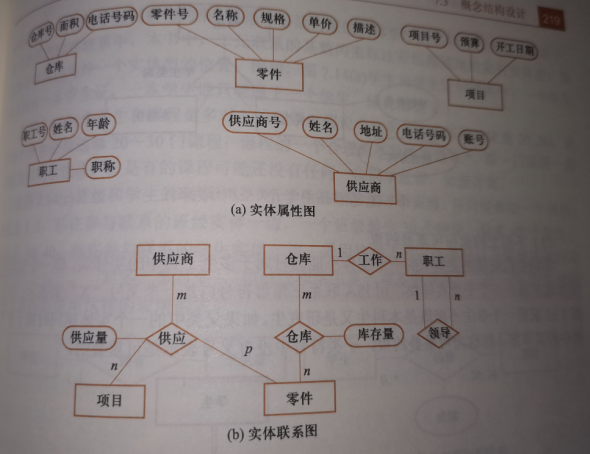
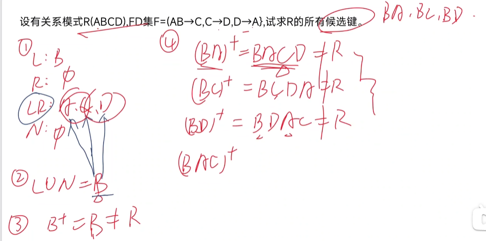

# 试卷分布
```
1.单选 30’
2.简答 20 会判断范式
3.程序填空 20
4.写sql 30

```


# 绪论
## 数据库
```
数据库是长期存储在计算机内、有组织的、可共享的大量数据的集合。数据库中的数据按一定的数据模型组织、描述和存储
有较小的冗余度，较高的数据独立性，易扩展性，可为各种用户共享
概括讲有（永久存储、有组织、可共享）三个基本特点
```
## 数据库系统
```
数据库系统是由数据库、数据库管理系统、应用程序和数据库管理员组成的存储管理处理和维护数据的系统
```

## 数据库系统的特点
```
1.数据结构化：是与文件系统的本质区别
2.数据的共享性搞、冗余度低且易扩充
3.数据独立性高：
    物理独立（应用程序与数据的物理存储独立）
    逻辑独立（应用程序与逻辑结构独立）
4.数据有数据库管理系统统一管理和控制
    数据的安全性保护
    数据的完整性检查
    并发控制
    数据库恢复
```

## 概念模型

### 实体
```
客观存在并可相互区别的事物
```

### 属性
```
实体所具有的某一特性
```

### 码
```
唯一标识实体的属性集
```

### E-R模型 p215


## 数据模型的组成要素
```
1.数据结构：描述数据库的组成对象以及对象之间的关系
2.数据操作：对数据库中各种对象的实例允许执行的操作的集合
3.数据的完整性约束条件：一组完整性条件
```


## 关系模型*
```
优缺点：
1.建立在严格的数学概念基础上
2.概念单一，结构清晰易懂
3.存取路径对用户透明
```

## 三级模式
```
数据库
↓
内模式：存储模式，一个数据库只有一个，是物理结构和存储方式的描述，是数据在数据库内部的组织方式
↓
模式：逻辑模式，是数据库中全体数据的逻辑结构和特征的描述
↓
外模式1、2、3...：用户模式，是用户使用的局部数据的逻辑结构和特征的描述
```

## 数据库系统的组成
```
硬件平台及数据库
软件
人员
```

# 关系数据库
## 基本概念
```
候选码：某一属性组的值能唯一标识一个元组，而其子集不能
主属性：候选码的各属性
非主属性：与之相反
```

## 基本关系的6条性质
```
1.列是同质的
2.不同的列可出自同一个域，不同的属性要给予不同的属性名
3.列的顺序无所谓
4.任意两个元组的候选码不能取同值
5.行的顺序无所谓
6.分量必须取原子值，每一个分量必须不可分
```

## 关系操作的特点：集合操作方式
```
即操作的对象和结果都是集合
```

## 关系的完整性
```
1.实体完整性：主属性不能取空值
2.参照完整性：外键引用的值必须真实存在，或者为空值
3.用户定义的完整性
```

## 集合运算
```
并：合并
差：去掉被减数的集合
交：同属于的集合
笛卡尔积：两个关系的两两组合
选择：σ条件下标（表名）  选择限制条件的元组，以行的角度 where
投影：∏属性名1，属性名2（表名） 选择若干列 select
连接：从笛卡尔积选择满足条件的元组
除：A/B A里B没有的属性 在共有属性里 A表包含B的所有
```

## mysql语法
```sql
DEFAULT 默认值：写在类型后 用于设置默认值

创建数据库:create database 数据库名;

删除数据库：DROP DATABASE 数据库名;

创建表：create table 表名 (
                            Sno Char(9), 
                            Sname Char(20)
                            ssex ENUM("男","女"),
                            sbirth DATE, 
                            collnum CHAR(3) unique, -- 唯一
                            PRIMARY KEY(Sno,Sname), -- 主键
                            FOREIGN KEY(collnum) REFERENCES coll(collnum) -- 外键
                                        )
删除表:DROP TABLE table_name;

修改表名：rename TABLE 原表名 TO 新表名;

修改表：
ALTER TABLE 表名
ADD column 属性名 属性类型 AFTER 原有属性名  --添加新列 在 原有属性名 之后
ADD FOREIGN KEY(collnum) REFERENCES coll(collnum) -- 添加外键
DROP column 属性名; -- 删除列
CHANGE 属性名 新名 新类型 constraint 约束名 check(新名 = "男" or 新名 = "女")
DROP constraint 约束名 --删除约束
MODIFY 属性名 新类型 AFTER 原有属性名 -- 修改属性类型放在 原有属性名 之后

展示表的结构：DESC 表名;

查询表：
SELECT CONCAT(tname,'老师'),DISTINCT 列名,TIMESTAMPDIFF(YEAR,tbirth,now()),YEAR(sbirth),ifnull(列名,"str"),group_concat(列名) --distinct 不重复 
from 表名
WHERE 条件
GROUP BY snum
HAVING AVG(score)>=90
ORDER BY COUNT(*) DESC
LIMIT 45000,100 --从45001行开始取100条记录。

-- 成绩在[90,100]之间。
WHERE score BETWEEN 90 AND 100 

-- 职称是副教授或工程师或教授 非空。
WHERE ttitle IN('副教授','工程师','教授') and ttitle IS NOT NULL

字符串：
-- 籍贯是浙江  %是多个字符 _是单个字符
WHERE sorigin LIKE'浙江%' 

rank 函数：
-- 用rank()和dense_rank()函数分别查看成绩的位次情况。 
-- 排序相同时都会重复 
-- rank() 总数不变，出现1、1、3；
-- dense_rank() 总数会减少，出现1、1、2 
SELECT RANK() OVER(ORDER BY score DESC),DENSE_RANK() OVER(ORDER BY score DESC) 

in 不相关 exist 相关：
-- 查询选修了‘B3503021’号课程的学生的学号和姓名（两种方法：相关与不相关）
-- 不相关
SELECT snum,sname
FROM s
WHERE snum IN(SELECT snum
              FROM sc
              WHERE cnum='B3503021')
-- 相关
SELECT snum,sname
FROM s
WHERE EXISTS(SELECT *
             FROM sc
             WHERE snum=s.snum and cnum='B3503021')

派生表：
-- 找出每个学生超过他自己选修课程平均成绩的学号、课程号和成绩（方法：派生表）
SELECT sc.snum,cnum,score
FROM sc,(SELECT snum,avg(score) FROM sc GROUP BY snum) AS sc1(snum,avgs)    
WHERE sc.snum=sc1.snum and score>avgs                   

创建视图：
-- 创建一个视图view_s，显示成绩等于100分的学生的学号、姓名、课程名和成绩。
CREATE VIEW view_s
AS
SELECT s.snum,sname,cname,score
FROM s,sc,c
WHERE s.snum=sc.snum and c.cnum=sc.cnum and score=100

删除视图：DROP VIEW view_s

插入记录：
-- 将新生（学号：202301010101；姓名：伍俊；性别：男；出生日期：2005-08-08；系编号：0501）的记录插入学生表，并为其选：c01 、c02与c03三门课程。
INSERT INTO s(snum,sname,ssex,sbirth,dnum)
VALUES('202301010101','伍俊','男','2005-08-08','0501')

INSERT INTO sc 
VALUES('202301010101','c01',NULL),('202301010101','c02',NULL),('202301010101','c03',NULL)

更新记录：
UPDATE 表名
SET 列名 = xxx
WHERE 条件

删除记录：
-- 学号为‘S030404’的学生由于退学，删除该学生记录及其选课记录。
DELETE FROM sc
WHERE snum='s030404'

DELETE FROM s
WHERE snum='s030404'

存储过程：
-- 创建一存储过程p_avgs()，学号作为输入参数，该同学的平均成绩作为输出参数。并调用该存储过程。
CREATE PROCEDURE p_avgs(IN sid CHAR(12),OUT avgs INT)
BEGIN
  SELECT AVG(score) INTO avgs FROM sc WHERE snum=sid;
END;

CALL p_avgs('201305010101',@s);

DROP PROCEDURE p_avg;
存储函数：
--创建一存储函数f_weigt，身高值作为参数，返回标准体重。（如果BMI=22为标准体重，则有如下等式：标准体重=身高（cm）*身高（cm）*22/10000）调用该存储函数。用存储过程p_weight实现相同功能，并调用该存储过程。
CREATE FUNCTION f_weight(height DECIMAL(4,1))
RETURNS DECIMAL(4,1)
BEGIN 
  RETURN(height*height*22/10000);
END;

SELECT f_weight(163);

DROP FUNCTION f_weight;

if判断：
DECLARE x DOUBLE DEFAULT 0;

IF ((SELECT avg(score) FROM sc WHERE snum=sn) IS NULL) THEN SET ans="缺考";
ELSEIF x<60 THEN SET ans="不及格";
ELSEIF x<70 THEN SET ans="及格";
ELSEIF x<80 THEN SET ans="中等";
ELSEIF x<90 THEN SET ans="良好";
ELSEIF x<=100 THEN SET ans="优秀";
END IF;

循环：
x:LOOP

 LEAVE x;--退出循环语句

END LOOP;

触发器：
CREATE TRIGGER tri_sc
AFTER INSERT
ON 表名
FOR EACH ROW
BEGIN

IF 条件 THEN SIGNAL SQLSTATE '45000' SET MESSAGE_TEXT='xxxx';
END IF;

END;

事务：
START TRANSACTION;
CREATE PROCEDURE xxx (IN ..., out ...)
BEGIN

    ROLLBACK;

    COMMIT;

END

union：
select ....
union
select ....
```

# 数据库安全
```
数据库的安全性是指保护数据库以防止不合法使用所造成的数据泄露、更改或破坏
```
## 存取控制
```sql
1.定义用户权限
2.合法权限检查

授权：
-- 把查询s表的权限给用户
grant select
on table s
to 用户名
with grant option -- 使该用户有分权能力

回收权限：
-- 收回修改学生学号的权限
revoke update(sno)
on table s
from 用户名 cascade --级联收回

show grants for 用户

create user 'xx@localhost' identified by '123456'

drop user 'xx@localhost' 

```

# 数据库完整性
```
数据的正确性：数据符合现实世界语义、反映实际情况
相容性：同一对象在不同表中符合逻辑
```

# 范式
```
第一范式：每一个分量不可分割
第二范式：去除部分函数依赖（A,B -> C  但是 A->C）
第三范式: 无传递依赖 
```

## 求候选码
```
找出
左属性:
右属性：
左右属性：
外部属性：
```
