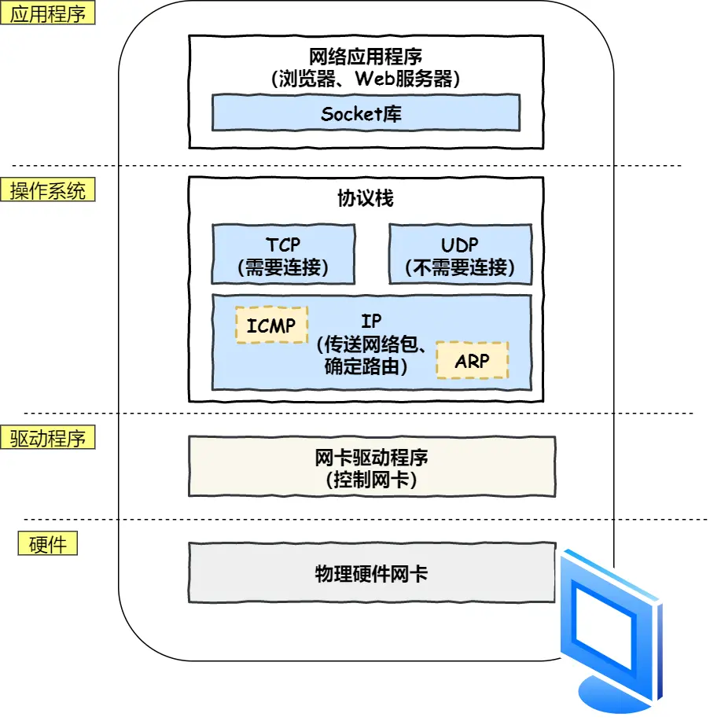

# 最大长度
 * 

# 3次握手
* 

# TCP/IP 网络模型有哪几层？
* 应用层：只需要专注于为用户提供应用功能，比如 HTTP、FTP、Telnet、DNS、SMTP等。
* 传输层：两个传输协议，TCP 和 UDP。传输层的报文中会携带端口号
* 网络层：IP 协议 
    * 寻址 ：**IP 地址** 与 **子网掩码** **相&** 获取**网络号和主机号**
    * 路由 ：通过路由算法决定下一步走哪条路径
    * IP 中还包括 ICMP 协议和 ARP 协议。
        * ICMP 用于告知网络包传送过程中产生的错误以及各种控制信息。
        * ARP 用于根据 IP 地址查询相应的以太网 MAC 地址。
* 网络接口层：在 IP 头部的前面加上 MAC 头部，并封装成数据帧

# 键入网址到网页显示，期间发生了什么？
* 1.解析 URL
* 2.生成 HTTP 请求消息
    * 
* 3.根据DNS服务器查询服务器域名对应的 IP 地址，有缓存则使用缓存 IP 地址
* 4.协议栈
    * 
    * 生成TCP报文：源端口号，目的端口号，序号(分包排序号)，确认序列(解决丢包)，状态位，窗口大小（流量控制），拥塞控制
        * 将 HTTP 数据 交给 TCP协议 后进行三次握手，根据MSS分包后加上TCP头部 交给IP协议
    * 生成IP报文： 源地址 IP ， 目标地址 IP
        * 因为 HTTP 是经过 TCP 传输的，所以在 IP 包头的协议号，要填写为 06（十六进制），表示协议为 TCP
    * 生成MAC报文：发送方 MAC 地址，接收方目标 MAC 地址(根据ARP协议)
* 5.网卡
    * 驱动获取网络包之后，会将其复制到网卡内的缓存区中，接着会在其开头加上报头和起始帧分界符，在末尾加上用于检测错误的帧校验序列FCS。
    * 最后网卡会将包转为电信号，通过网线发送出去。
* 6.交换机：根据 MAC 地址表查找 MAC 地址，然后将信号发送到相应的端口。没找到则广播
    * 交换机的端口不具有 MAC 地址
* 7.路由器：检查MAC地址符合后，路由表查询拆包重装转发
    * 路由器的各个端口都具有 MAC 地址和 IP 地址
* 8.目标服务器收到后返回ACK和回答
* 9.客户端结束连接发起四次挥手

# OSI七层模型
* 应用层，负责给应用程序提供统一的接口；
* 表示层，负责把数据转换成兼容另一个系统能识别的格式；
* 会话层，负责建立、管理和终止表示层实体之间的通信会话；
* 传输层，负责端到端的数据传输；
* 网络层，负责数据的路由、转发、分片；
* 数据链路层，负责数据的封帧和差错检测，以及 MAC 寻址；
* 物理层，负责在物理网络中传输数据帧；

# Linux 系统是如何收发网络包的？
* 
* 当有网络包到达时，会通过 DMA 技术，将网络包写入到指定的内存地址(Ring Buffer环形缓冲区)，接着网卡向 CPU 发起硬件中断，当 CPU 收到硬件中断请求后，根据中断表，调用已经注册的中断处理函数。
* 硬件中断处理函数会做如下的事情：
    * 需要先「暂时屏蔽中断」，表示已经知道内存中有数据了，告诉网卡下次再收到数据包直接写内存就可以了，不要再通知 CPU 了，这样可以提高效率，避免 CPU 不停的被中断。
    * 接着，发起「软中断」，然后恢复刚才屏蔽的中断。
* 软中断：
    * 内核中的 ksoftirqd 线程专门负责软中断的处理，当 ksoftirqd 内核线程收到软中断后，就会来轮询处理数据。
    * ksoftirqd 线程会从 Ring Buffer 中获取一个数据帧，用 sk_buff 表示，从而可以作为一个网络包交给网络协议栈进行逐层处理。
* 协议栈：在传输层和应用层之间有socket层
    * 传输层取出 TCP 头或 UDP 头，根据四元组「源 IP、源端口、目的 IP、目的端口」 作为标识，找出对应的 Socket，并把数据放到 Socket 的接收缓冲区。
    * 最后，应用层程序调用 Socket 接口，将内核的 Socket 接收缓冲区的数据「拷贝」到应用层的缓冲区，然后唤醒用户进程。

* 发送数据同理反之
    * 如果使用的是 TCP 传输协议发送数据，那么先拷贝一个新的 sk_buff 副本（确保重传）。
    * 为了在层级之间传递数据时，不发生拷贝，只用 sk_buff 一个结构体来描述所有的网络包
        * 
    * 后续在网卡触发软中断告诉网卡驱动发送
    * 发送完成后硬中断释放sk_buff副本和ringbuffer内存
    * 收到ack后释放原始 sk_buff 内存

* 发送网络数据的时候，涉及几次内存拷贝操作？
    * 第一次，调用发送数据的系统调用的时候，内核会申请一个内核态的 sk_buff 内存，将用户待发送的数据拷贝到 sk_buff 内存，并将其加入到发送缓冲区。

    * 第二次，在使用 TCP 传输协议的情况下，从传输层进入网络层的时候，每一个 sk_buff 都会被克隆一个新的副本出来。副本 sk_buff 会被送往网络层，等它发送完的时候就会释放掉，然后原始的 sk_buff 还保留在传输层，目的是为了实现 TCP 的可靠传输，等收到这个数据包的 ACK 时，才会释放原始的 sk_buff 。

    * 第三次，当 IP 层发现 sk_buff 大于 MTU 时才需要进行。会再申请额外的 sk_buff，并将原来的 sk_buff 拷贝为多个小的 sk_buff。